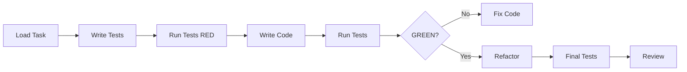

# Task Work - Unified Implementation Command

Execute complete implementation workflow including code generation, testing, and verification with support for multiple development modes.

## Usage
```bash
/task-work TASK-XXX [--mode=standard|tdd] [--language=auto|python|typescript|csharp] [--coverage-threshold=80] [--autobuild-mode]
```

## Examples
```bash
# Standard development (implementation + tests together)
/task-work TASK-042

# Test-Driven Development (tests first, then implementation)
/task-work TASK-042 --mode=tdd

# With custom coverage threshold
/task-work TASK-042 --coverage-threshold=90

# Fix only mode for blocked tasks
/task-work TASK-042 --fix-only

# AutoBuild mode (autonomous execution, no human interaction)
/task-work TASK-042 --design-only --autobuild-mode
```

## AutoBuild Mode Flag

`--autobuild-mode` is a composite flag for autonomous execution, equivalent to:
- `--no-questions` (skip Phase 1.6 clarification)
- `--skip-arch-review` (skip Phase 2.5B for complexity ≤5)
- `--auto-approve-checkpoint` (skip Phase 2.8 blocking wait)
- `--docs=minimal` (minimize documentation overhead)

Individual flags still work for manual fine-grained control.

**Note:** For BDD workflows (EARS → Gherkin → Implementation), use [require-kit](https://github.com/requirekit/require-kit) which provides complete requirements management and BDD generation.

## Development Modes

### Standard Mode (Default)
Traditional development approach:
1. Generate implementation based on requirements
2. Create comprehensive test suite
3. Run tests and verify quality
4. Update task state based on results

### TDD Mode (Test-Driven Development)
Follow Red-Green-Refactor cycle:
1. **RED**: Generate failing tests based on requirements
2. **GREEN**: Write minimal code to pass tests
3. **REFACTOR**: Improve code while keeping tests green
4. Verify coverage and quality gates

## Process Flow

### Step 1: Task Loading and Analysis
```yaml
Load task from: tasks/in_progress/TASK-XXX.md
Extract:
  - Requirements (EARS) - if require-kit installed
  - Gherkin scenarios - if require-kit installed
  - Acceptance criteria
  - Technology stack
```

### Step 1.5: Pre-Implementation Architecture Check (Complexity >= 7)

For high-complexity tasks (complexity score 7 or higher), an informational message displays available architecture context:

```
━━━━━━━━━━━━━━━━━━━━━━━━━━━━━━━━━━━━━━━
📐 PRE-IMPLEMENTATION ARCHITECTURE CHECK
━━━━━━━━━━━━━━━━━━━━━━━━━━━━━━━━━━━━━━━

This is a high-complexity task. Architecture context available:

  /impact-analysis TASK-XXX - see what this task affects
  /system-overview - review current architecture

Proceeding with task-work...
━━━━━━━━━━━━━━━━━━━━━━━━━━━━━━━━━━━━━━━
```

**Key Points:**
- Non-blocking - no user action required
- Informational only - does not affect workflow
- Automatically skipped for complexity < 7
- Gracefully skipped if Graphiti unavailable

### Step 1.6: Feature Diagram Review Prompt

If the task has a `parent_review` or `feature_id` field in its frontmatter, check whether the parent feature has an IMPLEMENTATION-GUIDE.md with a data flow diagram. If it does, display a brief contextual note showing where this task fits in the feature's data flow.

```
━━━━━━━━━━━━━━━━━━━━━━━━━━━━━━━━━━━━━━━
📊 FEATURE DATA FLOW CONTEXT
━━━━━━━━━━━━━━━━━━━━━━━━━━━━━━━━━━━━━━━

This task implements: [write path / read path / both]
Connected to: [list upstream/downstream components]

Review the full diagram: tasks/backlog/{feature-slug}/IMPLEMENTATION-GUIDE.md#data-flow

Proceeding with task-work...
━━━━━━━━━━━━━━━━━━━━━━━━━━━━━━━━━━━━━━━
```

**Key Points:**
- Non-blocking - no user action required
- Informational only - helps developer understand this task's place in the feature
- Automatically skipped if no parent feature or no diagram exists
- Reads from IMPLEMENTATION-GUIDE.md in the feature's subfolder

### Step 2: Mode-Specific Implementation

#### Standard Mode Flow

```mermaid
graph LR
    A[Load Task] --> B[Generate Code]
    B --> C[Generate Tests]
    C --> D[Run Tests]
    D --> E{Pass?}
    E -->|Yes| F[Check Coverage]
    E -->|No| G[Block Task]
    F --> H{≥80%?}
    H -->|Yes| I[Move to Review]
    H -->|No| J[Add Tests]
```


#### TDD Mode Flow



### Step 3: Test Execution

Automatic detection and execution based on project type:

#### Python Projects
```bash
pytest tests/ -v --cov=src --cov-report=term --cov-report=json
```

#### TypeScript/JavaScript Projects
```bash
npm test -- --coverage --json --outputFile=test-results.json
```

#### .NET Projects
```bash
dotnet test --collect:"XPlat Code Coverage" --logger:"json"
```

### Step 4: Quality Gates Evaluation

```yaml
quality_gates:
  tests:
    all_passing: required
    no_skipped: warning
  coverage:
    lines: ≥ 80%      # Required
    branches: ≥ 75%   # Required
    functions: ≥ 80%  # Warning
  performance:
    total_time: < 30s
    single_test: < 5s
```

### Step 5: State Management

Automatic state transitions based on results:
- ✅ All gates pass → `IN_REVIEW`
- ❌ Tests fail → `BLOCKED`
- ⚠️ Coverage low → Request more tests
- 🔄 Minor issues → `IN_REVIEW` with notes

## Output Format

### Success Output
```
✅ Task Work Complete - TASK-XXX

📊 Implementation Summary
Mode: TDD
Duration: 45 seconds
Files Created: 7
Tests Written: 15

🧪 Test Results
Total: 15 tests
Passed: 15 ✅
Failed: 0
Coverage: 92%

📈 Quality Gates
✅ All tests passing
✅ Coverage exceeds 80%
✅ No security issues
✅ Performance acceptable

🔄 Status Update
From: IN_PROGRESS
To: IN_REVIEW
Reason: All quality gates passed

Next: /task-review TASK-XXX
```

### Failure Output
```
❌ Task Work Failed - TASK-XXX

📊 Test Results
Total: 15 tests
Passed: 12 ⚠️
Failed: 3 ❌

Failed Tests:
1. test_auth_service.py::test_login
   AssertionError: Expected 200, got 401
   
2. test_auth_service.py::test_session
   TimeoutError: Exceeded 5s limit

📈 Quality Issues
❌ 3 tests failing
⚠️ Coverage at 75% (min: 80%)

🔄 Status Update
From: IN_PROGRESS
To: BLOCKED
Reason: Test failures

Fix issues and run:
/task-work TASK-XXX --fix-only
```

## Mode-Specific Templates

### TDD Mode Template
```python
# Step 1: Generate failing tests (RED)
def test_feature_requirement_1():
    """Test: {requirement_description}"""
    # This should fail initially
    service = FeatureService()
    result = service.process(test_data)
    assert result.success == True
    assert result.value == expected_value

# Step 2: Minimal implementation (GREEN)
class FeatureService:
    def process(self, data):
        # Minimal code to pass test
        return Result(success=True, value=expected_value)

# Step 3: Refactor (REFACTOR)
class FeatureService:
    def __init__(self, validator, repository):
        self.validator = validator
        self.repository = repository
    
    def process(self, data):
        # Improved implementation
        if not self.validator.is_valid(data):
            return Result(success=False, error="Invalid data")
        
        processed = self._transform(data)
        self.repository.save(processed)
        return Result(success=True, value=processed)
```


### Standard Mode Template
```typescript
// Implementation and tests created together

// Implementation
export class AuthenticationService {
  async login(credentials: LoginCredentials): Promise<AuthResult> {
    const user = await this.userRepo.findByEmail(credentials.email);
    if (!user || !await this.verifyPassword(credentials.password, user.password)) {
      return { success: false, error: 'Invalid credentials' };
    }
    
    const token = this.generateToken(user);
    return { success: true, token, user };
  }
}

// Tests
describe('AuthenticationService', () => {
  it('should authenticate valid user', async () => {
    const service = new AuthenticationService(mockRepo);
    const result = await service.login(validCredentials);
    expect(result.success).toBe(true);
    expect(result.token).toBeDefined();
  });
  
  it('should reject invalid credentials', async () => {
    const service = new AuthenticationService(mockRepo);
    const result = await service.login(invalidCredentials);
    expect(result.success).toBe(false);
    expect(result.error).toBe('Invalid credentials');
  });
});
```

## Error Handling

### Common Issues and Solutions

#### Issue: Import Errors (TDD Mode)
```
❌ ImportError: cannot import name 'ServiceClass'

This is expected in TDD RED phase.
Creating minimal implementation...
✅ Import errors resolved
```

#### Issue: Low Coverage
```
⚠️ Coverage at 72% (minimum: 80%)

Analyzing uncovered code...
Generating additional tests for:
- Error handling (lines 45-52)
- Edge cases (lines 78-85)

✅ Added 4 tests
✅ Coverage now: 86%
```

#### Issue: Slow Tests
```
⚠️ Test performance warning
- test_large_dataset: 7.2s (max: 5s)
- test_integration_flow: 6.1s (max: 5s)

Consider:
- Mocking external dependencies
- Using test fixtures
- Reducing test data size
```

## Advanced Options

### Fix-Only Mode
```bash
# Only fix failing tests, don't regenerate
/task-work TASK-XXX --fix-only
```

### Watch Mode
```bash
# Continuously run tests as changes are made
/task-work TASK-XXX --watch
```

### Dry Run
```bash
# Show what would be done without executing
/task-work TASK-XXX --dry-run
```

### Custom Language
```bash
# Override auto-detection
/task-work TASK-XXX --language=python
```

## Integration Points

### Git Integration
- Automatic commits after each phase (RED, GREEN, REFACTOR)
- Branch creation for task work
- PR/MR creation when ready for review

### CI/CD Integration
- Webhook triggers on task completion
- Test results posted to CI system
- Coverage reports uploaded

### Future MCP Integration
- Sync task status to Jira/Azure DevOps/Linear
- Post test results to external systems
- Update external tickets on completion

## Best Practices

1. **Always start with requirements**: Ensure task has clear acceptance criteria
2. **Choose the right mode**:
   - TDD for complex logic
   - Standard for straightforward implementations
   - For BDD workflows, use require-kit package
3. **Don't skip refactoring**: In TDD mode, always improve after GREEN
4. **Review test quality**: High coverage doesn't mean good tests
5. **Document failures**: When blocked, provide clear unblocking steps

## Migration from Old Commands

The following commands are deprecated but still functional:
- `/task-implement` → Use `/task-work`
- `/task-test` → Integrated into `/task-work`
- Individual test commands → Automatic in `/task-work`

These will show deprecation warnings and suggest using `/task-work` instead.
