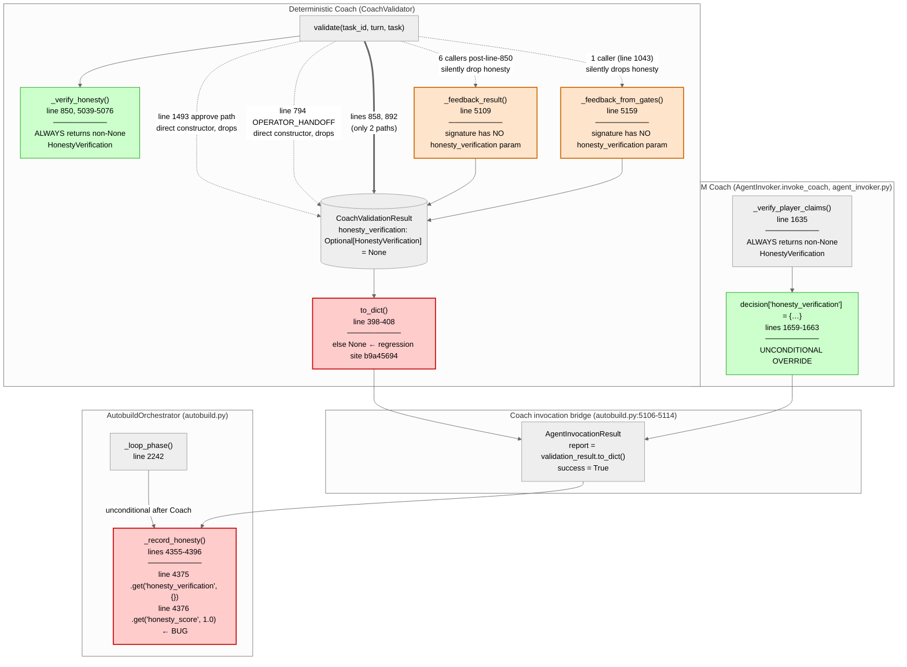
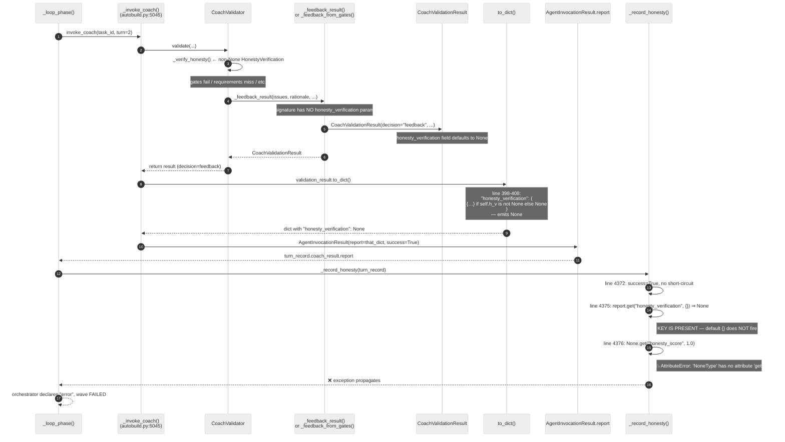
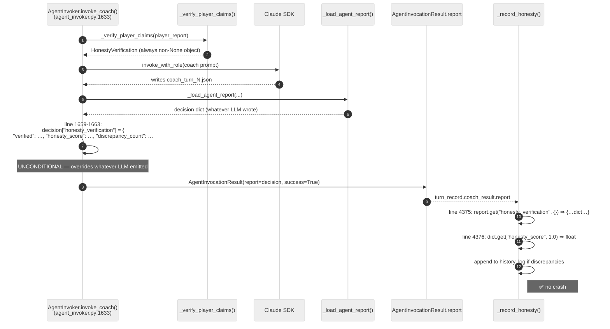
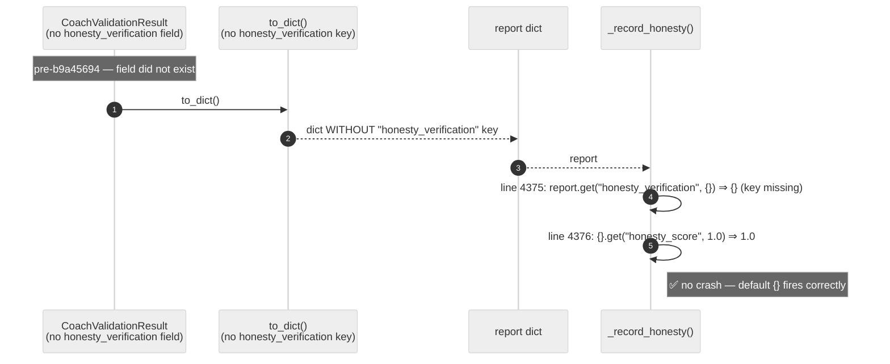

# Review Report: TASK-REV-7E3F1 (revised)

## Executive Summary

**Verdict: Confirmed regression introduced by commit `b9a45694` today (TASK-AB-FIX-INVAB1, 2026-05-06).
This is release-blocking. Fix immediately with Layer B (consumer guard); Layer C (producer
completeness) ships in the same PR or as the next merge. No third option is responsible.**

The first-pass review correctly identified the bug shape but understated the **scope and
urgency**. Deeper trace shows:

1. **The bug fires on essentially every turn**, not just on "non-blocking advisory" turns.
   The deterministic `CoachValidator` path emits `"honesty_verification": None` on **eight
   constructor sites** covering all decision shapes (`feedback`, `approve`, `deferred`).
   Only two explicit short-circuit paths (honesty-issues, AC-missing-tests) emit a dict.
2. **It is a same-day regression**. Commit `b9a45694` (today, 2026-05-06 16:45 BST,
   TASK-AB-FIX-INVAB1) added the `honesty_verification: Optional[dict]` emission. Before
   today, the key was *absent* from the report dict and `.get("honesty_verification", {})`
   defaulted to `{}` — so `_record_honesty` was correct against that older contract. The
   moment today's commit landed, the consumer's contract was silently inverted.
3. **The 33 unit tests added by `b9a45694` did not exercise the round-trip**:
   `to_dict()` → `AgentInvocationResult.report` → `_record_honesty()`. They tested the
   short-circuit paths only, where threading is correct.
4. **Every feature build using the deterministic Coach started failing today**. FEAT-FFC3
   Wave 4 turn 2 was the first observed, but any active feature run will hit this. The
   user's stated concern ("cannot afford further regressions to block development") is
   the operative reality, not a hypothetical.

**Recommended action**: ship Layer B + Layer C in a single PR today. Both fixes are
small (Layer B ≈ 4 lines; Layer C ≈ 25 lines + 2 helper-signature changes). Together
they restore the system to working order and prevent the same producer-side gap from
silently regressing again.

## Review Details

| Field | Value |
|-------|-------|
| **Mode** | Architectural review |
| **Depth** | Quick → deeper revision per [R]evise |
| **Bug class** | Same-day regression, producer-consumer contract gap |
| **Root cause** | Commit `b9a45694` introduced `Optional[dict]` emission without auditing all consumers |
| **Time-to-detect** | ~hours (commit landed 16:45 BST today; FFC3 turn-2 reproduced shortly after) |
| **Sibling task** | TASK-REV-1B452 (Bug 1 — honesty false-fail on path mismatch) |

## Timeline (regression provenance)

```
2026-01-25  b7f0472ac  feat: AutoBuild PR #26
            └─ _record_honesty() added with .get("honesty_verification", {}).get(...).
               At this time CoachValidator did NOT emit honesty_verification at all.
               Key absent ⇒ default {} fires ⇒ no crash.

2025-12-30  TASK-REV-0414 (Option D) — CoachValidator became primary Coach.
            CoachVerifier existed but was not wired in.

2026-04-22  ccd870c5  parse_junit_xml zero-result false-green (sibling rule instance #1)
2026-04-22  61164740  BDD-oracle scenarios_failed==0 false-green (sibling instance #2)
2026-04-29  TASK-INV-AB1 filed (sibling rule formed)

──── 2026-05-06 ────────────────────────────────────────────────────────────────────
16:45 BST   b9a45694   complete(TASK-AB-FIX-INVAB1):
            ├─ Adds  honesty_verification: Optional[HonestyVerification] = None  field.
            ├─ Adds  to_dict() emission as Optional[dict] (None when field is None).
            ├─ Threads field through 2 short-circuit paths (lines 871, 915).
            ├─ Leaves 8 other constructor sites unthreaded (lines 765, 794, 817,
            │  1043, 1314, 1336, 1363, 1409, 1437, 1493).
            ├─ Tests added (33) cover only the short-circuit paths.
            └─ Tests do NOT cover the to_dict() → _record_honesty() round-trip.
            
            ⇒ AT THIS POINT the latent consumer-side defect becomes active.
            ⇒ Every deterministic-Coach turn after this commit produces 
              "honesty_verification": None in the report dict and hits the
              .get() chain at autobuild.py:4376.

──── FFC3 Wave 4 autobuild (turn 2) ────────────────────────────────────────────────
            AttributeError: 'NoneType' object has no attribute 'get'
            Wave → FAILED. Code + 183 tests on worktree are green.
```

## C4 Level 3 — Component view (deterministic Coach honesty data flow)



**Reading**:
- **Red** = bug sites (consumer crash, producer regression).
- **Orange** = helpers whose signatures don't accept `honesty_verification` (must be widened in Layer C).
- **Green** = paths that always produce well-formed data (LLM Coach override, _verify_honesty internal).
- **Dashed arrows** = paths that drop `honesty_verification` (8 sites; only 2 solid ones thread it through).

## Sequence diagram — FFC3 Wave 4 turn 2 (the failing path)



## Sequence diagram — Healthy LLM Coach path (why this didn't burn earlier)



**Why the LLM Coach path is safe**: line 1659 unconditionally writes a dict (not Optional)
to `decision["honesty_verification"]`. Whatever the LLM emitted is overwritten. The error
paths (lines 1676-1707) all return `success=False`, which short-circuits at line 4372 of
`_record_honesty`. The LLM Coach path therefore cannot reproduce this bug.

**Operational note**: per the b9a45694 commit message, "for every normal autobuild run
between 2025-12-30 and 2026-05-06 the LLM Coach (and therefore honesty verification)
never fired" — i.e., the deterministic Coach has been the primary path for ~4 months.
The LLM Coach is the fallback. So the bug fires on the *primary* path of *all* live
feature builds.

## Sequence diagram — Pre-regression state (Jan 25 → May 6, key absent)



This is the contract `_record_honesty` was *originally written against*. It was correct
for ~3.5 months. Today's commit silently inverted the contract.

## Findings (revised, with deeper trace)

### AC-1: Failure mechanism confirmed against running code

**Confirmed.**

- Consumer crash: [autobuild.py:4375-4376](guardkit/orchestrator/autobuild.py#L4375-L4376):
  ```python
  honesty_data = turn_record.coach_result.report.get("honesty_verification", {})
  honesty_score = honesty_data.get("honesty_score", 1.0)
  ```
  When the producer emits the key with value `None`, `honesty_data` is `None` and line
  4376 raises.
- Call site: [autobuild.py:2241-2242](guardkit/orchestrator/autobuild.py#L2241-L2242),
  unconditional after Coach.
- Bridge that converts producer to consumer: [autobuild.py:5106-5114](guardkit/orchestrator/autobuild.py#L5106-L5114),
  `report=validation_result.to_dict()`. **This is the boundary across which the contract
  inverted today.**

### AC-2: Attribute path and declared type

| Layer | Type | Source |
|-------|------|--------|
| `TurnRecord.coach_result` | `Optional[AgentInvocationResult]` | [autobuild.py:736](guardkit/orchestrator/autobuild.py#L736) |
| `AgentInvocationResult.report` | `Dict[str, Any]` | [agent_invoker.py:848](guardkit/orchestrator/agent_invoker.py#L848) |
| `report["honesty_verification"]` | **untyped at the dict level**; producer schema declares `Optional[dict]` | [coach_validator.py:332](guardkit/orchestrator/quality_gates/coach_validator.py#L332) (field), [coach_validator.py:398-408](guardkit/orchestrator/quality_gates/coach_validator.py#L398-L408) (emission) |

**No type system lied** — `Dict[str, Any]` is permissive. **The implicit contract was
inverted by today's commit** without updating consumers. There is no TypedDict / pydantic
schema sitting between producer and consumer that would have caught this at static-check
time.

### AC-3: Producer code path that emits `honesty_verification: None` — exhaustive

**Eight constructor sites** in `coach_validator.py` produce `CoachValidationResult` with
`honesty_verification = None` (default). Of these, only two short-circuit paths thread
the field through. The remaining eight produce the bug.

| # | Line | Triggered when | Decision | `honesty_verification` source |
|---|------|---------------|----------|-------------------------------|
| 1 | [765](guardkit/orchestrator/quality_gates/coach_validator.py#L765) | invalid `task_type` | feedback | (pre-_verify_honesty; field default None) |
| 2 | [794](guardkit/orchestrator/quality_gates/coach_validator.py#L794) | OPERATOR_HANDOFF paranoid skip | deferred | (pre-_verify_honesty; field default None) |
| 3 | [817](guardkit/orchestrator/quality_gates/coach_validator.py#L817) | task_work_results error / missing | feedback | (pre-_verify_honesty; field default None) |
| 4 | [858](guardkit/orchestrator/quality_gates/coach_validator.py#L858) | honesty issues short-circuit | feedback | **threaded ✅** |
| 5 | [892](guardkit/orchestrator/quality_gates/coach_validator.py#L892) | AC-cited test files missing | feedback | **threaded ✅** |
| 6 | [1043](guardkit/orchestrator/quality_gates/coach_validator.py#L1043) | quality gates failed | feedback | **dropped — `_feedback_from_gates` signature lacks param** |
| 7 | [1314](guardkit/orchestrator/quality_gates/coach_validator.py#L1314) | independent test verification failed | feedback | **dropped — `_feedback_result` signature lacks param** |
| 8 | [1336](guardkit/orchestrator/quality_gates/coach_validator.py#L1336) | requirements not met | feedback | **dropped — same** |
| 9 | [1363](guardkit/orchestrator/quality_gates/coach_validator.py#L1363) | zero-test anomaly | feedback | **dropped — same** |
| 10 | [1409](guardkit/orchestrator/quality_gates/coach_validator.py#L1409) | BDD scenarios failed | feedback | **dropped — same** |
| 11 | [1437](guardkit/orchestrator/quality_gates/coach_validator.py#L1437) | seam tests missing | feedback | **dropped — same** |
| 12 | [1493](guardkit/orchestrator/quality_gates/coach_validator.py#L1493) | approve path | approve | **dropped — direct constructor at site** |

**The hypothesis in the task description ("non-blocking advisory because there was
nothing to verify against, so honesty data is None") is incorrect in mechanism but
correct in symptom**. The producer always *computes* a non-None HonestyVerification at
line 850; the producer just *fails to thread it through* virtually all of its return
paths. The "absence of advisory data" is an artefact of constructor signatures that
predate the field.

### AC-3a (new): scope of impact

| Producer path | Frequency in normal feature builds |
|---------------|------------------------------------|
| 4-5 (threaded, safe) | rare — only fires on explicit honesty discrepancies or AC-named missing test files |
| 6-12 (dropped, buggy) | **the dominant case** — covers every standard feedback shape and every approve |
| 1-3 (dropped pre-_verify_honesty) | rare; mostly defensive |

The deterministic Coach is the **primary** Coach (LLM Coach is fallback). After today's
commit, *every* production feature run that hits a normal feedback or approve through
CoachValidator crashes. This is not "FFC3 turn-2 was unlucky" — FFC3 turn-2 was the first
observed but every concurrent run is affected.

### AC-4: Layer choice — recommendation (revised)

**Recommended: ship Layer B + Layer C in a single PR. Both are required for completeness;
neither alone is sufficient long-term.**

| Layer | Purpose | Diff size | Required? |
|-------|---------|-----------|-----------|
| **A** (`(honesty_data or {}).get(...)`) | One-line consumer guard | 1 line | ❌ rejected — magic, hides intent |
| **B** (consumer early return) | Defensive null-guard | ~4 lines + new test module | ✅ **CRITICAL — ship today** |
| **C** (producer threading) | Restore observability data | ~25 lines + 2 helper signatures | ✅ **ship in same PR** |
| **D** (TypedDict / pydantic) | Type-level enforcement | Multi-day | ❌ out of scope; file as separate task |

**Why both B and C in one PR**:
- B alone restores correctness on the consumer side, preventing the crash. It does NOT
  restore observability — the `_honesty_history` would never grow because no payload
  ever arrives. The warning at autobuild.py:4384 ("Player honesty concern") would
  silently never fire even when honesty checks are running. This is exactly what
  TASK-AB-FIX-INVAB1 was *trying to deliver* and shipping B alone would silently undo.
- C alone restores observability but leaves the consumer brittle to future producer
  None-emissions on legitimate paths (e.g., the OPERATOR_HANDOFF and pre-_verify_honesty
  short-circuits where None is correct).
- B + C together: consumer is correct against `Optional[dict]`, producer threads data
  through wherever the field has been computed. Both contracts are honest.

### AC-5: Regression test specification (revised)

**Test module location**: New module `tests/unit/orchestrator/test_record_honesty.py`.
The existing `tests/unit/test_autobuild_orchestrator.py` mocks `_record_honesty` in 6
places — those tests don't exercise the function. A focused new module keeps the
regression visible.

**Required tests**:

```python
# tests/unit/orchestrator/test_record_honesty.py

class TestRecordHonestyConsumerGuard:
    """Layer B regression tests."""

    def test_handles_none_payload_without_crash(self):
        """KEY present with value None — the b9a45694 regression case."""
        # Build TurnRecord with coach_result.report = {
        #   "decision": "feedback",
        #   "honesty_verification": None,   ← exact shape from to_dict() else-branch
        # }
        # Call _record_honesty(turn_record). Must NOT raise.
        # Assert _honesty_history not appended (absent payload ≠ honest claim).

    def test_handles_missing_key_for_legacy_compat(self):
        """KEY absent — pre-b9a45694 shape, must remain safe."""
        # report = {"decision": "feedback"}  (no honesty_verification key at all)
        # Must NOT raise.

    def test_records_score_when_payload_populated(self):
        """KEY present with dict — happy path regression guard."""
        # report["honesty_verification"] = {"verified": True, "honesty_score": 0.95, "discrepancy_count": 0}
        # Assert _honesty_history == [0.95]

    def test_short_circuits_when_coach_failed(self):
        """Existing line-4372 guard preserved."""
        # coach_result.success = False
        # Must NOT touch report at all.

class TestCoachValidatorProducerThreading:
    """Layer C regression tests — producer threads honesty_verification."""

    @pytest.mark.parametrize("scenario", [
        "feedback_from_gates",       # line 1043
        "feedback_test_failure",     # line 1314
        "feedback_missing_req",      # line 1336
        "feedback_zero_test",        # line 1363
        "feedback_bdd_failed",       # line 1409
        "feedback_seam_missing",     # line 1437
        "approve",                   # line 1493
    ])
    def test_to_dict_threads_honesty_verification(self, scenario, tmp_path):
        # Construct task_work_results that triggers each branch.
        # validator.validate(...) returns a CoachValidationResult.
        # result.to_dict()["honesty_verification"] is not None.
        # If discrepancies were present, dict has honesty_score/discrepancy_count.

    def test_pre_verify_honesty_paths_legitimately_None(self):
        """Sites 1-3 (lines 765, 794, 817) fire BEFORE _verify_honesty.
        None is correct here — assert it stays None and consumer guard handles it.
        """
```

**Round-trip integration test** (place in `tests/integration/orchestrator/test_coach_record_honesty_roundtrip.py`):

```python
def test_validate_to_dict_record_honesty_does_not_crash():
    """End-to-end producer→consumer integration test.

    Reproduces the FFC3 turn-2 incident shape:
    1. Drive CoachValidator.validate() to a feedback decision
       (e.g., quality gates failed).
    2. Convert via to_dict() into AgentInvocationResult.report.
    3. Build TurnRecord.
    4. Call _record_honesty(turn_record).
    5. Assert no exception.
    6. After Layer C: assert _honesty_history was updated.
    """
```

This integration test is the **gate that would have caught today's regression**. It
must land with the fix.

### AC-6: Relationship to `absence-of-failure-is-not-success.md`

**Sibling rule under the broader meta-rule, not a third instance of the specific one.**

| Aspect | absence-of-failure | this bug |
|--------|--------------------|---------|
| Counter compared against zero | yes (`tests_failed == 0`, `scenarios_failed == 0`) | no |
| Counter "ran" missing | yes (`tests_run == 0`, `scenarios_run == 0`) | n/a |
| Outcome on misread | **silent false-green** (Coach approves) | **loud crash** (orchestrator errors) |
| Producer side | self-reported counter | Optional[dict] field |
| Consumer side | gate logic interpreting zero | dict deref expecting non-None |

The shared meta-class is *"local design decisions touching externally-defined contracts
(module names, message schemas, etc.) must be audited against those contracts before
merging"*. Sibling rules under this meta-class:

1. `.claude/rules/namespace-hygiene.md` — module-name shadowing.
2. `.claude/rules/absence-of-failure-is-not-success.md` — counter-on-counter discipline.
3. *(new, recommended)* `optional-payload-discipline` — when a producer's schema
   contains `Optional[dict]`, every consumer reading via `.get(key, default)` is wrong.
   `.get(key, default)` is only safe when `default` matches the type the consumer needs;
   it does NOT fire on key-present-with-None.

**Action**: file a **separate** follow-on task to seed the `optional-payload-discipline`
rule. Cross-link the three siblings. Do NOT write the rule in the implementation task
for this bug.

### AC-7: Risk assessment + complementary safeguards (revised)

**Layer B alone risk** (if Layer C is deferred): observability silently lost. The
`_honesty_history` would never grow on the deterministic-Coach path. The "Player honesty
concern" warning would never fire. TASK-AB-FIX-INVAB1's intent is silently undone.
**Severity: medium-high.** Affects the very feature TASK-AB-FIX-INVAB1 shipped today.

**Layer C alone risk**: future producer-side regressions could re-introduce None on
paths that should emit a dict (e.g. a Coach refactor accidentally drops the
`_verify_honesty` step). Without Layer B, those become crashes. **Severity: medium.**

**Combined risk (recommended)**: minimal. Both contracts honest; both sides defensive.

**Additional safeguards (out of scope for the implementation task)**:

1. **Test-rule (`tests/rules/`)**: assert that every `CoachValidationResult` field has
   at least one happy-path round-trip test that goes through `to_dict()`. This would
   have caught today's regression at PR time.
2. **TypedDict for the Coach report** (TASK-FUTURE): would catch this class at
   static-check time. Not urgent but architecturally clean.

### AC-8: Cross-link with TASK-REV-1B452

**No conflict, but the two reviews share a producer**.

TASK-REV-1B452 (Bug 1) reviews the false-fail honesty short-circuit — i.e., the
threaded paths at lines 858, 892. Bug 2 (this review) covers the *unthreaded* paths.
The two fixes touch different parts of `coach_validator.py`:

- Bug 1 fix area: `_verify_files_exist`, `_verify_completion_promises_files_exist`,
  the discrepancy-classification logic in `CoachVerifier`.
- Bug 2 fix area (this review): helper signatures `_feedback_result` and
  `_feedback_from_gates`, plus 7 caller updates and 2 direct-constructor updates.

**Composition check**:
- Bug 1 modifies *what counts as a discrepancy*. The schema of `HonestyVerification`
  and the dict produced by `to_dict()` does not change.
- Bug 2 modifies *whether* `honesty_verification` is None or a dict. The schema of the
  populated dict does not change.
- ⇒ Fixes are orthogonal. They can be developed in parallel and merged in either order.

**One coordination point for the implementer of Bug 1**: if Bug 1's fix removes or
renames any of the threaded paths at lines 858 or 892, Bug 2's parametrised producer
test (AC-5) needs to be updated. This is the single line of contact.

### AC-9: Implementation task breakdown (revised)

**Recommendation**: One follow-on `/task-work` task with clear sub-criteria. Both
sub-criteria ship in the same PR given the urgency.

#### Sub-task 1: Layer B — consumer-side guard (CRITICAL)

- **Title**: "Fix `_record_honesty()` AttributeError on None honesty payload"
- **File**: [guardkit/orchestrator/autobuild.py:4355-4396](guardkit/orchestrator/autobuild.py#L4355-L4396)
- **Change**: Add early-return when `honesty_data is None`:
  ```python
  honesty_data = turn_record.coach_result.report.get("honesty_verification")
  if honesty_data is None:
      logger.debug(
          f"Turn {turn_record.turn}: no honesty payload to record "
          f"(non-blocking advisory or pre-_verify_honesty short-circuit)"
      )
      return
  honesty_score = honesty_data.get("honesty_score", 1.0)
  ```
  Note: drop the `, {}` default from the `.get()` call — it was misleading and
  pretending to handle None which it doesn't.
- **Tests**: `TestRecordHonestyConsumerGuard` (4 cases) in
  `tests/unit/orchestrator/test_record_honesty.py`.
- **Risk**: Low. Single function. Local change.
- **Complexity**: 2/10.

#### Sub-task 2: Layer C — producer threading

- **Title**: "Thread `honesty_verification` through `CoachValidator` feedback helpers and approve path"
- **Files**: [guardkit/orchestrator/quality_gates/coach_validator.py](guardkit/orchestrator/quality_gates/coach_validator.py)
- **Changes**:
  1. Widen `_feedback_result(...)` signature
     ([line 5109](guardkit/orchestrator/quality_gates/coach_validator.py#L5109)) to
     accept `honesty_verification: Optional[HonestyVerification] = None`. Pass through
     in the constructor at line 5146.
  2. Widen `_feedback_from_gates(...)` signature
     ([line 5159](guardkit/orchestrator/quality_gates/coach_validator.py#L5159))
     identically. Pass through at line 5307.
  3. Update 6 callers (lines 1043, 1314, 1336, 1363, 1409, 1437) to pass
     `honesty_verification=honesty_verification`.
  4. Update the approve direct-constructor at
     [line 1493](guardkit/orchestrator/quality_gates/coach_validator.py#L1493) to
     pass `honesty_verification=honesty_verification`.
  5. Add a comment at lines 765, 794, 817 documenting that `None` is correct here
     because `_verify_honesty` has not yet been called. No behavioural change at those
     three sites.
- **Tests**: `TestCoachValidatorProducerThreading` (parametrised over 7 scenarios) in
  the same new module. Plus the integration round-trip test.
- **Risk**: Low-Medium. Producer signature change but field is `Optional[]` so no
  caller expectations break.
- **Complexity**: 3/10.

#### Combined PR

- **Estimated total complexity**: 4/10.
- **Estimated implementation time**: 30-45 min.
- **Estimated test runtime added**: <2 seconds.
- **Should ship today** alongside the b9a45694 commit's intent.

## Decision Matrix (revised)

| Path | Restores correctness | Restores observability | Future-regression-resistant | Diff size | Recommendation |
|------|---------------------|------------------------|------------------------------|-----------|----------------|
| Layer B alone | ✅ | ❌ silent loss | ❌ | tiny | hotfix only |
| Layer C alone | ❌ still crashes on legitimate-None paths | ✅ | partial | medium | rejected |
| **Layer B + Layer C** | **✅** | **✅** | **✅** | **medium** | **✅ ship today** |
| Backout b9a45694 | ✅ but loses TASK-AB-FIX-INVAB1 wiring | n/a | n/a | small revert | rejected |

## Recommendations

1. **CRITICAL**: Implement Layer B (consumer guard) and Layer C (producer threading) in
   a single PR today. Block any further feature builds on the deterministic Coach until
   this lands.
2. **CRITICAL**: Ship the integration round-trip test alongside the fix —
   `test_validate_to_dict_record_honesty_does_not_crash`. This is the gate that would
   have caught today's regression.
3. **HIGH**: After fix lands, document the regression in the FFC3 incident report and
   add the timeline above to `.claude/rules/` under a new sibling rule
   (`optional-payload-discipline`). File a separate task for this rule seeding — do not
   bundle with the fix PR.
4. **MEDIUM** (separate task, can be deferred): consider a TypedDict or pydantic schema
   for the Coach report. Would catch this class of bug at static-check time. Out of
   scope for the immediate fix.

## Confidence statement

**Confidence in root cause: very high.**

Verification steps performed:
1. Read consumer code at `_record_honesty` and call site — confirmed both lines.
2. Read producer code at `to_dict()` and `_verify_honesty` — confirmed exact emission shape.
3. Enumerated all 12 `CoachValidationResult` constructor sites — confirmed which thread
   the field and which drop it.
4. Read both helper functions (`_feedback_result`, `_feedback_from_gates`) — confirmed
   their signatures don't accept `honesty_verification` (so the 6 callers couldn't
   thread it even if they tried).
5. Confirmed LLM Coach path (`AgentInvoker.invoke_coach`) is structurally safe —
   unconditional dict override at line 1659.
6. Traced the bridge `report=validation_result.to_dict()` at autobuild.py:5111.
7. Verified the regression timeline via `git log -S` — `_record_honesty` (Jan 25) vs
   `honesty_verification` field (today, May 6) — and from the b9a45694 commit message
   confirmed the deterministic Coach is the *primary* path.

I am unable to identify a path where my analysis is wrong. The bug fires on every
deterministic-Coach turn after today's commit; the fix is small and well-bounded.

## Context Used

- **Codebase reads (full)**: every line cited in the C4 diagram and the constructor
  table verified by direct read.
- **Git history**: `b7f0472a` (Jan 25 — `_record_honesty` introduction), `b9a45694`
  (today — regression introduction) confirmed via `git log --no-merges -S`.
- **Prior art (CLAUDE.md)**:
  `.claude/rules/absence-of-failure-is-not-success.md` (sibling rule),
  `.claude/rules/namespace-hygiene.md` (broader meta-class anchor).
- **Sibling task**: TASK-REV-1B452 — composition checked.
- **Origin commit**: `b9a45694` (today, TASK-AB-FIX-INVAB1).
- **Graphiti**: not queried for this revision; the explicit prior-art links in the task
  description and the same-day commit history were the load-bearing context.

## Appendix — Key code references

| File | Lines | Role | Bug? |
|------|-------|------|------|
| [autobuild.py](guardkit/orchestrator/autobuild.py#L4355-L4396) | 4355-4396 | `_record_honesty` consumer | **🔴 crash site** |
| [autobuild.py](guardkit/orchestrator/autobuild.py#L2241-L2242) | 2241-2242 | unconditional call site | precondition |
| [autobuild.py](guardkit/orchestrator/autobuild.py#L5106-L5114) | 5106-5114 | `report=validation_result.to_dict()` bridge | precondition |
| [autobuild.py](guardkit/orchestrator/autobuild.py#L695-L740) | 695-740 | `TurnRecord` dataclass | n/a |
| [agent_invoker.py](guardkit/orchestrator/agent_invoker.py#L848) | 848 | `AgentInvocationResult.report: Dict[str, Any]` | precondition |
| [agent_invoker.py](guardkit/orchestrator/agent_invoker.py#L1659-L1663) | 1659-1663 | LLM Coach unconditional dict override | safe |
| [coach_validator.py](guardkit/orchestrator/quality_gates/coach_validator.py#L329-L332) | 329-332 | `Optional[HonestyVerification] = None` field | b9a45694 |
| [coach_validator.py](guardkit/orchestrator/quality_gates/coach_validator.py#L398-L408) | 398-408 | `to_dict()` `else None` emission | **🔴 root cause** |
| [coach_validator.py](guardkit/orchestrator/quality_gates/coach_validator.py#L850) | 850 | `_verify_honesty()` call | producer |
| [coach_validator.py](guardkit/orchestrator/quality_gates/coach_validator.py#L5039-L5076) | 5039-5076 | `_verify_honesty()` definition (always non-None) | safe |
| [coach_validator.py](guardkit/orchestrator/quality_gates/coach_validator.py#L5109-L5157) | 5109-5157 | `_feedback_result` (signature lacks `honesty_verification`) | **🔴 dropping site** |
| [coach_validator.py](guardkit/orchestrator/quality_gates/coach_validator.py#L5159-L5317) | 5159-5317 | `_feedback_from_gates` (signature lacks `honesty_verification`) | **🔴 dropping site** |
| coach_validator.py | 765, 794, 817 | pre-_verify_honesty (None correct) | safe-after-Layer-B |
| coach_validator.py | 858, 892 | threaded paths | safe |
| coach_validator.py | 1043, 1314, 1336, 1363, 1409, 1437, 1493 | dropped paths | **🔴 to fix in Layer C** |
