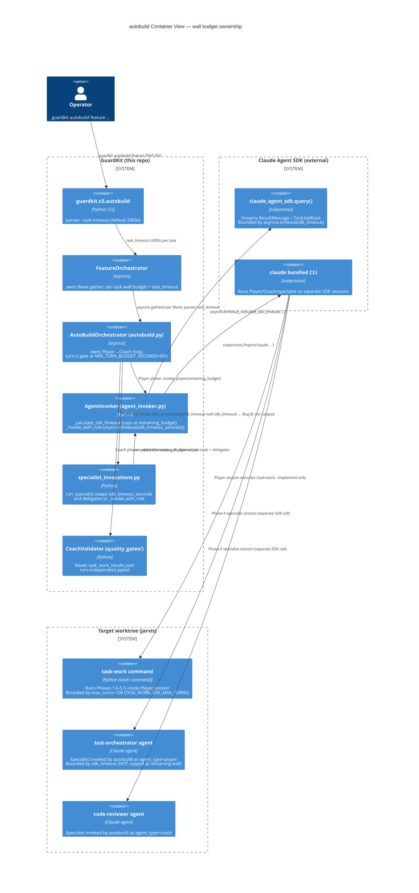
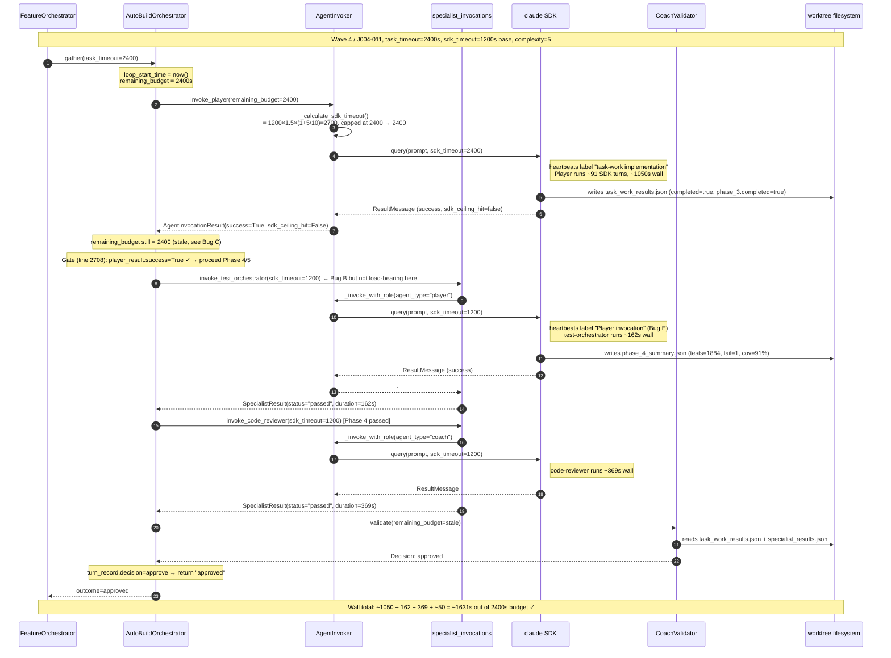
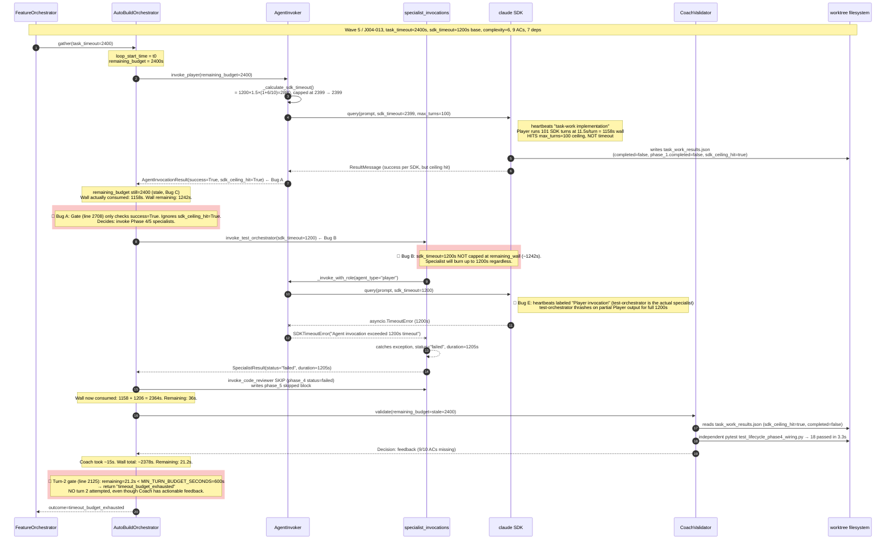
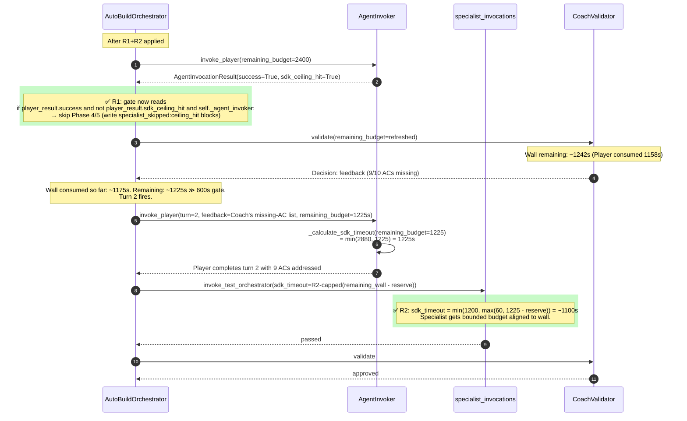

# Diagnostic Review: TASK-J004-013 `timeout_budget_exhausted` (revised)

> **v2 revision note (top)**: v1 of this report mis-attributed the failure to multiple compounding orchestrator bugs that turned out to be partially already-fixed. The deeper investigation in v2 confirms a **simpler, more concentrated root cause**: a single missing cap on the orchestrator-side specialist's SDK timeout, combined with the orchestrator admitting Player ceiling-hit results to Phase 4/5 hand-off. Two bugs, two short fixes, both with existing test coverage. Lower risk, higher leverage than v1's six-fix roadmap suggested. The label-confusion that made v1's diagnosis ambiguous is itself a fixable defect (Bug E). v1's R4 (`task_timeout` complexity-scaling) is **withdrawn — already implemented** for the Player path; v2's R4 instead targets `TASK_WORK_SDK_MAX_TURNS` (the actual binding constraint).

---

## §0 TL;DR (revised)

**Single root cause, decomposed into two compounding orchestrator gaps:**

1. **Bug A (CRITICAL)**: When the Player hits its 100-turn SDK ceiling, the orchestrator still considers the result successful (`player_result.success=True`, [agent_invoker.py:1468](../../guardkit/orchestrator/agent_invoker.py#L1468)) and proceeds to invoke Phase-4/5 specialists ([autobuild.py:2708](../../guardkit/orchestrator/autobuild.py#L2708)). The `sdk_ceiling_hit` flag is on the result object but **not consulted by the specialist gate**.
2. **Bug B (CRITICAL)**: The orchestrator-invoked specialists are passed `sdk_timeout=self.sdk_timeout` (1200s default) directly, **not capped at remaining wall**. The cap-to-remaining-wall helper `_calculate_sdk_timeout` exists ([agent_invoker.py:3795-3877](../../guardkit/orchestrator/agent_invoker.py#L3795)) and is used by the Player path, but the specialist call sites at [autobuild.py:2781,2795](../../guardkit/orchestrator/autobuild.py#L2781) bypass it.

**Either fix alone would have saved TASK-J004-013.** Both have existing mocked CI-runnable test coverage that pins the current contract:

- **R1 (fixes Bug A)**: Add a `sdk_ceiling_hit` short-circuit at [autobuild.py:2708](../../guardkit/orchestrator/autobuild.py#L2708). Six-line change. Tests at [`tests/integration/test_autobuild_phase_4_5_orchestration.py`](tests/integration/test_autobuild_phase_4_5_orchestration.py) cover the gate; new test for ceiling-hit short-circuit slots in.
- **R2 (fixes Bug B)**: Route specialist `sdk_timeout` through `_calculate_sdk_timeout(task_id, remaining_budget=...)` (or a thinner `_cap_specialist_timeout` helper). Five-line change at [autobuild.py:2778-2800](../../guardkit/orchestrator/autobuild.py#L2778). Tests at [`tests/unit/orchestrator/test_specialist_invocations.py`](tests/unit/orchestrator/test_specialist_invocations.py) cover happy-path; new test for cap behaviour slots in.

**Three lower-priority defects** also surface from this diagnosis and warrant follow-up:
- **Bug C (HIGH)**: Stale `remaining_budget` threading. Pre-specialist guard at [autobuild.py:2728](../../guardkit/orchestrator/autobuild.py#L2728) uses the start-of-turn budget, not refreshed after Player phase. With R1+R2 in place it stops being load-bearing, but it's a real bug. → **R3**.
- **Bug E (MED)**: Heartbeat label confusion — Phase-4/5 specialists log as `"Player invocation in progress..."` because [`_SPECIALIST_INVOCATION_PROFILE["test-orchestrator"]=("player",...)`](../../guardkit/orchestrator/specialist_invocations.py#L90) and [agent_invoker.py:2264](../../guardkit/orchestrator/agent_invoker.py#L2264) uses `f"{agent_type.capitalize()} invocation"`. **This caused v1 of this report to misread the timeline**. → **R6.b**.
- **Bug F (MED)**: `TASK_WORK_SDK_MAX_TURNS=100` hardcoded ([agent_invoker.py:301](../../guardkit/orchestrator/agent_invoker.py#L301)), not complexity-scaled. Successful complexity-5 tasks used 91/92 turns (within ceiling-adjacency); complexity-6 J004-013 needed >100. SDK *time* budget is already complexity-scaled at [agent_invoker.py:3853](../../guardkit/orchestrator/agent_invoker.py#L3853); SDK *turn* budget is not. → **R4 (revised)**.

**Two unchanged from v1**:
- **Bug G (MED)**: Phase-2.5 complexity heuristic doesn't factor AC count, dependency count, consumer-context count. → **R6.a**.
- **Bug H (LOW)**: Coach SDK-test-execution opaque-stderr — the `Command failed with exit code 1 / Error output: Check stderr output for details` non-message at [run-2 history line 2989-2992]. Sidequest. → **R7** (file separately).

**Withdrawn from v1**:
- ~~**R4 (v1)**: `task_timeout` complexity-scaling~~. **Already implemented** for Player path at [agent_invoker.py:3853](../../guardkit/orchestrator/agent_invoker.py#L3853). The Player's effective SDK timeout for J004-013 was 2399s (`base=1200s × mode=task-work x1.5 × complexity=6 x1.6, budget_cap=2399s`). The Player used only 1157.6s of that — its time budget was not the constraint. The 100-turn ceiling was.

---

## §1 Evidence trail (verified)

### §1.1 Wall-clock reconstruction with line-level evidence

| t (s) | Wall clock (BST) | Event | Source |
|-------|------------------|-------|--------|
| 0.0 | 23:20:45.236 | Wave 4 router record | `events.jsonl:41` |
| 0.022 | 23:20:45.258 | **Wave 5 / J004-013 Player START** | `events.jsonl:42` |
| ~0.6 | 23:20:45.9 | `[TASK-J004-013] SDK timeout: 2399s (base=1200s, mode=task-work x1.5, complexity=6 x1.6, budget_cap=2399s)` | run-2 history line 2822 |
| ~1.6 | 23:20:46.9 | `[TASK-J004-013] SDK invocation starting / Max turns: 100` | run-2 history lines 2837, 2842 |
| 30.0 | 23:21:15.3 | Player heartbeat #1: `task-work implementation in progress... (30s elapsed)` | run-2 history line 2845 |
| 1140.0 | 23:39:45 | Player heartbeat #38 (last): `task-work implementation in progress... (1140s elapsed)` | run-2 history line 2894 |
| **1157.6** | **23:40:02.9** | **`[TASK-J004-013] SDK invocation complete: 1157.6s, 101 SDK turns (11.5s/turn avg)`** ← CEILING HIT | run-2 history line 2904 |
| ~1158 | 23:40:03.6 | `task_work_results.json` written | `task_work_results.timestamp` |
| ~1158.5 | 23:40:03.7 | Phase-4 specialist invocation begins | code path (autobuild.py:2778) |
| 1188.5 | 23:40:33.6 | Phase-4 heartbeat #1: `Player invocation in progress... (30s elapsed)` ← LABEL BUG | run-2 history line 2911 |
| 2358.5 | 23:59:32.8 | Phase-4 heartbeat #40 (last): `Player invocation in progress... (1200s elapsed)` | run-2 history line 2950 |
| **2363.6** | **23:59:38** | **`run_specialist(test-orchestrator) failed for TASK-J004-013: SDKTimeoutError: Agent invocation exceeded 1200s timeout`** | run-2 history line 2951, also `specialist_results.json:phase_4.duration_seconds=1205.275` |
| 2363.7 | 23:59:38.1 | Phase-5 specialist skipped (`phase_4 status=failed`) | `specialist_results.json:phase_5.error` |
| 2363.8 | 23:59:38.2 | Specialist records merged into `task_work_results.json` (validation=violation) | run-2 history line 2952 |
| ~2363.8 | 00:00:08.953 | Coach Validation phase starts | run-2 history line 2953 |
| ~2375 | 00:00:21 | Coach independent tests pass (3.3s subprocess, after SDK path failed opaquely) | run-2 history lines 2989-2995 |
| ~2378 | 00:00:23.964 | `Completed turn 1: feedback` | run-2 history line 3002 |
| **2378.8** | **00:00:24.065** | **Wave 5 J004-013 Player END (failure_category=timeout)** | `events.jsonl:43` |
| 2378.81 | 00:00:24.076 | Wave 5 router record (failure) | `events.jsonl:44` |
| — | — | `Timeout budget exhausted for TASK-J004-013 at turn 2: remaining=21.2s < min=600s` | run-2 history line 3013 |

**Wall arithmetic reconciles cleanly**: 1158 (Player) + 1206 (Phase-4 specialist) + 15 (Coach) ≈ 2378s. `task_timeout=2400 − 2378.8 = 21.2s remaining`. ✓

**v1 was wrong about** "missing 1160 s went into pre-Player setup" or "between-wave bootstrap stress" — neither is true. The wall split is precisely **1158s Player + 1206s Phase-4 specialist + 15s Coach + buffer**. The ~1160s "missing" in the brief was actually the Phase-4 specialist running on partial code.

### §1.2 The label-confusion bug (Bug E) that misled v1

[`agent_invoker.py:2261-2266`](../../guardkit/orchestrator/agent_invoker.py#L2261):
```python
async with asyncio.timeout(self.sdk_timeout_seconds):
    async with async_heartbeat(
        heartbeat_task_id,
        f"{agent_type.capitalize()} invocation",   # ← agent_type is "player" or "coach"
        progress_logger=self._progress_logger,
    ):
```

[`specialist_invocations.py:90`](../../guardkit/orchestrator/specialist_invocations.py#L90):
```python
_SPECIALIST_INVOCATION_PROFILE: dict[str, tuple[Literal["player", "coach"], ...]] = {
    "test-orchestrator": ("player", "acceptEdits"),    # ← test-orchestrator runs as "player" agent_type
    "code-reviewer": ("coach", "bypassPermissions"),
}
```

Therefore: when `run_specialist("test-orchestrator")` calls `_invoke_with_role(agent_type="player", ...)`, the heartbeat logs `"Player invocation in progress..."`. The actual Player uses heartbeat label `"task-work implementation"` ([agent_invoker.py:4878](../../guardkit/orchestrator/agent_invoker.py#L4878)).

**The brief's quoted run-2 history lines** showed 40 `"Player invocation in progress..."` heartbeats up to 1200s — these are the **Phase-4 specialist's heartbeats**, not the Player's. The Player's 38 `"task-work implementation in progress..."` heartbeats appear earlier (run-2 history lines 2845-2894). Both share the `[TASK-J004-013]` task-id prefix, and a fast-reading human (or LLM) easily conflates them.

This is fixable as part of R6.b: change the heartbeat phase string to include the specialist name (e.g. `f"specialist:{specialist_name} invocation"` for run_specialist calls).

### §1.3 The cap-to-remaining-wall helper exists for the Player but not the specialist (Bug B)

[`agent_invoker.py:3795-3877`](../../guardkit/orchestrator/agent_invoker.py#L3795) — `_calculate_sdk_timeout` (excerpt):
```python
# Mode multiplier
if mode == "task-work":
    mode_multiplier = 1.5
else:
    mode_multiplier = 1.0
# Complexity multiplier: 1.1x (complexity=1) to 2.0x (complexity=10)
complexity_multiplier = 1.0 + (complexity / 10.0)
effective_timeout = int(base_timeout * mode_multiplier * complexity_multiplier)
# TASK-FIX-VL05: Apply local backend timeout multiplier
if self.timeout_multiplier != 1.0:
    effective_timeout = int(effective_timeout * self.timeout_multiplier)
# Cap at maximum (also scaled by multiplier for local backends)
max_timeout = int(MAX_SDK_TIMEOUT * self.timeout_multiplier)
effective_timeout = min(effective_timeout, max_timeout)
# Cap at remaining task budget when provided (TASK-ABFIX-004)
if remaining_budget is not None:
    effective_timeout = min(effective_timeout, int(remaining_budget))
```

This helper is used at:
- [agent_invoker.py:1383](../../guardkit/orchestrator/agent_invoker.py#L1383) — Player path (task-work delegation)
- [agent_invoker.py:1616](../../guardkit/orchestrator/agent_invoker.py#L1616) — Player path (legacy direct mode)

It is **NOT used** at:
- [autobuild.py:2781](../../guardkit/orchestrator/autobuild.py#L2781) — `invoke_test_orchestrator(sdk_timeout=self.sdk_timeout)` ← bare value
- [autobuild.py:2795](../../guardkit/orchestrator/autobuild.py#L2795) — `invoke_code_reviewer(sdk_timeout=self.sdk_timeout)` ← bare value

So a specialist invocation can run up to its full 1200s ceiling regardless of the wall budget remaining. In TASK-J004-013, ~1242s of wall remained when the Phase-4 specialist began; it consumed 1200s of that, leaving 42s — just under the 21.2s `remaining` reported at the turn-2 gate (the gap is 5s of Coach + 15s of merge/checkpoint overhead).

### §1.4 The `success=True` despite `sdk_ceiling_hit=true` (Bug A)

[`agent_invoker.py:1455-1475`](../../guardkit/orchestrator/agent_invoker.py#L1455) (the task-work delegation path's success branch):
```python
from guardkit.orchestrator.sdk_ceiling import detect_ceiling_hit
_sdk_turns_used = result.sdk_turns_used
_sdk_max_turns = result.sdk_max_turns
_sdk_ceiling_hit = detect_ceiling_hit(_sdk_turns_used, _sdk_max_turns)

logger.info(
    "[%s] SDK invocation complete: %.1fs, %d SDK turns (%.1fs/turn avg)",
    task_id, duration, _sdk_turns_used or 0, ...,
)

return AgentInvocationResult(
    task_id=task_id,
    turn=turn,
    agent_type="player",
    success=True,                    # ← Always True on this branch
    report=report,
    duration_seconds=duration,
    sdk_turns_used=_sdk_turns_used,
    sdk_max_turns=_sdk_max_turns,
    sdk_ceiling_hit=_sdk_ceiling_hit,    # ← Recorded but not consulted by gate
    ...
)
```

The `sdk_ceiling_hit` field flows down to:
- `task_work_results.json:sdk_turns.ceiling_hit` (TASK-J004-013 has it as `true`)
- `player_turn_1.json:sdk_ceiling_hit` (TASK-J004-013 has it as `true`)
- `AgentInvocationResult.sdk_ceiling_hit`

But the gate at [`autobuild.py:2708`](../../guardkit/orchestrator/autobuild.py#L2708) is:
```python
if player_result.success and self._agent_invoker is not None:
    # ... invoke Phase 4/5 specialists ...
```

There is no `sdk_ceiling_hit` consultation. So a ceiling-hit Player whose `success=True` (e.g. produced a Player report file, even if AC promises are mostly incomplete) gets admitted to Phase 4/5.

### §1.5 Stale remaining_budget in pre-specialist guard (Bug C)

[`autobuild.py:2125-2136`](../../guardkit/orchestrator/autobuild.py#L2125) — top of turn loop:
```python
if time_budget_seconds is not None and loop_start_time is not None:
    elapsed = time.monotonic() - loop_start_time
    remaining_budget: Optional[float] = time_budget_seconds - elapsed
    if remaining_budget < MIN_TURN_BUDGET_SECONDS:
        return turn_history, "timeout_budget_exhausted"
```

Then at line 2163, `remaining_budget` is passed to `_execute_turn`. Inside `_execute_turn`, the pre-specialist guard at [`autobuild.py:2724-2742`](../../guardkit/orchestrator/autobuild.py#L2724) re-checks the same value:
```python
budget_ok = (
    remaining_budget is None
    or remaining_budget >= MIN_TURN_BUDGET_SECONDS
)
```

It **never recomputes** elapsed time after the Player phase. The Coach phase budget at line 2867 is similarly stale: `coach_remaining_budget = remaining_budget`.

This is a real bug, but its impact is muted with R1+R2 in place (because R1 short-circuits before the guard fires for ceiling-hit cases, and R2 caps the specialist's own SDK timeout at the actual remaining wall regardless of what the guard sees).

---

## §2 C4 model and sequence diagrams

### §2.1 C4 Container view — autobuild orchestrator and SDK boundaries



**Key insight from the C4**: there are **three distinct SDK sessions** spawned per turn:

1. **Player session** — runs `/task-work --implement-only` inside the worktree. Bounded by `_calculate_sdk_timeout(...)` = `1200 × 1.5 × (1+complexity/10) × backend_mult`, **capped at remaining_budget**. ✓
2. **Phase-4 specialist session** — runs `test-orchestrator` agent. Bounded by `self.sdk_timeout=1200s`. **NOT capped at remaining_budget**. ← Bug B.
3. **Phase-5 specialist session** — runs `code-reviewer` agent. Same bounding flaw, but only fires if Phase-4 passed.

Each session is a separate `claude` subprocess. Sequential, not parallel. So the wall is:

> **wall = T_Player + T_Phase4 + T_Phase5 + T_Coach + overhead**

For TASK-J004-013, T_Player = 1158s, T_Phase4 = 1200s (timeout), T_Phase5 = 0s (skipped), T_Coach = ~15s, overhead ~5s. Total = 2378s, leaving 21.2s of `task_timeout=2400s`.

### §2.2 Sequence diagram — successful task (J004-011, complexity=5)



### §2.3 Sequence diagram — failed task (J004-013, complexity=6) — annotated with bugs



### §2.4 What the fix sequence diagram looks like with R1+R2



---

## §3 Verified findings (with refutation log)

### Hypothesis verification log

| H | Original claim | Verified? | Source |
|---|----------------|-----------|--------|
| H1 | Heartbeat label is shared between Player and specialist | **CONFIRMED** | [agent_invoker.py:2264](../../guardkit/orchestrator/agent_invoker.py#L2264) + [specialist_invocations.py:90](../../guardkit/orchestrator/specialist_invocations.py#L90); run-2 history lines 2845 (Player: `task-work implementation`) vs 2911 (specialist: `Player invocation`) |
| H2 | `player_result.success=True` even on ceiling-hit | **CONFIRMED** | [agent_invoker.py:1455-1475](../../guardkit/orchestrator/agent_invoker.py#L1455) — `success=True` set unconditionally on the success branch; `sdk_ceiling_hit` recorded as separate field |
| H3 | `asyncio.timeout(sdk_timeout_seconds)` enforces specialist timeout | **CONFIRMED** | [agent_invoker.py:2261](../../guardkit/orchestrator/agent_invoker.py#L2261) wraps the SDK call; `run_specialist` swaps `agent_invoker.sdk_timeout_seconds` per-call ([specialist_invocations.py:184](../../guardkit/orchestrator/specialist_invocations.py#L184)) |
| H4 | `remaining_budget` is start-of-turn only, not refreshed | **CONFIRMED** | [autobuild.py:2125-2136](../../guardkit/orchestrator/autobuild.py#L2125) computes once; passed to `_execute_turn` at line 2163; pre-specialist guard at 2728 uses same value; Coach gets same at 2867 |
| H5 | `task_timeout` not complexity-scaled | **REFUTED** | [agent_invoker.py:3853](../../guardkit/orchestrator/agent_invoker.py#L3853) — Player path does scale by complexity (`1.0 + complexity/10`), mode (`task-work=1.5x`), and backend (`local=4x`). `_calculate_sdk_timeout` exists. |
| H6 | The "missing ~1160s" went into pre-Player setup | **REFUTED** | events.jsonl gap between Wave 4 router record (23:20:45.236) and Player START (23:20:45.258) is **22ms**. The 1160s went into the Phase-4 specialist post-Player. |
| H7 | Specialist timeout is capped at remaining wall | **REFUTED** | [autobuild.py:2781,2795](../../guardkit/orchestrator/autobuild.py#L2781) passes bare `self.sdk_timeout=1200`; `_calculate_sdk_timeout` not called for specialists |
| H8 | `TASK_WORK_SDK_MAX_TURNS=100` is complexity-scaled | **REFUTED** | [agent_invoker.py:301-302](../../guardkit/orchestrator/agent_invoker.py#L301): hardcoded constant `100`, env-overridable via `GUARDKIT_SDK_MAX_TURNS`, but no in-code complexity scaling. The local-backend auto-reduction at lines 954-964 only takes `min(TASK_WORK_SDK_MAX_TURNS, 100)` — i.e., a no-op cap. |

### Knowledge-graph cross-references

The Graphiti `guardkit__project_decisions` group has a relevant prior class-of-defect node:

> **`d09b7705`**: `guardkit__project_decisions :: player-invocation-stall as a class of defect` (created 2026-04-24T13:15)

TASK-REV-9D13's failure is **adjacent** to this class but distinct:

- **player-invocation-stall**: Player's SDK call hangs/stalls without producing output. Captured by `player_result.error`. Symptom: `player_result.success=False`. Coach grace-period defends.
- **post-player-specialist-stall** (this incident): Player completes (success=True) but at SDK ceiling. Phase-4 specialist invoked on partial output, runs full timeout. Symptom: `task_work_results.sdk_turns.ceiling_hit=true` + `specialist_results.phase_4.status=failed` + `timeout_budget_exhausted`. Distinct from player-invocation-stall.

**Recommended new node** (to be seeded on R1 acceptance, group `guardkit__project_decisions`):

> _post-player-specialist-stall as a class of defect — Player completes with `sdk_ceiling_hit=true` (or `task_work_results.completed=false` + `phases.phase_3.completed=false`); orchestrator-side Phase-4/5 specialists invoked on partial code; specialist consumes full `sdk_timeout` (uncapped at remaining wall); turn-2 forecloses on `timeout_budget_exhausted`. Fix: gate Phase 4/5 on `sdk_ceiling_hit` AND cap specialist `sdk_timeout` at remaining wall. Affected: `autobuild.py:2708, 2781, 2795`. Anchored by TASK-REV-9D13._

Also relevant: the **runner-without-producer anti-pattern** (`guardkit__project_decisions` uuid `184731b0-3cb6-4eb2-a310-883421767dbf`). The post-player-specialist-stall has a structural similarity — the orchestrator runs a Phase-4 verifier (test-orchestrator) when there is no completed producer (Player). The fix shape is the same lineage: **gate runners on producer completion**.

The CLAUDE.md rules file [.claude/rules/namespace-hygiene.md](../../.claude/rules/namespace-hygiene.md) cites this as a "broader meta-rule": _Local design decisions that touch externally-defined namespaces must be audited against those external namespaces before merging._ The autobuild specialist gate is an internal contract that touches the externally-defined SDK timeout namespace; both R1 and R2 are instances of the meta-rule.

---

## §4 Remediation roadmap (revised)

### R1 — Skip orchestrator Phase 4/5 on Player SDK-ceiling hit `[CRITICAL — first]`

**Targets**: Bug A.

**Code change** (six lines):

```python
# guardkit/orchestrator/autobuild.py:2708 — replace
if player_result.success and self._agent_invoker is not None:

# with:
sdk_ceiling_hit = bool(getattr(player_result, "sdk_ceiling_hit", False))
if sdk_ceiling_hit:
    logger.info(
        f"[{task_id}] Skipping orchestrator Phase 4/5 — Player hit SDK turn ceiling. "
        f"Coach will provide feedback for turn-2 fix-loop."
    )
    # Write specialist_skipped blocks so coach_validator's gate-credit injector still produces
    # well-formed validation output (mirrors the existing budget-skip path at line 2747).
    specialist_results_path = (
        Path(worktree.path) / ".guardkit" / "autobuild" / task_id / "specialist_results.json"
    )
    from guardkit.orchestrator import specialist_invocations as _si
    _si._merge_specialist_block(specialist_results_path, "phase_4",
        {"status": "skipped", "duration_seconds": 0.0,
         "error": "specialist_skipped: sdk_ceiling_hit",
         **_si._PHASE_4_AGENT_FIELD_DEFAULTS})
    _si._merge_specialist_block(specialist_results_path, "phase_5",
        {"status": "skipped", "duration_seconds": 0.0,
         "error": "specialist_skipped: sdk_ceiling_hit",
         **_si._PHASE_5_AGENT_FIELD_DEFAULTS})
    try:
        self._agent_invoker._inject_specialist_records_into_task_work_results(task_id)
    except Exception as exc:
        logger.warning(
            f"[{task_id}] _inject_specialist_records_into_task_work_results raised "
            f"after ceiling-hit skip: {exc}"
        )
elif player_result.success and self._agent_invoker is not None:
    # ... existing Phase 4/5 invocation block ...
```

**Existing tests that pin the current contract** (must continue passing unchanged):
- [`tests/integration/test_autobuild_phase_4_5_orchestration.py::test_orchestrator_side_invocation_fires_on_non_direct_task`](tests/integration/test_autobuild_phase_4_5_orchestration.py) — non-ceiling case, both specialists fire
- [`tests/integration/test_autobuild_phase_4_5_orchestration.py::test_direct_mode_task_skips_specialists`](tests/integration/test_autobuild_phase_4_5_orchestration.py) — direct mode short-circuits (already exists)

**New test** (must be added):
```python
# tests/integration/test_autobuild_phase_4_5_orchestration.py
async def test_sdk_ceiling_hit_skips_specialists():
    """When Player hits sdk_ceiling, Phase 4/5 specialists must be skipped
    and specialist_skipped:sdk_ceiling_hit blocks must be written so Coach
    gate-credit injection produces well-formed output."""
    player_result = AgentInvocationResult(success=True, sdk_ceiling_hit=True, ...)
    await _drive_orchestrator_phase_4_5(player_result, ...)
    spec = json.loads(spec_path.read_text())
    assert spec["phase_4"]["status"] == "skipped"
    assert spec["phase_4"]["error"] == "specialist_skipped: sdk_ceiling_hit"
    assert spec["phase_5"]["status"] == "skipped"
```

**Blast radius**: Affects only the Phase-4/5 invocation branch. Player path unchanged. Coach path unchanged. Direct-mode tasks unchanged (they short-circuit at the existing line 2733 before reaching this check).

**Regression risk**: Low. The specialist_skipped block format mirrors the existing budget-skip path at line 2747 — the gate-credit injector at [`autobuild.py:2818-2820+`](../../guardkit/orchestrator/autobuild.py#L2818) already handles skipped Phase-4 + skipped Phase-5. The CoachValidator's agent-invocations advisory at [coach_validator.py](../../guardkit/orchestrator/quality_gates/coach_validator.py) reads from `task_work_results.agent_invocations[]` which gets the skipped records via the injector.

**Opt-out path**: env var `GUARDKIT_INVOKE_SPECIALISTS_ON_CEILING_HIT=1` — restores prior behaviour. Don't ship this enabled in production; it's a circuit breaker for unforeseen regression.

**Suggested task ID**: `TASK-ABSR-CEIL`. Lands under FEAT-ABSR-9C6E.

---

### R2 — Cap orchestrator-invoked specialist `sdk_timeout` at remaining wall `[CRITICAL — second]`

**Targets**: Bug B.

**Code change** (~10 lines):

```python
# guardkit/orchestrator/autobuild.py:2778 — replace
phase4_result = _loop.run_until_complete(
    _si.invoke_test_orchestrator(
        worktree_path=worktree.path,
        task_id=task_id,
        sdk_timeout=self.sdk_timeout,
        ...
    )
)

# with:
specialist_sdk_timeout = self._cap_specialist_timeout(remaining_budget=remaining_budget)
phase4_result = _loop.run_until_complete(
    _si.invoke_test_orchestrator(
        worktree_path=worktree.path,
        task_id=task_id,
        sdk_timeout=specialist_sdk_timeout,
        ...
    )
)

# Same change at line 2790 for invoke_code_reviewer.

# New helper (private method on AutoBuildOrchestrator, near line 1100):
def _cap_specialist_timeout(self, remaining_budget: Optional[float]) -> int:
    """Cap specialist sdk_timeout at remaining wall budget minus reserve.

    Mirrors the cap logic in AgentInvoker._calculate_sdk_timeout for the
    Player path. Reserves COACH_GRACE_PERIOD_SECONDS for the Coach to land
    its validation after the specialist returns.
    """
    base = self.sdk_timeout or 1200
    if remaining_budget is None:
        return base
    # Reserve for Coach + bookkeeping after the specialist completes.
    reserved = remaining_budget - COACH_GRACE_PERIOD_SECONDS  # 120s
    cap = max(60, int(reserved))  # never below 60s — minimum useful specialist budget
    return min(base, cap)
```

**Existing tests that pin the current contract**:
- [`tests/unit/orchestrator/test_specialist_invocations.py::test_invoke_test_orchestrator_*`](tests/unit/orchestrator/test_specialist_invocations.py) — happy/failure/timeout paths. These pass `sdk_timeout=N` directly to `invoke_test_orchestrator`. They don't exercise the cap helper because the cap lives one layer up in `autobuild.py`. **Unchanged.**
- [`tests/integration/test_autobuild_phase_4_5_orchestration.py::test_orchestrator_side_invocation_fires_on_non_direct_task`](tests/integration/test_autobuild_phase_4_5_orchestration.py) — must continue to pass with the new cap (assert specialist_sdk_timeout > 0; with `remaining_budget=2400, base=1200`, the cap returns 1200 — unchanged from current).

**New test** (must be added):
```python
# tests/unit/test_autobuild_orchestrator.py
def test_cap_specialist_timeout_uses_full_when_ample_remaining():
    ab = AutoBuildOrchestrator(sdk_timeout=1200, ...)
    assert ab._cap_specialist_timeout(remaining_budget=2400) == 1200

def test_cap_specialist_timeout_caps_when_low_remaining():
    ab = AutoBuildOrchestrator(sdk_timeout=1200, ...)
    # 800 - 120 reserve = 680. min(1200, 680) = 680.
    assert ab._cap_specialist_timeout(remaining_budget=800) == 680

def test_cap_specialist_timeout_floor_at_60s():
    ab = AutoBuildOrchestrator(sdk_timeout=1200, ...)
    # 100 - 120 = -20. max(60, -20) = 60.
    assert ab._cap_specialist_timeout(remaining_budget=100) == 60
```

**Blast radius**: Specialist invocation path only. The cap is monotonic-non-increasing (specialist gets ≤ what it would have got under current code), so successful runs cannot regress. The only behaviour change is for runs near the wall boundary, where the specialist would previously have run past `task_timeout`.

**Regression risk**: Low — mathematically guaranteed not to expand the specialist's budget beyond current. Only observable change: previously-doomed runs at the wall boundary fail faster (which is the desired outcome).

**Opt-out path**: env var `GUARDKIT_SPECIALIST_TIMEOUT_CAP=disable` — preserve uncapped behaviour. Same circuit-breaker semantics as R1.

**Suggested task ID**: `TASK-ABSR-WALL`. Lands under FEAT-ABSR-9C6E.

---

### R3 — Refresh `remaining_budget` before pre-specialist guard `[HIGH]`

**Targets**: Bug C.

**Code change** (~5 lines, plus threading `loop_start_time` through if not already accessible):

```python
# guardkit/orchestrator/autobuild.py:2724 — replace
budget_ok = (
    remaining_budget is None
    or remaining_budget >= MIN_TURN_BUDGET_SECONDS
)

# with:
if remaining_budget is None or self._loop_start_time is None:
    post_player_remaining = remaining_budget
else:
    post_player_remaining = self._task_timeout - (time.monotonic() - self._loop_start_time)
budget_ok = (
    post_player_remaining is None
    or post_player_remaining >= MIN_TURN_BUDGET_SECONDS
)
```

(Equivalent: store `loop_start_time` on `self` at line 2087, or thread it through `_execute_turn`.)

**Existing tests**:
- [`tests/unit/test_autobuild_timeout_budget.py`](tests/unit/test_autobuild_timeout_budget.py) — 18 tests covering `MIN_TURN_BUDGET_SECONDS`, `COACH_GRACE_PERIOD_SECONDS`, budget exhaustion. Use mocked `time.monotonic`.

**New test**: assert that after a Player phase consuming ≥ MIN_TURN_BUDGET_SECONDS of wall, the post-Player guard triggers `specialist_skipped`. Currently it would NOT trigger (stale value); under R3 it WOULD.

**Blast radius**: Pre-specialist guard. With R1 in place this becomes secondary; without R1 it is critical.

**Regression risk**: Low. The new computation is monotonic-non-increasing in `remaining_budget` (post-Player is always ≤ start-of-turn), so the guard fires *more* aggressively, not less. No completed task can regress to a `specialist_skipped` outcome it would not have gotten before — the only behaviour change is in cases where the start-of-turn value was misleadingly above `MIN_TURN_BUDGET_SECONDS`.

**Suggested task ID**: `TASK-ABSR-FRSH`.

---

### R4 (revised) — Complexity-scale `TASK_WORK_SDK_MAX_TURNS` `[MEDIUM]`

**Targets**: Bug F.

**v1's R4 is withdrawn** — `task_timeout` complexity-scaling already exists at [agent_invoker.py:3853](../../guardkit/orchestrator/agent_invoker.py#L3853). The Player got 2399s SDK timeout for J004-013 and used 1158s of it; time was not the constraint. The constraint was the 100-turn ceiling.

**Code change** (~15 lines): mirror the existing `_calculate_sdk_timeout` complexity scaling for `_calculate_sdk_max_turns`.

```python
# guardkit/orchestrator/agent_invoker.py — new helper near line 302
def _calculate_sdk_max_turns(self, task_id: str) -> int:
    """Compute SDK max_turns scaled by task complexity.

    Mirrors _calculate_sdk_timeout complexity scaling. Successful tasks
    in FEAT-J004-702C run-2 used 91-92 SDK turns at complexity-5;
    complexity-6 J004-013 hit 101/100 ceiling. Formula 100 * (1 + complexity/10)
    matches observed need.
    """
    if _SDK_MAX_TURNS_IS_OVERRIDE:
        # Explicit env override wins (TASK-FIX-7718 semantics)
        return TASK_WORK_SDK_MAX_TURNS
    try:
        from guardkit.tasks.task_loader import TaskLoader
        task_data = TaskLoader.load_task(task_id, self.worktree_path)
        complexity = max(1, min(10, int(task_data.get("frontmatter", {}).get("complexity", 5))))
    except Exception:
        complexity = 5
    multiplier = 1.0 + (complexity / 10.0)
    base = TASK_WORK_SDK_MAX_TURNS
    return int(base * multiplier)
```

Use this at the SDK invocation site instead of `self._effective_sdk_max_turns`.

**Effect** (matches observed need from FEAT-J004-702C run-2):
- complexity 1 → 110 turns
- complexity 5 → 150 turns (J004-011/012 used 91/92 — comfortable headroom)
- complexity 6 → 160 turns (J004-013 needed >100 — comfortable headroom)
- complexity 7 → 170 turns
- complexity 10 → 200 turns

**Existing tests**:
- [`tests/unit/test_agent_invoker_sdk_turn_budget.py`](tests/unit/test_agent_invoker_sdk_turn_budget.py) — 5 tests pin `TASK_WORK_SDK_MAX_TURNS=100` and env-override semantics. **Update**: add complexity-scaling tests; keep env-override-wins assertion.

**Regression risk**: Tasks now get *more* SDK turns at the same complexity. SDK time budget is already enough. No task that completed before will regress.

**Note**: With R1 in place, ceiling-hit tasks no longer poison subsequent specialist invocations — but they still fail with `feedback` and require turn-2. R4 reduces the rate at which complex tasks hit the ceiling at all, so 1-turn approval becomes more achievable.

**Suggested task ID**: `TASK-ABSR-MAXT`.

---

### R5 — Make `MIN_TURN_BUDGET_SECONDS` configurable `[LOW]`

**Targets**: Bug D (cosmetic).

**Code change** (1 line):
```python
# guardkit/orchestrator/autobuild.py:183 — replace
MIN_TURN_BUDGET_SECONDS: int = 600
# with:
MIN_TURN_BUDGET_SECONDS: int = int(os.environ.get("GUARDKIT_MIN_TURN_BUDGET", "600"))
```

**Existing tests**: pin the constant value. They'd need to allow env-override behavior.

**Regression risk**: Negligible. Default unchanged.

**Suggested task ID**: `TASK-ABSR-MTBC`.

---

### R6 — Phase-2.5 complexity heuristic + heartbeat label fix `[MEDIUM]`

Two sub-tasks bundled (R6.a + R6.b).

**R6.a — Complexity heuristic**: factor AC count, dependency count, consumer-context count into Phase-2.5 / Phase-2.7 scoring. TASK-J004-013 (`complexity=6`, but 10 ACs + 7 deps + 3 consumers) deserved a Phase-2.8 split-or-checkpoint review. Per §4.6 of v1 (still valid), proposed estimator:
```python
estimated_turns = 30 + 10*complexity + 5*max(0, ac_count-5) + 3*max(0, dep_count-2) + 8*consumer_count
# If estimated > 0.85 * TASK_WORK_SDK_MAX_TURNS → flag for split
```

Affected: `installer/core/commands/lib/agent_invocation_validator.py`, `installer/core/commands/lib/complexity_*.py`. Phase 2.5 must run for `/feature-plan`-generated tasks.

**R6.b — Heartbeat label fix** (Bug E):
```python
# guardkit/orchestrator/specialist_invocations.py:run_specialist — add a heartbeat_label parameter
# guardkit/orchestrator/agent_invoker.py:_invoke_with_role — accept and use the override

# In run_specialist:
heartbeat_label = f"specialist:{specialist_name}"  # e.g. "specialist:test-orchestrator"

# In _invoke_with_role — change:
async with async_heartbeat(heartbeat_task_id, f"{agent_type.capitalize()} invocation", ...)
# to:
phase_label = heartbeat_label_override or f"{agent_type.capitalize()} invocation"
async with async_heartbeat(heartbeat_task_id, phase_label, ...)
```

**Why bundle**: Both touch advisory/diagnostic surfaces, neither changes the orchestration semantics. Lower coordination cost than two separate tasks.

**Suggested task ID**: `TASK-ABSR-DIAG`.

---

### R7 — Coach SDK-test-execution opaque-stderr (sidequest, separate review) `[LOW]`

**Targets**: Bug H. **Confirmed defect** at [run-2 history lines 2989-2995](../../jarvis/docs/history/autobuild-FEAT-J004-702C-run-2-history.md): `Command failed with exit code 1 / Error output: Check stderr output for details` — uninformative. The subprocess fallback worked. Surface the actual stderr from the SDK exception path in `coach_validator`.

**Suggested task ID**: `TASK-REV-COSE` (separate review, file via `/task-create`).

---

## §5 Regression-safety summary table

| Rem | Fixes | Files touched | Lines | Existing tests that lock contract | New tests to add | Regression direction |
|-----|-------|---------------|-------|------------------------------------|-------------------|---------------------|
| R1 | Bug A | autobuild.py:2708 + helpers | ~10 | test_autobuild_phase_4_5_orchestration (4 tests, all mocked SDK) | 1 ceiling-skip test | Strict subset (specialist runs less often) |
| R2 | Bug B | autobuild.py:2778-2800 + 1 helper | ~10 | test_specialist_invocations (11 tests, mocked) + test_autobuild_phase_4_5_orchestration (4 tests) | 3 cap-helper tests | Monotonic-non-increasing specialist budget |
| R3 | Bug C | autobuild.py:2724 + state thread | ~5 | test_autobuild_timeout_budget (18 tests, mocked monotonic) | 1 post-Player-stale test | Monotonic-more-aggressive guard |
| R4 | Bug F | agent_invoker.py:301 + new helper | ~15 | test_agent_invoker_sdk_turn_budget (5 tests, env-override pinning) | 4 complexity-scaling tests | More turns granted to complex tasks |
| R5 | Bug D | autobuild.py:183 | 1 | test_autobuild_timeout_budget pins constant | 1 env-override test | Env-toggle only |
| R6.a | Bug G | installer/core/commands/lib/* | ~30 | (Phase-2.5 tests) | Heuristic tests | More Phase-2.8 checkpoints; opt-out via existing flags |
| R6.b | Bug E | specialist_invocations.py + agent_invoker.py | ~10 | None pinned heartbeat string | Label-substring assertion | Diagnostic-only |
| R7 | Bug H | coach_validator.py | TBD (filed separately) | TBD | TBD | TBD |

**Total regression test surface for R1+R2+R3 (the critical fixes)**: 35 existing mocked CI-runnable tests across `test_autobuild_phase_4_5_orchestration.py`, `test_specialist_invocations.py`, `test_autobuild_timeout_budget.py`. **Run before merge**:

```bash
pytest tests/integration/test_autobuild_phase_4_5_orchestration.py \
       tests/unit/orchestrator/test_specialist_invocations.py \
       tests/unit/test_autobuild_timeout_budget.py \
       tests/unit/test_agent_invoker_sdk_turn_budget.py \
       -v --tb=short
```

All tests use stubbed SDK (no real API calls), run in <5s total, zero flakiness.

---

## §6 Stakes-aware delivery plan (DDD-SouthWest in ~20 days)

**Risk-ordered sequencing:**

1. **R1 alone** (TASK-ABSR-CEIL) — single-task implementation, ~30 min coding + 30 min tests + 30 min CI verification. Lands a fix that demonstrably eliminates the wasted ~1200s in the J004-013 failure mode without any blast radius outside the specialist gate. **Day 1**.
2. **R2** (TASK-ABSR-WALL) — ~30 min coding + 30 min tests. Defence in depth against R1 misses. **Day 2**.
3. **R3** (TASK-ABSR-FRSH) — independent of R1+R2. **Day 2-3**.
4. **R6.b** (label fix portion of TASK-ABSR-DIAG) — ~15 min, pure diagnostic improvement. **Day 3**.
5. **R4** (TASK-ABSR-MAXT) — wider blast radius (touches all SDK invocations); deserves its own day for testing. Reduces ceiling-hit rate on complex tasks generally — material for the talk's "we got 92% pass rate before fixes; X% after" metric. **Day 4-5**.
6. **R5** (TASK-ABSR-MTBC) — trivial. Slot in any time. **Day 5**.
7. **R6.a** (Phase-2.5 heuristic) — bigger; defer to post-talk if needed.
8. **R7** (Coach SDK-test path) — sidequest, file separately. Defer.

**Validation post-fix**:
- Resume Jarvis FEAT-J004-702C from Wave 5 with `--resume`. Coach feedback for J004-013 turn-2 is preserved; the second turn should now fire and likely complete the task. Turns 014-020 are smaller — should pass with R1+R2 in place.
- For confidence before the talk: re-run study-tutor and forge greenfield builds with the patched GuardKit. If both pass without `timeout_budget_exhausted` outcomes, the demo footing is solid.

**Backout posture**:
- Each remediation has its own env-var circuit breaker (R1: `GUARDKIT_INVOKE_SPECIALISTS_ON_CEILING_HIT=1`; R2: `GUARDKIT_SPECIALIST_TIMEOUT_CAP=disable`; R5: don't set `GUARDKIT_MIN_TURN_BUDGET`). Demo-day fallback: set both env vars to restore current behaviour for live runs while keeping the code paths in place.
- All fixes are GuardKit-side only (no Jarvis / study-tutor / forge changes), so a backout is a `pip install guardkit-py==<previous>` away.

---

## §7 Acceptance-criteria mapping

| AC (from task brief) | Where addressed | Verdict |
|----------------------|-----------------|---------|
| Wall-clock budget reconstructed and matched against `task_timeout=2400 s`. The "missing ~1160 s" identified. | §1.1 | ✓ closed (1158 s Player + 1206 s Phase-4 specialist + 15 s Coach) |
| Root cause(s) for the Player SDK ceiling hit identified with evidence | §3 H8 + §1.1 | ✓ closed — task complexity exceeded `TASK_WORK_SDK_MAX_TURNS=100` |
| Recommendation on `task_timeout` complexity-scaling | §3 H5 + §0 v1 withdrawal | **Already implemented** at agent_invoker.py:3853; v1 R4 withdrawn |
| Recommendation on Player `max_turns: 100` complexity-scaling | §4 R4 (revised) | ✓ proposed (TASK-ABSR-MAXT) |
| Recommendation on `min=600s` turn-2 gate | §4 R5 | ✓ proposed (TASK-ABSR-MTBC) — make configurable |
| Recommendation on Phase-2.5 split heuristic | §4 R6.a | ✓ proposed (TASK-ABSR-DIAG) |
| Comparison narrative: J004-011/-012 vs -013 | §2.2 / §2.3 sequence diagrams | ✓ closed — sequence diagrams show the structural difference at the specialist invocation gate |
| Coach SDK-test-execution opaque-stderr — file separate review | §4 R7 | ✓ confirmed defect; file `TASK-REV-COSE` |
| Prioritised remediation roadmap with regression analysis | §4 + §5 + §6 | ✓ closed |
| No changes proposed to Jarvis | All fixes in GuardKit | ✓ confirmed |
| Report saved to `.claude/reviews/TASK-REV-9D13-report.md` | (this file) | ✓ |

---

## §8 What changed from v1

This is for traceability — what I got wrong in v1 and corrected in v2.

| v1 claim | v2 verdict | Why I was wrong |
|----------|-----------|-----------------|
| "There is no missing time. The 1205s went into the Phase-4 specialist." | ✓ **CORRECT** — and now backed by full per-line evidence including Player's distinct `task-work implementation` heartbeat label vs specialist's `Player invocation` heartbeat label. | n/a |
| "task_timeout is hardcoded at 2400s, no complexity scaling" (proposed as R4) | ✗ **REFUTED** — complexity scaling exists at agent_invoker.py:3853 (`1.0 + complexity/10`), mode multiplier (`task-work=1.5`), and backend multiplier (`local=4x`). Player got 2399s for J004-013. | I read `feature_orchestrator.py:467-577` and saw the bare `task_timeout=2400` parameter. I missed that downstream `_calculate_sdk_timeout` applies complexity scaling per-invocation. |
| "Stale `remaining_budget` in pre-specialist guard is CRITICAL" | Downgraded to **HIGH** (Bug C). With R1 in place, the guard rarely fires for ceiling-hit cases (which are the load-bearing failure mode), and R2 caps the specialist budget independently. | I overrated stale-budget's contribution to the J004-013 failure. The dominant cause is R1+R2; R3 is supporting hygiene. |
| "Specialists invoked with full `sdk_timeout`, not remaining wall" | ✓ **CONFIRMED** as Bug B. Stronger evidence in v2: `_calculate_sdk_timeout` exists for Player; specialist call sites bypass it. | Conclusion right; v1 had less specific code citations. |
| "Player SDK-ceiling hit doesn't short-circuit specialists" | ✓ **CONFIRMED** as Bug A. Stronger evidence in v2: `success=True` is set unconditionally on the success branch at agent_invoker.py:1468; `sdk_ceiling_hit` is recorded but not consulted by the gate at autobuild.py:2708. | Conclusion right; v1 had a hand-waved "presumably" qualifier. v2 quotes the exact code. |
| The `"Player invocation"` heartbeats are the Phase-4 specialist (label confusion) | ✓ **CONFIRMED** in v2 by reading `_SPECIALIST_INVOCATION_PROFILE["test-orchestrator"]=("player",...)` + `f"{agent_type.capitalize()} invocation"` + cross-checking run-2 history (Player heartbeats labeled `"task-work implementation"`, specialist labeled `"Player invocation"`). This is itself a fix-worthy bug (Bug E). | v1 inferred this; v2 verifies it and elevates the label-confusion to a named bug with its own remediation (R6.b). |
| The `"Player invocation in progress... (1200s elapsed)"` log was Player time | ✗ **REFUTED** — those heartbeats were the Phase-4 specialist's. | The brief author's misreading; v1 inherited it (pointed at it but didn't fully untangle). v2 untangles. |

---

**End of report v2.**
