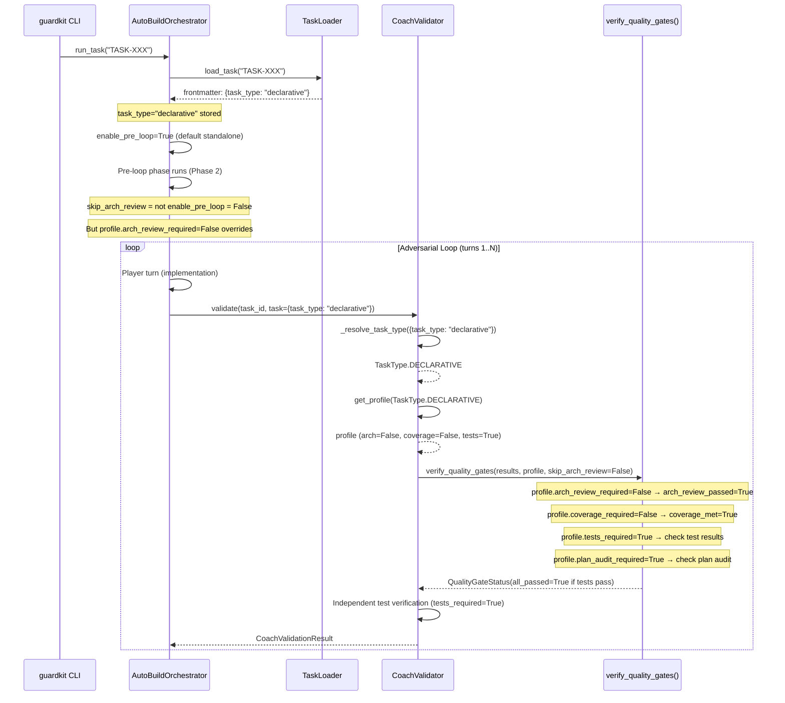
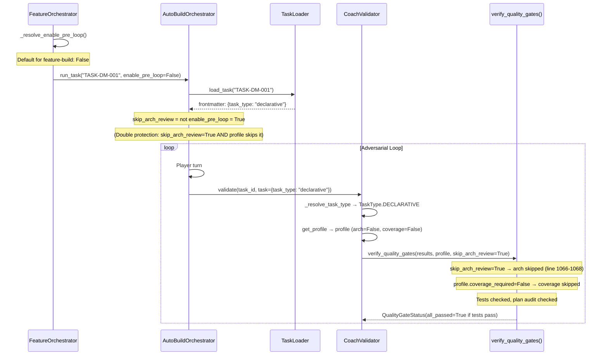
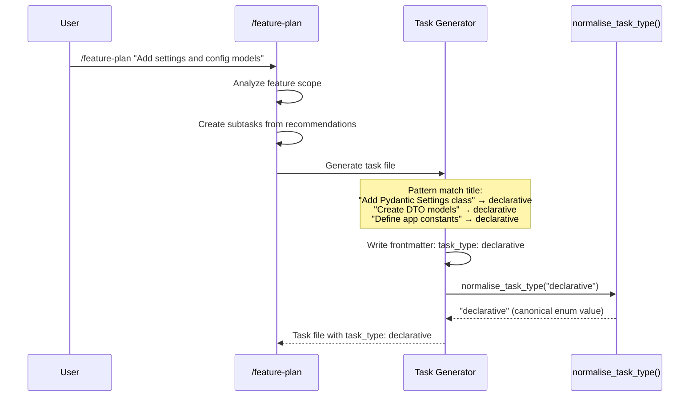

# Review Report: TASK-REV-A00F

## Executive Summary

**Recommendation: Option A (Single DECLARATIVE type)** with one implementation task (~2-3 hours).

The remaining quality gate gap (10-20%) is well-scoped and solvable by adding a single `TaskType.DECLARATIVE` enum value with a permissive `QualityGateProfile`. The existing profile system is fully generic -- no changes are needed to `coach_validator.py`, `autobuild.py`, or `feature_orchestrator.py`. The CSC epic (7 tasks) should be archived as superseded.

---

## Review Details

- **Mode**: Architectural Review (Design)
- **Depth**: Standard
- **Task**: TASK-REV-A00F - Design simplified quality gate profile expansion
- **Complexity**: 5/10

---

## 1. Current State Analysis

### Existing Profile Landscape (7 types)

| TaskType | arch_review | coverage | tests | zero_test_blocking | Key Use Case |
|----------|:-----------:|:--------:|:-----:|:------------------:|-------------|
| FEATURE | 60 | 80% | Yes | Yes | Business logic, endpoints |
| REFACTOR | 60 | 80% | Yes | Yes | Code improvements |
| SCAFFOLDING | Skip | Skip | No | No | Project setup, config files |
| INTEGRATION | Skip | Skip | Yes | No | Wiring, middleware hookup |
| INFRASTRUCTURE | Skip | Skip | Yes | No | Docker, CI/CD, deploy |
| TESTING | Skip | Skip | No | No | Test creation |
| DOCUMENTATION | Skip | Skip | No | No | Docs, guides |

### The Remaining Gap

**Scenario**: `task_type=feature` but implementation is trivial declarative code (Pydantic models, Settings classes, DTOs, constant definitions, app init).

- **Standalone autobuild** (`guardkit autobuild task`): `enable_pre_loop=True` (default) → arch review enforced → score 0 < threshold 60 → **BLOCKED**
- **Feature-build**: Mostly mitigated by `skip_arch_review=True` (enable_pre_loop defaults to False), but coverage 80% still enforced for all `task_type=feature` tasks → may **BLOCK**

### Why SCAFFOLDING Doesn't Fit

SCAFFOLDING skips tests entirely (`tests_required=False`). Declarative code in a feature context should still run existing tests to catch import errors and regressions. The issue isn't that tests are unwanted -- it's that *architectural review* and *high coverage thresholds* are meaningless for zero-logic code.

---

## 2. Profile Design Recommendation

### Recommended: Option A -- Single `DECLARATIVE` Type

```python
TaskType.DECLARATIVE = "declarative"

QualityGateProfile(
    arch_review_required=False,    # Zero-logic code has no architecture to review
    arch_review_threshold=0,
    coverage_required=False,       # Declarative code has nothing meaningful to branch-cover
    coverage_threshold=0.0,
    tests_required=True,           # Still run existing test suite (catch import errors)
    plan_audit_required=True,      # Verify completeness of declared structures
    zero_test_blocking=False,      # No logic → no test expectation
    seam_tests_recommended=False,  # No cross-boundary behaviour to test
)
```

**Rationale for each field**:

| Field | Value | Why |
|-------|-------|-----|
| `arch_review_required` | `False` | Pydantic models, DTOs, constants have no architectural decisions to evaluate against SOLID/DRY/YAGNI |
| `coverage_required` | `False` | Declarative code has no branches/conditions. Coverage metrics are meaningless noise |
| `tests_required` | `True` | Unlike SCAFFOLDING, declarative code lives in feature modules. Running tests catches import errors and contract violations |
| `plan_audit_required` | `True` | Still want to verify all declared structures were completed per the plan |
| `zero_test_blocking` | `False` | Zero-logic code may legitimately have zero tests. Don't block for this |
| `seam_tests_recommended` | `False` | No cross-boundary behaviour to validate |

### Why Not Option B (Two Types)?

Option B proposes `DECLARATIVE` + `SIMPLE` (relaxed coverage at 50%). **Against this because:**

1. **Naming ambiguity**: "Simple" is subjective. One person's "simple" is another's "feature". This invites misclassification.
2. **YAGNI**: No evidence of tasks blocked by the 50% coverage gap specifically. If this gap materialises, adding `SIMPLE` later is trivial (additive change).
3. **Cognitive overhead**: 9 task types is already approaching the limit of what `/feature-plan` can reliably classify.

### Naming Decision

**`declarative`** is preferred over alternatives:

| Name | Verdict | Reason |
|------|---------|--------|
| `declarative` | **Selected** | Precisely describes the code pattern (data structures, no logic) |
| `config` | Rejected | Too narrow -- Pydantic models and DTOs aren't "config" |
| `simple_feature` | Rejected | Subjective, overlaps with "feature" conceptually |
| `model` | Rejected | Too specific to one framework pattern |

---

## 3. Execution Flow Validation

### Path A: `guardkit autobuild task TASK-XXX` (Standalone)



**Key insight**: Even though `skip_arch_review=False` (standalone default), the profile's `arch_review_required=False` takes priority inside `verify_quality_gates()` at line 1069-1071 of coach_validator.py. No code change needed.

### Path B: `guardkit autobuild feature FEAT-XXX` (Feature-Build)



**Key insight**: Feature-build provides double protection -- both `skip_arch_review=True` from the orchestrator AND `arch_review_required=False` from the profile. Coverage gate is skipped via profile. No code change needed.

### Path C: `/feature-plan` Task Generation



**Integration with task-generating commands**: All three commands that generate task files need `declarative` in their pattern matching / valid values:

**a. `/feature-plan`** (primary -- generates subtasks from review recommendations):
```
| Task Title/Description Pattern | task_type Value |
|-------------------------------|-----------------|
| "Add/Create Pydantic model...", "Define DTO...", "Settings class..." | `declarative` |
| "Define constants...", "App initialization", "Create data models" | `declarative` |
| "Add/Create schema...", "Define enums" | `declarative` |
```

Pattern Matching Rules to add:
- Title contains "Pydantic", "model", "DTO", "schema", "Settings class", "constants", "enums", "app init" → `declarative`

**b. `/task-review` [I]mplement flow** (generates subtask files from review recommendations):
- Same pattern matching rules as feature-plan (shared logic)
- Ensure generated task frontmatter includes `task_type` field

**c. `/task-create`** (user-specified values):
- Add `declarative` to valid `task_type` parameter values
- Example: `/task-create "Add Pydantic Settings model" task_type:declarative`

---

## 4. Integration Points Assessment

| File | Change Required? | Details |
|------|:----------------:|---------|
| `guardkit/models/task_types.py` | **YES** | Add `TaskType.DECLARATIVE`, `DEFAULT_PROFILES` entry, optional alias in `TASK_TYPE_ALIASES` |
| `guardkit/orchestrator/quality_gates/coach_validator.py` | **NO** | Fully generic -- uses `_resolve_task_type()` → `get_profile()` → `verify_quality_gates()` chain. New enum value flows through unchanged |
| `guardkit/orchestrator/autobuild.py` | **NO** | Uses `task_type` string from frontmatter, passes to Coach. No hardcoded type checks for gate logic |
| `guardkit/orchestrator/feature_orchestrator.py` | **NO** | Resolves `enable_pre_loop` independently of task_type. Task type flows through to AutoBuildOrchestrator unchanged |
| `guardkit/models/task_types.py` (`normalise_task_type`) | **NO** (trivially) | New canonical value automatically handled by `TaskType(raw_type)` check. No alias needed unless we want `config` → `declarative` |
| `installer/core/commands/feature-plan.md` | **YES** | Add pattern matching rules for declarative task detection |
| `tests/unit/test_task_types.py` | **YES** | Add tests for new enum value, profile, get_profile(), normalise |

### Validation: `coach_validator.py` Is Generic

The critical validation chain in `coach_validator.py`:
1. `_resolve_task_type(task)` at line 597 → calls `TaskType(task_type_str)` → works for any valid enum value
2. `get_profile(task_type)` at line 598 → looks up `DEFAULT_PROFILES[task_type]` → works for any registered profile
3. `verify_quality_gates(results, profile)` at line 636 → reads boolean flags from profile → fully generic

**No hardcoded task type checks** exist in the gate evaluation logic. The profile system is the abstraction layer, and it works correctly for any new `TaskType` entry.

---

## 5. Regression Analysis

### Existing Tests Impact

| Test Class | Impact |
|------------|--------|
| `TestTaskTypeEnum.test_task_type_enum_has_seven_values` | **MUST UPDATE**: `assert len(TaskType) == 8` |
| `TestDefaultProfiles.test_default_profiles_contains_all_task_types` | **AUTO-PASS**: Iterates `TaskType`, will include DECLARATIVE if `DEFAULT_PROFILES` has it |
| All other existing tests | **NO CHANGE**: Test specific enum values, unaffected by additions |

### Backward Compatibility

- Existing `task_type: feature` tasks continue to use FEATURE profile (no change)
- `get_profile(None)` continues to return FEATURE profile (no change)
- `normalise_task_type("unknown")` continues to default to "feature" (no change)
- No existing task frontmatter needs migration

### New Tests Required

1. `TaskType.DECLARATIVE` enum value exists with value `"declarative"`
2. `DEFAULT_PROFILES[TaskType.DECLARATIVE]` has correct field values
3. `get_profile(TaskType.DECLARATIVE)` returns correct profile
4. `QualityGateProfile.for_type(TaskType.DECLARATIVE)` works
5. `normalise_task_type("declarative")` returns `"declarative"`
6. DECLARATIVE profile differs from FEATURE (less strict) and from SCAFFOLDING (tests still required)
7. Update enum count test from 7 to 8

---

## 6. CSC Epic Disposition

### Recommendation: Archive as Superseded

| CSC Task | Status | Reason |
|----------|--------|--------|
| TASK-CSC-001: Data Models | Supersede | Universal context gathering unnecessary -- profile system is sufficient |
| TASK-CSC-002: Fast Classification | Supersede | Classification via explicit `task_type` in frontmatter is better than AI inference |
| TASK-CSC-003: AI Context Analysis | Supersede | Over-engineered for remaining gap |
| TASK-CSC-004: Context Caching | Supersede | No dynamic context to cache |
| TASK-CSC-005: Coach Integration | Supersede | Coach already integrates with profile system |
| TASK-CSC-006: Tests | Supersede | Tests for profile expansion are simpler |
| TASK-CSC-007: Documentation | Supersede | Documentation for 1 new task type, not 7-task system |

### Concepts Worth Preserving

- **Code pattern detection** (from CSC proposal): Could be valuable for *automatic* task_type assignment in future. Not needed now -- `/feature-plan` assigns types based on title pattern matching.
- **Implementation metrics** (lines added, complexity): Could inform a future "auto-classify" feature. Park as a research note, not an active task.

---

## 7. Implementation Estimate

### Single Implementation Task

**Effort**: ~2-3 hours | **Complexity**: 3/10 | **Risk**: Low (additive change)

**Changes**:
1. `guardkit/models/task_types.py`:
   - Add `DECLARATIVE = "declarative"` to `TaskType` enum
   - Add `QualityGateProfile` entry to `DEFAULT_PROFILES`
   - Optionally add `"config": TaskType.DECLARATIVE` to `TASK_TYPE_ALIASES`

2. `tests/unit/test_task_types.py`:
   - Update enum count assertion (7 → 8)
   - Add DECLARATIVE profile configuration tests
   - Add get_profile/for_type/normalise tests
   - Add comparison tests (vs FEATURE, vs SCAFFOLDING)

3. **Command specs** (all three task-generating commands):

   a. `installer/core/commands/feature-plan.md`:
      - Add `declarative` to Task Type Assignment Rules table (line ~1260)
      - Add `declarative` to Pattern Matching for task_type section (line ~1881)
      - Add example detection patterns for declarative tasks (line ~1283)
      - Add `declarative` to the valid values list (line ~1876)

   b. `installer/core/commands/task-review.md`:
      - Update [I]mplement flow documentation (line ~1041) to include task_type assignment
      - Add `declarative` to valid task_type values where task files are generated
      - Ensure generated frontmatter in subtask examples includes task_type

   c. `installer/core/commands/task-create.md`:
      - Add `declarative` as a valid value in the task_type parameter documentation
      - No task_type assignment rules needed (task-create uses explicit user-specified values)

**No changes required to**:
- `coach_validator.py`
- `autobuild.py`
- `feature_orchestrator.py`
- `normalise_task_type()` logic (canonical value auto-handled)

---

## 8. Option Evaluation Matrix

| Criterion | Option A: DECLARATIVE only | Option B: DECLARATIVE + SIMPLE | CSC Epic (7 tasks) |
|-----------|:-:|:-:|:-:|
| Solves remaining gap | Yes | Yes | Yes (over-solves) |
| Implementation effort | 1 task, ~2-3h | 2 tasks, ~4-5h | 7 tasks, ~40-60h |
| Cognitive overhead | +1 type (8 total) | +2 types (9 total) | +7 components |
| Risk of misclassification | Low | Medium (SIMPLE is subjective) | Low (AI-based) |
| Regression risk | Minimal (additive) | Low (additive) | Moderate (new subsystem) |
| Future extensibility | SIMPLE can be added later | Complete | Complete |
| YAGNI compliance | High | Medium | Low |

**Recommended: Option A** -- solves the problem with minimum viable change.

---

## Appendix A: Scenarios Addressed by DECLARATIVE

| Scenario | Current Outcome | With DECLARATIVE |
|----------|-----------------|------------------|
| Pydantic Settings class (20 LOC, standalone) | Arch review: 0 < 60 → BLOCKED | Arch review: skipped → PASS |
| DTO model definitions (30 LOC, standalone) | Arch review: 0 < 60 → BLOCKED | Arch review: skipped → PASS |
| App init with FastAPI() factory (15 LOC, standalone) | Arch review: 0 < 60 → BLOCKED; Coverage: < 80% → BLOCKED | Both skipped → PASS |
| Constants/enum definitions (10 LOC, standalone) | Arch review: 0 < 60 → BLOCKED | Arch review: skipped → PASS |
| Pydantic Settings (feature-build) | Coverage: < 80% → BLOCKED | Coverage: skipped → PASS |

## Appendix B: Alias Considerations

Optional aliases for convenience:
```python
TASK_TYPE_ALIASES = {
    ...existing...,
    "config": TaskType.DECLARATIVE,   # Common shorthand
    "dto": TaskType.DECLARATIVE,      # Data Transfer Objects
    "model": TaskType.DECLARATIVE,    # Data model definitions
}
```

These are purely convenience -- `declarative` works as the canonical value. Aliases can be added incrementally if misclassification becomes common.
