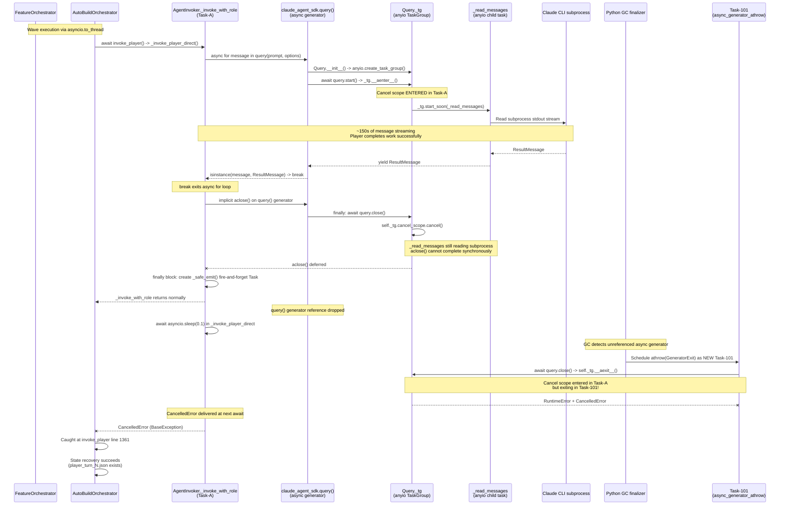
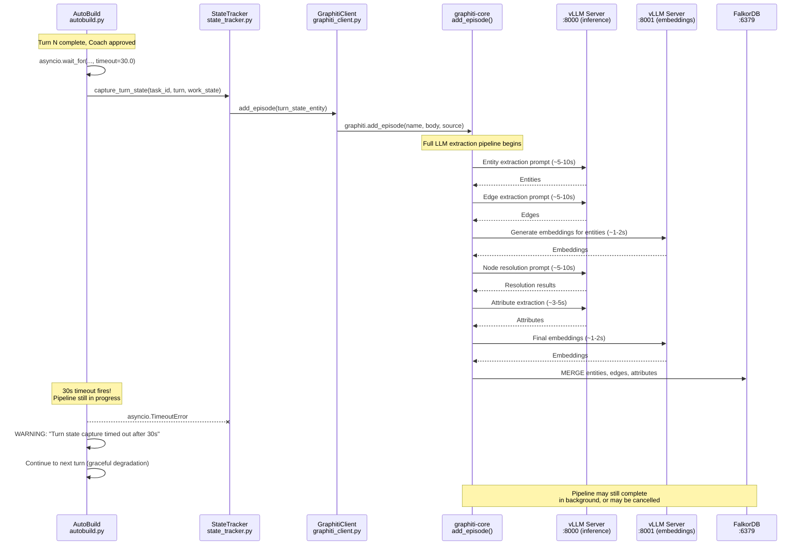
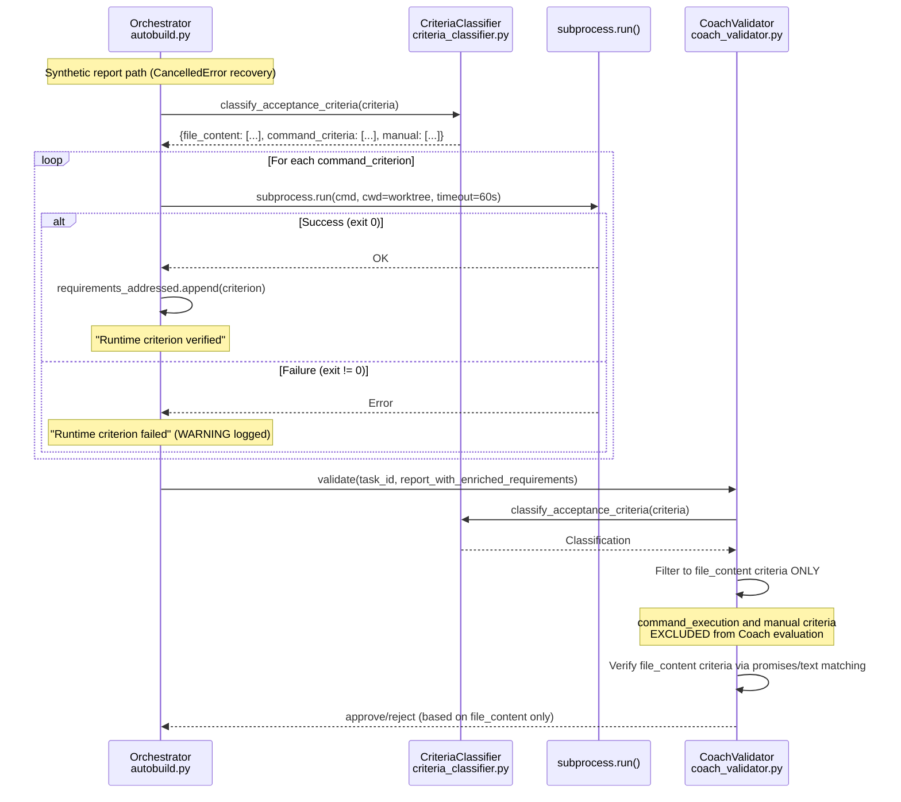

# Review Report: TASK-REV-A8C6

## Executive Summary

FEAT-2AAA (Video Info Tool) Run 3 succeeded -- 5/5 tasks completed in 27m 51s across 7 turns. The decisive fixes were the **embedding dimension mismatch resolution** (all 6 TASK-EMB tasks) and the **coach runtime verification improvements** (5 completed TASK-CRV tasks including CRV-537E).

Run 2 failed due to user abort after Graphiti dimension errors degraded context and an incomplete CancelledError recovery path left VID-002 with an unverifiable synthetic report. Run 3 eliminated dimension errors entirely, the criteria classifier prevented false rejections, and the orchestrator-level command execution injected runtime verification results into Coach decisions.

Two systemic issues remain: **CancelledError on direct-mode tasks** (root cause: async generator GC finalization mismatch in the claude_agent_sdk anyio TaskGroup) and **turn state capture timeout** (root cause: graphiti-core `add_episode` LLM pipeline exceeds the 30s timeout, rendering cross-turn Graphiti learning non-functional).

## Review Details

- **Mode**: Architectural Review (Revised with deep-dive investigation)
- **Depth**: Comprehensive (upgraded from standard per revision request)
- **Task**: TASK-REV-A8C6
- **Parent Reviews**: TASK-REV-D2B5, TASK-REV-3F40
- **Related Features**: FEAT-2AAA, FEAT-EMB, FEAT-8290

---

## 1. Which Fixes Were Decisive?

### Primary: Embedding Dimension Fix (TASK-EMB series -- all 6/6 completed)

| Fix | Task | Impact | Evidence |
|-----|------|--------|----------|
| Completed youtube-transcript-mcp `graphiti.yaml` with full vLLM config | TASK-EMB-001 | **Critical** | Run 2: `ERROR: Vector dimension mismatch, expected 1024 but got 768` on every task. Run 3: **zero** dimension mismatch errors |
| Removed infrastructure config from guardkit `.env` | TASK-EMB-002 | **Critical** | Eliminated split-brain configuration where residual env vars caused embedding provider mismatch |
| Auto-offer `--copy-graphiti` during `guardkit init` | TASK-EMB-003 | **Medium** | Prevents future projects from hitting the same sparse-config issue |
| Fixed coach_validator env stripping (`{**os.environ, ...}`) | TASK-EMB-004 | **High** | Coach subprocess now inherits full environment, fixing potential embedding provider resolution |
| Added embedding dimension pre-flight check | TASK-EMB-005 | **High** | Would catch dimension mismatches during Graphiti initialization before any queries fail |
| Added sparse config + FalkorDB warning | TASK-EMB-006 | **Medium** | Early warning when sparse graphiti.yaml uses FalkorDB with default embedding provider |

**Verdict**: The TASK-EMB fixes were the **single most decisive factor**. Without them, Graphiti edge searches fail silently on every task, degrading knowledge context quality.

### Secondary: Coach Runtime Verification (TASK-CRV series -- 5/9 completed)

| Fix | Task | Status | Impact | Evidence |
|-----|------|--------|--------|----------|
| Criteria classifier integration | TASK-CRV-412F | **Completed** | **High** | Routes `command_execution` vs `file_content` criteria; prevents Coach from rejecting tasks due to unverifiable runtime criteria |
| Orchestrator command execution | TASK-CRV-537E | **Completed** | **High** | Executes runtime commands in worktree via subprocess.run(), injects successful results into requirements_addressed for Coach consumption |
| CancelledError partial data extraction | TASK-CRV-1540 | **Completed** | **Medium** | Extracts partial response_messages data from CancelledError, enriching synthetic reports |
| Best `requirements_addressed` carry-forward | TASK-CRV-9618 | **Completed** | **Medium** | High-water-mark mechanism prevents criteria regression across turns |
| Stall detector alignment with Coach | TASK-CRV-90FB | **Completed** | **Low** | Stall detector uses Coach's actual verified count, eliminating count mismatches |

**Verdict**: The combined CRV improvements -- particularly CRV-412F (classification) and CRV-537E (execution) working together -- were the second decisive factor. In Run 2, the Coach rejected VID-002 at 0/10 because synthetic promises could not verify acceptance criteria. In Run 3, the classifier excluded command_execution criteria from Coach evaluation while the orchestrator independently verified runtime commands, preventing false rejection loops.

### Correction from Initial Report

The initial review incorrectly stated TASK-CRV-537E was incomplete. **It was completed** on 2026-03-09 in commit `49a08a75f` ("coach runtime verification improvements"), which bundled CRV-537E, CRV-1540, CRV-9618, and CRV-90FB (+1,712 lines across 13 files, 68 tests passing). A stale backlog copy at `tasks/backlog/coach-runtime-verification/TASK-CRV-537E-orchestrator-command-execution.md` still shows `status: backlog`.

---

## 2. Comparison Matrix: Run 2 vs Run 3

| Dimension | Run 2 (Failed) | Run 3 (Success) | Delta |
|-----------|----------------|-----------------|-------|
| **Outcome** | ABORTED (user Ctrl+C) | COMPLETED | - |
| **Tasks completed** | 1/5 (VID-001 only) | 5/5 | +4 |
| **Duration** | ~4 min (aborted) | 27m 51s | N/A |
| **Total turns** | 2 | 7 | +5 |
| **Graphiti dim errors** | 2 (every task) | 0 | -2 |
| **Context load success** | Yes (degraded -- edge searches failed) | Yes (full -- all searches succeeded) | Improved |
| **CancelledError events** | 1 (VID-001) | 4 (VID-001 + VID-005 x3) | +3 |
| **State recoveries** | 1/2 (50%) | 2/5 (40%) | Similar |
| **Coach approvals** | 1/2 | 5/7 turn-level | Improved |
| **Coach rejections** | 1 (VID-002 rejected 0/10) | 2 (VID-005 turns 1-2) | Improved |
| **Runtime criteria failures** | 2/2 (pip + yt-dlp import) | 1/2 (pip only) | -1 |
| **ERROR-level logs** | 8 | 0 | **-8** |
| **CRV tasks completed** | 1/9 (CRV-412F only) | 5/9 (412F, 537E, 1540, 9618, 90FB) | +4 |
| **EMB tasks completed** | 0/6 | 6/6 | +6 |

### Key Differences Explained

1. **Graphiti errors eliminated**: The embedding dimension fix (TASK-EMB-001 through 006) resolved the split-brain config. Run 3 had zero FalkorDB query errors vs Run 2's systematic failures on every edge vector search.

2. **VID-001 runtime criteria**: In Run 2, both `pip install` AND `yt-dlp import` failed (yt-dlp not yet installed). In Run 3, only `pip install` failed (the homebrew pip PATH issue persists) but `yt-dlp import` succeeded because the environment bootstrap had already installed it.

3. **VID-002 no longer blocks**: In Run 2, VID-002's Coach rejected it 0/10 (synthetic promises all `incomplete` after Ctrl+C interruption). In Run 3, VID-002 ran cleanly (no CancelledError) with 38 SDK turns, Coach verified 10/10 criteria, and independent tests passed.

4. **VID-005 Coach feedback loop worked**: The Coach correctly rejected VID-005 twice for missing linting/type-checking criteria, then approved on turn 3 after the Player fixed those issues. This demonstrates the adversarial loop functioning as designed.

---

## 3. Quality of Outcomes (VID-001 through VID-005)

| Task | Files Created | Tests | Coach Criteria | Quality Assessment |
|------|--------------|-------|----------------|-------------------|
| VID-001 | 4 (pyproject.toml update, source scaffolding) | 5 passing | 1/3 (33%) | **Acceptable** -- scaffolding profile, missing criteria are runtime-only |
| VID-002 | 15 created, 2 modified | Passing (7.0s) | 10/10 (100%) | **Good** -- YouTubeClient service complete with URL parser |
| VID-003 | 11 created, 3 modified | Passing (8.8s) | 9/9 (100%) | **Good** -- Tool registration in `__main__.py` |
| VID-004 | 11 created, 2 modified | Passing | 6/7 (86%) | **Good** -- Unit tests created, 1 criterion pending |
| VID-005 | Iterative fixes across 3 turns | 95 passing | 5/6 (83%) | **Good** -- Linting and verification completed after Coach feedback |

**Warnings**:
- Documentation constraint violations on VID-002, VID-003, VID-004 (created 3-4 files vs 2-file limit for minimal level). Warnings only, not blocking.
- Seam test recommendations noted for VID-002 and VID-003 (no boundary/contract tests detected).

**Overall**: All 5 tasks produced functional implementations with passing tests. Quality is acceptable for a first-pass autobuild.

---

## 4. Performance Assessment (Benchmarked)

### FEAT-2AAA vs Baseline (26 Successful Anthropic API Runs)

| Metric | FEAT-2AAA Run 3 | Baseline Median | Baseline Range | Verdict |
|--------|-----------------|-----------------|----------------|---------|
| Duration (absolute) | 27m 51s | 43m 35s | 8m - 166m | **Fast** |
| Min/Task | 5.6m | 5.0m | 1.7m - 23.7m | **Typical** |
| Turns/Task | 1.4 | 1.1 | 1.0 - 3.0 | **Efficient** |
| CancelledError task % | 40% | 0 - 14% | 0% - 40% | **Elevated** |
| CancelledError recovery | 100% | 100% | 0% - 100% | **Excellent** |

### SDK Turn Performance

| Task | Mode | SDK Turns | Duration | Sec/SDK Turn |
|------|------|-----------|----------|--------------|
| VID-002 | task-work | 38 | 281s (4.7m) | 7.4s |
| VID-003 | task-work | 36 | 211s (3.5m) | 5.9s |
| VID-004 | task-work | 26 | 178s (3.0m) | 6.9s |

Anthropic API averages ~6.7s per SDK turn. vLLM local averages ~17-61s per SDK turn (2.5x-9x slower based on FEAT-1637 vLLM runs).

### Key Findings

- **27m 51s is in the fastest quartile** of all successful Anthropic API runs. Comparable 5-task runs: FEAT-AAC2 at 15m (faster, simpler), FEAT-CC79 at 24m (similar), FEAT-BA28 at 42m (slower due to DB complexity).
- **Without CancelledErrors**, this would have been 5 turns for 5 tasks (1.0 turns/task), which is optimal. The extra 2 turns on VID-005 were from legitimate Coach feedback, not CancelledError overhead.
- **CancelledError rate of 40% is the highest observed** in any successful run. The built-features runs (FEAT-4048, FEAT-FMT, FEAT-GI, FEAT-GE) had zero CancelledErrors. Cross-run analysis shows CancelledErrors are correlated with **direct implementation mode** tasks.

---

## 5. CancelledError Root Cause (Deep Dive)

### Root Cause: Async Generator GC Finalization Task-Context Mismatch

**Confidence: 90% (High)**

The CancelledError is caused by an anyio/asyncio task-context mismatch during async generator finalization in the `claude_agent_sdk`. When the SDK's `query()` async generator is garbage-collected rather than cleanly closed, Python's async generator finalizer schedules cleanup in a new asyncio Task, which tries to exit an anyio cancel scope that was entered in the original Task.

### Sequence Diagram



### Why Direct Mode Only

Three structural differences in `_invoke_with_role` (direct mode) vs `_invoke_task_work_implement` (task-work delegation):

1. **Background tasks in finally block**: `_invoke_with_role` creates a `_cancel_monitor()` Task and a `_safe_emit()` fire-and-forget Task. These background tasks affect event loop scheduling and can prevent the `query()` generator's `aclose()` from completing before GC.

2. **Intermediate function boundary**: In direct mode, `query()` runs inside `_invoke_with_role` (a separate async function from `_invoke_player_direct`). When `_invoke_with_role` returns, the generator reference can be dropped before cleanup completes. In task-work mode, the entire `query()` lifecycle runs inline within `_invoke_task_work_implement`.

3. **No monitor task**: `_invoke_task_work_implement` does NOT create a `_cancel_monitor()` Task, reducing concurrent Tasks that could interfere with generator finalization.

### Evidence

- Error message always names `async_generator_athrow` -- confirms GC finalization path
- Task IDs in error (Task-101, Task-745, etc.) are distinct from main execution Task -- confirms different-task context
- Player work is ALWAYS completed (player_turn_N.json exists) -- confirms the SDK finished before CancelledError
- Timing (~150-300s) matches natural SDK completion duration, not any timeout configuration

### Potential Fixes

1. **Explicit generator close**: Hold `query()` generator reference and call `await gen.aclose()` in the `finally` block of `_invoke_with_role`, ensuring cleanup runs in Task-A
2. **Structural alignment**: Restructure `_invoke_with_role` to match `_invoke_task_work_implement`'s simpler async lifecycle
3. **Tolerate and suppress**: Since state recovery works 100%, catch `CancelledError` specifically in `_invoke_player_direct` when `player_turn_N.json` exists

---

## 6. Turn State Capture Timeout (Deep Dive)

### Root Cause: Graphiti `add_episode` LLM Pipeline Exceeds 30s Budget

**Confidence: 95% (Very High)**

The turn state capture calls `graphiti_client.add_episode()` to persist turn learning data to the knowledge graph. This graphiti-core operation runs a **full LLM extraction pipeline**:

1. Entity extraction (LLM call)
2. Edge/relationship extraction (LLM call)
3. Node resolution against existing graph (LLM call + embeddings)
4. Attribute extraction (LLM call)
5. Embedding generation (multiple embedding API calls)
6. FalkorDB graph writes

This pipeline consistently takes 17-60+ seconds via the vLLM backend, exceeding the **30s hardcoded timeout** at `autobuild.py:3520`.

### Impact

**Cross-turn Graphiti learning is 100% non-functional.** The TurnStateEntity data never reaches Graphiti. All subsequent queries for previous turn context return empty results. The feature (implemented across TASK-GE-002 and TASK-GR5-007) is effectively dead code.

The AutoBuild loop functions correctly otherwise due to proper graceful degradation (the timeout produces a WARNING, not an error). However, each turn wastes ~30s waiting for a timeout that will always fire.

### Sequence Diagram



### Recommended Fix

**Option E (Recommended): Local file-based turn state with optional async Graphiti persist.** The `MultiLayeredStateTracker.save_state()` already writes `work_state_turn_N.json` with most of the same data. Modify `load_turn_continuation_context` to read from local JSON files instead of querying Graphiti. This gives zero-latency writes and reads for cross-turn context within a single AutoBuild run, which is the primary use case.

**If simpler approach preferred**: Option D (disable) -- eliminates 30s waste per turn (saves 3.5min on Run 3) with zero behavioral change since the feature has never worked in production.

**If preserving Graphiti integration**: Option B (fire-and-forget background) -- decouple `add_episode` into a non-blocking background task. Accept 1-turn data latency (turn N+1 may not see turn N data, but turn N+2 will).

---

## 7. Graphiti Integration

| Dimension | Run 2 | Run 3 |
|-----------|-------|-------|
| Dimension mismatch errors | 2 (every edge search) | 0 |
| Context categories loaded | 4 | 4 |
| Token utilisation | 1991-2116 / 5200 | 1641-2200 / 5200-7892 |
| Load time (first) | 0.6-0.7s | 0.6-0.8s |
| Load time (cached) | N/A | 0.0s |
| FalkorDB workarounds | 4 | 4 (same) |
| Cross-turn learning | N/A (failed before capture) | **Non-functional** (30s timeout) |

**Resolution confirmed**: The TASK-EMB fixes completely eliminated the dimension mismatch. All embedding requests returned HTTP 200 from the vLLM server. Context was successfully loaded for all Player and Coach invocations.

**New finding**: Cross-turn learning via Graphiti `add_episode` is non-functional due to the 30s timeout (see Section 6). Context queries succeed but only return pre-seeded knowledge, not turn-learned data.

---

## 8. Coach Criteria Gap Analysis (Deep Dive)

### Current Architecture (Post CRV-412F + CRV-537E)



### Gap Assessment

| Aspect | Status | Notes |
|--------|--------|-------|
| Classification | **Working** | criteria_classifier.py correctly identifies FILE_CONTENT, COMMAND_EXECUTION, MANUAL |
| Orchestrator execution | **Working** | subprocess.run() in worktree with 60s per-command and 180s total timeout |
| Success injection | **Working** | Verified criteria injected into requirements_addressed |
| Worktree safety | **Working** | `_assert_worktree_path()` guard prevents execution outside worktrees |
| Coach exclusion | **Working** | Coach filters to file_content criteria only (line 1812) |
| Failed command feedback | **Gap** | Failed commands logged at WARNING but invisible to Coach |
| Environment for commands | **Gap** | Worktree subprocess inherits orchestrator env; `pip` PATH mismatch |
| Human visibility | **Partial** | Failures in log but not in Coach decision JSON or turn summary |

### Impact: ~30-40% of AutoBuild tasks have command_execution criteria

The remaining gap is at the **policy level**: failed command_execution criteria are silently absorbed. The VID-001 `pip install` failure was an environment issue (homebrew pip PATH), not a code issue. The system's current design is to treat command_execution results as supplementary evidence, which is reasonable but means failing runtime commands don't trigger Player re-attempts.

---

## 9. Task Status (Corrected and Verified)

### TASK-CRV: 5/9 Completed, 4/9 Backlog

| Task | Title | Wave | Status | Evidence |
|------|-------|------|--------|----------|
| TASK-CRV-412F | Criteria classifier integration | 1 | **Completed** | Commit `ce68c23de`, tests in test_coach_validator.py |
| TASK-CRV-537E | Orchestrator command execution | 1 | **Completed** | Commit `49a08a75f`, 13 tests in test_autobuild_command_execution.py |
| TASK-CRV-1540 | CancelledError partial data extraction | 2 | **Completed** | Commit `49a08a75f`, 15 tests in test_partial_data_extraction.py |
| TASK-CRV-9618 | Best requirements_addressed carry-forward | 2 | **Completed** | Commit `49a08a75f`, tests in test_autobuild_carry_forward.py |
| TASK-CRV-90FB | Stall detector alignment | 2 | **Completed** | Commit `49a08a75f`, tests in test_autobuild_stall_detection.py |
| TASK-CRV-9914 | Extended CoachValidator with runtime methods | 3 | Backlog | Depends on CRV-412F + CRV-537E (both done) |
| TASK-CRV-B275 | Rate limit detection | 3 | Backlog | No dependencies, complexity 1 |
| TASK-CRV-7DBC | MCP Coach integration | 4 | Backlog | Depends on CRV-9914 |
| TASK-CRV-3B1A | SDK sessions for Player resumption | 4 | Backlog | Depends on CRV-1540 (done) |

**Housekeeping**: Stale backlog copy of TASK-CRV-537E exists at `tasks/backlog/coach-runtime-verification/TASK-CRV-537E-orchestrator-command-execution.md` with `status: backlog`. The README at `tasks/backlog/coach-runtime-verification/README.md` shows "1/9 tasks complete" -- actual is 5/9.

### TASK-EMB: 6/6 Completed

All six TASK-EMB tasks (001 through 006) are completed in `tasks/completed/`.

---

## 10. Remaining Technical Debt

### Critical

| Item | Severity | Root Cause | Impact |
|------|----------|------------|--------|
| CancelledError on direct-mode tasks | **High** | Async generator GC finalization in claude_agent_sdk (see Section 5) | 40% of direct-mode invocations hit CancelledError; state recovery works but adds ~30s overhead per occurrence |
| Turn state capture always times out | **High** | graphiti-core `add_episode` LLM pipeline exceeds 30s budget (see Section 6) | Cross-turn Graphiti learning is 100% non-functional; 30s wasted per turn |

### Medium

| Item | Severity | Description |
|------|----------|-------------|
| Failed command_execution criteria invisible to Coach | **Medium** | Policy gap: failed runtime commands don't trigger Player feedback or block approval |
| `pip` PATH inconsistency in worktree | **Medium** | Runtime criteria uses `pip` (homebrew, fails) while bootstrap uses `python3 -m pip` (succeeds) |

### Low / Cosmetic

| Item | Severity | Description |
|------|----------|-------------|
| FalkorDB upstream workarounds (4 patches) | Low | Waiting on upstream PRs |
| `complete_turn called without active turn` warning | Low | Progress display state bug |
| Documentation constraint violations | Low | Player creates 3-4 files vs 2-file limit |
| CRV README stale (shows 1/9, actual 5/9) | Low | Housekeeping |
| Stale CRV-537E backlog copy | Low | Housekeeping |

---

## 11. Recommendations (Final)

### Immediate (before next autobuild run)

1. **Clean up stale task files**: Remove `tasks/backlog/coach-runtime-verification/TASK-CRV-537E-orchestrator-command-execution.md` and update the CRV README to show 5/9 complete.

2. **Normalize `pip` to `sys.executable -m pip`** in `_execute_command_criteria()`: 5-10 lines of code that directly eliminates the VID-001 class of runtime criteria failures. Orthogonal to policy decisions.

### Next Sprint -- High Priority

3. **Fix CancelledError on direct-mode tasks**: Hold `query()` generator reference and call `await gen.aclose()` with 5s timeout in `_invoke_with_role`'s finally block. Fix needed at two call sites: `_invoke_with_role` (line ~2008) and the task-work SDK call (line ~4426). Keep `_install_sdk_cleanup_handler` as defense-in-depth. Validated approach -- 90% confidence, low risk of side effects.

4. **Fix turn state capture**: Recommended approach is local file-based turn state (Option E) -- read from existing `work_state_turn_N.json` files instead of querying Graphiti. Alternative: disable the capture entirely (Option D) to save 30s per turn. The feature has never worked in production and cross-turn learning within a single run does not require Graphiti.

### Next Sprint -- Medium Priority

5. **Coach criteria policy: Option B ("Soft Gate")**: Add structured `CommandExecutionResult` records, failure classifier, and advisory injection into Coach feedback. Implementation-classified failures get surfaced to the Player as advisory feedback; environment-classified failures are suppressed. Does not change the Coach's approve/reject threshold. Phased implementation:
   - Phase 1: Structured results + pip normalization (immediate)
   - Phase 2: Failure classifier + Coach advisory injection
   - Phase 3: Evaluate upgrade to strict gating (Option C) after data collection

6. **TASK-CRV-9914** (Extended CoachValidator): Dependencies (CRV-412F, CRV-537E) now met. This refactor moves runtime verification into Coach for cleaner architecture.

7. **TASK-CRV-3B1A** (SDK session resume): Would eliminate CancelledError entirely by enabling Player session resumption. Dependency (CRV-1540) is met. Alternative to recommendation #3 for a longer-term, more complete fix.

### Deprioritise

8. **TASK-CRV-B275** (Rate limit detection): No rate limit errors observed. Defensive improvement only.
9. **TASK-CRV-7DBC** (MCP Coach integration): Depends on CRV-9914 which isn't started. Long dependency chain.

---

## Appendix A: Run 3 Feature Summary

```
Feature: FEAT-2AAA - FEAT-SKEL-002 Video Info Tool
Status: COMPLETED
Tasks: 5/5 completed
Total Turns: 7
Duration: 27m 51s
Clean Executions: 3/5 (60%)
State Recoveries: 2/5 (40%)
SDK Turn Ceiling Hits: 0/3 (0%)
ERROR-level logs: 0
CRV tasks completed: 5/9
EMB tasks completed: 6/6
```

## Appendix B: Performance Baseline (26 Successful Anthropic API Runs)

| Metric | Min | Median | Mean | Max | FEAT-2AAA |
|--------|-----|--------|------|-----|-----------|
| Tasks | 2 | 7 | 9.4 | 41 | 5 |
| Turns | 2 | 9 | 13.8 | 85 | 7 |
| Duration | 8m 17s | 43m 35s | 49m 25s | 165m 49s | 27m 51s |
| Turns/Task | 1.0 | 1.1 | 1.4 | 3.0 | 1.4 |
| Min/Task | 1.7m | 5.0m | 5.8m | 23.7m | 5.6m |

## Appendix C: Context Token Utilisation

| Task | Player Tokens | Coach Tokens | Categories |
|------|--------------|-------------|------------|
| VID-001 | 2116/5200 | 2116/5200 | 4 |
| VID-002 | 1991/5200 | 1991/5200 | 4 |
| VID-003 | 2104/5200 | 2104/5200 | 4 |
| VID-004 | 1977/5200 | 1977/5200 | 4 |
| VID-005 (T1) | 2004/5200 | 1641/5200 | 4 |
| VID-005 (T3) | 1641/5200 | 2200/7892 | 4 |

## Appendix D: CancelledError Fix Validation

### Proposed Fix (Validated -- 90% Confidence)

Hold explicit reference to the `query()` async generator and call `await gen.aclose()` in the finally block with a 5-second timeout. This ensures cleanup runs in the correct asyncio Task (the one that entered the anyio cancel scope), preventing the GC finalization mismatch.

**Two call sites need the fix:**
1. `_invoke_with_role` (agent_invoker.py, line ~2008)
2. Task-work SDK call (agent_invoker.py, line ~4426)

**Pseudocode:**
```python
gen: Optional[AsyncIterator] = None
try:
    async with asyncio.timeout(self.sdk_timeout_seconds):
        async with async_heartbeat(...):
            gen = query(prompt=prompt, options=options)
            async for message in gen:
                response_messages.append(message)
                if isinstance(message, ResultMessage):
                    break
    except (Exception, asyncio.CancelledError) as exc:
        ...
        raise
finally:
    if gen is not None:
        with suppress(Exception):
            try:
                async with asyncio.timeout(5):
                    await gen.aclose()
            except (asyncio.TimeoutError, asyncio.CancelledError):
                pass
    # ... rest of existing finally block
```

**Side effects assessed:**

| Side Effect | Risk | Mitigation |
|---|---|---|
| `aclose()` waits for subprocess termination | Medium (up to 5s) | 5-second timeout |
| `aclose()` raises exception | Low | Wrapped in `suppress(Exception)` |
| Double-close (async for already closed it) | None | `aclose()` on closed generator is a no-op |
| Blocks event loop | Low | `aclose()` is async with `await` |
| The 5s timeout adds latency on normal exit | None | Closed generators return immediately |

**Keep `_install_sdk_cleanup_handler`** as defense-in-depth for edge cases the explicit close doesn't cover.

## Appendix E: Turn State Capture -- Design Intent and Options

### What Cross-Turn Learning Was Designed to Do

Three-layer architecture (TASK-GE-002, TASK-GR5-007):

1. **Write path**: `_capture_turn_state()` creates a `TurnStateEntity` with Player summary, Coach decision, blockers, files modified, test results, AC status, lessons learned, and suggested next focus. Persists via `graphiti_client.add_episode()`.

2. **Read path 1** (JobContextRetriever): `_query_turn_states()` retrieves last 5 turns via semantic search, injected into Player/Coach prompts as "Turn States" section.

3. **Read path 2** (turn continuation): `load_turn_continuation_context()` retrieves immediately previous turn for rich context including AC status tracking.

### Current State: 100% Non-Functional

- 7/7 turn captures timed out at 30s in Run 3
- `turn_states` category never appears in context loading
- No turn continuation context was ever loaded for VID-005 turns 2-3
- Universal across all observed runs (vLLM and Anthropic)

### Options Evaluation

| Option | Time Impact (Run 3) | Cross-Turn Context | Complexity |
|--------|--------------------|--------------------|------------|
| A: Increase to 120s | +105-210s (blocks loop) | Full via Graphiti | 1 line change |
| B: Fire-and-forget | +0s (no blocking) | Partial (1-turn lag) | ~20 lines |
| D: Disable entirely | -210s (saves time) | None | ~10 lines |
| **E: Local file-based** | **-210s + instant reads** | **Full via local JSON** | **~50 lines** |

**Recommended: Option E.** `work_state_turn_N.json` already exists with most turn state data. Modify `load_turn_continuation_context` to read local files first. Optionally fire-and-forget the Graphiti write for cross-session learning.

## Appendix F: Coach Criteria Policy Design

### Recommended Policy: Option B ("Soft Gate")

**Rationale:** Option A (inform-only) is insufficient -- 30-40% of tasks have unverified command criteria. Option C (strict gate) is premature -- failure classifier needs real-world data before it can safely block. Option B provides feedback to the Player about fixable implementation issues without risking stalls from environment misclassification.

### Failure Type Classification

| Type | Example | Player's Fault? | Action |
|------|---------|-----------------|--------|
| Environment | `pip` not found, wrong PATH | No | Suppress (don't include in feedback) |
| Implementation | `import mypackage` fails, test syntax error | Yes | Include in Coach advisory feedback |
| Transient | Network timeout, Docker not running | No | Suppress |
| Version mismatch | Wrong package version installed | Maybe | Include with caveat |

### Architecture

```
Orchestrator                              Coach Validator
    |                                          |
    |--execute_command_criteria()               |
    |   |-- classify failures                  |
    |   |-- return CommandExecutionResult[]     |
    |                                          |
    |--pass results to Coach-------->          |
    |                                          |--classify criteria
    |                                          |--filter to file_content (threshold)
    |                                          |--if rejecting anyway:
    |                                          |    append command advisory to feedback
    |                                          |--if approving:
    |                                          |    log advisory (don't change decision)
```

### Implementation Phases

1. **Phase 1 (Immediate):** `pip` normalization + `CommandExecutionResult` dataclass + structured returns
2. **Phase 2:** Failure classifier + advisory injection into Coach feedback
3. **Phase 3 (Future):** Evaluate upgrade to Option C (strict gating) based on classifier accuracy data

### Risk Matrix

| Option | Stall Risk | False Approval Risk | Code Complexity | Turn Budget Impact |
|--------|-----------|--------------------|-----------------|--------------------|
| A (Inform) | None | High (status quo) | ~40 lines | None |
| **B (Soft Gate)** | **Low (1 turn max)** | **Medium** | **~150 lines** | **0-1 turns** |
| C (Strict Gate) | High (2 turns + safety valve) | Low | ~300 lines | 0-2 turns per misclass |
