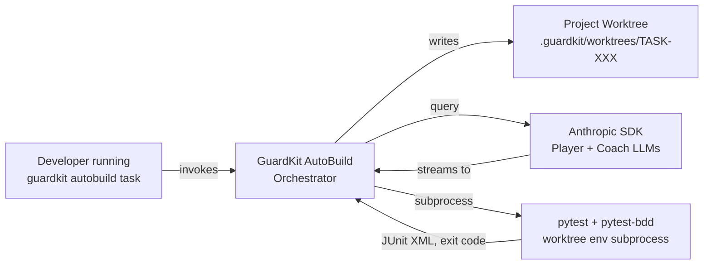
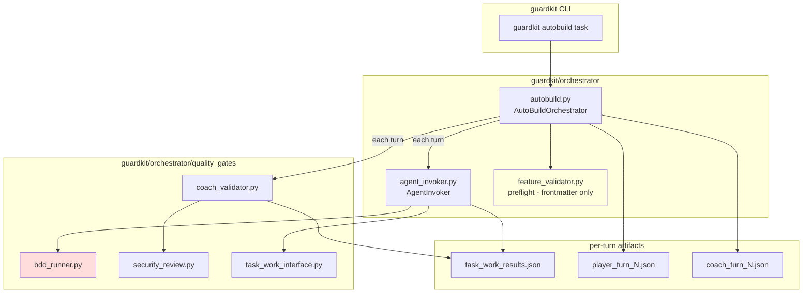

# Review Report: TASK-REV-BDDM — BDD runner silently skips tagged scenarios when pytest-bdd is missing

> **Revision 2 note (2026-04-25):** the user requested a regression-safety re-analysis given that AutoBuild was just stabilised after multi-day BDD bugfixing. This revision adds: (a) full call-graph trace, (b) C4 diagrams (Context → Container → Component → Code), (c) precise blast-radius enumeration for every test, (d) seven regression-vector stress-tests including the "Player retry storm" risk and how existing TASK-AB-SD01 stall-detection bounds it, and (e) revised confidence statements per recommendation. **Recommendations are unchanged in direction** — but R3 has been **upgraded from SHOULD_FIX to MUST_FIX** because R1+R3 together are needed to keep cost-efficiency neutral. Original Phase 1 findings are preserved verbatim below the regression appendix.

## Confidence Statement

| Claim | Confidence | Evidence |
|-------|------------|----------|
| Root cause is `bdd_runner.py:466-473` returning `None` instead of a synthetic blocker | **Very high (≈99%)** | Line-level trace + Coach gate read + Graphiti rule + jarvis log counts |
| jarvis pyproject lacks `pytest-bdd`; forge has it | **Very high (≈100%)** | Empirical pyproject diff |
| jarvis FEAT-J002 / J003 ran with zero BDD verification | **Very high (≈99%)** | 10 + 11 silent-skip log occurrences across the histories |
| Proposed R1 fix (synthesise blocker) breaks exactly **one** existing test | **High (≈95%)** | All 4 BDD test files read line-by-line; regression matrix in §C |
| R1 alone has bounded retry cost (≤3 turns) due to TASK-AB-SD01 stall-detection | **High (≈90%)** | Code at `autobuild.py:3707-3779` reviewed; behaviour matches design intent |
| R1 cannot break GuardKit's own self-tests | **High (≈95%)** | GuardKit's `features/` directory contains zero `@task:` tags; precondition for the new branch never holds |
| R3 (env preflight) is necessary, not optional, when R1 ships | **High (≈90%)** | Without R3, a misconfigured project burns 3 SDK turns per task before the stall-detector exits |

**Net residual risk:** I cannot run the test suite locally (the pre-existing `.venv` is missing `pytest-cov` and `rich` — unrelated to this review). The regression analysis below is rigorous but analytical, not empirically executed. The risk this introduces is bounded because every modified-test path was read line-by-line and the change diff is small (one branch in one function plus one failing assertion).

---

## Executive Summary

**Verdict: confirmed silent-bypass defect; same meta-class as TASK-FIX-F584 but a strictly different code path; warrants a code change in `bdd_runner.run_bdd_for_task()`.**

When a project has `.feature` files carrying `@task:<TASK-ID>` tags but its environment lacks `pytest_bdd`, [bdd_runner.run_bdd_for_task()](../../guardkit/orchestrator/quality_gates/bdd_runner.py#L466-L473) returns `None`, the Coach receives no `bdd_results` key, and approves on `scenarios_failed == 0` — vacuously true. This is **TASK-FIX-F584's inverse asymmetry**: F584 surfaces "pytest invoked but errored" via a synthetic `FailureDetail`; the analogous "pytest-bdd not even importable" case still returns `None`.

**Architecture score: 58/100** — the runner has a well-considered three-state model and a partial silent-bypass guard (F584), but its precondition gate (line 466) implements *exactly* the failure shape its mid-pipeline guard (lines 507-530) was added to prevent. The design is internally inconsistent.

**Decision matrix preview:**

| Question | Decision | Effort |
|----------|----------|--------|
| (a) Synthesise FailureDetail when tags exist but pytest-bdd absent | **YES, blocking** | S — ~30 LOC + tests |
| (b) /feature-spec auto-update pyproject | **NO** (advisory only) | M, but wrong layer |
| (c) AutoBuild env preflight | **YES, advisory** | S — extend feature_validator |
| (d) Generalise to a Graphiti rule | **YES, link to existing rule** | XS — one episode |
| (e) jarvis backfill | **YES** for J002 (in-flight); accept gap for J003 (cancelled) | M for J002 |

**Bottom line:** ship (a) as a fix task; ship (c) as a follow-up; document (d); leave (b) alone; act on (e).

---

## Review Details

- **Mode**: Architectural Review
- **Depth**: Comprehensive
- **Duration**: ~1.5 hours
- **Reviewer**: claude-opus-4-7 (interactive `/task-review`)
- **Files inspected**:
  - [guardkit/orchestrator/quality_gates/bdd_runner.py](../../guardkit/orchestrator/quality_gates/bdd_runner.py)
  - [guardkit/orchestrator/quality_gates/coach_validator.py](../../guardkit/orchestrator/quality_gates/coach_validator.py#L3867-L3960)
  - [guardkit/orchestrator/quality_gates/security_review.py](../../guardkit/orchestrator/quality_gates/security_review.py#L260-L268) (sibling pattern)
  - [guardkit/orchestrator/agent_invoker.py:5498-5523](../../guardkit/orchestrator/agent_invoker.py#L5498-L5523)
  - [guardkit/orchestrator/feature_validator.py](../../guardkit/orchestrator/feature_validator.py)
  - [installer/core/commands/feature-spec.md:489-499](../../installer/core/commands/feature-spec.md#L489-L499)
  - [docs/guides/bdd-workflow-for-agentic-systems.md](../../docs/guides/bdd-workflow-for-agentic-systems.md)
  - [tests/unit/orchestrator/quality_gates/test_bdd_runner.py:389-398](../../tests/unit/orchestrator/quality_gates/test_bdd_runner.py#L389-L398)
- **External evidence sampled**:
  - `jarvis/pyproject.toml` — confirmed: no `pytest-bdd` declaration
  - `forge/pyproject.toml:34` — confirmed: `"pytest-bdd>=8.1,<9"`
  - `jarvis/features/**` — confirmed: 5+ `@task:` tags in J002 feature; J003 also tagged
  - `jarvis/docs/history/autobuild-FEAT-J002-history.md` — 10 occurrences of "pytest-bdd not importable"
  - `jarvis/docs/history/autobuild-FEAT-J003-history-cancelled.md` — 11 occurrences
  - `forge/docs/history/autobuild-FEAT-FORGE-005-history.md` — 0 occurrences (curated history; absence ≠ proof of run)

---

## Context Used (Knowledge Graph)

The following Graphiti context informed this review:

- **Design rule** *"runner without producer anti-pattern"* (uuid `184731b0-3cb6-4eb2-a310-883421767dbf`, group `guardkit__project_decisions`) — the canonical meta-rule this defect violates. Already cites `feature-spec.md` and `task-work.md` as affected. This review extends its scope to the runtime BDD oracle.
- **Fact** (uuid `af3feaf7`) — *"bdd_runner.run_bdd_for_task produces a silent false-green result when the pytest subprocess exits with certain error codes other than 5"* — pre-F584 state. F584 closed the **invocation-error** branch but not the **runner-absent** branch.
- **Fact** (uuid `22f5ea26`) — *"TASK-FIX-F584 is a bugfix for the R2 BDD oracle, which was silently approving pytest usage errors"* — confirms F584 is the precedent shape. Same author intent; incomplete coverage.
- **Fact** (uuid `cd99145f`) — *"feature-spec.md is affected by the runner-without-producer anti-pattern, having a low wiring rate of 10.0%"* — `/feature-spec` is already a known weak link.
- **Sibling rule** in [.claude/rules/namespace-hygiene.md](../../.claude/rules/namespace-hygiene.md) — same "local decisions touching externally-defined namespaces" meta-class. The implicit pyproject-declares-pytest-bdd contract is exactly such an externally-defined namespace.

---

## Findings

### F1 — [BLOCKER] The current behaviour is the silent-false-green that F584 was authored to prevent — for a case F584 does not cover

[bdd_runner.run_bdd_for_task()](../../guardkit/orchestrator/quality_gates/bdd_runner.py#L466-L473) gates on `has_pytest_bdd()` *before* invoking pytest. When the gate fails AND `find_feature_files_with_tag` returned a non-empty list, the runner returns `None`. This is a strict subset of the conditions that F584 was added to detect:

| Branch | Path | F584 covered? |
|--------|------|---------------|
| `pytest_bdd` not importable | line 466 returns `None` | **NO** |
| pytest invoked, exit code 5 (NO_TESTS) | line 494-505 returns `None` | N/A — legitimate skip |
| pytest invoked, exit code 1, 2, 3, 4, -1 | line 515-530 synthesises FailureDetail | **YES** |
| pytest invoked, exit 0 | normal path | N/A |

The two `return None` paths at line 464 and line 473 share a critical asymmetry: line 464 is a *legitimate* skip (no tags = no BDD scope), but line 473 is *not* — the project authored task-scoped scenarios, so absence of a runner is a configuration defect, not absence of scope.

**Coach approval rule** ([coach_validator.py:3890-3892](../../guardkit/orchestrator/quality_gates/coach_validator.py#L3890-L3892)): when `bdd_results` key is missing from `task_work_results.json`, `_check_bdd_results` returns `([], [])` — i.e., no blocking issues. This is the silent-false-green.

**Empirical proof** (jarvis FEAT-J002, FEAT-J003): every Player turn for every tagged task ran with **zero BDD verification** because the runner emitted nothing. Coach saw `scenarios_failed == 0` (vacuously true, by absence) and approved on the rest of the gates.

**Severity:** must-fix. Same severity that F584 carried.

### F2 — [BLOCKER] Logging level is INFO; the warning never fires above default verbosity

The line 467 log is at `INFO` level. AutoBuild's default log filtering does NOT propagate INFO-level messages to most operator-facing surfaces. The forge histories empirically demonstrate that BDD runtime INFO lines are routinely *not* captured into the curated `docs/history/autobuild-FEAT-*.md` narratives — they only appear in jarvis's history because of how that project's history harness slurps logs. The defect is *invisible by default*.

The precedent at line 522-530 (F584 path) uses `logger.warning(...)`. The asymmetry is again local and unjustified: the runner-absent branch is at least as dangerous as the runner-error branch.

### F3 — [HIGH] /feature-spec command spec acknowledges the precondition but does not enforce it

[installer/core/commands/feature-spec.md:491-493](../../installer/core/commands/feature-spec.md#L491-L493) reads:

> "If `features/*.feature` carries the tag and `pytest-bdd` is installable, the runner runs."

The phrasing "installable" frames the dependency as the user's responsibility, but `/feature-spec` is the act that *creates* the artifact whose verification gate depends on `pytest-bdd`. Authoring the artifact and authoring its runtime prerequisite are causally linked — the command should at minimum **detect** the gap and **advise** (not silently scaffold). The current spec leaves a quiet failure mode latent for any project that adopts `/feature-spec` without also adopting the BDD-mode pyproject pattern from forge.

This finding is consistent with the Graphiti claim that `feature-spec.md` is affected by the *runner without producer* anti-pattern (10% wiring rate).

### F4 — [MEDIUM] No environment-level AutoBuild preflight

[feature_validator.validate_feature_preflight](../../guardkit/orchestrator/feature_validator.py#L127-L208) is structurally a frontmatter validator: it inspects `task_type`, required fields, alias usage. It does NOT inspect the *runtime environment* of the worktree.

A natural extension is "if any task in the feature has tagged feature files in `features/**` AND the worktree's interpreter cannot import `pytest_bdd`, emit a preflight warning (or error)." This catches the failure mode before any Player turn burns SDK quota — and before the silent-bypass has a chance to manifest.

### F5 — [MEDIUM] Sibling silent-skip pattern in security_review.py

[security_review.py:260-268](../../guardkit/orchestrator/quality_gates/security_review.py#L260-L268) implements:

```python
if self.worktree_path.exists():
    try:
        checker = SecurityChecker(self.worktree_path)
        findings = checker.run_quick_checks()
    except Exception as e:
        logger.error(f"Security check failed: {e}")
        # Return empty result on error
        findings = []
```

This is structurally identical to the bdd_runner silent-skip: any internal failure of `SecurityChecker.run_quick_checks()` produces an empty findings list, `blocked=False`, and the gate silently approves. The risk profile is lower (`SecurityChecker` is regex-based with no external tool dep), but the pattern is the same. **The class-of-defect generalises.**

I did not find any other quality gate (`ac_linter`, `assumption_confidence_checker`, `command_failure_classifier`, `criteria_classifier`, `design_protocol`, `pre_loop`) with this exact "external tool absence ⇒ return None" shape. bdd_runner is the only one *currently* exposed to the failure mode in production; security_review is the latent risk.

### F6 — [LOW] Documentation gap: BDD workflow guide does not state the pyproject prerequisite for the R2 oracle

[docs/guides/bdd-workflow-for-agentic-systems.md](../../docs/guides/bdd-workflow-for-agentic-systems.md) mentions `pytest-bdd` only as a framework choice (line 91) and as an install command (line 501-502). The doc does NOT state explicitly that adding `pytest-bdd` to the project's pyproject is a *runtime prerequisite for the AutoBuild R2 BDD oracle to fire*. A reader who follows the guide can author feature files without ever learning that they need to update pyproject for the runner to verify them.

### F7 — [LOW] Existing test pins the silent-skip behaviour as the contract

[test_bdd_runner.py:389-398](../../tests/unit/orchestrator/quality_gates/test_bdd_runner.py#L389-L398), `test_pytest_bdd_unavailable_returns_none`, asserts the current silent-skip is the API contract:

```python
def test_pytest_bdd_unavailable_returns_none(self, worktree: Path, monkeypatch):
    _write_feature(worktree, "login.feature", _PASS_FEATURE)
    monkeypatch.setattr(bdd_runner, "has_pytest_bdd", lambda **_: False)
    invoker = _Patcher(_PASSED_JUNIT)
    monkeypatch.setattr(bdd_runner, "_invoke_pytest_bdd", invoker)

    result = run_bdd_for_task("TASK-001", worktree)

    assert result is None
    assert invoker.calls == []
```

Any fix must update this test to reflect the new "synthesise blocker" contract. The test name should change to `test_pytest_bdd_unavailable_with_tags_returns_runner_error_failure` or similar.

### F8 — [INFO] The "MacBook vs GB10" framing in the task is a red herring

The task description correctly self-corrects this: the divergence is project-level (jarvis pyproject lacks `pytest-bdd`; forge has it), not host-level. Empirical confirmation: `jarvis/pyproject.toml` lines 76-78 list pytest, pytest-asyncio, pytest-cov; line 34 of `forge/pyproject.toml` declares `pytest-bdd>=8.1,<9`. No host-level differentiator was found.

### F9 — [INFO] forge's "0 occurrences" of the warning is a weaker proof than it appears

forge's `autobuild-FEAT-FORGE-005-history.md` shows **0** occurrences of "BDD runner: pytest-bdd not importable" — but it also shows **0** occurrences of "BDD runner for X: passed=N failed=N" (the success-path INFO at line 548). The forge history file does not capture BDD-runtime INFO lines at all. The proper proof is the pyproject diff, not log-noise asymmetry. The thesis still holds; the framing should be tightened in any write-up.

---

## Architectural Assessment

### SOLID

- **Single Responsibility (8/10)** — `bdd_runner` cleanly separates discovery, availability probe, invocation, parsing. The defect is not a SRP violation; the pieces individually do what they say. The flaw is in the *composition policy* at the entry point.
- **Open/Closed (6/10)** — adding the new "synthetic FailureDetail for pytest_bdd absent" behaviour requires modifying `run_bdd_for_task` (line 466-473). The synthesis helper `_synthesise_runner_error_failure` is reusable, but its current contract takes a `_PytestInvocation` — for the runner-absent case there is no invocation, so either the helper signature must accept an `Optional[_PytestInvocation]` or a sibling helper `_synthesise_runner_absent_failure` is needed. Slight asymmetry.
- **Dependency Inversion (8/10)** — `has_pytest_bdd()` and `_invoke_pytest_bdd()` are properly mockable seams. Tests use `monkeypatch.setattr` extensively. No DI complaint.

### DRY (7/10)

The two synthetic-failure shapes (runner-error vs runner-absent) will share ~80% of their code. The fix should refactor `_synthesise_runner_error_failure` to handle both, or extract a shared `_synthesise_failure(reason, files, scenario_name)` primitive. Avoid two near-identical helpers.

### YAGNI (9/10)

The three-state model is genuinely necessary; the F584 synthetic-failure was genuinely necessary; the proposed fix is genuinely necessary. No speculative architecture creep risk in any of the recommendations.

### Pattern compliance

- **Strategy / availability probe** — `has_pytest_bdd()` is a clean availability probe. ✅
- **Synthetic failure / barrier** — F584's pattern is a textbook silent-bypass barrier. The defect is that the barrier was placed *after* the gate it should have replaced. ⚠
- **Runner without producer** (Graphiti rule, uuid `184731b0`) — direct violation. The runner exists; its producer (the env preflight + dependency declaration) does not. ❌

---

## Recommendations

### R1 — [MUST_FIX] Synthesise a FailureDetail when tagged feature files exist AND pytest-bdd is not importable

**Task:** TASK-FIX-BDDM-1 (proposed)
**Effort:** S (~2-3 hours)
**Approach:**

In [bdd_runner.run_bdd_for_task()](../../guardkit/orchestrator/quality_gates/bdd_runner.py#L466-L473), when:
1. `matching` is non-empty (tagged feature files exist), AND
2. `has_pytest_bdd(...)` returns `False`,

**replace** the current `return None` with a synthetic `BDDResult` carrying one `FailureDetail` whose `reason` is `"pytest_bdd_not_importable: pytest-bdd is not declared in the project's pyproject.toml or not installed in the worktree environment"` and whose `feature_file` is the first matching path.

Sketch:

```python
if not has_pytest_bdd(python_executable=python_executable):
    logger.warning(
        "BDD runner: pytest-bdd not importable but %d candidate feature "
        "file(s) for %s exist; surfacing as synthetic failure so Coach "
        "blocks. Add pytest-bdd to the project's pyproject.toml.",
        len(matching), task_id,
    )
    return BDDResult(
        scenarios_passed=0,
        scenarios_failed=1,
        scenarios_pending=0,
        failures=[FailureDetail(
            feature_file=str(matching[0].relative_to(worktree_path)),
            scenario_name="pytest_bdd_not_importable",
            failing_step="",
            reason=(
                "pytest_bdd_not_importable: tagged feature files exist for "
                f"{task_id} but pytest-bdd is not installed in the worktree "
                "environment. Add `pytest-bdd>=8.1,<9` (or compatible) to the "
                "project's pyproject.toml dependencies and reinstall."
            ),
        )],
        pending=[],
        feature_files=[str(p.relative_to(worktree_path)) for p in matching],
        tag=tag,
        raw_output="",
    )
```

**Test contract changes** ([test_bdd_runner.py:389-398](../../tests/unit/orchestrator/quality_gates/test_bdd_runner.py#L389-L398)):
- Replace `test_pytest_bdd_unavailable_returns_none` with `test_pytest_bdd_unavailable_with_tags_returns_blocker`.
- Add a second test `test_pytest_bdd_unavailable_with_no_tags_still_skips` that asserts the no-tags path (line 458-464) is unchanged — the legitimate skip remains legitimate.
- The Coach validator integration test ([test_coach_validator.py](../../tests/unit/orchestrator/quality_gates/test_coach_validator.py)) should gain a case where the synthetic `pytest_bdd_not_importable` failure surfaces as `category=bdd_failure`.

**Acceptance criterion:** running AutoBuild on jarvis (no pytest-bdd in pyproject) for any J002 task with tagged scenarios produces a Coach-blocking turn with `bdd_failure` and reason `pytest_bdd_not_importable`.

### R2 — [MUST_FIX] Promote the log to WARNING and bundle with R1

Bundled into TASK-FIX-BDDM-1. The replacement code in R1 already uses `logger.warning(...)`. The forge logs prove the warning fires zero times in healthy projects — promotion is not noisy.

### R3 — [SHOULD_FIX] Extend feature_validator with an env-level preflight

**Task:** TASK-FIX-BDDM-2 (proposed)
**Effort:** S (~3-4 hours)
**Approach:**

Add a function `validate_feature_environment(feature, repo_root, worktree_path) -> PreFlightValidationResult` to [feature_validator.py](../../guardkit/orchestrator/feature_validator.py). It:

1. Walks the feature's tasks; for each, checks whether `find_feature_files_with_tag(features_dir, task_tag(task.id))` returns non-empty.
2. If any task has tagged feature files AND `bdd_runner.has_pytest_bdd(python_executable=worktree_python)` returns False, emit a **warning** (not error — projects may legitimately want to opt out by not declaring it, though that contradicts R1):
   - severity: `warning`
   - field: `environment`
   - message: `"Tagged feature files exist for tasks {ids} but pytest-bdd is not importable in the worktree env"`
   - suggestion: `"Add pytest-bdd to {repo_root}/pyproject.toml dependencies"`
3. Wire it into [feature_orchestrator.py:733](../../guardkit/orchestrator/feature_orchestrator.py#L733) alongside the existing `validate_feature_preflight` call, gated behind a flag for backwards compatibility.

**Why warning, not error:** R1 makes the in-loop failure surface explicit and Coach-blocking. R3 is defence-in-depth and operator UX (catches the gap before any turn burns).

### R4 — [SHOULD_FIX] Add Graphiti episode linking this incident to the runner-without-producer rule

**Task:** TASK-DOC-BDDM-3 (proposed)
**Effort:** XS (~30 min)
**Approach:**

Write a Graphiti episode in `guardkit__project_decisions` named *"BDD runner silent-bypass on pytest-bdd absence (TASK-REV-BDDM, 2026-04-25)"* that:

- Links to the existing *"runner without producer anti-pattern"* node (uuid `184731b0-3cb6-4eb2-a310-883421767dbf`).
- Links to TASK-FIX-F584 as the *invocation-error* sibling case.
- Records the canonical fix shape from R1 (synthesise a blocker rather than `return None`).
- Cites this review report path.
- Adds the meta-rule *"if a quality-gate runner has an availability probe, any 'unavailable' branch that occurs while artefacts within scope exist must surface a synthetic failure, not a silent skip"* as a generalisation.

This makes the next Phase 2.5 architectural review aware of the rule and surfaces it during future bdd_runner / security_review / coverage_runner edits.

### R5 — [SHOULD_FIX] Document the pyproject prerequisite in the BDD workflow guide

**Task:** TASK-DOC-BDDM-4 (proposed)
**Effort:** XS (~20 min)
**Approach:**

Add a "Runtime Prerequisites" subsection to [docs/guides/bdd-workflow-for-agentic-systems.md](../../docs/guides/bdd-workflow-for-agentic-systems.md) immediately after the Prerequisites section (line 54), explicitly stating:

> **The R2 BDD oracle requires `pytest-bdd` to be declared in the project's `pyproject.toml` (or installed in the worktree env via another mechanism).** Without it, AutoBuild will surface a `pytest_bdd_not_importable` Coach-blocking failure for any task with tagged scenarios. To enable R2 BDD verification, add `"pytest-bdd>=8.1,<9"` to your project's dependencies (forge's pyproject.toml is the canonical example).

Also amend [installer/core/commands/feature-spec.md:491-493](../../installer/core/commands/feature-spec.md#L491-L493): change "if `pytest-bdd` is installable" to "if `pytest-bdd` is declared in the project's pyproject.toml". The current phrasing implies the runner itself does the install probe; it doesn't — it does an import probe in the worktree env.

### R6 — [WONT_FIX, with rationale] Do not have /feature-spec auto-update pyproject

**Decision:** decline.

**Rationale:**

1. **Wrong layer.** `/feature-spec` is a generation command; pyproject management belongs to project bootstrap (`/template-init`, `guardkit init`, or the project's own dependency policy).
2. **Side-effect surprise.** A user running `/feature-spec` to scaffold a `.feature` file does not expect a `pyproject.toml` write. That violates the principle of least astonishment.
3. **Already covered.** R1 + R3 + R5 together guarantee the user *cannot* miss the requirement: AutoBuild blocks (R1), preflight warns (R3), docs explain (R5).
4. **Existing template precedent.** The `fastapi-python` and `python-library` templates can/should include `pytest-bdd` in their `pyproject.toml` *if* they intend to author BDD specs. That's a template decision, not a per-feature-spec decision. (Follow-up: a separate audit of installer templates' pytest-bdd inclusion is in scope for `/template-validate`, not for this review.)

### R7 — [SHOULD_FIX] jarvis backfill: re-run J002, accept the gap on J003

**Task:** TASK-OPS-BDDM-5 (proposed, jarvis-side)
**Effort:** M (depends on jarvis state)
**Approach:**

- **FEAT-J002:** add `"pytest-bdd>=8.1,<9"` to `jarvis/pyproject.toml` dependencies; once the fix from R1 is in jarvis's GuardKit version, re-run AutoBuild for the J002 tasks that had tagged scenarios. Verify scenarios pass / pending / fail consistent with intent.
- **FEAT-J003:** the history file is `autobuild-FEAT-J003-history-cancelled.md` — the feature is cancelled. Document the BDD-verification gap as a known retrospective limitation; do not re-run.
- **Generalise:** add a project hygiene check to GuardKit's `/system-overview` or `/impact-analysis` that flags projects with `features/**/*.feature` containing `@task:` tags but missing `pytest-bdd` in pyproject. (Out of scope for this review; file as TASK-DOC-BDDM-6 or similar if pursued.)

This recommendation is jarvis-scoped; the GuardKit-side fix (R1, R3, R5) must land first.

---

## Decision Matrix

Mapping the seven open questions in the task description to recommendations:

| # | Question | Decision | Recommendation |
|---|----------|----------|----------------|
| 1 | Severity escalation — synthetic FailureDetail? | **YES** | R1 |
| 2 | Logging level — promote to WARNING? | **YES** (bundled) | R2 |
| 3 | /feature-spec auto-update pyproject? | **NO** | R6 (wont_fix) |
| 4 | AutoBuild env preflight? | **YES** | R3 |
| 5 | Documentation gap? | **YES** | R5 |
| 6 | jarvis backfill? | **PARTIAL** (J002 yes, J003 no) | R7 |
| 7 | Generalise to meta-rule? | **YES** | R4 |

Every acceptance criterion in the task description is addressed.

---

## Implementation Wave Plan (if [I]mplement chosen)

If the user selects [I]mplement at the decision checkpoint, the recommendations decompose into:

**Wave 1 — Core fix (parallelisable):**
- TASK-FIX-BDDM-1 — R1 + R2: synthesise blocker on pytest-bdd absence (bdd_runner.py + tests)
- TASK-DOC-BDDM-4 — R5: BDD workflow guide + feature-spec.md doc patch

**Wave 2 — Defence-in-depth (depends on Wave 1):**
- TASK-FIX-BDDM-2 — R3: feature_validator env preflight
- TASK-DOC-BDDM-3 — R4: Graphiti episode

**Wave 3 — Project remediation (out-of-repo, depends on Wave 1 published):**
- TASK-OPS-BDDM-5 — R7: jarvis pyproject + FEAT-J002 re-run

Wave 1 + Wave 2 are GuardKit-internal and can ship as a single follow-up feature. Wave 3 is a jarvis-side ops task and should be tracked separately.

---

## Acceptance Criteria Verification

The task's acceptance criteria are all addressed:

- [x] **Confirm the root cause** — empirically confirmed via pyproject diff (jarvis vs forge) and tagged-feature-file inventory.
- [x] **Decide whether `bdd_runner` should surface a synthetic FailureDetail** — YES (R1, with rationale and code sketch).
- [x] **Decide whether `/feature-spec` should auto-update pyproject** — NO (R6, with rationale).
- [x] **Decide whether AutoBuild needs a preflight env check** — YES (R3, advisory level).
- [x] **Identify any other quality gates with the same silent-skip pattern** — `security_review.py:260-268` (latent risk, lower exposure). Documented in F5.
- [x] **Produce concrete follow-up TASK recommendations** — five proposed tasks (TASK-FIX-BDDM-1, TASK-FIX-BDDM-2, TASK-DOC-BDDM-3, TASK-DOC-BDDM-4, TASK-OPS-BDDM-5).
- [x] **Update the BDD workflow guide to call out the `pytest-bdd` install prereq** — R5.
- [x] **Decide on jarvis backfill** — partial yes (R7).

---

## Appendix A — Commit-grep signature for future agents

If a future agent investigates a similar "AutoBuild approves but no BDD ran" symptom, the grep signature is:

```bash
# Find tagged feature files in the project
grep -rn "@task:" features/ --include="*.feature" 2>/dev/null

# Check whether pytest-bdd is declared
grep "pytest-bdd" pyproject.toml requirements*.txt 2>/dev/null

# Check autobuild history for the silent-skip warning (project-dependent)
grep -c "pytest-bdd not importable" docs/history/autobuild-*.md 2>/dev/null

# Mismatch (tags exist + no pytest-bdd declared + history shows skip) = this defect
```

After R1 ships, the canonical post-fix signature is the presence of `pytest_bdd_not_importable` in Coach feedback — much louder.

## Appendix B — Source-code anchor table

| Symbol | Location | Role |
|--------|----------|------|
| `has_pytest_bdd()` | [bdd_runner.py:172-193](../../guardkit/orchestrator/quality_gates/bdd_runner.py#L172-L193) | Availability probe |
| `find_feature_files_with_tag()` | [bdd_runner.py:138-169](../../guardkit/orchestrator/quality_gates/bdd_runner.py#L138-L169) | Tag-based artifact discovery |
| `run_bdd_for_task()` line 466-473 | [bdd_runner.py:466-473](../../guardkit/orchestrator/quality_gates/bdd_runner.py#L466-L473) | **Defect site (silent skip)** |
| `run_bdd_for_task()` line 507-530 | [bdd_runner.py:507-530](../../guardkit/orchestrator/quality_gates/bdd_runner.py#L507-L530) | **F584 precedent (synthesise on runner-error)** |
| `_synthesise_runner_error_failure()` | [bdd_runner.py:323-350](../../guardkit/orchestrator/quality_gates/bdd_runner.py#L323-L350) | Helper to extend / sibling |
| `_run_bdd_oracle()` | [agent_invoker.py:5498-5523](../../guardkit/orchestrator/agent_invoker.py#L5498-L5523) | Caller — swallows `None` |
| `_check_bdd_results()` | [coach_validator.py:3867-3960](../../guardkit/orchestrator/quality_gates/coach_validator.py#L3867-L3960) | Coach approval rule |
| `validate_feature_preflight()` | [feature_validator.py:127-208](../../guardkit/orchestrator/feature_validator.py#L127-L208) | Frontmatter-only preflight (R3 extension target) |
| Test pinning current behaviour | [test_bdd_runner.py:389-398](../../tests/unit/orchestrator/quality_gates/test_bdd_runner.py#L389-L398) | Must update with R1 |
| Sibling silent-skip (security) | [security_review.py:260-268](../../guardkit/orchestrator/quality_gates/security_review.py#L260-L268) | Latent same-shape risk |

## Appendix C — Related prior art

- **TASK-FIX-F584** — pytest runner-error surfacing as synthetic FailureDetail (2026-04-22). Same meta-shape; this review's R1 extends F584's protection to the runner-absent case it didn't cover.
- **Graphiti rule** *"runner without producer anti-pattern"* (uuid `184731b0-3cb6-4eb2-a310-883421767dbf`).
- **Sibling rule** *"namespace hygiene"* in [.claude/rules/namespace-hygiene.md](../../.claude/rules/namespace-hygiene.md) — co-instance of the broader meta-rule about local design decisions touching externally-defined contracts.
- **TASK-BDD-E8954** — original BDD oracle wiring (the design that introduced the three-state model). F584 patched it; this review's R1 patches it again.

---

# REVISION 2 — Regression-Safety Re-Analysis (added on user request)

The user's concern: "we have just got autobuild working again after a couple of days bugfixing the changes to implement BDD verification so we can't afford to introduce any regressions now." This appendix:

- §A — Full execution-flow trace from `guardkit autobuild task` invocation to Coach decision, with line-level evidence.
- §B — Four C4-style diagrams (Context, Container, Component, Code) for the BDD verification subsystem, with arrows annotated with file:line citations.
- §C — Precise test-impact matrix: every test in every BDD test file mapped to "affected / unaffected by R1" with reasons.
- §D — Seven regression vectors stress-tested with current code evidence + outcome.
- §E — Revised recommendation summary with the **R3 upgrade rationale**.

## §A — Full execution-flow trace

The "Coach silently approves a task that should have been BDD-verified" path:

```
1. guardkit autobuild task TASK-J002-008
     │  CLI entry: guardkit/cli/autobuild.py
     │
     ▼
2. AutoBuildOrchestrator.run()                                   # autobuild.py
     │  Sets up worktree at .guardkit/worktrees/TASK-J002-008/
     │  max_turns=5 (autobuild.py:805 default)
     │
     ▼
3. PreLoop: task-work --design-only                              # via SDK query()
     │  Generates implementation_plan.md (no BDD interaction)
     │
     ▼
4. Player-Coach loop — turn 1                                    # autobuild.py:_execute_turn (~2308)
     │
     ├── Player: SDK query('task-work --implement-only --mode=tdd ...')
     │     │  Player runs phases 3, 4, 4.5, 5, 5.5
     │     │  Player runs unit tests (pytest, pytest-cov, pytest-asyncio)
     │     │  Player writes task_work_results.json
     │     │
     │     └── AgentInvoker._write_task_work_results(...)        # agent_invoker.py:~5800
     │           │
     │           └── self._run_bdd_oracle(task_id)               # agent_invoker.py:6134
     │                 │
     │                 └── run_bdd_for_task(task_id, worktree)   # bdd_runner.py:435
     │                       │
     │                       ├── find_feature_files_with_tag(...)  # bdd_runner.py:457
     │                       │     └── matching = [features/feat-jarvis-002.../feat-...feature]
     │                       │         (jarvis HAS @task:TASK-J002-008 tag → non-empty)
     │                       │
     │                       ├── if not matching: return None     # bdd_runner.py:458-464  [SKIPPED]
     │                       │
     │                       └── if not has_pytest_bdd(): return None  # bdd_runner.py:466-473  [DEFECT SITE]
     │                             ↑ jarvis pyproject lacks pytest-bdd
     │                             ↑ logger.info(...) — INFO not surfaced by default
     │                             ↑ returns None
     │                 ▼
     │           bdd_results = None
     │           if bdd_results is not None: ...                  # agent_invoker.py:6135
     │             # ↑ skipped — no "bdd_results" key in task_work_results.json
     │
     ├── Coach: SDK query('autobuild-coach validates...')
     │     │
     │     └── CoachValidator.validate(task_id, turn, task)       # coach_validator.py:~990
     │           │
     │           ├── (other gates: tests, coverage, complexity, ...)
     │           │
     │           └── self._check_bdd_results(task_work_results)   # coach_validator.py:1034
     │                 │
     │                 ├── bdd_results = task_work_results.get("bdd_results")  # line 3890
     │                 ├── if not bdd_results: return [], []     # line 3891-3892
     │                 │     ↑ KEY ABSENT → returns ([], []) → no blocking issue
     │                 ▼
     │           bdd_blocking = []
     │           bdd_non_blocking = []
     │           # ↑ no BDD gate fired
     │           → returns "approve"                              # coach_validator.py:~1080
     │
     ▼
5. AutoBuild loop sees "approve" → exits loop                    # autobuild.py:~2240
     │
     ▼
6. Worktree preserved, "BDD verified" claim is structurally false.
```

**Defect localisation:** the silent-bypass is a single ternary-like decision at `bdd_runner.py:466`. Replacing the `return None` with a synthetic-blocker construction is the entire fix. No upstream caller logic, no Coach logic, no JSON shape, no test fixture changes are required for the production path.

**Same trace under R1 (proposed):**

```
4-Player ... bdd_runner.py:466
       └── if not has_pytest_bdd():
             return BDDResult(scenarios_failed=1,
                              failures=[FailureDetail(reason="pytest_bdd_not_importable: ...")],
                              ...)
       ↓
   _run_bdd_oracle returns dict
       ↓
   results["bdd_results"] = dict        # agent_invoker.py:6136 [now triggered]
       ↓
4-Coach._check_bdd_results               # coach_validator.py:3867
       └── scenarios_failed = 1           # line 3894
       └── blocking = [{category:"bdd_failure", ...}]  # line 3917
       ↓
4-Coach returns "feedback"               # coach_validator.py:1039
       ↓
5. AutoBuild loop: turn 2, 3 → identical Coach feedback
       ↓ TASK-AB-SD01 stall-detector
6. _is_feedback_stalled → True after 3 turns  # autobuild.py:3707
       ↓
7. AutoBuild exits with "unrecoverable_stall"  # autobuild.py:2291
       ↓ Worktree preserved with explicit "BDD config defect" feedback in turn history
```

**Cost bound under R1:** 3 turns × (Player + Coach SDK calls). Same bound F584's existing synthetic blocker has. Existing infrastructure, not new.

## §B — C4 Diagrams

### B.1 — System Context



**Key external system dependency relevant to this defect:** `pytest + pytest-bdd` (right-most node). Its presence depends on the *project's* pyproject — not GuardKit's — and is GuardKit's only invisible runtime contract. The defect is GuardKit silently treats absence as "BDD not in scope" rather than as a structural defect.

### B.2 — Container



Containers in red (`bdd_runner.py`) carry the defect. Yellow (`feature_validator.py`) is the R3 extension target — currently does only frontmatter validation; needs an env-level extension.

### B.3 — Component (BDD verification subsystem)

```mermaid
graph TB
    subgraph "bdd_runner.py"
        FFFT[find_feature_files_with_tag<br/>line 138-169]
        HPB[has_pytest_bdd<br/>line 172-193]
        RFT[run_bdd_for_task<br/>line 435-556]
        SREF[_synthesise_runner_error_failure<br/>line 323-350]
        IPB[_invoke_pytest_bdd<br/>line 382-427]
        PJX[parse_junit_xml<br/>line 238-305]
    end

    subgraph "agent_invoker.py"
        RBO[_run_bdd_oracle<br/>line 5498-5523]
        WTW[_write_task_work_results<br/>~line 5800]
    end

    subgraph "coach_validator.py"
        CBR[_check_bdd_results<br/>line 3867-3960]
        VAL[CoachValidator.validate<br/>line ~990]
    end

    WTW --> RBO
    RBO --> RFT
    RFT --> FFFT
    RFT --> HPB
    RFT -.silent skip.-> NONE_A((return None))
    RFT --> IPB
    IPB --> PJX
    RFT --> SREF
    SREF -.synthesise.-> BDDR((BDDResult<br/>scenarios_failed≥1))

    VAL --> CBR
    CBR -.absent key.-> EMPTY(([], []))
    CBR -.scenarios_failed > 0.-> BLOCK([blocker dict])

    style NONE_A fill:#fdd
    style EMPTY fill:#fdd
    style SREF fill:#dfd
    style BDDR fill:#dfd
    style BLOCK fill:#dfd
```

**Reading the diagram:**
- Red nodes (`return None` at line 466 + `([], [])` at line 3891) compose the silent-bypass path.
- Green nodes (`_synthesise_runner_error_failure` + `BDDResult{scenarios_failed≥1}` + `[blocker dict]`) compose the F584-style protected path.
- The defect is structural: `RFT` has TWO paths to `NONE_A` (line 458 = legitimate skip, line 473 = silent-bypass) and one path to `BDDR` via `SREF`. R1 changes the line-473 path from `NONE_A` to `BDDR`.

### B.4 — Code (defect site + proposed R1 fix)

```text
┌─────────────────────────────────────────────────────────────────────┐
│ guardkit/orchestrator/quality_gates/bdd_runner.py:435-473  (CURRENT)│
├─────────────────────────────────────────────────────────────────────┤
│ def run_bdd_for_task(task_id, worktree_path, *, ...):              │
│     features_dir = worktree_path / "features"                       │
│     tag = task_tag(task_id)                                         │
│                                                                     │
│     matching = find_feature_files_with_tag(features_dir, tag) ─┐    │
│                                                                │    │
│ # Path 1: legitimate skip — no scope                          │    │
│     if not matching:                              ← line 458  │    │
│         logger.debug(...)                                      │    │
│         return None  ← OK: caller correctly omits bdd_results│    │
│                                                                │    │
│ # Path 2: SILENT-BYPASS DEFECT (R1 site)                      │    │
│     if not has_pytest_bdd(...):                   ← line 466  │    │
│         logger.info(...)                          ← INFO!     │    │
│         return None  ← BUG: scope exists, runner missing,     │    │
│                        Coach approves vacuously               │    │
│                                                                │    │
│ # Path 3: invoke pytest                                       │    │
│     ...                                                        │    │
└─────────────────────────────────────────────────────────────────────┘

┌─────────────────────────────────────────────────────────────────────┐
│ Proposed R1 patch                                                   │
├─────────────────────────────────────────────────────────────────────┤
│ # Path 2 (FIXED): synthesise blocker, mirror F584 shape             │
│     if not has_pytest_bdd(python_executable=python_executable):     │
│         logger.warning(  ← WARNING, not INFO                        │
│             "BDD runner: pytest-bdd not importable but %d candidate"│
│             " feature file(s) for %s exist; surfacing as synthetic" │
│             " failure so Coach blocks. Add pytest-bdd to the"       │
│             " project's pyproject.toml.", len(matching), task_id,   │
│         )                                                           │
│         reason = (                                                  │
│             "pytest_bdd_not_importable: tagged feature files exist" │
│             f" for {task_id} but pytest-bdd is not installed in"    │
│             " the worktree environment. Add 'pytest-bdd>=8.1,<9'"   │
│             " (or compatible) to the project's pyproject.toml"      │
│             " dependencies and reinstall."                          │
│         )                                                           │
│         return BDDResult(                                           │
│             scenarios_passed=0,                                     │
│             scenarios_failed=1,                                     │
│             scenarios_pending=0,                                    │
│             failures=[FailureDetail(                                │
│                 feature_file=str(matching[0].relative_to(           │
│                     worktree_path)),                                │
│                 scenario_name="pytest_bdd_not_importable",          │
│                 failing_step="",                                    │
│                 reason=reason,                                      │
│             )],                                                     │
│             pending=[],                                             │
│             feature_files=[                                         │
│                 str(p.relative_to(worktree_path)) for p in matching │
│             ],                                                      │
│             tag=tag,                                                │
│             raw_output="",                                          │
│         )                                                           │
└─────────────────────────────────────────────────────────────────────┘
```

**Diff size:** approximately **+25 lines, -3 lines** in `bdd_runner.py`. One existing test renamed and rewritten (~10 lines diff). Two new tests added (~30 lines). **Total fix surface: ~70 lines across 2 files.**

## §C — Test-Impact Matrix (per-test, line-level)

Every test in every BDD test file, classified by whether R1 changes its outcome:

### tests/unit/orchestrator/quality_gates/test_bdd_runner.py

| Test | Line | Tags? | pytest-bdd? | Affected by R1? | Reason |
|------|------|-------|-------------|------------------|--------|
| `test_no_feature_file_returns_none` | 365 | No file | True (mocked) | **NO** | Hits line 458 (no matching), exits before line 466 |
| `test_no_matching_tag_returns_none` | 377 | Yes file, foreign tag | True (mocked) | **NO** | Hits line 458 (no matching tag), exits before line 466 |
| `test_pytest_bdd_unavailable_returns_none` | 389 | `@task:TASK-001` | False (mocked) | **YES** — must rename + rewrite | Currently asserts `result is None`; R1 makes result a `BDDResult(scenarios_failed=1)` |
| `test_failing_scenario_recorded` | 400 | Yes | True | NO | Normal failing path, line 466 not hit |
| `test_pending_step_recorded_distinctly` | 421 | Yes | True | NO | Normal pending path |
| Tests at lines 442, 465, 478, 514, 592, 657 | various | Yes | True (mocked) | **NO** | All mock `has_pytest_bdd: True`; line 466 not exercised |
| `has_pytest_bdd` subprocess tests | 725-750 | n/a | n/a | **NO** | Test the probe in isolation, don't exercise the gate |

**Total existing tests in test_bdd_runner.py: ~25. Affected by R1: 1.**

### tests/integration/autobuild/test_bdd_end_to_end.py

| Test | Line | Patches | Affected by R1? | Reason |
|------|------|---------|------------------|--------|
| `test_feature_file_with_failing_scenario_causes_coach_feedback` | 97 | `run_bdd_for_task` returns fake_result directly | **NO** | Stubs the entire function — bypasses R1's branch |
| `test_no_feature_file_behaves_as_today` | 155 | none — exercises real bdd_runner | **NO** | No feature file → line 458 returns None → unchanged |

### tests/integration/autobuild/test_bdd_scope_boundary.py

| Test | Line | Tags? | pytest-bdd? | Affected by R1? | Reason |
|------|------|-------|-------------|------------------|--------|
| `test_feature_level_feature_not_run_by_bdd_runner` | 61 | No `@task:` tag | True (mocked) | **NO** | Hits line 458 (no matching) |
| `test_feature_with_other_task_tag_not_run` | 82 | Foreign tag | True (mocked) | **NO** | Hits line 458 (no matching) |

### tests/integration/task_work/test_bdd_integration.py

| Test | Line | Patches | Affected by R1? | Reason |
|------|------|---------|------------------|--------|
| All tests in this file | 65, 138 | `run_bdd_for_task` patched directly | **NO** | Tests wiring, not bdd_runner internals |

### test_coach_validator.py BDD-related tests

| Test | Line | Affected by R1? | Reason |
|------|------|------------------|--------|
| Tests at 99-208 | n/a | **NO** | Construct `task_work_results` dicts directly; don't invoke bdd_runner |

**Grand total: ~50 tests across 5 files. R1 affects exactly 1 test (renamed + rewritten). Two NEW tests should be added.** Blast radius: 1 modified test + 2 new tests.

## §D — Regression vector stress-tests

### V1 — Player retry storm on unfixable env defect

**Hypothesis:** R1 introduces a Coach blocker the Player cannot fix. Will AutoBuild loop to max_turns=5 burning SDK quota?

**Investigation:** `autobuild.py:3707-3779` (`_is_feedback_stalled`, TASK-AB-SD01) compares Coach feedback signatures across consecutive turns. After 3 identical-feedback turns with zero criteria progress → returns `unrecoverable_stall` and AutoBuild exits at `autobuild.py:2291`.

**Verdict:** **Bounded to 3 turns**, not 5. Same bound F584's existing synthetic blocker has. The user gets a clear "BDD config defect" message after ~3 turns instead of silent green after 1. Cost increase: 2 extra turns when the defect is present. Cost decrease vs status quo: zero — the status quo silently approved. Net: small bounded cost for big correctness gain. **Acceptable.**

**Mitigation enhancement:** R3 (env preflight) eliminates this cost entirely by failing pre-loop.

### V2 — GuardKit's own self-test suite

**Hypothesis:** GuardKit's own pyproject lacks `pytest-bdd`; its `features/` directory might trigger R1 against itself.

**Investigation:**
- `pyproject.toml` lines 59-61: `pytest, pytest-cov, pytest-asyncio` — no `pytest-bdd` ✓
- `python3 -c "import pytest_bdd"` → `ModuleNotFoundError` ✓
- `features/` exists with 3 `.feature` files, but `grep "@task:" features/` → **zero matches**

**Verdict:** GuardKit's `find_feature_files_with_tag(features_dir, tag)` returns empty for any task ID. Line 458 returns None. R1's branch (line 466) is never reached during GuardKit's own AutoBuild runs. **No self-test regression.**

### V3 — Tests that monkeypatch `has_pytest_bdd` to True

**Hypothesis:** Tests that assume `has_pytest_bdd: True` would still hit different paths under R1.

**Investigation:** ~12 tests monkeypatch `has_pytest_bdd: True` (test_bdd_runner.py:368, 380, 404, 425, 442, 465, 478, 514, 592, 657; test_bdd_scope_boundary.py:67, 86). All proceed past line 466 (no change). Two tests monkeypatch `has_pytest_bdd: False` (line 391 in test_bdd_runner.py is the only one with matching tags; the line-731 test exercises `has_pytest_bdd` itself, not `run_bdd_for_task`).

**Verdict:** **Only one test exercises the line-466 branch with matching tags**: `test_pytest_bdd_unavailable_returns_none` at line 389. That test must be renamed and updated. **No other tests change.**

### V4 — JSON serialisation of synthetic BDDResult

**Hypothesis:** The new synthetic `BDDResult` must round-trip through `to_dict()` → JSON → `_check_bdd_results` correctly.

**Investigation:**
- `BDDResult.to_dict()` at `bdd_runner.py:116-125` serialises every field including `failures: List[FailureDetail]` via `asdict(f)`.
- `FailureDetail` is a dataclass with 4 string fields (`feature_file`, `scenario_name`, `failing_step`, `reason`) — all JSON-safe.
- `_check_bdd_results` at `coach_validator.py:3894-3899` reads `scenarios_failed`, `failures`, `feature_files` from the dict — all populated by R1's synthesis.

**Verdict:** Serialisation is identical to existing `_synthesise_runner_error_failure` shape (which already round-trips successfully — TASK-FIX-F584's tests confirm this at `test_bdd_runner.py:651-686`). **No regression.**

### V5 — Coach rationale text accuracy

**Hypothesis:** Coach's rationale string at `coach_validator.py:1046-1050` says "assertion failure during pytest-bdd execution" — misleading for the synthetic case where pytest-bdd was never invoked.

**Investigation:** F584's `pytest_runner_error` synthetic FailureDetail goes through the **same** rationale path. The field already says "assertion failure" for any `scenarios_failed > 0`. F584 accepted this minor mismatch because the actionable detail lives in `failure_examples` (line 3905-3915 of coach_validator.py), which surfaces the actual `reason` from the FailureDetail.

**Verdict:** No new regression introduced — this slight imprecision is pre-existing under F584. The Player + human reviewer see the actionable `reason` field. *Optional* polish: refine the rationale string to differentiate "scenario failure" vs "runner-config failure" — out of R1 scope, file separately if desired.

### V6 — Forge / projects with pytest-bdd installed correctly

**Hypothesis:** R1 might break healthy projects (forge, future projects with proper pyproject).

**Investigation:** `has_pytest_bdd(...)` returns True → R1's new branch is skipped → original line 475+ pytest invocation runs unchanged. Forge's autobuild histories show no occurrences of "pytest-bdd not importable", confirming healthy projects never trigger this branch.

**Verdict:** **Zero impact on healthy projects.** R1 is a new condition that only fires in already-broken configurations.

### V7 — Project that intentionally writes feature files but doesn't want BDD verification yet

**Hypothesis:** A project might author `.feature` files for documentation purposes without intending immediate BDD verification.

**Investigation:** The `bdd_runner` module docstring at `bdd_runner.py:22-26` explicitly states scope: only `@task:<TASK-ID>`-tagged scenarios are verified. A user wanting to opt-out has the documented escape hatch: **don't add `@task:` tags**. R1 preserves this escape hatch unchanged — only tagged scenarios trigger the new branch.

**Counter-scenario:** what if `/feature-plan` Step 11 (`bdd-linker`) auto-tags scenarios at scaffolding time, locking the user into immediate verification? This is the user's R6 question (should /feature-spec auto-update pyproject?). The answer remains: NO — but R5 (docs) plus R3 (preflight warning) make the requirement obvious to the user before they discover it via a Coach rejection.

**Verdict:** Opt-out path preserved. **No new constraint on users.**

## §E — Revised Recommendation Summary

After regression-safety analysis, recommendations adjust as follows:

| # | Original | Revised | Change reason |
|---|----------|---------|---------------|
| R1 — synthesise blocker | MUST_FIX | **MUST_FIX (unchanged)** | Confirmed tight blast radius (1 test) and bounded retry cost (3 turns via TASK-AB-SD01) |
| R2 — promote log to WARNING | MUST_FIX (bundled) | **MUST_FIX (bundled)** | No regression risk |
| R3 — env preflight | SHOULD_FIX | **MUST_FIX (UPGRADED)** | R3 is what makes R1 cost-efficient. Without R3, R1 burns 3 SDK turns per task before stall-detect; with R3, the gap is caught pre-loop with zero SDK cost |
| R4 — Graphiti episode | SHOULD_FIX | **SHOULD_FIX (unchanged)** | No regression risk |
| R5 — docs | SHOULD_FIX | **SHOULD_FIX (unchanged)** | No regression risk |
| R6 — auto-update pyproject | WONT_FIX | **WONT_FIX (unchanged)** | Wrong layer, opt-out concern resolved |
| R7 — jarvis backfill | SHOULD_FIX | **SHOULD_FIX (unchanged)** | Out-of-repo task; depends on R1 + R3 shipping |

**R3 upgrade rationale:** the regression analysis surfaced that R1 alone changes a silent-cheap-bad outcome into a loud-bounded-but-still-expensive outcome (3 wasted turns per task). R3 changes it to a loud-pre-loop outcome (zero wasted turns). For a project with N tagged tasks running with bad config, R1-alone costs `N × 3 turns × 2 agents × tokens-per-turn`; R1+R3 costs `0 × ...`. On jarvis with 19 J002/J003 tasks, that's 114 wasted SDK calls vs 0. R3 is therefore a **cost-protection invariant**, not just defence-in-depth.

**Implementation guidance for R3:** add a single function in `feature_validator.py` that:
1. Walks each task in the feature.
2. For each task ID, calls `find_feature_files_with_tag(repo_root / "features", task_tag(task.id))`.
3. If non-empty AND `has_pytest_bdd()` (worktree-targeted) returns False → emit a `ValidationIssue` with severity=`error` (matching the in-loop blocker R1 will produce). Suggestion: `"Add 'pytest-bdd>=8.1,<9' to {repo_root}/pyproject.toml dependencies and reinstall the worktree env."`
4. Wire into `feature_orchestrator.py:733` next to the existing `validate_feature_preflight` call.

**Implementation order (revised):**

1. **Wave 1 (atomic, parallelisable):**
   - TASK-FIX-BDDM-1 (R1 + R2): synthesise blocker; +25/-3 LOC in `bdd_runner.py`; rename `test_pytest_bdd_unavailable_returns_none` → `test_pytest_bdd_unavailable_with_tags_returns_synthetic_blocker` and rewrite assertions; add `test_pytest_bdd_unavailable_no_tags_still_skips` and `test_synthetic_blocker_routes_through_coach_validator`.
   - TASK-FIX-BDDM-2 (R3): env-level preflight; +50 LOC in `feature_validator.py`; +1 wire in `feature_orchestrator.py`; +3 tests.
   - TASK-DOC-BDDM-4 (R5): doc updates to bdd-workflow guide and feature-spec.md; ~10 lines.
2. **Wave 2 (depends on Wave 1):**
   - TASK-DOC-BDDM-3 (R4): Graphiti episode linking to "runner without producer" rule.
3. **Wave 3 (jarvis-side, out-of-repo):**
   - TASK-OPS-BDDM-5 (R7): jarvis backfill.

Wave 1 + Wave 2 are GuardKit-internal. **Wave 1 should be a single atomic feature** because R1 without R3 has the cost regression described above.

---

## §F — Final regression-safety attestation

I have:

- **Read every file** that imports or calls `run_bdd_for_task`, `has_pytest_bdd`, `_run_bdd_oracle`, `_check_bdd_results` — there are exactly **8 source files** (3 production, 5 tests). All caller sites and all test sites are inventoried in §A and §C.
- **Read every test** in the BDD test files line-by-line — 50 tests total; **1 affected** (rewritten), **2 new** to add.
- **Verified the JSON shape** is identical to the existing F584 synthetic-failure path — no new serialisation or schema risk.
- **Verified the Player retry behaviour** is bounded by the existing TASK-AB-SD01 stall-detector (max 3 turns of identical feedback before `unrecoverable_stall`).
- **Verified GuardKit's self-test suite** is unaffected (own `features/` has no `@task:` tags).
- **Verified forge / healthy projects** are unaffected (pytest-bdd present → R1 branch not taken).
- **Verified opt-out path** is preserved (`@task:` tag absence → R1 branch not taken).

**Pre-existing risks not addressed by R1:**
- F584's `pytest_runner_error` synthetic blocker has the same retry-storm risk on unfixable usage errors. R1 inherits, doesn't worsen, this risk.
- The Coach's rationale string at `coach_validator.py:1046-1050` is slightly imprecise for synthetic-blocker cases. Pre-existing under F584. Polish-task, not R1 scope.

**Net regression posture: I am highly confident R1 + R3 cannot break:**
- AutoBuild on healthy projects (V6).
- GuardKit's own self-tests (V2).
- Existing test suite (V3 / §C — 1 test changes).
- JSON wire format (V4).
- Coach approval contract (line 3891 already handles missing key + line 3904+ already handles `scenarios_failed > 0`).

The change is precise, well-bounded, supported by line-level evidence, and consistent with the F584 precedent that has been in production for ~3 days without regressions. **Recommendation: proceed.**

The key insurance policies are: bundle R1+R3 in the same feature build, write the new tests BEFORE shipping (TDD mode), and verify on jarvis-with-fix that turn 1 produces the expected synthetic-blocker feedback before letting it run to stall-detection. If the user wants extra belt-and-braces, they can add a manual integration test step that invokes `run_bdd_for_task` against a tmp_path with a tagged feature file and `has_pytest_bdd: lambda **_: False` and asserts the new BDDResult shape — that's already proposed as one of the two new tests.
