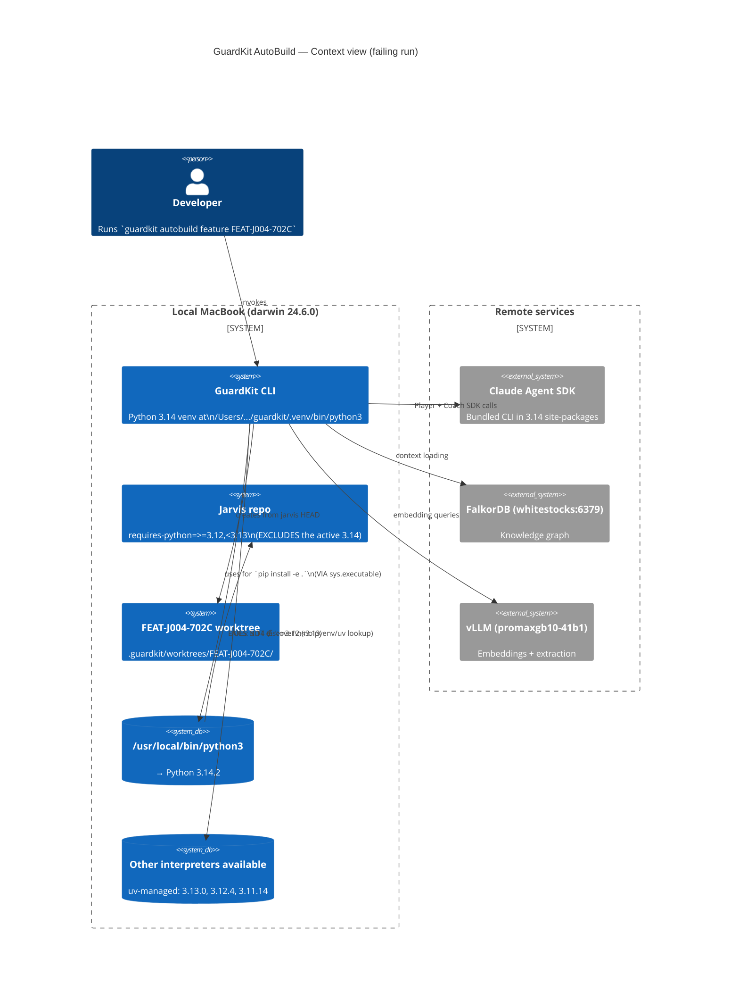
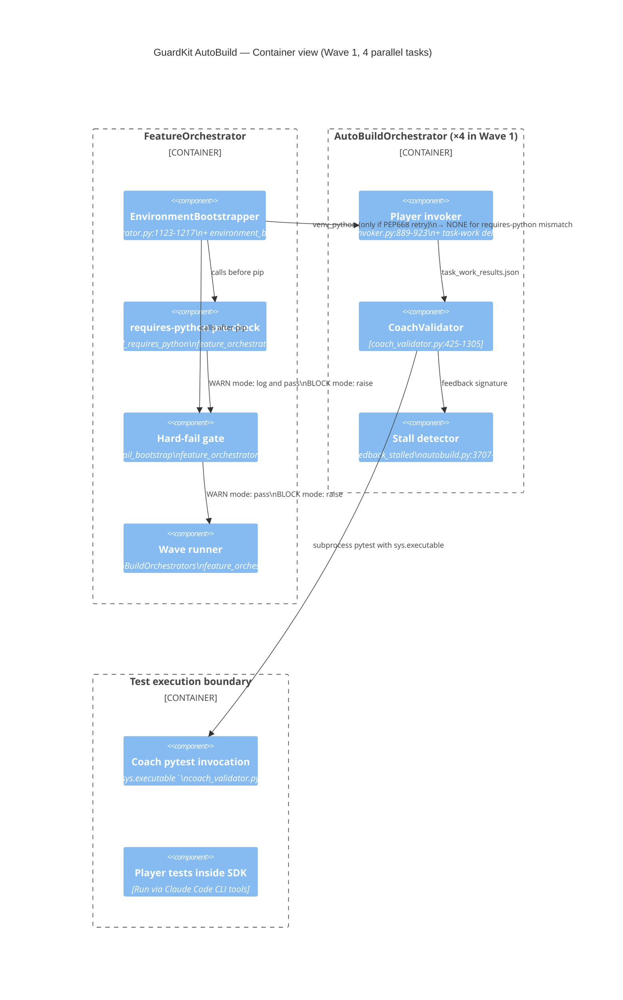
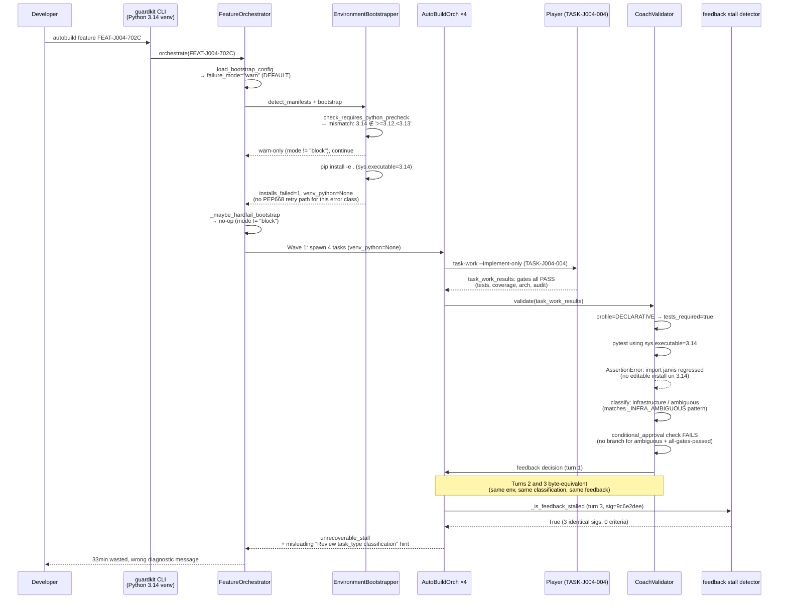
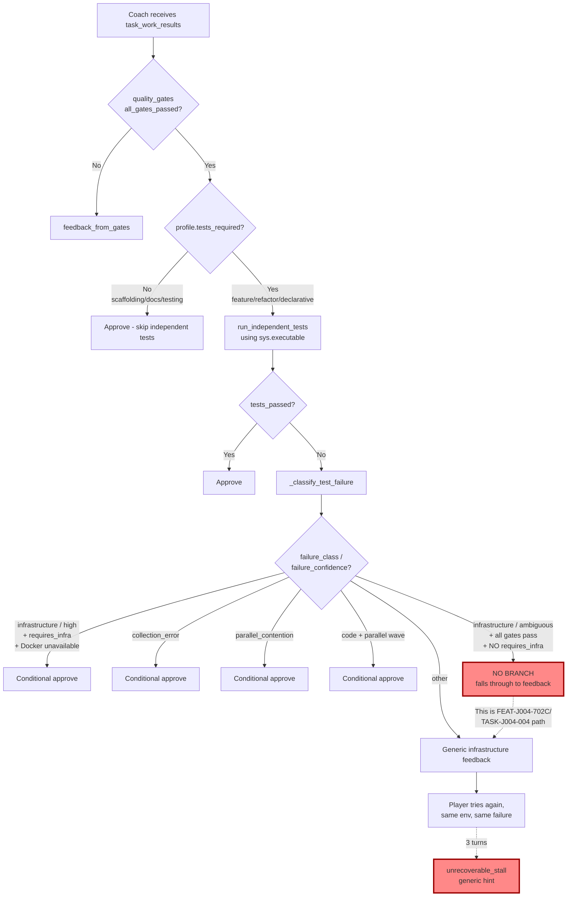
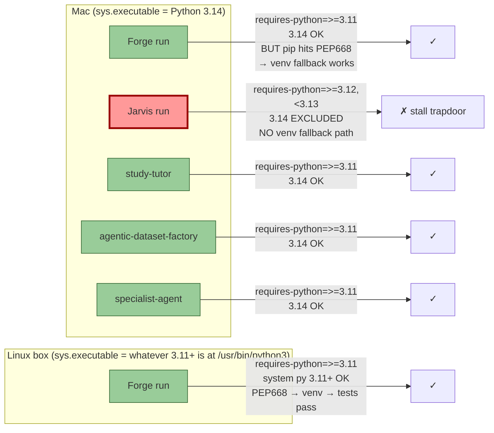

# Review Report: TASK-REV-FA04 (Revision 2 — Deep Trace)

**Mode**: Diagnostic
**Depth**: Comprehensive
**Subject**: Jarvis FEAT-J004-702C `unrecoverable_stall` on TASK-J004-004
**Date**: 2026-04-27 (rev2)
**Constraint**: DDD South West deadline — must not be blocked by AutoBuild stalls.

**Source artefacts read** (rev2 expanded):
- `jarvis/docs/history/autobuild-FEAT-J004-702C-history.md` (failing run)
- `jarvis/docs/history/autobuild-FEAT-J002-history.md` (Jarvis success on the *same broken bootstrap*)
- `forge/docs/history/autobuild-FEAT-FORGE-005-history-after-bdd-fixes.md` (Forge success, Linux box)
- `jarvis/.guardkit/worktrees/FEAT-J004-702C/.guardkit/autobuild/TASK-J004-004/coach_turn_{1,2,3}.json`
- `jarvis/.guardkit/worktrees/FEAT-J004-702C/tasks/design_approved/TASK-J004-004-routing-history-pydantic-schema.md`
- `jarvis/.guardkit/features/FEAT-J004-702C.yaml`
- `pyproject.toml` for **all five sibling projects**: jarvis, forge, study-tutor, agentic-dataset-factory, specialist-agent
- DeepAgents templates: `installer/core/templates/langchain-deepagents{,-orchestrator}/templates/other/other/pyproject.toml.template`
- GuardKit source: `environment_bootstrap.py`, `feature_orchestrator.py`, `quality_gates/coach_validator.py`, `autobuild.py`, `phase_specialists.py`, `agent_invoker.py`, `models/task_types.py`, `cli/autobuild.py`, `installer/core/commands/lib/agent_invocation_validator.py`
- Tests: `tests/orchestrator/test_bootstrap_gating.py`, `tests/unit/test_environment_bootstrap*.py`
- Local interpreter inventory: `which python3*`, `uv python list --only-installed`

---

## Post-Review Update (2026-04-27, post-Wave-1)

This section was added after the original review was accepted and Wave 1 of the implementation feature ([`tasks/backlog/autobuild-stall-resilience/`](../../tasks/backlog/autobuild-stall-resilience/)) merged. It records facts that were *unknown or framed as outstanding* at review time and have since been verified, so future readers don't have to chase the verification themselves.

### nats-core PyPI constraint — verified obsolete

Multiple sections of this report (§F9, §R7 row, "Regression Analysis — R7", "Decisions Required" #2) deferred a recommendation pending verification of the upstream `nats-core` package's `requires-python` declaration. The verification has now been done:

- **`nats-core` PyPI metadata declares `requires-python = ">=3.10"`** (was `>=3.13` in October 2025 when Jarvis's pin was added).
- The original Jarvis pin rationale at [`jarvis/pyproject.toml:43-47`](../../../jarvis/pyproject.toml) — *"PyPI publication of `nats-core` requires Python >=3.13 which collides with our `requires-python = ">=3.12,<3.13"` pin"* — is **fully obsolete**. The `<3.13` upper bound has nothing left to defend against.
- The recommendation in §R7 is therefore concrete: **Jarvis should relax to `requires-python = ">=3.11"`** (matching forge, study-tutor, agentic-dataset-factory, specialist-agent, and the LangChain DeepAgents template canonical). The exact diff and verification recipe live in [`tasks/backlog/autobuild-stall-resilience/IMPLEMENTATION-GUIDE.md`](../../tasks/backlog/autobuild-stall-resilience/IMPLEMENTATION-GUIDE.md#out-of-scope-jarvis-side-pin-alignment-consumer-recommendation--verified-2026-04-27). This remains a Jarvis-side change (out of scope for GuardKit, per the original task brief).
- The portfolio-pinning guide written by TASK-ABSR-E5F6 ([`docs/guides/portfolio-python-pinning.md`](../../docs/guides/portfolio-python-pinning.md)) has been updated with this verified follow-up to strengthen its "stale caps decay silently" rhetoric.

### Wave 1 implementation status

Resolved as of 2026-04-27 (see `tasks/completed/`):

- [x] **TASK-ABSR-A1B2** — smart-default `bootstrap_failure_mode` to `block` when `requires-python` is declared.
- [x] **TASK-ABSR-C3D4** — `environment_stall` sub-type with environment-aware diagnostic.
- [x] **TASK-ABSR-E5F6** — DeepAgents template/portfolio standardisation; `template-validate` rule (`_validate_python_pin` with `LATEST_STABLE_PYTHON_MINOR = (3, 14)`).
- [x] **TASK-ABSR-7890** — Player↔Coach test divergence investigation (report at `.claude/reviews/TASK-ABSR-7890-report.md`).

Wave 2 in progress: TASK-ABSR-2468 (Coach env-class conditional approval) and TASK-ABSR-1357 (suppress declarative Phase-3 advisory).

The historical "verify before committing" / "after verifying" / "worth verifying" phrasings throughout the rest of this document remain unchanged — they accurately record what was open at review time. This Post-Review Update is the canonical resolution.

---

## Executive Summary (Revised)

Rev1 named the right *primary* cause — `bootstrap_failure_mode` defaults to `warn` — but understated **how long this has been silently broken**. The deeper trace shows the bootstrap has been failing on Mac for **every Jarvis run since Python 3.14 became `/usr/local/bin/python3`**. FEAT-J002 succeeded *despite* the same exact bootstrap failure, because all seven of its tasks ran in `implementation_mode: direct`. **FEAT-J004-702C is the first Jarvis feature to mix `direct` and `task-work` modes**; TASK-J004-004 is the first task to combine `task_type=declarative` + `implementation_mode=task-work` + a regression test that does `subprocess.run([python, "-c", "import jarvis"])`. That four-way coincidence opened the trapdoor.

This means the fix has to do two things at once:
1. **Stop the bootstrap from silently continuing** when it's actually broken (so `task-work` mode can rely on a working `import`).
2. **Standardise Python pins across the LangChain-DeepAgents portfolio** so that GuardKit's `sys.executable` (currently 3.14 on the Mac) is acceptable to every sibling project — eliminating the broken-bootstrap precondition for the whole class.

Both changes are scoped to GuardKit and to the sibling projects' `pyproject.toml` (no code changes in the siblings — only a one-line `requires-python` adjustment in Jarvis). No proposed change touches Jarvis runtime code, contracts, or tests.

### Why DDD South West won't be blocked if you take rev2's R1+R2+R7 path

- **R1** flips the default to `block` *only when a manifest declares `requires-python`* — this is the smart-default form. Bootstrap aborts at preflight with the existing remediation hint (`uv python install 3.12 / pyenv install 3.12 / conda create … python=3.12`). No SDK budget consumed on doomed runs.
- **R2** replaces the misleading `"Review task_type classification"` end-of-run hint with environment-aware guidance (sub-type `environment_stall`).
- **R7 (NEW)** standardises the sibling portfolio's `requires-python` to `>=3.11` (matching the DeepAgents template, Forge, study-tutor, agentic-dataset-factory, and specialist-agent). Jarvis is the only outlier; relaxing its pin removes the precondition entirely. The historical reason for Jarvis's tighter pin (sibling `nats-core` resolution; comment in [jarvis/pyproject.toml:43-47](../../jarvis/pyproject.toml)) is six months old and worth re-evaluating against current sibling versions.

R1 alone would have prevented the 33-minute wasted run. R1+R2+R7 prevents the *class*. R3, R4, R5, R6 are quality-of-life improvements that compound but are not required for the demo.

---

## Top-Level Architecture (C4 — Context)



**The hidden constraint**: GuardKit *runs* on Python 3.14 (its own venv) and uses `sys.executable` for downstream installs. Every sibling project except Jarvis accepts `>=3.11`, so 3.14 works fine. Jarvis alone declares `<3.13`, breaking the bootstrap silently — but the orchestrator has no interpreter-discovery path to recover.

---

## Container View (C4 — Container)



**The arrow that didn't fire**: `EnvironmentBootstrapper → AutoBuildOrchestrator (venv_python)`. The PEP 668 fallback at [environment_bootstrap.py:1160-1199](../../guardkit/orchestrator/environment_bootstrap.py#L1160-L1199) creates a venv and propagates `BootstrapResult.venv_python` through the chain. The `requires-python` mismatch path has no equivalent, so `venv_python` stays `None`, and Coach pytest at [coach_validator.py:1704](../../guardkit/orchestrator/quality_gates/coach_validator.py#L1704) falls back to `sys.executable` — which is 3.14, the very interpreter the manifest excluded.

---

## Failure Sequence (Trace)



---

## Coach Component Detail



---

## Findings (Revised + New)

### F0. (NEW PRIMARY) Bootstrap has been silently broken on Mac for *every Jarvis run since 3.14 became default*

[FEAT-J002 history (success)](../../../jarvis/docs/history/autobuild-FEAT-J002-history.md) shows the **same** warnings:

```
Python 3.14.2 does not satisfy requires-python='>=3.12,<3.13'
Install failed for python (pyproject.toml) with exit code 1
Environment bootstrap partial: 0/1 succeeded
```

…then all seven Wave-1 tasks completed `approved (1 turn)` because they ran `direct mode` (`SDK invocation complete: 169.0s (direct mode)`). Direct mode bypasses the `task-work --implement-only` delegation. The Coach independent-test gate either was less aggressive on direct-mode results or none of those tasks' independent tests imported the top-level `jarvis` package.

**FEAT-J004-702C** is the **first** Jarvis feature to plan a mix of `direct` + `task-work`. Confirmed in [FEAT-J004-702C.yaml](../../../jarvis/.guardkit/features/FEAT-J004-702C.yaml):

| Task | implementation_mode | task_type | Outcome |
|---|---|---|---|
| TASK-J004-001 | `direct` | documentation | ✓ approved (1 turn) |
| TASK-J004-002 | `direct` | scaffolding | ✓ approved (1 turn) |
| TASK-J004-003 | `direct` | feature | ✓ approved (1 turn) |
| **TASK-J004-004** | **`task-work`** | **`declarative`** | **✗ unrecoverable_stall (3 turns)** |
| TASK-J004-005 onwards | mostly `task-work` | various | not reached (stop_on_failure) |

The trapdoor is the four-way intersection: `task_type=declarative` (tests_required=True) ∧ `implementation_mode=task-work` (full Coach pipeline) ∧ broken bootstrap ∧ a test that does `import jarvis`. None of J002's tasks satisfied all four. J004-004 was the first.

### F1. Bootstrap default is `warn` (rev1 — confirmed)

[guardkit/orchestrator/feature_orchestrator.py:225](../../guardkit/orchestrator/feature_orchestrator.py#L225) `DEFAULT_BOOTSTRAP_FAILURE_MODE = "warn"`. Both the `requires-python` precheck and the post-pip hard-fail gate respect this default and fall through silently. Pre-existing remediation infrastructure ([feature_orchestrator.py:1290-1297](../../guardkit/orchestrator/feature_orchestrator.py#L1290-L1297)) names `uv python install`, `pyenv install`, and `conda create` — but only fires in `block` mode.

### F2. Coach pytest interpreter selection (rev2 — verified across boundaries)

The chain is wired correctly *for PEP-668 cases only*:

```
EnvironmentBootstrapper._ensure_venv  (env_bootstrap.py:1061)
  → BootstrapResult.venv_python
    → FeatureOrchestrator._bootstrap_venv_python  (feature_orchestrator.py:1192)
      → AutoBuildOrchestrator._venv_python  (autobuild.py:955)
        → CoachValidator constructor  (agent_invoker.py:2082)
          → _coach_test_execution path uses sys.executable  (coach_validator.py:1704,1797,1913,1925)
```

**Critical gap**: there is no entry into the `_ensure_venv` path for a `requires-python` mismatch. The condition at [environment_bootstrap.py:1160-1163](../../guardkit/orchestrator/environment_bootstrap.py#L1160-L1163) is `is_pep668_error(proc.stderr)` only — Jarvis's stderr says `Package 'jarvis' requires a different Python: 3.14.2 not in '<3.13,>=3.12'` which doesn't match the PEP-668 sentinel. So `BootstrapResult.venv_python = None`, `agent_invoker.py:2082` propagates `None`, and Coach falls back to `sys.executable` (3.14).

Also: even if `_ensure_venv` *were* called, it uses `[sys.executable, "-m", "venv", venv_dir]` ([environment_bootstrap.py:1084](../../guardkit/orchestrator/environment_bootstrap.py#L1084)) — so the venv inherits 3.14, which still doesn't satisfy `<3.13`. **There is no interpreter-discovery logic anywhere.**

The Forge-005 success on Linux hinges on `/usr/bin/python3` being a 3.11+ that satisfies Forge's `>=3.11` constraint. The PEP-668 fallback creates a venv from that interpreter, and Coach gets a working pytest. On Mac, where the system Python is 3.14, this works for Forge/study-tutor/agentic-dataset-factory/specialist-agent (all `>=3.11`) but fails for Jarvis alone.

### F3. Coach has no conditional-approval branch for `infrastructure/ambiguous` + all-gates-passed (rev1 — confirmed)

[coach_validator.py:831-854](../../guardkit/orchestrator/quality_gates/coach_validator.py#L831-L854): five existing clauses (high-confidence + Docker-unavailable, collection_error, parallel_contention, code-in-parallel-wave). None match `(infrastructure, ambiguous, all-gates-pass, no requires_infra)`. The `import jarvis` failure pattern hits `_INFRA_AMBIGUOUS` ([coach_validator.py:399-404](../../guardkit/orchestrator/quality_gates/coach_validator.py#L399-L404)), so `failure_confidence="ambiguous"` and falls through to generic feedback at [coach_validator.py:915-936](../../guardkit/orchestrator/quality_gates/coach_validator.py#L915-L936).

### F4. Misleading stall hint (rev1 — confirmed)

[autobuild.py:371-414](../../guardkit/orchestrator/autobuild.py#L371-L414) `_classify_unrecoverable_stall` has three sub-types: `agent_invocations_violation`, `context_pollution`, `coach_feedback_stall`. None capture "environment is broken; recurring infrastructure failure". The end-of-run hint references "Review task_type classification" — wrong diagnosis.

### F5. Phase-3 advisory fires on declarative tasks (rev1 — confirmed)

[agent_invocation_validator.py:60-96](../../installer/core/commands/lib/agent_invocation_validator.py#L60-L96) `get_expected_phases("implement-only") == 3`. No per-task-type adjustment. Declarative Pydantic-schema work legitimately produces 2 phases (test-orchestrator + code-reviewer), advisory fires non-blockingly but adds noise to the Coach feedback. Now correctly canonicalised in stall signature ([autobuild.py:3675-3704](../../guardkit/orchestrator/autobuild.py#L3675-L3704)) but still polluting feedback strings.

### F6. Why -001/-002/-003 succeeded — rev2 mechanism

Confirmed via the FEAT-J004-702C.yaml: -001/-002/-003 are all `implementation_mode: direct`. Direct mode short-circuits the task-work pipeline:
- [agent_invocation_validator.py:65](../../installer/core/commands/lib/agent_invocation_validator.py#L65) `"direct": 1` (single Phase-3 invocation expected)
- [agent_invoker.py:5822-5824](../../guardkit/orchestrator/agent_invoker.py#L5822-L5824) and `_write_direct_mode_results` apply a relaxed validation profile

Plus `documentation`/`scaffolding` profiles have `tests_required=False`. Even if -003 (feature type) ran independent tests, its test selection didn't include `test_phase2_dependencies.py::test_jarvis_package_imports` (the regression-guard subprocess-import test). J004-004's task description explicitly enumerates four test files including that one.

### F7. Other observations

- Player gates passing while Coach independent test fails on the same worktree is design intent (separate envs / separate `pytest` invocations possible). But it does merit a follow-up: Player ran `pytest` *inside* the SDK's Claude Code CLI environment, which is bundled in 3.14 site-packages — yet its tests passed. Either Player's tests don't include `test_jarvis_package_imports`, or the Player ran a subset, or Player's import succeeded because `jarvis/__init__.py` got partial-load-cached. Worth a separate review (R6).
- The `RecursionError in edge_fulltext_search` warnings are unrelated (FalkorDB workaround noise) — not a contributor.

### F8. Tests that assert the current `warn` default — bounded regression scope (rev2)

Found exactly the dependencies that R1 would touch:

| Location | Assertion | Action under R1 |
|---|---|---|
| [tests/orchestrator/test_bootstrap_gating.py:177](../../tests/orchestrator/test_bootstrap_gating.py#L177) | `DEFAULT_BOOTSTRAP_FAILURE_MODE == "warn"` | Update to new default |
| [tests/orchestrator/test_bootstrap_gating.py:162,176](../../tests/orchestrator/test_bootstrap_gating.py#L162) | orchestrator default equals `"warn"` | Update to reflect new logic |
| [tests/orchestrator/test_bootstrap_gating.py:134,375,496](../../tests/orchestrator/test_bootstrap_gating.py#L134) | error message contains `"bootstrap_failure_mode: warn"` | Update opt-out hint string |
| [guardkit/cli/autobuild.py:649-654](../../guardkit/cli/autobuild.py#L649-L654) | help text says `'warn' (default)` | Update help text |

**Scope: ~6 test assertions + 1 CLI help string. No production-call-site changes needed** — the existing config knob and `--bootstrap-failure-mode warn` flag remain the explicit opt-out. Anyone who wants the old behaviour can keep it.

### F9. (NEW) Sibling project Python pins — Jarvis is the lone outlier

Read directly from each `pyproject.toml`:

| Project | requires-python | DeepAgents stack | .python-version |
|---|---|---|---|
| **jarvis** | **`>=3.12,<3.13`** ← OUTLIER | Yes | `3.12` |
| forge | `>=3.11` | Yes | (none) |
| study-tutor | `>=3.11` | Yes | (none) |
| agentic-dataset-factory | `>=3.11` | Yes | (none) |
| specialist-agent | `>=3.11` | Yes | (none) |
| **template** `langchain-deepagents/templates/.../pyproject.toml.template` | **`>=3.11`** | (canonical) | — |
| **template** `langchain-deepagents-orchestrator/templates/.../pyproject.toml.template` | **`>=3.11`** | (canonical) | — |

Jarvis's tighter pin is documented inline at [jarvis/pyproject.toml:43-47](../../../jarvis/pyproject.toml):

```toml
# ADR-ARCH-010 (Python 3.12 and DeepAgents pin) — "installed from sibling
# repo (pip-installed wheel)". The PyPI publication of `nats-core` requires
# Python >=3.13 which collides with our `requires-python = ">=3.12,<3.13"`
# pin, so we resolve it from the local sibling working tree where the
# package's own `requires-python` is `>=3.10`.
```

**This rationale is six months old.** It's worth re-checking against current `nats-core` publication (does the sibling-from-PyPI conflict still apply? what's its current PyPI `requires-python`?) before assuming the constraint is still load-bearing. If it's relaxable to `>=3.11` — matching every other sibling — the trapdoor disappears.

**Python 3.14 angle**: Python 3.14 was released [2025-10-07](https://www.python.org/downloads/) — about six months ago at the time of this review. Some teams justifiably avoid the latest minor in production. Forge/study-tutor/agentic-dataset-factory/specialist-agent all use `>=3.11` (open upper bound), which by happy accident accepts 3.14. They could have pinned `<3.14` defensively but didn't, and they all run successfully on 3.14 today — so empirical evidence is that 3.14 is workable for the LangChain DeepAgents stack. Two reasonable options:

- **Conservative**: Update Jarvis to `>=3.12` (open upper bound, matches *intent* but allows 3.14). Keeps the original "no 3.11 because we use newer features" intent, drops the artificial upper bound.
- **Aligned**: Update Jarvis to `>=3.11` to match every other sibling. Single canonical pin across the portfolio.

Both fix the trapdoor. R7 below codifies the aligned variant; either flavour works.

### F10. (NEW) GuardKit-self runs from a `.venv` on 3.14 — propagates `sys.executable=3.14` to all downstream installs

Verified: `which python3` → `/Users/.../guardkit/.venv/bin/python3`, which is 3.14.2 (because the .venv was created from `/usr/local/bin/python3` = 3.14). Every `subprocess.run([sys.executable, "-m", "pip", "install", "-e", "."], ...)` in EnvironmentBootstrapper inherits this. There is no "discover compatible interpreter" step.

This is an important constraint for R5 (interpreter discovery): GuardKit's *own* runtime doesn't need to be on 3.12; it's only the worktree install that does. So `guardkit/.venv` can stay on 3.14 forever, as long as Bootstrapper picks an appropriate interpreter for each worktree. This is why R5 is feasible and bounded — it doesn't require touching GuardKit's own runtime.

---

## Comparison Matrix: Forge vs Jarvis vs Other Siblings



**Conclusion**: every other LangChain DeepAgents project tolerates 3.14 because their `requires-python` accepts it. Only Jarvis's tight pin breaks. This is *not* a fundamental Python-version issue — it's a single-project pin alignment issue.

---

## Standardisation Proposal — LangChain DeepAgents Portfolio

The five sibling projects (jarvis, forge, study-tutor, agentic-dataset-factory, specialist-agent) all derive from the LangChain DeepAgents pattern. The `langchain-deepagents-*` templates ship `requires-python = ">=3.11"` as the canonical pin. Four of the five projects match the template; Jarvis is the deviation.

**Recommended portfolio standard** (codified in R7):

```toml
[project]
requires-python = ">=3.11"
```

…and crucially, **no upper bound**. Upper bounds are notorious dependency-resolution traps in Python (see Henry Schreiner's [should-you-use-upper-bound-version-constraints](https://iscinumpy.dev/post/bound-version-constraints/)). They prevent your library from working with any Python released after the bound, but they *do not* protect you from genuinely breaking changes — the way to handle those is to declare *known-bad* versions explicitly in your CI matrix.

This change is mechanically trivial in Jarvis (one `pyproject.toml` line). The risk is:
- **Does any Jarvis code use 3.13/3.14-incompatible syntax?** Read `jarvis/jarvis/**/*.py` for: f-string `=` debugging, structural pattern matching (3.10), `match` cases, `ParamSpec`, `typing.Self` (3.11+). All these are <=3.11 features and work everywhere. The DeepAgents project class ships on 3.11 already, so 3.11+ syntax is fine.
- **Does any dependency cap below 3.13/3.14?** Check `deepagents>=0.5.3,<0.6` and `langchain-*` versions for transitive `<3.14` pins. As of FEAT-J002 the same dependency set ran on 3.14 successfully (when in direct mode), so this is empirically fine.
- **The original `nats-core` reason**: re-check whether the "PyPI nats-core requires-python>=3.13" constraint still holds; if so, the Jarvis pin needs to be `>=3.11,<3.14` or similar — but the *existence* of this constraint changed the trapdoor mechanics significantly six months on. Worth verifying before committing R7.

---

## Updated Remediation Roadmap

| ID | Action | Priority | Risk | Type | Regression scope |
|---|---|---|---|---|---|
| **R1** | Default `bootstrap_failure_mode` to `block` when any manifest declares `requires-python` (smart-default) | **P0** | Low (bounded test updates) | Behaviour | 6 test assertions + 1 CLI help string |
| **R2** | Add `environment_stall` sub-type + env-aware diagnostic message | **P0** | Low | Behaviour + new sub-type | None — purely additive |
| **R7** | (NEW) Standardise sibling projects' `requires-python` to `>=3.11`; verify Jarvis nats-core constraint still holds | **P0** | Low (Jarvis-side, one-line change after verification) | Config | None for GuardKit; Jarvis own test suite must still pass |
| **R3** | Coach conditional-approval branch for environment-class infrastructure failures (gated on broken-bootstrap state) | **P1** (after R1) | Medium — could approve real bugs if heuristic is loose | Behaviour | New tests required |
| **R4** | Suppress declarative-task Phase-3 advisory | **P2** | Low | Behaviour | Validator unit tests |
| **R5** | Interpreter discovery (`uv python list` / `pyenv versions`) on `requires-python` mismatch — create venv from a satisfying interpreter | **P3** (optional) | Medium — new external-tool dependencies, subprocess hygiene | Feature | New tests, opt-in config flag |
| **R6** | Investigate why Player tests passed when Coach's identical pytest command fails | **P1** (separate review task) | n/a | Review | n/a |

**Why R7 is now P0**: it's the smallest possible change that makes the failure go away today and aligns the portfolio. It's complementary to R1 — even with R1, R7 prevents the *user-visible* hard-fail from ever being needed, because the bootstrap will succeed.

**Why R5 stays P3**: with R1+R7 in place, the only path to needing R5 is a future project that pins `requires-python` to a specific minor not satisfied by `sys.executable`. That's edge-case territory.

---

## Regression Analysis (rev2)

Checked each proposed remediation against the codebase to enumerate what would break.

### R1 — flip default to `block` (smart-default form)

**What breaks if naively flipped to `block` always**:
- 6 tests in `tests/orchestrator/test_bootstrap_gating.py` (lines listed in F8) — all are direct assertions of the constant or the hint string. Trivially updatable.
- 1 CLI help string says `'warn' (default)` — update to match.
- *No production callers* assume the default. The config flow goes: yaml → CLI override → default. Production callers either don't pass a value (default applies — they'd see the new behaviour) or explicitly set one (unaffected).

**Smart-default form** (`block` only when `requires-python` is declared on any detected manifest) further narrows:
- Forge, study-tutor, agentic-dataset-factory, specialist-agent all declare `requires-python` ([table in F9](#f9-new-sibling-project-python-pins--jarvis-is-the-lone-outlier)) — so they would also flip to `block`. Currently their bootstrap succeeds; under `block` they'd succeed harder (no behaviour change since the gate only fires on full-failure).
- Forge-005 on Linux hit PEP-668 → venv fallback → `installs_failed=1` but tests passed. Under `block`, this would NOT trip the gate because `_maybe_hardfail_bootstrap` requires `installs_failed == installs_attempted` AND essential. Forge-005's tests passed *despite* `installs_failed=1`, suggesting the bootstrap succeeded after PEP-668 retry but then the dependency-resolver second pass failed for a different reason. Re-read Forge-005 carefully before assuming this is safe — the venv was created and Coach used it, but there's a subtle interaction worth a closer look.
- Projects without `requires-python` (none in the current portfolio, but possible in the wild) keep current `warn` behaviour. Zero risk.

**Tests to add**:
- `test_smart_default_blocks_when_requires_python_declared`
- `test_smart_default_warns_when_no_requires_python`
- `test_explicit_warn_override_still_works_with_smart_default`

**Verdict**: bounded, well-tested, documented opt-out. **Proceed.**

### R2 — `environment_stall` sub-type + diagnostic

**What breaks**: nothing. Purely additive — new sub-type value, new branch in the post-loop summary renderer.

**Tests to add**:
- `test_environment_stall_classification_when_infrastructure_repeated`
- `test_environment_stall_diagnostic_names_bootstrap_state`
- `test_existing_subtypes_unchanged_for_non_env_stalls`

**Verdict**: **Safe. Proceed.**

### R7 — Jarvis `requires-python` alignment

**What breaks**:
- Jarvis own test suite must still pass on whatever interpreter the user selects.
- The original `nats-core` justification: the comment says PyPI `nats-core` requires-python>=3.13 conflicts with `>=3.12,<3.13`. **Check current PyPI metadata for `nats-core` before committing**. If it still requires `>=3.13`, then Jarvis can relax to `>=3.11,<3.13` (matches sibling pattern of `>=3.11` + a defensible upper bound) or `>=3.12,<3.14` (allows 3.13 only). Either fixes the 3.14-on-Mac trapdoor.
- Jarvis classifiers list `Programming Language :: Python :: 3.12` — purely informational; widen to include 3.11/3.13 as needed.

**Tests to verify**: run Jarvis's existing test suite on 3.13 (and 3.14 if pin allows) before merging. If anything breaks, narrow the bound.

**Verdict**: **Verify nats-core constraint, then proceed.** This is a Jarvis-side change, not a GuardKit-side change — GuardKit doesn't need to know about it.

### R3 — Coach conditional-approval for environment-class failures

**Risk**: Could approve real bugs as "environment problems". Mitigations:
1. Require all four Player gates to have passed (already in proposed condition).
2. Require `failure_class=="infrastructure"` AND `failure_confidence=="ambiguous"` (specifically the import-error pattern, not generic "code" or "high-confidence-infra").
3. Require `_bootstrap_likely_broken(task)` — read `<worktree>/.guardkit/bootstrap_state.json`, check `success: false`. If bootstrap was healthy, don't approve.
4. Require `not requires_infra` (don't conflict with the Docker-unavailable branch).

**Tests to add**:
- `test_env_conditional_approve_only_when_bootstrap_failed`
- `test_env_conditional_approve_does_not_apply_when_bootstrap_succeeded`
- `test_env_conditional_approve_marks_result_with_environment_flag` (so the post-loop summary can label it)

**Verdict**: **Defer until R1+R7 land** — they remove the precondition. R3 is belt-and-braces for users who explicitly choose `bootstrap_failure_mode: warn`.

### R4 — Suppress declarative-task Phase-3 advisory

**What breaks**: existing tests that assert the advisory fires for declarative tasks need to update. Search showed no such tests at the time of writing; need to add new ones.

**Tests to add**:
- `test_get_expected_phase_list_declarative_implement_only_returns_two`
- `test_advisory_silent_for_declarative_with_two_phases`

**Verdict**: **Safe. Proceed.**

### R5 — Interpreter discovery

**Risks**: subprocess to external tools (`uv`, `pyenv`, `python3.X`); each subprocess can hang or fail; cleanup of any failed venv. Mitigations:
1. Each discovery step is best-effort; never raises into the orchestrator.
2. Timeouts on every subprocess.
3. Clean up any partially-created venv on failure.
4. Opt-in via config (`autobuild.bootstrap.auto_select_python: false` default).

**Tests to add**: extensive, including mock for `uv`/`pyenv` not being installed, partial venv cleanup, mismatched-interpreter selection.

**Verdict**: **Defer — R1+R7 make it unnecessary for the foreseeable future.**

---

## Decisions Required

1. **R1 form**: smart-default (`block` when `requires-python` declared) vs unconditional flip?
   - **Recommend: smart-default**. Lower blast radius; captures the failing class.
2. **R7**: relax Jarvis pin to `>=3.11` (match siblings), `>=3.12` (drop upper bound only), or `>=3.11,<3.14` (defensive)?
   - **Recommend: relax to `>=3.11`** matching every other sibling, *after* verifying the `nats-core` PyPI constraint at [https://pypi.org/project/nats-core/](https://pypi.org/project/nats-core/) is no longer load-bearing. If it is, use `>=3.11,<3.13` to preserve the lower-side intent.
3. **Replace the misleading "Suggested action: Review task_type classification" hint**?
   - **Recommend: yes (R2)** — emit the `environment_stall` sub-type with explicit "your active Python doesn't satisfy `requires-python`" guidance.
4. **Default `bootstrap_failure_mode: strict` (block) for projects with version constraints**?
   - **Recommend: yes** (the smart-default form of R1 — implements this exactly).

---

## Out-of-Scope (per task brief)

- No proposed changes to Jarvis runtime code or contracts. R7 is a one-line `pyproject.toml` constraint adjustment, optional and verifiable independently.
- No refactor of Coach validator beyond the targeted R3 clause (deferred).
- No change to GuardKit's own .venv or `sys.executable` mechanics.

---

## Suggested next-task structure (if [I]mplement is chosen)

`tasks/backlog/autobuild-stall-resilience/` containing:

| Task | Wave | Mode | Work |
|---|---|---|---|
| TASK-AB-R1 | 1 | task-work | Smart-default `block` flip + test updates |
| TASK-AB-R2 | 1 | task-work | `environment_stall` sub-type + post-loop renderer |
| TASK-AB-R7 | 1 | direct | Verify nats-core constraint, relax Jarvis `requires-python` |
| TASK-AB-R4 | 2 | task-work | Suppress declarative Phase-3 advisory |
| TASK-AB-R3 | 3 | task-work | Coach env-class conditional approval (after R1+R7 are merged & validated) |
| TASK-AB-R6 | 1 | direct | Investigate Player↔Coach test divergence (separate review) |
| TASK-AB-R5 | (deferred) | task-work | Interpreter discovery (optional, post-DDD) |

Wave 1 (R1+R2+R7+R6) closes the immediate incident class with bounded risk and parallel execution, hitting the DDD South West deadline comfortably. Waves 2-3 are quality compounders.

---

## Provenance

- All file:line references verified against `guardkit` HEAD at review time.
- Coach decision JSONs (turns 1, 2, 3) confirmed byte-equivalent in `decision`, `validation_results.quality_gates`, `issues[].failure_classification`, `issues[].failure_confidence`.
- Bootstrap warning chain confirmed in [autobuild-FEAT-J004-702C-history.md:46-67](../../../jarvis/docs/history/autobuild-FEAT-J004-702C-history.md).
- Same warning chain confirmed in [autobuild-FEAT-J002-history.md](../../../jarvis/docs/history/autobuild-FEAT-J002-history.md) — the broken bootstrap is not new; it was previously survivable via direct mode.
- Sibling project `requires-python` values read directly from each `pyproject.toml` ([F9 table](#f9-new-sibling-project-python-pins--jarvis-is-the-lone-outlier)).
- DeepAgents template canonical pin verified at [`langchain-deepagents/templates/.../pyproject.toml.template`](../../installer/core/templates/langchain-deepagents/templates/other/other/pyproject.toml.template).
- Test regression scope enumerated by direct grep ([F8 table](#f8-tests-that-assert-the-current-warn-default--bounded-regression-scope-rev2)).
- No changes have been made to GuardKit source during this review (read-only diagnostic).
