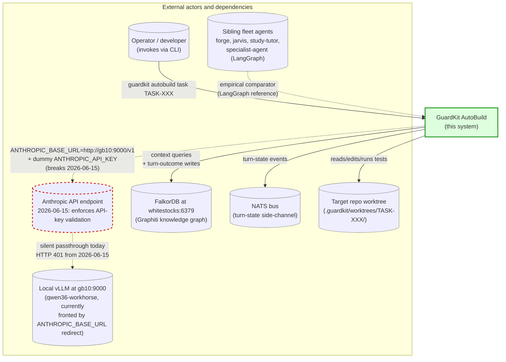

# Implementation Guide: AutoBuild Harness Migration

> **Companion to**: [`TASK-REV-HMIG-review-report.md`](./TASK-REV-HMIG-review-report.md)
> **Purpose**: seeds the follow-on `/feature-plan` if the user selects **[I]mplement** at the Phase 5 decision checkpoint of `/task-review TASK-REV-HMIG`.
> **Format**: machine-readable enough for `/feature-plan` + `/feature-build` to parse; human-readable enough to review manually.
> **Deadline**: cutover D-5 = 2026-06-10 (5-day validation margin before Anthropic API-key enforcement on 2026-06-15).
> **Total estimated effort**: ~229h across 4 waves, distributed across 27 days × ~10h/day capacity (~270h) with ~41h slack. *(Revisions §14.7 + §14.8 in the main report — v1 was 239h / 31h; Revision 1 was 223h / 47h; Revision 2 is 229h / 41h after adding the `guardkitfactory` repo bootstrap.)*
> **Implementation home**: per **Revision 2 (D-01)** the harness lives in a new repo `guardkitfactory`, initialised from the `langchain-deepagents` template. `guardkit` (this repo) imports `guardkitfactory` as a dependency; the `HarnessAdapter` interface (in `guardkit`) decouples the two.

---

## How to use this guide

1. At the `/task-review` Phase 5 checkpoint, choose **[I]mplement**.
2. The orchestrator parses this file's `## Subtask N` blocks (one per follow-on task) and creates `tasks/backlog/autobuild-harness-migration/` with subtask files matching the structure below.
3. Each subtask file inherits `parent_review: TASK-REV-HMIG` and `feature_id: FEAT-HMIG` provenance ([`.claude/rules/task-workflow.md`](../rules/task-workflow.md)).
4. Wave 1 starts immediately. Wave 2 starts when Wave 1 falsifiers pass. Wave 3 starts when Wave 2 falsifiers pass. Wave 4 is staged cutover.
5. Each task is ≤8h and has a written falsifier. If a falsifier fails, that task's outcome is recorded but the wave does **not** advance until the failing task is resolved or its falsifier is explicitly relaxed by the operator.

---

## Feature metadata

```yaml
feature_id: FEAT-HMIG
feature_name: AutoBuild Harness Migration (Claude SDK → LangGraph/DeepAgents)
parent_review: TASK-REV-HMIG
created: 2026-05-19
revised: 2026-05-19   # Revision 2; see main report §14.8
deadline: 2026-06-15
cutover_target: 2026-06-10
implementation_home:
  primary_repo: guardkitfactory     # new repo per Revision 2 / D-01
  template: langchain-deepagents    # per Revision 2 / D-01a
  consumer_repo: guardkit           # imports guardkitfactory as a dependency
total_effort_hours: 229   # Revision 2: was 223 (Revision 1), 239 (v1)
validation_slack_hours: 41
total_waves: 4
total_subtasks: 8         # Revision 2: added TASK-HMIG-000 bootstrap (was 7 in Revision 1, 10 in v1)
falsifier_threshold_first_pass_success: 0.75   # central recommendation falsifier
```

---

## Subtask 0 — NEW (Revision 2)

```yaml
id: TASK-HMIG-000
title: Bootstrap guardkitfactory repo from langchain-deepagents template
wave: 1
parallel_group: 1A
implementation_mode: task-work
intensity: standard
effort_hours: 4
depends_on: []
falsifier: "From a clean checkout of guardkitfactory: `uv sync && pytest tests/` succeeds. `python -c 'from guardkitfactory import HarnessAdapter'` imports without error. Template render produced no obvious gaps (lib/factory_guards.py, lib/json_extractor.py, lib/retry_context.py, lib/session_logging.py all present and importable)."
parent_review: TASK-REV-HMIG
feature_id: FEAT-HMIG
revision: 2
revision_rationale: "Per main report §14.8, the harness lives in a new repo guardkitfactory initialised from the langchain-deepagents template (D-01 + D-01a)."
```

**Acceptance criteria**:

- [ ] New repo `guardkitfactory` created (location: operator's call; suggested `~/Projects/appmilla_github/guardkitfactory/`).
- [ ] Bootstrap command run: `mkdir guardkitfactory && cd guardkitfactory && guardkit init langchain-deepagents`.
- [ ] `pyproject.toml` configured with portfolio-Python-pinning standard ([`docs/guides/portfolio-python-pinning.md`](../../docs/guides/portfolio-python-pinning.md)): pin `deepagents>=0.5,<1`, `langgraph>=1,<2`, `langchain>=1.2,<2`, `langchain-core>=1.2,<2`. `requires-python = ">=3.11"`.
- [ ] CI scaffolding: `uv sync && pytest tests/` + basic ruff/mypy on smoke surface.
- [ ] First commit on `main` branch with template-rendered files only — no migration-specific code yet. This commit is the empirical proof the template renders cleanly.
- [ ] `guardkitfactory` exports a `HarnessAdapter` placeholder (interface only, no implementation yet — implementation lives in TASK-HMIG-001). Cross-import smoke from `guardkit` works: `pip install -e ../guardkitfactory && python -c "from guardkitfactory import HarnessAdapter"`.
- [ ] Document the bootstrap in `guardkitfactory/README.md` so future contributors can recreate from scratch.

**Implementation files (expected — in `guardkitfactory` repo)**:
- `pyproject.toml`
- `src/guardkitfactory/__init__.py`
- `src/guardkitfactory/harness/__init__.py`
- `src/guardkitfactory/harness/adapter.py` (placeholder; full implementation in TASK-HMIG-001)
- `lib/factory_guards.py` (template-provided)
- `lib/json_extractor.py` (template-provided)
- `lib/retry_context.py` (template-provided)
- `lib/session_logging.py` (template-provided)
- `tests/test_smoke.py`
- `.github/workflows/ci.yml`
- `README.md`

---

## Subtask 1 — REVISED 2026-05-19 (Revision 2: split across repos)

```yaml
id: TASK-HMIG-001
title: Define HarnessAdapter interface (guardkit) + LangGraphHarness skeleton (guardkitfactory)
wave: 1
parallel_group: 1A
implementation_mode: task-work
intensity: standard
effort_hours: 4
depends_on: [TASK-HMIG-000]
falsifier: "Unit test (in guardkitfactory): instantiate LangGraphHarness with a stub model, call invoke() with a dual-system-message input, assert it raises ValueError per assert_no_system_messages() guard (TASK-REV-R2A1). Cross-repo import smoke (from guardkit/.venv): `pip install -e ../guardkitfactory && python -c 'from guardkitfactory import LangGraphHarness'` succeeds."
parent_review: TASK-REV-HMIG
feature_id: FEAT-HMIG
revision: 2
revision_rationale: "Per main report §14.8 (D-01), HarnessAdapter interface lives in guardkit so ClaudeSDKHarness (legacy in-repo) can implement it. LangGraphHarness implementation lives in guardkitfactory using the langchain-deepagents template's lib/ scaffolding (factory_guards.assert_no_system_messages, json_extractor)."
```

**Acceptance criteria**:

- [ ] In `guardkit` (this repo): `guardkit/orchestrator/harness/__init__.py`, `harness/adapter.py` — `HarnessAdapter` ABC only (no implementation).
- [ ] In `guardkitfactory` (new repo): `src/guardkitfactory/harness/langgraph_harness.py` — `LangGraphHarness(HarnessAdapter)` wrapping `create_deep_agent(model=..., backend=LocalShellBackend(...), permissions=[...])`.
- [ ] `HarnessAdapter` ABC defines `invoke(prompt, role, tools, cwd, *, timeout_seconds) -> AsyncIterator[HarnessEvent]` and `session_id` / `supports_resume` properties.
- [ ] `_extract_last_ai_message()` lifted from specialist-agent's `generation_loop.py:364-410` and placed in `guardkitfactory/src/guardkitfactory/harness/extractors.py`; used in `LangGraphHarness.invoke()` to terminate the stream.
- [ ] `assert_no_system_messages()` guard imported from template-provided `guardkitfactory/lib/factory_guards.py` and called at every `agent.invoke()` site.
- [ ] Unit tests (in `guardkitfactory`) cover: happy-path `invoke` returns a final assistant message; dual-system-message raises `ValueError`; unknown model raises a clear error; stream is async-iterable.
- [ ] Cross-repo import smoke (in `guardkit`): with `guardkitfactory` editable-installed in `guardkit/.venv`, `from guardkitfactory import LangGraphHarness` resolves.

**Implementation files (expected)**:

In `guardkit` (this repo):
- `guardkit/orchestrator/harness/__init__.py`
- `guardkit/orchestrator/harness/adapter.py` (interface only)
- `tests/orchestrator/harness/test_adapter_interface.py`

In `guardkitfactory` (new repo):
- `src/guardkitfactory/harness/langgraph_harness.py`
- `src/guardkitfactory/harness/extractors.py`
- `tests/harness/test_langgraph_harness.py`

---

## Subtask 2 — REVISED 2026-05-19 (replaces v1 Subtasks 2/3/4/5)

```yaml
id: TASK-HMIG-002R
title: Configure DeepAgents LocalShellBackend + FilesystemPermission for AutoBuild worktree needs
wave: 1
parallel_group: 1A
implementation_mode: task-work
intensity: standard
effort_hours: 6
depends_on: [TASK-HMIG-001]
falsifier: "Integration test: instantiate LangGraphHarness via TASK-HMIG-001 with the configured LocalShellBackend + permissions; invoke an agent (stub model with canned tool-use responses) against a fixture worktree; assert (a) ls/read_file/write_file/edit_file/glob/grep/execute all succeed inside the worktree, (b) FilesystemPermission deny-rule blocks writes to .git/, .guardkit/state_transitions.json, and tasks/*, (c) execute honours timeout=600 and max_output_bytes=1_000_000, (d) traversal outside root_dir (e.g. ../../../etc/passwd) is blocked by virtual_mode=True."
parent_review: TASK-REV-HMIG
feature_id: FEAT-HMIG
supersedes: [TASK-HMIG-002, TASK-HMIG-003, TASK-HMIG-004, TASK-HMIG-005]
supersedes_rationale: "v1 estimated ~22h to port read_file/write_file/edit_file/bash custom tools from specialist-agent or implement them fresh. DeepAgents v0.5+ ships these as built-in tools via the backend protocol. The deploy-coding-agent example demonstrates the production pattern with zero Python code. See main report §14 Revision log."
```

**Acceptance criteria**:

- [ ] `guardkit/orchestrator/harness/backend_config.py` exposes a `build_autobuild_backend(worktree: Path) -> LocalShellBackend` factory that returns the configured backend.
- [ ] `LocalShellBackend` parameters: `root_dir=<worktree>`, `virtual_mode=True`, `env={"PATH": <safe-path>, "PYTHONPATH": <worktree-venv>, ...}`, `inherit_env=False`, `timeout=600`, `max_output_bytes=1_000_000`.
- [ ] `guardkit/orchestrator/harness/permissions.py` exposes `build_autobuild_permissions() -> list[FilesystemPermission]` returning deny-rules for `.git/**`, `.guardkit/state_transitions.json`, `.guardkit/autobuild/*/coach_*.json` (Coach writes via orchestrator, not Player), and any other paths the orchestrator owns.
- [ ] `LangGraphHarness` from TASK-HMIG-001 accepts both at construction: `LangGraphHarness(model=..., backend=build_autobuild_backend(worktree), permissions=build_autobuild_permissions())`.
- [ ] If GuardKit-specific atomic-write or backup-on-edit semantics are needed, a thin `PolicyWrapper` per the [deepagents/backends policy-hook pattern](https://docs.langchain.com/oss/python/deepagents/backends) is added to the factory. NOT a custom tool. The wrapper is optional and added only if canary failure-rate data justifies it.
- [ ] Integration tests covering the four falsifier dimensions (positive tool flow, permission denial, timeout, traversal block).
- [ ] No custom `@tool` decorated functions for read/write/edit/bash. If the operator decides to add one later, it's outside this task.

**Implementation files (expected)**:
- `guardkit/orchestrator/harness/backend_config.py`
- `guardkit/orchestrator/harness/permissions.py`
- `tests/orchestrator/harness/test_backend_config.py`
- `tests/orchestrator/harness/test_permissions.py`

**Composite Wave 1 falsifier** (gates Wave 2 start): running `LangGraphHarness.invoke()` against a no-op synthetic Player ("write `hello world` to `out.txt` in the worktree") in a fixture worktree must produce a byte-identical `player_turn_1.json` to what the SDK Player would produce for the same task.

> **v1 task definitions preserved for audit**: the v1 plan defined four separate subtasks (TASK-HMIG-002 port read_file/list_directory, TASK-HMIG-003 write_file, TASK-HMIG-004 edit_file, TASK-HMIG-005 bash). Total v1 effort: 4+4+8+6 = 22h. The v1 plan is still a valid implementation path if the operator prefers custom tools for finer-grained control; restore §7.1 in the main report and the four subtasks here. See main report §14.6 for the conditions under which v1 should be preferred.

---

## Subtask 6

```yaml
id: TASK-HMIG-006
title: Refactor agent_invoker._invoke_with_role to dispatch through HarnessAdapter
wave: 2
parallel_group: 2A
implementation_mode: task-work
intensity: strict
effort_hours: 8
depends_on: [TASK-HMIG-001, TASK-HMIG-002R]
falsifier: "pytest guardkit/orchestrator/tests/test_agent_invoker.py passes with GUARDKIT_HARNESS=sdk (every existing test still green). Same test file with GUARDKIT_HARNESS=langgraph passes the new langgraph-harness fixtures. Crucially: no existing test sees a behavioural diff caused by the refactor when GUARDKIT_HARNESS=sdk."
parent_review: TASK-REV-HMIG
feature_id: FEAT-HMIG
```

**Acceptance criteria**:

- [ ] `agent_invoker.py:2359-2613` (`_invoke_with_role` + stream loop) refactored: SDK-specific code moves into a new `ClaudeSDKHarness(HarnessAdapter)` class; LangGraph path uses the existing `LangGraphHarness` from TASK-HMIG-001.
- [ ] `_invoke_with_role()` becomes substrate-agnostic: it builds the prompt, calls `self._harness.invoke(...)`, processes the async event stream, loads the report file. The SDK-specific branching collapses to harness construction.
- [ ] Harness selection: env var `GUARDKIT_HARNESS=sdk|langgraph` (default `sdk` until D-7, then flips to `langgraph`).
- [ ] Existing message-type dispatch (`AssistantMessage` / `ToolUseBlock` / `ResultMessage`) becomes an adapter-emitted `HarnessEvent` taxonomy; SDK adapter maps incoming SDK types onto `HarnessEvent`s; LangGraph adapter does the same for LangGraph message types.
- [ ] Both adapters produce byte-compatible `player_turn_N.json` / `coach_turn_N.json` on disk (the downstream-consumer contract preserved).
- [ ] Resume support deferred to a follow-on task if not feasible in 8h; document the gap.
- [ ] Unit + integration tests cover both adapters against the same synthetic Player/Coach fixture.

**Implementation files (expected)**:
- `guardkit/orchestrator/harness/sdk_harness.py` (new — wraps existing SDK code)
- `guardkit/orchestrator/agent_invoker.py` (refactored)
- `tests/orchestrator/test_agent_invoker_harness_dispatch.py`

---

## Subtask 7

```yaml
id: TASK-HMIG-007
title: Implement BDDPlugin interface + PytestBDDPlugin + contract tests C1-C6
wave: 2
parallel_group: 2B
implementation_mode: task-work
intensity: strict
effort_hours: 8
depends_on: []
falsifier: "Contract tests C1 (zero-cardinality → not green), C2 (per-task glue naming + sanitisation), C3 (parallel race produces disjoint scenario sets), C4 (identity-bounded resolution on scenario file rename), C5 (timeout produces structured BDDRunResult.errors=['timeout']), C6 (undefined-step → scenarios_errored > 0) ALL pass for PytestBDDPlugin against synthetic fixtures."
parent_review: TASK-REV-HMIG
feature_id: FEAT-HMIG
```

**Acceptance criteria**:

- [ ] New module `guardkit/orchestrator/quality_gates/bdd/plugin.py` with `BDDPlugin`, `StackProfile`, `Scenario`, `BDDRunResult`, `ContractTestResult`.
- [ ] `BDDRunResult.is_zero_cardinality` property gates the absence-of-failure precondition.
- [ ] `guardkit/orchestrator/quality_gates/bdd/plugins/pytest_bdd_plugin.py` implements all five methods (`discover`, `preflight`, `run`, `contract_tests`) per the spec in TASK-REV-HMIG §6.3.
- [ ] `guardkit/orchestrator/quality_gates/bdd/loader.py` registers plugins, runs `contract_tests()` at registration, refuses registration on failure.
- [ ] Existing `bdd_runner.py` becomes a thin shim that delegates to `loader.discover(stack, worktree)` and calls `plugin.run(...)`. Backward-compat: if no plugin matches, fall back to current behaviour with a deprecation warning.
- [ ] Six contract tests for PytestBDDPlugin exercise C1-C6 against `tmp_path`-based synthetic fixtures.
- [ ] Reqnroll + Cucumber-JS plugins are *not* in this task; only the interface and the Python implementation. Stub `Reqnroll`/`CucumberJS` plugins return `None` from `discover()`.

**Implementation files (expected)**:
- `guardkit/orchestrator/quality_gates/bdd/__init__.py`
- `guardkit/orchestrator/quality_gates/bdd/plugin.py`
- `guardkit/orchestrator/quality_gates/bdd/loader.py`
- `guardkit/orchestrator/quality_gates/bdd/plugins/__init__.py`
- `guardkit/orchestrator/quality_gates/bdd/plugins/pytest_bdd_plugin.py`
- `guardkit/orchestrator/quality_gates/bdd_runner.py` (refactored to shim)
- `tests/orchestrator/quality_gates/bdd/test_pytest_bdd_plugin_contracts.py`

---

## Subtask 8

```yaml
id: TASK-HMIG-008
title: Wire CoachVerifier honesty Layer 1 identity-bounded resolution into the LangGraph Coach path
wave: 2
parallel_group: 2C
implementation_mode: task-work
intensity: strict
effort_hours: 4
depends_on: [TASK-HMIG-006]
falsifier: "Regression test (per path-string-mismatch-is-not-dishonesty.md remediation recipe): simulate state_bridge.transition_to_design_approved() moving a task file during turn 1; synthetic Player report contains the pre-move path; LangGraph Coach is invoked; assert Coach evaluates ALL acceptance criteria (no short-circuit on the path-only discrepancy) and HonestyVerification.resolved_paths records the identity-resolution."
parent_review: TASK-REV-HMIG
feature_id: FEAT-HMIG
```

**Acceptance criteria**:

- [ ] `coach_verification.py:_verify_files_exist()` consults `TaskStateBridge.canonical_path_for(task_id)` before emitting a critical `file_existence` discrepancy.
- [ ] If claimed-path misses but canonical-path resolves and exists: discrepancy suppressed, resolution recorded on `HonestyVerification.resolved_paths` for audit.
- [ ] Identity check is task-bounded: resolution refuses to apply across tasks (no cross-task path resolution).
- [ ] `coach_validator.py` short-circuit demotes single `file_existence` discrepancies from `must_fix` to `should_fix` when only one residual path miss survives Layer 1 resolution (per §5 Pattern 4 migration guard).
- [ ] Multi-discrepancy (count > 1) and non-`file_existence` honesty categories continue to short-circuit unchanged (matches the rule's "what the rule does NOT cover" clause).
- [ ] Regression test from `path-string-mismatch-is-not-dishonesty.md` remediation recipe.
- [ ] Works for both `GUARDKIT_HARNESS=sdk` and `GUARDKIT_HARNESS=langgraph`.

**Implementation files (expected)**:
- `guardkit/orchestrator/coach_verification.py` (modified)
- `guardkit/orchestrator/quality_gates/coach_validator.py` (modified — single-discrepancy demotion)
- `tests/orchestrator/test_coach_verification_identity_resolution.py`

**Composite Wave 2 falsifier** (gates Wave 3 start): a fixture task that previously hit Pattern 3 (FFC3-style state-bridge move + ghost-path injection) under `GUARDKIT_HARNESS=langgraph` produces the same outcome the post-fix SDK produces — Coach evaluates 16 ACs, no short-circuit.

---

## Subtask 9

```yaml
id: TASK-HMIG-009
title: Canary validation — TASK-GLI-004 + 2 additional canary tasks under LangGraph
wave: 3
parallel_group: 3A
implementation_mode: task-work
intensity: standard
effort_hours: 4
depends_on: [TASK-HMIG-006, TASK-HMIG-007, TASK-HMIG-008]
falsifier: "Each canary task is run 3× under GUARDKIT_HARNESS=langgraph and 3× under GUARDKIT_HARNESS=sdk in the same window with identical fixtures. The LangGraph run completes within 2× the SDK run's turn count, produces equivalent acceptance criteria pass/fail, and writes a byte-compatible coach_turn_N.json (modulo model_used field). Aggregate first-pass-success rate for LangGraph across the 9 runs ≥ 75% (the central-recommendation falsifier from TASK-REV-HMIG §11)."
parent_review: TASK-REV-HMIG
feature_id: FEAT-HMIG
```

**Acceptance criteria**:

- [ ] Canary task set defined: TASK-GLI-004 (from `autobuild_local_vllm.md`) plus 2 additional tasks spanning {trivial-port, adaptation, redesign} surfaces from TASK-REV-HMIG §4.
- [ ] Each canary task run 3× per harness (6 runs total per task; 18 runs total).
- [ ] Results recorded in `.guardkit/autobuild/TASK-REV-HMIG-canary-results.json`.
- [ ] Per-task pass/fail comparison: AC-by-AC equivalence between SDK and LangGraph outcomes.
- [ ] Aggregate first-pass-success rate for LangGraph across all 9 LangGraph runs computed and recorded.
- [ ] If rate < 75%, falsifier fires and the central recommendation in TASK-REV-HMIG §11 is challenged; escalate to operator for revert decision.
- [ ] If rate in [75%, 85%), recommendation weakly confirmed; proceed with elevated risk weighting.
- [ ] If rate ≥ 85%, recommendation strongly confirmed; proceed at full pace.

**Implementation files (expected)**:
- `.guardkit/autobuild/TASK-REV-HMIG-canary-results.json` (output artifact)
- `docs/state/TASK-REV-HMIG/canary-protocol.md` (run protocol + result analysis)

---

## Subtask 10

```yaml
id: TASK-HMIG-010
title: Full feature autobuild end-to-end validation under LangGraph
wave: 3
parallel_group: 3B
implementation_mode: task-work
intensity: standard
effort_hours: 8
depends_on: [TASK-HMIG-009]
falsifier: "A representative 3-task feature (target: FEAT-PEBR-style structure, ≥3 tasks across ≥2 waves) completes under GUARDKIT_HARNESS=langgraph with ≥80% of tasks passing on first attempt (matches LangGraph fleet baseline; comfortably exceeds SDK baseline). Any task that fails first-pass must succeed on --resume; non-recoverable failures fail the falsifier."
parent_review: TASK-REV-HMIG
feature_id: FEAT-HMIG
```

**Acceptance criteria**:

- [ ] Target feature selected and recorded (criteria: ≥3 tasks, ≥2 waves, includes BDD-gated tasks, includes a task with non-trivial state-bridge transitions).
- [ ] Feature run end-to-end with `GUARDKIT_HARNESS=langgraph`.
- [ ] Per-task outcome recorded in `.guardkit/autobuild/TASK-REV-HMIG-feature-results.json`.
- [ ] First-pass-success rate computed and compared to the canary baseline from TASK-HMIG-009.
- [ ] Any first-pass failure → `--resume` retry; resume outcome recorded.
- [ ] Any non-recoverable failure documented with root-cause analysis.
- [ ] Falsifier evaluated; result feeds the D-7 cutover decision.

**Implementation files (expected)**:
- `.guardkit/autobuild/TASK-REV-HMIG-feature-results.json` (output artifact)
- `docs/state/TASK-REV-HMIG/feature-run-protocol.md`

**Composite Wave 3 falsifier** (gates Wave 4 start): at end of Wave 3 (D-7 = 2026-06-08), the LangGraph harness's measured first-pass-success rate across TASK-HMIG-009 + TASK-HMIG-010 is ≥75%. If the threshold is missed, the central recommendation in TASK-REV-HMIG §11 is falsified and revert protocol is invoked.

---

## Wave 4 — Cutover staging (no follow-on tasks; operational protocol)

Wave 4 has no follow-on `/task-work` tasks. The activities are operator-driven:

- **D-7 (2026-06-08)**: flip `GUARDKIT_HARNESS` default from `sdk` to `langgraph` in `guardkit/cli/autobuild.py`. SDK retained as opt-in fallback (`GUARDKIT_HARNESS=sdk`). Document in operator notes.
- **D-5 (2026-06-10) — CUTOVER**: announce LangGraph as the recommended harness. SDK path stays available for emergency revert.
- **D-2 to D-0 (2026-06-13 → 2026-06-15)**: canary observation. Any failure-rate regression vs Wave 3 baseline triggers revert to SDK via env var. No code changes during canary window unless rollback is required.
- **D+0 (2026-06-15)**: Anthropic API-key enforcement begins. If revert is required after this date, the SDK path no longer works through the API-key-redirect; revert means falling back to direct Anthropic API with real API key (or accepting downtime).

---

## Out-of-window items (deferred to post-cutover ADRs)

These items are explicitly **not** in the 27-day window:

- **Phase 3 cleanup**: "Remove Claude Code dependency from guardkit." The SDK adapter is ~250 LOC of `ClaudeSDKHarness` plus the wrapped existing logic; carrying it through 2026-06-15 buys real revert optionality at low maintenance cost. Schedule cleanup as a separate task in 2026-06 or 2026-07.
- **ADR-ARCH-031** (OpenCode replaces Claude Code for interactive coding) — separate decision track per the research doc.
- **ADR-ARCH-032** (LangGraph coding agent replaces Claude SDK for AutoBuild) — drafted post-cutover with the Wave 3 canary data as evidence.
- **D-10 follow-on**: role catalogue expansion (Planner / Player / Coach / Evaluator / Refactor / Security / Repo Memory) per [`langchain_deep_agents_claude_code_leak_analysis.md`](../../docs/research/langchain_deep_agents_claude_code_leak_analysis.md) §2. Separate ADR + feature plan.
- **D-11 follow-on**: execution sandbox upgrade (Docker / Firecracker / E2B / Daytona). Separate ADR; current worktree-based isolation stays.
- **Plugin implementations for Reqnroll (.NET) and Cucumber-JS (TypeScript)** — TASK-HMIG-007 ships only the interface + PytestBDDPlugin. Other plugins land when a project requiring them is built. Stub `discover()` returns `None`.
- **LangGraph checkpointing migration** (decision D-07): keep the current JSON-on-disk model through cutover; revisit post-cutover.

---

## Provenance and traceability

Every subtask file generated from this guide carries the following frontmatter fields:

```yaml
parent_review: TASK-REV-HMIG
feature_id: FEAT-HMIG
created: <generation-timestamp>
priority: critical
deadline: 2026-06-15
```

This enables the standard provenance chain ([`.claude/rules/task-workflow.md`](../rules/task-workflow.md)):

```
TASK-REV-HMIG (review)
  └── FEAT-HMIG (feature)
        ├── Wave 1: TASK-HMIG-000 (bootstrap guardkitfactory, Revision 2)
        │             TASK-HMIG-001 (HarnessAdapter / LangGraphHarness skeleton, split across repos)
        │             TASK-HMIG-002R (configure DeepAgents backend + permissions, Revision 1)
        ├── Wave 2: TASK-HMIG-006 (agent_invoker refactor, cross-repo dispatch)
        │             TASK-HMIG-007 (BDD plugin interface in guardkitfactory)
        │             TASK-HMIG-008 (Coach honesty Layer 1 wiring in guardkit)
        ├── Wave 3: TASK-HMIG-009 (canary validation)
        │             TASK-HMIG-010 (full feature autobuild)
        └── Wave 4: (operational cutover; no /task-work tasks)
```

**Cross-repo task ownership**:

| Lives in `guardkit` | Lives in `guardkitfactory` |
|---|---|
| TASK-HMIG-001 (HarnessAdapter ABC) | TASK-HMIG-000, TASK-HMIG-001 (LangGraphHarness impl) |
| TASK-HMIG-006 (agent_invoker dispatch refactor) | TASK-HMIG-002R (backend + permissions config) |
| TASK-HMIG-008 (Coach honesty Layer 1) | TASK-HMIG-007 (BDD plugin interface + PytestBDDPlugin) |
| TASK-HMIG-009/010 (canary + feature validation runs `guardkit autobuild`) | — |

---

## Appendix: C4 diagram source preservation

Per TASK-REV-HMIG AC-002 ("Include the source for every diagram so future agents can regenerate them after code drift"), the four C4 diagrams from the main review report are reproduced here. Authors of follow-on tasks may modify the corresponding sections and re-render; downstream consumers should regenerate diagrams when touch-point lines change.

### Level 1: System Context



### Level 2, 3, 4

(See main report [§2.2, §2.3, §2.4](./TASK-REV-HMIG-review-report.md#2-c4-diagrams) for diagrams 2-4 source; reproduced inline in the report and stable across the migration. When regenerating after touch-point changes, copy the source blocks from §2 of the main report into this appendix's matching sections.)

---

*Implementation guide ends. Awaiting decision at TASK-REV-HMIG Phase 5 checkpoint.*
