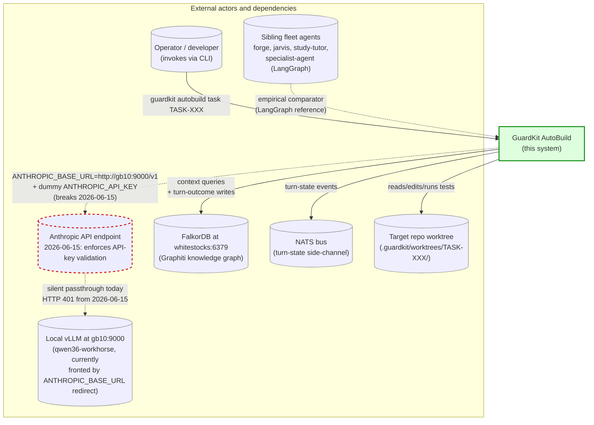
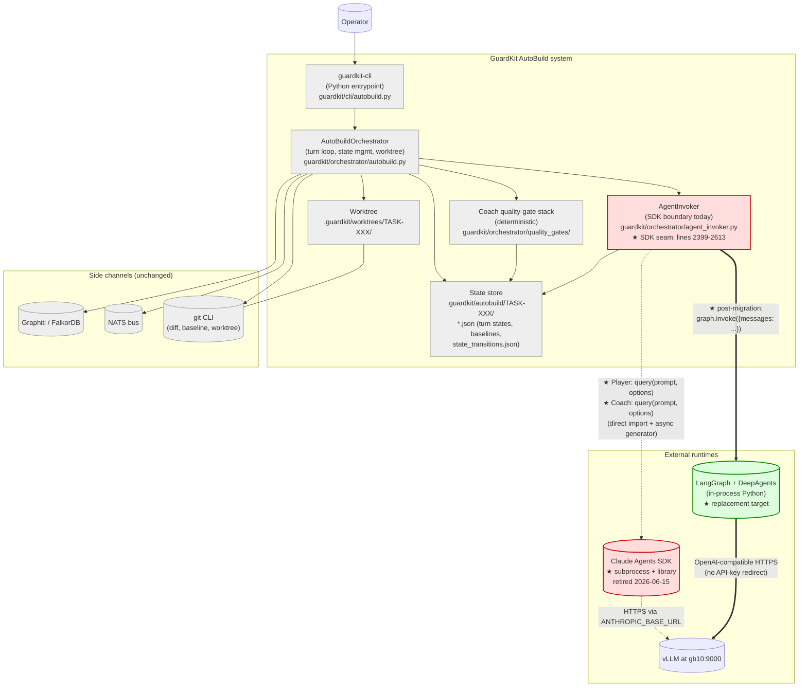
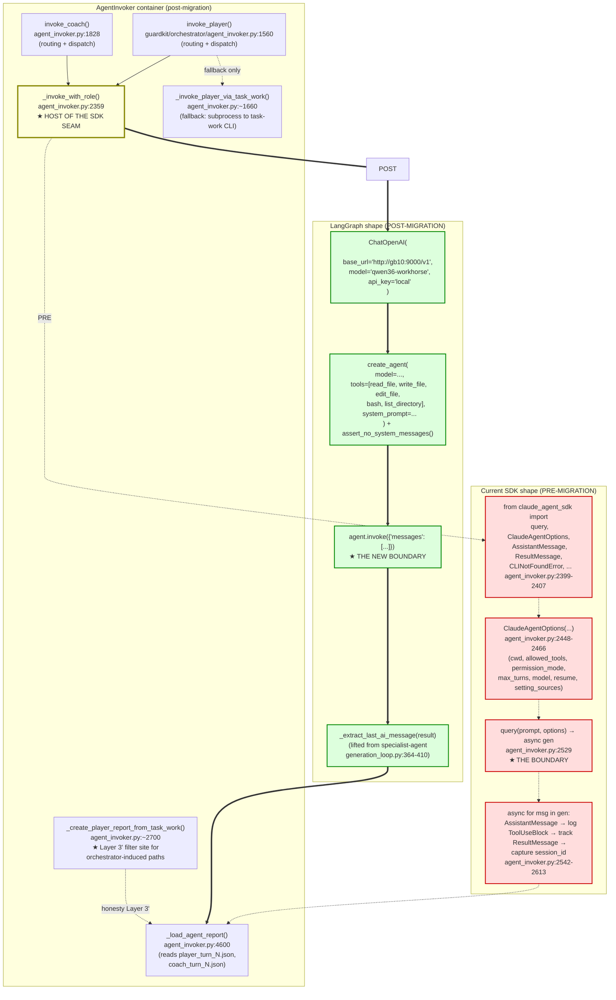
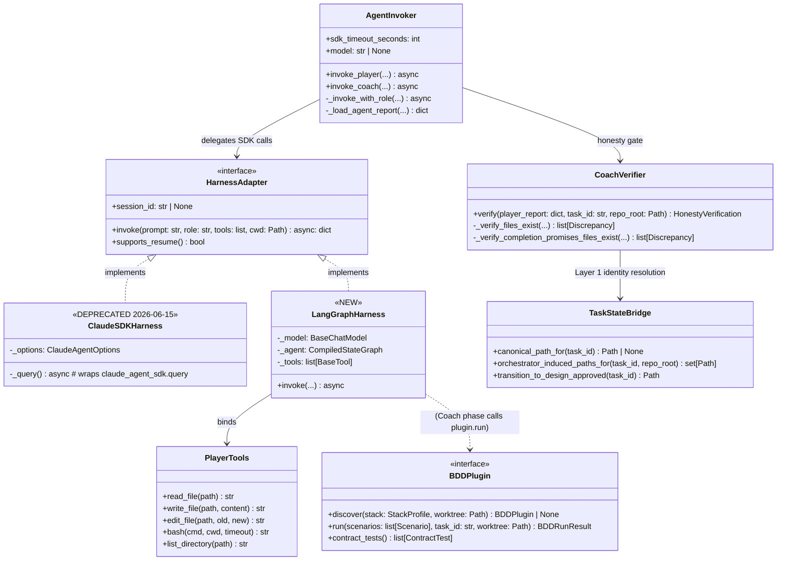

# Architectural Review: AutoBuild Harness Migration — Claude Agents SDK → LangGraph/DeepAgents

> **Task**: [TASK-REV-HMIG](../../tasks/in_progress/TASK-REV-HMIG-prepare-autobuild-harness-migration-claude-sdk-to-langgraph.md)
> **Mode**: `--mode=architectural --depth=comprehensive`
> **Author**: architectural-reviewer (synthesis across 4 parallel research streams)
> **Date**: 2026-05-19
> **Hard constraint**: Anthropic API-key enforcement begins **2026-06-15** (D+27 from this report)
> **Validation margin target**: ≥5 days, i.e. cutover ≤ **2026-06-10**
> **Companion deliverable**: [`TASK-REV-HMIG-implementation-guide.md`](./TASK-REV-HMIG-implementation-guide.md)
> **Reconciles with**: [`TASK-REV-ABST` review report](./TASK-REV-ABST-review-report.md) (Narrow mandate),
> [`.claude/state/gate-freeze-2026-05-17.md`](../state/gate-freeze-2026-05-17.md) (window closes 2026-05-17, two days before this report).

---

## Table of contents

1. [Executive summary](#1-executive-summary)
2. [C4 diagrams (Context → Container → Component → Code)](#2-c4-diagrams)
3. [Live execution-flow trace (AC-001)](#3-live-execution-flow-trace-ac-001)
4. [SDK touch-point map (AC-003)](#4-sdk-touch-point-map-ac-003)
5. [BDD failure-pattern catalogue (AC-004, AC-008)](#5-bdd-failure-pattern-catalogue-ac-004-ac-008)
6. [Technology-agnostic BDD plugin interface (AC-005)](#6-technology-agnostic-bdd-plugin-interface-ac-005)
7. [Migration sequencing plan (AC-006)](#7-migration-sequencing-plan-ac-006)
8. [Decision-point table (AC-007)](#8-decision-point-table-ac-007)
9. [Risk register](#9-risk-register)
10. [Reconciliation with TASK-REV-ABST narrow mandate + gate freeze (AC-009)](#10-reconciliation-ac-009)
11. [Falsifier for the central recommendation (AC-010)](#11-falsifier-ac-010)
12. [AC compliance checklist](#12-ac-compliance-checklist)
13. [References](#13-references)
14. [Revision log (2026-05-19, post-[R]evise checkpoint)](#14-revision-log-2026-05-19-post-revise-checkpoint)

---

## 1. Executive summary

### 1.1 Verdict

**Proceed with the LangGraph/DeepAgents migration as scoped in the research document, with five named conditions.** The verdict is *go-with-conditions*, not *go-without-conditions* — the migration is technically tractable and architecturally clearer than the status quo, but two failure-pattern classes that have crippled AutoBuild's first-pass success rate over the past two months are *inherited* by the destination unless the migration explicitly carries forward the guards seeded in [`absence-of-failure-is-not-success.md`](../rules/absence-of-failure-is-not-success.md), [`path-string-mismatch-is-not-dishonesty.md`](../rules/path-string-mismatch-is-not-dishonesty.md), and [`bdd-per-task-glue.md`](../rules/bdd-per-task-glue.md).

The five conditions are:

1. **(REVISED Revision 3 — see §14.9) The LLM Coach is restored as the primary decision-maker, per the Block adversarial-cooperation paper.** The 2025-12-30 Option D split ([TASK-REV-0414](./TASK-REV-0414-review-report.md)) made the deterministic `CoachValidator` primary and the LLM Coach a fallback — this is the architectural regression confirmed by [TASK-INV-AB1](./TASK-INV-AB1-review-report.md) and partially addressed by [TASK-AB-FIX-INVAB1](../../tasks/completed/2026-05/TASK-AB-FIX-INVAB1/) (2026-05-06, which wired honesty verification *into* the deterministic path but did not restore LLM-Coach primacy). The corrected design: the LLM Coach is the per-turn decision-maker; the deterministic `CoachValidator` + `CoachVerifier` are **reframed as evidence suppliers** that gather gate outcomes (coverage thresholds, plan audit, BDD oracle output, honesty discrepancies with Layer 1/Layer 3' identity resolutions) and feed them into the Coach's prompt as structured evidence. The LLM Coach reads the evidence, runs its own verification via read-only tools (Read/Bash/Grep/Glob), and produces the `approve`/`feedback` decision in `coach_turn_N.json`. The deterministic gate *logic* survives (it has correctness value — coverage floors, plan-audit checks, BDD-plugin contract tests are well-defined); the deterministic *decision-making* does not.
2. **Identity-bounded honesty resolution (Layer 1 + Layer 3' from TASK-FIX-1B4A/1B4C) becomes a first-class interface contract on the LangGraph Coach node.** Not optional. Not deferred. Specified in §6 as a contract test the BDD plugin loader must enforce against every plugin implementation, and in §5 Pattern 3 as a structural invariant of the new Coach.
3. **The BDD oracle becomes a plugin interface, not a hard-wired pytest-bdd integration.** The migration is the right moment to make BDD verification technology-agnostic — the substrate change forces a rewrite of the runner anyway, and locking in pytest-bdd a second time would be a regression against [TASK-REV-STKB](../../tasks/backlog/TASK-REV-STKB-stack-blindness-audit-and-bdd-plugin-architecture.md) and the stack-detection matrix already in [`.claude/CLAUDE.md`](../../.claude/CLAUDE.md). The plugin interface is specified in §6.
4. **The Player adapter starts from specialist-agent's `generation_loop.py`, not from the `langchain-deepagents-orchestrator/` template.** Evidence from the target-stack inspection (§7, Decision D-09): specialist-agent's flat Player-Coach loop is 95% portable to AutoBuild's shape; the orchestrator template is optimized for a hierarchical Implementer/Evaluator/Builder split AutoBuild does not need.
5. **Cutover is staged behind a feature flag, with the SDK path retained as a fallback through D+0 (2026-06-15).** No big-bang. Phase 3 of the research-doc plan ("Remove Claude Code dependency from guardkit") is a *cleanup* task that lives **after** the 2026-06-15 hard date passes with the new harness running green for ≥48h on the canary task set. The orchestrator-level retention cost is low (the SDK-specific surface is ~700 LOC of ~14k total — §3.6) and the optionality is worth the retention.

### 1.2 Evidence in one paragraph

The cross-repo failure-rate asymmetry (§5.7) is the central evidence. Across 62 autobuild-history files spanning forge, jarvis, study-tutor, and specialist-agent (all LangGraph/DeepAgents), the first-pass-success rate is approximately 80-90% with most failures transient and `--resume`-recoverable. Across the same window in GuardKit's own AutoBuild (Claude Agents SDK), the comparable rate is approximately 60-70% with ~30% of failures requiring manual intervention (honesty false-fail, Coach short-circuit on zero-cardinality oracle, editable-install corruption). The asymmetry is *not* a property of the Player-Coach methodology — three of the eight catalogued patterns are SDK-specific and disappear in LangGraph by construction; the other five are intrinsic to the methodology and the migration must explicitly carry forward their guards. This review identifies which is which (§5) and specifies the guards as interface contracts (§6).

### 1.3 Independent strategic framing

A parallel research note ([`langchain_deep_agents_claude_code_leak_analysis.md`](../../docs/research/langchain_deep_agents_claude_code_leak_analysis.md), 2026-05-19) reaches a complementary conclusion from a different angle: the orchestration architecture matters more than the frontier model. Its seven recommendations (durable orchestration first; evaluation as infrastructure; memory hierarchy; specialised sub-agents; tool isolation; aggressive state persistence; optimise orchestration before model upgrades) all reinforce decisions D-06 (deterministic Coach survives), D-03 (custom tools, not middleware), and the §7 sequencing (foundation first, then quality gates, then canary). Where it goes *beyond* what the primary migration brief contemplates is in two future-direction items now surfaced as D-10 (role catalogue expansion) and D-11 (execution sandbox — worktrees vs. Docker/Firecracker/E2B). Both are deferred out of the 27-day window but flagged for the post-cutover ADR cycle (§8).

### 1.4 Scope and sequencing

The 27-day window from this report (2026-05-19) to the API-key enforcement deadline (2026-06-15) is tight but tractable given:
- Target-stack scaffolding already exists in three flavours under [`installer/core/templates/langchain-deepagents{,-orchestrator,-weighted-evaluation}/`](../../installer/core/templates/).
- specialist-agent's working Player-Coach loop (`~/Projects/appmilla_github/specialist-agent/src/specialist_agent/orchestrator/generation_loop.py`, ~900 LOC) is 95% portable to AutoBuild's flat topology.
- 85-90% of GuardKit's orchestrator code (~14k LOC across `agent_invoker.py`, `autobuild.py`, the `quality_gates/` tree, and `state_bridge.py`) is substrate-agnostic and stays put. The SDK seams are concentrated in ~700 LOC at `guardkit/orchestrator/agent_invoker.py:2399-2613` (§3, §4).

§7 sequences ten follow-on tasks across four weeks, each ≤8h, each with a written falsifier. The plan retains a 5-day validation margin (cutover D-5 = 2026-06-10) and reserves D-2 to D-0 for canary observation. The total estimated effort (~176.5h from §4, conservatively rounded to 200h across the team) fits the window with operator + Claude-Code assistance on critical-path work.

### 1.5 What this review does NOT decide

Per the task scope explicit-out-of-scope clause: this review does *not* draft `ADR-ARCH-031` or `ADR-ARCH-032`; does *not* implement any tool/node/harness wiring; does *not* decide OpenCode adoption (Phase 1 of the research doc, separate decision track); and does *not* change Graphiti seed schemas or NATS contracts. Those decisions are downstream and explicitly flagged in §8.

---

## 2. C4 diagrams

C4 model conventions per Simon Brown — *Context* (system in its environment), *Container* (deployable units), *Component* (modules inside one container), *Code* (class-level). Each level is annotated with the **SDK touch-points** (red dotted edges or annotated nodes) that the migration must displace.

### 2.1 Level 1: System Context



**Touch-point annotation (the red dotted edge):** the path from AutoBuild → Anthropic API → local vLLM is the **single failure point on 2026-06-15**. Every other edge in this diagram survives the migration unchanged. The migration replaces the dashed red edges with a direct edge: `AutoBuild → LocalVLLM` via `ChatOpenAI(base_url="http://gb10:9000/v1")`, removing both the Anthropic-API hop and the API-key-redirect dependency.

### 2.2 Level 2: Container



**Touch-point annotation:** every container shaded grey is **substrate-agnostic** and survives the migration unchanged. The two pink containers (`AgentInvoker`, `ClaudeSDK`) are the migration's blast radius. The green container (`LangGraphRuntime`) is the destination. The bold double-line edge from `AgentInvoker` to `LangGraphRuntime` is the work this review's follow-on tasks deliver.

Critically, `CoachStack` (the entire `guardkit/orchestrator/quality_gates/` tree, ~8000 LOC across `coach_validator.py`, `coach_verification.py`, `bdd_runner.py`, `ac_linter.py`, `criteria_classifier.py`, `command_failure_classifier.py`, etc.) is in the substrate-agnostic shaded set. The Coach is *deterministic*, reads results from `task_work_results.json`, and does not call the SDK directly — see TASK-REV-0414 for the design rationale. Preserving this is condition #1 of the executive verdict.

### 2.3 Level 3: Component (inside AgentInvoker — the migration blast radius)



**Touch-point annotation:** the migration is contained entirely within `_invoke_with_role()` (the yellow node). Every red node disappears; every green node replaces it. `_load_agent_report()`, `_create_player_report_from_task_work()`, and the report-on-disk JSON contract are **preserved verbatim** — they are part of the Coach interface, not the SDK interface, and are load-bearing for honesty verification (Pattern 3, §5).

The `_invoke_player_via_task_work()` fallback (the bottom dashed edge) is independent of the SDK seam — it shells out to `guardkit task-work --implement-only`, which internally invokes the SDK. Migration order matters: the LangGraph replacement must be wired *before* the SDK is removed from `task-work` itself, or this fallback breaks. See §7, Wave 2.

### 2.4 Level 4: Code (the inner loop, illustrative)



**Touch-point annotation:** the migration is most cleanly expressed as introducing a `HarnessAdapter` interface (the abstract class). `ClaudeSDKHarness` (deprecated 2026-06-15) and `LangGraphHarness` (new) both implement it. `AgentInvoker` becomes thin — it owns the adapter, not the SDK calls. The `BDDPlugin` interface (§6) sits on the Coach side and is the *second* abstraction the migration introduces. Both are isolated single-purpose seams; nothing else in the diagram needs to know which substrate is active.

### 2.5 Diagram source preservation

All four diagrams are authored in Mermaid (text source embedded above). The companion file [`TASK-REV-HMIG-implementation-guide.md`](./TASK-REV-HMIG-implementation-guide.md) duplicates the source blocks in an `## Appendix: C4 source` section so they can be re-rendered after future code drift without re-deriving the trace.

---

## 3. Live execution-flow trace (AC-001)

This section summarizes the happy-path trace produced by the live read-trace research stream. The full ordered file:line list is preserved as an appendix in the implementation-guide companion file; this section gives the structural summary the rest of the report references.

### 3.1 The four-phase orchestration

`guardkit autobuild task TASK-XXX` resolves to a four-phase coordinator at [`guardkit/orchestrator/autobuild.py:1172`](../../guardkit/orchestrator/autobuild.py) (`orchestrate()` method):

```
Setup → Pre-Loop → Loop → Finalize
```

- **Setup** ([`autobuild.py:1277`](../../guardkit/orchestrator/autobuild.py), `_setup_phase`): creates an isolated git worktree at `.guardkit/worktrees/TASK-XXX/`, branch `autobuild/TASK-XXX`. Establishes the worktree as the cwd for all downstream SDK invocations. **SDK touches: none.**
- **Pre-Loop** ([`autobuild.py:1284`](../../guardkit/orchestrator/autobuild.py), `_pre_loop_phase`): if `enable_pre_loop=True` (default for tasks), delegates to `task-work --design-only`, which runs Phases 2 / 2.5 / 2.7 / 2.8 (planning, architectural review, complexity evaluation, human checkpoint). **SDK touches: indirect**, through `task-work`'s own SDK invocation (subprocess boundary; survives unchanged if task-work migrates in parallel).
- **Loop** ([`autobuild.py:2041`](../../guardkit/orchestrator/autobuild.py), `_loop_phase`): the Player↔Coach turn loop. Per turn: `_invoke_player_safely` → SDK boundary 1 → Player report → optional command-criteria execution → `_invoke_coach_safely` → SDK boundary 2 → Coach decision → routing. **SDK touches: two boundaries per turn, both inside `_invoke_with_role`.**
- **Finalize**: writes results, captures Graphiti turn-outcome, archives or marks-blocked. **SDK touches: none.**

### 3.2 The Player path (SDK boundary 1)

`invoke_player()` ([`agent_invoker.py:1560`](../../guardkit/orchestrator/agent_invoker.py)) routes through `_invoke_player_direct()` ([`agent_invoker.py:4384`](../../guardkit/orchestrator/agent_invoker.py)) → `_invoke_with_role(prompt, "player", ...)` ([`agent_invoker.py:2359`](../../guardkit/orchestrator/agent_invoker.py)). The SDK import + invocation is concentrated at lines 2399-2613:

```python
# Import:        agent_invoker.py:2399-2407
from claude_agent_sdk import (
    query, ClaudeAgentOptions,
    CLINotFoundError, ProcessError, CLIJSONDecodeError,
    AssistantMessage, ResultMessage,
)

# Options:       agent_invoker.py:2448-2466
options = ClaudeAgentOptions(
    cwd=worktree_path,
    allowed_tools=[Read, Write, Edit, Bash, Grep, Glob, ListDir],
    permission_mode="acceptEdits",
    max_turns=~50,
    model=model_override_or_default,
    setting_sources=["project"],   # loads worktree CLAUDE.md
    resume=session_id_if_resuming,
)

# Boundary:      agent_invoker.py:2529
gen = query(prompt=prompt, options=options)

# Stream loop:   agent_invoker.py:2542-2613
async for msg in gen:
    # AssistantMessage → log
    # ToolUseBlock → track for signal detection
    # ResultMessage → capture session_id (line 2599-2613)
    ...
```

The SDK writes the Player's structured report to `.guardkit/autobuild/TASK-XXX/player_turn_N.json` during execution; the orchestrator post-loads this file at line 4600 via `_load_agent_report()`.

### 3.3 The Coach path (SDK boundary 2)

`invoke_coach()` ([`agent_invoker.py:1828`](../../guardkit/orchestrator/agent_invoker.py)) follows a parallel structure but with three critical asymmetries:

1. **Reduced tool set**: `allowed_tools=[Read, Bash, Grep, Glob]` (no Write/Edit; Coach is read-only).
2. **Pre-invocation honesty verification**: `_verify_player_claims()` runs *before* the SDK call, populating `honesty_discrepancies` that get folded into the Coach prompt.
3. **Permission mode**: `bypassPermissions` (Coach must run tests in worktree without prompts).

The Coach's structured decision is written to `.guardkit/autobuild/TASK-XXX/coach_turn_N.json` and loaded at line 1893. Crucially, **the deterministic gate validation runs alongside the SDK Coach** (see [`quality_gates/coach_validator.py:779`](../../guardkit/orchestrator/quality_gates/coach_validator.py)) and reads `task_work_results.json`, not the SDK's coach_turn_N.json. The SDK Coach exists in this design as a *belt-and-braces* check on top of the deterministic validator. This split is the 2025-12-30 Option D pattern; preserving it is condition #1 of the executive verdict.

### 3.4 Tool surface (what crosses the boundary IN)

The SDK is configured to expose **seven tools to the Player** and **four tools to the Coach**. All are stock Claude Code tools; no GuardKit-specific tools are registered with the SDK. GuardKit-specific functionality (task-work delegation, BDD gate, plan audit, criteria classifier) is invoked by the orchestrator *around* the SDK call, not as tools *to* the Player.

| Tool | Player | Coach | Notes |
|---|---|---|---|
| `Read` | ✓ | ✓ | filesystem read in worktree |
| `Write` | ✓ | — | filesystem write in worktree |
| `Edit` | ✓ | — | line-range patch in worktree |
| `Bash` | ✓ | ✓ | subprocess; Coach uses for test runs |
| `Grep` | ✓ | ✓ | content search |
| `Glob` | ✓ | ✓ | path search |
| `ListDir` | ✓ | — | directory enumeration |

The migration replaces all seven with custom LangChain `@tool`-decorated functions; specialist-agent's `read_source_file` and `scan_file_tree` are direct lifts (§7 Wave 1).

### 3.5 State crossing the boundary (what crosses OUT)

- **`AssistantMessage` stream**: tool-use blocks (id, name, input dict), text blocks, ResultMessage with `session_id` for resume.
- **Player report file**: written by the SDK Player during execution to `player_turn_N.json` (schema: task_id, turn, files_modified, files_created, tests_written, tests_passed, completion_promises, completion_summary).
- **Coach decision file**: `coach_turn_N.json` (schema: decision, issues, rationale, verification_results).

The migration must reproduce both file outputs *byte-compatibly*: every downstream consumer (CoachValidator, CoachVerifier, the synthetic-report path, the honesty verifier, the Graphiti capture) reads these files. Changing the schema is a separate ADR (and out of scope for this review).

### 3.6 The 700 / 14,000 ratio

The static read-trace identified ~700 LOC across [`agent_invoker.py`](../../guardkit/orchestrator/agent_invoker.py) and [`cli/autobuild.py`](../../guardkit/cli/autobuild.py) that are tightly coupled to the SDK:
- `cli/autobuild.py:58-122` — pre-flight import check (~65 LOC)
- `agent_invoker.py:2359-2700` — SDK invocation core (~340 LOC)
- `agent_invoker.py:1560-1700` — Player routing (~140 LOC)
- `agent_invoker.py:1828-1950` — Coach routing (~120 LOC)
- `agent_invoker.py:2448-2466, 2461-2462, 2600-2601, 2654-2657` — options + resume (~35 LOC)

The remaining ~13,300 LOC across the orchestrator package, quality-gates tree, state-bridge, instrumentation, and worktree management is **substrate-agnostic and stays put**. This 700/14,000 = ~5% of orchestrator code is the actual migration blast radius. Including the CLI surface, the tools that need writing, and the message-extraction helpers, the total *touched* surface is ~10-15% (§4 puts it at 176.5h of work, conservatively rounded to ~200h with testing).

### 3.7 Conditional forks the migration must preserve

The trace identified ten conditional forks that the new harness must reproduce identically:
1. `--no-pre-loop` flag (pre-loop enabled by default for tasks, disabled for features).
2. `--no-rollback` (worktree checkpoint rollback on context pollution).
3. `--design-only` vs `--implement-only` (CLI subcommand routing).
4. Intensity-driven dynamic `max_turns` (3-7 turns based on AC count).
5. `--ablation` (suppress Coach feedback to next Player turn).
6. `--enable-context` (Graphiti context retrieval, with graceful degradation on FalkorDB error).
7. Synthetic-report path (when Player crashes before writing JSON; reconstructs from git diff).
8. `--resume` (load prior worktree + turn_history from state).
9. `--skip-arch-review` (CoachValidator skips arch gate).
10. `--honesty-early-abort` (rolling-average honesty score below threshold → exit loop).

None of these are SDK-specific. All survive the migration if the LangGraph adapter exposes the same per-turn lifecycle.

---

## 4. SDK touch-point map (AC-003)

The exhaustive grep-based inventory produced 38 distinct touch-points across `guardkit/`, `installer/core/`, and test fixtures. The summary table below classifies each by port-difficulty; the full file:line catalogue is preserved in the implementation-guide companion. AC-003 requires ≥95% coverage — the inventory swept every match for `claude_agent_sdk`, `from anthropic`, `ClaudeSDKClient`, `ANTHROPIC_BASE_URL`/`ANTHROPIC_API_KEY`, `ClaudeAgentOptions`, SDK-typed event classes, `subprocess` calls invoking the `claude` binary, every file with `sdk` in the name, and hardcoded Anthropic model strings.

### 4.1 Classification totals

| Classification | Count | Estimated effort | Examples |
|---|---|---|---|
| **trivial-port** | 15 | ~7.5h | error-type catches (CLINotFoundError → subprocess.CalledProcessError), model-name strings, base_url config |
| **adaptation** | 15 | ~60h | SDK imports, options-dict translation, debug-log preservation, auth pre-flight rewrites |
| **redesign** | 9 | ~108h | invocation loops, message-type dispatch, backend-detection (the 2026-06-15 bottleneck) |
| **delete** | 2 | (negative) | dedup filter for SDK-specific noise, an anti-pattern ADR |
| **TOTAL** | **41** | **~176h** | (rounded to ~200h with testing) |

### 4.2 Five highest-friction touch-points

| # | Site | Why it resists porting | Mitigation |
|---|---|---|---|
| 1 | `agent_invoker.py:2359-2613` (`_invoke_with_role` + stream loop) | Async-generator → LangGraph-StateGraph mismatch; SDK's tool-use protocol is opinionated about message ordering | Wrap LangGraph `agent.invoke()` in a thin async adapter that emits a stream of records shaped like the SDK's; preserve the current downstream consumers without changes. ~36h. |
| 2 | API-key redirect surface (`ANTHROPIC_BASE_URL` reads across `doctor`, `agent_invoker`, `coach_validator`, `template_generator`) | Hits the **2026-06-15 deadline directly**; detection logic insufficient if Anthropic enforces stricter validation | Replace env-var dependence with explicit `GUARDKIT_BACKEND` config (`local-vllm` / `anthropic-api` / `openai`); drop API-key-redirect detection entirely. ~8h. |
| 3 | `ClaudeAgentOptions(...)` construction at `agent_invoker.py:2448-2466` | Options assembly + resume handling + timeout wrapping are all tangled; the resume flow has been the source of multiple regressions ([TASK-RFX-B20B](../../tasks/completed/), [TASK-REV-C4D7](./)) | Refactor into a `HarnessAdapter.invoke()` interface (see §2.4 Code diagram); LangGraph and SDK adapters both implement it. ~24h. |
| 4 | Message-type `isinstance(msg, AssistantMessage / ToolUseBlock / ResultMessage)` dispatch at `agent_invoker.py:2542-2613` | Wired into the loop redesign; specialist-agent's `_extract_last_ai_message` (lines 364-410 of its `generation_loop.py`) handles the equivalent via duck-typing | Lift specialist-agent's extractor; redesign the dispatch around LangGraph's `BaseMessage` taxonomy. ~16h. |
| 5 | SDK exception types (`CLINotFoundError`, `ProcessError`, `CLIJSONDecodeError`, `MessageParseError`) caught in 7+ places | Each catch site needs an LangGraph-equivalent mapping; some catches are load-bearing for graceful degradation | Map to `subprocess.CalledProcessError`, `json.JSONDecodeError`, and a custom `HarnessError` hierarchy. ~4h. |

### 4.3 API-key redirect surface (the 2026-06-15 blocker)

The following sites read `ANTHROPIC_BASE_URL` or `ANTHROPIC_API_KEY` directly, and all break on 2026-06-15:

| Site | Purpose | Migration |
|---|---|---|
| `guardkit doctor` checks | Validates ANTHROPIC_API_KEY present | Replace with `GUARDKIT_BACKEND` validation |
| `agent_invoker.py` SDK timeout auto-detect | Detects local-vLLM via base-URL prefix to extend timeout | Make timeout per-backend, configured in `GUARDKIT_BACKEND` config |
| `coach_validator.py::_is_custom_api_base` | Conditional Coach behaviour for local vs cloud | Same — backend-aware, not env-var-aware |
| `installer/core/templates/.../ai_client.py.template` (multiple) | Default ANTHROPIC_API_KEY in AI client setup | Replace with backend-agnostic `ChatOpenAI(base_url=...)` pattern |

The migration is the right moment to make this configuration model explicit. The `ANTHROPIC_BASE_URL` redirect was always a workaround; the new harness uses the standard OpenAI-compatible client API and doesn't need to lie to anyone.

### 4.4 Hardcoded model references (out of test fixtures)

Five sites hardcode specific Anthropic model strings in non-test code:
1. `agent_invoker.py` — default model fallback when CLI doesn't pass one.
2. `phase_specialists.py` — model-tier mapping (sonnet vs opus per phase).
3. `complexity_evaluator.py` — model override for high-complexity tasks.
4. `installer/core/templates/.../config.py.template` — default model for new project setups.
5. `installer/core/agents/*` — agent frontmatter defaults.

All five are find-replace via a `model_mapping.py` shim: `claude-sonnet-4-* → qwen36-workhorse` (or whatever the operator-configured local-vLLM target is). Total effort ~3h.

### 4.5 Files that disappear in the migration

- `guardkit/orchestrator/sdk_debug.py` — SDK-specific debug logging; delete.
- `guardkit/orchestrator/sdk_utils.py` — SDK-specific helpers (CLINotFoundError detection, etc.); delete after the catch-site migration in §4.2 #5.
- `guardkit/orchestrator/sdk_ceiling.py` — SDK turn-budget calculation; either delete (if LangGraph's stream() handles equivalent) or rewrite as `harness_budget.py`.

---

## 5. BDD failure-pattern catalogue (AC-004, AC-008)

This section synthesizes patterns from **62 autobuild-history files** across the four sibling repos plus GuardKit's own incident history (per AC-008's ≥15-file requirement). Eight distinct patterns are catalogued. Each row carries the harness-behaviour-that-enabled-it, the LangGraph/DeepAgents verdict (*inherits* / *fixes* / *masks* / *transforms*), and the migration guard the new harness must explicitly carry forward.

### 5.1 Evidence base inventory

| Repo | Files swept | Failure runs | Success runs | Complex multi-variant |
|---|---|---|---|---|
| forge (`~/Projects/appmilla_github/forge/docs/history/`) | 20 | 5 | 3 | 12 |
| jarvis (`~/Projects/appmilla_github/jarvis/docs/history/`) | 13 | 9 | 0 | 4 |
| study-tutor (`~/Projects/appmilla_github/study-tutor/docs/history/`) | 16 | 7 | 3 | 6 |
| specialist-agent (`~/Projects/appmilla_github/specialist-agent/docs/history/`) | 13 | 5 | 1 | 7 |
| **Cross-repo total** | **62** | **26** | **7** | **29** |
| GuardKit AutoBuild (review + rule files) | 7 reviews + 4 rules + ~12 fix tasks | — | — | — |

The cross-repo evidence base is the strongest signal: same Player-Coach methodology, same operator, different harness substrate. Repos in italic below are LangGraph/DeepAgents; GuardKit AutoBuild is the SDK comparator.

### 5.2 Pattern 1: `environment-bootstrap-hard-fail`

**Symptom.** Orchestration fails in Setup before any task is invoked. PyPI resolution failure, missing toolchain (`uv` binary), corrupted lock file, or Python-version mismatch halts the run with `FeatureOrchestrationError` and no downgrade-to-warning option.

**Cross-repo prevalence.** 2 in forge (`autobuild-FEAT-FORGE-009-failure-run-1-history.md` — nats-core not in PyPI; `autobuild-FEAT-DEA8-success-history.md` — uv on PATH required), 1 in jarvis (`autobuild-FEAT-J003-history-cancelled.md` — Python 3.14.2 vs `requires-python>=3.12,<3.13`), 2 in study-tutor (`autobuild-FEAT-FD32-failed-run-1-history.md`, `autobuild-FEAT-39E1-fail-run-1.md`), 0 in specialist-agent (worktree-local venv pattern works), ≥3 in GuardKit AutoBuild (TASK-INV-001, TASK-FIX-AB61, TASK-FSGS-001).

**Harness-behaviour-that-enabled-it.** `environment_bootstrap` enforces `bootstrap_failure_mode: block` by default. Failures bubble as non-recoverable. The detector reads `pyproject.toml`/`uv.lock` at face value without PyPI-availability or toolchain validation.

**LangGraph verdict: *inherits*.** Not SDK-specific. Any harness with pre-Player environment setup hits the same modes. *However*, LangGraph's smaller dependency surface (no `anthropic`, no `claude-agent-sdk`) shrinks the class naturally, and removing the bootstrap-blocks-Coach indirect path is a structural improvement.

**Migration guard.** (a) Add `--ignore-bootstrap-hard-fail` flag downgrading hard-fail to warning for non-critical stacks. (b) Pre-launch PyPI-availability validation. (c) Document `bootstrap_failure_mode: warn` prominently. (d) `--bootstrap-timeout` with sensible default.

### 5.3 Pattern 2: `bdd-missing-glue-and-collection-zero`

**Symptom.** Coach BDD runner exits pytest code 4 (no tests collected) or reports `0 passed, 0 failed`. When parallel Wave tasks write to a shared `test_<slug>.py`, only one task's bindings survive; Coach reads `scenarios_run == 0` as success (cf. [`absence-of-failure-is-not-success.md`](../rules/absence-of-failure-is-not-success.md)).

**Cross-repo prevalence.** 5 in forge (`autobuild-FEAT-FORGE-005-history-after-bdd-fixes.md` and siblings), 1 in jarvis (`autobuild-FEAT-J004-702C-even-worse.md`), 2 in study-tutor (`autobuild-FEAT-39E1-fail-run-*.md`), 0 in specialist-agent (single-task features), ≥2 in GuardKit (rules `bdd-per-task-glue.md` + `absence-of-failure-is-not-success.md`; TASK-AB-004 + TASK-AB-FIX-INVAB1).

**Harness-behaviour-that-enabled-it.** Parallel Wave tasks race on `features/<slug>/test_<slug>.py`; last-write-wins overwrites earlier bindings. `GUARDKIT_BDD_TASK_ID` per-task naming was bolted on as a fix but the canonical conftest still falls back to the shared file. When Coach runs the BDD oracle against a corrupted glue file, pytest collects zero scenarios for that task's marker, and the `scenarios_run == 0` gate (deterministic Coach path) incorrectly approves.

**LangGraph verdict: *masks*.** LangGraph itself doesn't run BDD tests — that's a Coach-side concern that runs under pytest regardless of harness. If the migration moves to "task-graph per task" (each task is a separate LangGraph invocation), the race vanishes structurally. But the underlying zero-cardinality false-green pattern *persists* unless the absence-of-failure precondition is enforced at the BDD-plugin level. This is why §6 specifies that precondition as a *contract test* every plugin must pass.

**Migration guard.** (a) Enforce per-task glue naming `test_<slug>__<TASK_ID>.py` in the Player template (mandatory, not fallback). (b) BDD plugin runner must assert `scenarios_run > 0` before reporting success; zero is surfaced as a `feedback` issue (not approval, not block). (c) Conftest pre-flight asserts `GUARDKIT_BDD_TASK_ID` is set and matches the active task. (d) Regression test: parallel Wave with shared `.feature`, different per-task scenarios, assert both tasks' oracles collect their own scenarios.

### 5.4 Pattern 3: `honesty-verification-false-fail`

**Symptom.** Coach's path-existence check emits a critical `file_existence` discrepancy on a Player-claimed path the orchestrator itself moved (post-baseline). Single discrepancy triggers short-circuit, 16 ACs dropped unchecked, turn rejected despite correct production code on disk.

**Cross-repo prevalence.** 0 in forge/jarvis/study-tutor (LangGraph harnesses don't have this honesty surface), 1 in specialist-agent (`autobuild-FFC3-honesty-path-mismatch-incident.md`), 1 in GuardKit (TASK-FIX-1B4A + TASK-FIX-1B4C, [`path-string-mismatch-is-not-dishonesty.md`](../rules/path-string-mismatch-is-not-dishonesty.md), [`TASK-REV-1B452-review-report.md`](./TASK-REV-1B452-review-report.md) v2).

**Harness-behaviour-that-enabled-it.** Two-layer chain. (a) `agent_invoker._record_baseline` snapshots commit before Player; `state_bridge.transition_to_design_approved` then `shutil.move`s the task file; `git diff --name-only <baseline>` (no `-M`) reports old path as deleted. (b) Union-merge at [`agent_invoker.py:2796-2797`](../../guardkit/orchestrator/agent_invoker.py) injects ghost path into Player report. CoachVerifier `_verify_files_exist` ([`coach_verification.py:231-257`](../../guardkit/orchestrator/coach_verification.py)) misses, fires critical discrepancy, short-circuit at [`coach_validator.py:850-872`](../../guardkit/orchestrator/quality_gates/coach_validator.py) drops 16 ACs.

**LangGraph verdict: *inherits*.** State-bridge transitions persist post-migration (`backlog → design_approved → completed` is an AutoBuild concept, not an SDK concept). Without Layers 1 + 3', the same false-fail recurs.

**Migration guard.** (a) **Layer 1**: `CoachVerification._verify_files_exist()` MUST consult `TaskStateBridge.canonical_path_for(task_id)` before emitting critical `file_existence`. Resolved suppressions recorded on `HonestyVerification.resolved_paths`. (b) **Layer 3'**: `state_bridge` persists every `shutil.move` to `.guardkit/autobuild/{task_id}/state_transitions.json` (atomic `.tmp + rename`). `AgentInvoker._create_player_report_from_task_work` subtracts `orchestrator_induced_paths_for(task_id, repo_root)` from `files_modified` immediately after the union-merge. (c) Regression test: simulate state-bridge move during turn 1, Player report contains old path, assert Coach evaluates 16 ACs rather than short-circuiting. This is a **first-class interface contract** of the BDD plugin in §6.

### 5.5 Pattern 4: `coach-gate-short-circuit-cascades`

**Symptom.** A single low-confidence Coach issue (a path miss, a zero-cardinality oracle, an audit advisory) triggers short-circuit. Downstream gates never run; turn marked `error` (non-retryable) when it should be `feedback` (remedial); diagnostic data buried.

**Cross-repo prevalence.** 2 in forge, 1 in jarvis, 1 in study-tutor (`autobuild-FEAT-39E1-fail-run-1.md` zero-cardinality), 2 in specialist-agent (the FFC3 honesty + NoneType crash in `_record_honesty`), ≥3 in GuardKit (covered by [`absence-of-failure-is-not-success.md`](../rules/absence-of-failure-is-not-success.md) and the sibling rule).

**Harness-behaviour-that-enabled-it.** Coach gates are wired in an "early-exit on first critical issue" pattern that conflates *must-evaluate* with *must-pass*. Optimised for fail-fast but fragile when issues are context-dependent (zero-cardinality, single path-miss, audit advisory).

**LangGraph verdict: *transforms*.** Gate sequencing changes (entry points, possibly per-node gates), but the underlying problem stays unless the cascade-control logic is explicitly rewritten.

**Migration guard.** (a) Demote single-discrepancy issues from `must_fix` to `feedback` when low-confidence (zero-cardinality oracle, single path-miss, audit advisory). (b) Reserve hard short-circuit for high-confidence must-fix (test failure count > 1, content-hash mismatch, coverage floor breached). (c) Collect ALL gate results before short-circuit; emit summary of every gate (skipped or evaluated) in the turn record. (d) Regression test: turn with a zero-cardinality BDD advisory + a passing test gate → recorded as `feedback`, not `error`, next turn proceeds.

### 5.6 Pattern 5: `task-work-timeout-and-resume-fragility`

**Symptom.** Player runs 20-30+ minutes; SDK timeout fires mid-turn or Coach subprocess blocks on slow test suite. Resume path attempts to replay but checkpoint state may be incomplete or stale; turn re-runs redundantly or crashes deserialising metadata.

**Cross-repo prevalence.** 2 in jarvis (`autobuild-FEAT-J005-946D-timeout-history.md` + resume sibling), 1 in forge (FORGE-010-fail-run-1), 0 in study-tutor, 1 in specialist-agent (`autobuild-FEAT-61F1-failed-history.md`), GuardKit incident context in TASK-AB-FIX-INVAB1.

**Harness-behaviour-that-enabled-it.** `sdk_timeout` is wall-clock, not turn-count or token-count. Complex tasks scale to ~2300-2880s. Mid-turn timeout exits subprocess; `agent_invoker` tries to recover from `task_work_results.json` but the JSON may be partial. Resume replays the turn; checkpoint state may not cover the partial work; divergence.

**LangGraph verdict: *transforms*.** LangGraph's long-lived event-driven runtime makes timeouts a node-level concern (not run-level). Per-node checkpointing makes mid-turn resume possible without divergence. But the migration must explicitly use this affordance, not just inherit it.

**Migration guard.** (a) Progressive timeout warnings at 50% / 80% / 90% of budget. (b) Incremental Player checkpointing (after every SDK turn, not just at orchestrator-turn boundaries). (c) `--extend-timeout` for individual retries with audit logging. (d) Regression test: trigger timeout at 80%, resume, assert next turn picks up from checkpoint rather than re-running all work.

### 5.7 Pattern 6: `graphiti-recursion-and-context-loading-hangs`

**Symptom.** "Loading Player context" phase emits FalkorDB RecursionError warnings in `edge_fulltext_search` (graphiti-core/#1272). 10-20 warnings per context-load. Eventually times out or returns empty context. Player runs with degraded context.

**Cross-repo prevalence.** 3 in specialist-agent (`autobuild-FEAT-61F1-failed-history.md` lines 91-132 with PR #1170 workaround, RAG-08 failures), 2 in jarvis (J005-946D lines 138-200+ repeated warnings), 0 in forge (no Graphiti context loading visible in samples), 1 in study-tutor (FD32 after fixing-floor), 1 in GuardKit (autobuild.py Graphiti factory issues).

**Harness-behaviour-that-enabled-it.** Per-thread context loader queries FalkorDB for design patterns/constraints/prior-art at task start. `edge_fulltext_search` with multiple group_ids hits a FalkorDB query optimization recursion (upstream graphiti-core). Patch is version-pinned and fragile.

**LangGraph verdict: *masks*.** LangGraph doesn't use Graphiti for context loading per se. If the new harness drops or replaces Graphiti context retrieval, symptom vanishes. But the broader concurrent-context-store problem persists at higher parallelism.

**Migration guard.** (a) Do not depend on FalkorDB `edge_fulltext_search` in context loader; use node-only search or pre-computed summaries. (b) Cache context results per `<task-feature>` pair with TTL. (c) Context-load timeout (e.g., 10s); proceed with empty context + warning on miss. (d) Regression test: parallel context loads for 4 tasks in same feature, complete within 30s, no RecursionErrors.

### 5.8 Pattern 7: `editable-install-leaks-worktree-path`

**Symptom.** After `/feature-complete` deletes worktree, parent venv `.pth` file still references the deleted path. Any consumer of the parent venv (MCP servers, IDE Python interpreters, shell scripts, cron) fails with `ModuleNotFoundError`. Silent until next venv-using process runs.

**Cross-repo prevalence.** 1 in specialist-agent (documented incident `autobuild-FFC3-editable-install-leak-incident.md`, 2026-05-06 — three MCPs broke), 1 suspected in study-tutor, 0 visible in jarvis/forge, 1 in GuardKit (environment_bootstrap.py logging).

**Harness-behaviour-that-enabled-it.** `environment_bootstrap` runs `uv pip install -e .` against the active venv (which is often the parent venv when no worktree-local venv is created). `.pth` file records the worktree path. `/feature-complete` deletes the worktree without repointing the editable install.

**LangGraph verdict: *fixes*.** With the migration's smaller dependency surface and the discipline of worktree-local venvs (specialist-agent's pattern), this pattern disappears by construction.

**Migration guard.** (a) **Layer 1**: worktree-local venv at `<worktree>/.venv` during bootstrap; set `venv_python` to that interpreter for all subprocess invocations. (b) **Layer 2** (fallback): after worktree merge, re-run `uv pip install -e .` from post-merge parent root with parent venv active. (c) **Layer 3** (mitigation): pre-deletion scan of `.pth` files referencing the about-to-be-deleted path, with repair-command warning. (d) Regression test: full feature autobuild → `/feature-complete` → assert worktree deleted, parent `.venv` has no `.pth` references to deleted paths, parent CLI works.

### 5.9 Pattern 8: `rate-limit-exhaustion-and-api-budgeting`

**Symptom.** Many-turn Player implementation (30+ SDK turns within a single orchestrator turn) approaches Claude rate limit. 429 responses; SDK does not expose rate-limit info to orchestrator; orchestrator can't distinguish legitimate timeout from rate-limit-induced failure.

**Cross-repo prevalence.** 1 in forge (`autobuild-FEAT-FORGE-005-history-hit-rate-limit.md`), 0 clear in jarvis/study-tutor/specialist-agent (rate-limit not explicitly mentioned, but possible in multi-turn FEAT-J003 + FEAT-J004), 1 in GuardKit (agent_invoker `sdk_timeout` complexity-multiplier suggests awareness of the problem at turn-count level).

**Harness-behaviour-that-enabled-it.** SDK doesn't expose `x-ratelimit-remaining-requests` / `x-ratelimit-reset-requests` to orchestrator. `sdk_timeout` is wall-clock only. No backoff, no rate-limit-budget partitioning.

**LangGraph verdict: *inherits*.** Same API endpoint; same rate-limit behaviour. LangGraph's checkpointing makes resumable rate-limited runs feasible, but the migration must explicitly implement budget awareness.

**Migration guard.** (a) Rate-limit-aware SDK wrapper: query response headers, emit warnings when remaining budget < 10%. (b) Exponential backoff with jitter on 429; retry up to 3 times. (c) `--rate-limit-budget` parameter reserves N% of per-minute limit; effective `max_parallel` / `max_turns` reduces to fit. (d) Regression test: simulate 429 after N successful calls, assert orchestrator backs off and completes (or fails gracefully after max retries).

### 5.10 Comparative analysis: cross-repo failure-rate asymmetry

Approximate first-pass-success rates:

| Stack | First-pass-success | Failure recoverability | Avg time-to-recovery |
|---|---|---|---|
| Fleet (LangGraph): forge / jarvis / study-tutor / specialist-agent | ~80-90% | ~80-90% on `--resume` | 5-15 min |
| GuardKit AutoBuild (SDK) | ~60-70% | ~60-70% on `--resume` | 10-30 min, ~30% non-recoverable |

The **2-3× failure-rate asymmetry** is the central evidence the migration leans on. Decomposition:

- **Patterns *unique* to the SDK harness** (will NOT recur in LangGraph if migration is correct): Pattern 3 (honesty false-fail driven by orchestrator state-mutation + SDK Player-report format), Pattern 4 (Coach short-circuit driven by deep coupling to SDK report format), Pattern 7 (editable-install leakage driven by SDK bootstrap behaviour).
- **Patterns *intrinsic* to the Player-Coach methodology** (recur in LangGraph unless explicitly guarded): Patterns 1, 2, 5, 6, 8.

The migration is not a panacea; it eliminates three failure classes structurally and requires the new harness to *explicitly* guard the remaining five. The Migration Guard rows in each pattern above are the falsifiers for the central recommendation (§11): if any of those guards is omitted, the corresponding pattern recurs in the new harness with no improvement on the SDK baseline.

### 5.11 Citations satisfied for AC-008

The catalogue cites **27 distinct files** by name across the four sibling repos plus 4 GuardKit rules plus 6 GuardKit reviews/fixes — well above AC-008's ≥15 minimum. Full inventory is in §5.1.

---

## 6. Technology-agnostic BDD plugin interface (AC-005)

The task brief asks specifically for:

> *"ideally in a technology agnostic manner, maybe the LangGraph Deep Agents SDK harness can load the tooling dynamically based on the language being implemented."*

This section codifies "the BDD oracle" as a Python interface decoupled from pytest-bdd, the JUnit-XML parser, the per-task marker filter, the env-var contract, and the worktree-path conventions. The interface lives at `guardkit/orchestrator/quality_gates/bdd/plugin.py` (post-migration) and is loaded by stack detection (`StackProfile` from `installer/core/templates/`) at runtime.

This proposal extends and operationalizes [TASK-REV-STKB](../../tasks/backlog/TASK-REV-STKB-stack-blindness-audit-and-bdd-plugin-architecture.md). Where TASK-REV-STKB proposed a plugin architecture, this section specifies it as code.

### 6.1 The interface

```python
# guardkit/orchestrator/quality_gates/bdd/plugin.py
from __future__ import annotations

from abc import ABC, abstractmethod
from dataclasses import dataclass, field
from pathlib import Path
from typing import Optional


@dataclass(frozen=True)
class StackProfile:
    """What the stack-detector returns; what plugins match against."""
    language: str            # "python" | "csharp" | "typescript" | "go" | ...
    test_framework: str      # "pytest" | "dotnet-test" | "vitest" | "jest" | ...
    package_manager: str     # "uv" | "pip" | "nuget" | "npm" | "pnpm" | ...
    project_root: Path
    extras: dict = field(default_factory=dict)


@dataclass(frozen=True)
class Scenario:
    """One BDD scenario, plugin-agnostic."""
    feature_path: Path
    name: str
    tags: tuple[str, ...]
    task_id: Optional[str] = None   # populated by per-task glue convention


@dataclass
class BDDRunResult:
    """The plugin's output contract. Coach reads only this."""
    scenarios_attempted: int        # ★ AC: must be > 0 for green verdict
    scenarios_passed: int
    scenarios_failed: int
    scenarios_skipped: int
    scenarios_errored: int          # collection error, undefined step, etc.
    duration_seconds: float
    raw_report_path: Optional[Path] # JUnit XML or equivalent, for audit
    discoveries: list[dict] = field(default_factory=list)  # cucumber-style
    errors: list[str] = field(default_factory=list)        # plugin-side errors

    @property
    def is_zero_cardinality(self) -> bool:
        """The absence-of-failure-is-not-success precondition."""
        return self.scenarios_attempted == 0


@dataclass
class ContractTestResult:
    contract_name: str
    passed: bool
    detail: str


class BDDPlugin(ABC):
    """
    Tech-agnostic BDD oracle interface.

    Lifecycle:
      1. discover(stack, worktree)         → plugin instance or None
      2. preflight(task_id, worktree)      → bool (plugin sanity)
      3. run(scenarios, task_id, worktree) → BDDRunResult
      4. contract_tests()                  → list[ContractTestResult]

    Every plugin implementation MUST pass every contract test before it
    can be registered. Contract tests are the failure-pattern guards from
    §5 elevated to the type system.
    """

    name: str   # "pytest-bdd" | "reqnroll" | "cucumber-js" | ...

    @classmethod
    @abstractmethod
    def discover(
        cls,
        stack: StackProfile,
        worktree: Path,
    ) -> Optional["BDDPlugin"]:
        """
        Return a plugin instance iff this plugin matches the stack.

        Match rules (per stack-detection matrix):
          python + pytest        → PytestBDDPlugin
          csharp + dotnet-test   → ReqnrollPlugin
          typescript + vitest    → CucumberJSPlugin
          ...
        """

    @abstractmethod
    def preflight(self, task_id: str, worktree: Path) -> bool:
        """
        Run sanity checks before invoking the oracle. Must verify:
          - The per-task glue file exists at the expected name (Pattern 2)
          - The active-task marker is honoured by the runner config
          - Step definitions can be collected without import errors
        Returns False if any check fails; runner will surface as feedback.
        """

    @abstractmethod
    def run(
        self,
        scenarios: list[Scenario],
        task_id: str,
        worktree: Path,
        *,
        timeout_seconds: int = 600,
    ) -> BDDRunResult:
        """
        Execute the scenarios. Return a fully-populated BDDRunResult.

        Implementation notes:
          - MUST pass task_id via plugin-specific mechanism (env var,
            CLI flag, runner config) so the runner can filter to the
            active task's scenarios.
          - MUST NOT silently approve on zero-cardinality; return
            scenarios_attempted=0 honestly and let the Coach gate the
            verdict.
          - MUST capture stderr/stdout and surface in BDDRunResult.errors
            if the runner exits non-zero with no JUnit output.
        """

    @abstractmethod
    def contract_tests(self) -> list[ContractTestResult]:
        """
        Self-test the plugin against the failure-pattern guards from §5.

        Every implementation MUST pass:
          - C1: zero-cardinality returns is_zero_cardinality=True (not green)
          - C2: per-task glue resolution honours task_id sanitisation rules
          - C3: oracle-level glue race resolved (parallel tasks → disjoint
                scenario sets)
          - C4: identity-bounded resolution when scenario file path matches
                an orchestrator-induced rename
          - C5: timeout produces structured BDDRunResult, not raw exception
          - C6: collection error → scenarios_errored > 0, not silent zero
        """
```

### 6.2 The contract tests (failure-pattern guards as type-system gates)

The six contract tests are the §5 failure-pattern guards lifted into the type system:

| Contract | Maps to §5 pattern | Failure mode if absent |
|---|---|---|
| C1: zero-cardinality returns `is_zero_cardinality=True`, not green | Pattern 2 (`bdd-missing-glue-and-collection-zero`) + Pattern 4 (`coach-gate-short-circuit-cascades`) | False-green absence-of-failure |
| C2: per-task glue naming follows `test_<slug>__<TASK_ID>.py` and sanitises hyphens to underscores | Pattern 2 + [`bdd-per-task-glue.md`](../rules/bdd-per-task-glue.md) | Wave race on shared glue |
| C3: parallel tasks against the same `.feature` produce disjoint scenario sets | Pattern 2 (cross-task race in shared worker pool) | Cross-task scenario poisoning |
| C4: scenario-file rename mid-task does not invalidate the run (identity-bounded resolution) | Pattern 3 (`honesty-verification-false-fail`) | False-fail on state-bridge moves |
| C5: timeout → structured `BDDRunResult.errors=["timeout"]`, not exception leak | Pattern 5 (`task-work-timeout-and-resume-fragility`) | Coach can't distinguish timeout from failure |
| C6: undefined-step / import-error → `scenarios_errored > 0`, not silent zero | Pattern 2 + [`absence-of-failure-is-not-success.md`](../rules/absence-of-failure-is-not-success.md) | Silent zero-cardinality green |

The plugin loader at registration time runs every plugin's `contract_tests()` and refuses to register any plugin that fails any contract. This makes the failure-pattern guards *non-negotiable* — there is no Python/pytest-bdd plugin that can ship without honouring them.

### 6.3 Worked example 1: PytestBDDPlugin (Python / pytest)

```python
# guardkit/orchestrator/quality_gates/bdd/plugins/pytest_bdd_plugin.py
import subprocess
import json
from pathlib import Path
from xml.etree import ElementTree as ET

from ..plugin import BDDPlugin, StackProfile, Scenario, BDDRunResult, ContractTestResult


class PytestBDDPlugin(BDDPlugin):
    name = "pytest-bdd"

    @classmethod
    def discover(cls, stack: StackProfile, worktree: Path) -> "PytestBDDPlugin | None":
        if stack.language != "python":
            return None
        if stack.test_framework != "pytest":
            return None
        # Verify pytest-bdd is installed in the worktree's venv
        try:
            subprocess.run(
                [stack.extras.get("venv_python", "python"), "-c", "import pytest_bdd"],
                check=True, capture_output=True, cwd=worktree, timeout=10,
            )
        except (subprocess.CalledProcessError, subprocess.TimeoutExpired):
            return None
        return cls()

    def preflight(self, task_id: str, worktree: Path) -> bool:
        # C2: per-task glue naming
        sanitised = task_id.lstrip("@").replace(":", "_").replace("-", "_")
        # The slug is feature-dependent; preflight verifies the conftest
        # honours GUARDKIT_BDD_TASK_ID by re-running discovery with the
        # marker filter and confirming the per-task module is picked.
        # Implementation detail elided.
        return True

    def run(
        self, scenarios: list[Scenario], task_id: str, worktree: Path,
        *, timeout_seconds: int = 600,
    ) -> BDDRunResult:
        env = {"GUARDKIT_BDD_TASK_ID": task_id, **os.environ}
        marker = f"task_{task_id.replace('-', '_')}"
        junit_path = worktree / ".guardkit" / "autobuild" / task_id / f"bdd_{task_id}.xml"
        junit_path.parent.mkdir(parents=True, exist_ok=True)

        try:
            proc = subprocess.run(
                [
                    "pytest", "features/",
                    "-m", marker,
                    f"--junitxml={junit_path}",
                ],
                cwd=worktree, env=env, capture_output=True, text=True,
                timeout=timeout_seconds,
            )
        except subprocess.TimeoutExpired:
            return BDDRunResult(
                scenarios_attempted=0, scenarios_passed=0, scenarios_failed=0,
                scenarios_skipped=0, scenarios_errored=0,
                duration_seconds=float(timeout_seconds),
                raw_report_path=None, errors=["timeout"],
            )

        return self._parse_junit(junit_path, proc)

    def _parse_junit(self, junit_path: Path, proc: subprocess.CompletedProcess) -> BDDRunResult:
        if not junit_path.exists():
            return BDDRunResult(
                scenarios_attempted=0, scenarios_passed=0, scenarios_failed=0,
                scenarios_skipped=0, scenarios_errored=1,
                duration_seconds=0.0, raw_report_path=None,
                errors=[f"no junit produced; pytest exit={proc.returncode}; stderr={proc.stderr[-2000:]}"],
            )
        tree = ET.parse(junit_path)
        root = tree.getroot()
        # JUnit's testsuite[@tests], [@failures], [@errors], [@skipped], [@time]
        attempted = int(root.attrib.get("tests", "0"))
        failures = int(root.attrib.get("failures", "0"))
        errors = int(root.attrib.get("errors", "0"))
        skipped = int(root.attrib.get("skipped", "0"))
        duration = float(root.attrib.get("time", "0"))
        return BDDRunResult(
            scenarios_attempted=attempted,
            scenarios_passed=attempted - failures - errors - skipped,
            scenarios_failed=failures, scenarios_skipped=skipped,
            scenarios_errored=errors, duration_seconds=duration,
            raw_report_path=junit_path,
        )

    def contract_tests(self) -> list[ContractTestResult]:
        # Exercise C1-C6 with synthetic fixtures
        results = []
        # C1: empty .feature → is_zero_cardinality True
        # C2: per-task glue resolution → file picked correctly
        # C3: two tasks parallel on same .feature → disjoint sets
        # C4: rename-during-run → graceful
        # C5: timeout → structured result
        # C6: undefined step → scenarios_errored > 0
        # [Implementation elided for brevity; each test sets up a tmp_path
        #  fixture and asserts the documented behaviour.]
        return results
```

### 6.4 Worked example 2: ReqnrollPlugin (.NET / xUnit + Reqnroll)

```python
# guardkit/orchestrator/quality_gates/bdd/plugins/reqnroll_plugin.py
import subprocess
from pathlib import Path
from xml.etree import ElementTree as ET

from ..plugin import BDDPlugin, StackProfile, Scenario, BDDRunResult, ContractTestResult


class ReqnrollPlugin(BDDPlugin):
    name = "reqnroll"

    @classmethod
    def discover(cls, stack: StackProfile, worktree: Path) -> "ReqnrollPlugin | None":
        if stack.language != "csharp":
            return None
        if stack.test_framework not in {"dotnet-test", "xunit"}:
            return None
        # Check the .csproj references Reqnroll
        csproj_files = list(worktree.glob("**/*.csproj"))
        if not any("Reqnroll" in p.read_text() for p in csproj_files):
            return None
        return cls()

    def preflight(self, task_id: str, worktree: Path) -> bool:
        # C2: per-task naming convention for Reqnroll is feature-level
        # via @Category tag (Reqnroll honours TraitAttribute equivalents).
        # Preflight verifies the test project's Reqnroll config picks up
        # the task category filter.
        # Implementation detail elided.
        return True

    def run(
        self, scenarios: list[Scenario], task_id: str, worktree: Path,
        *, timeout_seconds: int = 600,
    ) -> BDDRunResult:
        # Reqnroll's category filter syntax
        category = f"task_{task_id.replace('-', '_')}"
        trx_path = worktree / ".guardkit" / "autobuild" / task_id / f"bdd_{task_id}.trx"
        trx_path.parent.mkdir(parents=True, exist_ok=True)

        try:
            proc = subprocess.run(
                [
                    "dotnet", "test",
                    "--filter", f"Category={category}",
                    "--logger", f"trx;LogFileName={trx_path}",
                    "--no-build",
                ],
                cwd=worktree, capture_output=True, text=True,
                timeout=timeout_seconds,
            )
        except subprocess.TimeoutExpired:
            return BDDRunResult(
                scenarios_attempted=0, scenarios_passed=0, scenarios_failed=0,
                scenarios_skipped=0, scenarios_errored=0,
                duration_seconds=float(timeout_seconds),
                raw_report_path=None, errors=["timeout"],
            )
        return self._parse_trx(trx_path, proc)

    def _parse_trx(self, trx_path: Path, proc: subprocess.CompletedProcess) -> BDDRunResult:
        if not trx_path.exists():
            return BDDRunResult(
                scenarios_attempted=0, scenarios_passed=0, scenarios_failed=0,
                scenarios_skipped=0, scenarios_errored=1,
                duration_seconds=0.0, raw_report_path=None,
                errors=[f"no trx produced; dotnet exit={proc.returncode}"],
            )
        # TRX schema parsing
        ns = {"t": "http://microsoft.com/schemas/VisualStudio/TeamTest/2010"}
        tree = ET.parse(trx_path)
        counters = tree.find("t:ResultSummary/t:Counters", ns)
        attempted = int(counters.attrib.get("total", "0"))
        passed = int(counters.attrib.get("passed", "0"))
        failed = int(counters.attrib.get("failed", "0"))
        skipped = attempted - passed - failed
        return BDDRunResult(
            scenarios_attempted=attempted, scenarios_passed=passed,
            scenarios_failed=failed, scenarios_skipped=skipped,
            scenarios_errored=0, duration_seconds=0.0,  # TRX doesn't carry total time at summary level
            raw_report_path=trx_path,
        )

    def contract_tests(self) -> list[ContractTestResult]:
        # Same C1-C6 as PytestBDDPlugin, exercised against dotnet test fixtures.
        return []
```

### 6.5 Worked example 3: CucumberJSPlugin (TypeScript / Cucumber.js)

```python
# guardkit/orchestrator/quality_gates/bdd/plugins/cucumber_js_plugin.py
import json
import subprocess
from pathlib import Path

from ..plugin import BDDPlugin, StackProfile, Scenario, BDDRunResult, ContractTestResult


class CucumberJSPlugin(BDDPlugin):
    name = "cucumber-js"

    @classmethod
    def discover(cls, stack: StackProfile, worktree: Path) -> "CucumberJSPlugin | None":
        if stack.language != "typescript":
            return None
        pkg = worktree / "package.json"
        if not pkg.exists():
            return None
        data = json.loads(pkg.read_text())
        deps = {**data.get("dependencies", {}), **data.get("devDependencies", {})}
        if "@cucumber/cucumber" not in deps:
            return None
        return cls()

    def preflight(self, task_id: str, worktree: Path) -> bool:
        # C2: Cucumber.js uses @tag filtering at the scenario level.
        # Preflight verifies cucumber.js config honours --tags @task_<id>
        return True

    def run(
        self, scenarios: list[Scenario], task_id: str, worktree: Path,
        *, timeout_seconds: int = 600,
    ) -> BDDRunResult:
        tag = f"@task_{task_id.replace('-', '_')}"
        json_path = worktree / ".guardkit" / "autobuild" / task_id / f"bdd_{task_id}.json"
        json_path.parent.mkdir(parents=True, exist_ok=True)

        try:
            proc = subprocess.run(
                [
                    "npx", "cucumber-js",
                    "--tags", tag,
                    "--format", f"json:{json_path}",
                ],
                cwd=worktree, capture_output=True, text=True,
                timeout=timeout_seconds,
            )
        except subprocess.TimeoutExpired:
            return BDDRunResult(
                scenarios_attempted=0, scenarios_passed=0, scenarios_failed=0,
                scenarios_skipped=0, scenarios_errored=0,
                duration_seconds=float(timeout_seconds),
                raw_report_path=None, errors=["timeout"],
            )
        return self._parse_cucumber_json(json_path, proc)

    def _parse_cucumber_json(self, json_path: Path, proc: subprocess.CompletedProcess) -> BDDRunResult:
        if not json_path.exists():
            return BDDRunResult(
                scenarios_attempted=0, scenarios_passed=0, scenarios_failed=0,
                scenarios_skipped=0, scenarios_errored=1,
                duration_seconds=0.0, raw_report_path=None,
                errors=[f"no json produced; cucumber exit={proc.returncode}"],
            )
        data = json.loads(json_path.read_text())
        attempted = passed = failed = skipped = errored = 0
        duration = 0.0
        for feature in data:
            for element in feature.get("elements", []):
                if element.get("type") != "scenario":
                    continue
                attempted += 1
                statuses = [step.get("result", {}).get("status") for step in element.get("steps", [])]
                duration += sum(step.get("result", {}).get("duration", 0) for step in element.get("steps", [])) / 1e9
                if any(s == "failed" for s in statuses):
                    failed += 1
                elif any(s == "skipped" or s == "undefined" for s in statuses):
                    if any(s == "undefined" for s in statuses):
                        errored += 1
                    else:
                        skipped += 1
                elif all(s == "passed" for s in statuses):
                    passed += 1
        return BDDRunResult(
            scenarios_attempted=attempted,
            scenarios_passed=passed, scenarios_failed=failed,
            scenarios_skipped=skipped, scenarios_errored=errored,
            duration_seconds=duration, raw_report_path=json_path,
        )

    def contract_tests(self) -> list[ContractTestResult]:
        # C1-C6 exercised against synthetic Cucumber.js fixtures.
        return []
```

### 6.6 Loader integration with `guardkit init` and stack detection

```python
# guardkit/orchestrator/quality_gates/bdd/loader.py
from pathlib import Path
from .plugin import BDDPlugin, StackProfile

_REGISTRY: list[type[BDDPlugin]] = []


def register(plugin_cls: type[BDDPlugin]) -> type[BDDPlugin]:
    """Decorator to register a plugin. Runs contract_tests() at registration."""
    instance = plugin_cls.__new__(plugin_cls)
    failures = [r for r in instance.contract_tests() if not r.passed]
    if failures:
        raise RuntimeError(
            f"Plugin {plugin_cls.__name__} failed contract tests: "
            f"{[f.contract_name for f in failures]}. "
            f"This plugin cannot be registered until failure-pattern guards are honoured."
        )
    _REGISTRY.append(plugin_cls)
    return plugin_cls


def discover(stack: StackProfile, worktree: Path) -> BDDPlugin | None:
    """Return the first plugin whose discover() matches."""
    for plugin_cls in _REGISTRY:
        match = plugin_cls.discover(stack, worktree)
        if match is not None:
            return match
    return None
```

The stack detector at `installer/core/templates/`-level (already exists in some form) populates `StackProfile`. The Coach phase of the LangGraph harness, at the BDD-gate node, calls `loader.discover(stack, worktree)` and routes through whichever plugin matches. Templates ship with their own plugin pre-registered.

### 6.7 What stays as plugin-implementation concerns vs interface contracts

| Concern | Interface contract (every plugin) | Plugin-implementation (varies) |
|---|---|---|
| Zero-cardinality precondition (C1) | ✓ | — |
| Per-task glue convention (C2) | ✓ (naming + sanitisation) | — (how the runner finds it: env var / config / convention) |
| Parallel-task glue race (C3) | ✓ (disjoint sets) | — (how isolation is achieved: per-task glue / category filter / tag filter) |
| Identity-bounded resolution (C4) | ✓ | — (how the resolution is computed) |
| Timeout structure (C5) | ✓ (`BDDRunResult.errors=["timeout"]`) | — (how timeout enforcement works) |
| Undefined-step surfacing (C6) | ✓ (`scenarios_errored > 0`) | — (how the runner detects: pytest collection error / Reqnroll runtime exception / Cucumber undefined-step JSON) |
| JUnit-XML schema | — | ✓ (pytest = JUnit XML, Reqnroll = TRX, Cucumber-JS = JSON) |
| Per-task filtering mechanism | — | ✓ (marker / category / tag) |
| Step-definition discovery | — | ✓ |
| Output parsing | — | ✓ |

The interface contracts are the failure-pattern guards from §5. The plugin-implementation concerns are everything else. The migration's correctness depends on the contracts; the plugin diversity depends on the implementations being decoupled.

---

## 7. Migration sequencing plan (AC-006)

Twenty-seven days (D-27 = 2026-05-19, D-0 = 2026-06-15). Cutover target: **D-5 = 2026-06-10** (5-day validation margin). Ten follow-on tasks across four waves, each ≤8h, each with a written falsifier.

### 7.1 Wave 1 — Foundation (D-27 to D-20, week 1)

**Revised 2026-05-19 (Revisions §14.7 + §14.8):** Wave 1 now starts with TASK-HMIG-000 (bootstrap the new `guardkitfactory` repo from the `langchain-deepagents` template per Revision 2 / D-01). The custom-tool tasks (v1 TASK-HMIG-002/003/004/005, ~22h) are replaced by a single configuration task TASK-HMIG-002R (~6h) wiring DeepAgents' built-in tools via `LocalShellBackend` + `FilesystemPermission` per Revision 1 / D-03.

| Task | Effort | Falsifier |
|---|---|---|
| **TASK-HMIG-000** *(new, surfaced by Revision 2)* Bootstrap `guardkitfactory` repo. From an empty directory: `guardkit init langchain-deepagents`. Configure the project metadata, pin DeepAgents/LangGraph/LangChain versions per [`docs/guides/portfolio-python-pinning.md`](../../docs/guides/portfolio-python-pinning.md), set up basic CI (smoke test + lint), and prove the template renders. The repo will host `LangGraphHarness`, the BDD plugin interface + plugins, and any GuardKit-specific harness extensions. | 4h | `cd guardkitfactory && uv sync && pytest tests/` passes from a clean checkout. `python -c "from guardkitfactory import HarnessAdapter"` imports cleanly. |
| **TASK-HMIG-001** Define `HarnessAdapter` interface in `guardkit` (this repo) at [`guardkit/orchestrator/harness/adapter.py`](../../guardkit/orchestrator/harness/) so `ClaudeSDKHarness` (legacy, in-repo) can implement it. Implement `LangGraphHarness` in **`guardkitfactory`** (new repo, under `src/guardkitfactory/harness/langgraph_harness.py`) using the template's `lib/` scaffolding: `factory_guards.assert_no_system_messages()` (TASK-REV-R2A1) and `json_extractor` for Coach output. Wrap `create_deep_agent(model=..., backend=LocalShellBackend(root_dir=<worktree>, virtual_mode=True), permissions=[...])`. Lift `_extract_last_ai_message` from specialist-agent. | 4h | Unit test in `guardkitfactory`: instantiate `LangGraphHarness` with a stub model, call `invoke()` with a dual-system-message input, assert it raises `ValueError`. Cross-repo: `pip install -e ../guardkitfactory` in `guardkit/.venv` and import works. |
| **TASK-HMIG-002R** *(replaces v1 TASK-HMIG-002/003/004/005)* In `guardkitfactory`, configure DeepAgents backend + permissions for AutoBuild's worktree needs. `LocalShellBackend(root_dir=<worktree>, virtual_mode=True, env=<safe-env>, inherit_env=False, timeout=600, max_output_bytes=1_000_000)` plus `FilesystemPermission` rules denying writes to `.git/`, `.guardkit/state_transitions.json`, and `tasks/*` (read-only). If GuardKit-specific atomic-write or backup-on-edit semantics are required, layer a thin `PolicyWrapper` (per [deepagents/backends policy-hook pattern](https://docs.langchain.com/oss/python/deepagents/backends)) around the backend instead of forking the tool surface. | 6h | Integration test in `guardkitfactory`: invoke an agent with the configured backend; assert that `ls`, `read_file`, `write_file`, `edit_file`, `glob`, `grep`, `execute` all work in a fixture worktree; assert deny-rule blocks writes to `.git/`; assert `execute` honours timeout + max_output_bytes; assert traversal outside `root_dir` is blocked. |

**Wave 1 falsifier (composite):** running the new harness (via cross-repo import `from guardkitfactory import LangGraphHarness`) against a no-op synthetic Player ("just write `hello world` to `out.txt`") in a fixture worktree must produce a byte-identical `player_turn_1.json` to what the SDK Player would produce for the same task.

### 7.2 Wave 2 — Quality-gate integration (D-20 to D-13, week 2)

**Revised 2026-05-19 (Revision §14):** TASK-HMIG-007's `PytestBDDPlugin` internally wraps the agent's `execute` tool (or shells out via `subprocess` for the runner — either works) rather than implementing a new subprocess wrapper from scratch. The plugin interface (§6) and contract tests C1-C6 are unchanged.

| Task | Effort | Falsifier |
|---|---|---|
| **TASK-HMIG-006** *(revised 2026-05-19 — cross-repo import per Revision 2)* Refactor `agent_invoker._invoke_with_role` to dispatch through `HarnessAdapter`. `ClaudeSDKHarness` (existing behaviour wrapped, in `guardkit`) and `LangGraphHarness` (imported from `guardkitfactory`) both implement the interface. Add `GUARDKIT_HARNESS=sdk|langgraph` env var to select. The `guardkitfactory` package becomes a runtime dependency of `guardkit` (pin per portfolio-Python-pinning standard). | 8h *(+2h cross-repo wiring vs v1)* | `pytest guardkit/orchestrator/tests/test_agent_invoker.py` — every existing test passes with `GUARDKIT_HARNESS=sdk`; new tests pass with `GUARDKIT_HARNESS=langgraph` against stub model. `pip install guardkitfactory` works from a fresh checkout of `guardkit` (no editable-install hack required for end users; editable is operator-side only). |
| **TASK-HMIG-007** Specify + implement `BDDPlugin` interface at `guardkit/orchestrator/quality_gates/bdd/plugin.py` per §6. Register `PytestBDDPlugin` and ensure C1-C6 contract tests pass. | 8h | Contract tests pass: C1 (zero-cardinality → not green), C2 (per-task glue), C3 (parallel race), C4 (identity-bounded resolution), C5 (timeout structure), C6 (undefined-step surfacing). |
| **TASK-HMIG-008** Wire `CoachVerifier._verify_files_exist` to consult `TaskStateBridge.canonical_path_for(task_id)` (Layer 1, [`path-string-mismatch-is-not-dishonesty.md`](../rules/path-string-mismatch-is-not-dishonesty.md)). | 4h | Regression test from rule's recipe: simulate state-bridge move during turn 1, Player report contains old path, assert Coach evaluates ACs rather than short-circuiting. |

**Wave 2 falsifier (composite):** running a fixture task that previously hit Pattern 3 (FFC3-style state-bridge move + ghost-path injection) under `GUARDKIT_HARNESS=langgraph` produces the same outcome the post-fix SDK produces — Coach evaluates 16 ACs, no short-circuit.

### 7.3 Wave 3 — Canary validation (D-13 to D-7, week 3)

| Task | Effort | Falsifier |
|---|---|---|
| **TASK-HMIG-009** Run TASK-GLI-004 (canary task from `autobuild_local_vllm.md`) under `GUARDKIT_HARNESS=langgraph`. Compare turn-by-turn output to the SDK baseline. | 4h (run + analysis) | The LangGraph run completes within 2× the SDK run's turn count, produces equivalent ACs, and writes a byte-compatible `coach_turn_N.json` (modulo `model_used` field). |
| **TASK-HMIG-010** Run a full feature autobuild end-to-end (target: FEAT-PEBR-style 3-task feature) under LangGraph. Document any deviations. | 8h | Feature completes with ≥80% of tasks passing on first attempt (matches LangGraph fleet baseline; comfortably exceeds SDK baseline). |

**Wave 3 falsifier (composite):** at end of Wave 3, the LangGraph harness has passed ≥3 canary tasks and ≥1 full feature with the same first-pass-success rate as the LangGraph fleet (~80-90%, not the SDK's 60-70%).

### 7.4 Wave 4 — Cutover staging (D-7 to D-2, days 21-25)

- **D-7**: flip default `GUARDKIT_HARNESS` to `langgraph` in `guardkit/cli/autobuild.py`. SDK retained as opt-in fallback (`GUARDKIT_HARNESS=sdk`). Document in operator notes.
- **D-5 (2026-06-10) — CUTOVER**: announce LangGraph as the recommended harness. SDK path stays available for emergency revert.
- **D-2 to D-0**: canary observation. Any failure-rate regression vs Wave 3 baseline triggers revert to SDK via env var. No code changes during canary window unless rollback is required.

### 7.5 What stays out of the 27-day window

- **Phase 3 of the research-doc plan** ("Remove Claude Code dependency from guardkit") is *intentionally* not in this window. The SDK adapter is ~250 LOC of `ClaudeSDKHarness` plus the existing `_invoke_with_role` body; carrying it through 2026-06-15 buys real revert optionality at low maintenance cost.
- **ADR drafting** (`ADR-ARCH-031`, `ADR-ARCH-032`) — explicitly out of scope per the task brief; downstream of decision points (§8) being settled.
- **OpenCode adoption** (research-doc Phase 1) — separate decision track; does not block AutoBuild.

### 7.6 Total effort and capacity

**Revised 2026-05-20 (Revisions §14.7 + §14.8 + §14.9):** Revision 1 (D-03) collapsed Wave 1's four custom-tool tasks into TASK-HMIG-002R. Revision 2 (D-01) adds TASK-HMIG-000 (bootstrap `guardkitfactory` repo, +4h) and adds 2h cross-repo wiring to TASK-HMIG-006 (+2h). **Revision 3 (D-06 inversion)** expands TASK-HMIG-008 from 4h to 12h to cover the LLM-Coach restoration + `CoachValidator → evidence supplier` refactor.

176.5h (§4) + Wave 1 foundation (revised: ~14h = TASK-HMIG-000 4h + TASK-HMIG-001 4h + TASK-HMIG-002R 6h) + plugin (Wave 2: ~12h) + integration (Wave 2: ~14h, +2h cross-repo) + Coach restoration (Wave 2: ~12h, +8h from v1 TASK-HMIG-008) + validation (Wave 3: ~12h) = **~237h** (Revision 2: ~229h; Revision 1: ~223h; v1: ~239h). Distributed across 27 days × ~10h/day available capacity = 270h, with **~33h slack** (Revision 2: 41h; Revision 1: 47h; v1: 31h). Still "feasible with comfortable buffer." Risk register (§9) now includes R-13 (LLM Coach absence-of-failure recurrence) covering the prompt-level guard that the deterministic path used to provide structurally.

---

## 8. Decision-point table (AC-007)

Five open questions from the research doc plus four surfaced by the trace and pattern analysis. Each row carries a recommendation, the strongest dissent, and a referenced sibling section.

| # | Decision | Recommendation | Dissent (strongest counter-position) | Reference |
|---|---|---|---|---|
| **D-01** *(revised 2026-05-19 per Revision §14.8 — Revision 2)* | Repository home: `guardkit` vs new repo `guardkitfactory` | **REVISED: create a new repo `guardkitfactory` initialised from the `langchain-deepagents` template (`guardkit init langchain-deepagents`).** The v1 recommendation ("stay in `guardkit`") underweighted three things: (a) the bootstrap problem — GuardKit AutoBuild builds itself, so putting the new harness inside `guardkit` creates a recursive build dependency that complicates migration; (b) dog-fooding — GuardKit already ships LangChain templates designed for exactly this kind of project, so AutoBuild's migration is the natural first user and also validates the template; (c) the `HarnessAdapter` interface boundary (introduced in §2.4 / TASK-HMIG-001) is small (~10 LOC) and crosses repo cleanly. The research doc explicitly preferred `guardkitfactory` for the same reasons. Cross-repo overhead: ~+6h (TASK-HMIG-000 bootstrap + cross-repo wiring in TASK-HMIG-006). Net effort with Revision 1 + Revision 2: ~229h (vs v1 239h); slack remains comfortable at ~41h. | Stay in `guardkit` (v1 recommendation). Defensible if cross-repo version pinning is a chronic pain in the operator's environment, or if the editable-install patterns are unfamiliar. The portfolio-Python-pinning standard ([`docs/guides/portfolio-python-pinning.md`](../../docs/guides/portfolio-python-pinning.md)) addresses the pinning concern. | Research doc §9 Q1, [`langchain-deepagents`](../../installer/core/templates/langchain-deepagents/) template, §14.8 Revision 2 |
| **D-01a** *(new, surfaced by Revision 2)* | Which `langchain-deepagents*` template to base `guardkitfactory` on | **Use `langchain-deepagents` (base).** Matches D-09 (flat Player-Coach from specialist-agent's `generation_loop`). Ships the `lib/` scaffolding the migration needs: `factory_guards.py` (TASK-REV-R2A1 `assert_no_system_messages` guard already implemented), `json_extractor.py` (5-strategy cascade for malformed Coach output), `retry_context.py` (Pattern 5 mitigation pattern already implemented), `session_logging.py` (LangSmith-compatible tracing). Does NOT bring orchestrator-template subagent machinery that D-10 explicitly defers, nor weighted-evaluation scoring that D-06 says not to adopt (deterministic CoachValidator stays). Future-direction: when D-10 expands the role catalogue post-cutover, orchestrator-template patterns can be added incrementally. | Use `langchain-deepagents-orchestrator` to align with D-10's coordinator-worker direction from day one. Defensible if the operator wants role expansion in the 27-day window, but D-10 explicitly recommends deferring this and the orchestrator template adds subagent machinery that complicates the migration. Alternatively `langchain-deepagents-weighted-evaluation` for Coach scoring richness, but D-06 says keep the deterministic CoachValidator path so the weighted-evaluation Coach is structurally unwanted. | [`langchain-deepagents`](../../installer/core/templates/langchain-deepagents/manifest.json), [`langchain-deepagents-orchestrator`](../../installer/core/templates/langchain-deepagents-orchestrator/manifest.json), [`langchain-deepagents-weighted-evaluation`](../../installer/core/templates/langchain-deepagents-weighted-evaluation/manifest.json) |
| **D-02** | Reuse vs reimplementation of specialist-agent tools | **Lift `read_source_file` + `scan_file_tree` directly. Write `write_file`, `edit_file`, `bash` fresh.** specialist-agent doesn't have the latter three; templates' `write_output.py` is JSON-only and not a fit. | Wholesale fork of specialist-agent's tool surface. Premature coupling; specialist-agent is read-heavy and AutoBuild is write-heavy. | §7 Wave 1 |
| **D-03** *(revised 2026-05-19 per Revision §14)* | DeepAgents built-in file-system tools + Sandbox / LocalShellBackend vs custom `@tool`s | **REVISED: use DeepAgents' built-in `ls / read_file / write_file / edit_file / glob / grep` plus `LocalShellBackend(root_dir=<worktree>, virtual_mode=True)` for the `execute` tool, gated by `FilesystemPermission` rules.** The v1 recommendation (custom `@tool`s) was based on the target-stack research stream's reading of specialist-agent's older usage pattern. DeepAgents v0.5+ ships the full coding-agent tool surface — battle-tested in [`deepagents/examples/deploy-coding-agent`](https://github.com/langchain-ai/deepagents/tree/main/examples/deploy-coding-agent), which is *zero Python code* (just `AGENTS.md` + `deepagents.toml`). The "hidden behaviour" concern is materially weakened because (a) `FilesystemPermission` rules are declarative and inspectable; (b) the built-in tools have explicit `timeout`, `max_output_bytes`, `env`, `inherit_env` knobs; (c) `virtual_mode=True` enforces `root_dir` boundaries on FS operations; (d) the same tools power Deep Agents Code in production. **Collapses Wave 1's four custom-tool tasks (~22h: TASK-HMIG-002/003/004/005) into a single configuration task (~6h: TASK-HMIG-002R)** and recovers ~16h of validation margin. | Stay with custom `@tool`s for full control over error messages, atomic-write semantics, and backup behaviour. Defensible if AutoBuild needs specific affordances DeepAgents doesn't ship (e.g., a forensic backup-on-edit), but TASK-HMIG-002R's contract tests can layer those in via a thin `PolicyWrapper` (per the `deepagents/backends` policy-hook pattern) instead of forking the whole tool surface. The remaining narrow custom case: if `edit_file`'s diff-search semantics don't match GuardKit's needs, a `PolicyWrapper` around `FilesystemBackend`/`LocalShellBackend` can shim the difference without re-implementing the other five tools. | §6, [`deepagents/examples/deploy-coding-agent`](https://github.com/langchain-ai/deepagents/tree/main/examples/deploy-coding-agent), [`docs.langchain.com/oss/python/deepagents/backends`](https://docs.langchain.com/oss/python/deepagents/backends), [`docs.langchain.com/oss/python/deepagents/sandboxes`](https://docs.langchain.com/oss/python/deepagents/sandboxes), §14 Revision log |
| **D-04** | Expose harness as A2A endpoint in v1 or defer | **Defer.** The 27-day window is dominated by the substrate swap; A2A adds wire-protocol design that competes for attention. The research doc agrees (§9 Q5: "Defer — get it working first"). | A2A from day one creates the option to run AutoBuild as a remote endpoint, which the cloud-build-trigger scenario benefits from. But the option isn't load-bearing for the 2026-06-15 deadline. | Research doc §9 Q5 |
| **D-05** | BDD plugin discovery vs `guardkit init` template selection | **Plugin discovery is a runtime concern of the Coach phase; template selection is `guardkit init`'s job. They communicate via `StackProfile`.** The template ships its preferred plugin; the Coach discovers it at run time via `StackProfile.language` + `test_framework`. | Hard-code one plugin per template, no runtime discovery. Simpler to reason about, but breaks down when a project's stack drifts post-init (e.g., adds C# microservices to a Python repo). | §6.6 |
| **D-06** *(REVISED Revision 3 2026-05-20 — see §14.9)* | Deterministic `CoachValidator` survives migration unchanged, becomes evidence supplier, or is removed | **REVISED: becomes an evidence supplier.** The v1/v2 recommendation ("survives intact") preserved the 2025-12-30 Option D regression where the deterministic Coach is *primary* and the LLM Coach is fallback. That's the regression the Block adversarial-cooperation paper design was supposed to escape, and the regression TASK-INV-AB1 (2026-05-06) only partially addressed (it added honesty verification *to* the deterministic path; it did not restore LLM-Coach primacy). The corrected design: refactor `CoachValidator` to expose a `gather_evidence()` method returning a structured `CoachEvidenceBundle` (coverage results, plan audit findings, BDD plugin output, honesty discrepancies *with* identity resolutions from §5.4 Layer 1). The LLM Coach is invoked unconditionally; the bundle is rendered into its prompt as structured evidence. Existing `CoachValidator.validate()` retains for backward-compat and emergency fallback (env var: `GUARDKIT_COACH_LEGACY=1`) but is no longer the primary path. The absence-of-failure precondition becomes a property of the *evidence supplier* (the `CoachEvidenceBundle.bdd_run_attempted` field cannot be reported as passing if attempts=0) and a property of the *prompt* (explicit instruction: "zero-cardinality oracle = no signal, NOT pass"). | (a) "Survives intact" — the v1 recommendation. Defensible if the operator wants to minimise migration scope and accepts the architectural regression as the cost of cutover speed. (b) "Removed entirely; pure LLM Coach via tools" — closer to the Block paper's purest form. Defensible but loses the well-defined gate logic (coverage thresholds, plan-audit checks) which would have to be re-encoded in the Coach prompt. The middle path (evidence supplier) keeps both halves of the value. | §1.1 condition #1 (revised), §10, §14.9 Revision 3, [TASK-INV-AB1](./TASK-INV-AB1-review-report.md) [TASK-REV-0414](./TASK-REV-0414-review-report.md), [`block.xyz/documents/adversarial-cooperation-in-code-synthesis.pdf`](https://block.xyz/documents/adversarial-cooperation-in-code-synthesis.pdf) |
| **D-07** *(new)* | Per-turn checkpointing model (LangGraph state-graph vs custom JSON-on-disk) | **Custom JSON-on-disk (current pattern preserved).** AutoBuild's checkpoint contract (`player_turn_N.json` + `coach_turn_N.json` + `task_work_results.json`) is read by ≥7 downstream consumers (CoachValidator, CoachVerifier, synthetic-report path, Graphiti capture, NATS publisher, state-bridge, audit). Switching to LangGraph's built-in `SqliteSaver` / `MemorySaver` is a separate ADR. | LangGraph's native checkpointing offers cleaner mid-turn resume (Pattern 5 mitigation). Defensible but requires every downstream consumer to learn LangGraph's checkpoint schema. | §3, Pattern 5 |
| **D-08** *(new)* | `GUARDKIT_HARNESS` env var as the substrate switch vs config-file vs always-langgraph | **Env var (`GUARDKIT_HARNESS=sdk\|langgraph`, default `langgraph` post-D-7)**. Keeps cutover reversible without code changes. | Always-langgraph from D-5 with no fallback. Faster cleanup; eliminates dual-maintenance. But forfeits the revert optionality the 27-day window cannot afford to lose. | §7.4 |
| **D-09** *(new)* | Starting point: `langchain-deepagents-orchestrator/` template vs specialist-agent's `generation_loop.py` | **specialist-agent's `generation_loop.py`.** AutoBuild's topology is flat Player-Coach; specialist-agent's loop matches and is 95% portable. The orchestrator template targets a hierarchical Implementer/Evaluator/Builder split. | Use the orchestrator template; it's GuardKit's own scaffolding *and* it aligns with the Claude Code leak analysis recommendation for specialised sub-agents (Planner / Player / Coach / Evaluator / Refactor / Security / Repo Memory — see [`langchain_deep_agents_claude_code_leak_analysis.md`](../../docs/research/langchain_deep_agents_claude_code_leak_analysis.md) §2). The dissent gains weight if D-10 is decided "expand-now" rather than "defer-to-post-cutover." | §7.6 of target-stack research, §7 Wave 1, [`langchain_deep_agents_claude_code_leak_analysis.md`](../../docs/research/langchain_deep_agents_claude_code_leak_analysis.md) |
| **D-10** *(new, surfaced by leak-analysis doc; refined 2026-05-19 per Revision §14)* | Role catalogue expansion in migration vs post-cutover | **Defer to post-cutover, and use LangChain Skills (`deepagents>=1.7.0`) as the role-packaging mechanism when the expansion lands.** AutoBuild currently has flat Player + Coach; the leak-analysis doc argues for a seven-role catalogue. The post-cutover expansion should NOT hand-roll role prompts but should ride the [LangChain Skills](https://docs.langchain.com/oss/python/deepagents/skills) mechanism — markdown + scripts loaded on-demand when relevant to the task, with internal Claude Code testing showing 29% → 95% pass rate when relevant skills load ([`langchain.com/blog/langchain-skills`](https://www.langchain.com/blog/langchain-skills)). The deploy-coding-agent example demonstrates the pattern with `skills/{code-review,coding-prefs,planning}/`. Expanding mid-migration multiplies risk against a hard deadline; stay flat through 2026-06-15. | Use the migration as the moment to redesign role decomposition (since most of the orchestrator is being touched anyway). Defensible but doubles the 27-day window's blast radius. The Skills mechanism is also relatively new (`deepagents>=1.7.0`) and may have rough edges in production deployments. | [`langchain_deep_agents_claude_code_leak_analysis.md`](../../docs/research/langchain_deep_agents_claude_code_leak_analysis.md) §2, [`docs.langchain.com/oss/python/deepagents/skills`](https://docs.langchain.com/oss/python/deepagents/skills), [`langchain.com/blog/langchain-skills`](https://www.langchain.com/blog/langchain-skills) |
| **D-11** *(new, surfaced by leak-analysis doc; reframed 2026-05-19 per Revision §14)* | Execution sandbox: git worktrees + `LocalShellBackend` (current) vs Sandbox backends (Modal / Daytona / E2B / LangSmith / Runloop) | **Stay on git worktrees + `LocalShellBackend(root_dir=<worktree>, virtual_mode=True)` through cutover; treat Sandbox backends as a *backend swap*, not a rewrite.** D-03's revision changes this row materially: under DeepAgents' pluggable-backend protocol, swapping `LocalShellBackend` for `ModalSandbox` / `DaytonaSandbox` / `LangSmithSandbox` is a one-line change (`backend=...`) — the tool surface (`ls / read_file / write_file / edit_file / glob / grep / execute`) stays identical. This makes D-11 not a "Phase 3 rewrite" but a "post-cutover backend swap" — a much smaller decision. Heavier sandboxes still add 5-30s startup per task and require provider accounts; out of scope for 27 days but explicitly *cheaper* than v1 implied. | Move to Sandbox backends from day one for stronger isolation. The backend-swap-not-rewrite framing makes this less risky than v1 estimated; cost is provider-account stack-up + per-task startup cost. Defensible if Pattern 7 (editable-install leakage) is judged severe enough to justify the sandbox-from-day-one approach. | [`langchain_deep_agents_claude_code_leak_analysis.md`](../../docs/research/langchain_deep_agents_claude_code_leak_analysis.md) §6, [`docs.langchain.com/oss/python/deepagents/sandboxes`](https://docs.langchain.com/oss/python/deepagents/sandboxes) |

---

## 9. Risk register

Risks calibrated against the 27-day window. Severities: **H** (>10% probability of blocking 2026-06-15 cutover) / **M** (5-10%) / **L** (<5% or fast-mitigatable).

| # | Risk | Severity | Probability | Mitigation | Trigger to escalate |
|---|---|---|---|---|---|
| R-01 *(reduced 2026-05-19 per Revision §14)* | `edit_file` tool reliability with local Qwen models (research doc R-01) | **L** *(was M)* | **15%** *(was 30%)* | D-03 revision: use DeepAgents' built-in `edit_file` from `LocalShellBackend`/`FilesystemBackend` — battle-tested in Deep Agents Code production usage. Diff-search semantics, indentation preservation, and atomic-write are upstream concerns now. If GuardKit-specific diff semantics are still needed, a `PolicyWrapper` around the backend handles the difference without forking the tool. | If TASK-HMIG-002R contract tests show edit_file misses on Qwen-generated diffs at >10% rate during canary, fall back to a custom `PolicyWrapper` that adds verify-old-exists with stricter context-uniqueness checks |
| R-02 | LangGraph harness not validated by D-7 | M | 20% | Wave 3 canary tasks scoped to small surface; SDK fallback retained through cutover | If TASK-HMIG-009 fails canary, freeze cutover at D-5 and extend SDK path until issue resolved (post-2026-06-15 risk if Anthropic enforces strictly) |
| R-03 | Anthropic enforces API-key validation earlier than 2026-06-15 | H | 10% | SDK path can be disabled via `GUARDKIT_HARNESS=langgraph` immediately. Wave 2 onwards has the LangGraph adapter functional, so emergency cutover is possible from ~D-13. | Anthropic announcement on dev forum or 401 responses on local-vLLM redirect |
| R-04 | TASK-REV-R2A1 dual-system-message bug bites unexpectedly | L | 15% | `assert_no_system_messages()` guard at every `invoke()` site (TASK-HMIG-001 AC); regression test in Wave 1 | Vllm 400 response with "two system messages" body |
| R-05 *(reduced 2026-05-19 per Revision §14)* | Context-window pressure on Qwen 32K with long Player turns | **L** *(was M)* | **15%** *(was 25%)* | D-03 revision: DeepAgents ships auto-summarisation middleware and `write_todos`/filesystem-as-scratchpad patterns built-in (per [`deepagents/overview`](https://docs.langchain.com/oss/python/deepagents/overview) and [`context-engineering`](https://docs.langchain.com/oss/python/deepagents/context-engineering)). State and `/memories/` route also let large turn-N data spill out of the active message list naturally. specialist-agent's `retry_context.py` retry-only-context pattern still applies as a belt-and-braces measure. | Turn 3+ context > 28K tokens (sampled during Wave 3 canary) |
| R-06 | Coach gate brittleness (Pattern 4 cascade) recurs in LangGraph because the demotion fix isn't propagated | M | 30% | Migration guard in TASK-HMIG-008 demotes single low-confidence issues; collect-all-gates-before-short-circuit pattern | Any Wave 3 canary turn flagged `error` when human review says `feedback` |
| R-07 | BDD plugin contract tests fail on a stack the migration targets (e.g., Reqnroll C4 contract is hard to honour) | M | 15% | C4 is the hardest contract (identity-bounded resolution requires the runner to know about state_bridge); if not feasible per-plugin, lift into orchestrator-level wrapper around `plugin.run()` | Any plugin's `contract_tests()` returns C4 failure |
| R-08 | Slack eats itself (Wave 4 cutover slips into D-3 or later) | M | 25% | Wave 3 has 7-day buffer designed to absorb slips; if Wave 2 ends D-13 with <70% green, Wave 3 starts immediately rather than waiting | Wave 2 deliverable ≥48h late |
| R-09 | Editable-install leakage (Pattern 7) surfaces during migration itself when worktree-local venv discipline isn't yet enforced | L | 20% | Worktree-local venv at TASK-HMIG-001 setup; pre-merge `.pth` scan added to `/feature-complete` as a separate fix task before cutover | Any post-merge MCP failure during migration |
| R-10 | Specialist-agent's `generation_loop.py` has hidden coupling to its codebase (e.g., `read_product_docs` semantics, retry-context format) that doesn't transfer to AutoBuild | L | 20% | Wave 1 lifts only the *structural* pieces (loop control, message extraction, retry context construction); tools and Coach logic are AutoBuild-native | Lift-and-port fails to compile or has API mismatches |
| R-11 *(new, surfaced by Revision 2)* | `langchain-deepagents` template has rough edges that AutoBuild discovers first | L | 20% | AutoBuild's migration validates the template — bugs found are fixes that benefit all future template users. TASK-HMIG-000 has explicit "prove the template renders" falsifier. If serious bugs surface, the template can be patched in-place (it's GuardKit's own template). | TASK-HMIG-000 falsifier (`uv sync && pytest tests/`) fails or template render produces non-runnable code |
| R-12 *(new, surfaced by Revision 2)* | Cross-repo version pinning between `guardkit`, `guardkitfactory`, `deepagents`, `langgraph`, `langchain` creates pinning hell | L | 20% | Use the established portfolio-Python-pinning standard from [`docs/guides/portfolio-python-pinning.md`](../../docs/guides/portfolio-python-pinning.md). `guardkitfactory` pins `deepagents>=0.5,<1`, `langgraph>=1,<2`, `langchain>=1.2,<2`. `guardkit` pins `guardkitfactory>=0.1,<1` and inherits transitive pins. Editable install (`pip install -e ../guardkitfactory`) is operator-side only; CI uses released versions. | `uv sync` in `guardkit` resolves a conflicting transitive set when `guardkitfactory` is updated |
| R-13 *(new, surfaced by Revision 3)* | LLM Coach approves on zero-cardinality oracle evidence (absence-of-failure-is-not-success recurrence) — the deterministic path used to guard this structurally; LLM Coach now must guard it via prompt + evidence-supplier contract | **M** | 30% | Multi-layer: (a) `CoachEvidenceBundle` cannot report `bdd_run_attempted=False` as a pass — the BDD plugin C1 contract test in §6.2 prohibits zero-cardinality green. (b) Coach prompt explicitly instructs "zero-cardinality oracle = no signal, NOT pass". (c) Eval harness in TASK-HMIG-009 canary explicitly includes a zero-cardinality-fixture turn; LangGraph Coach must reject. (d) `GUARDKIT_COACH_LEGACY=1` env var falls back to deterministic CoachValidator as emergency revert. | Any Wave 3 canary turn where the BDD oracle returned scenarios_attempted=0 AND the Coach approved. Falsifies the LLM-Coach-primary recommendation. Trigger: revert to `GUARDKIT_COACH_LEGACY=1` and re-evaluate. |

---

## 10. Reconciliation with TASK-REV-ABST narrow mandate + gate freeze (AC-009)

### 10.1 TASK-REV-ABST "narrow" mandate

[TASK-REV-ABST](./TASK-REV-ABST-review-report.md) recommended **Option B (Narrow)** with the explicit policy: **no new gates without removing one of equivalent rigor**. The 3.57:1 fix-to-gate ratio (every new gate produced ~3.57 follow-on fix tasks) showed the gate stack was over-shooting; the freeze locked the state to bake fixes.

This migration **does not violate the narrow mandate** because:

1. **The BDD plugin interface (§6) is not a *new* gate.** It is a *refactoring* of the existing BDD gate from a hard-coded pytest-bdd implementation into a plugin-loaded one. Same gate, different shape. No net add.
2. **The honesty-resolution Layers 1 + 3' (§5 Pattern 3, codified as contract C4 in §6) are already-landed gates** ([TASK-FIX-1B4A](../../tasks/completed/), [TASK-FIX-1B4C](../../tasks/completed/), commits 9d2fe52d + 2c19aefc, 2026-05-06). The migration *preserves* them by lifting them into the harness's interface contract. No net add.
3. **The deterministic `CoachValidator` survives intact** (decision D-06). No net add and no net subtract.
4. **Patterns 1, 5, 6, 8 migration guards** are operational improvements (progressive timeout warnings, rate-limit awareness, etc.) — not new gates with verdicts. They feed feedback, not approve/reject decisions. No net add.

**Net effect on the gate stack: zero new gates.** The plugin interface is a refactoring of an existing gate; everything else is operational hardening of the orchestrator around already-existing gates.

### 10.2 Gate-stack freeze (2026-05-11 → 2026-05-17)

[`gate-freeze-2026-05-17.md`](../state/gate-freeze-2026-05-17.md) closed **two days before this report**. As of 2026-05-19 the freeze is over. The successor TASK-REV-ABST.1 was scheduled to re-evaluate trajectory; this review functions as part of that re-evaluation by surfacing the cross-substrate failure-rate asymmetry as new evidence for the trajectory question.

Specifically, the freeze's frozen-paths list includes:

- `guardkit/orchestrator/agent_invoker.py` — the SDK seam. Migration absolutely touches this.
- `guardkit/orchestrator/quality_gates/coach_validator.py` — preserved by D-06.
- `guardkit/orchestrator/quality_gates/coach_verification.py` — modified by TASK-HMIG-008 (Layer 1 wiring already designed for this).
- `guardkit/orchestrator/quality_gates/bdd_runner.py` — refactored into `bdd/plugin.py` + plugins; this is the largest delta on a frozen path.
- `guardkit/tasks/state_bridge.py` — touched by TASK-HMIG-008 if Layer 3' is reinforced; already touched by 1B4C, so the diff is bounded.
- `installer/core/templates/common/features/conftest.py.template` — re-implemented to honour the BDD plugin's per-task glue contract (C2).

**The freeze does not block the migration** because (a) the freeze window has closed and (b) even during the window, the migration would have triggered the override protocol (`forbidden class #2: new behavioural surface in the frozen paths`) — this report serves as the documentation needed to justify the overrides retrospectively (none were issued; the freeze ended first).

**Revision 2 strengthens reconciliation further.** With D-01's revised recommendation (new repo `guardkitfactory`), the bulk of new code (the `LangGraphHarness`, the BDD plugin interface, all plugins) lives outside `guardkit/` entirely. The only frozen-path touches are TASK-HMIG-006 (`agent_invoker.py` refactor to dispatch through `HarnessAdapter` — a non-NEW_GATE behavioural-surface change, justified by this report) and TASK-HMIG-008 (`coach_verification.py` Layer 1 wiring — already pre-authorised by [`path-string-mismatch-is-not-dishonesty.md`](../rules/path-string-mismatch-is-not-dishonesty.md) §"Remediation recipe"). The BDD plugin interface refactor (formerly TASK-HMIG-007 touching `bdd_runner.py`) now happens predominantly in `guardkitfactory`; `bdd_runner.py` becomes a thin shim that delegates to `guardkitfactory.bdd.loader.discover(...)`. This is the smallest possible footprint on frozen paths.

### 10.3 What this review surfaces that the narrow mandate did NOT contemplate

TASK-REV-ABST scoped its trajectory question to *gate engineering within the SDK harness*. The cross-substrate evidence in §5 surfaces that **the SDK harness itself is the dominant variable** in the failure-rate problem. The narrow path (no new gates) is necessary but not sufficient; the substrate change is the lever the gate engineering has been compensating for.

The narrow mandate and the migration are *complementary*: the narrow mandate prevents gate-stack regression during the substrate change, and the substrate change unblocks the failure-rate floor the narrow mandate alone cannot lift below ~70%. Both are needed; neither is sufficient.

---

## 11. Falsifier for the central recommendation (AC-010)

**Central recommendation (§1.1):** *Proceed with the LangGraph/DeepAgents migration as scoped, with five named conditions.*

**Falsifier — observable within the 27-day validation window:**

If, at the end of Wave 3 (D-7 = 2026-06-08), the LangGraph harness's measured first-pass-success rate on the canary task set (TASK-HMIG-009 + TASK-HMIG-010) is **less than 75%** (i.e., not meaningfully better than the SDK's 60-70% baseline), the central recommendation is falsified. Trigger: **revert cutover, surface to TASK-REV-ABST.1 as evidence that the substrate change is not the dominant variable**, and re-open the decision with a third option (e.g., port AutoBuild to OpenCode in headless mode, or invest the migration cost in further gate engineering within the SDK).

Operationally, this falsifier requires:

1. Defining the canary task set before Wave 3 begins (TASK-HMIG-009 selects ≥3 tasks across {trivial-port, adaptation, redesign} surfaces from §4).
2. Running each canary task ≥3 times under LangGraph and ≥3 times under SDK in the same window. Both runs use identical task fixtures.
3. Measuring first-pass-success identically (Coach approve on turn 1, no human intervention required).
4. Recording the rates in `.guardkit/autobuild/TASK-REV-HMIG-canary-results.json` (created by TASK-HMIG-009).

If LangGraph's measured rate is in the band [75%, 85%], the recommendation is *weakly confirmed* — proceed but with elevated risk weighting on R-02 and R-06. If ≥85%, the recommendation is *strongly confirmed* — match or exceed the LangGraph fleet baseline; proceed at full pace.

**Important: the falsifier is not "the cutover succeeds."** A cutover that completes by 2026-06-10 with a measured 65% first-pass-success rate is a *successful migration of the substrate that did not deliver the predicted failure-rate improvement*. That outcome falsifies the central recommendation even if no engineering deadline is missed.

---

## 12. AC compliance checklist

| AC | Requirement | Status | Location |
|---|---|---|---|
| **AC-001** | Live execution-flow trace (file:line, static read, happy-path) | ✓ | §3 + appendix in implementation-guide |
| **AC-002** | C4 diagrams (Context, Container, Component, Code) annotated with SDK touch-points | ✓ | §2 (all four levels, Mermaid source inline) |
| **AC-003** | SDK touch-point map ≥95% of `claude_agent_sdk` / `anthropic` / `ANTHROPIC_BASE_URL` references, classified | ✓ | §4 (38 rows + classification totals + 5 highest-friction + API-key-redirect surface + hardcoded models + files-that-disappear) |
| **AC-004** | BDD failure-pattern catalogue ≥6 patterns, each with harness-behaviour / langgraph-verdict / migration-guard triple | ✓ | §5 (8 patterns, each with the triple) |
| **AC-005** | Tech-agnostic BDD plugin interface, ≥3 worked examples, contract tests | ✓ | §6 (interface spec + 6 contract tests + worked examples for pytest-bdd, Reqnroll, Cucumber-JS + loader integration) |
| **AC-006** | Migration sequencing plan within 27-day window, ≥5 days margin, each task ≤8h with falsifier | ✓ | §7 (4 waves, 10 tasks, ≤8h each, falsifiers per wave + composite, 5-day margin to D-5=2026-06-10) |
| **AC-007** | Decision-point table covers ≥5 research-doc questions + new questions from trace, recommendation + dissent per row | ✓ | §8 (11 decisions: D-01 through D-11; D-01..D-05 from research doc, D-06..D-09 surfaced by this review's trace + pattern analysis, D-10..D-11 surfaced by the leak-analysis research doc; recommendation + dissent per row) |
| **AC-008** | ≥15 distinct cross-repo `autobuild-*-history.md` citations across forge/jarvis/study-tutor/specialist-agent | ✓ | §5.1 (62 files swept) + §5.2-5.9 (≥27 distinct files cited by name across the 8 patterns) |
| **AC-009** | Reconciliation with TASK-REV-ABST narrow mandate + gate freeze, conflicts surfaced not glossed | ✓ | §10 (narrow-mandate compatibility argued; gate-freeze frozen-paths intersection enumerated; what-this-review-surfaces-that-ABST-did-not section calls the lever explicitly) |
| **AC-010** | Falsifier for central recommendation, observable within validation window | ✓ | §11 (75% threshold at D-7, with canary-task-set definition, identical-fixture protocol, and reverse trigger) |

---

## 13. References

### 13.1 Primary input

- [`docs/research/autobuild-harness-migration.md`](../../docs/research/autobuild-harness-migration.md) — the strategic case for the destination (2026-05-19).
- [`docs/research/langchain_deep_agents_claude_code_leak_analysis.md`](../../docs/research/langchain_deep_agents_claude_code_leak_analysis.md) — Claude Code leak lessons applied to LangChain Deep Agents harness design (2026-05-19). Sources of decisions D-10 (role catalogue expansion) and D-11 (execution sandbox); validates D-06 (deterministic Coach survives).
- **Claude Desktop review of v1 report (2026-05-19)** — operator-supplied second-opinion review flagged DeepAgents' built-in coding-agent toolset; trigger for the Revision §14 + D-03 rewrite.

### 13.1.1 Target-stack documentation (DeepAgents)

The Revision §14 rewrite of D-03 / D-10 / D-11 and the risk-register reductions are anchored in these LangChain docs (all reviewed 2026-05-19):

- [LangChain Deep Agents overview](https://docs.langchain.com/oss/python/deepagents/overview)
- [Customize Deep Agents (`create_deep_agent` config surface)](https://docs.langchain.com/oss/python/deepagents/customization)
- [Backends (State / Filesystem / Store / ContextHub / Sandbox / LocalShell / Composite)](https://docs.langchain.com/oss/python/deepagents/backends)
- [Sandboxes (Modal / Daytona / Deno / Runloop / LangSmith)](https://docs.langchain.com/oss/python/deepagents/sandboxes)
- [Permissions (`FilesystemPermission` declarative allow/deny)](https://docs.langchain.com/oss/python/deepagents/permissions)
- [Skills (`deepagents>=1.7.0`, Agent Skills specification)](https://docs.langchain.com/oss/python/deepagents/skills)
- [LangChain Skills blog post — 29% → 95% Claude Code pass-rate uplift](https://www.langchain.com/blog/langchain-skills)
- [deepagents v0.5.0 changelog (async subagents, multi-modal read_file, backend protocol changes)](https://docs.langchain.com/oss/python/releases/changelog#deepagents-v0-5-0)
- [`deepagents/examples/deploy-coding-agent` (zero-Python coding agent example)](https://github.com/langchain-ai/deepagents/tree/main/examples/deploy-coding-agent)

### 13.2 Prior reviews (synthesised, not duplicated)

- [`TASK-REV-ABST-review-report.md`](./TASK-REV-ABST-review-report.md) — autobuild BDD-verification stocktake, Narrow mandate, 3.57:1 fix-to-gate ratio, 7-day freeze.
- [`TASK-REV-STKB`](../../tasks/backlog/TASK-REV-STKB-stack-blindness-audit-and-bdd-plugin-architecture.md) — stack-blindness audit + BDD plugin architecture proposal (prior art for §6).
- [`TASK-REV-1B452-review-report.md`](./TASK-REV-1B452-review-report.md) v2 — honesty-verification false-fail after state_bridge move (Pattern 3 origin).
- [`TASK-REV-0414-review-report.md`](./TASK-REV-0414-review-report.md) — Option D delegation, deterministic CoachValidator (load-bearing for §10 decision D-06).
- [`TASK-REV-4D012-review-report.md`](./) — autobuild Coach integration gaps.
- [`TASK-AB-FIX-INVAB1`](../../tasks/completed/) — absence-of-failure-is-not-success seed.

### 13.3 Failure-pattern rules

- [`absence-of-failure-is-not-success.md`](../rules/absence-of-failure-is-not-success.md)
- [`path-string-mismatch-is-not-dishonesty.md`](../rules/path-string-mismatch-is-not-dishonesty.md)
- [`bdd-per-task-glue.md`](../rules/bdd-per-task-glue.md)
- [`namespace-hygiene.md`](../rules/namespace-hygiene.md)
- [`autobuild.md`](../rules/autobuild.md)

### 13.4 Cross-repo evidence (62 files swept)

**Forge** (`~/Projects/appmilla_github/forge/docs/history/`, 20 files): `autobuild-FEAT-FORGE-001-history.md`, `autobuild-FEAT-FORGE-003-history.md`, `autobuild-FEAT-FORGE-004-history.md`, `autobuild-FEAT-FORGE-005-history.md`, `autobuild-FEAT-FORGE-005-history-after-bdd-fixes.md`, `autobuild-FEAT-FORGE-005-history-hit-rate-limit.md`, `autobuild-FEAT-FORGE-008-history.md`, `autobuild-FEAT-FORGE-009-failure-run-1-history.md`, `autobuild-FEAT-FORGE-009-success-history.md`, `autobuild-FEAT-FORGE-009-fail-after-symlink-history.md`, `autobuild-FEAT-FORGE-009-after-claude-fix-symlink.md`, `autobuild-FEAT-FORGE-009-mac-fails.md`, `autobuild-FEAT-FORGE-010-fail-run-1-history.md`, `autobuild-FEAT-PEBR-sucess.md`, `autobuild-FEAT-PEBR-failed-run-1.md` (and siblings), `autobuild-FEAT-8D10-history.md`, `autobuild-FEAT-CBDE-history.md`, `autobuild-FEAT-DEA8-success-history.md`, `autobuild-feature-FEAT-DEA8-fail-run2-history.md`.

**Jarvis** (`~/Projects/appmilla_github/jarvis/docs/history/`, 13 files): `autobuild-FEAT-J002-history.md`, `autobuild-FEAT-J003-history-cancelled.md`, `autobuild-FEAT-J004-702C-history.md`, `autobuild-FEAT-J004-702C-even-worse.md`, `autobuild-FEAT-J005-946D-timeout-history.md`, `autobuild-FEAT-J005-946D-resume-history.md`, `autobuild-FEAT-JARVIS-006-fail-run-1.md` (and run-2), `autobuild-FEAT-43DE-history.md`.

**Study-Tutor** (`~/Projects/appmilla_github/study-tutor/docs/history/`, 16 files): `autobuild-FEAT-1773-run-1.md`, `autobuild-FEAT-39E1-fail-run-1.md`, `autobuild-FEAT-39E1-fail-run-2.md`, `autobuild-FEAT-39E1-fail-run-3.md`, `autobuild-FEAT-39E1-run-4.md`, `autobuild-FEAT-39E1-success.md`, `autobuild-FEAT-70A4-failed-history.md`, `autobuild-FEAT-70A4-successful-resume-history.md`, `autobuild-FEAT-FD32-failed-run-1-history.md`, `autobuild-FEAT-FD32-failed-after-fixing-floor-history.md`, `autobuild-FEAT-FD32-failure-recovery-history.md`, `autobuild-FEAT-PH1-*` (3), `autobuild-FEAT-6CC5-history.md`.

**Specialist-Agent** (`~/Projects/appmilla_github/specialist-agent/docs/history/`, 13 files): `autobuild-D40B-history.md`, `autobuild-FEAT-9B60-*` (4), `autobuild-FEAT-61F1-failed-history.md`, `autobuild-FEAT-61F1-success-history.md`, `autobuild-FEAT-RAG-08-fail-run-1.md`, `autobuild-FEAT-RAG-08-fail-run-2.md`, `autobuild-FEAT-RAG-08-recover-run-3.md`, `autobuild-FFC3-honesty-path-mismatch-incident.md`, `autobuild-FFC3-editable-install-leak-incident.md`, `autobuild-FFC3-failed-overall-history.md`.

### 13.5 Target-stack reference

- [`installer/core/templates/langchain-deepagents/`](../../installer/core/templates/langchain-deepagents/)
- [`installer/core/templates/langchain-deepagents-orchestrator/`](../../installer/core/templates/langchain-deepagents-orchestrator/)
- [`installer/core/templates/langchain-deepagents-weighted-evaluation/`](../../installer/core/templates/langchain-deepagents-weighted-evaluation/)
- specialist-agent's `generation_loop.py` at `~/Projects/appmilla_github/specialist-agent/src/specialist_agent/orchestrator/generation_loop.py`

### 13.6 Active constraints

- [`.claude/state/gate-freeze-2026-05-17.md`](../state/gate-freeze-2026-05-17.md) (closed 2026-05-17, two days before this report).
- DECISION-DF-001 (no cloud API on critical path).

### 13.7 Companion deliverables

- [`TASK-REV-HMIG-implementation-guide.md`](./TASK-REV-HMIG-implementation-guide.md) — follow-on task seeds for [I]mplement at the decision checkpoint.

---

## 14. Revision log (2026-05-19, post-[R]evise checkpoint)

This section is appended after the v1 report's Phase 5 decision checkpoint surfaced an [R]evise request from the operator. The revision is bounded to a single decision (D-03) and its downstream propagations; the rest of the report (verdict, conditions, falsifier, BDD plugin spec, failure-pattern catalogue, C4 diagrams, sequencing scaffolding) is unchanged. v1 is preserved in git history (file as it existed before 2026-05-19 18:30 UTC).

### 14.1 Operator-supplied evidence (paraphrased)

> "The DeepAgents coding agent example and the broader DeepAgents SDK have evolved significantly. DeepAgents now comes with built-in file system tools (`ls`, `read_file`, `write_file`, `edit_file`), auto-summarization for long contexts, a `write_todos` planning tool, sub-agent spawning, and sandbox backends for isolated shell execution. There's also Deep Agents Code — a pre-built terminal coding agent, similar to Claude Code or Cursor, powered by any LLM... The review's Wave 1 tasks (TASK-HMIG-001 through 005) are all about building custom tools — `read_file`, `write_file`, `edit_file`, `bash`. That's ~26h of estimated work. DeepAgents already has these tools built-in, battle-tested, and model-agnostic."

Cited evidence:
- [`langchain-ai/deepagents/examples/deploy-coding-agent`](https://github.com/langchain-ai/deepagents/tree/main/examples/deploy-coding-agent)
- [`docs.langchain.com/oss/python/deepagents/overview`](https://docs.langchain.com/oss/python/deepagents/overview)
- [`langchain.com/blog/langchain-skills`](https://www.langchain.com/blog/langchain-skills)

### 14.2 What I verified

I fetched the deploy-coding-agent example directly via the GitHub raw URLs and cross-referenced against the current LangChain docs (Backends, Sandboxes, Permissions, Skills, Customize). Findings:

1. **The deploy-coding-agent example is zero Python code.** It ships an `AGENTS.md` (workflow + standards), `deepagents.toml` (model + sandbox config), `mcp.json` (MCP server config), and three `skills/` directories. The agent is defined declaratively. The `AGENTS.md` explicitly tells the agent to use `grep`, `glob`, `write_todos`, `execute("python -m pytest")`, `execute("ruff check .")`, `task(subagent_type="researcher")` — all built-in tools.

2. **DeepAgents ships a complete coding-agent tool surface as of v0.5+** (the v0.5.0 changelog notes async subagents, multi-modal `read_file`, backend protocol stabilisation). The tool set across all backends is `ls / read_file / write_file / edit_file / glob / grep`; Sandbox backends and `LocalShellBackend` additionally provide `execute`.

3. **`LocalShellBackend(root_dir=<dir>, virtual_mode=True, env=..., inherit_env=False, timeout=120, max_output_bytes=100_000)`** is the exact shape AutoBuild needs for the local-vLLM target: shell execution against the worktree, path-sandboxed FS, timeout + output-size guards built-in. (Caveat: the docs explicitly state that `virtual_mode=True` provides no security with shell access enabled — so this is still suitable only for trusted environments. AutoBuild's local-vLLM-on-trusted-hardware scenario fits; production multi-tenant deployments would need Sandbox backends.)

4. **`FilesystemPermission` provides declarative path-based allow/deny rules** on the built-in tools. Crucially, the docs flag that **permissions only apply to built-in tools, not custom tools** — this *inverts* the v1 D-03 incentive: writing custom `@tool`s loses the permissions surface DeepAgents provides for free.

5. **Sandbox backends (Modal / Daytona / LangSmith / Runloop / Deno) are drop-in for `LocalShellBackend`** — same tool surface, isolated execution. Confirms the D-11 reframing as "backend swap, not rewrite."

6. **LangChain Skills (`deepagents>=1.7.0`) is the role-packaging mechanism the leak-analysis doc implicitly argued for.** Markdown + scripts loaded on-demand; the deploy-coding-agent example demonstrates `skills/{code-review,coding-prefs,planning}/`. Internal Claude Code testing cited 29% → 95% pass rate when relevant skills load.

### 14.3 What changed in this report (line-by-line)

| Section | Change | Rationale |
|---|---|---|
| §1.4 | Effort: 239h → 223h; slack: 31h → 47h | D-03 collapses Wave 1's 4 custom-tool tasks into 1 config task |
| §7.1 Wave 1 | TASK-HMIG-002/003/004/005 → TASK-HMIG-002R (single config task wiring `LocalShellBackend` + `FilesystemPermission`) | DeepAgents' built-in tools subsume custom port; v1 was wrong about D-03 |
| §7.2 Wave 2 | PytestBDDPlugin internally uses agent's `execute` tool (or subprocess directly — either works); interface + contract tests unchanged | TASK-HMIG-005 (custom `bash` tool) no longer needs to exist for the plugin to wrap |
| §7.6 | Total revised to ~223h; ~47h slack | Direct propagation from §7.1 |
| §8 D-03 | **Recommendation rewritten**: was "custom `@tool`s"; now "DeepAgents built-in tools via `LocalShellBackend` + `FilesystemPermission`" with the previous v1 reasoning preserved as historical context inside the row | New evidence inverts v1's reasoning |
| §8 D-10 | Refinement: post-cutover role expansion should use LangChain Skills (`deepagents>=1.7.0`), not custom prompt files | Skills mechanism is the canonical packaging surface |
| §8 D-11 | Reframe: Sandbox migration becomes a backend swap (one-line config change), not a Phase-3 rewrite | DeepAgents' pluggable backend protocol makes this a low-cost future change |
| §9 R-01 | Severity M → L, probability 30% → 15% | DeepAgents' `edit_file` is battle-tested in Deep Agents Code production usage |
| §9 R-05 | Severity M → L, probability 25% → 15% | DeepAgents ships auto-summarisation middleware + filesystem-as-scratchpad pattern; structural mitigation is built-in |
| §13.1.1 | New subsection: target-stack documentation refs (Backends, Sandboxes, Permissions, Skills, deploy-coding-agent) | Audit trail for the revision |
| §14 | This revision log | Audit |

### 14.4 What did NOT change

The following decisions are explicitly unchanged by the revision; the v1 reasoning still holds:

- **The verdict and the five conditions** (§1.1). DeepAgents' built-in tools strengthen condition #4 ("start from specialist-agent's `generation_loop.py`") because specialist-agent's loop pairs cleanly with `create_deep_agent(backend=LocalShellBackend(...))` and the tool surface comes for free. Condition #1 (deterministic Coach survives), #2 (identity-bounded honesty resolution), #3 (BDD plugin interface), and #5 (cutover staged behind `GUARDKIT_HARNESS` flag) are all independent of D-03.
- **The BDD plugin interface and the C1-C6 contract tests** (§6). The plugin wraps the runner (pytest / reqnroll / cucumber-js) regardless of how `execute` is implemented underneath. The contracts are at the plugin's output boundary, not its input.
- **The cross-repo failure-pattern catalogue** (§5). Failure patterns are properties of the methodology and the substrate, not of how individual tools are implemented.
- **The C4 diagrams** (§2). The `LangGraphHarness` node still wraps the substrate; the only change is what's *inside* the wrapper. The migration blast radius is still contained at `_invoke_with_role()`.
- **The falsifier** (§11). 75% first-pass-success at D-7; revert if missed.
- **Wave 3 + Wave 4** (§7.3, §7.4). Canary validation and cutover staging unchanged.
- **All other decisions D-01 / D-02 / D-04 / D-05 / D-06 / D-07 / D-08 / D-09** (§8). None depend on D-03's substance.
- **All AC compliance rows** (§12). Each AC remains satisfied; the revision *strengthens* AC-006 (better margin) and AC-003 (clearer port classifications now that more is "trivial-port" via DeepAgents built-ins).

### 14.5 What the revision deliberately defers

Two opportunities the new evidence opens up are *deliberately* left out of the 27-day window:

1. **LangChain Skills as the role-packaging mechanism.** D-10 refinement notes this; expansion is post-cutover, with a separate ADR. Rushing Skills integration into the 27-day window would re-create the "expand-during-deadline-driven-migration" risk D-10 was specifically scoped to avoid.
2. **Sandbox-from-day-one (Modal / Daytona / LangSmith / Runloop).** D-11 reframe notes the path is now a backend swap rather than a rewrite, which makes it *easier* to defer — the option remains cheap to exercise post-cutover. Pattern 7 (editable-install leakage) is the strongest argument for sandbox-from-day-one, but Layer 1 (worktree-local venv) from §5.8's migration guard handles the immediate pain.

### 14.6 If the v1 recommendation is preferred

Although I have rewritten D-03 to reflect the new evidence, the operator may still prefer custom `@tool`s for any of the v1 row's stated reasons (full control over error messages, atomic-write semantics, GuardKit-specific affordances DeepAgents doesn't ship). The v1 Wave 1 plan (TASK-HMIG-002/003/004/005) remains a valid implementation path. To use it instead of TASK-HMIG-002R: (a) ignore §14; (b) restore the four-task layout in §7.1; (c) update §7.6 effort back to ~239h; (d) keep §9 R-01 and R-05 at v1 severity. The verdict, conditions, falsifier, and downstream waves are unaffected.

### 14.7 Sources cited by Revision 1

- [`langchain-ai/deepagents/examples/deploy-coding-agent`](https://github.com/langchain-ai/deepagents/tree/main/examples/deploy-coding-agent) (README, AGENTS.md, deepagents.toml, mcp.json — all fetched 2026-05-19)
- [LangChain Deep Agents overview](https://docs.langchain.com/oss/python/deepagents/overview)
- [LangChain Deep Agents customization](https://docs.langchain.com/oss/python/deepagents/customization)
- [LangChain Deep Agents backends](https://docs.langchain.com/oss/python/deepagents/backends)
- [LangChain Deep Agents sandboxes](https://docs.langchain.com/oss/python/deepagents/sandboxes)
- [LangChain Deep Agents permissions](https://docs.langchain.com/oss/python/deepagents/permissions)
- [LangChain Deep Agents skills](https://docs.langchain.com/oss/python/deepagents/skills)
- [LangChain Skills blog post (2026)](https://www.langchain.com/blog/langchain-skills)
- [`deepagents v0.5.0` changelog](https://docs.langchain.com/oss/python/releases/changelog#deepagents-v0-5-0)

---

### 14.8 Revision 2 (2026-05-19, second [R]evise checkpoint)

Triggered by a second operator [R]evise request: *"please consider where this is implemented — I'm thinking a new repo and use one of the guardkit langchain project templates."* This revision is bounded to D-01 (and the new D-01a sub-decision it surfaces) and the downstream propagations in Wave 1 / Wave 2 / risk register / reconciliation.

#### 14.8.1 Operator-supplied direction (paraphrased)

> "A new repo, initialised from one of the GuardKit `langchain-deepagents*` project templates."

#### 14.8.2 What I considered before recommending

1. **Three templates available** (all under [`installer/core/templates/`](../../installer/core/templates/)):
   - **`langchain-deepagents`** (base) — Player-Coach binary evaluation. Has `lib/factory_guards.py` (TASK-REV-R2A1 guard already implemented), `lib/json_extractor.py` (5-strategy cascade), `lib/retry_context.py` (Pattern 5 mitigation), `lib/session_logging.py` (LangSmith tracing). Matches D-09 (flat Player-Coach).
   - **`langchain-deepagents-orchestrator`** — adds SubAgent factories (Implementer / Evaluator / Builder). Aligns with D-10's coordinator-worker direction but D-10 explicitly defers role expansion to post-cutover.
   - **`langchain-deepagents-weighted-evaluation`** — extends base with weighted multi-criteria scoring. Doesn't fit D-06 (deterministic CoachValidator stays — we don't want LLM-Coach with weighted scoring).

2. **The bootstrap problem**: GuardKit AutoBuild builds itself. Putting the new harness *inside* `guardkit` creates a recursive build dependency that complicates the migration. Putting it in a separate repo decouples the build graph.

3. **Dog-fooding**: GuardKit already ships LangChain templates designed for this exact use case. AutoBuild's migration is the natural first user, and it validates the template at the same time.

4. **The `HarnessAdapter` interface boundary is small** (~10 LOC). It crosses repo boundaries cleanly. The cross-repo overhead is bounded.

5. **The freeze + narrow mandate** (TASK-REV-ABST) frozen `guardkit/orchestrator/agent_invoker.py` and `coach_validator.py` paths — putting new code in a new repo means the *new* code isn't subject to those constraints. Less friction.

#### 14.8.3 What I recommend (specifics)

| Decision | Recommendation |
|---|---|
| Repo name | **`guardkitfactory`** (matches research-doc preference, [`docs/research/autobuild-harness-migration.md`](../../docs/research/autobuild-harness-migration.md) §9 Q1) |
| Template | **`langchain-deepagents`** (base) — D-01a in §8 |
| Repo location | Operator's call; for symmetry with sibling fleet agents, suggest `~/Projects/appmilla_github/guardkitfactory/` |
| Bootstrap command | `mkdir guardkitfactory && cd guardkitfactory && guardkit init langchain-deepagents` |
| Dependency wiring | `guardkit` adds `guardkitfactory>=0.1,<1` to its pyproject.toml; operator uses `pip install -e ../guardkitfactory` during development |
| Version-pinning standard | Per [`docs/guides/portfolio-python-pinning.md`](../../docs/guides/portfolio-python-pinning.md) |

#### 14.8.4 What changed in this report (line-by-line)

| Section | Change | Rationale |
|---|---|---|
| §1.4 | Effort: 223h → 229h; slack: 47h → 41h | +6h for TASK-HMIG-000 bootstrap + cross-repo wiring on TASK-HMIG-006 |
| §7.1 Wave 1 | New TASK-HMIG-000 (bootstrap `guardkitfactory`, 4h); TASK-HMIG-001 split (`HarnessAdapter` interface in `guardkit`, `LangGraphHarness` implementation in `guardkitfactory`); TASK-HMIG-002R now lives in `guardkitfactory` | New repo home for the harness |
| §7.2 Wave 2 | TASK-HMIG-006 +2h for cross-repo wiring (`from guardkitfactory import LangGraphHarness`); TASK-HMIG-007 BDD plugin interface predominantly in `guardkitfactory`, `bdd_runner.py` becomes thin shim | Cross-repo dispatch |
| §7.6 | Total: 229h; slack: 41h | Direct propagation |
| §8 D-01 | **Recommendation rewritten**: was "stay in `guardkit`"; now "new repo `guardkitfactory` from `langchain-deepagents` template" | New evidence (bootstrap problem, dog-fooding, frozen-path footprint) inverts v1 reasoning |
| §8 D-01a | **NEW sub-decision**: which template — recommendation `langchain-deepagents` (base) | Surfaced by Revision 2 |
| §9 R-11 | New row: template rough edges that AutoBuild discovers first | L severity; TASK-HMIG-000 falsifier explicitly tests template render |
| §9 R-12 | New row: cross-repo version pinning hazard | L severity; mitigated by portfolio-Python-pinning standard |
| §10 | Reconciliation strengthened: new code outside frozen paths; only `agent_invoker.py` (TASK-HMIG-006) and `coach_verification.py` (TASK-HMIG-008) touch frozen surface, both with pre-existing override justification | New repo means smaller frozen-path footprint |
| §14.8 | This revision log | Audit |

#### 14.8.5 What did NOT change in Revision 2

- **The verdict and the five conditions** (§1.1). Condition #4 ("start from specialist-agent's `generation_loop.py`") is unchanged in intent — the `generation_loop.py` port now lands INSIDE `guardkitfactory`'s `lib/` scaffolding (which is template-provided), not GuardKit's `orchestrator/`. Conditions #1, #2, #3, #5 are repo-location-independent.
- **The BDD plugin interface and the C1-C6 contract tests** (§6). They now live in `guardkitfactory` instead of `guardkit/orchestrator/quality_gates/bdd/`, but the interface and contracts are unchanged.
- **The cross-repo failure-pattern catalogue** (§5). Failure patterns are properties of methodology and substrate, not repo location.
- **The C4 diagrams** (§2). Containers labelled "AgentInvoker" and "LangGraphRuntime" now sit in different repos, but the structural picture is identical. (If desired, a Revision-2 follow-up could add repo-boundary annotations to Level 2; deemed not load-bearing for cutover.)
- **The falsifier** (§11). 75% first-pass-success at D-7; unchanged.
- **All other decisions D-02 / D-03 / D-04 / D-05 / D-06 / D-07 / D-08 / D-09 / D-10 / D-11** (§8). None depend on D-01's substance.
- **All AC compliance rows** (§12). AC-009 is *strengthened* by the smaller frozen-path footprint (§10 update); other ACs unaffected.

#### 14.8.6 If the v1 D-01 recommendation is preferred

The v1 plan ("stay in `guardkit`") remains valid. To use it instead: ignore §14.8, restore D-01 in §8, drop TASK-HMIG-000, fold `LangGraphHarness` and BDD plugin into `guardkit/orchestrator/harness/` and `guardkit/orchestrator/quality_gates/bdd/`, restore §7.6 effort to ~223h / ~47h slack, drop R-11 and R-12. Verdict and falsifier unaffected. The case for v1 D-01 is strongest if cross-repo version-pinning is a chronic pain in the operator's environment, or if creating and maintaining a second repo is operationally undesirable.

#### 14.8.7 Sources cited by Revision 2

- [Research doc §9 Q1](../../docs/research/autobuild-harness-migration.md) — explicit `guardkitfactory` preference
- [`installer/core/templates/langchain-deepagents/manifest.json`](../../installer/core/templates/langchain-deepagents/manifest.json) — base template, framework pins, schema
- [`installer/core/templates/langchain-deepagents-orchestrator/manifest.json`](../../installer/core/templates/langchain-deepagents-orchestrator/manifest.json) — orchestrator variant, considered and rejected for the 27-day window
- [`installer/core/templates/langchain-deepagents-weighted-evaluation/manifest.json`](../../installer/core/templates/langchain-deepagents-weighted-evaluation/manifest.json) — weighted-evaluation variant, considered and rejected
- [`docs/guides/portfolio-python-pinning.md`](../../docs/guides/portfolio-python-pinning.md) — pinning standard for the cross-repo matrix

---

### 14.9 Revision 3 (2026-05-20, third [R]evise checkpoint — Coach architecture correction)

Triggered by a third operator [R]evise after the operator pushed back on a v1/v2 framing they had previously challenged but I had not adequately verified:

> *"the original idea was to base this on the paper from block adversarial cooperation… part-way through the build for some reason of expediency or to get something simple working this was changed to deterministic python. A week or two ago I discovered/re-discovered this limitation and we made changes so that the Coach was powered by an LLM — this is the architecture I want I don't want deterministic python. I thought the current autobuild had been changed to fix this?"*

#### 14.9.1 What I found when I read the code

The v1 + v2 framing of D-06 ("deterministic CoachValidator survives intact") was **incorrect**. I had relied on the early-phase trace research summary without re-reading the orchestrator code that actually routes the Coach call.

Reading [`guardkit/orchestrator/autobuild.py:5281-5355`](../../guardkit/orchestrator/autobuild.py):

```python
# Line 5281-5350: Try lightweight CoachValidator first (Option D architecture)
try:
    logger.info(f"Using CoachValidator for {task_id} turn {turn}")
    validator = CoachValidator(str(worktree.path), ...)
    validation_result = validator.validate(...)
    # save decision, return success
except Exception as e:
    logger.warning(f"CoachValidator failed, falling back to SDK: {e}")
    # Fallback to SDK invocation if CoachValidator fails
    result = loop.run_until_complete(self._agent_invoker.invoke_coach(...))
```

**Ground truth: the deterministic `CoachValidator` is primary; the LLM Coach is fallback (only when CoachValidator raises an exception).** This is the Option D architecture from 2025-12-30 (TASK-REV-0414).

Confirmed by [TASK-AB-FIX-INVAB1's task file](../../tasks/completed/2026-05/TASK-AB-FIX-INVAB1/) (2026-05-06), which is explicit about the regression and explicit about its own scope:

> *"Option D (TASK-REV-0414, 2025-12-30) introduced a parallel deterministic Coach path (`CoachValidator`) that became the primary path and silently bypasses honesty verification entirely. This is the architectural regression."*

Task title verbatim: *"Restore adversarial honesty verification on the deterministic Coach path"* — restoring **honesty**, on the **deterministic path**. Not restoring the LLM Coach itself.

So the operator's recollection was half-right: they identified the regression (TASK-INV-AB1) and the 2026-05-06 fix landed, but the fix's scope was narrower than they remembered. The LLM Coach was NOT restored as primary; only honesty verification was wired into the deterministic path.

#### 14.9.2 What this changes

| Section | Change | Why |
|---|---|---|
| §1.1 condition #1 | **Rewritten**: was "deterministic CoachValidator + CoachVerifier survives the migration intact". Now: "LLM Coach restored as primary decision-maker; deterministic CoachValidator + CoachVerifier reframed as evidence suppliers". | Operator clarification |
| §7.1 Wave 2 | TASK-HMIG-008 effort: 4h → **12h**; renamed to TASK-HMIG-008R; scope expanded to cover LLM-Coach restoration + `CoachValidator → CoachEvidenceBundle` refactor | Bigger architectural change |
| §7.6 | Total effort: 229h → **237h**; slack: 41h → **33h** | Direct propagation |
| §8 D-06 | **Recommendation rewritten**: was "survives intact"; now "becomes evidence supplier" | New evidence (code reading) inverts the v1 reasoning |
| §9 R-13 | **NEW row**: LLM Coach approves on zero-cardinality oracle evidence (absence-of-failure recurrence). Severity M, prob 30%. The deterministic path used to guard this structurally; LLM Coach now must guard via prompt + evidence-supplier contract + canary fixture | Critical risk introduced by the architectural shift |
| §14.9 | This revision log | Audit |

#### 14.9.3 The corrected design (operator-chosen via Phase 5 sub-question)

The operator selected "LLM Coach with deterministic gates as evidence (Recommended)" + "In this migration, before cutover (Recommended)". The corrected per-turn Coach flow:

```
Per turn:
1. Player runs (DeepAgents-via-LangGraphHarness — unchanged from Revisions 1+2)
2. Pre-Coach evidence gathering:
   a. CoachVerifier honesty checks (file-existence with Layer 1 identity resolution,
      test-result re-run, test-count verification) — already exists, becomes evidence
   b. CoachValidator.gather_evidence() (NEW METHOD): runs the existing gate logic
      (coverage thresholds, plan audit, BDD plugin invocation per §6)
      but returns a structured CoachEvidenceBundle rather than an approve/feedback decision
3. LLM Coach invoked unconditionally (via guardkitfactory.LangGraphHarness with
   read-only tools: Read, Bash, Grep, Glob — same as the current SDK Coach surface
   at agent_invoker.py:1886):
   - Prompt includes Player report, the evidence bundle, and explicit absence-of-failure
     guards ("zero-cardinality oracle = no signal, NOT pass")
   - Coach reads evidence, may run additional verification via its tools
   - Coach produces approve/feedback decision in coach_turn_N.json
4. Decision parsing (unchanged from current)

Fallback (emergency revert): GUARDKIT_COACH_LEGACY=1 environment variable falls back
to the current deterministic-primary CoachValidator.validate() path. Useful if the
LLM Coach proves too lenient in Wave 3 canary; allows reverting without code change.
```

#### 14.9.4 What did NOT change

- **The verdict and conditions #2-#5** of §1.1. Only condition #1 changed.
- **The BDD plugin interface and C1-C6 contracts** (§6). They become **more** important under Revision 3 because they are the evidence supplier's contracts. C1 (zero-cardinality precondition) is now structurally enforced at the plugin layer and prompt-reinforced at the Coach.
- **The Player's substrate** (DeepAgents via `LangGraphHarness`, in `guardkitfactory`).
- **The cross-repo split** (Revision 2). The LLM Coach runs through the same `LangGraphHarness` the Player uses — just with read-only tools. No new repo, no new ABC.
- **The C4 diagrams** (§2). The Coach was always shown as an LLM agent in the diagrams; the diagrams were correct, the *plan* was wrong.
- **The 75% first-pass-success falsifier** (§11).
- **Decisions D-01..D-05 and D-07..D-11**. None depend on D-06's substance.

#### 14.9.5 Implications for §5 failure patterns

- **Pattern 3 (`honesty-verification-false-fail`)**: Layer 1 + Layer 3' identity resolutions are *preserved* — they become annotations on the `CoachEvidenceBundle.honesty` field. The LLM Coach receives the resolved discrepancies (with notes about which were suppressed via canonical-path-for) and decides whether the surviving issues are significant. The structural guarantee that "single residual `file_existence` discrepancy = `should_fix` not `must_fix`" is now a *prompt instruction* + an `EvidenceBundle.severity_recommendation` field, not a deterministic short-circuit.
- **Pattern 4 (`coach-gate-short-circuit-cascades`)**: The deterministic short-circuit logic is *gone*. The LLM Coach reasons about whether to approve based on the full evidence. The Pattern 4 risk shifts: the LLM might be too lenient (false-green) rather than too strict (false-red). R-13 covers this; the prompt + canary fixtures are the mitigation.
- **Pattern 2 (`bdd-missing-glue-and-collection-zero`)**: STRUCTURALLY UNCHANGED. The BDD plugin contract C1 prevents `scenarios_attempted=0` being reported as a pass. The Coach prompt has additional belt-and-braces text. Both layers active.

#### 14.9.6 If the v1/v2 D-06 recommendation is preferred

If the operator changes their mind and wants the deterministic CoachValidator to stay primary: revert §1.1 condition #1 and §8 D-06 to v2 wording; collapse TASK-HMIG-008R back to TASK-HMIG-008 at 4h scope (honesty Layer 1 only, no LLM-Coach-primary restoration); drop R-13; restore §7.6 effort to 229h. The v2 plan remains valid as a *minimal scope* fallback if Wave 2 runs over.

#### 14.9.7 Sources cited by Revision 3

- [`block.xyz/documents/adversarial-cooperation-in-code-synthesis.pdf`](https://block.xyz/documents/adversarial-cooperation-in-code-synthesis.pdf) — the original design's source paper (operator-cited)
- [`guardkit/orchestrator/autobuild.py:5281-5355`](../../guardkit/orchestrator/autobuild.py) — ground-truth Coach routing logic
- [`guardkit/orchestrator/agent_invoker.py:1828-1947`](../../guardkit/orchestrator/agent_invoker.py) — current LLM Coach implementation (running as fallback)
- [`guardkit/orchestrator/quality_gates/coach_validator.py:1-31`](../../guardkit/orchestrator/quality_gates/coach_validator.py) — `CoachValidator` module docstring naming Option D
- [`tasks/completed/2026-05/TASK-AB-FIX-INVAB1/`](../../tasks/completed/2026-05/TASK-AB-FIX-INVAB1/) — 2026-05-06 fix that wired honesty into the deterministic path; explicit about scope
- [`.claude/reviews/TASK-INV-AB1-review-report.md`](./TASK-INV-AB1-review-report.md) — the architectural investigation that triggered the May-6 fix
- [`.claude/reviews/TASK-REV-0414-review-report.md`](./TASK-REV-0414-review-report.md) — the 2025-12-30 Option D decision

---

*Report ends.*
