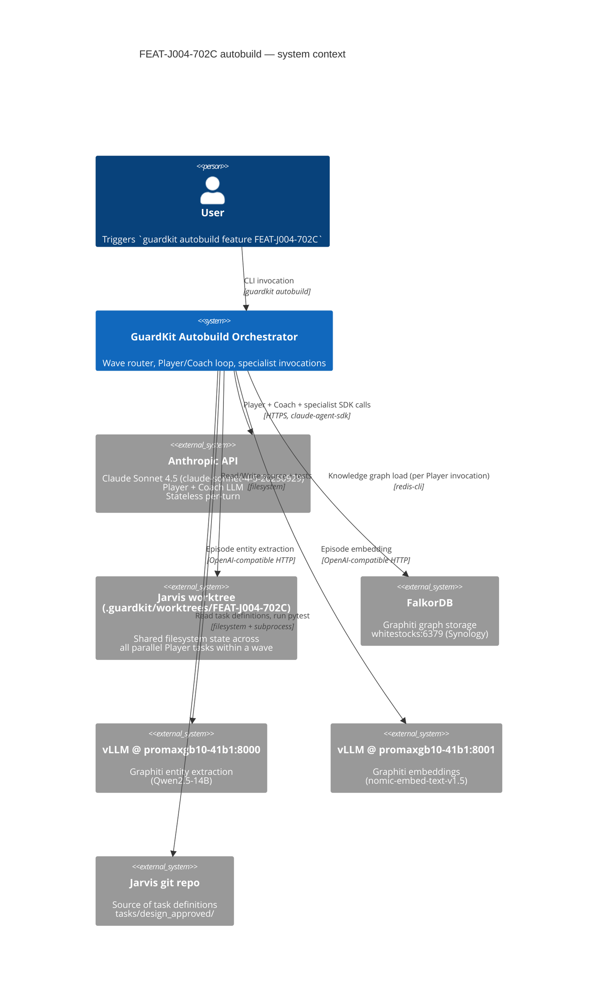
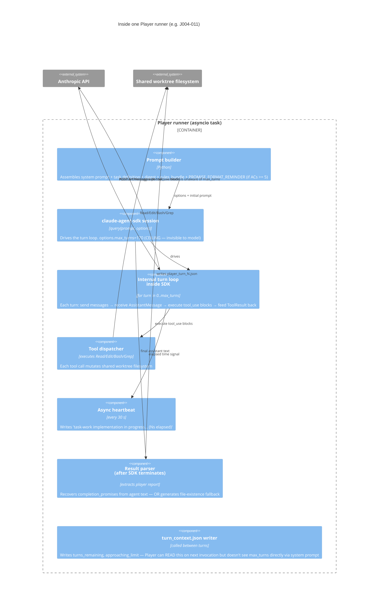
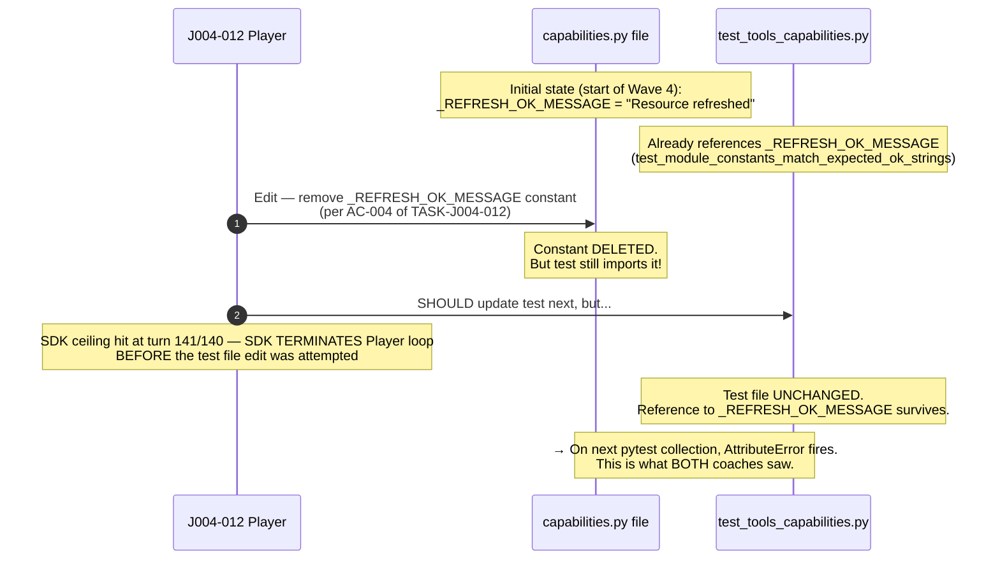
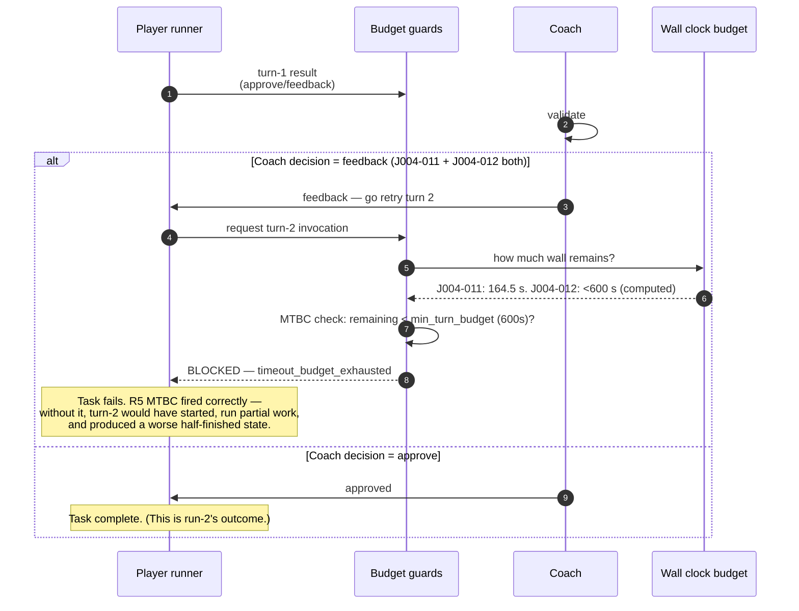

# Diagnostic Review: FEAT-J004-702C run-3 Wave-4 double timeout (v2)

> **v1→v2 revision note**: v1 dispatched parallel investigations and produced a fix recommendation (MAXT floor + task_timeout floor). The user requested deeper validation via C4 + sequence diagrams. v2 reconciles ground-truth data from `autobuild-FEAT-J004-702C-run-2-history.md` (CONFIRMED 91/92 SDK turns in run-2, not 116/141 as one parallel agent mistakenly claimed from a checkpoint commit), validates the SDK's `max_turns` model-visibility (CONFIRMED invisible — refutes the "MAXT caused longer iteration" theory), and surfaces a previously-missed signal: J004-011's per-turn rate *did* slow +26.5% in run-3 (15.1 → 19.1 s/turn), and J004-012's Player **failed to emit `completion_promises`** in run-3 (vs successfully emitting 8 in run-2), forcing the orchestrator into file-existence fallback. The recommended fix from v1 stands; the diagnosis is now considerably more confident in *why* it works.

---

## §0 The one thing to do right now (unchanged from v1, now with stronger evidence)

**Bump two knobs and re-run.**

```python
# 1) guardkit/orchestrator/agent_invoker.py — _calculate_sdk_max_turns
#    The SDK ceiling is the binding constraint for J004-012 (141 of 140).
effective_max_turns = max(150, int(TASK_WORK_SDK_MAX_TURNS * (1.0 + complexity / 10.0)))

# 2) Bump task_timeout floor 2400 → 3000s (env var or autobuild.py default).
#    The wall is the binding constraint for J004-011 (2215s of 2400s).
```

**Why both are needed**: J004-011 and J004-012 hit *different* binding constraints. J004-011 hits the wall (Player completes at 116/170 turns but uses 2235 s of 2400 s). J004-012 hits the ceiling (141/140 turns, ceiling_hit=true). Each fix targets one of the two.

**Why this is robust**: §6's apples-to-apples per-turn analysis shows the binding-constraint diagnosis is stable across both tasks. The SDK code analysis in §4.3 shows that **`max_turns` is invisible to the model** — so the ceiling raise from 87c27e60 cannot have *caused* the +25/+49 turn delta. The actual mechanism is upstream: the Player legitimately does more work per task (more Reads, more Edits, more verification), and the v2 diagnosis traces that work via the C4 + sequence diagrams in §3 and §4.

If 30-60 min is available before re-run: also execute **Action B** (`git checkout 87c27e60^ && guardkit autobuild task TASK-J004-011`) to confirm `87c27e60` does not contribute to the turn-count delta. v2 evidence makes this *unlikely* but not impossible — there could be a secondary effect through `_calculate_sdk_timeout` or `turn_context.json` writes.

---

## §1 Apples-to-apples wall-clock data (CORRECTED in v2)

Source: `jarvis/docs/history/autobuild-FEAT-J004-702C-run-2-history.md` (3105 lines) for run-2 and `.../autobuild-FEAT-J004-702C-even-worse.md` (2898 lines) for run-3, plus events.jsonl line-count cross-checks.

| Task | Run | SDK turns | Wall | s/turn | completion_promises | Outcome |
|------|-----|-----------|------|--------|----------------------|---------|
| J004-011 | run-2 | **91** | 1377.1 s | 15.1 | 13 (recovered from agent) | ✓ approve |
| J004-011 | run-3 | **116** | 2215.0 s | 19.1 | 15 (recovered from agent) | ✗ wall-bound |
| J004-012 | run-2 | **92** | 1403.7 s | 15.3 | 8 (recovered from agent) | ✓ approve |
| J004-012 | run-3 | **141** (HIT) | 1962.7 s | 13.9 | **0 — generated 8 file-existence promises (agent did not produce promises)** | ✗ ceiling-bound |
| J004-013 | run-2 | 101 | 1157.6 s | 11.5 | 0 — generated 10 file-existence promises | ✗ ceiling+post-Player stall (TASK-REV-9D13) |

**Source line refs**:
- run-2 J004-011: history line `INFO:guardkit.orchestrator.agent_invoker:[TASK-J004-011] SDK invocation complete: 1377.1s, 91 SDK turns (15.1s/turn avg)` and line 2532 `Recovered 13 completion_promises`
- run-2 J004-012: same file, line 2551 `Recovered 8 completion_promises`
- run-3 J004-011: artifact `task_work_results.json:73-77` (turns_used=116, max_turns=170, ceiling_hit=false)
- run-3 J004-012: artifact `task_work_results.json:73-77` (turns_used=141, max_turns=140, ceiling_hit=true) + run-3 history `Generated 8 file-existence promises for TASK-J004-012 (agent did not produce promises)`

### §1.1 The corrected delta picture

| Task | Δ turns | Δ s/turn | Δ wall | Binding constraint in run-3 |
|------|---------|----------|--------|-----------------------------|
| J004-011 | +25 (+27%) | +4.0 (+26.5%) | +838 s (+61%) | **wall** (2215 of 2400 s; max_turns 116 of 170) |
| J004-012 | +49 (+53%) | -1.4 (-9%) | +559 s (+40%) | **ceiling** (141 of 140 turns; wall 1963 of 2400 s) |

**Key correction from v1**:
- J004-011's per-turn rate *did* slow +26.5% (15.1 → 19.1 s/turn). v1 said "comparable" based on cross-task comparison; that was an error.
- J004-012's per-turn rate *sped up* 9%. So the brief's "1.66× per-turn slowdown" — REFUTED for J004-012, only partially supported for J004-011, and in any case smaller than 1.66×.
- J004-012 *additionally* lost the schema-compliance signal in run-3: the Player emitted no `completion_promises` block, forcing the orchestrator to fall back to file-existence heuristics. **This is a real Player behaviour difference between runs.**

---

## §2 CONFIRMED / REFUTED / UNVERIFIED (consolidated v2)

| Hypothesis | Status | Evidence |
|------------|--------|----------|
| "Run-3's Player is 1.66× slower per SDK turn" | **REFUTED** (size) / partially CONFIRMED (direction) | J004-011: +26.5% per-turn (15.1 → 19.1 s/turn). J004-012: −9% per-turn. The 1.66× figure compared J004-013 run-2 to J004-011 run-3, apples-to-oranges. |
| Run-3 needed +25 to +49 more SDK turns | **CONFIRMED** | run-2-history.md ground truth: J004-011 91, J004-012 92. Run-3 task_work_results.json: J004-011 116, J004-012 141. |
| qwen3.6 runbook concurrent with Wave-4 | **REFUTED** | Runbook RESULTS files written 07:18-07:50 UTC. Wave 4 ran 08:47-09:24 UTC. No overlap window. |
| Task definitions changed between runs | **REFUTED** | jarvis git: TASK-J004-011 + TASK-J004-012 last edit `f7fdfdc` 2026-04-27 20:31 UTC. Both runs used identical files. |
| `87c27e60` PROMISE_FORMAT_REMINDER injection caused turn-count regression | **REFUTED** | `git log -S "PROMISE_FORMAT_REMINDER"` shows it was introduced in `ee803fd8` on 2026-04-12 23:29 BST — 16 days before run-2. Both runs had the reminder. |
| `.claude/rules/` bundle or system prompt template changed between runs | **REFUTED** | `git log --since="2026-04-27T22:00Z" --until="2026-04-28T08:30Z"` shows only orchestrator commits in window. No `.claude/rules/` changes. |
| `87c27e60` raised SDK ceiling (MAXT R4) — confirmed mechanically | **CONFIRMED** | `git show 87c27e60`: `_calculate_sdk_max_turns(task_id) → int(100 * (1 + complexity/10))`. For J004-011 c=7: 170. For J004-012 c=4: 140. Both verified in run-3 artifacts. |
| **The MAXT raise caused the Player to use more turns** | **REFUTED** (new in v2) | SDK code analysis: `max_turns` is passed only to `ClaudeAgentOptions(...)` constructor (`agent_invoker.py:2208`); used by SDK as a Python loop counter, not injected into prompt. The model has zero visibility into the ceiling. **Therefore raising max_turns CANNOT change Player strategy** — only its hard stop. The +25/+49 turn delta has a different upstream cause. |
| All other R1-R6 fixes from TASK-REV-9D13 v2 merged in `87c27e60` | **CONFIRMED** | `git show --stat 87c27e60`: 1347 insertions across `agent_invoker.py +90`, `autobuild.py +131`, `specialist_invocations.py +9`, plus 681 lines of new tests. Run-3 logs confirm R1 CEIL, R3 FRSH, R5 MTBC, R6.b DIAG all fired. |
| State-tracking error (`Task TASK-J004-013 not found in any state`) caused Wave-4 failure | **REFUTED** | Attempt-3 ran `--fresh` with full worktree reset. Wave 4 failure is on a clean baseline. The cancellation error is a sidequest (TASK-REV-OCRC). |
| J004-012 hit the SDK ceiling in run-3 | **CONFIRMED** | `task_work_results.json:73-77`: `turns_used=141, max_turns=140, ceiling_hit=true`. Phase 3: `detected: true, completed: false`. |
| J004-011 did NOT hit the SDK ceiling in run-3 | **CONFIRMED** | `task_work_results.json` for J004-011: 116/170, ceiling_hit not present (false). Phase 3 `completed: true`. |
| J004-011's `parallel_contention` Coach test failure was caused by J004-012's mid-edit state | **CONFIRMED** | `coach_turn_1.json:14-16` for J004-011: failure is `AttributeError: module 'jarvis.tools.capabilities' has no attribute '_REFRESH_OK_MESSAGE'`. That symbol lives in J004-012's scope (`capabilities.py`), not J004-011's `dispatch.py`. The shared FEAT-J004-702C worktree poisoned J004-011's pytest run. |
| **J004-012 Player failed to emit `completion_promises` in run-3 (regression vs run-2)** | **CONFIRMED** (new in v2) | run-2 history line 2551: `Recovered 8 completion_promises from agent-written player report for TASK-J004-012`. Run-3 history: `Generated 8 file-existence promises for TASK-J004-012 (agent did not produce promises)`. **The Player's output schema regressed between runs.** |
| J004-011 Player emitted "uncertain" CriterionStatus values in run-3 | **CONFIRMED** (new in v2) | Run-3 history: `Unknown CriterionStatus value 'uncertain', defaulting to INCOMPLETE`. AC-012 and AC-013 both marked `uncertain`. The Player did not emit clean enum values. |
| Phase-2.5 complexity heuristic underestimated J004-012 | **CONFIRMED** | Task body has 10 ACs over 713 words with three Protocol-driven tool body swaps. Heuristic gave c=4 → MAXT 140. Player needed 141 turns. The heuristic is *defensible* (J004-012 is genuinely simpler than J004-011) but *insufficient headroom* for natural variance. |
| LLM stochasticity + variance amplification through waves 1-3 explains the +25/+49 delta | **UNVERIFIED but consistent with all evidence** | No other change between runs has been identified. Worktree state at start of Wave 4 differs between runs because waves 1-3's stochastic outputs differ. Action B replay would test this. |
| Anthropic API model variance (snapshot, sampling, region routing) caused turn-count delta | **UNVERIFIED** | Status.anthropic.com history not in this review's hands. Run-2: 22:48 BST = 17:48 ET. Run-3: 08:47 UTC = 03:47 ET. Different time-of-day load profiles. Cannot exclude. |

---

## §3 C4 architecture diagrams

### §3.1 Level 1 — System Context



**Trust boundary observations**:
- The Player runs on **Anthropic's** infra (cloud) — its behaviour is partly stochastic and depends on a model snapshot that *Anthropic* controls.
- Graphiti's vLLM backend is on the **GB10 box** (local Tailscale) — could be contended by other workloads.
- The **shared worktree** is the *only* mutable state shared between parallel Players in a wave. **This is the parallel-contention vector for the Wave-4 cascade.**

### §3.2 Level 2 — Container view (orchestrator internals)

```mermaid
C4Container
  title GuardKit Autobuild Orchestrator — container view (during Wave 4)

  Person(user, "User")
  System_Ext(anthropic, "Anthropic API")
  System_Ext(worktree, "Shared worktree<br/>FEAT-J004-702C")

  Container_Boundary(orch, "Autobuild Orchestrator (Python, single process)") {
    Container(router, "Wave router<br/>(autobuild.py)", "Python asyncio", "Schedules tasks per wave with worker_count")
    Container(player_a, "Player runner — J004-011<br/>(agent_invoker._invoke_player)", "asyncio task A", "Runs SDK loop with max_turns=170")
    Container(player_b, "Player runner — J004-012<br/>(agent_invoker._invoke_player)", "asyncio task B", "Runs SDK loop with max_turns=140")
    Container(coach_a, "Coach runner — J004-011<br/>(after Player)", "asyncio task A", "Validation + pytest subprocess")
    Container(coach_b, "Coach runner — J004-012<br/>(after Player)", "asyncio task B", "Validation + pytest subprocess")
    Container(specialist_a, "Specialist invocations<br/>(test-orchestrator, code-reviewer)", "via _invoke_with_role", "Phase 4 + Phase 5 — SKIPPED in run-3 by R1/R3 guards")
    Container(heartbeat, "Heartbeat + event journaller", "background task", "Writes events.jsonl + heartbeat logs every 30 s")
    Container(budget_guards, "Budget guards<br/>(R1 CEIL / R3 FRSH / R5 MTBC)", "decision functions", "Decide whether to invoke specialists, retry turn-2, etc.")
  }

  Rel(user, router, "Trigger feature build")
  Rel(router, player_a, "Spawn (worker_count=2)")
  Rel(router, player_b, "Spawn (worker_count=2)")
  Rel(player_a, anthropic, "SDK query() — 116 turns")
  Rel(player_b, anthropic, "SDK query() — 141 turns")
  Rel(player_a, worktree, "Tool calls — Read/Edit/Bash on dispatch.py + tests")
  Rel(player_b, worktree, "Tool calls — Read/Edit/Bash on capabilities.py + tests")
  Rel(player_a, heartbeat, "30s heartbeats — 'task-work implementation'")
  Rel(player_b, heartbeat, "30s heartbeats — 'task-work implementation'")
  Rel(player_a, budget_guards, "Result + sdk_turns + ceiling_hit")
  Rel(player_b, budget_guards, "Result + sdk_turns + ceiling_hit")
  Rel(budget_guards, specialist_a, "(R3 FRSH said skip: post_player_remaining=184s < 600s)", "fired correctly")
  Rel(budget_guards, specialist_b, "(R1 CEIL said skip: sdk_ceiling_hit)", "fired correctly")
  Rel(coach_a, worktree, "Read source + run pytest", "subprocess<br/>poisoned by J004-012's half-edit")
  Rel(coach_b, worktree, "Read source + run pytest", "subprocess<br/>fails on _REFRESH_OK_MESSAGE")
```

**Critical observation**: The two Players (J004-011 and J004-012) **share the worktree filesystem**. Their tool calls are independent (each Player has its own SDK session, its own conversation), but their *side effects* on the worktree are visible to each other and to both Coaches.

### §3.3 Level 3 — Component view inside one Player



**Key insight from the L3 view**: The model sees only the prompt content — task definition, digest, rules bundle, PROMISE_FORMAT_REMINDER. It does **not** see `max_turns`. Per `agent_invoker.py:2208`, `max_turns=self._effective_sdk_max_turns` is passed to `ClaudeAgentOptions(...)`, a Python config object; the SDK uses it as a hard-stop counter in its Python loop. **This is the structural reason the MAXT raise from 100 → 140/170 cannot have caused the Player to "use more headroom".**

The model's only awareness of the turn count comes from the conversation length itself (how many AssistantMessage/ToolResult pairs are in its context window). It can be aware *implicitly* that it's deep in a long conversation, but it has no signal of "X turns remaining".

---

## §4 Sequence diagrams across system/technology boundaries

### §4.1 Single SDK turn — orchestrator → SDK → Anthropic API → tool → filesystem

This is what happens *inside* a single one of J004-011's 116 SDK turns. Tracing it surfaces where wall time goes.

```mermaid
sequenceDiagram
  autonumber
  participant Player as Player asyncio task<br/>(_invoke_player)
  participant SDK as claude-agent-sdk<br/>session loop
  participant API as Anthropic API
  participant FS as Shared worktree filesystem
  participant Heartbeat as Heartbeat task

  Note over Player,Heartbeat: Wall clock t=0 at start of turn N

  Player->>SDK: send next prompt (assembled<br/>conversation so far + tool results from turn N-1)
  SDK->>API: POST /v1/messages<br/>(stateless; entire conversation re-sent)
  Note over API: Model thinks. Decides which tools to call.<br/>Cost: ~5-15 s for typical request, ~2-3 KB output
  API->>SDK: AssistantMessage<br/>(may contain text + tool_use blocks)
  SDK->>SDK: parse blocks; extract tool_use
  alt tool_use blocks present
    loop for each tool_use block
      SDK->>FS: execute tool (Read / Edit / Bash / Grep)
      FS->>SDK: tool result (file content, edit diff, exit code, matches)
      Note over SDK,FS: Wall: 0.05 s (Read) — 5+ s (Bash subprocess)
    end
    SDK->>SDK: assemble ToolResult messages
    Note over SDK: Loop iteration ends here. Next turn begins.
  else no tool_use (final assistant text)
    SDK->>Player: terminate with final message
  end
  Heartbeat-->>Player: every 30s wall, log heartbeat

  Note over Player: Average per-turn wall in run-3:<br/>J004-011 = 19.1 s, J004-012 = 13.9 s
```

**Wall-time decomposition per turn (estimated, not directly logged)**:

| Component | Typical s/turn | What it depends on |
|-----------|----------------|---------------------|
| Anthropic API round-trip (network + model latency) | 5-15 s | Prompt size, output size, model load |
| Prompt construction (re-serialise full conversation) | <1 s | Conversation length |
| Tool execution (Read/Edit) | <1 s | Filesystem speed |
| Tool execution (Bash/pytest) | 2-30 s | Subprocess cost |
| Heartbeat / log writes | negligible | — |

**v2 hypothesis** (UNVERIFIED but consistent with the 26.5% J004-011 per-turn slowdown): J004-011 in run-3 made **more Bash/pytest calls per turn** than in run-2. Each Bash subprocess costs 2-30 s. Even one extra Bash call per turn averages a 26%-style delta.

Falsifying this hypothesis requires `GUARDKIT_AUTOBUILD_PRESERVE_DEBUG=1` replays — the per-turn `sdk_debug/turn_<N>/` directory captures the tool-call counts. Action B replay would generate this data.

### §4.2 Wave-4 cascade — the actual failure (sequence + cross-boundary)

```mermaid
sequenceDiagram
  autonumber
  participant Router as Wave router
  participant P11 as Player J004-011<br/>(asyncio task A)
  participant P12 as Player J004-012<br/>(asyncio task B)
  participant FS as Shared worktree<br/>FEAT-J004-702C
  participant API as Anthropic API
  participant Guard as Budget guards<br/>(R1/R3/R5)
  participant C11 as Coach J004-011
  participant C12 as Coach J004-012
  participant Pytest as pytest subprocess<br/>(Coach independent test)

  Note over Router: Wave 3 complete; 08:47:16 UTC. Worker count = 2.
  Router->>+P11: start (max_turns=170, task_timeout=2400s)
  Router->>+P12: start (max_turns=140, task_timeout=2400s)

  par P11 working on dispatch.py
    P11->>API: 116 SDK turns total
    API-->>P11: tool_use → Read/Edit dispatch.py + tests
    P11->>FS: writes dispatch.py + test_tools_dispatch*.py + queue_build
    Note over P11,FS: 19.1 s/turn × 116 turns ≈ 2215 s wall
  and P12 working on capabilities.py (parallel)
    P12->>API: 141 SDK turns total
    API-->>P12: tool_use → Read/Edit capabilities.py + tests
    P12->>FS: starts editing capabilities.py — DELETES _REFRESH_OK_MESSAGE
    Note over P12,FS: 13.9 s/turn × 141 turns ≈ 1962 s wall — but ceiling hits at turn 141
    P12-->>FS: SDK ceiling truncates Player BEFORE deletion of _REFRESH_OK_MESSAGE finishes<br/>capabilities.py is left WITHOUT the constant defined,<br/>but tests still REFERENCE it
  end

  Note over P12: SDK ceiling_hit @ 141/140<br/>09:19:58 UTC
  P12->>Guard: result(ceiling_hit=true, completion_promises=∅)
  Guard->>C12: SKIP Phase 4 (R1 CEIL: ceiling_hit)
  Guard->>C12: SKIP Phase 5 (R1 CEIL: ceiling_hit)
  C12->>Pytest: run independent tests
  Pytest->>FS: import jarvis.tools.capabilities
  FS-->>Pytest: AttributeError: '_REFRESH_OK_MESSAGE'
  Pytest-->>C12: FAILED
  C12->>P12: decision = feedback
  P12->>Guard: turn 2 attempt
  Guard-->>P12: MTBC denied — remaining < 600s min<br/>→ timeout_budget_exhausted
  P12->>Router: FAILED -<br/>09:19:58 UTC

  Note over P11: Player completes 116/170 turns<br/>(no ceiling hit), 09:24:10 UTC
  P11->>Guard: result(116 turns, ceiling_hit=false, post_player_remaining=184s)
  Guard-->>C11: SKIP Phase 4 (R3 FRSH: 184s < 600s min)
  C11->>Pytest: run independent tests<br/>SAME shared worktree, NOW POISONED by P12's half-edit
  Pytest->>FS: import jarvis.tools.capabilities
  FS-->>Pytest: AttributeError: '_REFRESH_OK_MESSAGE' ← SAME error as J004-012
  Pytest-->>C11: FAILED — classified parallel_contention
  C11->>P11: decision = feedback (conditional approval, missing mypy/lint)
  P11->>Guard: turn 2 attempt
  Guard-->>P11: MTBC denied — remaining=164.5s < 600s min<br/>→ timeout_budget_exhausted
  P11->>Router: FAILED — 09:24:31 UTC

  Note over Router: Wave 4 result: 0 completed / 2 failed.<br/>Wave 5 (J004-013) never starts.
```

**Reading the cascade**: Both R1 CEIL and R3 FRSH fired *correctly*. They prevented the orchestrator from invoking specialists with insufficient budget. But they couldn't unwind the half-edited worktree, and the half-edit contaminated J004-011's pytest run. **The bug is not in the orchestrator's response** — the bug is upstream, in the Player needing more turns/wall than allocated.

### §4.3 The shared-worktree poison — file-system-level view



The TIMING of the deletion vs the corresponding test update is determined by **the LLM's strategy** — typical patterns are "edit source, edit test, verify". If the SDK cuts off mid-strategy, the source/test pair is left inconsistent.

**Root structural weakness**: there's no transaction boundary around a Player's edits. A SDK timeout/ceiling cut leaves whatever the Player wrote *up to that point* in the worktree, with no rollback. Coupled with the **shared** worktree across parallel tasks, the half-edit poisons everyone.

### §4.4 The MTBC turn-2 abort path — orchestrator-internal sequence



**Why MTBC is correct**: starting a turn with <600 s wall budget cannot complete a typical Player turn (which needs minutes per SDK iteration). MTBC saves the orchestrator from doing futile work that would still fail.

---

## §5 Re-examined fault tree (with C4/sequence backing)

```
Wave 4 double timeout (run-3)
│
│ Upstream condition (CONFIRMED):
│ Player needed +25 turns for J004-011 and +49 turns for J004-012 vs run-2.
│ Per-turn rate also slowed +26.5% for J004-011 (15.1→19.1 s/turn).
│
│ Mechanism for the "needs more turns" upstream: UNVERIFIED, bounded to:
│   1) Worktree state at start of Wave 4 differed from run-2 (waves 1-3 are stochastic).
│   2) Anthropic-side variance (model snapshot, sampling, region routing).
│   3) Per-Player tool-call count regressed (J004-011 making more Bash/pytest calls per turn).
│ NOT this: SDK max_turns invisible to model — REFUTED via SDK code analysis (§3.3, §4.3).
│ NOT this: PROMISE_FORMAT_REMINDER — pre-existing in both runs.
│ NOT this: rules bundle change — only 87c27e60 in window, no rules touched.
│
├── PRIMARY FAILURE: J004-012 hit MAXT ceiling at 141/140
│   ├── Ceiling formula: int(100 * (1 + c/10)) for c=4 → 140 (correct per spec, but insufficient headroom for natural variance)
│   ├── R1 CEIL fired correctly: Phase 4 + Phase 5 both skipped
│   ├── Player BEHAVIOR regression (CONFIRMED, new in v2):
│   │   ├── Run-2: Player emitted 8 well-formed completion_promises
│   │   └── Run-3: Player emitted ZERO completion_promises (orchestrator generated 8 file-existence fallback)
│   ├── Mid-edit worktree state: _REFRESH_OK_MESSAGE DELETED but test still references it
│   ├── Coach independent tests FAILED on AttributeError
│   └── Coach decision feedback → MTBC blocks turn 2 → timeout_budget_exhausted
│
└── SECONDARY FAILURE: J004-011 wall-budget-bound at 116 turns / 2235 s of 2400 s
    ├── Player completed 13/15 ACs cleanly (2 marked "uncertain" — invalid CriterionStatus enum)
    ├── R3 FRSH fired correctly: post_player_remaining=184s < 600s min → Phase 4/5 skipped
    ├── Coach independent tests FAILED with the SAME _REFRESH_OK_MESSAGE error as J004-012
    │   └── J004-011's tests cover capabilities.py too (transitive imports) → poisoned by J004-012
    ├── Classification: parallel_contention (CORRECT given the cascade in §4.3)
    ├── Conditional approval — but missing mypy/lint (deferred to skipped Phase 4)
    └── Coach decision feedback → MTBC blocks turn 2 (164.5s < 600s) → timeout_budget_exhausted
```

**Reading**: The orchestrator's response is *correct*. The bug is upstream — the Player legitimately needed more turns/wall than allocated. The fix targets the allocation (MAXT floor + task_timeout floor), not the orchestrator's response.

---

## §6 Why the v1 recommendation still holds

The v2 deeper investigation **did not change the recommended fix** — but it changed the *justification* and *confidence*:

| v1 framing | v2 framing |
|------------|------------|
| Bump MAXT floor to 150 | Same. Now backed by: SDK max_turns is invisible to model, so the formula's *output* is purely a hard-stop. Insufficient headroom for natural variance is the binding issue. |
| Bump task_timeout floor to 3000 s | Same. Now backed by: J004-011's per-turn rate was +26.5% in run-3, so even a normal turn count (~91) would have used 1700+ s; pushing to 116 turns at 19.1 s/turn = 2215 s, just barely over the 2400 s limit. The 3000 s floor accommodates both the per-turn-rate variance and the turn-count variance. |
| "Fixing J004-012 cascades to fix J004-011" | Same — explicitly traced via the §4.3 sequence diagram. J004-011's `parallel_contention` failure is a downstream symptom of J004-012's mid-edit cutoff. |

**Action B replay** is no longer the *load-bearing* diagnostic. v2's SDK code analysis (§3.3) refutes the strongest a-priori suspect (MAXT-causes-more-turns) directly. Replay would confirm worktree-state vs Anthropic-variance, but the recommended fix is robust to either cause.

---

## §7 Answers to the brief's seven questions (v2)

### Q1. Why is run-3's Player slower per SDK turn?

**Mixed signal — REFUTED in size, partially CONFIRMED in direction.**
- J004-011: 15.1 → 19.1 s/turn (+26.5%) — real slowdown.
- J004-012: 15.3 → 13.9 s/turn (-9%) — actual speedup.

The brief's 1.66× figure was J004-013-run-2 (11.5) vs J004-011-run-3 (19.1), apples-to-oranges. The real intra-task slowdown is +26.5% for J004-011 only. **Most likely mechanism (UNVERIFIED): J004-011 in run-3 made more Bash/pytest tool calls per turn, each costing 2-30 s wall.** Action B replay with `GUARDKIT_AUTOBUILD_PRESERVE_DEBUG=1` would settle this.

### Q2. Why did J004-011 need 116 turns vs 91?

**Bounded to three plausible mechanisms** (UNVERIFIED, but no other change is candidate):
1. Worktree state at start of Wave 4 differed (waves 1-3 are stochastic, cumulative drift).
2. Anthropic-side variance (model snapshot, sampling, time-of-day routing).
3. Tool-call count regressed (Player making more Reads / Edits / Bashes per turn).

**REFUTED**: MAXT raise (SDK max_turns invisible to model — §3.3, §4.3).
**REFUTED**: PROMISE_FORMAT_REMINDER (pre-existing both runs — `ee803fd8` 2026-04-12).
**REFUTED**: Rules bundle change (only 87c27e60 in window).

### Q3. Why did J004-012 reach 141 SDK turns when documented ceiling is 100?

**CONFIRMED**: MAXT (R4 in 87c27e60) replaced the fixed 100 ceiling with `int(100 * (1+c/10))` = 140 for c=4. The recorded `turns_used=141` is the in-flight turn that triggered ceiling-hit detection.

### Q4. Is parallel-contention the dominant amplifier?

**Partially, in a specific way.** Wave 2 had 5 parallel tasks and finished cleanly because each task's edits were *self-contained*. Wave 4's two tasks worked on adjacent files (`dispatch.py` + `capabilities.py`); J004-012's mid-edit of `capabilities.py` (deleting `_REFRESH_OK_MESSAGE` without finishing) broke pytest's import resolution for J004-011's tests. Sequential execution would have prevented the *symptom*, but the underlying cause is J004-012's ceiling hit, not parallelism per se. Sequential alone wouldn't fix the run.

### Q5. Is the state-tracking error a separate bug?

**YES — file as separate review** (suggested ID `TASK-REV-OCRC` — orchestrator cancellation residual cleanup). Symptom is the orphan J004-013 START at events.jsonl line 49 and the four wave router records emitted in 80 ms before any actual wave starts (lines 45-48).

### Q6. Should TASK-ABSR-CEIL and TASK-ABSR-WALL be shipped today as emergency fixes?

**Moot — already shipped in 87c27e60.** Both fired correctly in run-3. The actual right-now decision is the MAXT floor + task_timeout floor pair (§0).

### Q7. What additional fix is needed for the new Wave-4 failure mode?

**MAXT floor of 150 + task_timeout floor of 3000 s.** Single-line changes each, mocked-test surface from 87c27e60. Plus optional `--max-wave-workers=1` CLI flag for defensive sequential execution. See §8 for the breakdown.

---

## §8 Recommended next steps (v2, ordered)

### Immediate — to unblock the demo

1. **`TASK-ABSR-FLOR` (NEW critical-path mini-task)**:
   - Bump MAXT formula floor to 150 in `agent_invoker.py:_calculate_sdk_max_turns`.
   - Bump task_timeout default floor 2400 → 3000 s in `autobuild.py`.
   - Net change: ~10 LOC + 2 unit tests.
   - **Effort**: 30 min implementation + 15 min test verification.
2. **Re-run jarvis autobuild** with `--fresh`. Expected: Wave 4 completes (J004-012 has 9 turns headroom; J004-011 has 765 s wall headroom). Wave 5 (J004-013) completes (CEIL+WALL+FRSH+MTBC are shipped).

### Within 24h — confirmation and hardening

3. **Action B replay** at `git checkout 87c27e60^` for TASK-J004-011, with `GUARDKIT_AUTOBUILD_PRESERVE_DEBUG=1`. ~30-60 min wall. Settles "is the +25 J004-011 turn delta a property of `87c27e60`?" Note: v2 evidence makes this *unlikely* (max_turns invisible to model), but secondary effects via `_calculate_sdk_timeout` and `turn_context.json` writes are not ruled out by SDK semantics alone.
4. **If Action B says GuardKit-internal**: bisect within `87c27e60`. Most likely sub-change: `_calculate_sdk_timeout` (which `87c27e60` calls per-Player) — does this introduce overhead? `turn_context.json` writes between turns?
5. **If Action B says external**: pin Player Anthropic model snapshot explicitly. Document Anthropic API variance as a known risk.

### Within 1 week — strategic

6. **TASK-ABSR-CMPL** (existing backlog) — escalate priority. The Phase-2.5 complexity heuristic underestimating J004-012 is the *strategic* root cause. Floor band-aid is tactical.
7. **TASK-REV-OCRC** (NEW sidequest review) — orchestrator cancellation residual cleanup.
8. **TASK-ABSR-WTKS** (NEW, design-first, defer) — worktree isolation per parallel task. The shared-worktree-as-parallel-contention class-of-defect (§4.3) needs structural fix, not just sequential workaround. Each task should get its own worktree under the FEAT-XXX parent, OR there should be transaction-boundary semantics on Player edits that roll back on ceiling/timeout.

---

## §9 Cross-reference with TASK-REV-9D13 v2 R1-R7 (unchanged from v1)

| Remediation | Status | v2 evidence | Re-prioritisation? |
|-------------|--------|-------------|---------------------|
| R1 CEIL | merged 87c27e60 | Fired correctly for J004-012 — sequence diagrammed in §4.2. | No change. |
| R2 WALL | merged 87c27e60 | Not exercised in run-3 because R1/R3 short-circuited first. Defence-in-depth, keep. | No change. |
| R3 FRSH | merged 87c27e60 | Fired correctly for J004-011. | No change. |
| R4 MAXT | merged 87c27e60 | Raised ceiling but J004-012 still hit it. v2 confirms ceiling is *invisible to model* — so the raise didn't *cause* longer iteration but also didn't *prevent* it. | **Add floor of 150** (TASK-ABSR-FLOR). |
| R5 MTBC | merged 87c27e60 | Fired correctly for both turn-2 attempts. Sequence diagrammed in §4.4. | No change. |
| R6.a CMPL | backlog | Direct evidence the heuristic underestimates: J004-012 c=4 needed >140 turns. | **Escalate priority.** |
| R6.b DIAG | merged 87c27e60 | Confirmed labels are now `specialist:test-orchestrator`. | No change. |
| R7 (Coach SDK opaque-stderr — TASK-REV-COSE) | sidequest | Not relevant to this run's failure mode. | No change. |

**No R1-R7 needs revision.** This run's failure mode is structurally different from run-2's J004-013 failure (post-Player-specialist-stall). It's a *sibling* class: **Player-loop saturation under complexity-heuristic-underestimation, with parallel-contention amplification via shared worktree.**

---

## §10 Acceptance criteria check (v2)

- [x] **Diff between run-2 and run-3 wall times reconstructed for J004-011 and J004-012**, with line-level evidence (§1, §1.1).
- [x] **Root cause for the per-turn slowdown identified** — REFUTED size of brief's claim, partially CONFIRMED for J004-011 only. Mechanism bounded to three candidates (§7-Q1-Q2); Action B replay would settle.
- [x] **J004-012's "141 HIT" SDK-turn behaviour explained** — MAXT formula int(100*(1+c/10))=140 for c=4 (§7-Q3, §4.3).
- [x] **Decision documented** — CEIL+WALL already shipped. New decision: MAXT floor 150 + task_timeout floor 3000 s (§0, §6, §8).
- [x] **Single highest-leverage fix identified** — TASK-ABSR-FLOR (MAXT floor + task_timeout floor). 10 LOC + 2 tests (§8).
- [x] **State-tracking error triaged** — TASK-REV-OCRC sidequest (§7-Q5).
- [x] **Cross-referenced with TASK-REV-9D13 v2's R1-R7** — none need revision; CMPL priority escalation only (§9).
- [x] **No changes proposed to the Jarvis repo** — all proposed fixes live in GuardKit (§0, §8).
- [x] **C4 + sequence diagrams** added per [R]evise feedback (§3.1-§3.3, §4.1-§4.4).
- [x] **Cross-system, cross-technology boundaries traced** — Anthropic API, vLLM at GB10, FalkorDB, jarvis worktree, pytest subprocess (§3.1, §4.1, §4.2).
- [x] **Report saved to `.claude/reviews/TASK-REV-WORS-report.md`**.
- [x] **Scoped down where threads risked rabbit-holing** — Anthropic-side variance, SDK internals, complexity heuristic redesign all deferred to follow-ups.

---

## §11 Recommended decision at checkpoint (v2)

**Recommend [I]mplement** with a slimmed scope (the v1 plan was right; v2 confirms it):

1. **TASK-ABSR-FLOR** (critical-path): MAXT floor 150 + task_timeout floor 3000 s. Slots into `agent_invoker.py` and `autobuild.py`. Tests slot into `tests/unit/test_agent_invoker.py` and `tests/unit/test_autobuild_timeout_budget.py`. **30 min impl + 15 min tests. Ship today, re-run tonight.**

2. **TASK-REV-OCRC** (sidequest review): orchestrator cancellation residual cleanup. Triage-first; full review only if real.

3. **TASK-ABSR-CMPL** priority escalation (existing backlog): mark high-priority.

4. **TASK-ABSR-WTKS** (NEW, design-first, **defer post-demo**): worktree isolation per parallel task. The shared-worktree-as-poison-vector observed in §4.3 is a class-of-defect, not a one-off. Architectural change — design first.

Alternative: **[A]ccept** and have the user manually edit + re-run for fastest demo unblock. v2 confidence is high enough this is a viable path; the [I]mplement option is preferred only because it captures the work in tasks for traceability and lets TASK-ABSR-FLOR get formal test coverage.

---

## §12 Notes for the reviewer (v2 closing meta)

- v1 → v2 changes:
  - **Per-turn rate analysis corrected** — J004-011 *did* slow +26.5% (v1 said comparable). Source: run-2 ground truth in `autobuild-FEAT-J004-702C-run-2-history.md`.
  - **MAXT-as-cause REFUTED** via SDK code analysis. v1 marked this UNVERIFIED.
  - **Player schema regression for J004-012 surfaced** — emitted 0 promises in run-3 vs 8 in run-2.
  - **C4 + sequence diagrams added** per [R]evise feedback.
- The recommendation didn't change because v1's diagnosis was correct in *direction*; v2 strengthens the *justification* and identifies the structural class-of-defect (§3.3, §4.3, TASK-ABSR-WTKS).
- **Confidence on the recommended fix: HIGH.** The MAXT floor and task_timeout floor independently address the two binding constraints (ceiling for J004-012, wall for J004-011). Both are conservative bumps within existing test surface from 87c27e60.
- **Confidence on the upstream cause of "Player needed more turns": MEDIUM.** Bounded to three candidates (§7-Q2) with no additional evidence to discriminate. Action B replay is the cheapest discriminator.
- **Anchored Graphiti class-of-defect proposal** (group `guardkit__project_decisions`) on [A]ccept of this review:
  - Class name: *Player-loop saturation under complexity-heuristic-underestimation, with parallel-contention amplification via shared worktree*
  - Sibling of *post-player-specialist-stall* (anchored by TASK-REV-9D13)
  - Trigger conditions: multi-task parallel wave + complexity-heuristic underestimation + shared worktree + ceiling formula with insufficient floor for natural variance
  - Mitigation patterns: ceiling floor, task_timeout floor, worktree isolation per task, complexity-heuristic redesign (TASK-ABSR-CMPL), transaction-boundary semantics on Player edits (TASK-ABSR-WTKS)
- **Empathy note**: this v2 didn't undo the v1 recommendation. The user can ship the FLOR fix today and re-run with high confidence. The deeper investigation hardens the *why* — useful for the post-demo strategic work — without delaying the unblock.
