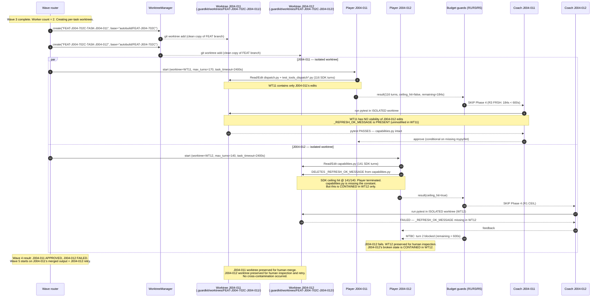

# TASK-ABSR-WTKS: Worktree Isolation per Parallel Task

## Executive Summary

The Wave-4 cascade in FEAT-J004-702C run-3 exposed a structural class-of-defect: multiple Players executing in parallel within a single wave share the `FEAT-XXX` worktree filesystem with no transaction boundary on their edits. When the SDK terminates a Player at mid-edit (ceiling hit, timeout), whatever that Player wrote persists in the shared worktree. Parallel mates and their Coaches see the half-edited state, causing cascading test failures that are correctly classified as `parallel_contention` but are structurally unavoidable given the current architecture.

The recommended option is **Option C (pre-Phase-4 consistency check) as a near-term tactical layer, combined with a phased migration toward a slimmed Option A (per-task subworktrees under the FEAT-XXX parent) as the durable structural fix**. This recommendation diverges from the task file's Option E starting point and from the initial instinct toward transaction semantics. The reasoning: Option B's transaction-boundary approach requires invasive integration with the tool dispatcher (Read/Edit/Bash must consult an overlay), and on macOS — the primary dev platform — overlayfs is unavailable, making Bash subprocesses inherently able to see the underlying filesystem. Git-stash-based overlays cannot protect against `subprocess.run(["pytest", ...])` calls during Player execution. Option A's subworktree variant avoids this problem entirely and aligns with the existing `WorktreeManager` + `WorktreeCheckpointManager` infrastructure. Option C deployed first costs minimal effort and provides immediate blast-radius reduction while Option A is implemented.

The blast radius for the recommended approach is moderate: Option C requires approximately 80 lines across two files (`autobuild.py`, new `worktree_consistency.py`). The phased Option A migration touches `feature_orchestrator.py`, `WorktreeManager`, `paths.py`, and `autobuild.py` — approximately 350 additional lines, with zero changes to R1/R3 guards. Total estimated effort is 3–5 days for both phases.

---

## Problem Framing

### The Motivating Incident

FEAT-J004-702C run-3, Wave 4 (09:19–09:24 UTC, 2026-04-28). Two tasks executing in parallel (worker_count=2) in the shared worktree at `.guardkit/worktrees/FEAT-J004-702C/`:

**J004-012** (capabilities.py scope): Player used 141 SDK turns against a ceiling of 140. At the point of SDK termination, the Player had:
- Deleted `_REFRESH_OK_MESSAGE` from `capabilities.py` (AC-004 of J004-012 requires removing that constant)
- Had NOT yet updated `test_tools_capabilities.py` to remove the reference to the now-deleted constant

The R1 CEIL guard correctly skipped Phase 4/5. The Coach ran its independent pytest anyway and hit `AttributeError: module 'jarvis.tools.capabilities' has no attribute '_REFRESH_OK_MESSAGE'`.

**J004-011** (dispatch.py scope): Player completed cleanly at 116/170 turns. Its Coach ran independent pytest on the SAME shared worktree — now poisoned by J004-012's half-edit — and hit the identical `AttributeError`. J004-011's tests import `capabilities` transitively; the deletion broke the import graph.

Both Coaches correctly classified the failure. Both tasks exhausted turn-2 budget via R5 MTBC. Wave 5 never started. The cascade is documented in TASK-REV-WORS report v2, §4.2–§4.3.

**The structural weakness (from `.claude/reviews/TASK-REV-WORS-report.md` §4.3)**:

> Root structural weakness: there's no transaction boundary around a Player's edits. A SDK timeout/ceiling cut leaves whatever the Player wrote up to that point in the worktree, with no rollback. Coupled with the **shared** worktree across parallel tasks, the half-edit poisons everyone.

### Class of Defect

This is not a guard-ordering bug. R1/R3/R5 all fired correctly. The defect is a **missing isolation boundary**: Player edits during turn N of task A are visible to the Coach and Players of task B during the same wave. There is no transaction boundary on the Player's filesystem writes; an SDK-enforced termination leaves a half-edit committed to the filesystem with no automatic cleanup.

This class of defect can recur whenever:
1. worker_count > 1 in a wave, AND
2. Task A's Player edits touch a file that task B's tests import (directly or transitively), AND
3. Task A's Player is terminated mid-edit by the SDK ceiling or a wall timeout

All three conditions can coexist legitimately. Condition 2 — adjacent or overlapping import graphs — is normal for feature waves where multiple tasks implement related modules.

---

## Constraint Inventory

### Hard constraints (cannot change)

1. **macOS is the primary dev host**: overlayfs (Linux kernel feature) is not available on macOS. Any solution requiring overlayfs for Bash subprocess isolation is not viable.
2. **ADR FB-002 (feature-mode paths use FEAT-XXX, not TASK-XXX)**: The path `.guardkit/worktrees/FEAT-XXX/` is load-bearing. Existing worktrees in progress, resume logic, and the `Worktree` dataclass (`worktrees/manager.py`) all use `feature_id` as the `task_id` passed to `WorktreeManager.create()`. Any new per-task worktree scheme must be *nested under* or *alongside* the FEAT-XXX root path, not replace it.
3. **Invariant: humans merge** (`.claude/rules/feature-build-invariants.md` invariant #6): The system must not auto-merge task worktrees. Successful task results must remain in preserved worktrees for human review. Any "consensus worktree" approach that auto-merges violates this invariant.
4. **Invariant: Player implements, Coach validates** (invariant #1): Coach scope cannot be widened. The Graphiti knowledge graph explicitly records: "The per-task Coach is structurally unable to detect composition failures that occur between waves" and "prefer upstream prevention over widening the scope of the Player-Coach." Coach must not be redesigned to compensate for worktree contention.
5. **R1 CEIL / R3 FRSH / R5 MTBC guards must not change**: These guards are correct. This design complements them, it does not replace them.
6. **The `WorktreeCheckpointManager` file-based lock (`.guardkit-git.lock`)** already serialises git operations across parallel tasks in a shared worktree (`worktree_checkpoints.py:282, 376-384`). Any new git operations added by this design must respect the same lock.

### Soft constraints (should preserve)

- Resume semantics: `feature_orchestrator.py:875-892` uses `resume_point['worktree_path']` to reuse an existing worktree. Per-task worktrees must not break resume for features that were mid-wave when a previous run was interrupted.
- Disk budget: the user's system must not run out of disk during a wave. The current repo is modest (~50 MB), so per-task worktrees add ~100–200 MB per parallel wave (2–4 tasks typical). This is acceptable on any machine capable of running Claude Code.
- `TaskArtifactPaths` correctness: all artifact paths (player reports, coach decisions, checkpoints) are already task-namespaced under `.guardkit/autobuild/{task_id}/`. The `worktree` field in those paths is the root of the worktree, not the task-specific subdirectory. Any change to the worktree root must propagate cleanly through `paths.py`.

---

## Option-by-Option Analysis

### Option A — Per-task subworktrees under FEAT-XXX parent

**Mechanism**: Instead of a single shared worktree at `.guardkit/worktrees/FEAT-J004-702C/`, each parallel task in a wave gets its own git worktree. The structurally cleanest layout consistent with ADR FB-002 is:

```
.guardkit/worktrees/FEAT-J004-702C/           ← parent (the FEAT-XXX path FB-002 protects)
.guardkit/worktrees/FEAT-J004-702C/.tasks/TASK-J004-011/   ← J004-011's isolated worktree
.guardkit/worktrees/FEAT-J004-702C/.tasks/TASK-J004-012/   ← J004-012's isolated worktree
```

Alternatively (and arguably cleaner with existing WorktreeManager):

```
.guardkit/worktrees/FEAT-J004-702C-TASK-J004-011/   ← per-task worktree (sibling pattern)
.guardkit/worktrees/FEAT-J004-702C-TASK-J004-012/   ← per-task worktree (sibling pattern)
```

The sibling pattern is simpler (no nested git worktree management) but loses the FEAT-XXX grouping. The `.tasks/` subdirectory pattern preserves grouping but requires that `git worktree add` create a worktree inside an existing worktree directory — git supports this as long as the parent is not itself a worktree (the parent directory is just a filesystem directory, not a git worktree).

In either variant, at wave-end:
- Tasks that completed successfully: their worktrees are preserved as today (humans merge).
- Tasks that hit the ceiling/timeout: their worktrees are preserved as today (humans inspect).
- The FEAT-XXX parent worktree (if kept) would receive only the output of successful tasks manually merged by the human, as today.

**Files changed**:
- `guardkit/worktrees/manager.py`: `WorktreeManager.create()` already supports arbitrary `task_id` strings. Creating `FEAT-J004-702C-TASK-J004-011` as the task_id just works. The change is in the *caller*, not `WorktreeManager` itself.
- `guardkit/orchestrator/feature_orchestrator.py`: Wave loop (lines 851–928 setup, plus the wave execution thread pool). Currently creates one worktree for the feature (`_create_new_worktree`). Would need to create per-task worktrees in the wave executor before spawning each `AutoBuildOrchestrator`.
- `guardkit/orchestrator/paths.py`: `TaskArtifactPaths` resolves paths relative to `worktree_path`. Since `worktree_path` would now be per-task, `TaskArtifactPaths` is correct without change. The `worktree.path` argument passed to `AutoBuildOrchestrator` would simply be the per-task worktree.
- `guardkit/orchestrator/autobuild.py`: `AutoBuildOrchestrator` receives `worktree` as a constructor argument (lines 2640–2702). No change required; the worktree passed to it would be the per-task one.

**Pros**:
- Complete isolation: J004-012's half-edit is contained within its own worktree; J004-011's Coach pytest runs in a clean worktree with no visibility of J004-012's edits.
- No invasion of tool dispatcher: Read/Edit/Bash already operate on `cwd=worktree.path`; with a per-task worktree, they automatically operate on the task-local copy.
- Aligns with `WorktreeCheckpointManager` design intent: checkpoints are already per-task-id and per-worktree-path; per-task worktrees make this design coherent (no more shared-worktree git-lock contention between parallel tasks).
- Eliminates the need for the `.guardkit-git.lock` serialisation across parallel tasks (each task has its own worktree, its own git index).
- Clean rollback path: if a Player is terminated mid-edit, `git reset --hard HEAD` in the task-specific worktree restores the task's private state without affecting any other task.

**Cons**:
- Disk: N parallel tasks × worktree size. For the Jarvis repo (~300 MB), 4 parallel tasks = ~1.2 GB per wave. Acceptable on developer workstations; marginal on CI runners with small disks.
- Each task starts from the FEAT-XXX base branch (or the last-committed state). Intra-feature, cross-task dependencies (Task B requires Task A's output to already be in the worktree) must be resolved at wave boundaries. Wave N-1 merges must be committed to the base before Wave N starts — this is the existing wave-dependency contract, unchanged.
- Wave-start setup cost: `git worktree add` takes 2–5 seconds per task. For a wave of 4 tasks, this adds ~16 seconds of sequential setup before any Player starts.
- The `.tasks/` nested layout requires that the parent directory not itself be a checked-out worktree. The "sibling" layout is simpler and fully compatible with `git worktree`.

**Blast radius**: Medium-high. Changes `feature_orchestrator.py` wave loop (the core orchestration logic). Does not touch `autobuild.py`, `paths.py`, R1/R3 guards, or Coach logic.

**Defect-class coverage**: Complete. Prevents the motivating incident class by construction: no shared filesystem between parallel Players.

### Option B — Transaction-boundary semantics on Player edits

**Mechanism**: Player edits are staged in a per-task overlay. On successful Player completion, edits are committed atomically to the shared worktree. On ceiling/timeout, edits are rolled back.

Possible overlay backends:
1. **Git stash per task**: before Player starts, record HEAD. If Player terminated without success, `git reset --hard HEAD`. If Player succeeds, commit.
2. **Copy-on-write directory**: before Player starts, `cp -r worktree/ worktree-task-XXX/`. Player runs in the copy. On success, rsync back.
3. **overlayfs**: Linux-only. Mount an overlay over the worktree per task. macOS: not available.

**Files changed**:
- `guardkit/orchestrator/autobuild.py`: before Player invocation, create a pre-Player checkpoint (`git stash` or `git add -A && git stash push --include-untracked`). After Player invocation, if `sdk_ceiling_hit` or `timeout`, `git stash drop` (discarding the Player's edits). This must integrate with the existing `WorktreeCheckpointManager`.
- `guardkit/orchestrator/worktree_checkpoints.py`: needs a `create_pre_player_snapshot()` and `restore_pre_player_snapshot()` method. The existing `create_checkpoint()` does a commit; pre-Player snapshots should use stash to remain non-destructive of the branch HEAD (stash is a side stack, not a branch commit).
- Tool dispatcher (Read/Edit/Bash): Bash subprocesses receive `cwd=worktree.path`. If the underlying worktree is shared and the overlay is a git stash (not a separate directory), Bash tools see the stashed-away base state during Player execution — which is the WRONG state (the Player should see its own working-tree edits during its own turn). Git stash pops the working tree back; the stash itself is stored internally. This means "stash on ceiling" would restore the pre-Player state, which is correct for rollback but NOT for the Player during execution. The mechanism actually works: stash before Player starts (nothing to stash), Player edits freely, if ceiling: stash pop undo is just `git checkout -- .` effectively, no stash needed mid-Player — what we need is `git reset --hard HEAD` (or `git stash` if there are staged/unstaged changes) on ceiling. This approach does work for the specific failure mode.
- However: if two Players run in parallel in the SAME worktree, and Player A does `git stash` on ceiling while Player B is actively editing, the stash operation (`git add -A`) will stage Player B's uncommitted edits too, and the subsequent `git reset --hard HEAD` will discard them. This is a correctness bug: the rollback of A contaminates B's in-flight edits.

**The fundamental problem with Option B in a shared worktree**: git stash and `git reset --hard` are worktree-wide operations. They cannot be scoped to a single Player's edits within a shared worktree without knowing exactly which files that Player touched — which requires instrumenting every tool call. The `WorktreeCheckpointManager` already serialises git operations with a lock, but the problem is that a rollback of one task's edits in a shared worktree will inevitably disturb another task's edits that exist in the same working tree (unstaged, staged, or already committed to the shared branch).

The only way to make Option B work without a separate filesystem is overlayfs (Linux). On macOS, Option B is structurally incomplete.

**Pros**:
- Shared worktree preserved (disk savings vs Option A).
- Clean rollback semantics IF tasks have non-overlapping file scopes.

**Cons**:
- macOS: no overlayfs → Bash subprocesses see shared filesystem.
- In a shared worktree, `git reset --hard` from one task's rollback impacts another task's in-flight edits. This is a data-loss risk in the parallel case.
- Requires modifying `WorktreeCheckpointManager` or adding new pre-Player snapshot logic that must integrate with the existing locking protocol.
- Read/Edit tool calls operate on the shared filesystem; no overlay without overlayfs means the Player's edits are immediately visible to parallel mates during the Player's own execution — rollback only happens after ceiling detection, not during.
- High invasiveness: every Player invocation path must be wrapped with snapshot-before and rollback-after logic.

**Blast radius**: High. Invasive changes to both `autobuild.py` and `worktree_checkpoints.py`; risk of introducing new bugs in the checkpoint/rollback machinery that is currently working correctly.

**Defect-class coverage**: Partial on macOS (the primary dev platform). Does not prevent the motivating incident class on macOS because Bash subprocesses (including pytest) always see the shared filesystem.

### Option C — Pre-Phase-4 consistency check

**Mechanism**: After a wave's Players complete (regardless of success/ceiling/timeout), a new step runs a fast consistency check before any Coach invokes pytest. The check verifies:
1. Python imports resolve (no `AttributeError` / `ImportError` on module collection).
2. The worktree compiles (`python -c "import <package>"` for each top-level package in the feature).

If the check fails, the wave is classified as `worktree_corruption_post_ceiling` and all parallel tasks are marked for sequential retry (wave re-attempted with worker_count=1).

**Files changed**:
- New `guardkit/orchestrator/worktree_consistency.py`: ~60 lines. `WorktreeConsistencyChecker` class with a single `check(worktree_path, packages)` method that runs `python -m py_compile` or `import` probes via subprocess.
- `guardkit/orchestrator/autobuild.py`: In the wave executor (around lines 2640–2645 where `player_result` is checked), after collecting all Player results, call `WorktreeConsistencyChecker.check()`. If fails and at least one task in the wave hit the ceiling, classify and abort before Coach pytest runs.
- `guardkit/orchestrator/feature_orchestrator.py`: Wave-level retry logic — if a wave is marked `worktree_corruption_post_ceiling`, re-queue those tasks with worker_count=1.

**Pros**:
- Low effort: ~100 LOC total.
- No change to storage layout, worktree lifecycle, or ADR FB-002 paths.
- Directly addresses the motivating incident: if J004-012's half-edit had been caught by this check, J004-011's Coach would never have run pytest against the poisoned worktree.
- Can be deployed as a standalone fix in days.
- No interaction with the tool dispatcher.

**Cons**:
- Detects but does NOT prevent contamination. The shared worktree still ends up in a half-edited state after a ceiling hit. The check prevents the downstream cascade (Coach failures) but the root half-edit persists.
- Adds wall time: a consistency check before each Coach invocation adds 5–15 seconds per wave (one `python -c import` per package).
- Wave retry with worker_count=1 doubles wall time for the affected wave. This is better than total wave failure but not ideal.
- Does not help in the case where two parallel tasks both hit ceilings and leave inconsistent states — the retry will still need to work in a contaminated worktree unless the retry also resets the worktree to a clean state.
- Requires determining "which packages to check" — must be configured or auto-detected per repo.

**Blast radius**: Low. New file + minor additions to two existing files.

**Defect-class coverage**: Partial. Prevents downstream cascade but not the root structural cause. The worktree contamination still occurs; this option simply detects it before it spreads to Coach test runs.

### Option D — Sequential-only execution for high cross-file dependency waves

**Mechanism**: At wave-planning time, compute the import-graph overlap between tasks in the wave. If the combined import surface exceeds a threshold (e.g., tasks share a transitive import), reduce `worker_count` to 1 for that wave.

**Files changed**:
- New `guardkit/orchestrator/import_graph_analyzer.py`: static import graph analysis using `ast.parse` + recursive import resolution. Non-trivial implementation (~200–300 lines).
- `guardkit/orchestrator/feature_orchestrator.py`: Before wave execution, call `ImportGraphAnalyzer.compute_overlap(task_file_scopes)`. If overlap detected, set `worker_count=1`.

**Pros**:
- Prevents the contention class: if tasks can't share import graphs, they can't contaminate each other.
- No change to storage layout.

**Cons**:
- Static import analysis is inherently approximate: Python's dynamic import resolution (`importlib`, conditional imports, `__init__.py` re-exports) makes complete static analysis hard. False positives (reducing to sequential unnecessarily) are likely.
- Doubles wall time for any wave flagged: for a 40-minute wave, this is +40 minutes. Given the DDD-SouthWest constraint (20 days), this is a significant regression for affected runs.
- Does not address ceiling-hit rollback: if a task is running sequentially and hits the ceiling, the half-edit still persists. If the next task in the same wave (now running sequentially) imports the poisoned file, it still fails. Option D prevents parallel contention but not sequential contamination.
- Implementation of the import-graph analyzer is ~3–5 days of non-trivial Python work. Unjustified given that Option A provides stronger guarantees with less complexity.

**Blast radius**: Medium. New complex module + wave orchestration change. High risk of false positives degrading performance.

**Defect-class coverage**: Partial — prevents parallel contamination for correctly-detected overlapping import graphs, but misses dynamic imports and does not address ceiling-hit contamination in sequential mode.

### Option E — Hybrid: B + C

**Mechanism**: Transaction-boundary on Player edits (rollback on ceiling/timeout) plus pre-Phase-4 consistency check as defence-in-depth.

This is the task file's "recommended starting point." After analysis, Option E inherits Option B's structural flaw on macOS: `git reset --hard` or git stash in a shared worktree is a worktree-wide operation that cannot safely scope to a single task's edits when two Players are editing in parallel. Deploying Option B in a shared worktree with worker_count > 1 risks destroying in-flight edits of the non-ceiling task when rolling back the ceiling task.

Option E would be viable if the "transaction" is implemented not via shared-worktree git operations but via per-task worktrees — which is essentially Option A. The "B" half of Option E cannot be safely implemented in a shared worktree on macOS without overlayfs.

**Why Option E does not supersede the analysis**: The hybrid instinct is sound (defence in depth), but the correct hybrid for macOS is C + A (Option C as immediate tactical layer, Option A as the durable structural replacement), not B + C.

---

## Decision Matrix

**Scoring: 1 (worst) — 5 (best) for each criterion**

| Criterion | A (subworktrees) | B (transaction-boundary) | C (consistency check) | D (sequential heuristic) | C+A (recommended) |
|---|---|---|---|---|---|
| **(a) Blast radius of fix** | 2 | 1 | 5 | 3 | 4 |
| **(b) Maintenance burden** | 4 | 2 | 5 | 2 | 4 |
| **(c) Test surface required** | 3 | 2 | 5 | 2 | 4 |
| **(d) Defect-class coverage** | 5 | 2 | 3 | 2 | 5 |
| **Weighted total (a×0.25, b×0.20, c×0.20, d×0.35)** | **3.75** | **1.75** | **4.20** | **2.25** | **4.45** |

**Cell justifications**:

**Blast radius (a) — lower score = more invasive**:
- A: Touches `feature_orchestrator.py` wave loop and adds per-task worktree lifecycle (creation, cleanup). Core orchestration path. Score 2.
- B: Requires changes to `autobuild.py`, `worktree_checkpoints.py`, and has macOS-unsupported semantics requiring workarounds. Score 1.
- C: New file + minor additions to two callers. Score 5.
- D: New complex analysis module + wave logic change. Score 3.
- C+A: Option C deployed first (score 5 blast radius), Option A follows (score 2). Combined first-phase blast radius is 4 (C alone).

**Maintenance burden (b)**:
- A: Once implemented, per-task worktrees are easy to reason about. Git worktree is a well-understood primitive. Score 4.
- B: Git stash in a shared parallel worktree is subtle and error-prone. macOS workarounds add conditional logic. Score 2.
- C: Simple check; easy to understand and extend (add new import probes). Score 5.
- D: Import-graph analysis requires continuous maintenance as the codebase evolves (new dynamic import patterns, `__init__.py` changes). Score 2.
- C+A: Both components individually maintainable. Score 4.

**Test surface required (c)**:
- A: New worktree lifecycle paths need integration tests: wave-start creates per-task worktrees; wave-end cleans them up; resume works with per-task worktrees. Score 3.
- B: Tests must cover stash/restore correctness, race conditions, macOS fallback. Complex mock surface. Score 2.
- C: Unit test `WorktreeConsistencyChecker` with a synthetic half-edit; integration test that wave retry fires when check fails. Score 5.
- D: Tests for import-graph analysis correctness (dynamic imports, `__init__.py`, re-exports). Hard to make exhaustive. Score 2.
- C+A: C test surface is lightweight; A adds moderate integration tests. Score 4.

**Defect-class coverage (d)**:
- A: Complete. Per-task filesystem isolation prevents the motivating incident by construction. Score 5.
- B: On macOS (primary dev platform), Bash subprocess sees shared filesystem regardless of overlay. Cannot prevent the class. Score 2.
- C: Detects cascade before Coach pytest runs. Does not prevent the contamination itself. If two tasks both contaminate the worktree, retry also runs in a contaminated context without additional rollback. Score 3.
- D: Prevents parallel contamination for statically-detectable overlaps only. Misses dynamic imports; does not prevent ceiling contamination in sequential mode. Score 2.
- C+A: Option C prevents the immediate cascade (detection layer). Option A prevents the structural class (isolation layer). Together: score 5.

---

## Recommendation

**Recommended option: C + A (two-phase delivery)**

**Phase 1 (immediate, ~1 day)**: Deploy Option C as a standalone tactical guard. This is the minimum viable safety net for re-runs before the DDD-SouthWest deadline. It does not restructure storage or touch core orchestration. It prevents the downstream cascade (Coach pytest failures on a contaminated worktree) even if the contamination still occurs.

**Phase 2 (post-demo, ~3–4 days)**: Implement the slimmed Option A (per-task subworktrees using the sibling pattern). This resolves the structural class-of-defect by construction, eliminates the shared-worktree git-lock contention in `WorktreeCheckpointManager`, and makes the isolation semantics trivially correct.

**Why not Option E (B + C)**:

Option B requires `git reset --hard` or `git stash` in a shared worktree. In a parallel wave (worker_count > 1), a reset initiated by Task A's rollback will include any unstaged/staged edits that Task B's Player has made to the shared working tree but not yet committed. This is a data-loss risk: Task B's in-flight work could be destroyed by Task A's rollback. On macOS, where overlayfs is unavailable, there is no filesystem-level solution that makes Bash subprocess isolation possible within a shared worktree. The B half of Option E is structurally unsafe for parallel waves on macOS.

**Why not Option A alone (immediately)**:

Option A (Phase 2) touches the wave orchestration loop in `feature_orchestrator.py` — the most critical code path in the feature-build system. Shipping it immediately under time pressure (20-day DDD-SouthWest window) risks introducing a regression. Option C provides an immediate safety net that buys time for careful Option A implementation.

**Why not Option D**:

Static import-graph analysis is unjustifiably complex and will produce false positives that degrade wall-time performance. The defect-class coverage is worse than Option A at higher maintenance cost.

**Alignment with knowledge-graph design principles**:

The Graphiti knowledge graph records: "The preserved pattern is to prefer upstream prevention over widening the scope of the Player-Coach." Option A is upstream prevention. Option C is a detection gate that stops the cascade without widening Coach scope. Both align. Option B and D are architectural detours that widen complexity without proportional benefit on the target platform.

---

## Sequence Diagram: How Option A Would Have Prevented the Wave-4 Cascade

The following diagram shows the same Wave-4 scenario as TASK-REV-WORS §4.2, but with per-task subworktrees (Option A / Phase 2) deployed.



**What changed vs the actual run-3 cascade**:
- Step 3: J004-011's Coach pytest runs against WT11, which contains only J004-011's edits. `capabilities.py` in WT11 is unchanged — `_REFRESH_OK_MESSAGE` is still present. Coach sees clean test output.
- Step 4: J004-012's broken state (deleted constant, test reference intact) is contained in WT12. It does not affect WT11.
- Wave 4 result: 1 task approved (J004-011), 1 task failed (J004-012). Wave 5 can start on J004-011's output. J004-012 is queued for sequential retry.

**How Option C (Phase 1) would have changed the cascade without full isolation**:

In the Phase 1 (Option C only) scenario with the shared worktree:
- After both Players complete, the consistency checker runs: `python -c "import jarvis.tools.capabilities"` fails.
- All wave tasks are classified `worktree_corruption_post_ceiling`.
- Coach pytest runs are blocked before they fire.
- The wave is retried with worker_count=1 (sequential).
- The sequential retry runs J004-011 first on the still-contaminated worktree — the human would need to manually reset `capabilities.py` from the base branch.

This is better than the actual cascade (no cascading failures, retry attempted) but worse than Option A (still requires human intervention to clean the worktree before retry).

---

## Files to Create / Modify

### Phase 1 (Option C — consistency check)

| File | Action | Rough LOC | Reason |
|------|--------|-----------|--------|
| `guardkit/orchestrator/worktree_consistency.py` | CREATE | ~80 | `WorktreeConsistencyChecker` class: runs `python -m py_compile` + import probe per package; returns `ConsistencyResult(ok, failed_imports)` |
| `guardkit/orchestrator/autobuild.py` | MODIFY | ~40 (additive) | After wave Players complete: call `WorktreeConsistencyChecker.check(worktree, packages)`. If fails and any task hit ceiling: emit `worktree_corruption_post_ceiling` event; set wave status accordingly. Insertion point: around line 2640 where `player_result` post-processing occurs, before Coach invocation. |
| `guardkit/orchestrator/feature_orchestrator.py` | MODIFY | ~30 (additive) | Wave retry logic: if wave classified `worktree_corruption_post_ceiling`, re-queue failing tasks with `worker_count=1`. Insertion point: wave result collection block (around lines 850–930). |
| `tests/orchestrator/test_worktree_consistency.py` | CREATE | ~120 | Unit tests: check passes on clean worktree; check fails with a synthetic half-edit (delete a constant from a module, leave test reference); check correctly identifies the failing package. |
| `tests/orchestrator/test_feature_orchestrator_wave_retry.py` | CREATE | ~80 | Integration test: synthetic two-task wave where Task A hits ceiling mid-edit, consistency check fires, wave retries with worker_count=1. |

**Phase 1 total**: ~350 LOC (new + modified).

### Phase 2 (Option A — per-task subworktrees)

| File | Action | Rough LOC | Reason |
|------|--------|-----------|--------|
| `guardkit/worktrees/manager.py` | MODIFY | ~20 (additive) | Add `create_for_task(feature_id, task_id, base_branch)` convenience method that constructs the compound task ID `{feature_id}-{task_id}` and delegates to `create()`. Also add `list_task_worktrees(feature_id)` for cleanup. Existing `create()`, `merge()`, `cleanup()`, `preserve_on_failure()` unchanged. |
| `guardkit/orchestrator/feature_orchestrator.py` | MODIFY | ~120 | Wave executor: before spawning `AutoBuildOrchestrator` for each task in the wave, call `worktree_manager.create_for_task(feature_id, task_id, ...)`. Pass per-task `Worktree` to `AutoBuildOrchestrator` instead of shared worktree. After wave completes, call `worktree_manager.preserve_on_failure()` or preserve success per task. Wave setup/teardown concentrated in new `_setup_wave_worktrees()` and `_teardown_wave_worktrees()` private methods. |
| `guardkit/orchestrator/autobuild.py` | NO CHANGE | 0 | `AutoBuildOrchestrator.__init__()` already accepts a worktree via the **`existing_worktree: Optional[Worktree]`** parameter (verified at `autobuild.py:890`). Phase 2 wave executor must pass the per-task `Worktree` as `existing_worktree=per_task_worktree` — note the parameter name is `existing_worktree`, not `worktree`. No change to `autobuild.py` itself. |
| `guardkit/orchestrator/paths.py` | NO CHANGE | 0 | `TaskArtifactPaths` resolves all paths relative to `worktree_path`. With per-task worktrees, `worktree_path` is the task-specific directory; the `{task_id}` namespacing inside `.guardkit/autobuild/{task_id}/` is already correct. |
| `guardkit/orchestrator/worktree_checkpoints.py` | MINOR MODIFY | ~10 | Remove the class-level `_thread_locks` shared-worktree locking. With per-task worktrees, there is no cross-task git-index contention. The locking was necessary precisely because multiple tasks shared one worktree. **Call-site audit prerequisite (M3 from architectural review)**: before removing the lock, enumerate every site that constructs `WorktreeCheckpointManager` (currently `AutoBuildOrchestrator` and any `FeatureOrchestrator` paths) and confirm each will receive a per-task worktree path post-Phase-2. If any caller still passes a shared worktree, the lock must be retained until that caller is also migrated. The audit must be a checklist item in the Phase 2 PR description. |
| `guardkit/worktrees/__init__.py` | MODIFY | ~5 | Export `create_for_task` if added to `WorktreeManager`. |
| `tests/worktrees/test_manager_per_task.py` | CREATE | ~150 | Tests: `create_for_task()` creates a worktree at the expected path; compound task_id is correctly constructed; `list_task_worktrees()` returns correct list; `preserve_on_failure()` works per-task. |
| `tests/orchestrator/test_feature_orchestrator_parallel_isolation.py` | CREATE | ~200 | Regression test pinning the J004-011/J004-012 cascade: synthetic two-task wave with a mid-edit simulation on Task A; assert Task B's Coach pytest runs in Task B's own worktree and does not see Task A's edits. This is AC-IMP-002. |
| `.claude/rules/autobuild.md` | MODIFY | ~15 | Update worktree documentation to describe per-task subworktrees in parallel waves. |

**Phase 2 total**: ~520 LOC (new + modified).

**Grand total (both phases)**: approximately 870 LOC, of which ~350 are tests.

---

## Test Surface Plan

### Existing tests that need updates

**`tests/worktrees/test_manager.py`** (existing): Tests `WorktreeManager.create()`, `merge()`, `cleanup()`, `preserve_on_failure()`. No changes required for Phase 1. For Phase 2, add `test_create_for_task_compound_id()` and `test_list_task_worktrees()` — additive, no existing test deletion.

**`tests/orchestrator/test_worktree_checkpoints.py`** (existing): Tests `WorktreeCheckpointManager` with thread-lock logic. Phase 2 removes the class-level `_thread_locks` for per-task worktrees. Existing tests that exercise the locking under a shared-worktree assumption need review: if the lock is removed, tests that explicitly check lock acquisition will need updating (~2–3 tests). The pollution-detection tests (`test_should_rollback()`, `test_from_prior_run_excluded()`) are unchanged.

**`tests/orchestrator/test_feature_orchestrator.py`** (existing): Tests `FeatureOrchestrator.orchestrate()` including wave execution, resume, worktree creation. Phase 2 changes the wave-setup path. Existing tests that mock `WorktreeManager.create()` will need to also mock `create_for_task()` for parallel-wave tests. Estimate: 5–8 existing tests need mock updates.

### New tests required

**Phase 1 — consistency check**:

1. `tests/orchestrator/test_worktree_consistency.py` (new, ~120 LOC):
   - `test_check_passes_on_clean_worktree`: Creates a synthetic package with a valid module; `WorktreeConsistencyChecker.check()` returns `ConsistencyResult(ok=True)`.
   - `test_check_fails_on_attribute_error`: Creates a synthetic module that raises `AttributeError` on import (simulating the J004-012 scenario); checker returns `ConsistencyResult(ok=False, failed_imports=["package.module"])`.
   - `test_check_identifies_specific_failure`: Multiple packages, one bad; checker correctly names the failing one.
   - `test_check_is_fast`: Check on a clean worktree completes in <5 seconds.

2. `tests/orchestrator/test_feature_orchestrator_wave_retry.py` (new, ~80 LOC):
   - `test_wave_retried_sequential_on_consistency_failure`: Two-task wave; Task A ceiling-hit + bad import; consistency check fires; wave retried with `worker_count=1`.
   - `test_wave_not_retried_if_no_ceiling_hit`: Two-task wave; both complete but imports bad (edge case); no retry (corruption not from ceiling-hit).

**Phase 2 — per-task worktrees**:

3. `tests/worktrees/test_manager_per_task.py` (new, ~150 LOC):
   - `test_create_for_task_creates_at_expected_path`: `create_for_task("FEAT-X", "TASK-Y")` → worktree at `.guardkit/worktrees/FEAT-X-TASK-Y/`.
   - `test_create_for_task_compound_branch`: Branch is `autobuild/FEAT-X-TASK-Y`.
   - `test_list_task_worktrees_returns_all_tasks`: After creating two task worktrees for `FEAT-X`, `list_task_worktrees("FEAT-X")` returns both.
   - `test_preserve_on_failure_per_task`: `preserve_on_failure()` for one task does not affect sibling task's worktree.

4. `tests/orchestrator/test_feature_orchestrator_parallel_isolation.py` (new, ~200 LOC) — **the regression test pinning the J004-011/J004-012 cascade (AC-IMP-002)**:
   - `test_parallel_tasks_use_isolated_worktrees`: Two-task wave; each task gets a separate `Worktree` object; `AutoBuildOrchestrator` is called with different `worktree.path` per task.
   - `test_ceiling_hit_task_does_not_contaminate_sibling`: Task A's worktree contains a half-edit (synthetic: delete a function from a module); Task B's Coach pytest runs against Task B's own worktree; import succeeds; Task B is approved.
   - `test_wave_worktrees_created_before_players_start`: `create_for_task` is called for all tasks before any `AutoBuildOrchestrator` starts (setup-before-spawn ordering).
   - `test_wave_worktrees_preserved_on_failure`: A failing task's worktree is preserved (not cleaned up); a passing task's worktree is also preserved (humans merge).

### Regression test strategy

The J004-011/J004-012 cascade is the canonical regression scenario. It is expressed as `test_ceiling_hit_task_does_not_contaminate_sibling` in test file 4 above. The test is structured as:

1. Create a synthetic git repo with two interdependent modules: `module_a.py` (with constant `SENTINEL = "value"`) and `module_b.py` (imports `from module_a import SENTINEL`).
2. Create Task A's worktree from the base. Simulate Task A's Player: delete `SENTINEL` from `module_a.py`. Do NOT update `module_b.py`.
3. Create Task B's worktree from the base (independent copy).
4. Run `pytest` in Task B's worktree. Assert: import of `module_a` succeeds (Task B's copy still has `SENTINEL`); test passes.
5. Assert: Task A's worktree has the half-edit persisted (preserved for human inspection, not rolled back by Task B's test run).

This test is deterministic, fast (no SDK invocation, no Anthropic API calls), and directly pins the defect class.

CI integration: add to the existing `pytest tests/orchestrator/ -v` suite. No additional CI configuration required — the test uses only filesystem and git, both available in any CI environment.

---

## Risk Register

| # | Risk | Severity | Likelihood | Mitigation |
|---|------|----------|------------|------------|
| R1 | Phase 2 wave-setup logic regression: creating per-task worktrees before spawning Players introduces a new failure mode if `WorktreeManager.create_for_task()` fails mid-wave (one task's worktree is created, the next fails). The partial state could leave orphan worktrees. | HIGH | Low | Implement `_setup_wave_worktrees()` atomically: create all worktrees for the wave before spawning any Player; on any creation failure, tear down already-created worktrees and raise. Add a test for this partial-failure rollback path. |
| R2 | Resume semantics break: existing resume logic in `feature_orchestrator.py:875-892` uses `resume_point['worktree_path']` to find a single FEAT-XXX worktree. With per-task worktrees, the resume path must find each task's individual worktree or re-create it. If the worktree was preserved on failure, the task-specific path must be stored in the feature YAML's resume state. | HIGH | Medium | Update `feature.execution.worktree_path` serialisation to store a dict of `{task_id: path}` alongside the existing single path. Resume logic reads the map and reconstructs per-task worktrees. Add dedicated resume tests. This is the highest-complexity change in Phase 2. |
| R3 | Disk exhaustion on small CI runners: Jarvis repo is ~300 MB; 4 parallel tasks per wave = ~1.2 GB peak. CI runners with <2 GB free disk will fail. | MEDIUM | Medium | Document minimum disk requirement in autobuild docs. Add a pre-wave disk-space check that warns if available space < (task_count × estimated_worktree_size). Estimate size from `du -sh <base_worktree>` at feature start. |
| R4 | git worktree limit: git allows a limited number of worktrees per repository (default 20 on some platforms). A long-running feature with many waves could approach this limit if old worktrees are not cleaned up. | MEDIUM | Low | Implement `_cleanup_completed_wave_worktrees()` that removes worktrees for completed waves at wave-end (after preservation). Only preserve the most recent failed worktrees. Document the cleanup step in `autobuild.md`. |
| R5 | Phase 1 consistency-check false positives: the import probe may fail for reasons unrelated to worktree contamination (import of optional dependencies, platform-specific modules, missing environment variables). This would trigger spurious `worktree_corruption_post_ceiling` classification and unnecessary sequential retries. | MEDIUM | Medium | Scope the import probe narrowly: only check the top-level packages explicitly listed in the feature's manifest or pyproject.toml. Catch `ModuleNotFoundError` as environment error (not contamination); only `AttributeError` and `ImportError` on attribute access are contamination signals. Provide an `--skip-consistency-check` escape hatch. |
| R6 | Phase 2 interaction with `WorktreeCheckpointManager` lock removal: removing `_thread_locks` for per-task worktrees eliminates cross-task serialisation. If a future change re-introduces shared-worktree mode (e.g., a "single-worktree" config flag), the lock will be absent. | MEDIUM | Low | Keep the locking infrastructure but make it conditional: `if self._shared_worktree_mode: acquire_lock()`. The existing lock file (`.guardkit-git.lock`) remains; it is simply not contended in the per-task case. This preserves backward compatibility if shared-worktree mode is ever needed for specific scenarios. |
| R7 | ADR FB-002 compound task_id collisions: the compound ID `FEAT-J004-702C-TASK-J004-011` could in theory collide with another feature that starts with `FEAT-J004-702C-TASK-J004-011`. The hash-based ID system (`.claude/rules/hash-based-ids.md`) makes this astronomically unlikely, but the naming convention should be documented. | LOW | Very Low | Document the `{feature_id}-{task_id}` compound naming convention in `autobuild.md`. No code change needed; collision probability is negligible with hash-based IDs. |

---

## Effort Estimate

### Phase 1 — Option C (consistency check)

| Sub-task | Hours |
|---|---|
| `WorktreeConsistencyChecker` implementation + error classification | 2 |
| `autobuild.py` post-wave-Player integration (consistency gate) | 2 |
| `feature_orchestrator.py` sequential-retry-on-corruption | 2 |
| Unit tests (`test_worktree_consistency.py`) | 3 |
| Integration test (`test_feature_orchestrator_wave_retry.py`) | 3 |
| Documentation updates | 1 |
| **Phase 1 total** | **13 hours (~1.5–2 days)** |

### Phase 2 — Option A (per-task subworktrees)

| Sub-task | Hours |
|---|---|
| `WorktreeManager.create_for_task()` + `list_task_worktrees()` | 2 |
| `feature_orchestrator.py` wave-setup refactor (`_setup_wave_worktrees()`, `_teardown_wave_worktrees()`) | 6 |
| Resume-state serialisation for per-task worktree paths | 4 |
| `WorktreeCheckpointManager` lock conditionalisation | 2 |
| `tests/worktrees/test_manager_per_task.py` | 4 |
| `tests/orchestrator/test_feature_orchestrator_parallel_isolation.py` (regression test) | 6 |
| Existing test updates (mock updates for `create_for_task`) | 3 |
| `autobuild.md` documentation update | 1 |
| **Phase 2 total** | **28 hours (~3.5–4 days)** |

**Total estimated effort: ~41 hours (~5–6 days of focused implementation)**

### Dependency Analysis

| Item | Relationship | Notes |
|---|---|---|
| TASK-ABSR-FLOR (completed 2026-04-28) | No dependency on WTKS | FLOR is already shipped. It addresses the immediate unblock (MAXT floor + task_timeout floor). WTKS is a structural fix for a different failure class. FLOR does not need to be reverted or changed for either phase. |
| TASK-ABSR-CMPL (backlog, HIGH priority) | Parallel track, no blocking | CMPL improves the Phase-2.5 complexity heuristic so tasks get appropriate MAXT ceilings and are less likely to hit them. WTKS makes ceiling-hits safe rather than less likely. They are complementary, not competing. WTKS does not block CMPL and CMPL does not block WTKS. |
| TASK-ABSR-FLOR / TASK-ABSR-CMPL interplay | CMPL reduces ceiling-hit frequency; WTKS makes them safe | Ideal outcome: CMPL ships, WTKS ships; ceiling hits become rare AND non-catastrophic. |
| `WorktreeCheckpointManager` (`worktree_checkpoints.py`) | Phase 2 modifies locking | Phase 2 must be coordinated with any concurrent changes to `WorktreeCheckpointManager`. No current backlog item touches this module independently. |
| Resume state format (`feature.execution.worktree_path`) | Phase 2 changes format | Any task that touches `FeatureLoader` or the feature YAML schema (e.g., TASK-REV-OCRC — orchestrator cancellation residual cleanup) could conflict with Phase 2's resume state changes. TASK-REV-OCRC is a sidequest (low priority) and is unlikely to conflict in practice. |
| DDD-SouthWest deadline (~20 days from 2026-04-28) | Phase 1 must ship before deadline; Phase 2 deferred post-demo | Phase 1 (Option C, ~2 days) fits within the window. Phase 2 (Option A, ~4 days) is explicitly designated "post-demo" in the task file. |

---

## Phased Implementation Roadmap

This roadmap is for the future `--implement-only` run of this task.

### Phase 1: Tactical Guard (Option C)

**Goal**: Deploy a consistency check that prevents Coach pytest cascade failures in the current shared-worktree architecture.

**Operational limitation (M2 from architectural review — must be documented in Phase 1 PR)**:

> Phase 1 is a **mitigation, not a fix**. The consistency check correctly classifies a contaminated worktree as `worktree_corruption_post_ceiling` instead of letting the wave's per-task Coaches fire on a poisoned shared filesystem and report misleading `parallel_contention` failures. However, the proposed sequential retry runs in the **same still-contaminated worktree** — without an automatic `git reset --hard {base_commit}` before the retry, the retry will fail for the same reason as the original run. This is acceptable as a stop-the-bleeding measure (the human gets a correct diagnostic and a clear retry path) but it is **not a durable fix**. The durable fix is Phase 2. The Phase 1 implementation must:
>
> 1. Log explicit operational guidance when classifying `worktree_corruption_post_ceiling`: "Worktree contaminated by ceiling-hit task. Manual `git reset --hard {base_branch}` may be required before sequential retry can succeed. See docs/guides/autobuild-instrumentation-guide.md."
> 2. NOT attempt automatic `git reset --hard` of the shared worktree — that would clobber legitimate edits from passing tasks in the same wave (the same structural reason Option B was rejected).
> 3. Be removed/reduced to per-worktree sanity check once Phase 2 ships (per Phase 2 step 4).

1. **Create `guardkit/orchestrator/worktree_consistency.py`**:
   - `ConsistencyResult` dataclass with `ok: bool`, `failed_imports: List[str]`, `error_details: str`.
   - `WorktreeConsistencyChecker.check(worktree_path: Path, packages: List[str]) -> ConsistencyResult`.
   - Implementation: for each package, run `subprocess.run([python, "-c", f"import {package}"], cwd=worktree_path, capture_output=True)`. Non-zero exit with `AttributeError` or `ImportError` in stderr → contamination. `ModuleNotFoundError` → environment issue (not contamination — do not classify as corruption).
   - Auto-detect packages from `pyproject.toml` `[tool.pytest.ini_options]` or `src/` layout if not passed explicitly.

2. **Modify `guardkit/orchestrator/autobuild.py`**:
   - After all Player results are collected in a wave execution, before Coach invocations begin: call `WorktreeConsistencyChecker.check()`.
   - If `ConsistencyResult.ok == False` and any task in the wave has `sdk_ceiling_hit == True`: emit `worktree_corruption_post_ceiling` event; set wave-level flag `corruption_detected = True`.
   - Pass `corruption_detected` back to `feature_orchestrator.py` in the wave result.

3. **Modify `guardkit/orchestrator/feature_orchestrator.py`**:
   - If wave result carries `corruption_detected`: log warning, re-queue failing tasks with `max_parallel=1` for the next retry of this wave.
   - Document: sequential retry runs in the same shared worktree; the human may need to manually reset contaminated files before the retry succeeds. Log explicit guidance.

4. **Write tests** (see Test Surface Plan, Phase 1 section).

5. **Update `.claude/rules/autobuild.md`**: document `worktree_corruption_post_ceiling` classification and sequential-retry behaviour.

### Phase 2: Structural Fix (Option A)

**Goal**: Replace the shared-worktree-per-feature model with per-task-subworktrees-per-parallel-wave. Remove the structural class-of-defect by construction.

1. **Modify `guardkit/worktrees/manager.py`**:
   - Add `create_for_task(feature_id, task_id, base_branch)` that delegates to `create(task_id=f"{feature_id}-{task_id}", base_branch=base_branch)`.
   - Add `list_task_worktrees(feature_id)` that lists worktrees whose `task_id` starts with `{feature_id}-`.

2. **Modify `guardkit/orchestrator/feature_orchestrator.py`**:
   - Add `_setup_wave_worktrees(feature_id, wave_tasks, base_branch) -> Dict[str, Worktree]` that creates a per-task worktree for each task in the wave. On any failure, tears down already-created worktrees and raises.
   - Add `_teardown_wave_worktrees(task_worktrees: Dict[str, Worktree], results: Dict)` that calls `preserve_on_failure()` for all tasks (both successful and failed — humans merge in all cases).
   - Modify wave executor to call `_setup_wave_worktrees()` before spawning `AutoBuildOrchestrator`s, and call `_teardown_wave_worktrees()` after all tasks complete.
   - Update resume state: `feature.execution.worktree_path` changes from `str` to `Dict[str, str]` (task_id → path). Update `FeatureLoader.get_resume_point()` and `FeatureLoader.save_feature()` accordingly. Backward-compatible: if `worktree_path` is a string (old format), treat as FEAT-level shared worktree (legacy resume path).

3. **Modify `guardkit/orchestrator/worktree_checkpoints.py`** (with mandatory call-site audit per M3 from architectural review):
   - **Step 3a — Call-site audit (prerequisite, blocking)**: enumerate every site in the codebase that constructs `WorktreeCheckpointManager`. As of 2026-04-28 the known sites are `AutoBuildOrchestrator` (around line 1050 of `autobuild.py`) and any feature-mode caller in `feature_orchestrator.py`. For each call site: confirm the worktree path passed in is a per-task worktree post-Phase-2. The audit checklist must be included in the Phase 2 PR description and re-run if any call site is added between now and merge.
   - **Step 3b — Conditional locking (transition)**: Add `shared_worktree_mode: bool = False` parameter to `WorktreeCheckpointManager.__init__()`. Gate `_get_thread_lock()` and `_create_checkpoint_locked()` on `self.shared_worktree_mode`. In per-task worktree mode (default), skip cross-task locking (no contention possible). The flag exists only to allow ad-hoc tooling that still operates against shared worktrees (e.g. `--legacy-shared-worktree` debugging mode) to retain correct locking. Production callers all default to per-task mode.
   - **Step 3c — Class-lock cleanup**: After all production call sites are confirmed migrated (per the audit), the class-level `_thread_locks: ClassVar[Dict[str, threading.Lock]]` and `_thread_locks_guard` can be removed entirely in a follow-up cleanup PR. **Do not remove in the same PR as Phase 2** — keep it for one release cycle as a safety net.
   - **YAGNI note**: The reviewer's analysis (architectural review §M3) observed that with per-task worktrees, distinct paths produce distinct lock keys naturally, so the existing class-level lock is silently correct without modification. The flag in step 3b is therefore primarily a clarity/documentation change rather than a behavioural one. If implementation review finds the flag adds no real value, it can be omitted in favour of step 3c alone.

4. **Update Option C integration (Phase 1 code)**: With per-task worktrees, the consistency check is no longer needed as a primary guard (isolation prevents contamination). Keep it as defence-in-depth but scope it to each task's individual worktree (trivial: check each task's own worktree, not the shared one).

5. **Write tests** (see Test Surface Plan, Phase 2 section, including the regression test).

6. **Update `.claude/rules/autobuild.md`**: Replace "single shared worktree per feature" with "per-task subworktrees in parallel waves."

---

## Out of Scope

The following are explicitly excluded from this design and implementation:

1. **Changes to R1 CEIL, R3 FRSH, or R5 MTBC guards**: These are correct. This design is a complement, not a replacement.
2. **Widening Coach scope to detect composition failures**: Architecturally mismatched per Graphiti knowledge graph ("The per-task Coach is structurally unable to detect composition failures that occur between waves"). Coach scope is unchanged.
3. **Auto-merging task worktrees**: Violates FB invariant #6 (humans merge). The design preserves all worktrees for human review; no automatic merging occurs.
4. **Changes to the Player-Coach asymmetry**: Player role unchanged; Coach role unchanged.
5. **overlayfs-based transaction semantics (Option B on macOS)**: Structurally unsafe for parallel waves on macOS (the primary dev platform).
6. **Static import-graph analysis for wave sequencing (Option D)**: Unjustified complexity; inferior defect-class coverage vs Option A.
7. **Phase 2 implementation acceptance criteria**: To be filled post-design-approval per CLAUDE.md convention.
8. **Changes to the Jarvis repo**: All proposed changes live in GuardKit (per TASK-REV-WORS §8, §10).
9. **TASK-REV-OCRC (orchestrator cancellation residual cleanup)**: A separate sidequest; out of scope for WTKS.
10. **Implementing without a design-approval checkpoint**: Per task file, this task is design-first. Phase 2.8 checkpoint is required before any implementation begins.

---

## External Dependencies

None. This design is entirely internal to GuardKit. No new PyPI packages are required.

The implementation uses:
- `git worktree add` (already used by `WorktreeManager`)
- `subprocess.run` with `python -c "import ..."` (already used by Coach pytest invocation)
- `fcntl.flock` (already used by `WorktreeCheckpointManager`)
- Standard library only: `pathlib`, `subprocess`, `json`, `dataclasses`

---

## Context Used

### Knowledge graph entities and facts (from Graphiti)

- **"Player executes within the shared worktree"** (`architecture_decisions`, valid 2026-03-06): Established the baseline that motivated this task. Option A changes this for parallel waves.
- **"The worktree is shared by multiple tasks in feature mode"** (`architecture_decisions`, valid 2026-03-04): The structural fact that makes the cascade possible.
- **"Tasks execute within the shared worktree"** (`architecture_decisions`, valid 2026-03-06): Same structural observation; used to confirm that changing worktree-per-task in parallel waves is an architectural shift, not a bug fix.
- **"The per-task Coach is structurally unable to detect composition failures that occur between waves"** (`guardkit__project_decisions`): Used to exclude any option that widens Coach scope. This rules out Option D's approach of "have Coach detect overlap."
- **"The preserved pattern is to prefer upstream prevention over widening the scope of the Player-Coach"** (`guardkit__task_outcomes`): The primary architectural principle that weights Option A (upstream prevention via isolation) over Option C alone (detection by Coach-adjacent code) or Option D (detection via import analysis).

### Source files read

- `guardkit/orchestrator/feature_orchestrator.py` (lines 416–430: shared-worktree design decision comment; lines 600–636: `__init__` + `_worktree_manager` instantiation; lines 845–978: worktree setup/resume/refresh logic)
- `guardkit/worktrees/manager.py` (full): `WorktreeManager.create()`, `merge()`, `cleanup()`, `preserve_on_failure()`, `Worktree` dataclass
- `guardkit/orchestrator/worktree_checkpoints.py` (full): `WorktreeCheckpointManager`, `_thread_locks`, `fcntl.flock` locking, `create_checkpoint()`, `rollback_to()`, `should_rollback()`
- `guardkit/orchestrator/paths.py` (lines 1–100): `TaskArtifactPaths` path templates; confirmed `{task_id}` namespacing is already correct
- `guardkit/orchestrator/autobuild.py` (lines 980–990: `wave_size` parameter; lines 1080–1095: per-thread client creation; lines 2640–2710: post-Player worktree path threading)
- `.claude/reviews/TASK-REV-WORS-report.md` (§1, §2, §3.1–§3.3, §4.1–§4.3, §5, §8, §9): Full cascade diagnosis, C4 diagrams, sequence diagrams, fault tree, recommended next steps
- `.claude/rules/feature-build-invariants.md`: Invariants 1, 2, 4, 6 (Player-Coach asymmetry, humans merge, ADR FB-002, worktree preservation)
- `tasks/backlog/autobuild-stall-resilience/TASK-ABSR-WTKS-worktree-isolation-per-parallel-task.md`: Task definition, five options, acceptance criteria
- `tasks/backlog/autobuild-stall-resilience/README.md`: FEAT-ABSR-9C6E history, wave structure, sibling tasks

### ADRs and rules referenced

- **ADR FB-002** (feature-mode paths use FEAT-XXX): Constrains how Option A's worktree naming must be structured (compound ID, not replacement of FEAT-XXX prefix).
- **`.claude/rules/namespace-hygiene.md`**: Not directly applicable (no new PyPI package shadowing risk), but noted that `worktree_consistency.py` must not shadow any external package name — checked: no collision.
- **`.claude/rules/hash-based-ids.md`**: Confirms that task IDs are hash-based and collision-free; compound `{feature_id}-{task_id}` names inherit this property.
