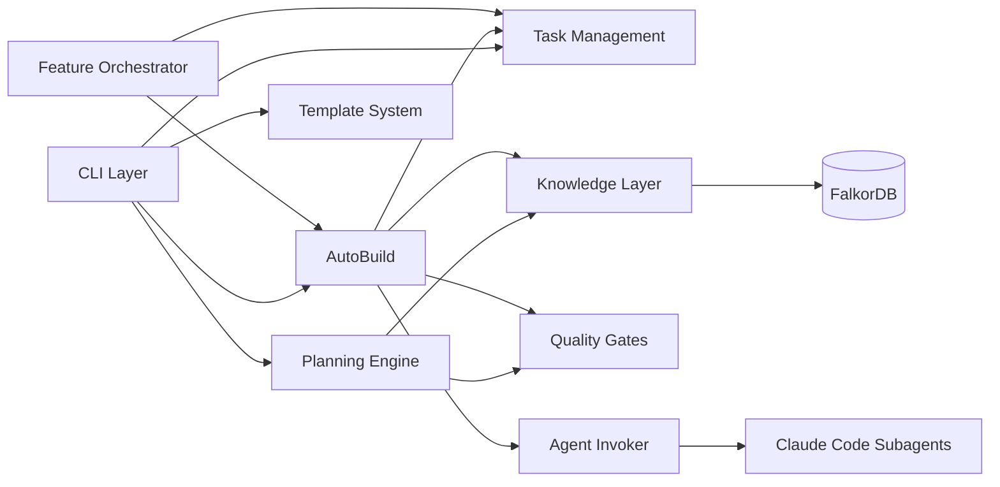

# Components

> **Methodology**: Modular (9 components)

## COMP-cli-layer: CLI Layer

- **Purpose**: Click-based command interface providing all user-facing commands
- **Responsibilities**: Command parsing, argument validation, output formatting, error display
- **Key Entities**: Command, Flag, TaskID, FeatureID
- **Dependencies**: Planning Engine, Task Management, AutoBuild Orchestrator, Knowledge Layer
- **File Paths**: `guardkit/cli/`
- **Commands Exposed**: task (create/work/complete/status/refine), feature (plan/build/complete), system (overview/plan), graphiti (search/capture/seed/add-context), agent (format/validate/enhance), template (create/validate), review, debug

## COMP-planning-engine: Planning Engine

- **Purpose**: Feature decomposition, system planning, impact analysis, context switching
- **Responsibilities**: Feature breakdown into parallelisable task waves, architecture context loading, system overview assembly, impact analysis for pre-task validation
- **Key Entities**: Feature, Task, DependencyGraph, ImplementationGuide, Wave
- **Dependencies**: Knowledge Layer (Graphiti reads), Quality Gates (complexity scoring)
- **File Paths**: `guardkit/planning/`
- **Key Modules**: `system_plan.py` (command orchestration), `system_overview.py` (read-only display), `graphiti_arch.py` (SystemPlanGraphiti read/write), `impact_analysis.py` (change impact), `feature_planner.py` (decomposition)

## COMP-autobuild: AutoBuild Orchestrator

- **Purpose**: Autonomous feature implementation using Player-Coach adversarial cooperation
- **Responsibilities**: Dialectical loop management (max 10 turns), checkpoint/rollback, worktree lifecycle, turn state tracking, Coach approval gating
- **Key Entities**: Turn, PlayerOutput, CoachFeedback, QualityReport, WorktreeState
- **Dependencies**: Agent Invoker, Quality Gates, Knowledge Layer, Task Management
- **File Paths**: `guardkit/orchestrator/autobuild.py`
- **Design Pattern**: Adversarial cooperation -- Player implements, Coach independently validates. Coach approval is the ONLY path to completion. Player self-report is discarded.

## COMP-feature-orchestrator: Feature Orchestrator

- **Purpose**: Parallel wave execution of feature tasks with dependency awareness
- **Responsibilities**: Task DAG construction, wave identification (parallel groups with no file conflicts), asyncio.to_thread() execution, progress tracking
- **Key Entities**: Wave, TaskDAG, ParallelGroup, ExecutionState
- **Dependencies**: AutoBuild Orchestrator (per-task execution), Task Management (dependency resolution)
- **File Paths**: `guardkit/orchestrator/feature_orchestrator.py`

## COMP-quality-gates: Quality Gates

- **Purpose**: Multi-phase validation pipeline ensuring code quality at every stage
- **Responsibilities**: Coach validation prompts, task type detection, zero-test anomaly blocking, complexity scoring, architectural review scoring, plan audit (scope creep detection)
- **Key Entities**: QualityGateProfile, TaskType, ComplexityScore, ArchReviewScore
- **Dependencies**: None (standalone validation logic, consumed by AutoBuild and task-work)
- **File Paths**: `guardkit/quality_gates/`
- **Task Types**: FEATURE, REFACTOR, TESTING, DOCUMENTATION, SCAFFOLDING, INFRASTRUCTURE, INTEGRATION -- each with a QualityGateProfile defining tests_required, zero_test_blocking, coverage thresholds, arch_review thresholds

## COMP-knowledge-layer: Knowledge Layer

- **Purpose**: Graphiti client management, configuration, seeding, and context retrieval
- **Responsibilities**: Per-thread client factory (thread-safe), connection lifecycle, episode CRUD, semantic search, group ID namespacing (project_id prefix), graceful degradation (all ops return None/empty on failure)
- **Key Entities**: GraphitiClient, GraphitiConfig, Episode, GroupID, SearchResult
- **Dependencies**: FalkorDB (external), OpenAI API (embeddings)
- **File Paths**: `guardkit/knowledge/`
- **Key Modules**: `graphiti_client.py` (client wrapper + factory), `config.py` (YAML config loading), `seeding.py` (orchestrator), `seed_*.py` (20+ category-specific seed modules), `add_context_cli.py` (document ingestion)

## COMP-agent-system: Agent System

- **Purpose**: Agent discovery, invocation, and results parsing for Claude Code subagents
- **Responsibilities**: Agent file discovery via frontmatter metadata (stack, phase, keywords), agent selection matching, direct mode and task-work stream parsing, results file writing
- **Key Entities**: AgentFile, AgentMetadata, InvocationResult, StreamParser
- **Dependencies**: CLI Layer (command triggering), Quality Gates (validation injection)
- **File Paths**: `guardkit/orchestrator/agent_invoker.py`

## COMP-task-management: Task Management

- **Purpose**: Task lifecycle management from backlog through completion
- **Responsibilities**: Task creation with hash-based IDs (collision-free), state transitions (BACKLOG -> IN_PROGRESS -> IN_REVIEW -> COMPLETED), frontmatter parsing, task type inference, blocking/unblocking
- **Key Entities**: Task, TaskID, TaskState, TaskType, Frontmatter
- **Dependencies**: None (standalone, consumed by CLI and orchestrators)
- **File Paths**: `guardkit/tasks/`, `tasks/` (directory structure for task files)
- **States**: BACKLOG, DESIGN_APPROVED, IN_PROGRESS, IN_REVIEW, REVIEW_COMPLETE, BLOCKED, COMPLETED

## COMP-template-system: Template System

- **Purpose**: Stack-specific project scaffolding and agent enhancement
- **Responsibilities**: Template creation (guardkit init), template validation, agent format enforcement, agent enhancement (AI-powered with static fallback)
- **Key Entities**: Template, TemplateConfig, AgentFile, BoundarySection
- **Dependencies**: CLI Layer, Knowledge Layer (for AI-powered enhancement)
- **File Paths**: `installer/core/templates/`, `installer/core/agents/`
- **Available Templates**: default, react-typescript, fastapi-python, nextjs-fullstack, react-fastapi-monorepo

## Communication Patterns

## Key Data Flows

1. **Feature Planning**: CLI -> Planning Engine -> Knowledge Layer (reads architecture context) -> Planning Engine (generates waves + tasks) -> Task Management (creates task files)
2. **AutoBuild**: CLI -> Feature Orchestrator -> AutoBuild (per-task) -> Agent Invoker (spawns Player) -> Quality Gates (Coach validates) -> loop until approved or max turns
3. **Knowledge Capture**: AutoBuild outcomes -> Knowledge Layer -> FalkorDB (temporal facts for future context)
4. **Context Injection**: Knowledge Layer (searches Graphiti) -> Planning Engine or AutoBuild Coach (receives token-budgeted context)
