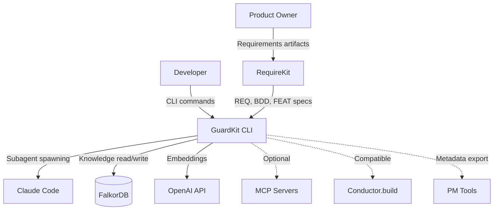
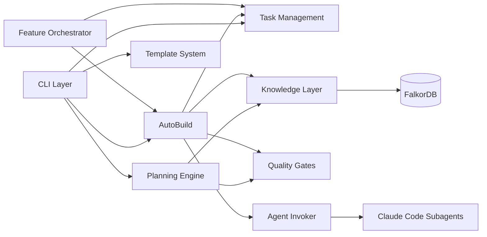

# GuardKit System Architecture Specification

> **Document Type**: System Architecture Spec (input for `/system-plan`)
> **Version**: 1.0
> **Date**: 2026-02-13
> **Status**: Authoritative

---

## 1. System Context

### Identity

- **Name**: GuardKit
- **Purpose**: AI-assisted software development with quality gates that prevents broken code from reaching production
- **Methodology**: Modular (not DDD — GuardKit is a CLI tool, not a domain-rich business system)
- **Deployment Model**: CLI tool installed via pip, with optional Docker services (FalkorDB for knowledge graph, Graphiti for temporal knowledge)
- **Technology Stack**: Python 3.13+ (Click CLI, asyncio, Pydantic v2), Claude Agent SDK, LangGraph

### Actors

| Actor | Role | Interaction Mode |
|-------|------|-----------------|
| **Developer** | Primary user. Plans features, reviews checkpoints, merges work | CLI commands in Claude Code |
| **Product Owner** | Defines requirements via RequireKit, approves feature scope | Markdown artifacts (REQ, BDD, FEAT specs) |
| **Player Agent** | Implementation role in AutoBuild. Writes code, runs tests | Claude Code subagent (spawned by Agent Invoker) |
| **Coach Agent** | Validation role in AutoBuild. Reviews against requirements contract | Claude Code subagent (spawned by Agent Invoker) |
| **AI Agent (General)** | Executes /task-work in standard mode. Plans, implements, tests | Claude Code via interactive commands |

### External Systems

| System | Integration | Purpose |
|--------|-------------|---------|
| **FalkorDB** | Direct (graphiti-core library) | Knowledge graph storage (temporal facts, architecture context) |
| **OpenAI API** | Via Graphiti | text-embedding-3-small for semantic search embeddings |
| **Conductor.build** | Compatible (hash-based task IDs) | Parallel development with Git worktree isolation |
| **PM Tools** | Metadata export (JIRA, Azure DevOps, Linear, GitHub) | Task/feature ID mapping |
| **MCP Servers** | Optional (context7, design-patterns) | Library documentation, pattern recommendations |
| **RequireKit** | One-way artifact flow (RequireKit → GuardKit) | Requirements, BDD scenarios, feature specs |

### System Boundary

---

## 2. Components

### COMP-cli-layer: CLI Layer

- **Purpose**: Click-based command interface providing all user-facing commands
- **Responsibilities**: Command parsing, argument validation, output formatting, error display
- **Key Entities**: Command, Flag, TaskID, FeatureID
- **Dependencies**: Planning Engine, Task Management, AutoBuild Orchestrator, Knowledge Layer
- **File Paths**: `guardkit/cli/`
- **Commands Exposed**: task (create/work/complete/status/refine), feature (plan/build/complete), system (overview/plan), graphiti (search/capture/seed/add-context), agent (format/validate/enhance), template (create/validate), review, debug

### COMP-planning-engine: Planning Engine

- **Purpose**: Feature decomposition, system planning, impact analysis, context switching
- **Responsibilities**: Feature breakdown into parallelisable task waves, architecture context loading, system overview assembly, impact analysis for pre-task validation
- **Key Entities**: Feature, Task, DependencyGraph, ImplementationGuide, Wave
- **Dependencies**: Knowledge Layer (Graphiti reads), Quality Gates (complexity scoring)
- **File Paths**: `guardkit/planning/`
- **Key Modules**: `system_plan.py` (command orchestration), `system_overview.py` (read-only display), `graphiti_arch.py` (SystemPlanGraphiti read/write), `impact_analysis.py` (change impact), `feature_planner.py` (decomposition)

### COMP-autobuild: AutoBuild Orchestrator

- **Purpose**: Autonomous feature implementation using Player-Coach adversarial cooperation
- **Responsibilities**: Dialectical loop management (max 10 turns), checkpoint/rollback, worktree lifecycle, turn state tracking, Coach approval gating
- **Key Entities**: Turn, PlayerOutput, CoachFeedback, QualityReport, WorktreeState
- **Dependencies**: Agent Invoker, Quality Gates, Knowledge Layer, Task Management
- **File Paths**: `guardkit/orchestrator/autobuild.py`
- **Design Pattern**: Adversarial cooperation — Player implements, Coach independently validates. Coach approval is the ONLY path to completion. Player self-report is discarded.

### COMP-feature-orchestrator: Feature Orchestrator

- **Purpose**: Parallel wave execution of feature tasks with dependency awareness
- **Responsibilities**: Task DAG construction, wave identification (parallel groups with no file conflicts), asyncio.to_thread() execution, progress tracking
- **Key Entities**: Wave, TaskDAG, ParallelGroup, ExecutionState
- **Dependencies**: AutoBuild Orchestrator (per-task execution), Task Management (dependency resolution)
- **File Paths**: `guardkit/orchestrator/feature_orchestrator.py`

### COMP-quality-gates: Quality Gates

- **Purpose**: Multi-phase validation pipeline ensuring code quality at every stage
- **Responsibilities**: Coach validation prompts, task type detection, zero-test anomaly blocking, complexity scoring, architectural review scoring, plan audit (scope creep detection)
- **Key Entities**: QualityGateProfile, TaskType, ComplexityScore, ArchReviewScore
- **Dependencies**: None (standalone validation logic, consumed by AutoBuild and task-work)
- **File Paths**: `guardkit/quality_gates/`
- **Task Types**: FEATURE, REFACTOR, TESTING, DOCUMENTATION, SCAFFOLDING, INFRASTRUCTURE, INTEGRATION — each with a QualityGateProfile defining tests_required, zero_test_blocking, coverage thresholds, arch_review thresholds

### COMP-knowledge-layer: Knowledge Layer

- **Purpose**: Graphiti client management, configuration, seeding, and context retrieval
- **Responsibilities**: Per-thread client factory (thread-safe), connection lifecycle, episode CRUD, semantic search, group ID namespacing (project_id prefix), graceful degradation (all ops return None/empty on failure)
- **Key Entities**: GraphitiClient, GraphitiConfig, Episode, GroupID, SearchResult
- **Dependencies**: FalkorDB (external), OpenAI API (embeddings)
- **File Paths**: `guardkit/knowledge/`
- **Key Modules**: `graphiti_client.py` (client wrapper + factory), `config.py` (YAML config loading), `seeding.py` (orchestrator), `seed_*.py` (20+ category-specific seed modules), `add_context_cli.py` (document ingestion)

### COMP-agent-system: Agent System

- **Purpose**: Agent discovery, invocation, and results parsing for Claude Code subagents
- **Responsibilities**: Agent file discovery via frontmatter metadata (stack, phase, keywords), agent selection matching, direct mode and task-work stream parsing, results file writing
- **Key Entities**: AgentFile, AgentMetadata, InvocationResult, StreamParser
- **Dependencies**: CLI Layer (command triggering), Quality Gates (validation injection)
- **File Paths**: `guardkit/orchestrator/agent_invoker.py`

### COMP-task-management: Task Management

- **Purpose**: Task lifecycle management from backlog through completion
- **Responsibilities**: Task creation with hash-based IDs (collision-free), state transitions (BACKLOG → IN_PROGRESS → IN_REVIEW → COMPLETED), frontmatter parsing, task type inference, blocking/unblocking
- **Key Entities**: Task, TaskID, TaskState, TaskType, Frontmatter
- **Dependencies**: None (standalone, consumed by CLI and orchestrators)
- **File Paths**: `guardkit/tasks/`, `tasks/` (directory structure for task files)
- **States**: BACKLOG, DESIGN_APPROVED, IN_PROGRESS, IN_REVIEW, REVIEW_COMPLETE, BLOCKED, COMPLETED

### COMP-template-system: Template System

- **Purpose**: Stack-specific project scaffolding and agent enhancement
- **Responsibilities**: Template creation (guardkit init), template validation, agent format enforcement, agent enhancement (AI-powered with static fallback)
- **Key Entities**: Template, TemplateConfig, AgentFile, BoundarySection
- **Dependencies**: CLI Layer, Knowledge Layer (for AI-powered enhancement)
- **File Paths**: `installer/core/templates/`, `installer/core/agents/`
- **Available Templates**: default, react-typescript, fastapi-python, nextjs-fullstack, react-fastapi-monorepo

---

## 3. Communication Patterns

### Component Interactions

### Key Data Flows

1. **Feature Planning Flow**: CLI → Planning Engine → Knowledge Layer (reads architecture context) → Planning Engine (generates waves + tasks) → Task Management (creates task files)
2. **AutoBuild Flow**: CLI → Feature Orchestrator → AutoBuild (per-task) → Agent Invoker (spawns Player) → Quality Gates (Coach validates) → loop until approved or max turns
3. **Knowledge Capture Flow**: AutoBuild outcomes → Knowledge Layer → FalkorDB (temporal facts for future context)
4. **Context Injection Flow**: Knowledge Layer (searches Graphiti) → Planning Engine or AutoBuild Coach (receives token-budgeted context)

---

## 4. Cross-Cutting Concerns

### XC-error-handling: Error Handling & Graceful Degradation

- **Approach**: 3-layer degradation pattern for all Graphiti operations — try operation, catch exception, return None/empty list (never crash). All knowledge-dependent features work without Graphiti by falling back to training knowledge.
- **Affected Components**: Knowledge Layer, Planning Engine, AutoBuild, CLI Layer
- **Constraints**: No Graphiti operation may raise an exception to the caller. All returns must be Optional or have empty defaults. Connection failures during init are logged as warnings, not errors.

### XC-thread-safety: Thread Safety

- **Approach**: Per-thread Graphiti clients via GraphitiClientFactory. Each thread gets its own client instance to avoid shared connection state. Factory maintains thread-local storage.
- **Affected Components**: Knowledge Layer, Feature Orchestrator (parallel wave execution)
- **Constraints**: Never share a GraphitiClient across threads. Always use get_graphiti() which returns the thread-local instance. macOS FD soft limit raised to 4096 for parallel task execution.

### XC-logging: Structured Logging

- **Approach**: Module-prefixed log messages using `[Graphiti]`, `[AutoBuild]`, `[QualityGate]`, `[Planning]` prefixes for easy grep/filtering. Python logging module with configurable levels.
- **Affected Components**: All
- **Constraints**: Never log sensitive data (API keys, credentials). Always log at WARNING for degradation events, INFO for normal operations, DEBUG for verbose output.

### XC-token-budgeting: Token Budgeting & Progressive Disclosure

- **Approach**: Progressive disclosure via core/ext file splits — agents have a core file (always loaded) and ext file (loaded on demand). Context injection has per-category token budgets: Feature Context 15%, Similar Outcomes 25%, Relevant Patterns 20%, Architecture Context 20%, Warnings 15%, Domain Knowledge 5%.
- **Affected Components**: Planning Engine, AutoBuild (Coach context injection), Agent System
- **Constraints**: Coach context total ~4000 tokens. System overview condensed to 800 tokens for injection. /feature-plan context capped at 600 tokens.

### XC-test-enforcement: Test Enforcement

- **Approach**: Zero-test anomaly detection blocks completion when a task claims done but has zero tests. Auto-fix loop attempts up to 3 test repairs before blocking. 100% test pass rate required — no partial passes accepted.
- **Affected Components**: Quality Gates, AutoBuild, task-work command
- **Constraints**: Tasks of type DOCUMENTATION and SCAFFOLDING are exempt from test requirements. All other types require tests.

### XC-backward-compat: Backward Compatibility

- **Approach**: All Graphiti-dependent features degrade gracefully when Graphiti is unavailable. Projects that haven't been seeded or haven't run /system-plan work identically to pre-Graphiti GuardKit. New entity types (role_constraints, quality_gate_configs) have hardcoded fallback defaults.
- **Affected Components**: All (especially Knowledge Layer, Planning Engine)
- **Constraints**: Never require Graphiti for basic task workflow. Never require /system-plan before /feature-plan. Always provide hardcoded defaults for missing knowledge.

### XC-httpx-cleanup: httpx Connection Cleanup

- **Approach**: Custom exception handler suppresses closed-loop errors from httpx when FalkorDB connections are torn down. Prevents noisy stack traces on normal shutdown.
- **Affected Components**: Knowledge Layer
- **Constraints**: Only suppress known httpx closed-transport errors. Log unexpected exceptions normally.

---

## 5. Architecture Decisions

### ADR-SP-001: FalkorDB over Neo4j for Knowledge Graph

- **Date**: 2026-01
- **Status**: Accepted
- **Context**: Neo4j required 5GB+ Docker image, complex licensing, and heavy resource usage. FalkorDB is a lightweight Redis-compatible graph database.
- **Decision**: Migrate from Neo4j to FalkorDB for all Graphiti knowledge graph operations.
- **Consequences**: +Smaller footprint (~500MB), +Redis-compatible (familiar ops), +Runs on Synology NAS, -Less mature ecosystem, -Required upstream workaround for single group_id search bug (two-layer monkey-patch)

### ADR-SP-002: Client-Level Metadata Injection

- **Date**: 2026-02
- **Status**: Accepted (ADR-GBF-001)
- **Context**: Entity classes were embedding _metadata in to_episode_body(), creating coupling between domain logic and serialization.
- **Decision**: Unify metadata injection at GraphitiClient._inject_metadata() level. Entity classes return domain data only from to_episode_body(). Client injects _metadata block automatically.
- **Consequences**: +Clean separation of concerns, +Consistent metadata across all entity types, +Entities are pure domain objects, -One more layer of indirection

### ADR-SP-003: Adversarial Cooperation over Single-Agent

- **Date**: 2026-01
- **Status**: Accepted
- **Context**: Single-agent approaches (Ralph loops) work for mechanical tasks but fail at integration seams and subjective completion criteria. Block AI research showed g3's adversarial dyad achieved 5/5 completeness vs 2-4.5/5 for single agents. Ablation study: removing Coach feedback made output non-functional.
- **Decision**: Use Player-Coach adversarial cooperation pattern for AutoBuild. Player implements, Coach independently validates against requirements contract. Player self-report of success is discarded.
- **Consequences**: +Higher completion rates for complex tasks, +Independent validation prevents silent failures, +Fresh context per turn, -Higher token cost (~2x), -Not needed for simple tasks (addressed by intensity gradient)

### ADR-SP-004: Progressive Disclosure for Token Optimization

- **Date**: 2025-11
- **Status**: Accepted
- **Context**: Loading all agent context and knowledge into every prompt wastes tokens and dilutes relevance. Context windows have practical limits even when technically large.
- **Decision**: Implement progressive disclosure: core/ext file splits for agents, frontmatter-based agent selection, token budgets per context category, job-specific context assembly.
- **Consequences**: +Dramatically reduced token usage, +More relevant context per prompt, +Agents only loaded when matched, -Requires careful budget tuning, -ext files may be stale if not maintained

### ADR-SP-005: AI-First Agent Enhancement with Static Fallback

- **Date**: 2025-11
- **Status**: Accepted
- **Context**: Agent files need stack-specific examples and boundary sections. Pure static generation creates generic content. Pure AI generation can fail.
- **Decision**: AI-first enhancement with static fallback. Hybrid mode: try AI enhancement, fall back to static (creates "Related Templates" section only) if AI fails. Never-fails guarantee.
- **Consequences**: +9/10 quality when AI succeeds, +100% reliability via fallback, +Template-specific examples, -2-5 minute duration (vs instant for static), -Requires OpenAI/Anthropic API access

### ADR-SP-006: Adaptive Ceremony via Complexity Scoring

- **Date**: 2026-01
- **Status**: Accepted
- **Context**: Full workflow (all phases) is overkill for simple tasks. No workflow is dangerous for complex tasks. "Your Agent Orchestrator Is Too Clever" critique applies to fixed-intensity approaches.
- **Decision**: Complexity scoring (1-10) gates workflow intensity. Simple tasks (1-3) auto-proceed through most phases. Complex tasks (7-10) get full architectural review, mandatory checkpoints, strict plan auditing. Adversarial intensity scales accordingly: minimal (tests only), standard-light, standard, strict (full requirements + architecture + integration review).
- **Consequences**: +Right-sized process for each task, +--micro flag for trivial tasks, +Addresses Ralph Wiggum critique, -Requires accurate complexity scoring (currently manual/AI-assessed)

### ADR-SP-007: Markdown Authoritative, Graphiti Queryable

- **Date**: 2026-01
- **Status**: Accepted
- **Context**: Architecture knowledge needs to be both human-readable and machine-queryable. Duplicating content creates drift.
- **Decision**: Markdown files in docs/ are the authoritative source of truth. Graphiti stores semantic facts extracted from those documents, providing queryability. Never duplicate — if it's authoritative in markdown, Graphiti provides a reference/summary, not the full content.
- **Consequences**: +Single source of truth, +Human-editable architecture docs, +Machine-queryable context, -Requires re-ingestion when markdown changes, -Graphiti facts may lag behind markdown edits

### ADR-SP-008: Hash-Based Task IDs

- **Date**: 2025-10
- **Status**: Accepted
- **Context**: Sequential task IDs (TASK-001, TASK-002) create collisions in parallel development workflows, especially with Conductor.build's Git worktree isolation.
- **Decision**: Use hash-based task IDs: TASK-{4-char-hash} or TASK-{prefix}-{4-char-hash} (e.g., TASK-FIX-a3f8). Hash derived from task description for deterministic IDs.
- **Consequences**: +Zero collisions in parallel workflows, +Conductor.build compatible, +Safe concurrent creation, -Less human-readable than sequential, -Requires hash collision detection (extremely rare with 4 chars + prefix)

---

## 6. Quality Gate Pipeline

The full quality gate pipeline phases, in execution order:

| Phase | Name | Gate | Complexity Gating |
|-------|------|------|-------------------|
| 1.6 | Clarifying Questions | Understanding validation | Skip at complexity 1-2 |
| 2 | Implementation Planning | Plan must exist (markdown) | Always |
| 2.5 | Architectural Review | SOLID/DRY/YAGNI score ≥60/100 | Skip at complexity 1-2 |
| 2.7 | Complexity Evaluation | Routes to approval level | Always |
| 2.8 | Human Checkpoint | Design approval | Required at 7-10, optional at 4-6, skip at 1-3 |
| 3 | Implementation | Code written | Always |
| 4 | Testing | Compilation + test execution | Always |
| 4.5 | Test Enforcement | 100% pass, ≥80% line coverage, ≥75% branch | Auto-fix ×3 then block |
| 5 | Code Review | Requirements met, no regressions | Always |
| 5.5 | Plan Audit | Scope variance detection | Flag at >20% variance, block at >50% |

### Adversarial Intensity Gradient

| Complexity | Intensity Level | Coach Validation | Max Turns | Checkpoint |
|-----------|----------------|-----------------|-----------|------------|
| 1-2 | Minimal (--micro) | Tests pass only | 3 | Auto-proceed |
| 3-4 | Standard-Light | Requirements met | 5 | Quick (10s timeout) |
| 5-6 | Standard | Requirements + tests | 7 | Quick |
| 7-10 | Strict | Full (requirements + architecture + integration) | 10 | Mandatory |

---

## 7. Failure Patterns & Lessons Learned

From TASK-REV-1505 (Graphiti Refinement architectural review) and TASK-REV-7549 (AutoBuild lessons):

### FP-001: Death by a Thousand Bug Fixes

- **Pattern**: Incremental patching of AI-first designs degrades them into rigid, script-driven approaches
- **Prevention**: When quality degrades, stop patching. Revert to clean AI-first approach. Forensic analysis before fix.
- **Example**: template-create command's AI-driven analysis was incrementally replaced with hard-coded pattern matching through successive bug fixes

### FP-002: Player Self-Report Unreliability

- **Pattern**: Player agent claims task is complete but Coach finds gaps. In g3 ablation study, removing Coach made output non-functional despite Player claiming success.
- **Prevention**: Always use independent Coach validation. Never trust player self-report of success. Coach runs its own test execution.

### FP-003: Context Loss Across Sessions

- **Pattern**: Knowledge from one Claude Code session is unavailable in the next. Developer must re-explain context.
- **Prevention**: Graphiti job-specific retrieval (GR-006). Knowledge capture at task completion. System overview provides "North Star" context.

### FP-004: Rabbit Hole Divergence

- **Pattern**: Without structured checkpoints, conversations go down rabbit holes. Tasks aren't implemented completely.
- **Prevention**: Quality gates force structured progression. Plan audit at Phase 5.5 detects scope drift. /task-refine for mid-implementation course correction.

### FP-005: Scope Creep in Implementation

- **Pattern**: Player adds unrequested features, especially when encountering related code.
- **Prevention**: Plan audit detects variance >20%. Coach validates against requirements contract only. "NEVER implement features not explicitly specified" rule.

### FP-006: Zero-Test Anomaly

- **Pattern**: Task claims completion with no tests written. Especially common with DOCUMENTATION and SCAFFOLDING tasks where tests seem optional.
- **Prevention**: Zero-test anomaly detection in quality gates. Task type determines whether tests are required. DOCUMENTATION/SCAFFOLDING exempt; all others blocked.

---

## 8. Integrations

### RequireKit Integration

- **Direction**: One-way (RequireKit → GuardKit)
- **Artifacts**: REQ-*.md (EARS notation), BDD-*.feature (Gherkin), FEAT-*.md (feature specs), EPIC-*.md
- **Key Principle**: GuardKit never calls RequireKit commands. Data flows through markdown artifacts only.
- **Traceability**: REQ → BDD → FEAT → TASK → Code → Quality Gates → Verified Implementation

### Conductor.build Compatibility

- **Mode**: Passive compatibility (not active integration)
- **Features**: Hash-based task IDs prevent duplicates, Git worktree isolation for parallel execution, PM tool mapping for sequential IDs
- **Usage**: `/feature-build` creates worktrees in `.guardkit/worktrees/FEAT-XXX/`

### MCP Server Integration

- **context7**: Library documentation retrieval (resolves library ID → fetches docs → context injection)
- **design-patterns**: Pattern recommendations (optional, tied to complexity/task type)
- **Principle**: All MCPs optional. Falls back gracefully to training data. MCP failures logged as warnings, never block execution.

---

## 9. Current Development Context

### Active Branch: graphiti-falkorDB-migration

Migration tasks FKDB-001 through FKDB-008 (most complete). Key technical challenges:
- Upstream FalkorDB decorator bug requiring two-layer monkey-patch workaround
- Single group_id search returning empty results (workaround in `falkordb_workaround.py`)
- macOS FD limit exhaustion during parallel graph operations

### Infrastructure

| Machine | Role | Specs |
|---------|------|-------|
| MacBook Pro M2 Max | Primary development, inference | 96GB RAM |
| Dell ProMax GB10 | Fine-tuning, training workflows | 128GB unified (Grace Blackwell) |
| Synology DS918+ NAS | FalkorDB, shared services | 8GB RAM, 12TB storage |

### Remaining Work to Public Release

Approximately 13-15 days across 20 tasks. Key milestones: complete FalkorDB migration, implement /system-plan command (FEAT-SP-001), populate architecture knowledge, prepare guardkit.ai documentation.
