# Parallel Implementation Guide: Open Source Release Prep

**Goal**: Prepare GuardKit for open source release (target: early next week)

**Strategy**: Use Conductor.build git worktrees for parallel development

**Duration**: 4-6 hours total (with parallel execution: 3-4 hours)

---

## Phase 1: Critical Fixes (Sequential - 30 minutes)

**Why Sequential**: These touch the same file and should be done in order.

### Worktree A: Main Branch
```bash
# Stay in main branch - these are quick sequential fixes
cd /Users/richardwoollcott/Projects/appmilla_github/guardkit
```

**Task 1.1**: TASK-FIX-9E1A (Task ID uniqueness fix)
- **File**: `installer/global/commands/lib/template_create_orchestrator.py` (line 963)
- **Duration**: 30 minutes
- **Priority**: CRITICAL (prevents task file overwrites)
- **Dependencies**: None
- **Blocker**: Yes - must fix before release

**Task 1.2**: Archive TASK-REV-3248 (Review modes - already complete)
- **Action**: Move to tasks/completed/
- **Duration**: 2 minutes
- **Dependencies**: None

**Total Phase 1**: 30 minutes

---

## Phase 2: Parallel Documentation (3 worktrees - 2-3 hours)

**Why Parallel**: All documentation tasks are independent, touch different files, can run concurrently.

### Setup Worktrees

```bash
cd /Users/richardwoollcott/Projects/appmilla_github/guardkit

# Create 3 parallel worktrees
conductor worktree create docs-user-guide
conductor worktree create docs-hash-ids
conductor worktree create docs-phase-8
```

### Worktree A: User Documentation (2-3 hours)
**Branch**: `docs-user-guide`

**Tasks**:
1. **TASK-OPEN-SOURCE-DOCUMENTATION** (2-3 hours) - User guide
   - Create: `docs/guides/template-creation-guide.md`
   - Create: `docs/architecture/template-create-architecture.md`
   - Create: `docs/troubleshooting/template-create-troubleshooting.md`
   - Update: `CLAUDE.md` (template-create section)
   - Update: `README.md` (features list)

**Files Modified**:
- `docs/guides/template-creation-guide.md` (NEW)
- `docs/architecture/template-create-architecture.md` (NEW)
- `docs/troubleshooting/template-create-troubleshooting.md` (NEW)
- `CLAUDE.md` (template-create section)
- `README.md` (features)

**Commands**:
```bash
cd docs-user-guide
/task-work TASK-OPEN-SOURCE-DOCUMENTATION
```

---

### Worktree B: Hash ID Documentation (1-2 hours)
**Branch**: `docs-hash-ids`

**Tasks**:
1. **TASK-D01D-update-documentation** (1-2 hours) - Hash ID docs
   - Update: `CLAUDE.md` (hash ID format, benefits, examples)
   - Update: `installer/global/commands/task-create.md` (hash ID examples)
   - Update: All workflow guides with hash ID examples
   - Update: Quick reference with new ID format
   - Add: FAQ section for hash IDs
   - Add: Prefix usage guide

**Files Modified**:
- `CLAUDE.md` (task ID format section)
- `installer/global/commands/task-create.md`
- `docs/guides/guardkit-workflow.md`
- `docs/guides/quick-reference.md`

**Commands**:
```bash
cd docs-hash-ids
/task-work TASK-D01D-update-documentation
```

---

### Worktree C: Phase 8 Documentation (1.5-2 hours)
**Branch**: `docs-phase-8`

**Tasks**:
1. **TASK-DOC-9C4E-update-claude-md-phase-8** (1 hour)
   - Update: `CLAUDE.md` (/agent-enhance command)
   - Add: Incremental enhancement workflow section
   - Add: Enhancement strategies section
   - Add: Best practices

2. **TASK-DOC-1E7B-incremental-enhancement-workflow-guide** (1-1.5 hours)
   - Create: `docs/workflows/incremental-enhancement-workflow.md`
   - Comprehensive guide for agent enhancement

**Files Modified**:
- `CLAUDE.md` (Phase 8 sections)
- `docs/workflows/incremental-enhancement-workflow.md` (NEW)

**Commands**:
```bash
cd docs-phase-8
/task-work TASK-DOC-9C4E-update-claude-md-phase-8
/task-work TASK-DOC-1E7B-incremental-enhancement-workflow-guide
```

---

## Merge Strategy (Sequential - 30 minutes)

**Order matters** due to CLAUDE.md conflicts. Merge smallest changes first:

### Step 1: Merge Worktree B (Hash IDs) - First
```bash
cd /Users/richardwoollcott/Projects/appmilla_github/guardkit
git checkout main
git merge docs-hash-ids --no-ff -m "docs: Update documentation for hash-based IDs"
```

**Why First**: Cleanest changes, updates Task ID section only.

---

### Step 2: Merge Worktree C (Phase 8) - Second
```bash
git merge docs-phase-8 --no-ff -m "docs: Add Phase 8 incremental enhancement documentation"
```

**Why Second**: Adds new sections to CLAUDE.md, minimal conflict with hash ID changes.

**Potential Conflict**: CLAUDE.md if both modified same sections
**Resolution**: Accept both changes (hash IDs + Phase 8 sections are independent)

---

### Step 3: Merge Worktree A (User Guide) - Last
```bash
git merge docs-user-guide --no-ff -m "docs: Add user guide for open source release"
```

**Why Last**: Largest changes, updates multiple sections of CLAUDE.md and README.md.

**Potential Conflicts**:
- CLAUDE.md (template-create section, features list)
- README.md (features, quick start)

**Resolution Strategy**:
1. Keep all new sections from all worktrees
2. CLAUDE.md structure: Hash IDs → Phase 8 → Template Creation
3. README.md: Combine features from all branches

---

## Phase 3: Post-Release Tasks (Can wait)

These are **NOT blockers** for open source release:

### Future Work (After Release)
1. **TASK-FIX-7C3D** (1 hour) - File I/O error handling
   - Low priority, graceful degradation
   - Can be addressed in v1.1

2. **GitHub Pages Setup** (6 tasks, 8-10 hours total)
   - TASK-061A: Enable GitHub Pages
   - TASK-B479: Create landing pages
   - TASK-C5AC: MkDocs configuration
   - TASK-DFFA: GitHub Actions workflow
   - TASK-063: Update documentation for 4 templates
   - TASK-957C: Audit documentation structure
   - **Recommendation**: Do after initial release, as separate initiative

---

## Execution Timeline

### Option A: Solo Development (Sequential)
```
Day 1:
├─ 09:00-09:30: Phase 1 (Critical fixes) - 30 min
├─ 09:30-12:00: User guide - 2.5 hours
├─ 13:00-14:30: Hash ID docs - 1.5 hours
└─ 14:30-16:30: Phase 8 docs - 2 hours

Day 2:
└─ 09:00-10:00: Merge all branches, resolve conflicts, test - 1 hour

Total: ~8 hours
```

### Option B: With Conductor.build (Parallel) ⚡
```
Day 1:
├─ 09:00-09:30: Phase 1 (Critical fixes) - 30 min
└─ 09:30-12:00: PARALLEL EXECUTION (3 worktrees)
    ├─ Worktree A: User guide (2.5 hours)
    ├─ Worktree B: Hash ID docs (1.5 hours) ✓ Done first
    └─ Worktree C: Phase 8 docs (2 hours) ✓ Done second

├─ 12:00-12:30: Sequential merge (Worktree B → C → A) - 30 min
└─ 12:30-13:00: Test, final review - 30 min

Total: ~4 hours (50% faster)
```

### Option C: AI Swarm (3 Claude Code instances) 🚀
```
Day 1:
├─ 09:00-09:30: Phase 1 (Critical fixes) - 30 min
└─ 09:30-12:00: PARALLEL EXECUTION (3 AI agents)
    ├─ Agent 1 (Worktree A): User guide - 2.5 hours
    ├─ Agent 2 (Worktree B): Hash ID docs - 1.5 hours
    └─ Agent 3 (Worktree C): Phase 8 docs - 2 hours

├─ 12:00-12:30: Human-driven merge - 30 min
└─ 12:30-13:00: Human review & polish - 30 min

Total: ~3.5 hours (57% faster than solo)
```

---

## Dependency Graph

```mermaid
graph TD
    A[Phase 1: Critical Fixes<br/>30 min - Sequential] --> B[Phase 2: Parallel Docs]

    B --> C[Worktree A: User Guide<br/>2-3 hours]
    B --> D[Worktree B: Hash IDs<br/>1-2 hours]
    B --> E[Worktree C: Phase 8<br/>1.5-2 hours]

    D --> F[Merge B: Hash IDs - First]
    E --> G[Merge C: Phase 8 - Second]
    C --> H[Merge A: User Guide - Last]

    F --> G
    G --> H

    H --> I[Open Source Release ✅]

    I -.-> J[Phase 3: Post-Release<br/>GitHub Pages, etc.]

    style A fill:#ff6b6b
    style C fill:#4ecdc4
    style D fill:#4ecdc4
    style E fill:#4ecdc4
    style I fill:#95e1d3
```



**Legend**:
- 🔴 Red: Sequential (blocking)
- 🔵 Cyan: Parallel (independent)
- 🟢 Green: Milestone

---

## File Change Summary (Conflict Analysis)

### High Conflict Risk (Same File, Different Sections)
| File | Worktree A | Worktree B | Worktree C | Strategy |
|------|-----------|-----------|-----------|----------|
| `CLAUDE.md` | Template section | Task ID section | Phase 8 section | Merge B→C→A (independent sections) |
| `README.md` | Features list | No changes | No changes | No conflict |

### No Conflict (Different Files)
| File | Owner | Safe to Merge |
|------|-------|---------------|
| `docs/guides/template-creation-guide.md` | Worktree A | ✅ |
| `docs/architecture/template-create-architecture.md` | Worktree A | ✅ |
| `docs/troubleshooting/template-create-troubleshooting.md` | Worktree A | ✅ |
| `docs/workflows/incremental-enhancement-workflow.md` | Worktree C | ✅ |
| `installer/global/commands/task-create.md` | Worktree B | ✅ |
| `docs/guides/guardkit-workflow.md` | Worktree B | ✅ |
| `docs/guides/quick-reference.md` | Worktree B | ✅ |

### Conflict Resolution: CLAUDE.md

**Structure After All Merges**:
```markdown
# CLAUDE.md

## GuardKit - Lightweight AI-Assisted Development
...

## Task ID Format (NEW - from Worktree B)
- Hash-based IDs: TASK-a3f8
- Benefits: Zero duplicates, concurrent creation safe
...

## Essential Commands (UPDATED - from Worktree C)
- /agent-enhance command documented
...

## Template Creation (NEW/UPDATED - from Worktree A)
- /template-create workflow
- User guide
...

## Incremental Agent Enhancement (NEW - from Worktree C)
- Phase 8 workflow
- Enhancement strategies
...
```

**Merge Commands**:
```bash
# If conflicts in CLAUDE.md during merge
git checkout --ours CLAUDE.md    # Keep our version
git checkout --theirs CLAUDE.md  # Or keep their version
# OR manually merge sections (recommended)
code CLAUDE.md  # Open in editor, combine all sections
git add CLAUDE.md
git merge --continue
```

---

## Task Checklist

### Pre-Execution
- [ ] Ensure git working directory is clean
- [ ] Create backup branch: `git branch backup-pre-release`
- [ ] Verify Conductor.build installed: `conductor --version`

### Phase 1: Critical Fixes (Main Branch)
- [ ] Fix TASK-FIX-9E1A (task ID uniqueness)
- [ ] Test fix: Create multiple agent tasks, verify unique IDs
- [ ] Commit: `git commit -m "fix: Use UUID for task ID uniqueness"`
- [ ] Archive TASK-REV-3248 to completed

### Phase 2: Setup Worktrees
- [ ] Create worktree A: `conductor worktree create docs-user-guide`
- [ ] Create worktree B: `conductor worktree create docs-hash-ids`
- [ ] Create worktree C: `conductor worktree create docs-phase-8`

### Phase 2: Parallel Execution
- [ ] **Terminal 1**: Work on user guide (Worktree A)
- [ ] **Terminal 2**: Work on hash ID docs (Worktree B)
- [ ] **Terminal 3**: Work on Phase 8 docs (Worktree C)

### Phase 2: Merge
- [ ] Merge Worktree B (hash IDs) - smallest changes
- [ ] Resolve any conflicts
- [ ] Test: Verify CLAUDE.md renders correctly
- [ ] Merge Worktree C (Phase 8)
- [ ] Resolve any conflicts
- [ ] Test: Verify CLAUDE.md has both sections
- [ ] Merge Worktree A (user guide)
- [ ] Resolve any conflicts (CLAUDE.md, README.md)
- [ ] Test: Full documentation review

### Final Verification
- [ ] All new files created and committed
- [ ] CLAUDE.md has all sections (hash IDs, Phase 8, template guide)
- [ ] README.md updated with features
- [ ] No broken internal links
- [ ] Markdown renders correctly on GitHub
- [ ] Spell check completed

### Cleanup
- [ ] Delete worktrees: `conductor worktree delete docs-user-guide`
- [ ] Delete worktrees: `conductor worktree delete docs-hash-ids`
- [ ] Delete worktrees: `conductor worktree delete docs-phase-8`
- [ ] Tag release: `git tag v1.0.0-rc1`

---

## Recommended Approach

**For Solo Developer**: Option B (Conductor.build with 3 worktrees)
- 50% faster than sequential
- Can switch between tasks as needed
- Clean merge strategy
- Total time: ~4 hours

**For Team**: Option C (AI Swarm with 3 Claude Code instances)
- 57% faster than solo
- Requires coordination for merge
- Total time: ~3.5 hours

**For This Week**: **Option B recommended**
- Start Monday morning
- Phase 1: 30 min (critical fixes)
- Phase 2: 2.5 hours (parallel docs)
- Merge: 30 min
- Review: 30 min
- **Total: 4 hours, done by Monday lunch**

---

## Risk Mitigation

### Risk 1: CLAUDE.md Merge Conflicts
**Likelihood**: HIGH (3 worktrees modify it)
**Impact**: MEDIUM (can manually resolve)
**Mitigation**:
- Merge in order (B→C→A)
- Each worktree edits different sections
- Keep backup: `git branch backup-pre-merge`

### Risk 2: Task Takes Longer Than Expected
**Likelihood**: MEDIUM
**Impact**: LOW (extends timeline)
**Mitigation**:
- Focus on must-haves first (critical fixes, user guide)
- Phase 8 docs can be minimal (just workflow guide)
- GitHub Pages setup can wait until after release

### Risk 3: Breaking Changes During Development
**Likelihood**: LOW (only docs changes)
**Impact**: HIGH (delays release)
**Mitigation**:
- No code changes in documentation branches
- Test CLAUDE.md rendering after each merge
- Keep system functional throughout

---

## Success Criteria

**Open Source Release Ready**:
- ✅ No task ID collision risk (TASK-FIX-9E1A fixed)
- ✅ User guide exists (template creation, quick start)
- ✅ CLAUDE.md documents hash IDs clearly
- ✅ CLAUDE.md documents Phase 8 workflow
- ✅ README.md has compelling feature list
- ✅ All documentation renders correctly on GitHub
- ✅ No references to internal/private tools

**Nice-to-Have (Post-Release)**:
- GitHub Pages with MkDocs
- Comprehensive troubleshooting guide
- Video walkthroughs
- Community contribution guide

---

**Ready to start?** The parallel approach saves 4 hours and gets you to release by Monday afternoon! 🚀
