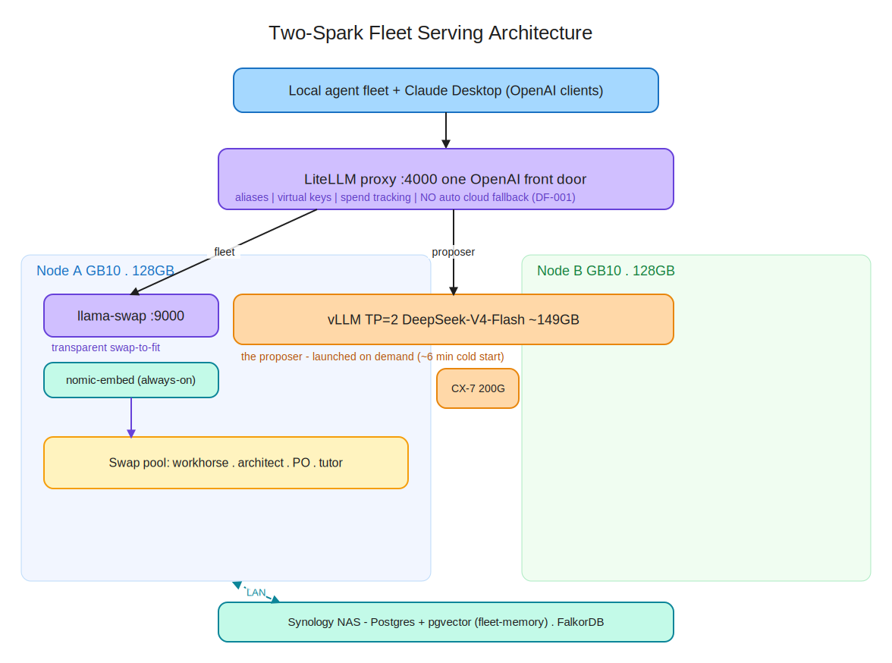
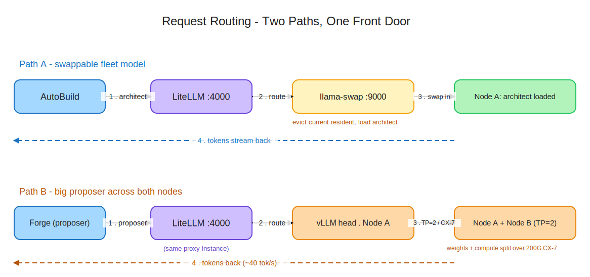

# DECISION-DF-004 — Two-Spark Serving Topology: Unified Front Door Over a Stacked GB10 Pair

**Status:** PROPOSED — preferred direction; challenge only with new evidence (the throughput figures below are community numbers, to be re-confirmed on our own hardware once the cable lands). Stays PROPOSED until `dgx-spark/RUNBOOK-two-spark-bring-up.md` Phase 9 (TP=2 vs single-node vs **PP=2**) runs on our hardware. **Corrected 2026-06-22** against the official NVIDIA `connect-two-sparks` + `nccl` playbooks (see §4.1) — the executable, gated bring-up is now `dgx-spark/RUNBOOK-two-spark-bring-up.md`.
**Date:** 2026-06-18
**Author:** Rich (pair-programmed with Claude in Claude Desktop)
**Scope:** The physical and serving topology of the dark-factory inference layer once a second GB10 joins the fleet over a ConnectX-7 link — how the two nodes are organised to serve both the swappable specialist fleet and models too large for one node, behind a single OpenAI-compatible endpoint.
**Companions:** DECISION-DF-001 (governs the unattended critical path; this decision *implements its §6.4 "Peer federation" revisit* and *supersedes its §2.2 single-node diagram*) · DECISION-DF-003 (attended-frontier-planning / local-unattended-build boundary — unchanged; this decision serves the local half and does not move planning local) · fleet-memory phase-CORE (retires the always-on `qwen-graphiti` extraction model that DF-001 §2.2 still depicts)
**Related:** `docs/research/dgx-spark/two-spark-serving-research-and-references.md` (annotated research + links) · `docs/research/dgx-spark/dark-factory-economics-and-model-serving.md` (single-node baseline) · `docs/research/dgx-spark/llama-swap-config.yaml` · `forge/docs/research/ideas/fleet-master-index.md` (Proposer / Player seats)

---

## Summary

**A second GB10, linked to the first over a 200G ConnectX-7 cable, is organised as one logical inference fabric behind a single OpenAI-compatible front door (LiteLLM on :4000). Node A carries the always-resident swap pool (llama-swap) plus the nomic embedder; the swappable specialist fleet runs there exactly as today. A model too large for one node — the meta-harness Proposer seat, DeepSeek-V4-Flash class, ~149GB — runs with tensor parallelism across both nodes (vLLM `--tp 2`), and only while it is deliberately launched. The two cannot fully co-reside; memory is budgeted per session, not per pipeline. DF-001's no-cloud-fallback guard is carried onto the LiteLLM layer.**

The correction this decision encodes for everyone who buys a second Spark expecting it to go faster: **stacking two Sparks buys capacity and parallelism, not single-stream speed.** A model that already fits on one node is faster on one node; the second node earns its place by running models that do not fit, and by running different models in parallel.

## 1. Context

### 1.1 How the question arose

DF-001 §6.4 explicitly left this open: *"Peer federation — if a second machine joins the fleet (second GB10, Mac Studio), enable llama-swap peers so agents see a unified model list across nodes."* The second GB10 is now on the desk and a 200G QSFP56 ConnectX-7 cable arrives mid-week. This decision resolves that pre-registered open item rather than opening a new front.

Two changes since DF-001 reshape the answer:

- **fleet-memory retired the always-on extraction model.** DF-001 §2.2 pins `qwen-graphiti` (~28GB) permanently resident in the `forever` group. fleet-memory replaces Graphiti with a typed deterministic store (zero-LLM structured writes; chunk+embed for the unstructured slice), removing that tenant. The embedder stays (now standardised on **Qwen3-Embedding-0.6B**, 1024-dim — matching the single-Spark public config; see §2.1). The acute VRAM co-existence pressure that made swap-to-fit load-bearing on a single node is largely gone — which *widens* the design space rather than narrowing it.
- **A large-local Proposer seat is now realistic.** The meta-harness outer loop wants a frontier-class *local* model — distinct from DF-003's attended planning, which stays on frontier Claude. DeepSeek-V4-Flash (~149GB FP8) is the realistic candidate, and it does not fit on one 128GB node.

### 1.2 What the field is doing (and the honest gap)

A focused survey (full annotated set in the references doc) shows two well-trodden but *separate* patterns:

- **Single-node multi-model fleet.** LiteLLM + llama-swap + vLLM/llama.cpp/Ollama, 10+ models swapped behind one endpoint. This is a real, production-shaped, well-documented pattern — but it is essentially one lineage (martinB78's reference repo, amplified by the Dre Dyson blog series and dasroot), and it is strictly swap-to-fit on a single GB10 ("a 120B and a 4B on the same hardware — just not at the same time").
- **Two-node single-model TP.** NVIDIA's own playbooks, the forum recipe threads (DeepSeek-V4-Flash, MiniMax M3, the 397B MoEs), Sparkrun's multi-node tutorial, and several build logs — all run *one* large model split across the boxes for capacity.

The intersection — a swappable pool *and* a TP model coexisting across two nodes behind one front door, with the memory budgeting between them — did not surface in the survey. That union, plus the agentic framing (Proposer / Player seats, fleet-memory), is the differentiated part. **Caveat: "did not surface in a focused search" is not proof of non-existence.** The practical consequence is positive either way: both halves are citable prior art to build on, not invent.

### 1.3 The performance reality that sets expectations

Community two-node numbers (DeepSeek-V4-Flash, TP=2, official FP8, ~158GB / 284B-A13B): ~44 tok/s decode warm single-stream **with MTP speculative decode (`deepseek_mtp`); ~5 tok/s without it**, ~6 min cold start, long-context cold prefill the weak spot (~53s TTFT at 32K, ~250s at 128K), decode collapsing under concurrency + depth. A ~120B model that *fits* on one node does ~35–50 tok/s single-stream there and only ~55–75 stacked, with gains showing up under concurrency rather than in a single request. The 200G link (~25 GB/s aggregate — and on GB10 it is wired as two PCIe Gen5 x4 paths, not one x8) is the bottleneck; the nodes do not fuse into one 256GB GPU. Hence the rule: **TP for capacity, single-node for speed.**

## 2. Decision

### 2.1 The topology

```
                    clients (fleet agents + Claude Desktop, OpenAI-compatible)
                                          |
              LiteLLM :4000  — one front door (aliases, keys, spend; NO cloud fallback, DF-001)
                    +---------------------+-----------------------------+
                    | fleet                                             | proposer
                    v                                                   v
  Node A (GB10, 128GB)                                  Node A <==> Node B  (200G ConnectX-7, RoCE/NCCL)
  +-- llama-swap :9000  (the single-Spark fleet)        +-- vLLM TP=2 — DeepSeek-V4-Flash ~158GB
  |    +-- pool: workhorse . coach . chat                     (284B-A13B; the Proposer; on demand only)
  |        (the single-Spark public/personal lineup)
  +-- embed: Qwen3-Embedding-0.6B  (always-on, 1024-dim)

  Synology NAS — Postgres + pgvector (fleet-memory store) . FalkorDB        (LAN / Tailscale)
```

- **LiteLLM :4000** is the single endpoint every client talks to. A pure router (model_list -> backend), 100% OpenAI-compatible, with aliases, virtual keys and spend tracking. It does not load models and does not do TP.
- **llama-swap :9000 on Node A** keeps the swappable specialist fleet exactly as DF-001 specifies — transparent, request-triggered swap-to-fit — now with more headroom (no 28GB extraction tenant). llama.cpp remains the engine for the pool (takes only what it needs; DF-001 §4.4).
- **vLLM `--tp 2` across both nodes** serves a model too large for one node (the Proposer seat). Launched on demand; it is **not** part of the transparent swap set — the ~6 min cold start makes per-request swapping a non-starter, so it is a *brought-up workload*, not a swapped one.
- **embed** (Qwen3-Embedding-0.6B, **1024-dim**) stays always-on for fleet-memory's embed-on-write and re-index — standardised on the single-Spark public config's embedder so **one dim is pinned end-to-end** (a served-dim ≠ index-dim mismatch silently corrupts pgvector retrieval). Supersedes the original nomic/768 choice (2026-06-22, fleet-memory embed-slice confirmed live).
- **Postgres + pgvector on the NAS** holds the fleet-memory store; the GB10s stay compute.



*Fleet serving topology — rendered SVG with editable `.excalidraw` source in `../research/dgx-spark/diagrams/`.*

### 2.2 The memory-budget rule (the load-bearing constraint)

The TP Proposer shards to ~75GB/node for weights plus KV cache, so at any real context it claims the large majority of both nodes. **The Proposer and a full swap pool do not co-reside; choose per session.**

- **Daily mode:** swap pool live (more models resident than before, less swapping), nomic always-on, fleet-memory reading the NAS.
- **Proposer mode:** bring the TP=2 model up for the work that needs it, accepting it temporarily owns most of both boxes; tear it down to return to daily mode.

### 2.3 Division of labour (one tool per layer, not one tool for all)

- **LiteLLM** — front door / routing / keys / spend (the unifier).
- **llama-swap** — the swap-to-fit pool on Node A. This is the capability Sparkrun's proxy does *not* provide; its LiteLLM-based proxy aggregates already-running models with no transparent eviction.
- **Sparkrun** — cluster mesh bring-up (CX-7 detection, SSH) and TP workload launch (`--tp 2`). Its bundled proxy is an option for the front door, but the swap pool stays on llama-swap regardless.
- **vLLM / SGLang** — the TP engine for the Proposer. **llama.cpp** — the swap-pool engine.

No single product does transparent-swap *and* TP; the capability is the layered stack, not one tool.



*The two request paths through the shared front door.*

### 2.4 DF-001 guard, carried forward

LiteLLM's headline convenience is automatic failover — exactly the mechanism that re-creates the April Gemini-spend incident if it fires unattended. Therefore: **no cloud `fallbacks:` on local models.** Cloud (`claude-opus`) is an explicitly named model for the DF-003 attended path only. Local -> local fallback (e.g. proposer -> workhorse) is permitted; local -> cloud is not. Set BOTH `fallbacks: []` **and** `context_window_fallbacks: []` — LiteLLM's documented `context_window_fallbacks` example escalates to `claude-opus` on context overflow, the exact unattended-spend footgun DF-001 guards against.

### 2.5 Reconciliation with prior decisions

- **DF-001** — unchanged in principle (no cloud on the unattended path). This decision implements its §6.4 peer-federation revisit and **supersedes its §2.2 diagram**: the `forever` group no longer contains `qwen-graphiti` (fleet-memory), and the fabric is now two-node. A one-line addendum should point DF-001 §2.2 here.
- **DF-003** — unchanged. The TP "Proposer" is the meta-harness outer-loop local model, *not* DF-003's planning stages, which remain attended on frontier Claude. The `claude-opus` entry in the front door is that attended path.

## 3. Consequences

**Positive:** large local models (the Proposer seat) become possible without leaving the local fabric · the specialist fleet keeps transparent swap, now with more headroom · one endpoint, one key surface, unified spend/metrics · DF-001's cost guarantee is preserved (no cloud on the unattended path) · the architecture is itself the differentiated positioning/content asset — the union of two well-trodden halves plus the agentic application.

**Negative / accepted:** the Proposer and the swap pool cannot run at full size simultaneously — accepted, managed by the §2.2 budget rule · TP single-stream throughput is modest (~40 tok/s) with slow long-context prefill — accepted, because the Proposer is an unattended/overnight seat, not an interactive one · a new operational surface (CX-7 link, NCCL, firmware power-off behaviour) — mitigated by the bring-up checklist in §4 · LiteLLM becomes the routing chokepoint — mitigated by direct-port fallback (agents can hit :9000 or the vLLM endpoint directly), exactly as DF-001 §3.3 already provides · the Proposer seat carries named runtime risks (the open hard-power-off bug, vLLM #40969 silent hang, MTP-or-decode-collapse, the torch-2.10 CUDA-graph break) — managed by the pinned bring-up in `dgx-spark/RUNBOOK-two-spark-bring-up.md` and treated as effectively single-stream (concurrency=2 collapses decode).

## 4. Immediate actions

### 4.1 Bring-up (when the cable arrives)

> **Corrected 2026-06-22** against the official NVIDIA playbooks + forum. The executable, gated version of this checklist is `dgx-spark/RUNBOOK-two-spark-bring-up.md`.

- **Update OS + firmware first, on BOTH nodes** — via DGX Dashboard / `fwupdmgr`. The CX-7 hot-plug + idle-power feature shipped in the **January 2026** release (firmware/OTA, *not* an installable `dgx-spark-mlnx-hotplug` package). Target **CX-7 FW ≥ 28.45.4028** (fixes the Apr-2026 power-saving regression that *halved* `all_gather_perf`). **NIC-brick guard:** `apt-mark hold mlnx-fw-updater` and run no unattended `apt`/`dpkg` — an unsolicited `mlnx-fw-updater` flash bricked both CX-7 cards (error -110, Jun 2026). Record known-good NIC firmware per node first.
- **Cable** — single QSFP cable to **any** QSFP port on each unit (official `connect-two-sparks` playbook: *"using any QSFP interface on each device"*; same-port on both is a Stacking-guide *tidiness* tip, **not** a link-up requirement). Confirm with `ibdev2netdev` showing `(Up)`; use the `enp1...` name, ignore the `enP2p...` duplicate (4 names for 2 ports = two PCIe Gen5 x4 paths). **Do not cable both ports** unless you IP all four interfaces — the link silently halves to 100 GbE.
- **Mesh** — passwordless SSH (the playbook's `discover-sparks` ed25519 key) or NVIDIA Sync "Cluster Assistant"; link-local (169.254.x.x) via netplan is fine for one cable.
- **Sanity-check the fabric (two-signal gate, before trusting it)** — `mpirun … all_gather_perf -b 16G -e 16G -f 2` and assert **busbw ≥ ~20 GB/s** (healthy single-cable ~22; 25 is the ceiling, not the bar; ~15.5 = firmware-degraded; ~10.25 = both-ports-miswired) **AND** `NCCL_DEBUG=INFO` shows **`NET/IB`** not `NET/Socket` (busbw alone is a symptom — a silent TCP fallback still posts a number; corti lost the data plane this way). Pin the **fabric** vars `NCCL_SOCKET_IFNAME` / `UCX_NET_DEVICES` / `OMPI_MCA_btl_tcp_if_include` to the link iface; the **TP-launch** vars `GLOO_SOCKET_IFNAME` / `TP_SOCKET_IFNAME` / `NCCL_IB_HCA` (both RoCE HCAs) / `NCCL_IB_DISABLE=0` are a *separate* layer, set at vLLM launch. If it fails, isolate with `ib_write_bw` (raw RDMA ~92–97 Gb/s/link) to tell "NIC/firmware bad" from "NCCL config bad".
- **Firmware power-off mitigation** — the hard-power-off-under-load bug is **still open (Jun 2026)**, not in NVIDIA's Known Issues. `sudo nvidia-smi -lgc 200,2150` is an **unverified** stopgap (posted only as a planned test, never confirmed to stop the shutdown); the better-evidenced fix is **thermal** (repaste + case-off ~15 °C + USB-fan airflow ran multi-day TP loops crash-free). Highest-likelihood failure during TP bring-up.

### 4.2 Stand up the fabric

- **LiteLLM front door** from the `model_list` drafted in the design session (fleet -> llama-swap :9000; proposer -> vLLM :8080; nomic; `claude-opus` attended-only; no cloud fallback).
- **Pin the vLLM build** for the Proposer (GB10 validation is commit-specific — e.g. `jasl/vllm dda4668b`) **and pin `torch 2.9.1`** (2.10.0 breaks CUDA graphs → one-node-drop hang); `--distributed-executor-backend mp --nnodes 2` (mp preferred at two nodes — no Ray; Ray is the official-playbook path and the natural 3+-node path). **Enable MTP** (`deepseek_mtp`, `num_speculative_tokens=2`) or decode collapses ~44 → ~5 tok/s; choose a cudagraph mode that **avoids open vLLM bug #40969** (silent hang after ~6–7 requests with `FULL_AND_PIECEWISE` + chunked prefill on GB10).
- **Benchmark `--tp 2` vs single-node** on the Proposer and on a fleet model, via `sparkrun arena benchmark` / llama-benchy — the numbers, not the README, decide whether TP earns its place for any given model.

### 4.3 Housekeeping

- **Resolve `FLEET_MEMORY_EMBED_URL`** — keep it direct at :9000 (fewer hops on bulk re-index) or route via LiteLLM :4000 (`nomic-embed-text`) for unified metrics.
- **Addendum to DF-001 §2.2** — note the `qwen-graphiti` retirement (fleet-memory) and the two-node topology, pointing here.
- **Seed this decision** into fleet-memory so agents retrieve it at context-load and never re-litigate the topology.

### 4.4 Open for revisit

- **Three+ nodes / switch fabric** — if a third Spark joins, the direct-cable link-local scheme gives way to a QSFP switch; `--tp 4` recipes already exist (e.g. Qwen3.5-397B int4 across four nodes).
- **Single dense workhorse** — if Qwen3.6-27B (or similar) proves a "one model, no swap" workhorse, the swap pool shrinks and the case for llama-swap narrows — at which point Sparkrun's proxy could plausibly own the front door outright.
- **Proposer engine** — vLLM vs SGLang vs TensorRT-LLM for the TP seat, decided on the benchmarked prefill/decode profile rather than defaults.
- **Pipeline- vs tensor-parallel (PP=2 vs TP=2)** — PP=2 substantially beats TP=2 *under concurrency* (~555 vs ~252 tok/s @batch128) but TP wins at batch=1 single-stream, which is the Proposer's actual regime; benchmark both on the real workload (not the gpt-oss-120b proxy) before locking TP.
- **The >128 GB seat narrowed** — 122B-class MoE now runs *single-node* (~51 tok/s), so the cross-node seat is genuinely 250B+ frontier; DeepSeek-V4-Flash (284B-A13B, ~158 GB) holds, with GLM-4.7-Flash / Step-3.7-Flash as #40969-free alternates to benchmark.

## 5. Principle made explicit

> **A second node buys capacity and parallelism, not single-stream speed. Organise the fabric so the swappable fleet and the large model share the boxes by time, not simultaneously: keep the fleet resident and swappable on one node, bring the cross-node model up only when its size demands it, and budget memory per session. Reach for tensor parallelism to run what does not fit — never to make what already fits go faster.**

## 6. References

Full annotated link set: `docs/research/dgx-spark/two-spark-serving-research-and-references.md`. Key sources:

- DF-001, DF-003; fleet-memory phase-CORE scope/build-plan.
- Single-node prior art: martinB78 reference repo; the Dre Dyson series; dasroot.
- Two-node TP prior art: NVIDIA dgx-spark-playbooks (Connect Two Sparks; vLLM Ray Cluster); eugr/spark-vllm-docker; the DeepSeek-V4-Flash 2x Spark forum thread; corti "Two Sparks, One Cluster".
- Serving layer: mostlygeek/llama-swap; LiteLLM docs; Sparkrun docs; spark-arena.com benchmarks.

---

*Decision proposed: 2026-06-18*
*Scope: physical + serving topology of the two-node GB10 inference fabric.*
*"A second node buys capacity, not speed — share the boxes by time, not at once."*
