# Feature: Mandatory Diagram Output for Planning Commands

> **Feature ID**: FEAT-DG-001
> **Priority**: P1 — directly addresses repeated "80% built, reads never wired" failures
> **Estimated Effort**: 1-2 days
> **Dependencies**: None (modifies command prompts only — no Python code changes)
> **Target**: GuardKit repo

---

## Problem Statement

Planning output is too wordy. When juggling multiple projects (GuardKit, RequireKit, MyDrive, PoA), 500-line feature specs become wallpaper that gets skimmed. Critical integration details hide in paragraph 47.

The Graphiti ROI review proved the cost: `_capture_turn_state()` writes every turn, `find_similar_task_outcomes()` is fully implemented, but nobody wired the reads. A 5-second glance at a data flow diagram showing "writes → ??? → nothing reads" would have caught this at planning time.

**Root cause**: `/system-plan` and `/feature-plan` produce prose-only output. Humans scan diagrams in seconds but need minutes for equivalent prose. When you're tired and context-switching between projects, diagrams are the only thing that actually gets reviewed.

---

## Solution

Add mandatory Mermaid diagram sections to `/system-plan` and the future `/feature-plan` command output. These are prompt-level changes to the command markdown files — no Python code, no new modules, no Graphiti changes.

Three diagram types, each targeting a specific failure mode:

| Diagram | Command | Catches |
|---------|---------|---------|
| C4 Context | `/system-plan` | "What are the major components and how do they relate?" |
| Data Flow (read/write) | `/feature-plan` | "Who writes what, who reads it — are all paths connected?" |
| Integration Contract | `/feature-plan` | "What does module A expect from module B's output?" |

---

## What Gets Added

### 1. `/system-plan` — C4 Context Diagram (setup and refine modes)

After architecture categories are captured, generate a Mermaid C4 context diagram showing components, their relationships, and external systems. This goes in `docs/architecture/system-context.md` alongside the prose.

**Example output** (for GuardKit):

````markdown
## System Context Diagram


````

**Why this catches problems**: At this level you can see that `autobuild → knowledge` has a write arrow but `quality → knowledge` has a read arrow marked ⚠️. The visual asymmetry is immediately obvious.

### 2. `/system-plan` — Component Dependency Diagram (all modes)

A simpler diagram showing which components depend on which, useful for impact analysis:

````markdown
## Component Dependencies


````

### 3. `/feature-plan` — Data Flow Diagram (mandatory for all features)

This is the highest-value addition. For every feature, show what data is written and what data is read, by which component. **Disconnected paths become visually obvious.**

````markdown
## Data Flow: Read/Write Paths

```mermaid
flowchart LR
    subgraph Writes["✏️ Write Paths"]
        W1["AutoBuild._capture_turn_state()"]
        W2["seed_quality_gate_configs()"]
        W3["AutoBuild context_loader.get_coach_context()"]
    end
    
    subgraph Storage["💾 Storage"]
        S1[("turn_states\n(Graphiti)")]
        S2[("quality_gate_configs\n(Graphiti)")]
        S3[("task_outcomes\n(Graphiti)")]
    end
    
    subgraph Reads["👁️ Read Paths"]
        R1["find_similar_task_outcomes()"]
        R2["load_turn_continuation_context()"]
        R3["get_quality_gate_config()"]
        R4["CoachValidator.validate()"]
    end
    
    W1 -->|"every turn"| S1
    W2 -->|"seed command"| S2
    W1 -->|"on completion"| S3
    
    S3 -.->|"NEVER CALLED ❌"| R1
    S1 -.->|"NEVER CALLED ❌"| R2
    S2 -.->|"DEAD CODE ❌"| R3
    S1 -->|"via context_loader"| W3
    W3 -.->|"DISCARDED ❌"| R4
    
    style R1 fill:#fcc,stroke:#c00
    style R2 fill:#fcc,stroke:#c00
    style R3 fill:#fcc,stroke:#c00
    style R4 fill:#fcc,stroke:#c00
```



**⚠️ Disconnection Alert**: 3 read paths have no caller. 1 read path retrieves data but discards it.
````

**Why this is transformative**: The red boxes with "NEVER CALLED" and "DISCARDED" jump off the page. You'd catch this in a 5-second scan during review. No amount of prose achieves this.

### 4. `/feature-plan` — Integration Contract Diagram (for complexity ≥ 5)

For medium-to-complex features, show the interfaces between components — what each module provides and what it expects:

````markdown
## Integration Contracts

```mermaid
sequenceDiagram
    participant AB as AutoBuild
    participant CL as ContextLoader
    participant JR as JobContextRetriever
    participant GR as Graphiti
    participant CV as CoachValidator
    
    AB->>CL: get_coach_context(task_id, turn)
    CL->>JR: retrieve(task, phase=VALIDATE)
    JR->>GR: search_memory_facts("task_outcomes")
    GR-->>JR: similar_outcomes[]
    JR-->>CL: RetrievedContext
    CL-->>AB: context_prompt (string)
    
    Note over AB,CV: ⚠️ context_prompt DISCARDED HERE
    AB->>CV: validate(task_id, turn, task)
    Note over CV: No context parameter!
    CV-->>AB: CoachValidationResult
```


````

---

## Changes to Command Files

### File 1: `.claude/commands/system-plan.md`

Add to the output sections (after each mode's architecture capture):

```markdown
### Mandatory Diagram Output

After capturing architecture, ALWAYS generate these Mermaid diagrams in `docs/architecture/`:

1. **C4 Context Diagram** (`system-context.md`): Show all system components, external systems, and their relationships. Use C4Context Mermaid syntax. Mark any read/write asymmetries with ⚠️.

2. **Component Dependency Graph** (in `components.md` or `bounded-contexts.md`): Show which components depend on which using `graph TD` Mermaid syntax. Highlight the Knowledge Layer and any components with both read and write paths.

These diagrams are NOT optional. They are the primary review artefact — the prose supports them, not the other way around.

**Format rules:**
- Use Mermaid fenced code blocks (```mermaid)
- Keep diagrams under 30 nodes (split into sub-diagrams if larger)
- Use colour coding: green for healthy paths, yellow for new/changed, red for broken/missing
- Add a one-line caption below each diagram explaining what to look for
```

### File 2: Future `/feature-plan` command (or `.claude/commands/feature-plan.md` when created)

Add as a mandatory output section:

```markdown
### Mandatory Diagram Output

Every feature plan MUST include these Mermaid diagrams in the FEATURE.md output:

1. **Data Flow Diagram** (MANDATORY for ALL features): Show every write path and every read path for this feature. Use `flowchart LR` with subgraphs for Writes, Storage, and Reads. 
   - Connected paths: solid arrows (-->)
   - Disconnected paths: dotted arrows with ❌ label (-.->|"NOT WIRED"|)
   - Include a "⚠️ Disconnection Alert" callout if any read path has no caller
   
2. **Integration Contract Diagram** (MANDATORY for complexity ≥ 5): Show the sequence of calls between components using `sequenceDiagram`. Mark any point where data is retrieved but not passed onward. This catches the "fetch then discard" pattern.

3. **Task Dependency Graph** (MANDATORY for ≥ 3 tasks): Show task execution order using `graph TD`. Mark parallel-safe tasks. This replaces the prose dependency descriptions.

**The data flow diagram is the most important output of /feature-plan.** If a reviewer only looks at one thing, it should be this diagram. Design it accordingly.

**Disconnection Rule**: If the data flow diagram shows ANY write path without a corresponding read path, add a prominent warning and either:
- Add a task to wire the read path, OR
- Explicitly document why the read is deferred (with a tracking issue)

Do not allow features to ship with disconnected read/write paths unless explicitly acknowledged.
```

### File 3: `.claude/commands/task-work.md` (minor addition)

Add to Step 1 (Task Loading):

```markdown
### Step 1.1: Diagram Review Prompt

If the parent feature has a data flow diagram in FEATURE.md, display it and confirm this task's place in it:

```
📊 Feature Data Flow Context:
   This task implements: [write path / read path / both]
   Connected to: [list upstream/downstream components]
   
   Review the full diagram: docs/features/FEAT-XXX/FEATURE.md#data-flow
```
```

---

## Installer Distribution

Copy updated command files to:
- `installer/core/commands/system-plan.md`
- `installer/core/commands/feature-plan.md` (when created)
- `installer/core/commands/task-work.md`

---

## What This Does NOT Include

- No Python code changes
- No new modules or classes
- No Graphiti schema changes
- No new CLI flags
- No changes to AutoBuild orchestrator

This is purely prompt engineering on the command files. The AI generates the diagrams as part of its normal output. Mermaid renders natively in GitHub, VS Code, and most markdown viewers.

---

## Decision Log

| # | Decision | Rationale |
|---|----------|-----------|
| D1 | Mermaid over PlantUML or custom SVG | Renders in GitHub markdown, VS Code, Claude artifacts. No external tooling. |
| D2 | Data flow diagram is highest priority | Directly catches the disconnection class of bug that cost weeks on Graphiti |
| D3 | Prompt-only changes, no Python | Fastest possible implementation. Gets value immediately. Can iterate later. |
| D4 | Disconnection Rule as hard requirement | Prevents "write now, wire reads later, forget forever" pattern |
| D5 | Complexity gating for integration contracts | Simple tasks don't need sequence diagrams. ≥5 is where integration bugs live. |

---

## Acceptance Criteria

- [ ] `/system-plan` output includes C4 context diagram in `docs/architecture/system-context.md`
- [ ] `/system-plan` output includes component dependency graph in `docs/architecture/components.md`
- [ ] `/feature-plan` output includes data flow diagram in FEATURE.md showing all read/write paths
- [ ] `/feature-plan` output includes integration contract diagram for complexity ≥ 5
- [ ] Disconnected read/write paths are visually marked with ❌ and red styling
- [ ] Disconnection Rule enforced: features cannot ship with unacknowledged disconnections
- [ ] Command files updated in both `.claude/commands/` and `installer/core/commands/`
- [ ] Diagrams render correctly in GitHub markdown preview

---

## Implementation Tasks

### Task 1: Update `/system-plan` command with diagram requirements

- **Complexity**: Low (3)
- **Files to modify**: `.claude/commands/system-plan.md`, `installer/core/commands/system-plan.md`
- **What to do**: Add the "Mandatory Diagram Output" section from this spec into the command's output instructions. Add example diagrams for both C4 context and component dependency. Place after the "Output Artefacts" section.
- **Test**: Run `/system-plan "GuardKit"` and verify diagrams appear in output

### Task 2: Create `/feature-plan` command with diagram requirements baked in

- **Complexity**: Medium (5) — this command doesn't exist yet as a file
- **Files to create**: `.claude/commands/feature-plan.md`, `installer/core/commands/feature-plan.md`
- **What to do**: Create the feature-plan command file incorporating the mandatory diagram output sections. Use the existing FEAT-FP-002 spec as the basis for the command structure, but add data flow diagrams, integration contracts, and the disconnection rule as first-class output requirements.
- **Dependencies**: Task 1 (for consistent diagram formatting)
- **Test**: Run `/feature-plan` on a test feature and verify all three diagram types appear

### Task 3: Update `/task-work` with diagram review prompt

- **Complexity**: Low (2)
- **Files to modify**: `.claude/commands/task-work.md`, `installer/core/commands/task-work.md`
- **What to do**: Add the Step 1.1 diagram review prompt. When a task's parent feature has a FEATURE.md with a data flow diagram, surface a brief contextual note showing where this task fits.
- **Dependencies**: Task 2
- **Test**: Run `/task-work TASK-XXX` on a task under a feature with diagrams, verify context shown

### Task 4: Validate with real feature (Graphiti wire-up)

- **Complexity**: Low (2)
- **What to do**: Run `/feature-plan` on the REVISE-GROI Graphiti wire-up spec and verify the data flow diagram correctly identifies the three disconnected paths. This is the litmus test — if the diagram catches what prose didn't, the feature works.
- **Dependencies**: Task 2
- **Test**: Diagram shows ❌ markers on the 3 disconnected read paths identified in the ROI review

---

## Why This Is Worth Doing Before Moving On

This isn't another month of tooling. It's 1-2 days of prompt changes that pay dividends on every project going forward — GCSE Tutor, Events Bus, PoA, all of them. Every `/feature-plan` run will produce a diagram that catches integration bugs at planning time instead of after weeks of implementation.

The goal is to get these tools *finished* so they work reliably, then go build interesting things. This is the smallest change with the highest leverage for that goal.
