# Feature: Diagram Verification for Task Review Command

> **Feature ID**: FEAT-DG-002
> **Priority**: P1 — proven to surface bugs invisible to prose-only review
> **Estimated Effort**: 1 day (prompt-only changes)
> **Dependencies**: FEAT-DG-001 (established diagram patterns and formatting conventions)
> **Target**: GuardKit repo

---

## Problem Statement

Prose-only reviews find individual bugs but miss emergent issues caused by *interactions between findings*. When a review surfaces 3+ findings across multiple components, the human reviewing the output can't hold all the execution paths in their head simultaneously. They accept the review, implement the proposed fixes, and discover a week later that Fix A interacts with Fix B in a way nobody anticipated.

**Evidence from TASK-REV-SFT1**: The AutoBuild review produced 6 findings and 7 recommendations — all individually correct. Adding diagnostic diagrams after the review surfaced **4 additional issues** that were invisible to the textual analysis:

| # | Issue Surfaced by Diagramming | Why Prose Missed It |
|---|------|---------|
| 1 | Ghost thread interference across multi-feature runs (Q8) | Review analysed single-feature execution only; sequence diagram showed the thread lifecycle extending past the feature boundary |
| 2 | R4 + R5 false approval risk when applied simultaneously | Individual fixes were correct; data flow diagram showed both fixes consuming the same synthetic report input with conflicting assumptions |
| 3 | R4 should be phased (log-first, then enrich) | Prose recommendation was "fix synthetic reports" — diagram revealed two separate consumers requiring staged rollout |
| 4 | Cancellation checkpoint gap during COACH_VALIDATING state | State machine diagram showed cancellation could fire in any state; code fix only handled PLAYER_RUNNING |
| 5 | No fast-fail for synthetic reports → guaranteed failure path | Data flow diagram made the synthetic → promise-matching → guaranteed-rejection path visually obvious |

**Root cause**: `/task-review` produces findings and recommendations as prose. The human (or AI) verifying the review must mentally reconstruct execution paths to check whether the fix plan is complete and internally consistent. This mental reconstruction is error-prone, especially when findings span concurrent execution, multiple components, or shared data structures.

**Why this is different from FEAT-DG-001**: In `/system-plan` and `/feature-plan`, diagrams serve a *discovery* purpose — finding issues during planning. In `/task-review`, diagrams serve a *verification* purpose — confirming that the proposed fix plan covers all execution paths and that fixes don't interact destructively. This is arguably more valuable because the review has already done the hard work of identifying root causes; the diagrams are the final completeness check before committing to implementation.

---

## Solution

Add a mandatory "Diagram Verification" phase to `/task-review` that generates Mermaid diagrams *after* the review findings are produced but *before* the human decision checkpoint. The diagrams cross-reference findings against execution paths, verify fix completeness, and surface interaction risks between proposed remediation steps.

This phase is **complexity-gated** — simple reviews (1-2 findings, single component) skip diagrams; complex reviews (3+ findings, multiple components, concurrent execution) require them.

### Diagram Types for Review Verification

Each diagram type targets a specific class of gap that prose reviews systematically miss:

| Diagram | When Generated | Catches |
|---------|---------------|---------|
| Execution Path Map | Always (≥3 findings) | "Are all paths through the affected code covered by at least one fix?" |
| State Machine | Findings involve lifecycle/state transitions | "Are all terminal states handled? Can the system get stuck?" |
| Data Flow | Findings involve data being passed between components | "Do fixes interact? Does Fix A's output become Fix B's input?" |
| Integration Contract | Findings involve lossy interfaces between components | "Is the contract between components fully specified after fixes?" |
| Fix Interaction Matrix | Always (≥3 recommendations) | "Can fixes be applied in any order, or do ordering constraints exist?" |

---

## What Gets Added

### Phase 4.1: Diagram Verification (New Phase — between Phase 4 and Phase 5)

After the review report is generated (Phase 4) and before the human decision checkpoint (Phase 5), the review command generates verification diagrams.

**Gating Rules**:

| Condition | Diagram Phase |
|-----------|--------------|
| 1-2 findings, single component | **Skip** — prose is sufficient |
| 3+ findings OR multiple components | **Generate** execution path map + fix interaction matrix |
| Findings involve state/lifecycle | **Add** state machine diagram |
| Findings involve data flow between components | **Add** data flow diagram |
| Findings involve component interfaces | **Add** integration contract diagram |
| `--depth=comprehensive` | **Always generate** all applicable diagram types |
| `--no-diagrams` flag | **Skip** — opt out for quick iterations |

### 1. Execution Path Map — "Are all paths covered?"

Traces every execution path through the affected code, colour-coding nodes by finding status. This is the master verification diagram.

````markdown
## Verification Diagram: Execution Path Map


**🔍 Verification result**: Path C through Component C has no corresponding finding or fix. Either:
- It's unaffected (document why), OR
- It's a gap in the review (add finding)
````

**What to look for**: Red nodes = execution paths with no corresponding fix. Yellow nodes = paths with findings but fixes not yet verified. Green nodes = paths fully covered by proposed fixes.

**Colour coding convention** (consistent with FEAT-DG-001):
- 🟢 `fill:#cfc,stroke:#393` — Path verified, fix covers it
- 🟡 `fill:#ffc,stroke:#993` — Finding exists, fix proposed
- 🔴 `fill:#fcc,stroke:#c00` — Path not covered by any finding or fix
- 🟠 `fill:#fc9,stroke:#c60` — Fix proposed but has interaction risk with another fix

### 2. State Machine Diagram — "Can the system get stuck?"

Generated when findings involve lifecycle management, state transitions, or terminal conditions.

````markdown
## Verification Diagram: State Machine

```mermaid
stateDiagram-v2
    [*] --> INITIALISED

    INITIALISED --> RUNNING: Start execution
    RUNNING --> VALIDATING: Turn complete

    VALIDATING --> APPROVED: Coach approves
    VALIDATING --> FEEDBACK: Coach rejects
    FEEDBACK --> RUNNING: Next turn

    RUNNING --> TIMEOUT: SDK timeout fires
    TIMEOUT --> RECOVERY: State capture

    RECOVERY --> VALIDATING: Synthetic report
    note right of RECOVERY
        ⚠️ F2: Synthetic reports
        guaranteed to fail validation.
        R4 adds fast-fail here.
    end note

    APPROVED --> MERGING: Git merge
    MERGING --> COMPLETED: Success
    MERGING --> MERGE_FAILED: Conflict

    RUNNING --> MAX_TURNS: Turn limit
    FEEDBACK --> STALLED: Same feedback 3x

    MAX_TURNS --> FAILED
    STALLED --> FAILED
    MERGE_FAILED --> FAILED

    note left of FAILED
        ⚠️ GAP: No worktree cleanup
        for FAILED/MERGE_FAILED.
        Orphan worktrees accumulate.
    end note

    COMPLETED --> [*]
    FAILED --> [*]
```



**🔍 Verification result**:
- Terminal states FAILED and MERGE_FAILED have no cleanup step → Gap identified
- RECOVERY → VALIDATING is a guaranteed-failure path → R4 fast-fail covers this
- TIMEOUT can fire during VALIDATING (not just RUNNING) → Cancellation fix must handle both states
````

**What to look for**: Dead-end states with no exit. Transitions that lead to guaranteed failure loops. States where cleanup doesn't run. States where external events (timeouts, cancellations) aren't handled.

### 3. Data Flow Diagram — "Do fixes interact?"

Generated when findings involve data being passed, transformed, or discarded between components. Uses the same read/write/storage pattern from FEAT-DG-001 but adds fix annotations.

````markdown
## Verification Diagram: Data Flow with Fix Annotations

```mermaid
flowchart LR
    subgraph Producers["✏️ Data Producers"]
        P1["Player turn output\n(task_work_results.json)"]
        P2["_build_synthetic_report()\n⚠️ F2: empty promises"]
    end

    subgraph Consumers["👁️ Data Consumers"]
        C1["_match_by_promises()\n✅ R4: fast-fail for synthetic"]
        C2["_match_by_text()\nFallback matching"]
        C3["_extract_feedback()\n⚠️ F4: lossy extraction"]
    end

    P1 -->|"Normal path"| C1
    P1 -->|"Normal path"| C2
    P2 -->|"Timeout path"| C1
    P2 -->|"Timeout path"| C2

    C1 --> C3
    C2 --> C3

    C3 -->|"R3: Include missing_criteria"| PLAYER["Player (next turn)"]

    style P2 fill:#fcc,stroke:#c00
    style C3 fill:#fc9,stroke:#c60
    style C1 fill:#cfc,stroke:#393
```



**🔍 Verification result**:
- P2 → C1 is a guaranteed failure. R4 fast-fail covers this. ✅
- P2 → C2 text fallback may still match generic patterns → needs verification
- C3 loses specificity (F4). R3 fix adds missing_criteria. ✅
- ⚠️ INTERACTION RISK: If R4 (fast-fail) fires, does C3 still get invoked? Or does the feedback loop break?
````

**What to look for**: Paths where a fix changes one producer's output but a second consumer still expects the old format. Arrows from fixed nodes to unfixed nodes. Interaction points where two fixes both modify the same data flow.

### 4. Integration Contract Diagram — "Is the interface fully specified?"

Generated when findings involve one component producing data that another component consumes incorrectly (lossy interfaces, format mismatches, discarded fields).

````markdown
## Verification Diagram: Integration Contract (Before/After)


**🔍 Verification result**: Contract fully specified after R3. Player receives actionable feedback.
````

**What to look for**: Before/after comparison shows whether the fix fully resolves the lossy interface. Fields still being discarded after the fix. New fields being produced that no consumer reads.

### 5. Fix Interaction Matrix — "Safe to apply in any order?"

Always generated when there are 3+ recommendations. Shows dependencies and ordering constraints between fixes.

````markdown
## Verification Diagram: Fix Interaction Matrix

```mermaid
graph LR
    subgraph "Phase 1: Safe to Apply First"
        R1["R1: Switch mode\n(0 risk)"]
        R2["R2: Pre-flight check\n(0 risk)"]
    end

    subgraph "Phase 2: Depends on Phase 1"
        R3["R3: Rich feedback\n(Low risk)"]
        R4L["R4-lite: Log warning\n(0 risk)"]
    end

    subgraph "Phase 3: Depends on Phase 2"
        R5["R5: Scoped tests\n(Medium risk)"]
        R4F["R4-full: Enrich reports\n(Medium risk)"]
    end

    subgraph "Phase 4: Depends on Phase 3"
        R6["R6: Cancellation\n(Higher risk)"]
        R7["R7: Dynamic timeout\n(Higher risk)"]
    end

    R1 --> R3
    R2 --> R3
    R3 --> R5
    R4L --> R4F
    R5 --> R6
    R4F --> R6
    R6 --> R7

    R4F -.->|"⚠️ INTERACTION\nfalse approval risk\nif applied before R5"| R5

    style R1 fill:#cfc,stroke:#393
    style R2 fill:#cfc,stroke:#393
    style R3 fill:#ffc,stroke:#993
    style R4L fill:#ffc,stroke:#993
    style R5 fill:#fc9,stroke:#c60
    style R4F fill:#fc9,stroke:#c60
    style R6 fill:#fcc,stroke:#c66
    style R7 fill:#fcc,stroke:#c66
```



**🔍 Verification result**:
- R4-full MUST be applied after R5 (scoped tests), not before
- R1 and R2 have no dependencies — safe to apply immediately
- R6 depends on both R4-full and R5 — cannot start until both complete
````

**What to look for**: Dotted arrows with ⚠️ labels indicate interaction risks. Fixes in the same phase should be independent. Fixes with cross-phase dependencies need ordering constraints documented in the implementation guide.

---

## Changes to Command Files

### File 1: `.claude/commands/task-review.md`

Add between Phase 4 (Generate Review Report) and Phase 5 (Human Decision Checkpoint):

```markdown
### Phase 4.1: Diagram Verification (Complexity-Gated)

After generating the review report, assess whether diagram verification is needed.

**Gating decision**:
- Count findings: {findings_count}
- Count affected components: {component_count}
- Check finding types: state/lifecycle, data flow, component interfaces
- Check flags: --depth, --no-diagrams

**IF** findings_count >= 3 OR component_count >= 2 OR depth == "comprehensive":

Generate verification diagrams and append to the review report:

1. **Execution Path Map** (MANDATORY when gated in): Trace every execution path through affected code. Colour-code by coverage status:
   - 🟢 Green: Path verified, fix covers it
   - 🟡 Yellow: Finding exists, fix proposed
   - 🔴 Red: Path NOT covered — potential gap
   - 🟠 Orange: Fix exists but has interaction risk

2. **Fix Interaction Matrix** (MANDATORY when 3+ recommendations): Show dependencies and ordering constraints between proposed fixes. Use phased layout. Mark interaction risks with ⚠️ dotted arrows. Explicitly state which fixes are safe to apply independently vs which require ordering.

3. **State Machine Diagram** (IF findings involve lifecycle/state): Map all states and transitions. Mark terminal states without cleanup. Identify states where external events (timeouts, cancellations) aren't handled.

4. **Data Flow Diagram** (IF findings involve data passed between components): Show producers, consumers, and storage. Annotate with fix status. Highlight paths where Fix A changes a producer but Fix B still expects the old consumer format.

5. **Integration Contract Diagram** (IF findings involve lossy interfaces): Show before/after sequence for the affected interface. Verify that all fields are consumed after the fix.

**Each diagram MUST end with a "🔍 Verification result" section** that states:
- What the diagram confirms is covered
- What gaps it reveals (if any)
- What interaction risks it surfaces (if any)
- Whether any findings need to be added or recommendations need to be reordered

**IF diagrams surface new issues**:
- Add them as additional findings in the review report (numbered F{n+1}, F{n+2}...)
- Add corresponding recommendations (R{n+1}...)
- Update the fix interaction matrix to include the new recommendations
- Flag the review as "Diagram-Enriched" in the report header

**ELSE IF** findings_count < 3 AND component_count < 2 AND depth != "comprehensive":
  Skip diagram verification. Display: "Phase 4.1: Diagram verification skipped (simple review — {findings_count} findings, {component_count} components)"

**Format rules** (consistent with FEAT-DG-001):
- Use Mermaid fenced code blocks (```mermaid)
- Keep diagrams under 30 nodes (split into sub-diagrams if larger)
- Use the standard colour coding: green/yellow/red/orange
- Every diagram gets a one-line caption explaining what to look for
- Every diagram ends with a verification result section
```

### File 2: Add `--no-diagrams` flag

Add to the flags section:

```markdown
### --no-diagrams

Skips Phase 4.1 diagram verification entirely.

**When to Use**:
- Quick iterations where you've already reviewed diagrams
- Simple reviews where diagrams add no value
- Token-constrained sessions

**Behavior**:
- Phase 4.1 is completely skipped
- No diagram generation or verification
- Review proceeds directly from Phase 4 to Phase 5

**Examples**:
```bash
# Skip diagrams for a quick re-review
/task-review TASK-XXX --no-diagrams

# Skip diagrams on a simple code quality review
/task-review TASK-XXX --mode=code-quality --depth=quick --no-diagrams
```
```

### Installer Distribution

Copy updated command files to:
- `installer/core/commands/task-review.md`

---

## What This Does NOT Include

- No Python code changes
- No new modules or classes
- No Graphiti schema changes
- No new CLI entry points
- No changes to AutoBuild orchestrator
- No changes to review report format (diagrams are appended, not restructuring existing output)

This is purely a prompt engineering addition to the `/task-review` command file. The AI generates the diagrams as part of its review output. Mermaid renders natively in GitHub, VS Code, and most markdown viewers.

---

## Decision Log

| # | Decision | Rationale |
|---|----------|-----------|
| D1 | Verification (not discovery) framing | Review has already identified findings; diagrams verify completeness, not explore the problem space |
| D2 | Complexity-gated at 3+ findings or 2+ components | Simple single-finding reviews don't benefit from diagrams; the value emerges from interaction analysis |
| D3 | Fix interaction matrix is mandatory for 3+ recommendations | This is the diagram that caught the R4+R5 ordering issue in TASK-REV-SFT1 — the highest-value single diagram type |
| D4 | Diagrams inserted between report generation and decision checkpoint | Human sees diagrams before making Accept/Revise/Implement decision; diagrams inform whether Revise is needed |
| D5 | Prompt-only changes, no Python | Consistent with FEAT-DG-001 approach. Fastest implementation, zero regression risk. |
| D6 | --no-diagrams opt-out flag | Respects token budget for quick iterations; some reviews don't need verification diagrams |
| D7 | Execution path map always generated when gated in | This is the master diagram that catches "unexercised paths" — the class of bug most commonly missed by prose review |
| D8 | Before/after format for integration contracts | Seeing the contract before and after the fix in a single diagram makes completeness obvious at a glance |
| D9 | Verification result section mandatory per diagram | Forces the AI to explicitly state what was found, preventing "nice diagram, no conclusions" output |

---

## Acceptance Criteria

- [ ] `/task-review` with ≥3 findings generates execution path map in review report
- [ ] `/task-review` with ≥3 recommendations generates fix interaction matrix
- [ ] State machine diagram generated when findings involve lifecycle/state transitions
- [ ] Data flow diagram generated when findings involve inter-component data
- [ ] Integration contract diagram generated when findings involve lossy interfaces
- [ ] Each diagram includes "🔍 Verification result" section with explicit gap/interaction analysis
- [ ] Reviews with 1-2 findings in a single component skip diagram phase with explanatory message
- [ ] `--no-diagrams` flag skips Phase 4.1 entirely
- [ ] `--depth=comprehensive` always generates all applicable diagram types
- [ ] Newly surfaced issues added as additional findings (F{n+1}...) with recommendations
- [ ] Diagrams use consistent colour coding from FEAT-DG-001
- [ ] Command files updated in both `.claude/commands/` and `installer/core/commands/`
- [ ] Diagrams render correctly in GitHub markdown preview

---

## Implementation Tasks

### Task 1: Update `/task-review` command with Phase 4.1 diagram verification

- **Complexity**: Medium (4)
- **Files to modify**: `.claude/commands/task-review.md`, `installer/core/commands/task-review.md`
- **What to do**: Add the Phase 4.1 section between existing Phase 4 and Phase 5. Include the gating logic, all five diagram type specifications with examples, the verification result requirements, and the `--no-diagrams` flag documentation. Add to the flags table and flag priority section.
- **Test**: Run `/task-review` on a task with ≥3 findings and verify diagram generation triggers with all applicable types

### Task 2: Validate with TASK-REV-SFT1 (retrospective verification)

- **Complexity**: Low (2)
- **What to do**: Re-run or simulate `/task-review` on the TASK-REV-SFT1 AutoBuild review data. Verify that the diagram verification phase would have surfaced the same 4-5 additional issues that were manually discovered via the diagnostic diagrams session. This is the litmus test — if the automated Phase 4.1 catches what the manual diagramming caught, the feature works.
- **Dependencies**: Task 1
- **Test**: Diagrams surface ghost thread interference, R4+R5 ordering risk, R4 phasing, and cancellation checkpoint gap

### Task 3: Validate gating correctly skips simple reviews

- **Complexity**: Low (2)
- **What to do**: Run `/task-review` on a simple task with 1-2 findings in a single component. Verify that Phase 4.1 is skipped with the explanatory message. Then run the same review with `--depth=comprehensive` and verify diagrams are generated despite the low finding count.
- **Dependencies**: Task 1
- **Test**: Simple review skips diagrams; same review with `--depth=comprehensive` generates them

---

## Relationship to FEAT-DG-001

FEAT-DG-001 established mandatory diagrams for *planning* commands (`/system-plan`, `/feature-plan`). FEAT-DG-002 extends the same philosophy to *review* commands (`/task-review`).

The key differences:

| Aspect | FEAT-DG-001 (Planning) | FEAT-DG-002 (Review) |
|--------|----------------------|---------------------|
| **Purpose** | Discovery — find issues during planning | Verification — confirm fix completeness after review |
| **When** | During output generation | After findings, before human decision |
| **Trigger** | Always (for data flow) or complexity ≥5 | ≥3 findings or ≥2 components |
| **Primary diagram** | Data flow (read/write disconnections) | Execution path map + fix interaction matrix |
| **Unique diagrams** | Disconnection Rule, C4 context | Fix interaction matrix, before/after contracts |
| **Shared conventions** | Mermaid syntax, colour coding, 30-node limit, verification captions |

The two features share:
- Mermaid as the diagram format
- The green/yellow/red/orange colour coding convention
- The 30-node limit per diagram
- The "one-line caption + what to look for" pattern
- The principle that diagrams are the primary review artefact, prose supports them

---

## Why This Is Worth Doing

The TASK-REV-SFT1 experience proved the value empirically: 6 prose findings → 4 additional issues surfaced by diagrams. That's a **67% improvement in coverage** from adding ~30 minutes of diagram generation to a review that already took hours.

More importantly, the issues surfaced by diagrams were *interaction* issues — the class of bug that prose review systematically misses because it analyses findings individually rather than as a connected system. The fix interaction matrix alone (catching the R4+R5 ordering constraint) prevented what would have been a subtle false-approval bug that could have cost days of debugging.

This is 1 day of prompt changes. Every `/task-review` with ≥3 findings will automatically get the same verification rigour that was manually applied to TASK-REV-SFT1. The cost is a modest increase in token usage for complex reviews. The payoff is catching interaction bugs before implementation rather than after.
