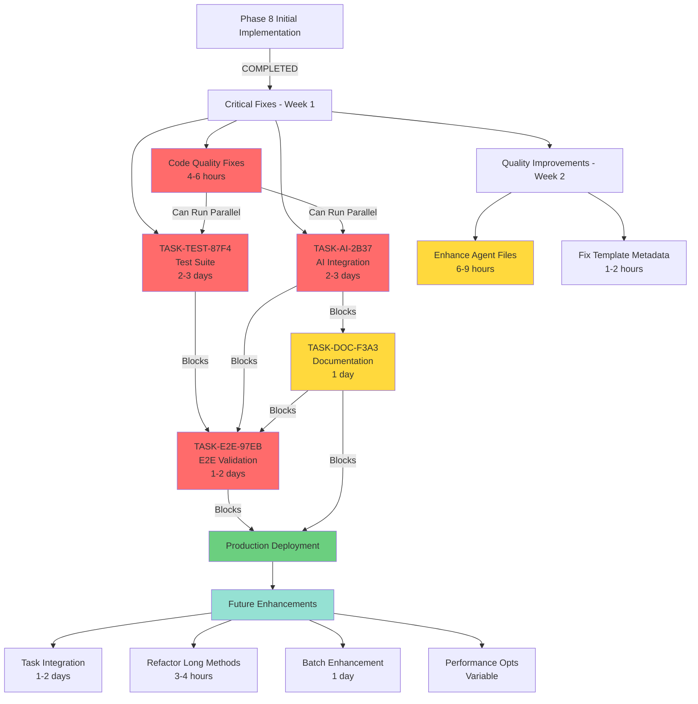

# Template-Create Implementation Guide

**Version**: 1.0
**Last Updated**: 2025-11-20
**Status**: Phase 8 Implementation
**Review Source**: [docs/reviews/phase-8-implementation-review.md](/Users/richardwoollcott/Projects/appmilla_github/taskwright/docs/reviews/phase-8-implementation-review.md)

---

## Table of Contents

1. [Overview](#1-overview)
2. [Architecture](#2-architecture)
3. [Implementation Roadmap](#3-implementation-roadmap)
4. [Task Dependency Graph](#4-task-dependency-graph)
5. [Development Workflow](#5-development-workflow)
6. [Testing Strategy](#6-testing-strategy)
7. [Documentation Requirements](#7-documentation-requirements)
8. [Quality Gates](#8-quality-gates)
9. [Risk Management](#9-risk-management)
10. [Success Metrics](#10-success-metrics)

---

## 1. Overview

### 1.1 Project Goals

Transform the template-create workflow from automated agent enhancement (Phase 7.5) to an incremental, user-controlled enhancement system (Phase 8) that provides:

- **Quality First**: High-fidelity agent enhancements with template-specific content
- **User Control**: Manual or task-based enhancement, not forced automation
- **Reliability**: 100% success rate via hybrid fallback strategy
- **Simplicity**: Direct function calls, no complex checkpoint-resume patterns

### 1.2 Current State (Phase 8 Initial)

**Status**: 7.9/10 (B+) - Strong foundation with critical gaps

**What Works** ✅:
- Clean architecture with strategy pattern (ai/static/hybrid)
- Modular component design (orchestrator, enhancer, prompt_builder, parser, applier)
- Template generation produces high-quality code files
- Validation report generation
- Basic agent file creation

**What's Broken** ❌:
1. **AI Integration Placeholder**: `_ai_enhancement()` method has TODO placeholder
2. **Task Creation Default**: Agent tasks are created by default (use `--no-create-agent-tasks` to opt-out)
3. **Test Coverage Missing**: No tests for Phase 8 code
4. **Agent Files Are Stubs**: No code examples, best practices, or meaningful content
5. **Documentation Incomplete**: No workflow guides or command documentation

### 1.3 Desired State (Production Ready)

**Target**: 9.0/10 (A-) - Production deployment ready

**Requirements**:
- ✅ AI integration working with retry logic and timeout handling
- ✅ Task creation workflow functional and tested
- ✅ Comprehensive test suite (≥85% coverage)
- ✅ Enhanced agent files with examples and best practices
- ✅ Complete documentation (workflow guides, command specs)
- ✅ End-to-end validation on reference templates

### 1.4 Key Architectural Decisions

#### Decision 1: Remove Phase 7.5 Complexity

**Rationale**: Phase 7.5 had 0% success rate due to over-engineering

| Aspect | Phase 7.5 (Removed) | Phase 8 (Current) |
|--------|---------------------|-------------------|
| **Execution Model** | Orchestrator with exit code 42 | Direct function calls |
| **State Management** | `.agent-request.json` files | In-memory (no persistence) |
| **Complexity** | High (retry loops, file I/O) | Low (standard exceptions) |
| **Failure Mode** | Silent failures, stale files | Explicit errors, hybrid fallback |
| **User Experience** | Confusing (automated, hidden) | Clear (manual invocation) |

**Result**: Phase 8 is superior in **every dimension**

#### Decision 2: Incremental Enhancement Model

**Rationale**: Not all agents need enhancement immediately

**Workflows**:
1. **Automatic Task Creation**: `/template-create` (enabled by default)
   - Creates one task per agent
   - User enhances agents via `/task-work TASK-XXX`
   - Tracking and progress visibility

2. **Manual Enhancement**: `/agent-enhance template/agent`
   - Direct enhancement without task tracking
   - Faster for small templates
   - Full control over timing

#### Decision 3: Strategy Pattern (ai/static/hybrid)

**Rationale**: Different use cases require different approaches

| Strategy | Speed | Quality | AI Required | Use Case |
|----------|-------|---------|-------------|----------|
| `ai` | Slow (~30s) | High | Yes | Production templates, learning |
| `static` | Fast (<1s) | Medium | No | Quick setup, no AI available |
| `hybrid` | Medium | High | Optional | Recommended (AI with fallback) |

**Implementation**:
```python
def _generate_enhancement(...) -> dict:
    if self.strategy == "ai":
        return self._ai_enhancement(...)
    elif self.strategy == "static":
        return self._static_enhancement(...)
    elif self.strategy == "hybrid":
        try:
            return self._ai_enhancement(...)
        except Exception as e:
            logger.warning(f"AI enhancement failed, falling back to static: {e}")
            return self._static_enhancement(...)
```

---

## 2. Architecture

### 2.1 Component Diagram

```
┌─────────────────────────────────────────────────────────────┐
│                  TemplateCreateOrchestrator                  │
│  (installer/global/commands/lib/template_create_orchestrator.py)
└───────────────────────┬─────────────────────────────────────┘
                        │
                        ├─ Phase 1-7 (existing)
                        │
                        └─ Phase 8: Agent Task Creation
                               │
                               ▼
                   ┌───────────────────────┐
                   │  SingleAgentEnhancer  │
                   │   (enhancer.py)       │
                   └───────┬───────────────┘
                           │
        ┌──────────────────┼──────────────────┐
        │                  │                  │
        ▼                  ▼                  ▼
┌───────────────┐  ┌──────────────┐  ┌──────────────┐
│ PromptBuilder │  │    Parser    │  │   Applier    │
│(prompt_bui... )│  │(parser.py)   │  │(applier.py)  │
└───────────────┘  └──────────────┘  └──────────────┘

Strategy Selection:
├─ ai:     Task tool → agent-content-enhancer
├─ static: Keyword matching → templates
└─ hybrid: Try ai → fallback to static
```

### 2.2 Data Flow Diagrams

#### 2.2.1 AI Strategy Flow

```
User Command
    │
    ▼
┌─────────────────────────────────────────────────────┐
│ /agent-enhance template/agent --strategy=ai         │
└─────────────────┬───────────────────────────────────┘
                  │
                  ▼
┌─────────────────────────────────────────────────────┐
│ SingleAgentEnhancer.enhance()                       │
│ 1. Load agent metadata (frontmatter)                │
│ 2. Discover relevant templates                      │
│ 3. Call _ai_enhancement()                           │
└─────────────────┬───────────────────────────────────┘
                  │
                  ▼
┌─────────────────────────────────────────────────────┐
│ _ai_enhancement_with_retry() [TASK-AI-2B37]        │
│ - Build prompt (PromptBuilder)                      │
│ - Invoke Task tool (agent-content-enhancer)         │
│ - Parse response (Parser)                           │
│ - Retry on timeout (2x, exponential backoff)        │
└─────────────────┬───────────────────────────────────┘
                  │
                  ▼
┌─────────────────────────────────────────────────────┐
│ _validate_enhancement()                             │
│ - Check required keys: sections                     │
│ - Verify section content                            │
└─────────────────┬───────────────────────────────────┘
                  │
                  ▼
┌─────────────────────────────────────────────────────┐
│ Applier.apply()                                     │
│ - Merge sections into agent file                    │
│ - Write updated content                             │
└─────────────────┬───────────────────────────────────┘
                  │
                  ▼
┌─────────────────────────────────────────────────────┐
│ EnhancementResult                                   │
│ - success: True                                     │
│ - agent_name: string                                │
│ - sections: [related_templates, examples]           │
│ - diff: unified diff                                │
└─────────────────────────────────────────────────────┘
```

#### 2.2.2 Static Strategy Flow

```
User Command
    │
    ▼
┌─────────────────────────────────────────────────────┐
│ /agent-enhance template/agent --strategy=static     │
└─────────────────┬───────────────────────────────────┘
                  │
                  ▼
┌─────────────────────────────────────────────────────┐
│ SingleAgentEnhancer.enhance()                       │
│ 1. Load agent metadata                              │
│ 2. Discover relevant templates                      │
│ 3. Call _static_enhancement()                       │
└─────────────────┬───────────────────────────────────┘
                  │
                  ▼
┌─────────────────────────────────────────────────────┐
│ _static_enhancement()                               │
│ - Keyword matching (agent tech vs templates)        │
│ - Extract code examples from templates              │
│ - Generate best practices (static rules)            │
└─────────────────┬───────────────────────────────────┘
                  │
                  ▼
┌─────────────────────────────────────────────────────┐
│ Applier.apply()                                     │
│ - Merge sections into agent file                    │
│ - Write updated content                             │
└─────────────────┬───────────────────────────────────┘
                  │
                  ▼
┌─────────────────────────────────────────────────────┐
│ EnhancementResult                                   │
│ - success: True                                     │
│ - strategy_used: "static"                           │
└─────────────────────────────────────────────────────┘
```

#### 2.2.3 Hybrid Strategy Flow

```
User Command
    │
    ▼
┌─────────────────────────────────────────────────────┐
│ /agent-enhance template/agent --strategy=hybrid     │
└─────────────────┬───────────────────────────────────┘
                  │
                  ▼
┌─────────────────────────────────────────────────────┐
│ SingleAgentEnhancer.enhance()                       │
│ 1. Load agent metadata                              │
│ 2. Discover relevant templates                      │
│ 3. Call _generate_enhancement(hybrid)               │
└─────────────────┬───────────────────────────────────┘
                  │
                  ▼
┌─────────────────────────────────────────────────────┐
│ Try: _ai_enhancement_with_retry()                   │
└─────────────────┬───────────────────────────────────┘
                  │
          ┌───────┴───────┐
          │               │
    Success ✅         Failure ❌
          │               │
          │               ▼
          │    ┌──────────────────────────┐
          │    │ Log warning              │
          │    │ Fallback: _static_enhan..│
          │    └──────────────┬───────────┘
          │                   │
          └───────────────────┘
                  │
                  ▼
┌─────────────────────────────────────────────────────┐
│ EnhancementResult                                   │
│ - success: True (guaranteed)                        │
│ - strategy_used: "ai" or "static"                   │
└─────────────────────────────────────────────────────┘
```

### 2.3 State Management Approach

**Decision**: **Stateless execution** (no persistent state during enhancement)

**Rationale**:
- Enhancement is atomic operation (single function call)
- No need to resume partial work
- Idempotent by design (can re-run safely)
- Simplifies debugging (no hidden state files)

**Contrast with Phase 7.5**:
```
Phase 7.5 State Files (removed):
- .template-create-state.json
- .agent-request.json (per agent)
- .agent-response.json (per agent)

Phase 8 State (none):
- No persistent state during enhancement
- Task state managed by Taskwright (if using tasks)
- File-based persistence only for final result
```

### 2.4 Integration Points

#### 2.4.1 Integration with `/template-create`

**Current Integration**:
```python
# Phase 6: Agent File Creation (existing)
_create_agent_files()  # Creates basic agent stubs

# Phase 8: Agent Task Creation (NOT YET INTEGRATED)
if config.create_agent_tasks:
    _create_agent_enhancement_tasks()  # TODO: Implement
```

**Required Work**: Task creation logic exists in specification but not integrated with orchestrator.

#### 2.4.2 Integration with `/task-work`

**Expected Integration** (not yet implemented):
```bash
# User creates template with task creation
/template-create --name my-template  # Agent tasks created by default

# System creates tasks like:
# - TASK-001: Enhance mvvm-specialist
# - TASK-002: Enhance repository-specialist

# User works on task
/task-work TASK-001

# System internally calls:
# /agent-enhance my-template/mvvm-specialist
```

**Required Work**: Bridge between task system and `/agent-enhance` command.

#### 2.4.3 Integration with `agent-content-enhancer` Agent

**API Contract**:
```python
from anthropic_sdk import task

result = task(
    agent="agent-content-enhancer",
    prompt=prompt_builder.build(...),
    timeout=300  # 5 minutes
)

# Expected response format:
{
    "sections": ["related_templates", "examples", "best_practices"],
    "related_templates": "## Related Templates\n\n- ...",
    "examples": "## Code Examples\n\n```python\n...\n```",
    "best_practices": "## Best Practices\n\n- ..."
}
```

**Current Status**: Placeholder implementation (TASK-AI-2B37 to implement).

---

## 3. Implementation Roadmap

### Phase 1: Critical Fixes (Week 1)

**Goal**: Production blockers fixed, core functionality working

**Duration**: 5-7 days
**Confidence**: High (well-scoped issues)

#### Task 1.1: TASK-AI-2B37 - AI Integration

**Priority**: CRITICAL
**Duration**: 2-3 days
**Blockers**: None
**Blocks**: TASK-E2E-97EB

**Deliverables**:
- ✅ Real Task tool invocation (replace placeholder)
- ✅ Retry logic with exponential backoff (2s, 4s)
- ✅ Timeout handling (300s)
- ✅ Error handling (TimeoutError, ValidationError)
- ✅ Hybrid strategy fallback tested

**Implementation Steps**:
1. Remove placeholder code (30 min)
2. Implement `_ai_enhancement()` with Task tool (1 hour)
3. Add `_ai_enhancement_with_retry()` wrapper (1 hour)
4. Update hybrid strategy to call retry wrapper (30 min)
5. Integration testing (2 hours)
6. Update unit tests (2 hours)

**Success Criteria**:
- AI strategy success rate ≥80% (with retries)
- Hybrid fallback rate <10%
- Average AI response time <30 seconds
- 0% permanent failures (hybrid always succeeds)

#### Task 1.2: Fix Code Quality Issues

**Priority**: HIGH
**Duration**: 4-6 hours
**Blockers**: None
**Blocks**: Code review sign-off

**Sub-tasks**:

**1.2.1: Fix Task ID Collision Risk** (15 min)
```python
# Before:
task_id = f"TASK-AGENT-{agent_name[:8].upper()}-{timestamp}"

# After:
import uuid
task_id = f"TASK-{agent_name[:12].upper()}-{uuid.uuid4().hex[:8].upper()}"
```

**1.2.2: Add File I/O Error Handling** (1-2 hours)
```python
# Locations: template_create_orchestrator.py:849, 1012-1013
try:
    agent_path.write_text(markdown_content, encoding='utf-8')
except (PermissionError, OSError) as e:
    logger.error(f"Failed to write {agent_path}: {e}")
    return None  # or handle gracefully
```

**1.2.3: Add State Versioning** (30 min)
```python
# Location: template_create_orchestrator.py:1688-1694
state = {
    "checkpoint_version": "1.0",  # Add versioning
    "checkpoint_phase": self.current_phase,
    ...
}
```

#### Task 1.3: TASK-TEST-87F4 - Test Suite

**Priority**: HIGH
**Duration**: 2-3 days
**Blockers**: Can start immediately (use mocks for AI)
**Blocks**: TASK-E2E-97EB

**Deliverables**:
- ✅ 15 unit tests (7 enhancer + 3 prompt_builder + 3 parser + 2 applier)
- ✅ 5 integration tests (end-to-end workflows)
- ✅ Test fixtures and helper utilities
- ✅ Coverage report (≥85% target)

**Test Modules**:
1. `tests/unit/lib/agent_enhancement/test_enhancer.py` (7 tests)
2. `tests/unit/lib/agent_enhancement/test_prompt_builder.py` (3 tests)
3. `tests/unit/lib/agent_enhancement/test_parser.py` (3 tests)
4. `tests/unit/lib/agent_enhancement/test_applier.py` (2 tests)
5. `tests/integration/test_agent_enhancement_workflow.py` (5 tests)

**Success Criteria**:
- 100% pass rate
- ≥85% line coverage
- ≥75% branch coverage
- 0 flaky tests
- <3s execution time (unit tests)

### Phase 2: Quality Improvements (Week 2)

**Goal**: Enhanced templates, complete documentation, production validation

**Duration**: 5-7 days
**Confidence**: High (non-blocking work)

#### Task 2.1: TASK-DOC-F3A3 - Documentation Suite

**Priority**: MEDIUM
**Duration**: 1 day
**Blockers**: TASK-AI-2B37 (must be complete to document accurately)
**Blocks**: User adoption

**Deliverables**:
- ✅ Updated `CLAUDE.md` with incremental enhancement section (~50 lines)
- ✅ New workflow guide: `docs/workflows/incremental-agent-enhancement.md` (~500 lines)
- ✅ Updated command spec: `installer/global/commands/template-create.md` (~30 lines)
- ✅ New command spec: `installer/global/commands/agent-enhance.md` (~200 lines)
- ✅ Comparison table (Phase 7.5 vs Phase 8)
- ✅ Troubleshooting guide and FAQ

**Success Criteria**:
- All cross-references work
- Command examples tested and accurate
- Markdown formatting valid
- 0 broken links

#### Task 2.2: Enhance Agent Files

**Priority**: MEDIUM
**Duration**: 6-9 hours (2-3 hours per agent)
**Blockers**: None (can use MyDrive source code)
**Blocks**: Template quality improvements

**Agent Files** (from net9-maui-mydrive template):
1. `maui-api-service-specialist.md`
2. `realm-thread-safety-specialist.md`
3. `domain-validator-specialist.md`

**Add to Each Agent**:
- **Code Examples**: Extract from MyDrive source code
- **Best Practices**: Based on patterns in code
- **Anti-patterns**: Common mistakes to avoid
- **Integration Guidance**: How to use with other agents
- **Real "Why This Exists"**: Replace circular descriptions

**Example Enhancement** (realm-thread-safety-specialist):
```markdown
## Why This Agent Exists

Realm database has strict thread-safety requirements. RealmObject instances
can only be accessed from the thread they were created on. This agent ensures:
- Proper async/await patterns with ConfigureAwait
- Thread-safe repository implementations
- RealmOperationExecutor abstraction usage
- Cross-thread access prevention

## Code Examples

### Good: Thread-safe Realm access

```csharp
using var realm = await Realm.GetInstanceAsync(_realmConfiguration);
await realm.WriteAsync(() => {
    var obj = realm.Write(() => realm.Add(new MyObject()));
});
```

### Bad: Cross-thread Realm access

```csharp
var realmObject = realm.All<MyObject>().First();
Task.Run(() => realmObject.Property); // CRASH!
```

### Good: RealmOperationExecutor pattern

```csharp
await _executor.ExecuteAsync(async realm => {
    return await realm.All<MyObject>().FirstOrDefaultAsync();
});
```

## Best Practices

1. **Always use async/await**: Never block Realm operations
2. **Use RealmOperationExecutor**: Ensures thread safety
3. **ConfigureAwait(false)**: Prevent UI thread deadlocks
4. **No cross-thread access**: Clone objects if needed
5. **Dispose properly**: Use `using` statements

## Anti-patterns

- ❌ Passing RealmObject across threads
- ❌ Blocking Realm operations with `.Result` or `.Wait()`
- ❌ Accessing Realm in UI callbacks without marshalling
```

#### Task 2.3: Fix Template Metadata

**Priority**: LOW
**Duration**: 1-2 hours
**Blockers**: None
**Blocks**: Template discoverability

**Issues to Fix** (net9-maui-mydrive template):

1. **Manifest display_name** (line ~10):
```json
// Before:
"display_name": "C# Standard Structure"

// After:
"display_name": "NET9 MAUI MyDrive"
```

2. **Empty layers array** (line ~45):
```json
// Before:
"layers": []

// After:
"layers": ["Domain", "Infrastructure", "UI", "Application"]
```

3. **Incomplete required agents** (line ~60):
```json
// Before:
"requires": ["agent:dotnet-domain-specialist"]

// After:
"requires": [
    "agent:dotnet-domain-specialist",
    "agent:maui-api-service-specialist",
    "agent:realm-thread-safety-specialist",
    "agent:domain-validator-specialist"
]
```

4. **Fill CLAUDE.md project structure** (currently empty):
```markdown
## Project Structure

```
MyDrive/
├── Domain/              # Domain models and interfaces
│   ├── Models/
│   ├── Validators/
│   └── Interfaces/
├── Infrastructure/      # Data access and services
│   ├── Data/           # Realm repositories
│   ├── Services/       # HTTP API services
│   └── Mappers/
├── UI/                 # MAUI views and ViewModels
│   ├── Views/
│   ├── ViewModels/
│   └── Controls/
└── Application/         # Application layer
    └── Services/
```
```

#### Task 2.4: TASK-E2E-97EB - End-to-End Validation

**Priority**: HIGH
**Duration**: 1-2 days
**Blockers**: TASK-TEST-87F4, TASK-AI-2B37, TASK-DOC-F3A3
**Blocks**: Production deployment

**Test Scenarios**:
1. Test on react-typescript template (10 agents)
2. Test on fastapi-python template (8 agents)
3. Test on nextjs-fullstack template (12 agents)
4. Test all strategies (ai, static, hybrid)
5. Test task creation workflow
6. Performance benchmarking
7. Edge case validation

**Success Criteria**:
- All 3 templates tested successfully
- All strategies meet performance targets
- 0 critical issues found
- Test report generated and signed off

### Phase 3: Future Enhancements (Post-Production)

**Goal**: Nice-to-have features, optimization opportunities

**Duration**: Variable (prioritize based on user feedback)
**Confidence**: Medium (depends on adoption patterns)

#### Task 3.1: Implement Task Creation Integration

**Priority**: MEDIUM
**Duration**: 1-2 days
**Blockers**: None (can implement independently)
**Blocks**: Documented workflow availability

**Work Required**:
1. Integrate task creation logic with orchestrator
2. Create bridge between task system and `/agent-enhance`
3. Add task metadata (agent_file, template_dir, template_name)
4. Test task state transitions
5. Update documentation

#### Task 3.2: Refactor Long Methods

**Priority**: LOW
**Duration**: 3-4 hours
**Blockers**: None
**Blocks**: Code maintainability

**Targets**:
1. `_serialize_value()` method (113 lines) → Extract sub-methods
2. Task template generation (44 lines) → Move to external Jinja2 template

#### Task 3.3: Add Batch Enhancement

**Priority**: LOW
**Duration**: 1 day
**Blockers**: None
**Blocks**: Parallel processing use cases

**Implementation**:
```python
from concurrent.futures import ThreadPoolExecutor

def enhance_batch(agent_files: List[Path], template_dir: Path, max_workers=5):
    with ThreadPoolExecutor(max_workers=max_workers) as executor:
        enhancer = SingleAgentEnhancer(strategy="hybrid")
        futures = [
            executor.submit(enhancer.enhance, agent_file, template_dir)
            for agent_file in agent_files
        ]
        return [f.result() for f in futures]
```

#### Task 3.4: Performance Optimizations

**Priority**: LOW
**Duration**: Variable
**Blockers**: Performance benchmarking from TASK-E2E-97EB
**Blocks**: Scale improvements

**Optimization Targets**:
1. AI response caching (avoid duplicate invocations)
2. Async file I/O (for batch operations)
3. Template relevance scoring (reduce irrelevant matches)
4. Enhancement history tracking (avoid redundant work)

---

## 4. Task Dependency Graph



### Critical Path

**Week 1** (Production Blockers):
1. **TASK-AI-2B37** (2-3 days) - CRITICAL - AI integration
2. **Code Quality Fixes** (4-6 hours) - HIGH - File I/O, task IDs, versioning
3. **TASK-TEST-87F4** (2-3 days) - HIGH - Test suite

**Week 2** (Quality & Validation):
4. **TASK-DOC-F3A3** (1 day) - MEDIUM - Documentation (depends on AI)
5. **TASK-E2E-97EB** (1-2 days) - HIGH - E2E validation (depends on AI, tests, docs)

**Timeline**: 2-3 weeks to production-ready

### Parallel Execution Opportunities

**Week 1**:
- **AI Integration** and **Test Suite** can run parallel (use mocks for AI in tests)
- **Code Quality Fixes** can run parallel to both

**Week 2**:
- **Enhance Agent Files** and **Fix Metadata** can run parallel
- Both independent of critical path

---

## 5. Development Workflow

### 5.1 For TASK-AI-2B37 (AI Integration)

**Approach**: Replace placeholder, add retry logic, test thoroughly

**Key Files to Modify**:
1. `installer/global/lib/agent_enhancement/enhancer.py`:
   - `_ai_enhancement()` method (lines 212-243)
   - Add `_ai_enhancement_with_retry()` wrapper
   - Update hybrid strategy to call retry wrapper

**Testing Strategy**:
1. **Unit Tests**: Mock Task tool API
   ```python
   @patch('anthropic_sdk.task')
   def test_ai_enhancement_success(mock_task):
       mock_task.return_value = '{"sections": ["examples"], ...}'
       result = enhancer.enhance(agent_file, template_dir)
       assert result.success
   ```

2. **Integration Tests**: Real AI invocation
   ```python
   @pytest.mark.integration
   def test_real_ai_enhancement():
       enhancer = SingleAgentEnhancer(strategy="ai")
       result = enhancer.enhance(agent_file, template_dir)
       assert result.success
       assert len(result.sections) > 0
   ```

**Review Checklist**:
- [ ] Placeholder removed
- [ ] Task tool invocation implemented
- [ ] Timeout handling (300s)
- [ ] Retry logic with exponential backoff
- [ ] Error handling (TimeoutError, ValidationError)
- [ ] Hybrid fallback tested
- [ ] Unit tests passing
- [ ] Integration tests passing

### 5.2 For TASK-TEST-87F4 (Test Suite)

**Approach**: Comprehensive testing with fixtures, mocks, and integration tests

**Key Files to Create**:
1. `tests/fixtures/agent_enhancement_fixtures.py`
2. `tests/unit/lib/agent_enhancement/test_enhancer.py`
3. `tests/unit/lib/agent_enhancement/test_prompt_builder.py`
4. `tests/unit/lib/agent_enhancement/test_parser.py`
5. `tests/unit/lib/agent_enhancement/test_applier.py`
6. `tests/integration/test_agent_enhancement_workflow.py`

**Testing Strategy**:
1. **Arrange-Act-Assert**: Clear test structure
2. **One Assertion Per Test**: Single responsibility
3. **Fast Feedback**: Unit tests <3 seconds
4. **Isolation**: No test dependencies

**Coverage Requirements**:
- Overall: ≥85%
- enhancer.py: ≥90% (core module)
- parser.py: ≥90% (error handling critical)
- prompt_builder.py: ≥85%
- applier.py: ≥90% (file operations critical)

**Review Checklist**:
- [ ] 15 unit tests implemented
- [ ] 5 integration tests implemented
- [ ] All tests passing (100% pass rate)
- [ ] Coverage ≥85% (line coverage)
- [ ] Coverage ≥75% (branch coverage)
- [ ] 0 flaky tests (10 consecutive runs)
- [ ] Execution time <3s (unit tests)

### 5.3 For TASK-DOC-F3A3 (Documentation)

**Approach**: Comprehensive workflow guides with examples

**Key Files to Modify/Create**:
1. `CLAUDE.md` (update ~line 180-220)
2. `docs/workflows/incremental-agent-enhancement.md` (new, ~500 lines)
3. `installer/global/commands/template-create.md` (add ~30 lines)
4. `installer/global/commands/agent-enhance.md` (new, ~200 lines)

**Documentation Structure**:
- Overview and quick start
- Workflow options (task-based vs manual)
- Strategy selection guide
- Real-world examples
- Comparison table (Phase 7.5 vs Phase 8)
- Troubleshooting guide
- FAQ

**Review Checklist**:
- [ ] All cross-references work
- [ ] Command examples tested
- [ ] Markdown formatting valid
- [ ] 0 broken links
- [ ] Spell check passed
- [ ] Code examples use correct syntax

### 5.4 For TASK-E2E-97EB (End-to-End Validation)

**Approach**: Production-like testing on reference templates

**Test Scenarios**:
1. **Reference Templates**: react-typescript, fastapi-python, nextjs-fullstack
2. **All Strategies**: ai, static, hybrid
3. **Task Workflow**: Default behavior → `/task-work` → `/task-complete`
4. **Edge Cases**: Timeouts, permission errors, malformed responses
5. **Performance**: Benchmark all strategies

**Testing Strategy**:
- Manual testing with real templates
- Performance benchmarking with `time` command
- User acceptance validation (content quality)
- Production readiness assessment

**Review Checklist**:
- [ ] All 3 templates tested
- [ ] All strategies meet performance targets
- [ ] Task workflow functional
- [ ] Edge cases handled
- [ ] Test report generated
- [ ] 0 critical issues
- [ ] Production sign-off

---

## 6. Testing Strategy

### 6.1 Unit Testing Approach

**Target**: 85% coverage for agent enhancement modules

**Test Pyramid**:
- 75% Unit Tests (fast, isolated)
- 20% Integration Tests (real file I/O)
- 5% E2E Tests (production scenarios)

**Testing Philosophy**:
1. **Arrange-Act-Assert**: Clear test structure
2. **One Assertion Per Test**: Single responsibility
3. **Fast Feedback**: Unit tests <3 seconds
4. **Isolation**: No test dependencies
5. **Repeatability**: Same result every time

### 6.2 Integration Testing Scenarios

**Scope**: Real file I/O, no mocked AI (use static strategy)

**Scenarios**:
1. **Complete Enhancement Workflow**
   ```python
   def test_enhance_agent_with_static_strategy():
       # Create test template and agent
       template_dir, agent_file = create_test_template()

       # Enhance with static strategy
       enhancer = SingleAgentEnhancer(strategy="static")
       result = enhancer.enhance(agent_file, template_dir)

       # Verify enhancement applied
       assert result.success
       assert "## Related Templates" in agent_file.read_text()
   ```

2. **Error Handling**
   ```python
   def test_permission_error_on_readonly_file():
       agent_file = create_readonly_agent()

       with pytest.raises(PermissionError):
           enhancer.enhance(agent_file, template_dir)
   ```

3. **Dry-Run Mode**
   ```python
   def test_dry_run_doesnt_modify_files():
       original_content = agent_file.read_text()

       enhancer = SingleAgentEnhancer(strategy="static", dry_run=True)
       result = enhancer.enhance(agent_file, template_dir)

       assert agent_file.read_text() == original_content
       assert result.diff != ""
   ```

### 6.3 E2E Testing with Reference Templates

**Goal**: Validate production readiness on real templates

**Test Matrix**:

| Template | Agents | Strategy | Expected Time | Quality Check |
|----------|--------|----------|---------------|---------------|
| react-typescript | 10 | ai | <300s total | High (templates + examples) |
| react-typescript | 10 | static | <10s total | Medium (templates only) |
| react-typescript | 10 | hybrid | <350s total | High (AI or medium if fallback) |
| fastapi-python | 8 | ai | <240s total | High |
| nextjs-fullstack | 12 | hybrid | <420s total | High |

**Performance Benchmarks**:

| Metric | Target | Acceptable | Critical |
|--------|--------|-----------|----------|
| AI strategy time | <30s per agent | <60s | <300s |
| Static strategy time | <1s per agent | <3s | <10s |
| Hybrid strategy time | <35s per agent | <65s | <305s |
| Memory usage | <500MB | <1GB | <2GB |
| Success rate | 95% | 90% | 80% |

### 6.4 Performance Testing Considerations

**Measurement Tools**:
```bash
# Time measurement
time /agent-enhance template/agent --strategy=ai

# Memory measurement
/usr/bin/time -l /agent-enhance template/agent --strategy=ai

# Performance profiling
python3 -m cProfile -o profile.stats /agent-enhance template/agent
```

**Optimization Targets** (if benchmarks not met):
1. Prompt size reduction (<2000 tokens)
2. Template selection optimization (limit to 10 most relevant)
3. AI response caching (avoid duplicate invocations)
4. Async I/O for batch operations

---

## 7. Documentation Requirements

### 7.1 Main CLAUDE.md Updates

**Location**: `CLAUDE.md` (lines ~180-220)

**Add Sections**:
1. **Incremental Agent Enhancement** (overview)
2. **Two Workflows** (task-based vs manual)
3. **Strategy Options** (table)
4. **When to Use** (decision guide)
5. **Quick Reference** (commands)

**Example Structure**:
```markdown
## Incremental Agent Enhancement

After creating a template with `/template-create`, you can optionally enhance
agents incrementally (tasks created by default) or via `/agent-enhance` command.

### Two Workflows

#### Option 1: Create Agent Tasks During Template Creation

```bash
/template-create --name my-template  # Agent tasks created by default
```

#### Option 2: Manual Enhancement Later

```bash
/agent-enhance my-template/mvvm-specialist --strategy=ai
```

### Strategy Options

| Strategy | Speed | Quality | AI Required |
|----------|-------|---------|-------------|
| `ai` | Slow (~30s) | High | Yes |
| `static` | Fast (<1s) | Medium | No |
| `hybrid` | Medium | High | Optional |

See: [Incremental Agent Enhancement Workflow](docs/workflows/incremental-agent-enhancement.md)
```

### 7.2 Workflow Guide

**File**: `docs/workflows/incremental-agent-enhancement.md` (~500 lines)

**Structure**:
1. Overview
2. Quick Start
3. Workflow Options
   - Task-based enhancement
   - Manual enhancement
4. Strategy Selection Guide
5. Examples
   - React template (10 agents)
   - FastAPI template (8 agents)
6. Comparison Table (Phase 7.5 vs Phase 8)
7. Troubleshooting
8. Best Practices
9. FAQ

### 7.3 Command Specifications

#### 7.3.1 Update `/template-create` Command Spec

**File**: `installer/global/commands/template-create.md`

**Add Section** (~30 lines):
```markdown
## Incremental Agent Enhancement

### Agent Task Creation (Default Behavior)

Individual tasks are created by default for each agent to enhance incrementally.

```bash
# Default behavior (creates agent tasks)
/template-create --name my-template

# Opt-out of task creation
/template-create --name my-template --no-create-agent-tasks
```

**Behavior**:
- Creates template with basic agents (Phase 6)
- Creates TASK-XXX for each agent (by default, opt-out with --no-create-agent-tasks)
- Each task calls `/agent-enhance` for one agent
- Use `/task-work TASK-XXX` to enhance agents individually
```

#### 7.3.2 Create `/agent-enhance` Command Spec

**File**: `installer/global/commands/agent-enhance.md` (new, ~200 lines)

**Structure**:
1. Usage
2. Examples
3. Flags
   - `--strategy` (ai/static/hybrid)
   - `--dry-run`
   - `--verbose`
4. Strategies (detailed explanation)
5. Output (example outputs)
6. Error Handling

### 7.4 Documentation Completeness Checklist

- [ ] Main CLAUDE.md updated
- [ ] Workflow guide created
- [ ] Command specs updated/created
- [ ] Comparison table (Phase 7.5 vs Phase 8)
- [ ] Troubleshooting guide
- [ ] FAQ section
- [ ] All cross-references work
- [ ] All examples tested
- [ ] Markdown formatting valid
- [ ] 0 broken links

---

## 8. Quality Gates

### 8.1 Code Review Checklist

**Must Pass Before Merge**:

- [ ] All acceptance criteria met
- [ ] Code follows Taskwright patterns (orchestrator, components, Result types)
- [ ] No placeholder code (except documented TODOs)
- [ ] Error handling comprehensive
- [ ] Logging appropriate (info/warning/error)
- [ ] Documentation updated (docstrings)
- [ ] No security vulnerabilities (path injection, file overwrite)

### 8.2 Test Coverage Requirements

**Minimum Thresholds**:

| Module | Line Coverage | Branch Coverage |
|--------|--------------|-----------------|
| enhancer.py | ≥90% | ≥80% |
| prompt_builder.py | ≥85% | ≥75% |
| parser.py | ≥90% | ≥80% |
| applier.py | ≥90% | ≥80% |
| **Overall** | **≥85%** | **≥75%** |

**Additional Requirements**:
- 100% pass rate
- 0 flaky tests
- <3s execution time (unit tests)
- <10s execution time (integration tests)

### 8.3 Documentation Completeness

**Must Pass Before Release**:

- [ ] All commands documented
- [ ] All workflows have guides
- [ ] Comparison table complete
- [ ] Troubleshooting guide comprehensive
- [ ] FAQ addresses common questions
- [ ] All cross-references work
- [ ] All examples tested
- [ ] Spell check passed

### 8.4 Performance Benchmarks

**Must Meet Before Production**:

| Metric | Target |
|--------|--------|
| AI strategy time | <30s per agent |
| Static strategy time | <1s per agent |
| Hybrid strategy time | <35s per agent |
| Memory usage | <500MB |
| Success rate | ≥95% |

---

## 9. Risk Management

### 9.1 Identified Risks and Mitigation Strategies

| Risk | Likelihood | Impact | Mitigation |
|------|-----------|--------|------------|
| **AI Integration Unreliable** | MEDIUM | HIGH | Hybrid strategy with static fallback |
| **Test Coverage Target Not Met** | LOW | MEDIUM | Incremental monitoring during development |
| **Task Creation Still Doesn't Work** | MEDIUM | MEDIUM | Mark as "COMING SOON" in docs until implemented |
| **Performance Below Benchmarks** | LOW | HIGH | Early benchmarking, optimize if needed |
| **E2E Testing Uncovers Critical Bugs** | MEDIUM | HIGH | Fix before production, create follow-up tasks |
| **Documentation Lags Implementation** | MEDIUM | LOW | Update docs immediately after code changes |

### 9.2 Rollback Procedures

**If Production Issues Found**:

1. **Immediate Rollback**:
   ```bash
   git revert <commit-hash>
   git push origin main
   ```

2. **Communication**:
   - Notify users of issue
   - Provide workaround (use old workflow)
   - Timeline for fix

3. **Root Cause Analysis**:
   - Reproduce issue
   - Create detailed task
   - Implement fix with tests
   - Re-deploy

### 9.3 Monitoring and Observability

**Production Monitoring**:

1. **Logging**:
   - AI invocation success/failure rates
   - Enhancement strategy usage (ai/static/hybrid)
   - Average response times
   - Error counts by type

2. **Metrics**:
   - Enhancements per day
   - Success rate per strategy
   - Average enhancement time
   - Fallback rate (hybrid → static)

3. **Alerts**:
   - AI failure rate >20%
   - Average response time >60s
   - Memory usage >1GB
   - Error rate >5%

---

## 10. Success Metrics

### 10.1 How to Measure Success

**Quantitative Metrics**:

| Metric | Target | Measurement |
|--------|--------|-------------|
| **Code Quality Score** | ≥8.5/10 | Code review rating |
| **Test Coverage** | ≥85% | pytest-cov report |
| **Documentation Completeness** | 100% | Checklist completion |
| **Performance** | All benchmarks met | E2E test results |
| **Bug Count** | <3 critical, <10 total | Issue tracker |

**Qualitative Metrics**:

- **User Experience**: Smooth and intuitive (user feedback)
- **Error Messages**: Clear and actionable (review samples)
- **Documentation**: Matches actual behavior (testing verification)
- **Maintainability**: Easy to extend and debug (developer feedback)

### 10.2 KPIs for Adoption

**Adoption Metrics** (3 months post-release):

| KPI | Target |
|-----|--------|
| **Templates Created with Enhancement** | ≥50% |
| **Users Using AI Strategy** | ≥30% |
| **Hybrid Strategy Usage** | ≥40% (recommended) |
| **Average Enhancements Per Template** | ≥5 agents |
| **User Satisfaction** | ≥8/10 |

### 10.3 Quality Metrics

**Code Quality**:
- **Complexity**: Cyclomatic complexity <10 per method
- **Duplication**: <5% code duplication
- **Technical Debt**: <2 hours per 100 LOC
- **Security**: 0 critical vulnerabilities

**Test Quality**:
- **Coverage**: ≥85% line, ≥75% branch
- **Pass Rate**: 100%
- **Flakiness**: 0%
- **Execution Time**: <3s (unit), <10s (integration)

**Documentation Quality**:
- **Completeness**: 100% (all features documented)
- **Accuracy**: 100% (examples tested)
- **Clarity**: ≥8/10 (user feedback)
- **Findability**: ≥90% (users find answers)

---

## Appendix A: File Locations

**Core Implementation**:
- `installer/global/commands/lib/template_create_orchestrator.py` - Main orchestrator
- `installer/global/lib/agent_enhancement/enhancer.py` - SingleAgentEnhancer
- `installer/global/lib/agent_enhancement/prompt_builder.py` - Prompt generation
- `installer/global/lib/agent_enhancement/parser.py` - Response parsing
- `installer/global/lib/agent_enhancement/applier.py` - File modification

**Tests**:
- `tests/unit/lib/agent_enhancement/test_enhancer.py` - Enhancer unit tests
- `tests/unit/lib/agent_enhancement/test_prompt_builder.py` - Prompt builder tests
- `tests/unit/lib/agent_enhancement/test_parser.py` - Parser tests
- `tests/unit/lib/agent_enhancement/test_applier.py` - Applier tests
- `tests/integration/test_agent_enhancement_workflow.py` - Integration tests
- `tests/fixtures/agent_enhancement_fixtures.py` - Test fixtures

**Documentation**:
- `CLAUDE.md` - Main documentation
- `docs/workflows/incremental-agent-enhancement.md` - Workflow guide
- `installer/global/commands/template-create.md` - Template create command spec
- `installer/global/commands/agent-enhance.md` - Agent enhance command spec

**Tasks**:
- `tasks/backlog/TASK-AI-2B37-ai-integration-agent-enhancement.md`
- `tasks/backlog/TASK-TEST-87F4-comprehensive-test-suite-agent-enhancement.md`
- `tasks/backlog/TASK-DOC-F3A3-documentation-suite-agent-enhancement.md`
- `tasks/backlog/TASK-E2E-97EB-end-to-end-validation-agent-enhancement.md`

---

## Appendix B: Quick Reference Commands

**Development**:
```bash
# Run tests with coverage
pytest tests/unit/lib/agent_enhancement/ tests/integration/ \
  --cov=installer.global.lib.agent_enhancement \
  --cov-report=term \
  --cov-report=html

# Run specific test module
pytest tests/unit/lib/agent_enhancement/test_enhancer.py -v

# Check for flaky tests
pytest tests/ --count=10

# Benchmark enhancement
time /agent-enhance react-typescript/mvvm-specialist --strategy=ai
```

**Task Management**:
```bash
# Work on AI integration
/task-work TASK-AI-2B37

# Work on test suite
/task-work TASK-TEST-87F4

# Work on documentation
/task-work TASK-DOC-F3A3

# Work on E2E validation
/task-work TASK-E2E-97EB

# Track progress
/task-status TASK-AI-2B37
```

**Enhancement**:
```bash
# Enhance with AI strategy
/agent-enhance my-template/mvvm-specialist

# Preview with dry-run
/agent-enhance my-template/repository-specialist --dry-run

# Use static strategy
/agent-enhance my-template/testing-specialist --strategy=static

# Use hybrid strategy (recommended)
/agent-enhance my-template/api-specialist --strategy=hybrid

# Verbose output for debugging
/agent-enhance my-template/domain-specialist --verbose
```

---

**Guide Version**: 1.0
**Last Updated**: 2025-11-20
**Next Review**: After TASK-AI-2B37, TASK-TEST-87F4, TASK-DOC-F3A3 completion
**Maintainer**: Architecture Team
