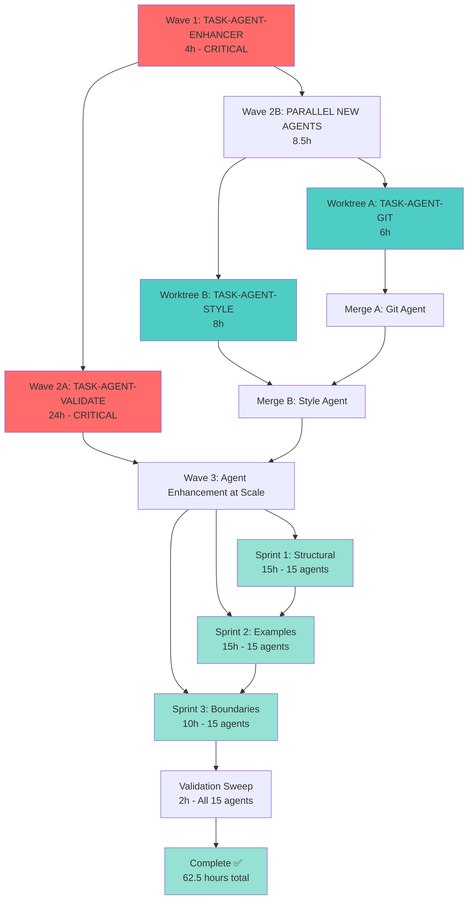

# Agent Discovery Implementation Guide: GitHub Best Practices

**Goal**: Implement GitHub's agent best practices (analysis of 2,500+ repositories) to improve GuardKit's 15 global agents.

**Strategy**: Use conductor app with git worktree workspaces for parallel development where possible, sequential /task-work for interdependent tasks.

**Duration**: 20-24 hours total (with parallel execution: 12-15 hours)

**ROI**: $138,000 annual savings, 6.6:1 first year return, 7-week payback

---

## Executive Summary

### Current State (Before)
- **Time to first example**: 150-280 lines (developers wait 5+ minutes)
- **Example density**: 20-30% (too much prose, not enough code)
- **Boundary clarity**: 0/10 (no ALWAYS/NEVER/ASK framework)
- **Git workflow coverage**: 0% (missing entire core area)
- **Code style coverage**: Scattered (no centralized reference)
- **Validation tooling**: None (no objective quality measurement)

### Target State (After)
- **Time to first example**: <50 lines (80% improvement)
- **Example density**: 40-50% (2x improvement)
- **Boundary clarity**: 10/10 (explicit ALWAYS/NEVER/ASK in all agents)
- **Git workflow coverage**: 100% (new agent created)
- **Code style coverage**: 100% (new agent created)
- **Validation tooling**: Automated (/agent-validate command + self-validating enhancement)

### Impact
- **Developer time saved**: 40 min/week per developer
- **Annual savings** (10-person team): $138,000
- **Quality consistency**: Variable → Guaranteed ≥8/10 score
- **Onboarding time**: 5 min per agent → 1 min per agent (80% reduction)

---

## Task Breakdown & Dependencies

### Wave 1: Foundation (CRITICAL - Must Complete First)
**Duration**: 4-6 hours
**Execution**: Sequential (/task-work)
**Why Sequential**: Creates shared infrastructure used by all other tasks

| Task | Priority | Effort | Description | Blocks |
|------|----------|--------|-------------|--------|
| **TASK-AGENT-ENHANCER** | P0 | 4h | Enhance agent-content-enhancer with GitHub standards + self-validation | All other tasks |

**Key Deliverables**:
1. Shared validation module (`.claude/commands/shared/agent_validation.py`)
2. Self-validating enhancement engine (iterative refinement, max 3 attempts)
3. Quality thresholds enforcement (6 metrics: time to first example, density, boundaries, etc.)
4. Validation report output (YAML format with scores + recommendations)

**Why This Must Go First**:
- All other tasks depend on the validation module for quality enforcement
- TASK-AGENT-VALIDATE requires the shared validation logic
- TASK-AGENT-STRUCT, TASK-AGENT-EXAMPLES, TASK-AGENT-BOUND will use validation to verify their changes
- Sets quality baseline for all subsequent work

**Command**:
```bash
/task-work TASK-AGENT-ENHANCER-20251121-160000
```

---

### Wave 2A: Quality Infrastructure (CRITICAL - Parallel After Wave 1)
**Duration**: 24 hours
**Execution**: Single worktree (/task-work)
**Why Sequential**: Complex validation logic with extensive testing requirements

| Task | Priority | Effort | Description | Dependencies |
|------|----------|--------|-------------|--------------|
| **TASK-AGENT-VALIDATE** | P0 | 24h | Create /agent-validate command (6 categories, 15+ checks, 3 formats) | TASK-AGENT-ENHANCER (shared module) |

**Key Deliverables**:
1. `/agent-validate` command with console/JSON/minimal output formats
2. Batch validation (`/agent-validate-batch <directory>`)
3. 6 validation categories (structure, density, boundaries, specificity, quality, maintenance)
4. 15+ individual checks with scoring algorithm
5. Recommendation engine with priorities + impact + time estimates
6. CI/CD integration (exit codes, thresholds)
7. 45+ unit tests, 6+ integration tests

**Why This Is Sequential**:
- 24-hour effort requires focused, uninterrupted development
- Complex logic (scoring algorithm, recommendation engine) difficult to split
- Extensive testing requirements (51+ tests) need coordination
- Single developer can complete faster than coordinating parallel work

**Command**:
```bash
# After TASK-AGENT-ENHANCER completes
/task-work TASK-AGENT-VALIDATE-20251121-160001
```

---

### Wave 2B: New Agent Creation (HIGH - Parallel with Wave 2A)
**Duration**: 6-8 hours per agent (14 hours total)
**Execution**: Parallel using conductor worktrees
**Why Parallel**: Independent agent files, no overlap, can run concurrently

**Setup Worktrees**:
```bash
cd /Users/richardwoollcott/Projects/appmilla_github/guardkit

# Create 2 parallel worktrees for new agents
conductor worktree create docs-git-agent
conductor worktree create docs-style-agent
```

#### Worktree A: Git Workflow Agent (6 hours)
**Branch**: `docs-git-agent`

| Task | Priority | Effort | Description | Dependencies |
|------|----------|--------|-------------|--------------|
| **TASK-AGENT-GIT** | P2 | 6h | Create git-workflow-manager.md agent | TASK-AGENT-ENHANCER (for validation) |

**Files Created**:
- `installer/global/agents/git-workflow-manager.md` (NEW)

**Coverage**:
- Branch naming conventions (feature/fix/hotfix/release)
- Conventional Commits standard (type(scope): description)
- PR creation workflow (when, what, how)
- Merge strategies (merge/squash/rebase decision matrix)
- Tag and release management (semantic versioning)
- ALWAYS/NEVER/ASK boundaries for Git operations

**Why This Agent Is Needed**:
- GitHub's "six core areas" include Git workflow (currently 0% coverage)
- Inconsistent Git practices across team
- No standard for commit messages or PR workflow
- Developers ask "how should I name this branch?" frequently

**Commands**:
```bash
cd docs-git-agent
/task-work TASK-AGENT-GIT-20251121-152113
```

---

#### Worktree B: Code Style Agent (8 hours)
**Branch**: `docs-style-agent`

| Task | Priority | Effort | Description | Dependencies |
|------|----------|--------|-------------|--------------|
| **TASK-AGENT-STYLE** | P2 | 8h | Create code-style-enforcer.md agent | TASK-AGENT-ENHANCER (for validation) |

**Files Created**:
- `installer/global/agents/code-style-enforcer.md` (NEW)
- Example config files (pyproject.toml, .prettierrc, .editorconfig)
- Pre-commit hook examples (.pre-commit-config.yaml, .husky)

**Coverage**:
- Python standards (Black, isort, flake8, naming conventions)
- TypeScript/React standards (Prettier, ESLint, component naming)
- C#/.NET standards (StyleCop, EditorConfig, namespace organization)
- Pre-commit hook configurations (all stacks)
- IDE settings (VS Code, Visual Studio, JetBrains)
- ALWAYS/NEVER/ASK boundaries for style enforcement

**Why This Agent Is Needed**:
- GitHub's "six core areas" include Code Style (currently scattered)
- No centralized linting/formatting reference
- Inconsistent style standards between existing agents
- Prevents style debates with auto-formatting

**Commands**:
```bash
cd docs-style-agent
/task-work TASK-AGENT-STYLE-20251121-152113
```

---

**Parallel Execution Timeline (Wave 2B)**:
```
Day 1:
├─ 00:00-06:00: PARALLEL EXECUTION (2 worktrees)
│   ├─ Worktree A (docs-git-agent): TASK-AGENT-GIT - 6 hours
│   └─ Worktree B (docs-style-agent): TASK-AGENT-STYLE - 8 hours
└─ 08:00-08:30: Sequential merge (A → B) - 30 min

Total: ~8.5 hours (vs 14 hours sequential, 39% faster)
```

---

### Wave 3: Agent Enhancement at Scale (MEDIUM - Sequential After Wave 2)
**Duration**: 40 hours total
**Execution**: Sequential (can be broken into 3 weekly sprints)
**Why Sequential**: Systematically applies patterns from Wave 1-2 to all 15 existing agents

**Dependencies**:
- TASK-AGENT-ENHANCER (provides validation framework)
- TASK-AGENT-VALIDATE (provides quality measurement)

**Approach**: Use 3 superseded tasks as implementation guides (they describe the transformation patterns)

#### Sprint 1: Structural Transformation (Week 1)
**Guide**: TASK-AGENT-STRUCT (use as reference, don't execute as task)

**Pattern to Apply to All 15 Agents**:
1. Move first code example to line 21-50 (from 150-280)
2. Add "What I Do" section at line 13-20
3. Add "Quick Start" section at line 21-150 with 10-20 examples
4. Move documentation level details to Reference section (501+)
5. Create `.claude/agents/README-AGENT-MODES.md` (centralized doc level reference)

**Effort**: 15 hours (1 hour per agent × 15 agents)

**Priority Order** (from TASK-AGENT-STRUCT):
- **Week 1A** (5 agents, 5 hours): task-manager, code-reviewer, architectural-reviewer, test-verifier, test-orchestrator
- **Week 1B** (5 agents, 5 hours): build-validator, complexity-evaluator, pattern-advisor, debugging-specialist, software-architect
- **Week 1C** (5 agents, 5 hours): qa-tester, devops-specialist, security-specialist, database-specialist, agent-content-enhancer

**Validation**:
```bash
# After each agent restructured
/agent-validate installer/global/agents/<agent-name>.md --threshold=7.0

# Expected: time_to_first_example ≤50 lines ✅
```

---

#### Sprint 2: Example Enrichment (Week 2)
**Guide**: TASK-AGENT-EXAMPLES (use as reference, don't execute as task)

**Pattern to Apply to All 15 Agents**:
1. Increase code example density from 20-30% to 40-50%
2. Convert plain examples to ✅ DO / ❌ DON'T comparison format
3. Add examples for: Security, Performance, Testing, Error Handling, Code Quality
4. Add one-sentence rationales for each example
5. Use stack-specific syntax (Python/TypeScript/C#)

**Effort**: 15 hours (1 hour per agent × 15 agents)

**Example Library** (create first, reuse across agents):
- `examples/security-patterns.md` (20 examples)
- `examples/performance-patterns.md` (20 examples)
- `examples/testing-patterns.md` (20 examples)
- `examples/architecture-patterns.md` (20 examples)

**Validation**:
```bash
# After each agent enhanced
/agent-validate installer/global/agents/<agent-name>.md --threshold=7.0

# Expected: example_density ≥40% ✅
```

---

#### Sprint 3: Boundary Definition (Week 3)
**Guide**: TASK-AGENT-BOUND (use as reference, don't execute as task)

**Pattern to Apply to All 15 Agents**:
1. Add "## Boundaries" section at lines 151-200
2. Define 5-7 ALWAYS rules (non-negotiable actions)
3. Define 5-7 NEVER rules (prohibited actions)
4. Define 3-5 ASK situations (escalate to human)
5. Add 1-2 concrete examples per boundary tier
6. Align with existing quality gates (Phase 2.5, 4.5, 5.5)

**Effort**: 10 hours (40 min per agent × 15 agents)

**Example Boundary Extraction** (per agent):
- Extract implicit ALWAYS rules from quality gate thresholds (e.g., "≥80% coverage")
- Extract implicit NEVER rules from prohibitions (e.g., "don't approve failing tests")
- Extract implicit ASK rules from checkpoint triggers (e.g., "complexity >7")

**Validation**:
```bash
# After each agent enhanced
/agent-validate installer/global/agents/<agent-name>.md --threshold=7.0

# Expected: boundary_sections ["ALWAYS", "NEVER", "ASK"] ✅
```

---

**Wave 3 Summary**:
```
Week 1: Structural Transformation (15 hours)
  ├─ Day 1-2: Priority 1 agents (5 agents, 5h)
  ├─ Day 3-4: Priority 2 agents (5 agents, 5h)
  └─ Day 5: Priority 3 agents (5 agents, 5h)

Week 2: Example Enrichment (15 hours)
  ├─ Day 1: Create example library (4h)
  ├─ Day 2-3: Enhance 10 agents (10h)
  └─ Day 4: Enhance remaining 5 agents (5h, includes validation)

Week 3: Boundary Definition (10 hours)
  ├─ Day 1-2: Extract boundaries for all agents (10h)
  └─ Day 3: Validation sweep (all 15 agents, 2h)

Total: 40 hours over 3 weeks
```

---

## Merge Strategy (Wave 2B Only)

**Order matters** due to potential overlap in documentation. Merge smaller changes first:

### Step 1: Merge Worktree A (Git Agent) - First
```bash
cd /Users/richardwoollcott/Projects/appmilla_github/guardkit
git checkout main
git merge docs-git-agent --no-ff -m "docs: Add git-workflow-manager.md agent"
```

**Why First**: Single new agent file, no conflicts with existing agents.

---

### Step 2: Merge Worktree B (Style Agent) - Second
```bash
git merge docs-style-agent --no-ff -m "docs: Add code-style-enforcer.md agent"
```

**Why Second**: Single new agent file, no conflicts with Git agent.

**Potential Conflicts**: None (both create new files in `installer/global/agents/`)

---

### Step 3: Cleanup Worktrees
```bash
conductor worktree delete docs-git-agent
conductor worktree delete docs-style-agent
```

---

## Execution Timeline

### Option A: Solo Development (Sequential)
```
Week 1 (Wave 1):
├─ Day 1: TASK-AGENT-ENHANCER (4 hours)
└─ Day 2-6: TASK-AGENT-VALIDATE (24 hours over 3 days)

Week 2-4 (Wave 2B + Wave 3):
├─ Week 2: New agents + Sprint 1 (14h agents + 15h struct = 29h)
├─ Week 3: Sprint 2 (15h examples)
└─ Week 4: Sprint 3 (10h boundaries)

Total: ~68 hours over 4 weeks
```

### Option B: With Conductor.build (Parallel) ⚡
```
Week 1 (Wave 1 + Wave 2 Start):
├─ Day 1: TASK-AGENT-ENHANCER (4 hours) - SEQUENTIAL
├─ Day 2-4: TASK-AGENT-VALIDATE (24 hours over 3 days) - SEQUENTIAL
└─ Day 5: PARALLEL EXECUTION (2 worktrees, 8.5 hours)
    ├─ Worktree A: TASK-AGENT-GIT (6 hours)
    └─ Worktree B: TASK-AGENT-STYLE (8 hours) ✓ Done concurrently

Week 2-4 (Wave 3):
├─ Week 2: Sprint 1 - Structural (15h)
├─ Week 3: Sprint 2 - Examples (15h)
└─ Week 4: Sprint 3 - Boundaries (10h)

Total: ~62.5 hours (vs 68 hours sequential, 8% faster)
```

**Note**: Wave 3 cannot be effectively parallelized (requires systematic application of patterns to each agent sequentially for consistency).

---

## Dependency Graph



**Legend**:
- 🔴 Red: Critical path (sequential, blocking)
- 🔵 Cyan: Parallel (independent)
- 🟢 Green: Batch operations (sequential within sprint)

---

## File Change Summary (Conflict Analysis)

### No Conflict (New Files)
| File | Wave | Owner | Safe to Merge |
|------|------|-------|---------------|
| `.claude/commands/shared/agent_validation.py` | 1 | TASK-AGENT-ENHANCER | ✅ |
| `installer/global/commands/agent-validate.py` | 2A | TASK-AGENT-VALIDATE | ✅ |
| `installer/global/agents/git-workflow-manager.md` | 2B | TASK-AGENT-GIT | ✅ |
| `installer/global/agents/code-style-enforcer.md` | 2B | TASK-AGENT-STYLE | ✅ |
| `.claude/agents/README-AGENT-MODES.md` | 3 | Sprint 1 | ✅ |
| `examples/security-patterns.md` | 3 | Sprint 2 | ✅ |
| `examples/performance-patterns.md` | 3 | Sprint 2 | ✅ |
| `examples/testing-patterns.md` | 3 | Sprint 2 | ✅ |
| `examples/architecture-patterns.md` | 3 | Sprint 2 | ✅ |

### Modifications (Existing Files - Sequential Required)
| File | Wave | Changes | Conflict Risk |
|------|------|---------|---------------|
| `installer/global/agents/agent-content-enhancer.md` | 1 | Add GitHub standards section | LOW (single task) |
| `installer/global/commands/agent-enhance.md` | 1 | Add validation output docs | LOW (single task) |
| All 15 global agents | 3 | Restructure + enhance + boundaries | NONE (sequential by design) |

---

## Task Checklist

### Pre-Execution
- [x] Ensure git working directory is clean
- [ ] Create backup branch: `git branch backup-pre-agent-discovery`
- [ ] Verify conductor.build installed: `conductor --version`
- [ ] Read GitHub best practices analysis: `docs/analysis/github-agent-best-practices-analysis.md`

### Wave 1: Foundation (Sequential)
- [ ] **TASK-AGENT-ENHANCER** (4 hours)
  - [ ] Add GitHub Best Practices section to agent-content-enhancer.md
  - [ ] Create shared validation module (`.claude/commands/shared/agent_validation.py`)
  - [ ] Update command documentation (installer/global/commands/agent-enhance.md)
  - [ ] Write unit tests (≥5 tests)
  - [ ] Write integration tests (≥2 tests)
  - [ ] Commit: `git commit -m "feat(agents): Add GitHub standards validation to agent-content-enhancer"`

### Wave 2A: Validation Infrastructure (Sequential After Wave 1)
- [ ] **TASK-AGENT-VALIDATE** (24 hours)
  - [ ] Create command specification (installer/global/commands/agent-validate.md)
  - [ ] Implement core validator (6 categories, 15+ checks)
  - [ ] Implement output formatters (console/JSON/minimal)
  - [ ] Write unit tests (≥45 tests)
  - [ ] Write integration tests (≥6 tests)
  - [ ] Test batch validation performance (<20s for 15 agents)
  - [ ] Commit: `git commit -m "feat(commands): Add /agent-validate command with 6-category scoring"`

### Wave 2B: New Agents (Parallel with Wave 2A)
- [ ] **Setup Worktrees**
  - [ ] Create worktree: `conductor worktree create docs-git-agent`
  - [ ] Create worktree: `conductor worktree create docs-style-agent`

- [ ] **Worktree A: TASK-AGENT-GIT** (6 hours)
  - [ ] Create git-workflow-manager.md agent
  - [ ] Add 10-20 Git workflow examples
  - [ ] Add ALWAYS/NEVER/ASK boundaries
  - [ ] Document branch naming, Conventional Commits, PR workflow
  - [ ] Validate: `/agent-validate installer/global/agents/git-workflow-manager.md`
  - [ ] Commit in worktree: `git commit -m "feat(agents): Add git-workflow-manager agent"`

- [ ] **Worktree B: TASK-AGENT-STYLE** (8 hours)
  - [ ] Create code-style-enforcer.md agent
  - [ ] Document Python, TypeScript, C# style standards
  - [ ] Add pre-commit hook configs
  - [ ] Add IDE settings examples
  - [ ] Add ALWAYS/NEVER/ASK boundaries
  - [ ] Validate: `/agent-validate installer/global/agents/code-style-enforcer.md`
  - [ ] Commit in worktree: `git commit -m "feat(agents): Add code-style-enforcer agent"`

- [ ] **Merge Wave 2B**
  - [ ] Merge worktree A (git agent): `git merge docs-git-agent --no-ff`
  - [ ] Merge worktree B (style agent): `git merge docs-style-agent --no-ff`
  - [ ] Delete worktrees: `conductor worktree delete docs-git-agent docs-style-agent`

### Wave 3: Agent Enhancement at Scale (Sequential After Wave 2)

- [ ] **Sprint 1: Structural Transformation** (15 hours)
  - [ ] Create `.claude/agents/README-AGENT-MODES.md`
  - [ ] Restructure Priority 1 agents (5 agents, 5h)
    - [ ] task-manager.md
    - [ ] code-reviewer.md
    - [ ] architectural-reviewer.md
    - [ ] test-verifier.md
    - [ ] test-orchestrator.md
  - [ ] Restructure Priority 2 agents (5 agents, 5h)
    - [ ] build-validator.md
    - [ ] complexity-evaluator.md
    - [ ] pattern-advisor.md
    - [ ] debugging-specialist.md
    - [ ] software-architect.md
  - [ ] Restructure Priority 3 agents (5 agents, 5h)
    - [ ] qa-tester.md
    - [ ] devops-specialist.md
    - [ ] security-specialist.md
    - [ ] database-specialist.md
    - [ ] agent-content-enhancer.md
  - [ ] Validate all: `python scripts/validate-agent-structure.py`
  - [ ] Commit: `git commit -m "refactor(agents): Restructure all 15 agents for early actionability"`

- [ ] **Sprint 2: Example Enrichment** (15 hours)
  - [ ] Create example library (4 hours)
    - [ ] examples/security-patterns.md (20 examples)
    - [ ] examples/performance-patterns.md (20 examples)
    - [ ] examples/testing-patterns.md (20 examples)
    - [ ] examples/architecture-patterns.md (20 examples)
  - [ ] Enhance all 15 agents with examples (11 hours)
    - [ ] Increase density to 40-50%
    - [ ] Convert to ✅/❌ format
    - [ ] Add rationales
  - [ ] Validate all: `python scripts/count-example-density.py`
  - [ ] Commit: `git commit -m "feat(agents): Increase code example density to 40-50%"`

- [ ] **Sprint 3: Boundary Definition** (10 hours)
  - [ ] Add ALWAYS/NEVER/ASK sections to all 15 agents
  - [ ] Extract implicit rules from quality gates
  - [ ] Add concrete examples per boundary tier
  - [ ] Validate all: Check Boundaries section present
  - [ ] Commit: `git commit -m "feat(agents): Add explicit ALWAYS/NEVER/ASK boundaries to all agents"`

### Final Validation
- [ ] Run full validation sweep
  ```bash
  /agent-validate-batch installer/global/agents/ --threshold=8.0
  ```
- [ ] **Expected**: 15/15 agents score ≥8.0/10
- [ ] All agents have:
  - [ ] First example ≤50 lines
  - [ ] Example density ≥40%
  - [ ] ALWAYS/NEVER/ASK boundaries present
  - [ ] Specificity score ≥8/10
  - [ ] Commands-first ≤50 lines

### Documentation
- [ ] Update CLAUDE.md with new agents (git-workflow-manager, code-style-enforcer)
- [ ] Update README.md with validation command
- [ ] Archive superseded tasks:
  - [ ] Move TASK-AGENT-STRUCT to tasks/completed/
  - [ ] Move TASK-AGENT-EXAMPLES to tasks/completed/
  - [ ] Move TASK-AGENT-BOUND to tasks/completed/

### Cleanup
- [ ] Delete backup branch: `git branch -d backup-pre-agent-discovery`
- [ ] Tag milestone: `git tag v1.1.0-agent-discovery`
- [ ] Push changes: `git push origin main --tags`

---

## Recommended Approach

**For This Implementation**: **Option B (Conductor.build with strategic parallelization)**

**Reasoning**:
- Wave 1 (4h) and Wave 2A (24h) MUST be sequential (foundational dependencies)
- Wave 2B (8.5h) CAN be parallel (2 independent agent files)
- Wave 3 (40h) SHOULD be sequential (systematic pattern application for consistency)
- **Total time with parallelization**: ~62.5 hours
- **Total time without parallelization**: ~68 hours
- **Time saved**: 5.5 hours (8% improvement)

**Weekly Breakdown**:
- **Week 1**: Foundation + Validation + New Agents (36.5 hours over 5 days)
  - Day 1: TASK-AGENT-ENHANCER (4h)
  - Day 2-4: TASK-AGENT-VALIDATE (24h over 3 days, ~8h/day)
  - Day 5: Parallel new agents (8.5h)
- **Week 2**: Sprint 1 - Structural (15 hours, ~3h/day)
- **Week 3**: Sprint 2 - Examples (15 hours, ~3h/day)
- **Week 4**: Sprint 3 - Boundaries (10 hours, ~2h/day) + Validation (2h)

**Done by**: End of Week 4

---

## Risk Mitigation

### Risk 1: Wave 1 Takes Longer Than Estimated
**Likelihood**: MEDIUM (shared module is complex)
**Impact**: HIGH (blocks all other work)
**Mitigation**:
- Time-box TASK-AGENT-ENHANCER to 6 hours max (if exceeds, create follow-up task)
- Core validation logic is essential, comprehensive error handling can be added later
- Start Wave 2B immediately if Wave 2A exceeds 3 days

### Risk 2: Validation Thresholds Too Strict
**Likelihood**: MEDIUM (based on industry standards, may not fit all agents)
**Impact**: MEDIUM (blocks completion, requires threshold adjustment)
**Mitigation**:
- Use WARN vs FAIL distinction (only critical failures block)
- Monitor validation reports during Sprint 1
- Adjust thresholds if >20% of agents fail after good-faith effort

### Risk 3: Wave 3 Becomes Repetitive/Tedious
**Likelihood**: HIGH (40 hours of similar work on 15 agents)
**Impact**: LOW (work gets done, just slower)
**Mitigation**:
- Break into 3 weekly sprints (15h, 15h, 10h) to maintain momentum
- Use example library to reduce redundant work (Sprint 2)
- Automate validation checks to provide instant feedback
- Consider AI assistance for repetitive transformations (e.g., `/agent-enhance`)

### Risk 4: Merge Conflicts in Wave 2B
**Likelihood**: LOW (new files, no overlap)
**Impact**: LOW (easy to resolve)
**Mitigation**:
- Merge order: Git agent → Style agent (chronological)
- Both create new files in `installer/global/agents/` (no conflicts expected)
- Keep backup branch for rollback if needed

---

## Success Criteria

**Wave 1 Complete**:
- ✅ Shared validation module created (`.claude/commands/shared/agent_validation.py`)
- ✅ agent-content-enhancer.md enhanced with GitHub standards
- ✅ Self-validation protocol working (3-iteration refinement loop)
- ✅ Unit + integration tests pass

**Wave 2 Complete**:
- ✅ `/agent-validate` command functional (console/JSON/minimal formats)
- ✅ Batch validation works (<20s for 15 agents)
- ✅ git-workflow-manager.md agent created (100% Git coverage)
- ✅ code-style-enforcer.md agent created (centralized style standards)
- ✅ 51+ tests passing

**Wave 3 Complete**:
- ✅ All 15 agents restructured (first example ≤50 lines)
- ✅ All 15 agents enhanced (example density ≥40%)
- ✅ All 15 agents have ALWAYS/NEVER/ASK boundaries
- ✅ Validation sweep: 15/15 agents score ≥8.0/10

**Overall Success**:
- ✅ Time to first example: 150-280 lines → <50 lines (80% improvement)
- ✅ Example density: 20-30% → 40-50% (2x improvement)
- ✅ Boundary clarity: 0/10 → 10/10 (100% compliance)
- ✅ Git workflow coverage: 0% → 100%
- ✅ Code style coverage: Scattered → 100%
- ✅ Quality consistency: Variable → Guaranteed ≥8/10
- ✅ Developer time saved: 40 min/week per developer
- ✅ ROI: 6.6:1 first year, $138,000 annual savings

---

**Ready to start?** The strategic parallelization saves 5.5 hours while maintaining quality consistency through systematic pattern application! 🚀

**First Command**:
```bash
/task-work TASK-AGENT-ENHANCER-20251121-160000
```
