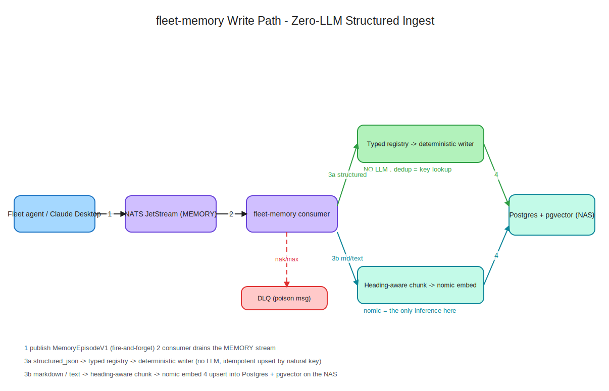

# Two-Spark Serving — Research & References

**Purpose:** Annotated reference for running inference across a stacked pair of NVIDIA DGX Spark (GB10) units — multi-node tensor parallelism for large models, the single-node multi-model swap stack, and the layered front door that combines them. Companion to `../../decisions/DECISION-DF-004-two-spark-serving-topology-unified-front-door.md` and the single-node baseline in `dark-factory-economics-and-model-serving.md`.
**Compiled:** 2026-06-18 (Claude Desktop research session). The DGX Spark space moves weekly — treat all throughput numbers as point-in-time, captured at this date.

---

## Key findings at a glance

**Stacking = capacity, not speed.**
- Two nodes do not fuse into one 256 GB GPU. Tensor parallelism splits each layer's matrices across the boxes; activations cross the QSFP link every forward pass. What you gain is the ability to load a model whose weights + KV exceed one node. (corti)
- The ConnectX-7 on GB10 is wired as two PCIe Gen5 x4 links, not one x8; full 200 Gb needs both x4 paths aggregated. Each physical port shows two Linux interface names (four total for two ports) — use the `enp1...` names. (corti; NVIDIA Sync docs)
- A ~120B model that fits on one node: ~35–50 tok/s single-stream on one box, ~55–75 stacked, gains mostly under concurrency. (corti)
- DeepSeek-V4-Flash (official FP8, ~149 GB, TP=2): ~40 tok/s decode warm single-stream; ~6 min cold start; long-context cold prefill weak (~53s TTFT @32K, ~250s @128K); decode collapses under concurrency + depth. (forum recipe thread)

**The two field patterns are separate.**
- Single-node multi-model fleet (LiteLLM + llama-swap + vLLM/llama.cpp/Ollama, 10+ models, swap-to-fit) — well documented, but essentially one lineage (martinB78 -> Dre Dyson -> dasroot).
- Two-node single-model TP (one big model across the boxes) — NVIDIA playbooks + forum recipes + build logs.
- The union (swap pool + TP model coexisting across two nodes behind one front door) did not surface — that is the gap DECISION-DF-004 occupies. (Not proof of non-existence; just absent from a focused search.)

**Bring-up gotchas the community already paid for.**
- Update CX-7 / mlx5 firmware + `dgx-spark-mlnx-hotplug` first; OTA April 2026+.
- Same physical port on both ends or the link won't come up; verify with `ibdev2netdev`.
- Pin NCCL / UCX / GLOO / TP socket interfaces to the QSFP link or traffic falls back to the slow NIC; verify with `all_gather_perf` before model load.
- Pin the exact vLLM commit (GB10 validation is commit-specific, not a branch); `--no-ray` / `mp` backend fits full context and is marginally faster than Ray.
- Firmware can hard-power-off the box under heavy GPU load; mitigate by lowering GPU clock (`nvidia-smi -lgc 200,2150`).
- These recipes take GB (not %) for `--gpu-memory-utilization`; the unified-memory allocator may not free promptly between model swaps.

---

## Diagrams

Rendered SVGs live in `diagrams/` (clean-line renderings of the architecture; an editable `.excalidraw` source sits beside each one).

**Two-Spark fleet serving architecture** — the layered topology: clients hit one LiteLLM front door, which fans out to the llama-swap pool (plus always-on nomic) on Node A and a vLLM TP=2 proposer spanning both nodes; Postgres + pgvector lives on the NAS.

**Request routing — two paths, one front door** — Path A swaps a fleet model in on a single node; Path B brings up the cross-node TP proposer. Same proxy instance, different backend.

**fleet-memory write path** — zero-LLM structured ingest: structured payloads go straight to the deterministic writer (no model in the loop), and only markdown/text touches nomic for embedding before landing in Postgres.

## NVIDIA official

- DGX Spark / GB10 forum (category index) — https://forums.developer.nvidia.com/c/accelerated-computing/dgx-spark-gb10/dgx-spark-gb10/721
- Connect Two Sparks (build.nvidia.com playbook) — https://build.nvidia.com/spark/connect-two-sparks/stacked-sparks
- vLLM on stacked Sparks (build.nvidia.com) — https://build.nvidia.com/spark/vllm/stacked-sparks · instructions: https://build.nvidia.com/spark/vllm/instructions
- Spark clustering guide — https://docs.nvidia.com/dgx/dgx-spark/spark-clustering.html · User Guide PDF: https://docs.nvidia.com/dgx/dgx-spark/dgx-spark.pdf
- NVIDIA Sync "Cluster Assistant" (GUI for the CX-7 mesh + passwordless SSH) — https://docs.nvidia.com/sync/latest/cluster-assistant.html
- dgx-spark-playbooks (DeepWiki): Multi-Node Setups — https://deepwiki.com/NVIDIA/dgx-spark-playbooks/7-multi-node-setups · Connecting Two Sparks — https://deepwiki.com/NVIDIA/dgx-spark-playbooks/7.1-connecting-two-sparks · vLLM Ray Cluster — https://deepwiki.com/NVIDIA/dgx-spark-playbooks/7.3-vllm-ray-cluster
- vLLM project blog — vLLM on DGX Spark (architecture, NVFP4 MoE, unified-memory behaviour) — https://vllm-project.github.io/2026/06/01/vllm-dgx-spark.html

## Two-node TP recipes & benchmarks (forum)

- **DeepSeek-V4-Flash official FP8 across 2x Spark, TP=2, MTP, 200K ctx — recipe + numbers (canonical thread)** — https://forums.developer.nvidia.com/t/deepseek-v4-flash-official-fp8-running-across-2x-dgx-spark-tp-2-mtp-200k-ctx-recipe-numbers/370309
- Deepseek v4 Flash on 2 Nodes — https://forums.developer.nvidia.com/t/deepseek-v4-flash-on-2-nodes/368916
- DeepSeek V4 Flash 1M ctx on 2x Spark — custom Sparkrun recipe — https://forums.developer.nvidia.com/t/deepseek-v4-flash-1-048-576-context-on-2x-dgx-spark-custom-sparkrun-recipe/373206
- MiMo-V2.5-NVFP4 on 2x Spark cluster — https://forums.developer.nvidia.com/t/mimo-v2-5-nvfp4-on-2x-spark-cluster-recipe-findings-fixes-benchmarks/370459
- MiniMax M3 NVFP4 for quad Spark — https://forums.developer.nvidia.com/t/minimax-m3-nvfp4-for-quad-dgx-spark/372123
- **Multi-node inference crash on GB10 (NCCL timeouts, 0x51 mem alloc; Qwen 122B & Nemotron 120B) — failure-mode reference** — https://forums.developer.nvidia.com/t/multi-node-inference-crash-on-blackwell-gb10-memory-allocation-0x51-nccl-timeouts-tested-on-qwen-122b-nemotron-120b/363989
- Multi-node vLLM with Docker Compose — https://forums.developer.nvidia.com/t/multi-node-vllm-on-dgx-spark-with-docker-compose/364969
- DGX Spark hard power-off under GPU load (firmware) — https://forums.developer.nvidia.com/t/dgx-spark-gb10-reproducibly-hard-powers-off-under-gpu-load-fully-updated-zero-crash-capture/373251
- Best speed for Qwen 3.6 27B without quantizing (one-model workhorse thread) — https://forums.developer.nvidia.com/t/whats-the-best-speed-we-can-get-with-qwen-3-6-27b-without-quantizing/367561

## Single-node multi-model fleet (LiteLLM + llama-swap) — the "real-world fleet" lineage

- NVIDIA forum: Running a Full LLM Stack (App -> LiteLLM -> llama-swap -> vLLM/llama.cpp/Ollama) — the origin thread — https://forums.developer.nvidia.com/t/running-a-full-llm-stack-on-dgx-spark-gb10-your-application-litellm-llama-swap-vllm-llama-cpp-ollama/367580
- **martinB78 reference repo (our original source)** — https://github.com/mARTin-B78/dgx-spark_lite-llm_llama-swap_vllm_llama-cpp_ollama
- Dre Dyson series (the tutorial layer built over the martinB78 repo):
  - Production-ready multi-model stack — https://dredyson.com/how-i-built-a-production-ready-multi-model-llm-stack-on-a-single-nvidia-dgx-spark-gb10-a-saas-founders-complete-step-by-step-guide-to-running-litellm-llama-swap-vllm-llama-cpp-and-ollam/
  - 10+ models / advanced config (memory math; the MoE allocator-not-freeing bug; `--network container:llama-swap`) — https://dredyson.com/how-i-mastered-running-a-full-multi-model-llm-stack-on-dgx-spark-gb10-advanced-litellm-llama-swap-vllm-llama-cpp-ollama-configuration-guide-with-dynamic-vram-orchestration-for-10-models/
  - FinOps / cut cloud bill ~90% — https://dredyson.com/how-i-cut-our-cloud-llm-bill-by-90-using-a-full-multi-model-stack-on-nvidia-dgx-spark-gb10-litellm-llama-swap-vllm-llama-cpp-ollama-a-finops-complete-step-by-step-configuration-and-cos/
  - 5 critical mistakes (CPU-pinning LiteLLM vs llama-swap; Docker networking) — https://dredyson.com/5-critical-mistakes-everyone-makes-with-running-a-full-llm-stack-on-dgx-spark-gb10-your-application-litellm-llama-swap-vllm-llama-cpp-ollama-and-how-to-fix-them-before-you-lose-your-mind/
  - Beginner setup guide — https://dredyson.com/how-to-run-a-full-llm-stack-on-dgx-spark-gb10-a-complete-beginners-step-by-step-setup-guide-with-litellm-llama-swap-vllm-llama-cpp-and-ollama/
  - 5-minute fix guide — https://dredyson.com/fix-running-a-full-llm-stack-on-dgx-spark-gb10-your-application-litellm-llama-swap-vllm-llama-cpp-ollama-in-under-5-minutes-actually-works/
- dasroot: Mastering Multi-Model Stacks with Llama-Swap (matrix groups; DSL swap logic) — https://dasroot.net/posts/2026/05/mastering-multi-model-stacks-llama-swap/
- calico88x/DGX-Model-Manager (web UI orchestrating LiteLLM + SGLang/vLLM/llama.cpp/Ollama; control panel, never in the request path) — https://github.com/calico88x/DGX-Model-Manager

## Build logs / explainers

- corti: Two Sparks, One Cluster (capacity mental model; PCIe x4 x2 quirk; stacked numbers; 405B-class claim) — https://corti.com/two-sparks-one-cluster-why-stacking-nvidia-dgx-spark-units-unlocks-local-frontier-scale-inference/
- Michael Peres (Medium): Two DGX Sparks -> LLM cluster with vLLM, Ray, Qwen3.6 (ships an architecture diagram) — https://medium.com/@michaelperes1/turning-two-dgx-sparks-into-a-local-llm-cluster-with-vllm-ray-and-qwen3-6-7eb2a6e04ade
- Doran Gao (Medium): Connecting two Sparks via 200Gb/s RoCE (network setup; NCCL; automation scripts) — https://medium.com/@dorangao/connecting-two-dgx-spark-systems-via-200gb-s-roce-network-for-multi-node-gpu-training-50d67d3630a5
- NADDOD: How to deploy DGX Spark (cabling; direct vs switch topologies) — https://www.naddod.com/blog/how-to-deploy-nvidia-dgx-spark · https://naddod.medium.com/how-to-deploy-nvidia-dgx-spark-7aa4d8151346
- Kubesimplify: Anatomy of an LLM inference request on DGX Spark (prefill/decode/KV; memory-bandwidth as the lever) — https://blog.kubesimplify.com/day-2-anatomy-of-an-llm-inference-request-from-prompt-to-answer-step-by-step
- Thomas P. Braun / Avarok: DGX Spark, Nemotron3, NVFP4 — 65+ tps (local PDF in this folder)

## Repos / engines

- mostlygeek/llama-swap (the swap-to-fit front door) — https://github.com/mostlygeek/llama-swap
- eugr/spark-vllm-docker (dual-Spark vLLM; recipes incl. DeepSeek-V4-Flash; `--no-ray`, fastsafetensors, GB-based gpu-mem-util; the `nvidia-smi -lgc` power-off mitigation) — https://github.com/eugr/spark-vllm-docker · DeepSeek recipe PR #219 — https://github.com/eugr/spark-vllm-docker/pull/219 · configurable repo URLs PR #244 — https://github.com/eugr/spark-vllm-docker/pull/244
- mark-ramsey-ri/vllm-dgx-spark (1-to-N Sparks; 41 model presets; auto IB/interface detection; same code path single/2/3+ nodes) — https://github.com/mark-ramsey-ri/vllm-dgx-spark
- tonyd2wild/deepseek-v4-flash-dual-spark-recipe (the reproducible 2x recipe from the canonical thread) — https://github.com/tonyd2wild/deepseek-v4-flash-dual-spark-recipe
- jasl/vllm fork (DeepSeek-V4-Flash GB10 enablement) — https://github.com/jasl/vllm
- llama.cpp PR #17570 (native Anthropic `/v1/messages` — the change that made llama.cpp a drop-in for Claude-protocol clients) — https://github.com/ggml-org/llama.cpp/pull/17570

## Serving-layer tooling

- LiteLLM docs — https://docs.litellm.ai/ · docker quick start — https://docs.litellm.ai/docs/proxy/docker_quick_start · routing / load-balancing / fallbacks — https://docs.litellm.ai/docs/routing-load-balancing · config.yaml spec — https://docs.litellm.ai/docs/proxy/configs
- Sparkrun — https://sparkrun.dev · CLI overview — https://sparkrun.dev/cli/overview/ · proxy gateway — https://sparkrun.dev/tutorials/proxy-gateway/ · multi-node TP — https://sparkrun.dev/tutorials/multi-node/ · repo — https://github.com/spark-arena/sparkrun
- spark-arena.com — community GB10 benchmarks / leaderboard — https://spark-arena.com · https://spark-arena.com/leaderboard

## Related local docs

- `../../decisions/DECISION-DF-004-two-spark-serving-topology-unified-front-door.md` — the decision this research backs
- `../../decisions/DECISION-DF-001-local-first-inference-on-dark-factory-critical-path.md` — the single-node front-door decision DF-004 evolves
- `dark-factory-economics-and-model-serving.md` — single-node baseline + the April cost analysis
- `llama-swap-config.yaml`, `llama-swap-setup.md` — single-node config + setup guide
- `gb10-memory-budget-and-macbook-offload.md`, `gb10-model-requirements-matrix.md` — memory budgeting + model footprints
- `AUTOBUILD-ON-LLAMA-SWAP-findings.md` — the §9.5–9.8 consolidation findings referenced by fleet-memory

---

*Compiled 2026-06-18. Paraphrased summaries only — follow the links for the originals; numbers are point-in-time.*
