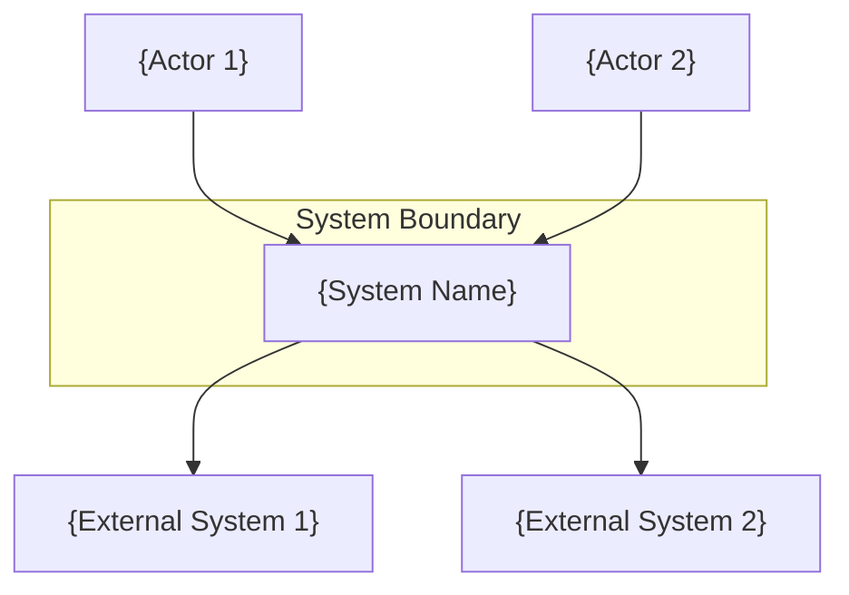
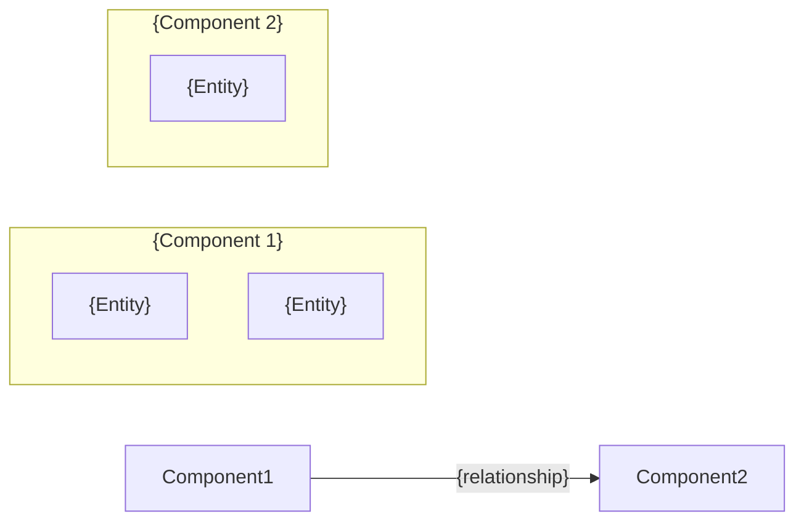

# Feature: /system-plan Command

> **Feature ID**: FEAT-SP-001
> **Priority**: P0 (Highest leverage addition — bridges requirements and execution)
> **Estimated Effort**: 3-5 days
> **Dependencies**: Spec 3 (FEAT-GE-001 — Graphiti entity additions for `role_constraints`, `quality_gate_configs`)

---

## Summary

Add an interactive architecture planning command (`/system-plan`) that establishes and maintains system-level context in Graphiti. This is the missing third specialisation in the GuardKit command hierarchy — where `/task-review` operates at code level and `/feature-plan` at feature level, `/system-plan` operates at system/architecture level. It produces queryable knowledge that anchors all downstream planning and execution, preventing the "locally correct but globally wrong" problem identified in AutoBuild retrospectives.

---

## Current State

- GuardKit operates at **task and feature level** only — no project or system level knowledge
- The human developer acts as substitute for system-level context, creating a bottleneck for multi-project work
- AutoBuild coach reviews individual tasks but has no anchoring in system components, service relationships, domain models, or ADRs
- `/feature-plan` decomposes features without awareness of system architecture, leading to tasks that "go in the wrong direction"
- TASK-REV-1505 identified 5 of 11 context loss scenarios unaddressed by current design
- No mechanism for capturing or querying architectural decisions
- Project switching requires mentally reloading context that should live in queryable knowledge

### The Command Hierarchy Gap

```
/task-review    → "Is this implementation correct?"      → Code/test level
/feature-plan   → "How should we decompose this?"        → Feature/task level  
     ???        → "How does this fit the bigger picture?" → System/architecture level
```

`/system-plan` fills the `???` slot, completing the planning hierarchy.

---

## Command Design

### Arguments and Syntax

```bash
/system-plan "project or topic description" [--mode=MODE] [--focus=FOCUS] [--no-questions] [--defaults]
```

| Argument | Required | Description |
|----------|----------|-------------|
| `"description"` | Yes | Project name or architectural topic (e.g., `"Power of Attorney platform"`, `"authentication redesign"`) |
| `--mode=MODE` | No | Override auto-detected mode: `setup`, `refine`, `review` |
| `--focus=FOCUS` | No | Narrow session scope: `domains`, `services`, `decisions`, `crosscutting`, `all` |
| `--no-questions` | No | Skip interactive clarification (use for automation) |
| `--defaults` | No | Use clarification defaults without prompting |
| `--context path/to/file.md` | No | Explicitly include additional context files |

### Mode Auto-Detection

**Design Decision**: The command infers its mode from the state of existing architecture context in Graphiti, rather than requiring the user to specify. This follows the principle of least ceremony.

```python
async def detect_mode(project_id: str, graphiti_client: "GraphitiClient") -> str:
    """
    Auto-detect the appropriate planning mode.
    
    - setup:  No architecture context exists for this project
    - refine: Architecture context exists, user wants to update it
    - review: Architecture context exists, user is evaluating a change
    
    Uses graceful degradation: defaults to "setup" if Graphiti unavailable.
    """
    sp_graphiti = SystemPlanGraphiti(graphiti_client, project_id)
    has_architecture = await sp_graphiti.has_architecture_context()
    
    if not has_architecture:
        return "setup"
    
    # Default to refine when architecture exists
    # User can override to review with --mode=review
    return "refine"
```

**User override**: `--mode=review` forces review mode even when the system would default to refine. This is useful when evaluating a proposed change against existing architecture rather than updating it.

**Transparent mode display**: The command always shows which mode was selected and why:

```
/system-plan "Power of Attorney platform"

🏗️ Mode: setup (no existing architecture context found)
   To refine existing architecture, run /system-plan after initial setup.
```

or:

```
/system-plan "authentication redesign" --mode=review

🔍 Mode: review (evaluating change against existing architecture)
   Found: 4 bounded contexts, 7 ADRs, 12 BDD scenarios
```

---

### Interactive Flow

The interactive flow follows the proven pattern from `/task-review` and `/feature-plan`: structured clarification phases with decision checkpoints. Each mode has a different flow optimised for its purpose.

#### Phase 0: Context Loading (All Modes)

Before any interaction, load existing context:

```python
async def load_system_context(
    client: "GraphitiClient", project_id: str, mode: str
) -> "SystemContext":
    """
    Load all available architecture context for the planning session.
    
    Uses SystemPlanGraphiti for architecture queries with proper
    graceful degradation and group ID resolution.
    """
    sp = SystemPlanGraphiti(client, project_id)
    context = SystemContext()
    
    if mode != "setup" and sp._available:
        # Load existing architecture via semantic search
        summary = await sp.get_architecture_summary()
        if summary:
            context.architecture_facts = summary.get("architecture_facts", [])
            context.decision_facts = summary.get("decision_facts", [])
        
        # Load project overview (separate known project group)
        try:
            overview_group = client.get_group_id("project_overview")
            context.overview_facts = await client.search(
                query="project purpose scope",
                group_ids=[overview_group],
                num_results=5,
            )
        except Exception:
            context.overview_facts = []
    
    return context
```

#### Mode: Setup (First-Time Architecture Planning)

The setup flow walks through architecture concerns in a structured sequence. Each category produces both markdown documentation and Graphiti episodes.

**Interactive question sequence:**

```
Phase 1: Project Orientation
━━━━━━━━━━━━━━━━━━━━━━━━━━━━━━━━━━━━━━━━━━━━━━━━━━━━━━━━━━━━━━
📋 SYSTEM PLANNING: Power of Attorney platform
━━━━━━━━━━━━━━━━━━━━━━━━━━━━━━━━━━━━━━━━━━━━━━━━━━━━━━━━━━━━━━

Category 1: Domain & Methodology Discovery
  Q1. What does this system do? (one paragraph)
  Q2. Who are the primary users/actors?
  Q3. What are the core business processes?
  Q4. Are there regulatory or compliance requirements?
  Q5. What architectural methodology best fits this project?

      [M]odular — Components/modules with clear responsibilities
         Best for: CLI tools, simple APIs, CRUD apps, internal tools
      [L]ayered — Traditional layered architecture (UI/service/data)
         Best for: Web apps, standard enterprise apps
      [D]omain-Driven Design — Bounded contexts, aggregates, domain events
         Best for: Complex business domains, regulatory systems, 
         multiple teams, rich domain logic
      [E]vent-Driven — Event-based communication, eventual consistency
         Best for: Distributed systems, real-time processing
      [N]ot sure — Let the questions guide the choice

      Default: [M]odular

Category 2: System Structure
  
  Base questions (all methodologies):
    Q6. What are the major components/areas of the system?
        (e.g., "User Management, Billing, Notifications")
    Q7. What are the key entities/data models in each component?
    Q8. Which components need to communicate with each other?

  DDD-specific questions (only when methodology = DDD):
    Q6d. How do these map to bounded contexts?
         (same entity name in different contexts = context boundary)
    Q7d. What are the aggregate roots in each context?
    Q8d. Are there shared kernels or anti-corruption layers needed?
    Q9d. What domain events flow between contexts?

Category 3: Service/Module Relationships  
  Q9. How are the components deployed? 
      (monolith, modular monolith, microservices)
  Q10. What communication patterns? (sync REST, async events, shared DB)
  Q11. What external systems or APIs are integrated?

Category 4: Technology Decisions
  Q12. What's the primary tech stack? (languages, frameworks, databases)
  Q13. What infrastructure/deployment model? (cloud, on-prem, hybrid)
  Q14. Are there any locked-in technology choices and why?

Category 5: Cross-Cutting Concerns
  Q15. Authentication/authorization approach?
  Q16. Logging, monitoring, observability strategy?
  Q17. Error handling patterns?
  Q18. Data migration or backward compatibility requirements?

Category 6: Constraints and Non-Functional Requirements
  Q19. Performance requirements (latency, throughput)?
  Q20. Scalability expectations?
  Q21. Security constraints beyond auth?
  Q22. Any budget, timeline, or team constraints affecting architecture?
```

**Question adaptation**: Not all questions are asked every time. The clarification engine adapts based on prior answers:

```python
class SetupQuestionAdapter:
    """Adapt question flow based on answers received."""
    
    def get_methodology(self, answers: dict) -> str:
        """Get selected methodology from Q5 answer."""
        return answers.get("q5_methodology", "modular")
    
    def should_ask_ddd_questions(self, answers: dict) -> bool:
        """Ask DDD questions only when user selected DDD methodology."""
        return self.get_methodology(answers) == "ddd"
    
    def should_ask_event_driven_questions(self, answers: dict) -> bool:
        """Ask event-driven questions when methodology is event-driven or DDD with events."""
        methodology = self.get_methodology(answers)
        return methodology in ("event_driven", "ddd")
    
    def should_ask_microservice_questions(self, answers: dict) -> bool:
        """Ask service communication only for distributed systems."""
        deployment = answers.get("q9_deployment", "")
        return deployment != "monolith"
    
    def get_categories(self, answers_so_far: dict) -> list:
        """Return categories to present, adapting to context."""
        categories = [
            "domain_and_methodology", # Always (includes methodology choice)
            "system_structure",       # Always (questions adapt to methodology)
            "service_relationships",  # Always
            "technology_decisions",   # Always
            "crosscutting_concerns",  # Always
            "constraints",           # Always
        ]
        return categories
    
    def get_questions_for_category(
        self, category: str, answers_so_far: dict
    ) -> list:
        """Return questions for a category, adapted to methodology and prior answers."""
        # Base questions always asked
        base = CATEGORY_QUESTIONS[category]
        
        # Add DDD-specific questions when methodology warrants it
        if category == "system_structure":
            if self.should_ask_ddd_questions(answers_so_far):
                base = base + DDD_SPECIFIC_QUESTIONS
        
        # Skip microservice-specific questions for monoliths
        if category == "service_relationships":
            if not self.should_ask_microservice_questions(answers_so_far):
                return [q for q in base if not q.microservice_only]
        
        return base
```

**Decision checkpoint after each category:**

After each category, the system summarises what it captured and offers a checkpoint:

```
━━━━━━━━━━━━━━━━━━━━━━━━━━━━━━━━━━━━━━━
✓ Category 2: System Structure
━━━━━━━━━━━━━━━━━━━━━━━━━━━━━━━━━━━━━━━

Example (Modular methodology — CLI tool):

Captured 3 components:
  • CLI Parser — command routing, argument validation, help text
  • Planning Engine — analysis, question flow, markdown generation
  • Graphiti Integration — read/write episodes, search, context retrieval

Communication:
  • CLI Parser → Planning Engine (invokes planning sessions)
  • Planning Engine → Graphiti Integration (persists architecture context)

[C]ontinue to next category | [R]evise this category | [S]kip remaining | [A]DR?

───────────────────────────────────────

Example (DDD methodology — PoA platform):

Captured 4 bounded contexts:
  • Attorney Management — donor, attorney, replacement attorney, certificate provider
  • Document Generation — LPA forms, instructions, preferences  
  • Financial Oversight — account access, transactions, spending limits (Moneyhub)
  • Compliance — OPG registration, identity verification, capacity assessment

Aggregate roots: Donor (Attorney Mgmt), LPADocument (Doc Gen), Account (Financial)
Communication:
  • Attorney Management ↔ Document Generation (attorney details in forms)
  • Financial Oversight ↔ Compliance (spending limit enforcement)
  • Financial Oversight → Moneyhub API (anti-corruption layer)
Domain events: DonorCreated, LPAFiled, TransactionFlagged

[C]ontinue to next category | [R]evise this category | [S]kip remaining | [A]DR?

[C]ontinue to next category | [R]evise this category | [S]kip remaining | [A]DR?

Your choice [C/R/S/A]: 
```

**ADR trigger (Key Design Decision #3)**: The `[A]DR?` option is available at every checkpoint. When selected, the system captures the architectural decision in ADR format inline, without leaving the planning session. This folds `/architecture-decision` into `/system-plan` as a natural output rather than a separate command.

```
Your choice [C/R/S/A]: A

━━━━━━━━━━━━━━━━━━━━━━━━━━━━━━━━━━━━━━━
📝 ARCHITECTURE DECISION RECORD
━━━━━━━━━━━━━━━━━━━━━━━━━━━━━━━━━━━━━━━

Title: Use anti-corruption layer for Moneyhub integration
Context: Financial Oversight needs Moneyhub account/transaction data
  but Moneyhub's domain model differs from our internal model.

Decision: Implement an ACL in the Financial Oversight bounded context
  that translates Moneyhub API responses to internal domain entities.

Consequences:
  + Isolates external API changes from core domain
  + Enables testing with mock Moneyhub responses
  - Additional translation layer adds complexity
  - Must maintain mapping as Moneyhub API evolves

Status: Accepted
━━━━━━━━━━━━━━━━━━━━━━━━━━━━━━━━━━━━━━━
✓ ADR-001 captured. Continuing to Category 3...
```

#### Mode: Refine (Update Existing Architecture)

Refine mode shows current state and asks targeted questions about what's changed:

```
/system-plan "Power of Attorney platform"

🔄 Mode: refine (existing architecture found)

Current architecture summary:
  • Methodology: DDD
  • 4 bounded contexts (Attorney Mgmt, Doc Gen, Financial, Compliance)
  • 7 ADRs (3 accepted, 2 superseded, 2 proposed)
  • 3 external integrations (Moneyhub, OPG, GOV.UK Verify)

━━━━━━━━━━━━━━━━━━━━━━━━━━━━━━━━━━━━━━━
📋 REFINEMENT SCOPE
━━━━━━━━━━━━━━━━━━━━━━━━━━━━━━━━━━━━━━━

What would you like to refine?

[C]omponents — Add, modify, or remove components/contexts
[S]ervice relationships — Update communication patterns  
[D]ecisions — Add new ADR or supersede existing
[T]echnology — Update stack or infrastructure decisions
[X]rosscutting — Modify shared concerns (auth, logging, etc.)
[A]ll — Full review of all categories

Your choice: 
```

When a specific area is selected, the system shows current state for that area and asks what's changed. The interaction is conversational rather than a full questionnaire — refine mode assumes the user knows what needs updating.

#### Mode: Review (Evaluate Against Architecture)

Review mode takes a proposed change and evaluates it against existing architecture:

```
/system-plan "add real-time notifications" --mode=review

🔍 Mode: review (evaluating against existing architecture)

Analyzing "add real-time notifications" against:
  • 4 bounded contexts (DDD methodology)
  • 7 ADRs  
  • 12 BDD scenarios

━━━━━━━━━━━━━━━━━━━━━━━━━━━━━━━━━━━━━━━
📊 IMPACT ANALYSIS
━━━━━━━━━━━━━━━━━━━━━━━━━━━━━━━━━━━━━━━

Affected components:
  ⚠️ Attorney Management — notification triggers for status changes
  ⚠️ Financial Oversight — alerts for transaction anomalies
  ℹ️ Compliance — audit logging of notifications sent

Relevant ADRs:
  🔒 ADR-003: All external communications must be auditable
  🔒 ADR-005: Async messaging via event bus, not direct calls

BDD scenarios at risk:
  ⚠️ attorney-status-updates.feature (3 scenarios)
  ⚠️ transaction-monitoring.feature (2 scenarios)

New decisions needed:
  ❓ WebSocket vs SSE vs polling for real-time delivery?
  ❓ Notification service as new component or within existing?
  ❓ Delivery guarantees (at-least-once, exactly-once)?

━━━━━━━━━━━━━━━━━━━━━━━━━━━━━━━━━━━━━━━
[P]roceed to plan (creates ADRs for decisions)
[F]eature-plan (decompose into tasks with this context)
[R]efine architecture first
[C]ancel

Your choice:
```

The `[F]eature-plan` option directly chains into `/feature-plan` with the review's architectural context pre-loaded — this is the primary integration point between system-level and feature-level planning.

---

### Graphiti Integration

#### Episode Structure (Key Design Decision #4)

Architecture context is stored as granular episodes for queryability. Each distinct piece of architectural knowledge is a separate episode.

> **Content Preservation Warning**: Graphiti extracts semantic facts via LLM, not verbatim content. The `search()` method returns extracted facts, not original text. Architecture context stored here is used for *semantic retrieval* ("what components relate to authentication?"), not verbatim document reconstruction. The authoritative source remains the markdown files in `docs/architecture/`.

#### Entity Definitions

All entities follow the GuardKit convention: `to_episode_body()` returns **domain data only**. The `GraphitiClient` injects `_metadata` (entity_id, source_hash, timestamps, etc.) automatically. See [ADR-GBF-001: Unified Episode Serialization](docs/architecture/ADR-GBF-001-unified-episode-serialization.md).

```python
from dataclasses import dataclass, field
from datetime import datetime
from typing import List, Optional
import json

@dataclass
class ComponentDef:
    """A system component (or bounded context in DDD methodology)."""
    
    name: str
    methodology: str  # "modular" | "layered" | "ddd" | "event_driven"
    description: str
    entities: List[str] = field(default_factory=list)
    responsibilities: List[str] = field(default_factory=list)
    dependencies: List[str] = field(default_factory=list)
    communication_patterns: List[str] = field(default_factory=list)
    # DDD-specific (populated only when methodology == "ddd")
    aggregate_roots: List[str] = field(default_factory=list)
    domain_events: List[str] = field(default_factory=list)
    context_mapping: Optional[str] = None
    has_external_deps: bool = False
    
    @property
    def entity_id(self) -> str:
        """Stable ID for upsert. Format: COMP-{slug}"""
        slug = self.name.lower().replace(" ", "-")[:30]
        return f"COMP-{slug}"
    
    @property
    def entity_type(self) -> str:
        return "bounded_context" if self.methodology == "ddd" else "component"
    
    def to_episode_body(self) -> dict:
        """Return domain data only. GraphitiClient injects _metadata."""
        body = {
            "name": self.name,
            "methodology": self.methodology,
            "description": self.description,
            "entities": self.entities,
            "responsibilities": self.responsibilities,
            "dependencies": self.dependencies,
            "communication_patterns": self.communication_patterns,
            "has_external_deps": self.has_external_deps,
        }
        if self.methodology == "ddd":
            body.update({
                "aggregate_roots": self.aggregate_roots,
                "domain_events": self.domain_events,
                "context_mapping": self.context_mapping,
            })
        return body


@dataclass
class SystemContextDef:
    """Top-level system context (C4 Level 1)."""
    
    name: str
    purpose: str
    methodology: str
    actors: List[str] = field(default_factory=list)
    deployment_model: str = "monolith"
    component_names: List[str] = field(default_factory=list)
    integrations: List[str] = field(default_factory=list)
    
    @property
    def entity_id(self) -> str:
        """One per project. Format: SYS-{slug}"""
        slug = self.name.lower().replace(" ", "-")[:30]
        return f"SYS-{slug}"
    
    def to_episode_body(self) -> dict:
        """Return domain data only. GraphitiClient injects _metadata."""
        return {
            "name": self.name,
            "purpose": self.purpose,
            "methodology": self.methodology,
            "actors": self.actors,
            "deployment_model": self.deployment_model,
            "components": self.component_names,
            "integrations": self.integrations,
        }


@dataclass
class CrosscuttingConcernDef:
    """A cross-cutting concern (auth, logging, error handling, etc.)."""
    
    name: str
    approach: str
    affected_components: List[str] = field(default_factory=list)
    constraints: List[str] = field(default_factory=list)
    
    @property
    def entity_id(self) -> str:
        """Format: XC-{slug}"""
        slug = self.name.lower().replace(" ", "-")[:30]
        return f"XC-{slug}"
    
    def to_episode_body(self) -> dict:
        """Return domain data only. GraphitiClient injects _metadata."""
        return {
            "name": self.name,
            "approach": self.approach,
            "affected_components": self.affected_components,
            "constraints": self.constraints,
        }


@dataclass
class ArchitectureDecision:
    """An Architecture Decision Record (ADR)."""
    
    number: int
    title: str
    status: str  # "proposed" | "accepted" | "superseded" | "deprecated"
    context: str
    decision: str
    consequences: dict  # {"positive": [...], "negative": [...]}
    date: datetime = field(default_factory=datetime.now)
    supersedes: Optional[str] = None
    
    @property
    def entity_id(self) -> str:
        """Format: ADR-SP-{number:03d} (SP = system-plan origin)"""
        return f"ADR-SP-{self.number:03d}"
    
    @property
    def slug(self) -> str:
        return self.title.lower().replace(" ", "-")[:40]
    
    def to_episode_body(self) -> dict:
        """Return domain data only. GraphitiClient injects _metadata."""
        return {
            "number": self.number,
            "title": self.title,
            "status": self.status,
            "context": self.context,
            "decision": self.decision,
            "consequences": self.consequences,
            "date": self.date.isoformat(),
            "supersedes": self.supersedes,
        }
```

#### Episode Group and ID Mapping

| Entity | Group (known project group) | Entity Type | Entity ID Format | Example |
|--------|----------------------------|-------------|-----------------|---------|
| Component | `project_architecture` | `component` | `COMP-{slug}` | `COMP-attorney-management` |
| Bounded Context | `project_architecture` | `bounded_context` | `COMP-{slug}` | `COMP-financial-oversight` |
| System Context | `project_architecture` | `system_context` | `SYS-{slug}` | `SYS-power-of-attorney-platform` |
| Crosscutting Concern | `project_architecture` | `crosscutting_concern` | `XC-{slug}` | `XC-authentication` |
| ADR | `project_decisions` | `architecture_decision` | `ADR-SP-{NNN}` | `ADR-SP-001` |

All groups above are **known project groups** in `graphiti_client.py`, meaning `client.get_group_id("project_architecture")` automatically returns `{project_id}__project_architecture`.

**Rationale for granularity**: One episode per component (rather than one giant architecture episode) enables precise retrieval. When `/feature-plan` asks "what components are relevant to authentication?", Graphiti can return just the relevant component rather than the entire architecture document.

#### Read/Write Patterns

```python
import json
import logging
from typing import Optional, List, Dict, Any

logger = logging.getLogger(__name__)


class SystemPlanGraphiti:
    """
    Graphiti operations for /system-plan.
    
    Follows GuardKit conventions:
    - Uses upsert_episode() with stable entity_id (not add_episode)
    - Entities provide to_episode_body() returning domain data only
    - GraphitiClient injects _metadata block automatically
    - All operations have graceful degradation
    - Uses client.get_group_id() for proper group prefixing
    
    See: graphiti-technical-reference.md, graphiti-storage-theory.md
    """
    
    def __init__(self, client: "GraphitiClient", project_id: str):
        self.client = client
        self.project_id = project_id
    
    @property
    def _available(self) -> bool:
        """Check if Graphiti is available for operations."""
        return self.client is not None and self.client.enabled
    
    # --- Write operations (setup and refine modes) ---
    
    async def upsert_component(self, component: ComponentDef) -> Optional[str]:
        """
        Create or update a component episode.
        
        Uses upsert_episode() with stable entity_id to prevent
        duplicates when /system-plan is run multiple times.
        """
        if not self._available:
            return None
        
        try:
            body = json.dumps(component.to_episode_body())
            result = await self.client.upsert_episode(
                name=f"Component: {component.name}",
                episode_body=body,
                group_id=self.client.get_group_id("project_architecture"),
                entity_id=component.entity_id,
                source="system_plan",
                entity_type=component.entity_type,
            )
            return result.uuid if result else None
        except Exception as e:
            logger.warning(f"Failed to upsert component {component.name}: {e}")
            return None
    
    async def upsert_adr(self, adr: ArchitectureDecision) -> Optional[str]:
        """Create or update an ADR episode."""
        if not self._available:
            return None
        
        try:
            body = json.dumps(adr.to_episode_body())
            result = await self.client.upsert_episode(
                name=f"ADR-{adr.number:03d}: {adr.title}",
                episode_body=body,
                group_id=self.client.get_group_id("project_decisions"),
                entity_id=adr.entity_id,
                source="system_plan",
                entity_type="architecture_decision",
            )
            return result.uuid if result else None
        except Exception as e:
            logger.warning(f"Failed to upsert ADR {adr.entity_id}: {e}")
            return None
    
    async def upsert_system_context(self, system: SystemContextDef) -> Optional[str]:
        """Create or update the top-level system context episode."""
        if not self._available:
            return None
        
        try:
            body = json.dumps(system.to_episode_body())
            result = await self.client.upsert_episode(
                name=f"System Context: {system.name}",
                episode_body=body,
                group_id=self.client.get_group_id("project_architecture"),
                entity_id=system.entity_id,
                source="system_plan",
                entity_type="system_context",
            )
            return result.uuid if result else None
        except Exception as e:
            logger.warning(f"Failed to upsert system context: {e}")
            return None
    
    async def upsert_crosscutting(self, concern: CrosscuttingConcernDef) -> Optional[str]:
        """Create or update a cross-cutting concern episode."""
        if not self._available:
            return None
        
        try:
            body = json.dumps(concern.to_episode_body())
            result = await self.client.upsert_episode(
                name=f"Cross-Cutting: {concern.name}",
                episode_body=body,
                group_id=self.client.get_group_id("project_architecture"),
                entity_id=concern.entity_id,
                source="system_plan",
                entity_type="crosscutting_concern",
            )
            return result.uuid if result else None
        except Exception as e:
            logger.warning(f"Failed to upsert crosscutting {concern.name}: {e}")
            return None
    
    # --- Read operations (all modes) ---
    
    async def has_architecture_context(self) -> bool:
        """
        Quick check: does any architecture context exist?
        Used for mode detection (setup vs refine).
        """
        if not self._available:
            return False
        try:
            arch_group = self.client.get_group_id("project_architecture")
            results = await self.client.search(
                query="system architecture",
                group_ids=[arch_group],
                num_results=1,
            )
            return len(results) > 0
        except Exception:
            return False
    
    async def get_architecture_summary(self) -> Optional[dict]:
        """
        Retrieve architecture context for display.
        
        Note: search() returns semantic facts extracted by Graphiti's LLM 
        pipeline, not the original episode_body content. Results are dicts:
        {"uuid", "fact", "name", "created_at", "valid_at", "score"}.
        """
        if not self._available:
            return None
        
        try:
            arch_group = self.client.get_group_id("project_architecture")
            decisions_group = self.client.get_group_id("project_decisions")
            
            arch_facts = await self.client.search(
                query="system components architecture structure",
                group_ids=[arch_group],
                num_results=20,
            )
            decision_facts = await self.client.search(
                query="architecture decisions ADR",
                group_ids=[decisions_group],
                num_results=20,
            )
            return {
                "architecture_facts": arch_facts,
                "decision_facts": decision_facts,
                "has_architecture": len(arch_facts) > 0,
            }
        except Exception as e:
            logger.warning(f"Failed to load architecture summary: {e}")
            return None
    
    async def get_relevant_context_for_topic(
        self, topic: str, num_results: int = 10
    ) -> List[Dict[str, Any]]:
        """
        Retrieve architecture facts relevant to a specific topic.
        
        Used by /feature-plan to load context for planning.
        Returns semantic facts, scored by relevance.
        """
        if not self._available:
            return []
        
        try:
            return await self.client.search(
                query=topic,
                group_ids=[
                    self.client.get_group_id("project_architecture"),
                    self.client.get_group_id("project_decisions"),
                ],
                num_results=num_results,
            )
        except Exception as e:
            logger.warning(f"Failed to search architecture context: {e}")
            return []
```

> **Important**: `search()` returns `List[Dict[str, Any]]` where each dict contains `{"uuid", "fact", "name", "created_at", "valid_at", "score"}`. The `fact` field contains Graphiti's **extracted semantic fact**, not the original `episode_body`. This is by design — Graphiti is a knowledge graph, not a document store. Authoritative content lives in `docs/architecture/*.md` files.

---

### Output Artefacts

**Design Decision #5**: Multiple focused documents rather than one monolith. Each document is self-contained and authoritative. Graphiti provides queryability on top of the markdown.

#### File Structure

```
docs/architecture/
├── system-context.md          # C4 Level 1: system context diagram as markdown
├── components.md              # Component map (or bounded-contexts.md for DDD)
├── crosscutting-concerns.md   # Auth, logging, error handling, observability
├── decisions/
│   ├── ADR-001-moneyhub-acl.md
│   ├── ADR-002-event-bus.md
│   └── ...
└── ARCHITECTURE.md            # Index file linking to all architecture docs
```

#### system-context.md Template

```markdown
# System Context: {Project Name}

> Generated by `/system-plan` on {date}
> Last refined: {date}

## Purpose

{One paragraph describing what the system does and why}

## Actors

| Actor | Role | Interaction |
|-------|------|-------------|
| {name} | {role} | {how they interact with the system} |

## System Context Diagram (C4 Level 1)



## External Integrations

| System | Purpose | Protocol | Bounded Context |
|--------|---------|----------|-----------------|
| {name} | {why} | {REST/events/etc} | {which context owns it} |

## Key Constraints

- {constraint 1}
- {constraint 2}
```

#### bounded-contexts.md / components.md Template

The filename and content adapt to the chosen methodology:

- **Modular/Layered/Event-driven**: `docs/architecture/components.md`
- **DDD**: `docs/architecture/bounded-contexts.md`

```markdown
# {Component Map | Bounded Context Map}: {Project Name}

> Generated by `/system-plan` on {date}
> Methodology: {methodology}

## {Context | Component} Map



## {Components | Bounded Contexts}

### {Component Name}

**Responsibility**: {what this component owns}

**Entities**:
- {Entity 1} — {description}
- {Entity 2} — {description}

**Communication**:
- → {Other Component}: {pattern} ({sync/async}, {protocol})
- ← {Other Component}: {pattern}

{DDD-only section, included when methodology = DDD:}
**Aggregate Roots**: {list}
**Domain Events Published**: {list}
**Domain Events Consumed**: {list}
**Context Mapping**: {upstream/downstream/partnership/ACL}

**External Dependencies**:
- {External system}: via {adapter/ACL/direct/etc}
```

#### ADR Template (Michael Nygard format)

```markdown
# ADR-{NNN}: {Title}

> Status: {Proposed | Accepted | Superseded | Deprecated}
> Date: {YYYY-MM-DD}
> Supersedes: {ADR-NNN if applicable}

## Context

{What is the issue that we're seeing that is motivating this decision?}

## Decision

{What is the change that we're proposing and/or doing?}

## Consequences

### Positive
- {consequence}

### Negative  
- {consequence}

### Risks
- {risk}
```

---

## Integration Points

### With /feature-plan (Key Design Decision #6)

**Principle**: Markdown is authoritative, Graphiti provides queryability. `/feature-plan` uses both.

When `/feature-plan` runs, it queries Graphiti for architecture context relevant to the feature being planned. This enriches the planning prompt so that task decomposition respects component boundaries, existing ADRs, and cross-cutting concerns.

```python
# In feature-plan's context loading phase
async def load_architecture_context(
    client: "GraphitiClient",
    project_id: str,
    feature_description: str,
    num_results: int = 10
) -> "ArchitectureContext":
    """
    Load architecture context relevant to a feature.
    
    Queries Graphiti using the feature description as semantic search.
    Returns scored facts from the knowledge graph.
    
    Note: search() returns semantic facts, not original episode bodies.
    We run separate targeted searches to get architecture-relevant 
    and decision-relevant facts, since Graphiti extracts and returns
    facts (not structured objects we can filter by type).
    """
    sp_graphiti = SystemPlanGraphiti(client, project_id)
    
    if not sp_graphiti._available:
        return ArchitectureContext.empty()
    
    try:
        arch_group = client.get_group_id("project_architecture")
        decisions_group = client.get_group_id("project_decisions")
        
        # Separate searches with targeted queries for better relevance
        component_facts = await client.search(
            query=f"components modules for {feature_description}",
            group_ids=[arch_group],
            num_results=num_results,
        )
        
        decision_facts = await client.search(
            query=f"architecture decisions constraints for {feature_description}",
            group_ids=[decisions_group],
            num_results=5,
        )
        
        crosscutting_facts = await client.search(
            query="cross-cutting concerns authentication logging error handling",
            group_ids=[arch_group],
            num_results=5,
        )
        
        return ArchitectureContext(
            component_facts=component_facts,
            decision_facts=decision_facts,
            crosscutting_facts=crosscutting_facts,
        )
    except Exception as e:
        logger.warning(f"Failed to load architecture context: {e}")
        return ArchitectureContext.empty()


@dataclass
class ArchitectureContext:
    """Architecture context assembled from Graphiti semantic facts."""
    
    component_facts: List[Dict[str, Any]] = field(default_factory=list)
    decision_facts: List[Dict[str, Any]] = field(default_factory=list)
    crosscutting_facts: List[Dict[str, Any]] = field(default_factory=list)
    
    @classmethod
    def empty(cls) -> "ArchitectureContext":
        return cls()
    
    @property
    def has_context(self) -> bool:
        return bool(self.component_facts or self.decision_facts)
    
    def format_for_prompt(self, max_tokens: int = 2000) -> str:
        """Format facts for prompt injection, respecting token budget."""
        sections = []
        
        if self.component_facts:
            facts = "\n".join(
                f"  - {f['fact']}" 
                for f in self.component_facts 
                if f.get("score", 0) > 0.5
            )
            sections.append(f"## Relevant Components\n{facts}")
        
        if self.decision_facts:
            facts = "\n".join(
                f"  - {f['fact']}" 
                for f in self.decision_facts 
                if f.get("score", 0) > 0.5
            )
            sections.append(f"## Architecture Decisions\n{facts}")
        
        if self.crosscutting_facts:
            facts = "\n".join(
                f"  - {f['fact']}" 
                for f in self.crosscutting_facts 
                if f.get("score", 0) > 0.5
            )
            sections.append(f"## Cross-Cutting Concerns\n{facts}")
        
        return "\n\n".join(sections)
```

**What this enables in `/feature-plan`**:

```
/feature-plan "Add attorney notification system"

[Graphiti] Architecture context loaded:
  ✓ Relevant components: Attorney Management, Compliance
  ✓ Relevant ADRs: ADR-003 (audit all communications), ADR-005 (async messaging)
  ✓ Crosscutting: authentication, audit logging

Planning with architecture awareness:
  • Tasks assigned to correct components/contexts
  • ADR constraints included in task descriptions
  • Cross-cutting concerns flagged in acceptance criteria
```

**Fallback when no architecture exists**: If `/system-plan` hasn't been run, `/feature-plan` proceeds without architecture context (graceful degradation). A suggestion is shown:

```
[Graphiti] No architecture context found.
   💡 Tip: Run /system-plan "{project}" to establish architecture context
   for better task decomposition.
```

### With AutoBuild Coach (Key Design Decision #7)

The coach receives architecture context automatically during player-coach validation loops. This prevents the coach from approving changes that violate architectural constraints.

```python
# In feature-build coach context assembly
async def build_coach_context(
    client: "GraphitiClient",
    project_id: str,
    feature_id: str,
    task: dict,
    complexity: int
) -> "CoachContext":
    """
    Assemble coach context, including architecture when complexity warrants it.
    
    Architecture context is loaded from Graphiti semantic facts and formatted
    for prompt injection into the coach system prompt.
    """
    context = CoachContext()
    
    # Always include role constraints and quality gates
    context.role_constraints = await load_role_constraints()
    context.quality_gates = await load_quality_gate_configs(task["task_type"])
    
    # Include architecture context for complex tasks
    if complexity >= ARCHITECTURE_CONTEXT_THRESHOLD:
        arch = await load_architecture_context(
            client=client,
            project_id=project_id,
            feature_description=task["description"],
            num_results=COMPLEXITY_TO_RESULTS[complexity],
        )
        if arch.has_context:
            context.architecture_prompt = arch.format_for_prompt(
                max_tokens=COMPLEXITY_TOKEN_BUDGETS[complexity]
            )
    
    return context
```

**Coach prompt integration**:

```
You are the Coach in a player-coach development loop.

## Architecture Context (from /system-plan)
{architecture_prompt}

## Validation Checklist
- [ ] Changes respect component boundaries
- [ ] No ADR violations
- [ ] Cross-cutting concerns addressed (auth, logging, error handling)
- [ ] BDD scenarios not broken
```

> The `{architecture_prompt}` is produced by `ArchitectureContext.format_for_prompt()`, which assembles scored semantic facts from Graphiti into a readable prompt section. When no architecture context exists, this section is omitted entirely.

### With /system-overview (Spec 2)

`/system-overview` is the read-only companion to `/system-plan`. It queries the same Graphiti data but presents it as a concise summary without interactive modification.

```
/system-overview

📊 Power of Attorney Platform
━━━━━━━━━━━━━━━━━━━━━━━━━━━━━━━━━━━━━━━
Methodology: DDD
Components: 4 bounded contexts
  • Attorney Management (6 entities)
  • Document Generation (4 entities)
  • Financial Oversight (5 entities, Moneyhub integration)
  • Compliance (3 entities)

Architecture Decisions: 7 (3 accepted, 2 proposed, 2 superseded)
BDD Coverage: 12 scenarios (8 passing, 4 pending)
Last updated: 2026-02-05

💡 Run /system-plan to refine | /impact-analysis TASK-XXX for pre-task check
```

### Complexity Gating (Key Design Decision #8)

Not every task needs system-level context. Simple bug fixes shouldn't load full architecture. The complexity scoring determines when architecture context is included.

```python
# Complexity thresholds for architecture context inclusion
ARCHITECTURE_CONTEXT_THRESHOLD = 4  # Complexity score 1-10

# Token budgets by complexity tier
ARCH_TOKEN_BUDGETS = {
    "low":    0,     # Complexity 1-3: no architecture context
    "medium": 1000,  # Complexity 4-6: relevant components + ADRs
    "high":   2000,  # Complexity 7-8: full architecture context
    "critical": 3000, # Complexity 9-10: everything including BDD scenarios
}

def get_arch_token_budget(complexity: int) -> int:
    if complexity <= 3:
        return ARCH_TOKEN_BUDGETS["low"]
    elif complexity <= 6:
        return ARCH_TOKEN_BUDGETS["medium"]
    elif complexity <= 8:
        return ARCH_TOKEN_BUDGETS["high"]
    else:
        return ARCH_TOKEN_BUDGETS["critical"]
```

**Task types and architecture loading**:

| Task Type | Default Complexity | Architecture Context |
|-----------|-------------------|---------------------|
| `scaffolding` | 2-3 | Never loaded |
| `bugfix` | 3-5 | Loaded if complexity ≥ 4 |
| `feature` | 4-7 | Usually loaded |
| `refactor` | 5-8 | Usually loaded |
| `testing` | 2-4 | Loaded if integration tests |
| `documentation` | 1-3 | Never loaded |

---

## Data Flow

The complete data flow from `/system-plan` through to task execution:

```
/system-plan "PoA platform" (setup mode, DDD methodology)
    │
    ├──→ upsert_episode() to Graphiti (via SystemPlanGraphiti):
    │     • {poa}__project_architecture (component/context + system context episodes)
    │     • {poa}__project_decisions (ADR episodes)
    │     Each with stable entity_id for deduplication (COMP-*, SYS-*, ADR-SP-*, XC-*)
    │
    ├──→ Writes to filesystem (authoritative source):
    │     • docs/architecture/system-context.md
    │     • docs/architecture/bounded-contexts.md (or components.md)
    │     • docs/architecture/decisions/ADR-*.md
    │     • docs/architecture/ARCHITECTURE.md
    │
    │   (markdown is authoritative, Graphiti provides semantic queryability)
    │
/feature-plan "attorney notifications"
    │
    ├──→ search() from Graphiti: semantic facts about relevant components, ADRs
    │    (returns {"uuid", "fact", "name", "score"} dicts, not original content)
    ├──→ Decomposes tasks with architecture awareness
    ├──→ Tasks inherit component assignment
    │
/feature-build FEAT-XXX
    │
    ├──→ Coach receives: formatted architecture facts + role constraints + quality gates
    ├──→ Player receives: task-specific context (no full architecture)
    ├──→ Coach validates: component boundaries, ADR compliance
    │
/task-complete TASK-XXX
    │
    └──→ BDD scenario verification updates Graphiti
```

---

## Acceptance Criteria

- [ ] `/system-plan "project"` launches interactive architecture planning session
- [ ] Mode auto-detected: `setup` when no Graphiti architecture exists, `refine` otherwise
- [ ] Mode overridable with `--mode=setup|refine|review`
- [ ] Setup mode asks methodology question with options: Modular, Layered, DDD, Event-Driven, Not sure
- [ ] Setup mode walks through 6 question categories (domain+methodology, structure, services, tech, crosscutting, constraints)
- [ ] DDD-specific questions (aggregates, domain events, context mapping, ACLs) only appear when DDD methodology selected
- [ ] Question flow adapts based on answers (skip microservice questions for monoliths, etc.)
- [ ] Decision checkpoint after each category with `[C]ontinue / [R]evise / [S]kip / [A]DR` options
- [ ] ADR capture available inline during any planning session
- [ ] ADRs saved as individual markdown files in `docs/architecture/decisions/`
- [ ] Components (or bounded contexts for DDD) written to Graphiti via `upsert_episode()` with stable entity IDs
- [ ] Running `/system-plan` setup twice does not create duplicate episodes (upsert idempotency)
- [ ] All Graphiti writes use `to_episode_body()` returning domain data only (no `_metadata` in entity)
- [ ] Refine mode shows current state and allows targeted updates
- [ ] Review mode evaluates a proposed change against existing architecture
- [ ] Review mode shows affected components, relevant ADRs, and at-risk BDD scenarios
- [ ] Output: `docs/architecture/system-context.md` with C4 Level 1 diagram (mermaid)
- [ ] Output: `docs/architecture/components.md` (or `bounded-contexts.md` for DDD) with component map
- [ ] Output: `docs/architecture/crosscutting-concerns.md`
- [ ] Output: `docs/architecture/ARCHITECTURE.md` index file
- [ ] `/feature-plan` queries Graphiti for architecture context when planning (token-budgeted)
- [ ] AutoBuild coach receives architecture context for tasks with complexity ≥ 4
- [ ] Complexity gating prevents architecture context loading for simple tasks
- [ ] Graceful degradation: all commands work without `/system-plan` having been run
- [ ] `--no-questions` and `--defaults` flags work for automation scenarios
- [ ] `--focus` flag narrows session to specific category
- [ ] Backward compatible: projects without architecture context continue working

---

## Testing Approach

### Unit Tests

```python
# tests/unit/test_mode_detection.py
@pytest.mark.asyncio
async def test_setup_mode_when_no_architecture():
    """Auto-detect setup when no Graphiti architecture exists."""
    mock_client = AsyncMock()
    mock_client.enabled = True
    mock_client.get_group_id.return_value = "test__project_architecture"
    mock_client.search.return_value = []  # No results = no architecture
    
    mode = await detect_mode("test_project", mock_client)
    assert mode == "setup"

@pytest.mark.asyncio
async def test_refine_mode_when_architecture_exists():
    """Auto-detect refine when architecture search returns results."""
    mock_client = AsyncMock()
    mock_client.enabled = True
    mock_client.get_group_id.return_value = "test__project_architecture"
    mock_client.search.return_value = [
        {"uuid": "1", "fact": "System has Auth component", "score": 0.9}
    ]
    
    mode = await detect_mode("test_project", mock_client)
    assert mode == "refine"

@pytest.mark.asyncio
async def test_setup_mode_when_graphiti_disabled():
    """Default to setup when Graphiti is disabled (graceful degradation)."""
    mock_client = AsyncMock()
    mock_client.enabled = False
    
    mode = await detect_mode("test_project", mock_client)
    assert mode == "setup"

@pytest.mark.asyncio
async def test_setup_mode_when_graphiti_none():
    """Default to setup when Graphiti client is None."""
    mode = await detect_mode("test_project", None)
    assert mode == "setup"

def test_mode_override():
    """--mode flag overrides auto-detection."""
    # Override is handled at the CLI layer, not in detect_mode()
    # detect_mode() returns the auto-detected mode; CLI applies override
    pass


# tests/unit/test_question_adapter.py
def test_skip_microservice_questions_for_monolith():
    """Don't ask service communication questions for monoliths."""
    adapter = SetupQuestionAdapter()
    answers = {"q9_deployment": "monolith"}
    questions = adapter.get_questions_for_category(
        "service_relationships", answers
    )
    assert not any(q.microservice_only for q in questions)

def test_ddd_questions_only_when_ddd_selected():
    """DDD questions only appear when user selects DDD methodology."""
    adapter = SetupQuestionAdapter()
    
    # DDD selected — should include aggregate/context mapping questions
    ddd_answers = {"q5_methodology": "ddd"}
    assert adapter.should_ask_ddd_questions(ddd_answers) is True
    
    ddd_questions = adapter.get_questions_for_category(
        "system_structure", ddd_answers
    )
    assert any(q.id.endswith("d") for q in ddd_questions)  # DDD-suffixed Qs

def test_no_ddd_questions_for_modular():
    """Modular methodology skips DDD-specific questions."""
    adapter = SetupQuestionAdapter()
    modular_answers = {"q5_methodology": "modular"}
    assert adapter.should_ask_ddd_questions(modular_answers) is False
    
    questions = adapter.get_questions_for_category(
        "system_structure", modular_answers
    )
    assert not any(q.id.endswith("d") for q in questions)

def test_not_sure_methodology_defaults_to_modular():
    """'Not sure' methodology defaults to modular questions."""
    adapter = SetupQuestionAdapter()
    answers = {"q5_methodology": "not_sure"}
    assert adapter.should_ask_ddd_questions(answers) is False


# tests/unit/test_episode_creation.py
def test_component_to_episode_body():
    """Component to_episode_body() returns domain data only (no _metadata)."""
    component = ComponentDef(
        name="Attorney Management",
        methodology="modular",
        description="Manages donor-attorney relationships",
        entities=["Donor", "Attorney", "ReplacementAttorney"],
        responsibilities=["CRUD for attorney records"],
        dependencies=["Document Generation"],
    )
    body = component.to_episode_body()
    assert body["name"] == "Attorney Management"
    assert body["methodology"] == "modular"
    assert "Donor" in body["entities"]
    assert "_metadata" not in body  # Client injects _metadata, not entity

def test_component_entity_id_stable():
    """Entity ID is deterministic for upsert deduplication."""
    c1 = ComponentDef(name="Attorney Management", methodology="modular", description="...")
    c2 = ComponentDef(name="Attorney Management", methodology="modular", description="...")
    assert c1.entity_id == c2.entity_id == "COMP-attorney-management"

def test_ddd_component_includes_aggregates():
    """DDD components include aggregate roots and domain events in body."""
    component = ComponentDef(
        name="Attorney Management",
        methodology="ddd",
        description="Manages donor-attorney relationships",
        entities=["Donor", "Attorney"],
        responsibilities=["CRUD for attorney records"],
        dependencies=["Document Generation"],
        aggregate_roots=["Donor"],
        domain_events=["DonorCreated", "AttorneyAssigned"],
    )
    body = component.to_episode_body()
    assert "aggregate_roots" in body
    assert "DonorCreated" in body["domain_events"]
    assert component.entity_type == "bounded_context"

def test_modular_component_omits_ddd_fields():
    """Modular components don't include DDD-specific fields."""
    component = ComponentDef(
        name="CLI Parser",
        methodology="modular",
        description="Command routing and argument validation",
        entities=["Command", "Argument"],
        responsibilities=["Parse CLI input"],
        dependencies=[],
    )
    body = component.to_episode_body()
    assert "aggregate_roots" not in body
    assert "domain_events" not in body
    assert component.entity_type == "component"

def test_adr_to_episode_body():
    """ADR to_episode_body() returns domain data only."""
    adr = ArchitectureDecision(
        number=1,
        title="Use anti-corruption layer for Moneyhub",
        status="accepted",
        context="External API isolation needed",
        decision="ACL in Financial Oversight context",
        consequences={"positive": ["isolation"], "negative": ["complexity"]}
    )
    body = adr.to_episode_body()
    assert body["number"] == 1
    assert body["status"] == "accepted"
    assert "_metadata" not in body
    assert adr.entity_id == "ADR-SP-001"

def test_crosscutting_to_episode_body():
    """CrosscuttingConcernDef to_episode_body() returns domain data only."""
    concern = CrosscuttingConcernDef(
        name="Authentication",
        approach="JWT with refresh tokens",
        affected_components=["Attorney Management", "Compliance"],
    )
    body = concern.to_episode_body()
    assert body["name"] == "Authentication"
    assert "_metadata" not in body
    assert concern.entity_id == "XC-authentication"


# tests/unit/test_graphiti_operations.py
@pytest.mark.asyncio
async def test_upsert_component_uses_correct_api():
    """Verify upsert_component calls upsert_episode with correct params."""
    mock_client = AsyncMock()
    mock_client.enabled = True
    mock_client.get_group_id.return_value = "test__project_architecture"
    mock_client.upsert_episode.return_value = Mock(uuid="uuid-123")
    
    sp = SystemPlanGraphiti(mock_client, "test")
    component = ComponentDef(
        name="Auth", methodology="modular", description="Auth module"
    )
    result = await sp.upsert_component(component)
    
    mock_client.upsert_episode.assert_called_once()
    call_kwargs = mock_client.upsert_episode.call_args.kwargs
    assert call_kwargs["entity_id"] == "COMP-auth"
    assert call_kwargs["source"] == "system_plan"
    assert call_kwargs["entity_type"] == "component"
    assert call_kwargs["group_id"] == "test__project_architecture"
    # Verify episode_body is JSON with domain data only
    body = json.loads(call_kwargs["episode_body"])
    assert "_metadata" not in body

@pytest.mark.asyncio
async def test_graceful_degradation_disabled_client():
    """All operations return None/empty when client is disabled."""
    mock_client = AsyncMock()
    mock_client.enabled = False
    
    sp = SystemPlanGraphiti(mock_client, "test")
    assert await sp.upsert_component(ComponentDef(name="X", methodology="m", description="d")) is None
    assert await sp.has_architecture_context() is False
    assert await sp.get_architecture_summary() is None
    assert await sp.get_relevant_context_for_topic("test") == []

@pytest.mark.asyncio
async def test_graceful_degradation_none_client():
    """All operations return None/empty when client is None."""
    sp = SystemPlanGraphiti(None, "test")
    assert await sp.upsert_component(ComponentDef(name="X", methodology="m", description="d")) is None
    assert await sp.has_architecture_context() is False

@pytest.mark.asyncio
async def test_search_uses_num_results_not_limit():
    """Verify search calls use num_results parameter."""
    mock_client = AsyncMock()
    mock_client.enabled = True
    mock_client.get_group_id.return_value = "test__project_architecture"
    mock_client.search.return_value = [{"uuid": "1", "fact": "...", "score": 0.9}]
    
    sp = SystemPlanGraphiti(mock_client, "test")
    await sp.get_relevant_context_for_topic("auth", num_results=5)
    
    call_kwargs = mock_client.search.call_args.kwargs
    assert "num_results" in call_kwargs
    assert "limit" not in call_kwargs


# tests/unit/test_complexity_gating.py
def test_no_architecture_for_simple_tasks():
    """Tasks with complexity < 4 don't get architecture context."""
    assert get_arch_token_budget(1) == 0
    assert get_arch_token_budget(3) == 0

def test_architecture_loaded_for_complex_tasks():
    """Tasks with complexity >= 4 get architecture context."""
    assert get_arch_token_budget(4) == 1000
    assert get_arch_token_budget(7) == 2000
    assert get_arch_token_budget(10) == 3000
```

### Integration Tests

```python
# tests/integration/test_system_plan.py
@pytest.mark.integration
async def test_system_plan_setup_creates_architecture_files():
    """Full setup flow creates expected output files."""
    answers = create_mock_setup_answers(
        domain="Legal compliance platform",
        contexts=["Attorney Management", "Compliance"],
        deployment="modular monolith",
    )
    
    result = await run_system_plan(
        description="Test platform",
        mode="setup",
        answers=answers,
    )
    
    assert result.exit_code == 0
    assert Path("docs/architecture/system-context.md").exists()
    assert Path("docs/architecture/components.md").exists()
    assert Path("docs/architecture/ARCHITECTURE.md").exists()

@pytest.mark.integration
async def test_system_plan_upserts_to_graphiti():
    """Setup mode upserts episodes to Graphiti (not add_episode)."""
    answers = create_mock_setup_answers(
        contexts=["Context A", "Context B"],
        decisions=[{"title": "Use REST", "status": "accepted"}],
    )
    
    await run_system_plan(
        description="Test platform",
        mode="setup",
        answers=answers,
    )
    
    # Verify Graphiti episodes created via upsert
    client = get_graphiti()
    arch_group = client.get_group_id("project_architecture")
    results = await client.search(
        query="system components architecture",
        group_ids=[arch_group],
        num_results=10,
    )
    assert len(results) >= 2  # At least 2 components

@pytest.mark.integration
async def test_system_plan_idempotent():
    """Running setup twice does not create duplicate episodes."""
    answers = create_mock_setup_answers(contexts=["Auth"])
    
    await run_system_plan(description="Test", mode="setup", answers=answers)
    await run_system_plan(description="Test", mode="setup", answers=answers)
    
    client = get_graphiti()
    arch_group = client.get_group_id("project_architecture")
    results = await client.search(
        query="Auth component",
        group_ids=[arch_group],
        num_results=10,
    )
    # upsert_episode with same entity_id should not duplicate
    auth_facts = [r for r in results if "Auth" in r.get("fact", "")]
    # Exact count depends on Graphiti fact extraction, but should not grow on re-run

@pytest.mark.integration
async def test_feature_plan_reads_architecture_context():
    """Feature plan loads architecture facts from Graphiti."""
    # First: create architecture
    await seed_test_architecture(
        contexts=["Auth", "Payments"],
        decisions=[{"title": "Use JWT", "status": "accepted"}],
    )
    
    # Then: feature plan should pick up context
    client = get_graphiti()
    context = await load_architecture_context(
        client=client,
        project_id="test",
        feature_description="Add OAuth2 authentication",
        num_results=10,
    )
    
    assert context.has_context
    # Search returns semantic facts, not structured objects
    assert len(context.component_facts) >= 1

@pytest.mark.integration
async def test_graceful_degradation_without_system_plan():
    """Feature plan works without system-plan having been run."""
    client = get_graphiti()
    context = await load_architecture_context(
        client=client,
        project_id="empty_project",
        feature_description="Some feature",
    )
    
    assert not context.has_context
    assert context.component_facts == []
    assert context.decision_facts == []
    # Feature plan should proceed without error
```

---

## File Changes

### New Files

```
guardkit/
├── planning/
│   ├── __init__.py
│   ├── system_plan.py            # Main command orchestration
│   ├── mode_detector.py          # Auto-detect setup/refine/review
│   ├── question_adapter.py       # Adaptive question flow
│   ├── architecture_writer.py    # Markdown output generation
│   └── graphiti_arch.py          # SystemPlanGraphiti read/write operations
│
├── knowledge/
│   └── entities/
│       ├── component.py          # ComponentDef with to_episode_body()
│       ├── system_context.py     # SystemContextDef with to_episode_body()
│       ├── crosscutting.py       # CrosscuttingConcernDef with to_episode_body()
│       └── architecture_context.py  # ArchitectureContext dataclass
│
├── templates/
│   ├── system-context.md.j2      # Jinja2 template for system context doc
│   ├── components.md.j2          # Template for component/context map (adapts to methodology)
│   ├── crosscutting.md.j2        # Template for crosscutting concerns
│   ├── adr.md.j2                 # Template for ADR documents
│   └── architecture-index.md.j2  # Template for ARCHITECTURE.md index
│
.claude/commands/
└── system-plan.md                # Command definition for Claude Code

tests/
├── unit/
│   ├── test_mode_detection.py
│   ├── test_question_adapter.py
│   ├── test_episode_creation.py    # Entity to_episode_body() and entity_id tests
│   ├── test_graphiti_operations.py # SystemPlanGraphiti API correctness tests
│   └── test_complexity_gating.py
│
└── integration/
    ├── test_system_plan.py
    └── test_feature_plan_arch.py
```

### Modified Files

```
.claude/commands/feature-plan.md     # Add architecture context loading
guardkit/knowledge/graphiti_client.py  # Register new project groups if needed
guardkit/knowledge/__init__.py       # Export new entity types
guardkit/autobuild/coach.py         # Add architecture context to coach prompt
guardkit/planning/complexity.py      # Add architecture context token budgets
```

> **Note**: The existing `ArchitectureDecision` dataclass is already in `guardkit/knowledge/adr_service.py`. The `/system-plan` ADR entity may extend it or use a separate `ArchitectureDecision` specific to system-plan-originated decisions (entity_id prefix `ADR-SP-` vs `ADR-FB-` for feature-build ADRs).

---

## Example Workflows

### First-Time Setup: Simple Project (GuardKit CLI)

```bash
/system-plan "GuardKit CLI tool"

🏗️ Mode: setup (no existing architecture context found)

━━━━━━━━━━━━━━━━━━━━━━━━━━━━━━━━━━━━━━━
📋 SYSTEM PLANNING: GuardKit CLI tool
━━━━━━━━━━━━━━━━━━━━━━━━━━━━━━━━━━━━━━━

Category 1: Domain & Methodology Discovery

Q1. What does this system do?
> A CLI tool that provides structured task management, code review,
> and automated feature building with AI-powered quality gates

Q5. What architectural methodology best fits this project?
    [M]odular  [L]ayered  [D]DD  [E]vent-Driven  [N]ot sure
> M (Modular)

Category 2: System Structure

Q6. What are the major components?
> CLI commands, Planning engine, AutoBuild (player-coach), 
> Graphiti integration, Quality gates

Q7. Key entities in each?
> CLI: Command, Flag, TaskID
> Planning: Feature, Task, DependencyGraph
> AutoBuild: Player, Coach, Turn, QualityReport
> Graphiti: Episode, GroupID, SearchQuery

Q8. Communication between components?
> CLI → Planning (feature-plan invokes planning engine)
> Planning → AutoBuild (feature-build consumes feature YAML)
> AutoBuild → Graphiti (coach reads context, player writes outcomes)
> AutoBuild → Quality Gates (coach validates after each turn)

... (continues through remaining categories)

━━━━━━━━━━━━━━━━━━━━━━━━━━━━━━━━━━━━━━━
✅ Architecture established
━━━━━━━━━━━━━━━━━━━━━━━━━━━━━━━━━━━━━━━

📊 Summary:
  • Methodology: Modular
  • 5 components captured
  • 1 ADR recorded
  • 4 cross-cutting concerns documented

📁 Files created:
  docs/architecture/system-context.md
  docs/architecture/components.md
  docs/architecture/crosscutting-concerns.md
  docs/architecture/decisions/ADR-001-graphiti-for-context.md
  docs/architecture/ARCHITECTURE.md

🧠 Graphiti: 11 episodes upserted to project architecture
   (5 components + 1 system context + 4 cross-cutting + 1 ADR)
```

### First-Time Setup: Complex Project (PoA Platform with DDD)

```bash
/system-plan "Power of Attorney platform"

🏗️ Mode: setup (no existing architecture context found)

━━━━━━━━━━━━━━━━━━━━━━━━━━━━━━━━━━━━━━━
📋 SYSTEM PLANNING: Power of Attorney platform
━━━━━━━━━━━━━━━━━━━━━━━━━━━━━━━━━━━━━━━

Category 1: Domain & Methodology Discovery

Q1. What does this system do?
> A digital platform for creating, managing, and monitoring 
> Lasting Powers of Attorney with Open Banking financial oversight

Q2. Who are the primary users/actors?
> Donors, attorneys, replacement attorneys, certificate providers, 
> OPG staff, financial advisors

Q5. What architectural methodology best fits this project?
    [M]odular  [L]ayered  [D]DD  [E]vent-Driven  [N]ot sure
> D (Domain-Driven Design)

Category 2: System Structure (DDD)

Q6. What are the major components?
> Attorney Management, Document Generation, Financial Oversight, Compliance

Q6d. How do these map to bounded contexts?
> Each is a bounded context — "Attorney" means different things in 
> Attorney Management (legal relationship) vs Document Generation (form field)

Q7d. What are the aggregate roots?
> Donor (Attorney Mgmt), LPADocument (Doc Gen), Account (Financial), 
> RegistrationApplication (Compliance)

Q8d. Shared kernels or anti-corruption layers?
> ACL for Moneyhub API in Financial Oversight — their account model 
> differs from ours

... (continues through all categories)

━━━━━━━━━━━━━━━━━━━━━━━━━━━━━━━━━━━━━━━
✅ Architecture established
━━━━━━━━━━━━━━━━━━━━━━━━━━━━━━━━━━━━━━━

📊 Summary:
  • Methodology: DDD
  • 4 bounded contexts captured
  • 3 ADRs recorded
  • 5 cross-cutting concerns documented
  • 3 external integrations mapped

📁 Files created:
  docs/architecture/system-context.md
  docs/architecture/bounded-contexts.md
  docs/architecture/crosscutting-concerns.md
  docs/architecture/decisions/ADR-001-moneyhub-acl.md
  docs/architecture/decisions/ADR-002-event-driven-comms.md
  docs/architecture/decisions/ADR-003-audit-trail.md
  docs/architecture/ARCHITECTURE.md

🧠 Graphiti: 13 episodes upserted to project architecture
   (4 bounded contexts + 1 system context + 5 cross-cutting + 3 ADRs)

💡 Next steps:
  /feature-plan "attorney management CRUD" — plan with architecture context
  /system-overview — quick reference of what was captured
  /system-plan "PoA" — refine or add to architecture
```

### Review Before Feature Planning

```bash
/system-plan "add real-time notifications" --mode=review

🔍 Mode: review

... (impact analysis as shown in review mode section above)

[F]eature-plan (decompose into tasks with this context)
Your choice: F

Chaining to /feature-plan with architecture context...
/feature-plan "add real-time notifications"

[Graphiti] Architecture context pre-loaded from review:
  ✓ Affected components: Attorney Management, Compliance
  ✓ Constraining ADRs: ADR-003, ADR-005
  ✓ At-risk BDD scenarios: 5
```

---

## Design Decision Summary

| # | Question | Decision | Rationale |
|---|----------|----------|-----------|
| 1 | Command structure | Auto-detect mode from Graphiti state, `--mode` override | Least ceremony, follows existing GuardKit patterns |
| 2 | Interactive flow | Category-based with adaptive questions and per-category checkpoints | Proven pattern from task-review/feature-plan, prevents overwhelming |
| 3 | ADR integration | Folded into `/system-plan` via `[A]DR` checkpoint option | Natural capture point, avoids separate command ceremony |
| 4 | Graphiti schema | One episode per component, per ADR, per concern | Granular retrieval enables precise context loading |
| 5 | Output format | Multiple focused documents, not one monolith | Self-contained, easier to maintain, maps to Graphiti episodes |
| 6 | Feature-plan integration | Both markdown (authoritative) and Graphiti (queryable) | Principle from strategy doc: markdown-first, Graphiti for retrieval |
| 7 | Coach integration | Auto-included based on complexity threshold | Complex tasks need architecture context, simple tasks don't |
| 8 | Complexity gating | Score ≥ 4 loads architecture, tiered token budgets | Prevents context bloat for simple tasks, scales with need |
| 9 | DDD methodology | User-selected via Q5, gates DDD-specific questions | Not every project warrants DDD; user knows their project best |

---

## References

- `guardkit-requirekit-evolution-strategy.md` — Strategy document sections 3, 4.1, 4.4
- `TASK-REV-1505-review-report.md` — Architectural review parts 3 and 4
- `FEATURE-001-enhanced-feature-plan.md` — Format reference for spec output
- `feature-plan.md` — Existing command pattern reference
- `task-review.md` — Interactive flow pattern reference
- `guardkit-evolution-spec-kickoff.md` — Spec 1 requirements and key questions
