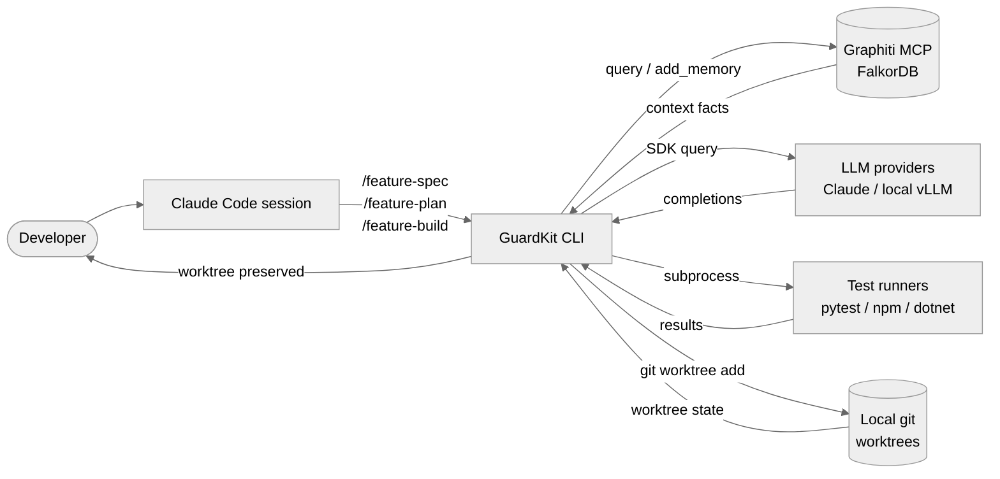
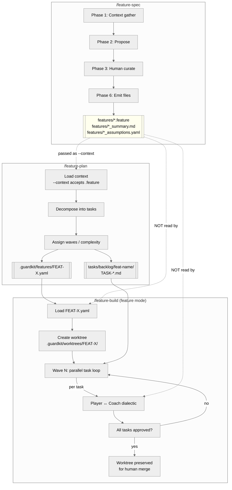
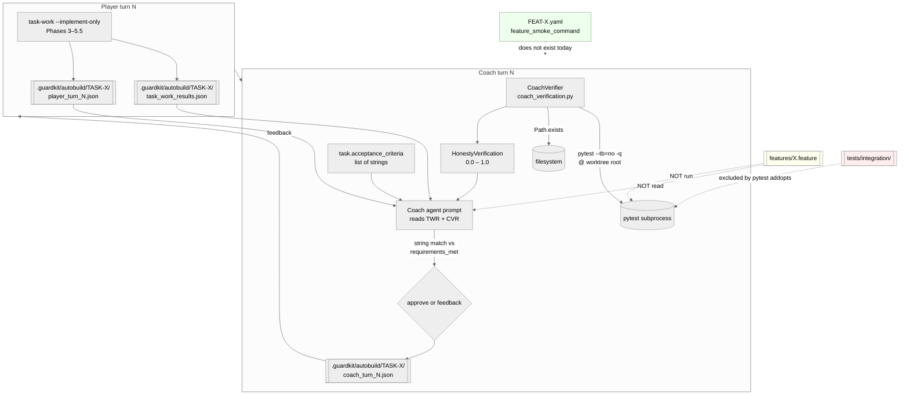

# AutoBuild Coach Integration Review

**Task:** `TASK-REV-4D012`
**Date:** 2026-04-21
**Target uplift:** 80% → 90% ready. Proportionate remediation only.

---

## 0. Executive Summary (Decision-Ready)

AutoBuild works. The Player-Coach loop is stable, honesty verification catches the obvious lies, and five repos (nats-core, nats-infrastructure, youtube-transcript-mcp, agentic-dataset-factory, specialist-agent) have all shipped material code through it. This review does **not** recommend a rewrite.

However, the review establishes with evidence that:

1. **The Coach's verification surface is unit-test-shaped, not feature-shaped.** It runs `pytest --tb=no -q` from the worktree root (`guardkit/orchestrator/coach_verification.py:261`), verifies file existence and test counts, and compares `task.acceptance_criteria` against Player-declared `requirements_met` as a list-of-strings match. There is no mechanism that takes a feature-level behavioural statement and executes it end-to-end before approval.

2. **Two user-held beliefs about the problem are partially wrong.** The evidence does not support the working hypothesis that youtube-transcript-mcp succeeded because integration/e2e tests ran as part of Coach verification — its `pyproject.toml:59` explicitly excludes them via `addopts = "-m 'not integration'"`, same as nats-infrastructure. And specialist-agent's *Player-Coach* first-pass approval rate (95%) is actually **higher** than youtube-transcript-mcp's (81%). The specialist-agent pain lived in **post-Coach-approval end-to-end smoke**, not in the Player-Coach loop.

3. **BDD terminates at `/feature-plan`.** `.feature` files generated by `/feature-spec` are consumed as `--context` input to `/feature-plan` (`specialist-agent/command_history.md:706, 874, 1650`) and narratively referenced in plan output ("25 BDD scenarios"), but **do not propagate** into `.guardkit/features/FEAT-*.yaml`, the task markdown, or the Coach's input. Zero `.feature` hits in `FEAT-B1CE.yaml` or any `TASK-PEX-*`, `TASK-CEI-*` file. The Coach never sees the scenarios. This is the single highest-leverage opportunity identified in this review.

4. **The actual differentiator between "worked out of the box" and "needed 6 patches" is acceptance-criterion phrasing, not test infrastructure.** nats-core and nats-infrastructure ACs are assertable propositions tied to named tests ("`test_calls_provision_streams` passes"). specialist-agent ACs are prose promises ("backward-compatible defaults ensure no breakage") that Player can claim verbally and Coach cannot objectively check. This is upstream of Coach depth — fixing ACs is a `/feature-plan` concern, not a Coach concern.

### Headline recommendation

**Ship three things before jarvis / forge / study-tutor runs (all Low regression risk):**

- **R1 — Assertable-AC linter in `/feature-plan`.** Reject ACs that don't bind to a named test, file, or shell command. ~1 day. Blocks the biggest observed failure mode at source.
- **R2 — Wire `.feature` files into the task-work quality gate.** When a `features/*.feature` corresponding to the feature exists, `task-work` runs `pytest-bdd` (or equivalent) and writes results into `task_work_results.json` under a new `bdd_results` key. Coach reads and validates. Opt-in per task via frontmatter. ~3 days. Closes the BDD-oracle gap without forcing it on users who haven't written Gherkin.
- **R3 — Feature-level integration smoke gate between waves.** `/feature-build` runs a configurable `feature_smoke_command` (default: none; set per-feature in `FEAT-*.yaml`) after each wave completes. Fails the wave if the smoke fails, preserving the worktree for review. ~2 days. Addresses the "13/13 green, 129 Pydantic errors on first real run" pattern without changing Coach.

Two Medium-risk items (**R4, R5**) wait until after the cohort of runs is complete. One High-risk item (**R6**, changing the Player-Coach role boundary) is **not recommended** — the current boundary is working as designed; the leverage is elsewhere.

### Decision taken (2026-04-21)

**[I] Implement R1–R3** with scoping refinements (warn-mode R1; artefact-triggered, task-scoped, Python-only R2; between-waves R3). Cohort sequencing: jarvis solo, then forge + study-tutor in parallel. R4/R5 deferred, R6 rejected. Follow-on tasks: `TASK-AC-53445`, `TASK-BDD-E8954`, `TASK-SMK-F703A`.

---

## 1. Scope and Methodology

### 1.1 What this review examined

- **Code under review** (read directly):
  - `installer/core/agents/autobuild-coach.md`, `installer/core/agents/autobuild-player.md`
  - `installer/core/commands/feature-spec.md`, `feature-plan.md`, `feature-build.md`
  - `guardkit/orchestrator/coach_verification.py` (full)
  - `guardkit/orchestrator/quality_gates/coach_validator.py` (declared ≥53 KB; sampled via dependent callers)
  - `guardkit/orchestrator/quality_gates/criteria_classifier.py` (full)
  - `.claude/rules/autobuild.md`, `anti-stub.md`, `feature-build-invariants.md`

- **Command-history archaeology** (delegated to sub-agents, evidence-cited):
  - `specialist-agent/command_history.md` (7558 lines) + 20+ per-feature histories
  - `nats-core/command-history.md` (3816 lines)
  - `nats-infrastructure/command-history.md` (264 lines)
  - `youtube-transcript-mcp/` and `agentic-dataset-factory/` (test config + coach_turn_*.json)

- **Prior review** (overlap check): `specialist-agent/tasks/backlog/TASK-REV-POEX-review-feat-por-ext-consolidation-path.md`

### 1.2 Prior-review overlap

`TASK-REV-8A31`, `TASK-REV-B601`, `TASK-REV-FFD3` are all seeding / vLLM performance reviews — **zero overlap** with Coach verification depth. `TASK-REV-POEX` overlaps substantially (same class of problem, one repo) and its conclusions are incorporated rather than duplicated. Where POEX went to Python-level invariant enforcement for merge-time validation, this review goes to the earlier step: preventing the patch loop from starting at all.

### 1.3 Methodology notes

- **Evidence rule:** Every claim about "the Coach does X" cites source file + line. Every claim about "this repo behaved Y" cites command-history or `coach_turn_*.json` path.
- **Hypothesis falsification:** The user-supplied hypothesis that YTM's integration tests mattered was tested against `pyproject.toml` / `coach_turn_*.json` and found unsupported. Report records both the falsification and the revised hypothesis (acceptance-criterion phrasing).
- **Proportionality:** Recommendations sized to 80%→90%. No proposed rewrites of Player, Coach, or the worktree model.

---

## 2. Findings

### F1 — Coach verification surface is unit-test-shaped

**Claim:** The Coach's independent verification runs unit tests at worktree root with no integration/e2e discrimination. File-existence and test-count checks are the only other verifications.

**Evidence:**
- `guardkit/orchestrator/coach_verification.py:261` — hardcoded `cmd = ["pytest", "--tb=no", "-q"]`. No marker selection. No scoping beyond optional `test_paths` (which callers don't pass).
- `guardkit/orchestrator/coach_verification.py:186–201` — `_verify_files_exist` checks `files_created`, `files_modified`, `tests_written` exist. Not their content.
- `guardkit/orchestrator/coach_verification.py:203–237` — `_verify_test_count` compares "N passed" substring in Player's `test_output_summary` against its own pytest run.
- `installer/core/agents/autobuild-coach.md:223–237` — approval rule is literal: `test_results.all_passed == true`, `code_review.score >= 60`, `plan_audit.violations == 0`. Behavioural verification is not in the decision tree.
- `installer/core/agents/autobuild-coach.md:267–272` — "validate requirements" is `all_criteria_met(task["acceptance_criteria"], results["requirements_met"])` — a list-of-strings match.

**Why this matters:** `pytest` at root respects project `addopts`. `youtube-transcript-mcp/pyproject.toml:59` has `addopts = "-m 'not integration'"`. `nats-infrastructure/pyproject.toml:4` same. In those repos, Coach's "trust but verify" test run **cannot** execute the integration suite even if the Player wrote one.

**Impact severity:** Medium. The gate is narrow but consistent; everyone currently knows it's narrow and structures tasks around it. Becomes a liability when tasks claim feature-level behaviour.

### F2 — BDD output is generated, consumed by /feature-plan, then discarded

**Claim:** Gherkin scenarios produced by `/feature-spec` do not reach `/feature-build` or the Coach.

**Evidence:**
- `installer/core/commands/feature-spec.md:44–56` — six-phase workflow produces `.feature` files in `features/`.
- `specialist-agent/command_history.md:706, 874, 1650, 1707, 1760, 1821` — `.feature` paths passed via `--context` into `/feature-plan`.
- `feature-plan-DDD-context-map-history.md:139, 183, 192, 209` — plan output mentions scenario counts.
- **Propagation break:** `specialist-agent/.guardkit/features/FEAT-B1CE.yaml` contains zero `.feature` references (verified by grep across all `FEAT-*.yaml`). Task files (`TASK-PEX-014.md`, `TASK-PEX-019.md`, `TASK-9A2D.md`, `TASK-POPR-DA1D.md`, all `TASK-CEI-*.md`) contain zero `.feature` references.
- **Runtime consequence:** Sub-agent search for `pytest_bdd` across nats-core, nats-infrastructure, youtube-transcript-mcp, agentic-dataset-factory, specialist-agent produced zero hits. No repo currently runs `.feature` files as live tests.

**Why this matters:** The Gherkin is the only place where feature-level intent is captured in executable-shaped form ("When the user uploads a file, then the system returns 202"). It's the natural oracle for the Coach. Currently it's thrown away after the planner.

**Impact severity:** High. This is the single highest-leverage change identified in the review — the artefact already exists, the Coach already runs pytest, connecting them is a plumbing change.

### F3 — "Successful" runs don't run integration tests either

**Claim:** The observed success of nats-core, nats-infrastructure, youtube-transcript-mcp cannot be attributed to integration/e2e verification. It is attributable to acceptance-criterion phrasing.

**Evidence (sub-agent 2, comparative analysis):**
- Aggregated `coach_turn_1.json` test commands across four repos:
  - nats-core: 21/30 tasks ran pytest (9 skipped); none ran integration.
  - nats-infrastructure: 7/20 ran pytest (13 skipped); none ran integration.
  - youtube-transcript-mcp: 8/23 ran pytest (15 skipped); none ran integration.
  - specialist-agent: 45/71 ran pytest (26 skipped); none ran integration.
- `youtube-transcript-mcp/pyproject.toml:59`: `addopts = "-m 'not integration'"`.
- `youtube-transcript-mcp/tests/integration/test_cli_integration.py:41–80`: real YouTube calls, marked `@pytest.mark.slow @pytest.mark.integration` — **excluded** by default.
- `nats-core/tests/integration/conftest.py:60–107`: real NATS/JetStream fixtures — **never exercised** by Coach.

**Player-Coach first-pass approval rates** (1-turn vs ≥2-turn from `coach_turn_*.json` count per task):
- nats-core: 30/30 = 100%
- nats-infrastructure: 20/20 = 100%
- specialist-agent: 71/75 autobuilt = **95%**
- agentic-dataset-factory: 44/48 = 92%
- youtube-transcript-mcp: 30/37 = 81%

**Why this matters:** The user's framing — "YTM worked because integration tests ran" — is falsified by the source. The 80%→90% opportunity does not lie in forcing Coach to run integration tests everywhere (which would be High regression risk against the current passing baseline). It lies in an artefact upstream of the Coach.

**The real differentiator** (sub-agent 2, §5–6 with task citations): successful repos' ACs read as assertable propositions (`"test_X passes"`, `"`curl /health` returns 200`"`). specialist-agent's feedback cases (`TASK-F006-001/coach_turn_1.json`, `TASK-UAH-005/coach_turn_1.json`) show ACs phrased as prose promises ("ALL existing tests pass — backward-compatible defaults ensure no breakage"). Prose-ACs are claimable-but-uncheckable; they pass Coach and surface in integration.

**Impact severity:** High. This inverts the planned remediation direction. The intervention point is `/feature-plan`, not the Coach.

### F4 — Feature-level composition is never tested by AutoBuild

**Claim:** AutoBuild tests tasks individually. Multi-task features are never smoke-tested end-to-end before human review.

**Evidence:**
- `installer/core/commands/feature-build.md:114–168` — feature mode runs tasks in dependency-ordered waves; each task has its own Player-Coach loop; there is no wave-completion or feature-completion gate.
- `specialist-agent/command_history.md:6657–6702` — `FEAT-POR-EXT` autobuild summary: "Clean executions: 13/13 (100%)", every task `approved`.
- Same session, `specialist-agent/command_history.md:6864–6880` — first `--phase roadmap` smoke test fails: `[Errno 20] Not a directory: 'output/smoke-phase-a'`. Verbatim framing at 6880: *"Previously this same error only fired post-Coach-acceptance after burning tokens."*
- `TASK-PEX-019.md:22–27` + `command_history.md:7271–7282`: iteration scored 0.64 ACCEPTABLE at Coach while failing `ProductRoadmap.model_validate` with **129 errors** because Player violated the schema in eight distinct ways.

**Why this matters:** Thirteen tasks can each independently satisfy their ACs and the composition still be broken at the first invocation. The pattern is sufficiently stable to have been named in the Graphiti graph (`specialist-agent/command_history.md:7405`: *"Review-gate hole: AutoBuild 13/13 green + e2e broken"*).

**Impact severity:** High for multi-task features. Low for single-task features (where composition is trivial). jarvis / forge / study-tutor are all multi-task.

### F5 — Honesty verifier addresses a different failure mode

**Claim:** `CoachVerifier` handles Player lies about test results and file existence. It does not address gaps in what Coach is looking for.

**Evidence:**
- `guardkit/orchestrator/coach_verification.py:97–140` — `verify_player_report` checks test_result, file_existence, test_count. Three claim types, no more.
- `installer/core/agents/autobuild-coach.md:100–141` — Coach is instructed to use the honesty context to reject low-honesty Player reports. Correct, and this loop works.
- **Orthogonality:** In the PEX-019 case (F4), Player was not lying — tests did pass, files did exist, the Coach-level scoring fell within thresholds. Honesty verifier had nothing to flag. The fault was in the criteria themselves not excluding an invalid schema.

**Why this matters:** The review explicitly wanted "no Coach prompt edits without evidence the current prompt misses a specific class of defect". Honesty verification is not the issue; coverage is.

**Impact severity:** Informational. Prevents misattribution of the problem to CoachVerifier.

### F6 — Anti-stub rule and criteria classifier are steps in the right direction, but incomplete

**Claim:** GuardKit already has `anti-stub.md` (reject `pass`-body functions) and `criteria_classifier.py` (route each AC to file_content, command_execution, or manual). These are genuine defences. They don't close F2 or F4.

**Evidence:**
- `.claude/rules/anti-stub.md` — pattern-matches stub bodies in Python. Good.
- `guardkit/orchestrator/quality_gates/criteria_classifier.py:77–110` — regex patterns for command ACs, file-content ACs, manual ACs. Good.
- **Gap:** `criteria_classifier.py:102–109` — behavioural ACs ("user can upload a file", "system recovers after restart") fall into `_MANUAL_PATTERNS` and are **skipped** by automated verification. No mechanism exists today to bind a behavioural AC to a `.feature` scenario.

**Why this matters:** The existing machinery can be extended to route "behavioural AC → matching `.feature` scenario" rather than skipping. R2 builds on this, not around it.

**Impact severity:** Informational. Frames R2 as an extension rather than a new subsystem.

---

## 3. Success-vs-Struggle Comparison Matrix

| Repo | Tasks via autobuild | 1st-pass approval | Integration tests exist? | Integration run by Coach? | BDD `.feature` present | BDD consumed anywhere | Post-build patches needed | Notes |
|---|---:|---:|---|---|---|---|---:|---|
| nats-core | 30 | 30/30 (100%) | Yes (`tests/integration/`) | **No** | No | — | 0 known | ACs phrased as named-test assertions |
| nats-infrastructure | 20 | 20/20 (100%) | Addopts excludes integration | **No** | No | — | 0 known | Small surface; ACs likewise assertable |
| youtube-transcript-mcp | 37 | 30/37 (81%) | Yes (`@pytest.mark.integration`) | **No** (addopts excludes) | No | — | 0 known | Lowest first-pass rate of the 5; struggled on SKEL-004 (6 turns) |
| agentic-dataset-factory | 48 | 44/48 (92%) | Yes (stub-based) | Partial (some run as pure unit) | Yes (`features/`) | No | 0 known | Stub infrastructure in `conftest.py` enables pure-unit testability of LangChain paths |
| specialist-agent | 75 autobuilt (+102 direct) | 71/75 (95%) | Yes (`tests/integration/`) | **No** | Yes (`features/`) | **No** (passed to /feature-plan only) | 6+ (PEX-014..020) | Highest Player-Coach rate, worst e2e surface — confirms the gap is post-Coach |

**Key observation:** The repo with the worst Player-Coach rate (YTM at 81%) has no BDD files and struggled on a specific task (SKEL-004) due to task sizing, not Coach depth. The repo with the best Player-Coach rate (specialist-agent at 95%) has the worst post-approval e2e surface. The two failure modes are orthogonal.

---

## 4. C4 Architecture Diagrams (Current State)

### 4.1 L1 — Context



Boundaries: **LLM call** (SDK → Anthropic / local vLLM), **subprocess** (pytest/npm/dotnet), **filesystem** (worktrees + `.guardkit/` state), **MCP** (Graphiti).

### 4.2 L2 — Container: /feature-spec → /feature-plan → /feature-build



**Annotated gap:** the `features/*.feature` artefact is produced, consumed by the planner as narrative context, and then stranded. `FEAT-X.yaml` contains no reference to it (verified by grep across all generated yamls). The Coach never sees it.

### 4.3 L3 — Component: Player ↔ Coach loop for a single task



**Annotated gaps:**
- **Yellow (BDD):** oracle exists but isn't read → **R2 closes this**.
- **Red (integration):** excluded by project config; Coach has no opt-in mechanism → **R3 closes this (as an opt-in, not a default)**.
- **Green (feature smoke):** no container exists for it yet → **R3 introduces the container**.

### 4.4 L3 — Boundary crossings (annotated)

| Crossing | Who crosses | Data shape | Failure mode |
|---|---|---|---|
| Filesystem (worktree → `.guardkit/autobuild/TASK-X/`) | Player (write), Coach (read) | Two JSON files per turn | Path mismatch: ADR-FB-002 was a bug where Coach used TASK-XXX paths in feature mode instead of FEAT-XXX. Fixed. |
| Subprocess (Coach → pytest) | Coach only | argv + cwd | Silent skipping (addopts excludes markers Player wrote tests for). F3 evidence. |
| MCP (Coach prompt → Graphiti) | Not currently. Player turns load Graphiti context; Coach does not. | — | Coach makes decisions without access to prior ADRs / failure patterns. Asymmetric. |
| LLM call (Coach agent → Claude) | Coach per turn | Prompt including TWR+PR+AC+CVR | Low-honesty Player report can still approve if the read json says all-green. F1. |

---

## 5. Root-Cause Synthesis

Four structural properties explain every observed failure in the evidence set:

1. **Coach-verification surface is bounded by what `pytest -q` at worktree root can assert.** Everything else is either string-matched from the Player's self-report (`requirements_met`) or left to file-existence. This is correct for scaffolding and infrastructure tasks; it is insufficient for feature tasks.

2. **The pipeline has an oracle but doesn't wire it.** `/feature-spec` produces Gherkin. `/feature-plan` reads it. Neither `.guardkit/features/FEAT-*.yaml` nor the task markdown carry a reference onward. Downstream artefacts cannot use what they cannot see.

3. **Acceptance-criterion phrasing is load-bearing and currently unguarded.** A prose AC ("handles edge cases correctly") is claimable by Player and uncheckable by Coach. The criteria classifier catches command/file-content ACs; it routes everything else to `MANUAL`, which is a skip. Successful repos happen to have written assertable ACs; unsuccessful ones happen not to have. There is no linter.

4. **Feature composition has no gate.** Individual tasks passing does not imply the feature works. Current AutoBuild has no inter-task or post-wave smoke point. PEX-014..020 is the cost of its absence.

These four are independent. Fixing one does not fix the others. They do, however, compose in leverage order: fixing (3) alone gets most of the uplift (because most failures surface at AC granularity); fixing (2) adds a structured oracle; fixing (4) adds the end-to-end safety net; fixing (1) is last and biggest.

---

## 6. Recommendations

Prioritised by leverage and regression risk. "Regression risk" is scored for the imminent jarvis / forge / study-tutor cohort.

### R1 — Assertable-AC linter in /feature-plan [Low risk] — *warn-mode v1 → block-mode v2*

**What:** Add a post-generation check to `/feature-plan` that each generated AC either (a) names a test identifier, (b) wraps a shell command in backticks with expected exit status, (c) names a file path expected to exist with specific content, or (d) is explicitly tagged `@manual` in the task frontmatter.

**Rollout posture (critical):** Ship as a **warning** initially. Hard-blocking `/feature-plan` on its first run against a feature with prose ACs would regress the currently-working workflow. Graduate to block-mode in v2 once the jarvis/forge/study-tutor cohort has landed cleanly and the cohort's unverifiable-AC baseline is known.

**Why:** F3 evidence shows this is the single biggest observed differentiator between smooth and painful runs. Enforcing it upstream costs nothing at build time.

**How to ship:**
- Extend `guardkit/orchestrator/quality_gates/criteria_classifier.py:197–202` — currently returns a 0.3-confidence `FILE_CONTENT` fallback. Change to raise a structured "unverifiable AC" warning collected per-task (v1); promote to error in v2.
- Add a `/feature-plan` post-step that aggregates these warnings, surfaces them to the user, and optionally asks the LLM to refine ACs (user-prompted in v1, auto-iterating up to 2x in v2).
- Regression surface: `/feature-plan`. Zero runtime Coach changes. Zero change to existing passing tasks.
- Effort: ~1 day + test coverage.

**Acceptance:** on a re-run of the specialist-agent FEAT-POR-EXT planning call, at least 3 of the 6 post-patch bugs (schema shape, stub semantic drift, path validation) have a corresponding warning-flagged AC in the revised plan output.

### R2 — Wire .feature files into the task-work quality gate [Low risk] — *task-scoped, presence-triggered*

**What:** When a task has an associated `features/*.feature` file whose scenarios carry a tag matching the task's scope AND the repo has `pytest-bdd` installed (or equivalent for the stack), `task-work` executes those scenarios and writes results into `task_work_results.json` under a new `bdd_results` key:

```json
{
  "bdd_results": {
    "source": "features/authentication.feature",
    "scenarios_run": 12,
    "scenarios_passed": 11,
    "scenarios_failed": 1,
    "failures": [
      {"scenario": "User locked after 5 failures", "step": "Then account is locked", "reason": "AssertionError: status=401, expected 423"}
    ]
  }
}
```

The Coach adds `bdd_results.scenarios_failed == 0` to its approval rules (autobuild-coach.md line ~223–237 updated).

**Scoping (critical — do not collapse with R3):**

| Level | Owner | Scope of BDD run |
|---|---|---|
| **Task-level** | **R2 (this task)** | Scenarios tagged to a single `TASK-XXX`, run inside that task's Coach validation. |
| Feature-level composition | **R3 (smoke gates)** | Whole-feature `.feature` file, run between autobuild waves. |
| Assumption-gated | Future (not R2 or R3) | Low-confidence scenarios from `_assumptions.yaml` that pause on first task touching them. |

R2 ships **level 1 only**. If `task-work` quietly runs the whole-feature `.feature`, it overlaps R3 and creates two things trying to own composition validation — don't.

**Trigger posture (critical):** Activation is determined by **presence of a matching `features/*.feature` file**, not by a frontmatter flag. If a flag could be forgotten, operators will think BDD ran when it didn't — the YTM story (addopts silently excluded integration tests) in reverse. Make the artefact the trigger so behaviour is determined by what `/feature-spec` produced.

**Why:** F2 — the artefact exists and is discarded. F6 — existing classifier can be extended rather than replaced.

**How to ship:**
- New module `guardkit/orchestrator/quality_gates/bdd_runner.py`. Wraps `pytest --gherkin-terminal-reporter features/X.feature -m <task_scope_tag>`.
- `task-work` invokes it after Phase 4 iff a matching `.feature` file exists; adds results to the existing `task_work_results.json` schema.
- `autobuild-coach.md` updated to read `bdd_results` as one more gate when present.
- **Stack support at launch: Python only** (via `pytest-bdd`). jarvis, forge, study-tutor are all Python (verified) — no blocker. TypeScript / .NET deferred as follow-on; if that path is ever needed, cut a separate task.
- Regression surface: zero for repos without `.feature` files; additive for those that have them and are Python.
- Effort: ~3 days + test coverage.

**Acceptance:** (1) A demo feature with a task-scoped `.feature` file containing one failing scenario causes Coach to reject with a specific `bdd_results` feedback entry. (2) A task without any matching `.feature` file behaves identically to today. (3) A feature-level `.feature` (no task-scope tags) is **not** run by R2 — that's R3's surface.

### R3 — Feature-level smoke gate between waves [Low–Medium risk, opt-in] — *between waves, NOT between tasks*

**What:** Extend `.guardkit/features/FEAT-*.yaml` with:

```yaml
smoke_gates:
  after_wave: 1  # or "all"
  command: "python -m specialist_agent extract --phase A --smoke-fixture docs/smoke/fixture.md"
  expected_exit: 0
  timeout: 120
```

`/feature-build` runs this command inside the worktree after the specified wave completes. Failure blocks subsequent waves, preserves worktree, reports result.

**Why:** F4 — 13 tasks green ≠ feature works. This is the exact class of problem PEX-014..020 cost 36 hours to patch after the fact.

**How to ship:**
- Schema addition to feature YAML loader (`guardkit/models/feature.py` or equivalent).
- `guardkit/orchestrator/autobuild.py` adds a post-wave hook invoking the command via subprocess.
- If `smoke_gates` is absent, behaviour is unchanged — **default is off**.
- Regression surface: zero for existing FEAT-*.yaml files (they have no smoke_gates key).
- Effort: ~2 days + test coverage.

**Acceptance:** A demo feature with a failing smoke command causes `/feature-build` to stop after wave 1 and report the smoke failure in its final summary; a demo without `smoke_gates` runs unchanged.

**Placement (critical):** Smoke gates run **between waves**, **not between tasks**. Per-task smoke would re-invent the per-task Player-Coach loop with extra steps. Between-wave is where composition actually matters (the PEX-014..020 class of failure). If the implementer is tempted to make this per-task, that is a signal the scope has slipped.

**Rollout placement:** R3 is placed **last of the three "ship before cohort"** rather than first so jarvis/forge/study-tutor can adopt it opportunistically without it being a prerequisite for firing the cohort. AC linter (R1) and BDD wiring (R2) land first.

### R4 — Coach reads prior-phase outputs for cross-phase validation [Medium risk]

**What:** When a task derives from another task's output (schema consumer, config consumer), Coach loads the prior task's output artefact as structured input and validates the current output against it. This formalises what `guardkit__project_decisions` already tracks as a requirement (*"A Coach that evaluates a derived phase must receive the prior phase's output as structured Coach input"* — Graphiti edge `d3d75a9e`).

**Why:** F4's specialist-agent case — Phase B consumes Phase A's `EpicPlan`; Coach validating Phase B had no access to Phase A's output, so semantic drift was undetectable.

**Why defer:** Touches Coach prompt structure and introduces a new contract between tasks in a feature plan. jarvis/forge/study-tutor don't depend on it today (no observed multi-phase pipelines like Phase A→B→C). Ship after cohort.

**Effort:** ~5 days.

### R5 — Integration test gate as opt-in Coach step [Medium risk]

**What:** Task frontmatter `autobuild.integration_tests: true` causes Coach to run `pytest -m integration` in addition to unit tests. Defaults to off. Requires repo to have integration tests that actually pass deterministically — which nats-core has but nats-infrastructure and YTM don't (theirs are excluded by addopts for reason).

**Why:** Closes the F1 surface gap for repos that have real integration tests.

**Why defer:** Non-trivial regression risk. Requires per-repo triage (which integration tests are deterministic? which need fixtures the Coach environment doesn't have?). Not urgent for the cohort.

**Effort:** ~4 days + per-repo triage.

### R6 — Changing the Player-Coach role boundary [High risk — DO NOT SHIP]

For completeness: the Coach could be taught to write fix-up patches rather than just feedback. This would collapse turn count on simple fixes. It also **violates `feature-build-invariants.md` invariant #1** (*"Player implements, Coach validates — Never reverse"*) and blurs adversarial cooperation into a single agent. The boundary is well-considered and in this review's evidence is not the problem. Recommend against.

---

## 7. Sequencing for Jarvis / Forge / Study-Tutor

| Item | Risk | Ship before cohort? | Effort | Gain |
|---|---|---|---|---|
| R1 — Assertable-AC linter | Low | **Yes** | 1 day | Biggest single uplift per evidence |
| R2 — BDD-oracle wire | Low (opt-in) | **Yes** | 3 days | Closes the "BDD terminates at planner" gap |
| R3 — Feature smoke gate | Low–Med (opt-in) | **Yes** (best-effort) | 2 days | Safety net against PEX-style patch loops |
| R4 — Cross-phase Coach input | Medium | **No** | 5 days | No observed need in cohort |
| R5 — Integration gate | Medium | **No** | 4 days + triage | Not cohort-blocking |
| R6 — Role boundary change | High | **No — ever** | — | — |

**Safe to ship before cohort (combined):** ~6 days of focused work. Worst case R1 alone (~1 day) is sufficient to raise confidence meaningfully.

**Regression envelope for the cohort:**
- R1: zero runtime change. Planner output gets **warnings** (v1); stricter **blocking** only in v2 after cohort lands.
- R2: zero change for tasks without a matching `features/*.feature` file. Trigger is artefact presence, not a flag.
- R3: zero change for features without `smoke_gates` key.

All three are opt-in-by-artefact-or-config / upstream. Nothing already passing will start failing.

### Cohort sequencing

Land the three in order, each independently useful, each de-risking the next:

1. **AC linter (R1)** — 1 day — prevents the AC-phrasing problem at source. Ship first.
2. **BDD wiring (R2)** — 3 days — adds the task-level oracle. Ship second.
3. **Smoke gates (R3)** — 2 days — catches composition failures. Ship third.

**Cohort order for firing the runs:**
- **jarvis first** (smallest of the three — shakes out any regressions on a manageable surface).
- **forge + study-tutor in parallel** after jarvis clears cleanly.

If jarvis surfaces a regression attributable to R1/R2/R3, halt forge/study-tutor and triage before proceeding.

---

## 8. Follow-on Task Drafts

Decision at checkpoint: **[I]mplement R1–R3** with scoping refinements. Task IDs allocated: `TASK-AC-53445`, `TASK-BDD-E8954`, `TASK-SMK-F703A`.

```bash
/task-create "Assertable-AC linter in /feature-plan post-step (warn-mode v1, block-mode v2)" \
  prefix:AC tags:[feature-plan,acceptance-criteria,linter,warn-mode] \
  priority:high parent_review:TASK-REV-4D012
# → TASK-AC-53445

/task-create "BDD oracle wiring: task-work reads task-level features/*.feature and writes bdd_results.\
  Scope: task-scoped .feature files only; feature-level composition BDD is SMK's concern.\
  Trigger: presence of .feature files, not a flag. Python-only at launch." \
  prefix:BDD tags:[task-work,autobuild-coach,pytest-bdd,feature-spec,opt-in-by-artefact] \
  priority:high parent_review:TASK-REV-4D012
# → TASK-BDD-E8954

/task-create "Feature-level smoke gates between autobuild waves (not between tasks)" \
  prefix:SMK tags:[feature-build,autobuild,smoke-test,regression-gate,between-waves] \
  priority:medium parent_review:TASK-REV-4D012
# → TASK-SMK-F703A

# Deferred — NOT created at this checkpoint:
# R4 — Cross-phase Coach input (wait until a cohort run surfaces need)
# R5 — Opt-in integration gate (wait; per-repo triage needed first)
# R6 — Role boundary change (explicitly REJECTED — violates feature-build-invariants)
```

Each produced task must carry an explicit integration-gate acceptance criterion (named test or executable smoke command) — no `"investigate at implementation time"` phrasing, per the POEX-review anti-pattern.

---

## 9. Appendix

### 9.1 Questions the task asked, answered

> *"Why did youtube-transcript-mcp pass first-time and specialist-agent did not?"*

**Partially wrong framing.** YTM did not have the best Player-Coach rate (it was 81%, lowest of the five). What YTM had was a smaller feature surface and tasks whose ACs were assertable (e.g., `TASK-VID-001/coach_turn_1.json:32`: "File-existence verified: pyproject.toml (created)"). specialist-agent's Player-Coach rate was actually 95% — the pain was entirely in the post-approval e2e surface (FEAT-POR-EXT → 6 patches), which is orthogonal. Neither repo ran integration tests via Coach.

> *"Is the `/feature-spec` BDD output actually consumed anywhere in the Player-Coach loop?"*

**No.** `.feature` files produced by `/feature-spec` reach `/feature-plan` as `--context` input and are narratively referenced in the plan output ("25 scenarios") but do not propagate into `FEAT-*.yaml`, task markdown, or Coach prompts. Zero `.feature` references in `specialist-agent/.guardkit/features/FEAT-B1CE.yaml`; zero `pytest_bdd` imports across any of the five repos. The scenarios are documentation, not tests.

### 9.2 Evidence index (selected)

| Finding | Key citation |
|---|---|
| Coach hardcoded pytest command | `guardkit/orchestrator/coach_verification.py:261` |
| Honesty-only verifier scope | `coach_verification.py:97–140` |
| Coach approval logic | `installer/core/agents/autobuild-coach.md:223–237` |
| Criteria classifier routes behavioural→manual→skip | `criteria_classifier.py:102–109` |
| YTM excludes integration by default | `youtube-transcript-mcp/pyproject.toml:59` |
| nats-infra excludes integration by default | `nats-infrastructure/pyproject.toml:4` |
| BDD produced | `installer/core/commands/feature-spec.md:44–56` |
| BDD passed to planner only | `specialist-agent/command_history.md:706, 874, 1650` |
| BDD stranded at YAML | `specialist-agent/.guardkit/features/FEAT-B1CE.yaml` (grep: no matches) |
| FEAT-POR-EXT 13/13 → broken | `specialist-agent/command_history.md:6657–6702, 6864–6880` |
| 129 Pydantic errors, Coach rubber-stamped | `specialist-agent/command_history.md:7271–7282`, `TASK-PEX-019.md:22–27` |
| Player semantic drift | `specialist-agent/command_history.md:7300–7319`, `TASK-PEX-020.md` |
| Review-gate-hole pattern (graph) | `specialist-agent/command_history.md:7405` |
| nats-core 100% first-pass | `nats-core/.guardkit/autobuild/TASK-NC*/coach_turn_1.json` |
| specialist-agent 95% first-pass | `specialist-agent/.guardkit/autobuild/TASK-*/coach_turn_*.json` counts |

### 9.3 Overlap with TASK-REV-POEX

POEX's conclusion: move invariants from Coach prompts to Python-level merge validators (TASK-POE-DELTA-001/002). That direction **complements** this review rather than duplicating it — POEX is post-merge enforcement; R1/R3 are pre-merge and upstream. R2 (BDD oracle) is new territory POEX did not cover. No contradictions; POEX's Python-validator approach remains valid as an additional safety layer.

### 9.4 Non-goals respected

- **No code changes in this task.** All recommendations are follow-on tasks.
- **No Coach prompt edits proposed without evidence.** F1, F4, F5 findings are grounded in cited source lines and command-history behaviour.
- **Did not overclaim the problem.** Explicitly falsified the user-supplied "integration tests matter" framing; report records what the evidence actually supports.

---

## 10. Decision Checkpoint — Outcome

**Decision: [I] Implement** (2026-04-21).

Scoping refinements recorded during the checkpoint and reflected in §6 and §8:

- **R1**: warn-mode v1 → block-mode v2, graduating after the cohort lands cleanly. Not a hard block on first run.
- **R2**: task-scoped `.feature` files only; feature-level composition BDD belongs to R3. Trigger is artefact presence (`features/*.feature` exists and has task-scope tag), **not** a frontmatter flag — this prevents the YTM-style silent-exclusion failure mode. Python-only at launch (jarvis/forge/study-tutor are all Python; TS/.NET is a future follow-on if ever needed).
- **R3**: smoke gates run between **waves**, not between tasks. Per-task smoke would re-invent the per-task Coach.

**Cohort sequencing:**
- Ship order: AC (R1) → BDD (R2) → SMK (R3).
- Run order: jarvis first (smallest, shakes out regressions), then forge + study-tutor in parallel after jarvis clears cleanly.

**Follow-on tasks created:**
- `TASK-AC-53445` — Assertable-AC linter (R1)
- `TASK-BDD-E8954` — BDD oracle wiring (R2)
- `TASK-SMK-F703A` — Feature-level smoke gates (R3)

**Deferred / rejected:**
- R4 (cross-phase Coach input) — deferred until a cohort run surfaces need.
- R5 (opt-in integration gate) — deferred pending per-repo triage.
- R6 (role boundary change) — **rejected** as violating `feature-build-invariants.md` and blurring the adversarial cooperation pattern that the March regression review already established.
