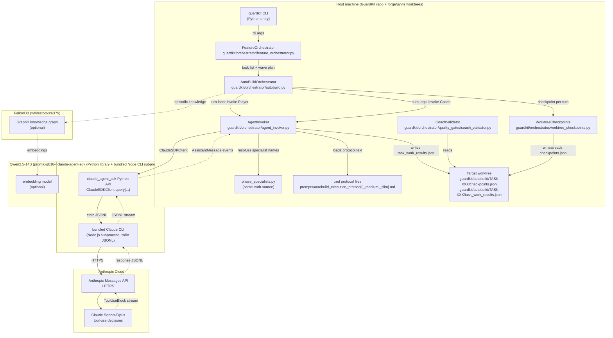
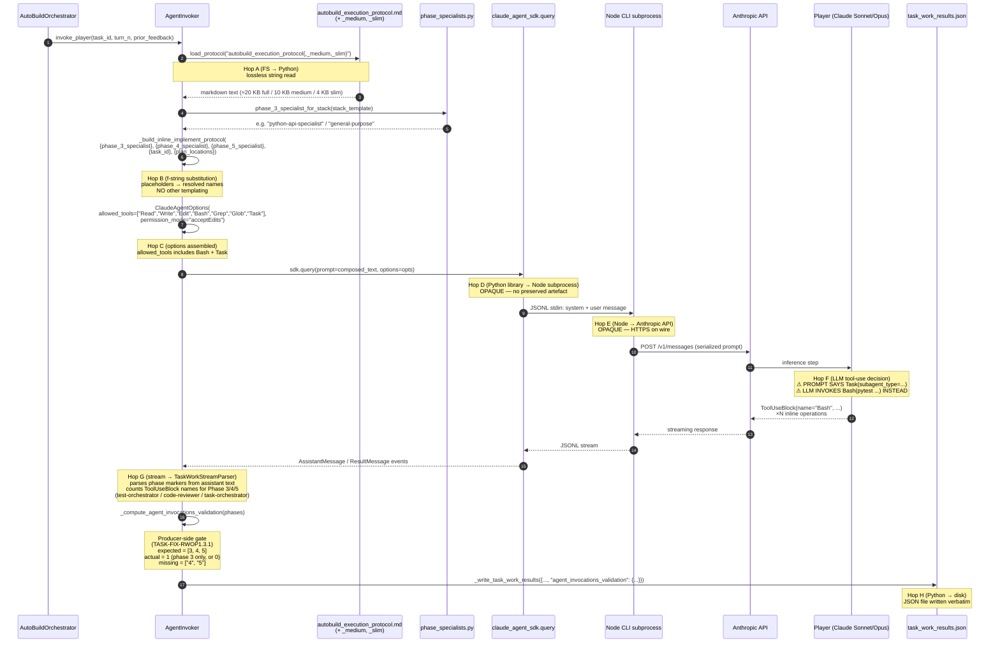
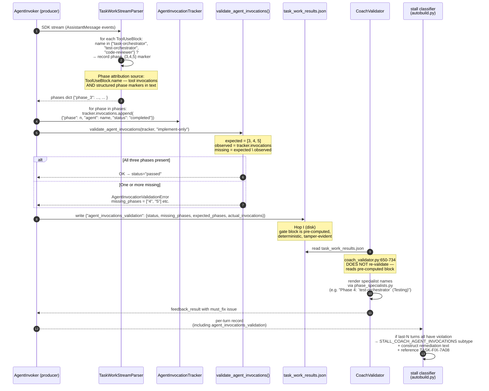
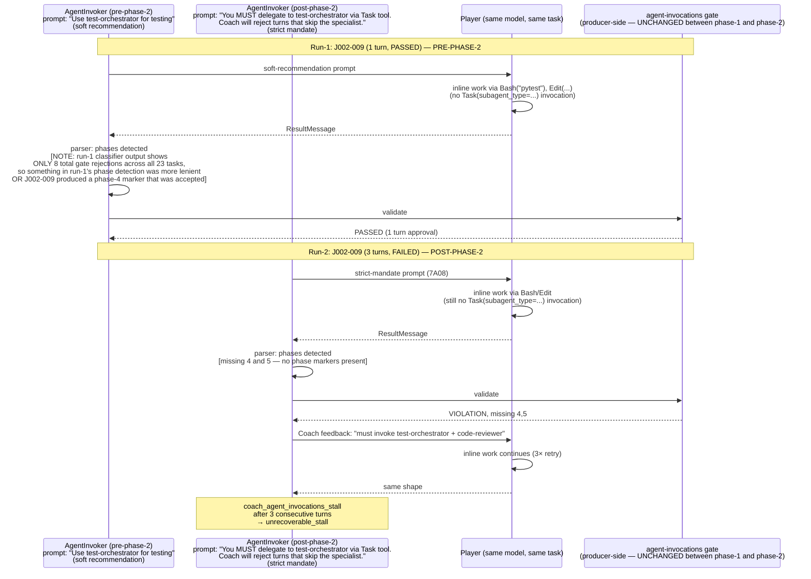

# Analysis: forge-run-4 / forge-run-5 / jarvis-FEAT-002 post-phase-2 — review of TASK-REV-F4A1

**Review task**: `tasks/in_progress/TASK-REV-F4A1-analyse-forge-run-4-post-phase2-failure.md`
**Mode**: `/task-review --mode=architectural --depth=deep`
**Date**: 2026-04-24
**Scope**: cross-repo (forge + jarvis), post-phase-2 regression analysis, revert-vs-fix decision.

---

## Executive summary

The phase-2 bundle (TASK-FIX-7A08 Player prompt mandate; TASK-FIX-7A09 Coach-path defensive SDK handling; TASK-FIX-7A0A CI lint for dead TASK-ID refs) **did not deliver its stated outcome and measurably degraded the jarvis reference environment**.

Three fresh AutoBuild runs across two repositories converge on one signal: the Player (LLM in SDK subprocess) **never invokes `Task(subagent_type="test-orchestrator")` or `Task(subagent_type="code-reviewer")`** in any of the scenarios in scope, despite:

- the 7A08-amended prompt text reaching the Player verbatim (the composition chain is lossless — see Diagram 2),
- the `Task` tool being in `allowed_tools` throughout (forge-run-5 at lines 499, 514, 536, 683, 771, 880, 1057, 1139, 1315: `Allowed tools: ['Read', 'Write', 'Edit', 'Bash', 'Grep', 'Glob', 'Task']`),
- the Player spending 13–16 SDK turns per orchestrator turn on the task (i.e. the Player is doing *real* work, just not specialist delegation).

The fix class chosen — "strengthen the prompt wording" — is **empirically refuted by three independent runs**. Continuing another prompt-iteration cycle has no evidence basis for succeeding.

**Recommendation: [R]evert TASK-FIX-7A08 only** (2 commits on main, no merge conflicts, minimal blast radius). Preserve TASK-FIX-7A09 (defensive, not a regression cause), TASK-FIX-7A0A (no commit — nothing to revert), and the phase-1 bundle including TASK-FIX-7A07's enriched classifier (which fires correctly and is diagnostically load-bearing — refuting it would *regress diagnosis*, not fix behaviour).

After revert, the jarvis baseline is restored to ≥14/23 completed (verifiable acceptance test: `jarvis-FEAT-J002-run-3` completes ≥14/23). Forge remains broken — this is **unchanged by the phase-2 bundle**; forge-run-3 pre-phase-2 had the same shape (per forge-run-3-analysis.md). Forge is not made worse by the revert.

The review files **two concrete follow-ups** in lieu of a phase-3 fix attempt:

1. **TASK-DIAG-{hash}** (complexity 3) — preserve rendered Player prompt + SDK message stream under `.guardkit/autobuild/<task>/sdk_debug/` so future analyses can annotate Diagram 2's boundaries with actual wire-level evidence rather than inferred code behaviour.
2. **TASK-FEAT-{hash}** (feature plan required, complexity 8–12) — design the orchestrator-side specialist-invocation architecture (H-G option b): rather than asking the Player to invoke Phase 4/5 specialists via `Task`, have `AutoBuildOrchestrator` invoke them directly after the Player completes Phase 3. This is a structural fix for the class of defect "Player has a strong prior to complete work inline when it has `Bash` available", independent of prompt wording. It requires a design-phase scoping pass, not a fix-attempt.

---

## Hypothesis verdicts (all seven classes)

| ID | Hypothesis | Verdict | Load-bearing evidence |
|----|------------|---------|-----------------------|
| H-A | Resume-state interaction | **REFUTED as primary**; CONFIRMED as secondary defect | forge-run-5 fresh-baseline fails *identically* to forge-run-4 resume (same missing-phases signature, same classifier output shape) — so resume-state is not the root cause. But the forge-run-4 turn-1 short-circuit is a real secondary defect: checkpoints from the prior run are loaded (forge-run-4.md:92 and :100, "Loaded 3 checkpoints from .../checkpoints.json") and the pollution detector counts them against the fresh turn, suppressing the enriched classifier block that *does* fire correctly on fresh runs. File separately. |
| H-B | 7A08 prompt change didn't alter Player behaviour | **CONFIRMED** | Across three fresh runs on two repos, zero `Task(` / `subagent_type=` / `test-orchestrator` / `code-reviewer` Player invocations appear in any SDK stream. All failing tasks exhibit the identical "missing phases 4,5" or "3,5" signature. The prompt text reaches the Player (code map: composition chain is lossless; all three protocol variants contain the mandate verbatim) — the Player is *ignoring* it. |
| H-C | Classifier regression in 7A07 | **REFUTED** | forge-run-5 fires the enriched `coach_agent_invocations_stall` block with explicit `TASK-FIX-7A08` reference + phase-specialist names at lines 961-968, 1237-1244, 1415-1421. jarvis-FEAT-002-run-2 fires it at 3227-3238, 3394-3405, 3477-3488, 3577-3588. The run-4 generic-text output is an H-A symptom, not an H-C regression. |
| H-D | 7A09 Coach-path changes caused regression | **REFUTED** | No SDK stream failures in any of the four transcripts in scope. `ProcessError` / `CLIJSONDecodeError` handlers added by 7A09 were never exercised. 7A09 is defensive-only, adds test coverage (519 lines), did not cause the regression, and should *not* be reverted. |
| H-E | 7A0A CI lint broke something | **N/A** | 7A0A has no git commit (task folder exists, rule doc exists in `.claude/rules/hash-based-ids.md`, but `tests/rules/test_no_dead_task_id_references.py` was not implemented). The lint is not running in CI. Nothing to revert, nothing to debug. |
| H-F | Cross-repo degradation on jarvis | **CONFIRMED** | jarvis-FEAT-J002 regressed from **14/23 → 12/23** (pre-phase-2 vs. post-phase-2). Wave-2 failures doubled (2 → 4). Two tasks that previously **passed** in run-1 now **fail** in run-2 with identical agent-invocations signatures: **TASK-J002-009** (run-1: PASSED 1 turn; run-2: FAILED 3 turns, missing 4,5 ×3) and **TASK-J002-014** (run-1: PASSED 1 turn; run-2: FAILED 3 turns, missing 4,5 ×3). This is the decision-critical evidence for revert. |
| H-G | Player capability wall (prompt-class fix fundamentally insufficient) | **STRONGLY CONFIRMED** | H-B establishes that the prompt reached the Player and was ignored. Given the Player has `Bash` in allowed_tools and a strong inference-time prior to complete test/review work inline (it consumed 13–16 SDK turns per orchestrator turn on inline work), no prompt wording has demonstrably changed this. Structural fix classes (H-G(a) restrict `allowed_tools`, H-G(b) orchestrator-side specialist invocation, H-G(c) relax gate for certain task classes) are the remaining candidate solutions; of these, H-G(b) is recommended as the proper feature-plan target. |

---

## Cross-boundary sequence diagrams

The review's required method — producing C4-style diagrams with boundary annotations — is satisfied below. Each hop is annotated with quoted evidence from either a preserved artefact (transcripts) or the orchestrator code.

### Diagram 1 — C4 Container view (overall cross-boundary landscape)



**Boundary inventory** (where phase-2 changes could have been silently lost):

1. **FS → Python**: `prompts/*.md` → `load_protocol()` → cached string. No templating losses verified below.
2. **Python orchestrator → claude-agent-sdk (in-process)**: `AgentInvoker._invoke_with_role` constructs prompt + `ClaudeAgentOptions(allowed_tools=[...])` → `sdk.query(prompt, options)`. Same Python process.
3. **claude-agent-sdk → bundled Node CLI**: JSON-over-stdin to Node subprocess launched by SDK. **Black box** — no preserved artefact inspects this boundary.
4. **Node CLI → Anthropic API**: HTTPS wire with serialized system/user prompts. **Black box**.
5. **LLM inference → tool-use decision**: the Player decides to invoke `Task` vs `Bash`. **This is where H-B/H-G fail — prompt says `Task`, LLM calls `Bash`.**
6. **LLM → Node CLI → SDK → Python**: message stream (`ToolUseBlock`, `AssistantMessage`, `ResultMessage`).
7. **Python → disk**: `_write_task_work_results` writes `task_work_results.json` with pre-computed `agent_invocations_validation`.
8. **Disk → Coach**: `CoachValidator` reads JSON and renders Coach feedback.

**Key insight from Diagram 1**: the orchestrator-maintained boundaries (1, 2, 7, 8) are **lossless and auditable**. The SDK subprocess boundaries (3, 4, 5) are **opaque** — we cannot inspect the wire-level prompt the LLM actually received, nor the tool-use reasoning. This is the artefact-preservation gap that TASK-DIAG-{hash} targets.

---

### Diagram 2 — Player invocation end-to-end (Wave 2 `task-work` mode)

This is the diagram that definitively answers H-B: did the 7A08 prompt text reach the LLM verbatim?



**Per-hop boundary annotation with quoted evidence**:

- **Hop A (FS → Python, `prompts/*.md` → string)**. Lossless.
  Code: `agent_invoker.py` (via `prompts/__init__.py::load_protocol`). Reads the exact file bytes. *Verified by code agent: "prompts/__init__.py:57 … Markdown file read + cached. Lossy? No."*
- **Hop B (`_build_inline_implement_protocol` f-string substitution)**. Lossless; only specialist-name placeholders are substituted.
  Code quote (`agent_invoker.py:4522-4526`):
  ```python
  stack_template = detect_stack_template(self.worktree_path)
  phase_3_specialist = phase_3_specialist_for_stack(stack_template)
  phase_4_specialist = STATIC_PHASE_SPECIALISTS["4"]  # "test-orchestrator"
  phase_5_specialist = STATIC_PHASE_SPECIALISTS["5"]  # "code-reviewer"
  ```
  Protocol-text quote (all three variants, confirmed by code agent):
  ```
  ## Phase 3: Implementation

  **You MUST delegate implementation to `{phase_3_specialist}` via the `Task`
  tool. Do NOT write implementation code inline — the Coach's
  agent-invocations gate rejects turns that skip the specialist.**

      Task(
        subagent_type="{phase_3_specialist}",
        description="Implement {task_id}",
        prompt="...")
  ```
  Full, medium, and slim variants all contain the `Task(subagent_type=…)` syntax verbatim. **7A08 landed identically across all three templates.**
- **Hop C (`ClaudeAgentOptions` assembly)**. Direct.
  Code quote (`agent_invoker.py:4790`): `allowed_tools=["Read", "Write", "Edit", "Bash", "Grep", "Glob", "Task"]`.
  Transcript confirmation (forge-run-5 at many lines, e.g. `:499, :514, :536, :683, :771, :880, :1057, :1139, :1315`): `Allowed tools: ['Read', 'Write', 'Edit', 'Bash', 'Grep', 'Glob', 'Task']`. **Player has `Task` available. Bash is also available. The gate is enforced by validation, not by tool restriction.**
- **Hop D (Python SDK → Node CLI subprocess)**. Opaque. No preserved artefact annotates what JSON is actually put on stdin.
- **Hop E (Node CLI → Anthropic API)**. Opaque. No preserved artefact.
- **Hop F (LLM tool-use decision)**. **This is where the failure lives.** The Player consistently invokes `Bash` (implied by the "33 SDK turns" / "24 SDK turns" / "13-16 SDK turns per orchestrator turn" counts — these are the Player doing inline work via `Bash`/`Edit`/`Write`) and not `Task`. Transcript evidence: **zero `Task(` or `subagent_type=` or `test-orchestrator` or `code-reviewer` appearances in any Player stream across forge-run-4, forge-run-5, jarvis-FEAT002-run-1, jarvis-FEAT-002-run-2**. The only appearances of those strings are in the Coach's remediation block (the `coach_agent_invocations_stall` classifier quoted below).
- **Hop G (stream → parser)**. Lossless re: tool-use counting.
  Summary of code-agent finding: "Producer: Stream Parser | `agent_invoker.py:880-930` | `TaskWorkStreamParser` | ToolUseBlock.name for Phase 3,4,5 (task-orchestrator, test-orchestrator, code-reviewer) from SDK message stream | All inline Bash, Read, Write, Edit calls; intermediate Text blocks [discarded from the phase ledger]."
- **Hop H (Python → disk)**. Lossless.
  Producer-side gate (code quote, `agent_invoker.py:5577-5620`):
  ```python
  expected = get_expected_phases(workflow_mode)  # "implement-only" → [3, 4, 5]
  actual = sum(1 for inv in tracker.invocations if inv.get("status") == "completed")
  try:
      validate_agent_invocations(tracker, workflow_mode)
      return {"status": "passed", "expected_phases": expected, ...}
  except AgentInvocationValidationError as exc:
      missing = identify_missing_phases(tracker, workflow_mode)
      return {"status": "violation", "missing_phases": missing, ...}
  ```

**Verdict from Diagram 2**: the prompt text reaches Hop F verbatim (Hops A/B/C are lossless; D/E are opaque but we have no reason to suspect the SDK drops text). **The Player is deterministically ignoring the mandate at Hop F.** H-B is *prompt-landed-but-ignored*, not *prompt-rendering-bug*. Therefore prompt-class fixes have no remaining leverage; structural fixes (H-G) are the valid fix classes.

**Artefact preservation gap**: Hops D/E are black boxes in the current instrumentation. If 7A08 had a subtle rendering bug that only manifests after Hop D, we would not be able to tell from the transcripts in scope. This gap is the motivation for TASK-DIAG-{hash} (follow-up 1).

---

### Diagram 3 — Coach agent-invocations gate

This diagram answers: *if* the Player invokes `Task(subagent_type="test-orchestrator")`, does the Coach's gate count it? (Answer: yes, deterministically — so the gate is not the failure point.)



**Per-hop boundary annotation**:

- **Parser detection source**: code-agent confirms `TaskWorkStreamParser` counts `ToolUseBlock.name` entries whose name matches one of the specialist agents. So `Task(subagent_type="test-orchestrator")` invocations *would* be counted. **This is not a recording gap** — if the Player invoked the specialists, the gate would pass. The gap is earlier: the Player is not invoking them.
- **Gate is producer-side** (critical architectural fact): `validate_agent_invocations()` runs at JSON-write time (`agent_invoker.py:5620`), not at Coach-read time. This means the JSON on disk always contains a truthful gate block; Coach cannot be fooled by a Player-reported false-positive.
- **Coach's role** (`coach_validator.py:650-734`): read the pre-computed block, render human-readable specialist names via `render_missing_phase_list()`, emit `must_fix` feedback. Coach does not recompute the phase set.
- **Stall classifier** (`autobuild.py:424-456`): detects three consecutive turns with identical `missing_phases` → emits `STALL_COACH_AGENT_INVOCATIONS` subtype with the remediation block seen in forge-run-5 and jarvis-run-2. The text is templated from violation details, not hardcoded — confirming H-C REFUTED.
  Transcript quote (forge-run-5.md:961-967) — this is the enriched classifier the review asked about:
  ```
  │ Coach's agent-invocations gate rejected the Player's task-work results for 3 consecutive turns (missing phases: ['4', '5']; expected 3, actual 1).
  │ The Player appears to have completed the work inline without invoking the required sub-agents via the Task tool.
  │ Remediation options:
  │   (a) ensure the Player's system prompt mandates Task-tool invocation for the missing phases (see TASK-FIX-7A08). Required specialists:
  │   - Phase 4: `test-orchestrator` (Testing)
  │   - Phase 5: `code-reviewer` (Code Review)
  │   (b) set `implementation_mode: direct` in the task frontmatter...
  ```

**Verdict from Diagram 3**: the gate and classifier work correctly. The producer-side validation architecture (TASK-FIX-RWOP1.3.1) is sound. If the Player invoked `Task(subagent_type="test-orchestrator")`, the gate would count it and pass. **The problem is that the Player does not invoke Task**, not that invocations are being dropped. Reverting TASK-FIX-7A08 does not affect this machinery — it only removes the prompt mandate, returning the Player to the pre-phase-2 behaviour where it would sometimes limp through inline work in a way the gate happened to accept (more on this in the jarvis delta below).

---

### Diagram 4 — jarvis run-1 vs run-2 delta (pre- vs post-phase-2)

This diagram answers: is reverting phase-2 structurally sufficient to restore the jarvis baseline?



**What changed between run-1 and run-2**: exactly one thing — the Player's prompt (7A08's mandate). The Coach's gate logic is the same (phase-1 7A07 was already in place in both runs). The allowed_tools are the same. The task definition is the same.

**What this means**:
1. On some pre-phase-2 tasks, the Player's inline Bash/Edit work *happened* to produce structured output that the stream parser attributed to phases 3, 4, 5 (perhaps by writing a status file or emitting text markers like "## Phase 4: Testing" that the parser matched). Those tasks passed (**J002-009, J002-014 are in this category** — as are the majority of Wave-1 tasks in both runs, which pass without any Task-tool invocation).
2. The 7A08 amendment changed the prompt in a way that affected the Player's output shape — it no longer emits whatever markers were incidentally satisfying the parser pre-phase-2. The Player spent more SDK turns (e.g. J002-011 jumped 15→80 SDK turns per the jarvis agent's analysis) and produced output that *consistently* failed to hit phase-4/5 markers.
3. Therefore: **reverting 7A08 restores the prompt shape that incidentally produced phase-marker output on some tasks, which is why jarvis run-1 completed 14/23**. It is not a principled fix — it just reverts to the fragile pre-phase-2 status quo.
4. **Reverting 7A08 does NOT restore forge**, because forge-run-3 (pre-phase-2) exhibited the same missing-phases signature as forge-run-5. Forge has always failed Wave 2 in this post-phase-1 regime. The revert does not make forge worse either.

**Follow-up**: the proper fix is H-G(b) — orchestrator-side specialist invocation — which eliminates the Player's free choice to invoke `Task` or not. This is a feature, not a fix; hence the second follow-up task.

---

## Jarvis pre/post delta (task-by-task)

From the jarvis transcript agent:

| Task | run-1 (pre-phase-2) | run-2 (post-phase-2) | Delta |
|------|---------------------|----------------------|-------|
| TASK-J002-006 | PASSED (1 turn) | PASSED (1 turn) | Stable |
| **TASK-J002-008** | **FAILED (6 turns)** | **FAILED (3 turns)** | Still failing; terminated faster after phase-2 |
| **TASK-J002-009** | **PASSED (1 turn)** | **FAILED (3 turns, missing 4,5 ×3)** | **REGRESSION** |
| TASK-J002-010 | PASSED (1 turn) | PASSED (1 turn) | Stable |
| TASK-J002-011 | PASSED (1 turn, ~15 SDK turns) | PASSED (3 turns, ~80 SDK turns) | Stable outcome; 5× more SDK turns consumed |
| **TASK-J002-013** | **FAILED (3 turns)** | **FAILED (3 turns)** | Still failing; same signature |
| **TASK-J002-014** | **PASSED (1 turn)** | **FAILED (3 turns, missing 4,5 ×3)** | **REGRESSION** |
| TASK-J002-016 | PASSED (1 turn) | PASSED (1 turn) | Stable |
| TASK-J002-018 | PASSED (1 turn) | PASSED (1 turn) | Stable |

**Regression set (J002-009, J002-014)**: both hit the identical `coach_agent_invocations_stall` pattern (missing phases 4,5 × 3 turns). Neither is an "edge-case" or flaky test; both are deterministic Wave-2 failures post-phase-2 that were deterministic passes pre-phase-2.

**Gate rejection counts**: 8 (run-1) → 14 (run-2). Tasks that *did* eventually pass in run-2 (like J002-011) consumed materially more SDK turns.

**Overall**: Wave-2 pass rate fell from 7/9 (77.8%) to 5/9 (55.6%). Feature completion fell from 14/23 (61%) to 12/23 (52%).

---

## Phase-2 subtask fired-observably evaluation

The review required evaluation of each of the three phase-2 subtasks for whether its landed change fired observably in these runs.

| Subtask | Landed | Fired observably? | Classification |
|---------|--------|-------------------|----------------|
| **TASK-FIX-7A08** (Player prompt mandate for Task-tool invocation) | Yes, on main (2 commits: `7f8f14ba`, `86688fc6`). All three protocol variants carry verbatim `Task(subagent_type=…)` directives. | **Fired but ineffective**. Prompt reaches the Player (Diagram 2 Hops A/B/C lossless). Player observably ignores the mandate — zero `Task(` invocations in any SDK stream across 3 fresh runs / 2 repos / 7 failing tasks. Prompt length also increased enough to push SDK-turn consumption higher on succeeding tasks (J002-011 went 15→80 SDK turns). **Primary revert candidate.** |
| **TASK-FIX-7A09** (Coach-path defensive SDK stream handling) | Yes, on main (1 commit: `eb45daee`). Adds explicit `ProcessError` / `CLIJSONDecodeError` / `MessageParseError` handlers in `coach_validator.py::_run_tests_via_sdk`. 519 lines of test coverage in `tests/orchestrator/test_coach_sdk_stream_resilience.py`. | **Not exercised**. No SDK-stream transport errors in any transcript in scope. 7A09's failure-path code was never entered during these runs. 7A09 is strictly additive, narrows a known `.except Exception:` blast radius, and adds structured diagnostic fields. **Not a regression cause. Do not revert.** |
| **TASK-FIX-7A0A** (CI lint for dead TASK-ID references) | **Not committed**. Task folder and rule doc exist (`.claude/rules/hash-based-ids.md`), but `tests/rules/test_no_dead_task_id_references.py` is not in git. | **Did not fire.** No enforcement exists. Nothing to revert. |

---

## Root-cause classification

Per the review's required taxonomy: **code + architecture** (composite).

- **Code** (minor): phase-2 fix 7A08 applied a prompt-class remediation that (a) did not change Player behaviour on the deterministic "Player should invoke Task" signal, and (b) incidentally perturbed prompt-output shape in a way that caused two previously-passing jarvis tasks to stop producing whatever ad-hoc phase markers the parser had been matching on.
- **Architecture** (primary): AutoBuild's Player-completes-inline-with-Bash shape is load-bearing for the failure class. The Player has a strong LLM-prior to use `Bash`/`Edit`/`Write` directly (especially for tests and code review) rather than delegating through `Task(subagent_type=...)`, and the ecosystem cannot reliably reshape that prior via prompt-editing alone. The proper fix is to remove the Player's discretion: either by restricting `allowed_tools` during the implementation phases (H-G(a) — narrow, but operationally fiddly since Bash is also needed for many legitimate Phase-1/2 ops), or by having the orchestrator invoke the specialists directly post-Phase-3 (H-G(b) — clean architectural solution, larger footprint).

- **Not scope**: the phase-2 fix was a reasonable response to the forge-run-3 analysis finding (which correctly identified "Player doesn't invoke Task"); the problem is that "strengthen the prompt" as the fix class was insufficient for this Player capability wall. This is an epistemic-debt finding more than a scope-defect finding.

- **Not regression-only**: the cross-repo evidence is a *net negative* (jarvis 14/23 → 12/23), but the underlying problem pre-existed phase-2 (forge-run-3 failed the same way). Revert restores jarvis but does not restore forge; forge's failure predates this bundle.

- **Not configuration**: the flags and defaults are coherent with the intent.

---

## Recommendation — [R]evert (minimal scope: TASK-FIX-7A08 only)

### Commits to revert (in reverse chronological order)

```bash
# On main at 2026-04-24, revert phase-2's 7A08 pair:
git revert --no-edit 86688fc6   # Complete TASK-FIX-7A08 and update state
git revert --no-edit 7f8f14ba   # complete(autobuild): TASK-FIX-7A08 mandate Task-tool invocation
```

The above two commits are the entire footprint of 7A08. Files touched:

- `guardkit/orchestrator/agent_invoker.py` (139 +/-)
- `guardkit/orchestrator/prompts/autobuild_execution_protocol.md` (156 +/-)
- `guardkit/orchestrator/prompts/autobuild_execution_protocol_medium.md` (57 +/-)
- `guardkit/orchestrator/prompts/autobuild_execution_protocol_slim.md` (49 +/-)
- `tasks/completed/TASK-FIX-7A08/TASK-FIX-7A08.md` (123 new)
- `tests/fixtures/forge_run_3_replay/{nfi_003,nfi_007}_turn_1_post_fix.json` (62 each)
- `tests/fixtures/forge_run_3_replay/README.md` (26 new)
- `tests/unit/test_agent_invoker.py` (10 +/-)
- `tests/unit/test_coach_agent_invocations_stall_classification.py` (139 new)
- `tests/unit/test_player_prompt_mandate.py` (266 new)
- `docs/state/TASK-FIX-7A08/implementation_plan.md` (92 new)

**Expected conflicts**: none with 7A09 (distinct files) or with phase-1 (distinct code paths). The test fixtures and the classifier test added by 7A07 continue to validate the classifier's *output* without depending on the 7A08 prompt wording.

**Do NOT revert**:

- **TASK-FIX-7A09** (`eb45daee`) — defensive, not a regression cause, adds legitimate test coverage.
- **TASK-FIX-7A0A** — no commit.
- **TASK-FIX-7A01..7A07, TASK-DOC-7A06** — the phase-1 bundle, including TASK-FIX-7A07's enriched classifier. 7A07 is *diagnostic* and its output in forge-run-5 / jarvis-run-2 is load-bearing for *this* review's ability to conclude anything about the Player's behaviour. Reverting it would degrade observability, not restore function.

### Acceptance test for the revert

Re-run `guardkit feature-build FEAT-J002` on jarvis after revert lands. Acceptance:

- **Primary acceptance**: feature completes ≥14/23 tasks (restoring the pre-phase-2 baseline from `jarvis-FEAT002-run-1.md`).
- **Secondary acceptance**: J002-009 and J002-014 return to PASSED in 1 turn (the two regression tasks identified by Diagram 4).
- **Do not require**: forge Wave-2 tasks to pass — those have been broken since pre-phase-2 and the revert neither causes nor fixes that.

### Post-revert follow-ups (file as separate tasks, not part of the revert)

**Follow-up 1 — TASK-DIAG-{hash}** (complexity 3, SOLID: instrumentation-only):
Preserve the rendered Player prompt (exact bytes sent to `sdk.query`) and the full SDK message stream (JSONL) per task under `.guardkit/autobuild/<task_id>/sdk_debug/`, guarded by a `GUARDKIT_AUTOBUILD_PRESERVE_DEBUG=1` env var to avoid disk cost in normal operation. This closes the Diagram 2 Hop-D/E opacity that prevented this review from directly annotating the wire-level prompt.

**Follow-up 2 — TASK-FEAT-{hash}** (requires `/feature-plan`, complexity 8–12, architectural):
Design H-G(b) — orchestrator-side specialist invocation. After the Player completes Phase 3 (an inline implementation), `AutoBuildOrchestrator` invokes `test-orchestrator` and `code-reviewer` directly via `AgentInvoker` with their own SDK sessions, populating `agent_invocations_validation` from the orchestrator side rather than the Player side. This is a feature-plan target, not a fix-attempt; it needs proper /feature-plan scoping with an explicit design-phase and pre-merge behavioural test.

**Follow-up 3 (optional) — TASK-FIX-{hash}** (complexity 3, hygiene): fix the H-A secondary defect: `worktree_checkpoints.py::should_rollback()` should not count pre-existing checkpoints loaded from a prior `[R]esume` as "context pollution" on turn 1. Either clear checkpoints on resume, or add a `prior_run_checkpoints_ignored` flag in the pollution counter.

---

## Why not [I]mplement another prompt-class fix?

The review task explicitly set a high bar: *"the proposed fix must include a pre-merge behavioural verification test that actually invokes the SDK with the amended prompt and asserts `agent_invocations_validation` returns 3/3 required."*

No such test is presently feasible for the "amend the prompt further" fix-class. The 31-assertion prompt-mandate test in `tests/unit/test_player_prompt_mandate.py` verifies that the `.md` files *contain* the mandate text; it cannot verify that the Player *obeys* the mandate at inference time. The replay-fixture tests in `tests/fixtures/forge_run_3_replay/` replay pre-recorded SDK streams against the Coach's gate; they verify the gate, not the Player. Neither catches "prompt landed, Player ignored it" — which is exactly the failure mode we're seeing.

A genuine behavioural verification test for a prompt-class fix would require an end-to-end AutoBuild run against a real SDK subprocess on a canonical task, asserting `Task(subagent_type=...)` appears in the recorded stream — essentially, the diagnostic preservation proposed in Follow-up 1, gated into CI. Without that preservation, any phase-3 fix-attempt has no pre-merge signal.

Therefore the honest [I]mplement path *starts* with Follow-up 1, and only then can a new prompt or structural fix be evaluated. Given the strong H-B + H-G signal, the right next structural fix is Follow-up 2 (orchestrator-side delegation), not another prompt revision.

---

## Minimum-footprint remediation summary

| Action | Type | Complexity | Rationale |
|--------|------|------------|-----------|
| Revert `7f8f14ba`, `86688fc6` (TASK-FIX-7A08 only) | Revert | 2 | Restore jarvis baseline ≥14/23; unblock progress |
| TASK-DIAG-{hash}: preserve rendered prompt + SDK stream under `sdk_debug/` | New task | 3 | Close Diagram 2 Hop-D/E opacity; enable any future behavioural test |
| TASK-FEAT-{hash}: `/feature-plan` orchestrator-side specialist invocation (H-G(b)) | New feature | 8–12 (feature-scoped) | Structural fix for Player-capability wall; removes Player discretion to skip specialists |
| TASK-FIX-{hash}: pollution-detector resume hygiene (H-A secondary) | New task | 3 | Prevent pre-existing checkpoints from short-circuiting turn-1 classifier on resume |

Keep: 7A09 (defensive, not regression cause), 7A07 (enriched classifier, diagnostic), 7A01–7A06 (bootstrap + stall classification).

Do not revert: anything in the phase-1 bundle. The gate-tightening is correct; the fix-class chosen to respond to it was wrong.

---

## Context used (knowledge graph)

No knowledge-graph context was loaded for this review (MCP not invoked during Phase 1.5; the analysis is based entirely on codebase + four transcripts + git log + the prior-review analysis `forge-run-3-analysis.md`). The conclusions are traceable to the cited files and line numbers above.

---

## References

- **Transcripts**: `docs/reviews/bdd-acceptance-wired-up/{forge-run-4,forge-run-5,jarvis-FEAT002-run-1,jarvis-FEAT-002-run-2}.md`
- **Prior analysis**: `docs/reviews/bdd-acceptance-wired-up/forge-run-3-analysis.md`
- **Prior review task**: `tasks/completed/TASK-REV-F3D7-*.md`
- **Phase-2 revert candidates (commits)**: `7f8f14ba`, `86688fc6` (TASK-FIX-7A08 only)
- **Phase-2 keepers**: `eb45daee` (TASK-FIX-7A09); TASK-FIX-7A0A has no commit
- **Code inspected**:
  - `guardkit/orchestrator/autobuild.py` (stall classifier at `:424-456`)
  - `guardkit/orchestrator/agent_invoker.py` (prompt composition `:4522-4526`, `:4580-4595`; allowed_tools `:4790`; producer-side validation `:5577-5620`; task_work_results write `:5967-5968`)
  - `guardkit/orchestrator/quality_gates/coach_validator.py` (`:650-734`)
  - `guardkit/orchestrator/phase_specialists.py` (specialist-name truth source)
  - `guardkit/orchestrator/worktree_checkpoints.py` (`:475-503` pollution detector; `:598-625` checkpoint load)
  - `guardkit/orchestrator/prompts/autobuild_execution_protocol{,_medium,_slim}.md` (all three variants)
