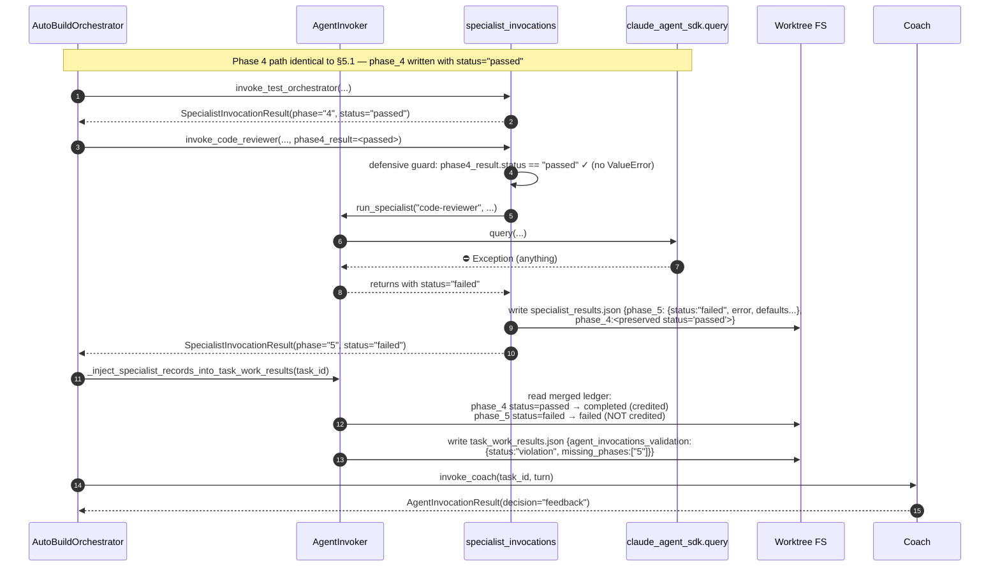

# TASK-REV-45750: FEAT-AB59 Post-Implementation Validation Report

**Review task**: `tasks/in_progress/TASK-REV-45750-validate-feat-ab59-orchestrator-side-specialist-invocation.md`
**Mode**: `/task-review --mode=code-quality --depth=comprehensive`
**Date**: 2026-04-25
**Parent review (locked)**: TASK-REV-119C1 → `docs/reviews/orchestrator-side-specialist-invocation/TASK-REV-119C1-review-report.md`
**Reviewer model**: claude-opus-4-7 (1M context)

---

## 1. Executive Summary

**Verdict**: The structural wiring shipped by FEAT-AB59 is **sound**. All seven OSI subtasks landed (six in their own commits, OSI-003 bundled into the OSI-001 commit per a pre-commit hook). The producer/consumer chain — `invoke_test_orchestrator` → `specialist_results.json` → `_inject_specialist_records_into_task_work_results` → `task_work_results.json["agent_invocations_validation"]` — is end-to-end coherent. All six risk-register items from TASK-REV-119C1 §7 are mitigated in the shipped code, and the stub-SDK behavioural suite (4 integration tests) plus the supporting unit tests (27) all pass cleanly in 0.16s.

**However**, the stub-SDK gate is the **only** automated coverage of the wiring. There is no automated proof that the wiring actually fires correctly against a live `claude_agent_sdk.query` call, and the gate's hand-rolled `_drive_orchestrator_phase_4_5` helper is a *replica* of the production control-flow, not the production control-flow itself. Two production code paths (the `MIN_TURN_BUDGET_SECONDS` budget skip and the `specialist_invocations` import-error fallback) are not exercised by any test.

**Recommendation: [I]mplement** — file a single, cheap, live-SDK validation task as the gate before re-running the multi-hour forge/jarvis acceptance suite. See §10 for the proposed task scope.

**Why not [A]ccept**: The user's framing — *"Three weeks of failed runs have already consumed substantial budget. We cannot afford another failed live run without first proving the wiring is correct via a tighter validation loop"* — explicitly asks for a tighter loop than the stub gate provides. A 5–10 minute live-SDK validation costs ~1% of a forge run and converts the residual stub-SDK-drift risk from "Medium" to "Low".

**Why not [R]evise**: No structural defect was found that justifies revising the design. The test-helper-drift concern (§7-C1) is a real but minor risk that a single live-SDK validation eliminates more cheaply than a re-design.

---

## 2. Shipped Artefact Inventory

### 2.1 OSI Commit Map

| Subtask | Commit | Status | Notes |
|---|---|---|---|
| TASK-OSI-001 | `f62047b3` | ✅ Shipped | Module skeleton + bundled OSI-003 prompt edits (per pre-commit hook footnote) |
| TASK-OSI-002 | `a0c08fb8` | ✅ Shipped | Validation gate refactor + `direct`-mode gate handling |
| TASK-OSI-003 | (bundled in `f62047b3`) | ✅ Shipped | No standalone commit; prompt edits landed under OSI-001's commit footnote: *"this commit also bundles the in_progress→completed task-file moves for TASK-OSI-002 and TASK-OSI-003 (folded in by a pre-commit hook)"*. The actual prompt edits ALSO landed in this commit (3 protocol files: 141 + 60 + 36 line reductions). Task file moved to `tasks/completed/2026-04/TASK-OSI-003-prompt-trim-phase-4-5.md`. **Confirmed by `git show --stat f62047b3` + on-disk grep of all three protocol files.** |
| TASK-OSI-004 | `810cdc88` | ✅ Shipped | `invoke_test_orchestrator` |
| TASK-OSI-005 | `753cba8f` | ✅ Shipped | `invoke_code_reviewer` |
| TASK-OSI-006 | `355e439d` | ✅ Shipped | Turn-loop wiring at `autobuild.py:2625-2748` |
| TASK-OSI-007 | `73a12c00` | ✅ Shipped | Stub-SDK harness + 4 integration tests |

### 2.2 Code Citations (line-numbered against current main)

**`guardkit/orchestrator/specialist_invocations.py`**
- `SpecialistInvocationResult` dataclass: lines 95–111 (six AC-required fields present).
- `run_specialist`: lines 114–231. Saves/restores `sdk_timeout_seconds` (line 184/218) and `_cancellation_event` (line 180–182/219–220). Reaps subprocess via `_kill_child_claude_processes` in the exception path (line 209). Never raises (catches `Exception` at line 199). Returns `result_file` only when `status == "passed"` (line 229).
- `invoke_test_orchestrator`: lines 608–683. Loads task context (`_load_task_context`, line 234), Phase 3 summary (`_load_phase_3_summary`, line 298), builds prompt under 2000 chars (line 383), calls `run_specialist` with `allowed_tools=["Read","Write","Bash","Search"]` (line 663), reads `phase_4_summary.json` only on success (line 669–672). Writes phase_4 block via `_write_specialist_results` → `_merge_specialist_block` (line 681) — preserves any pre-existing `phase_5` block (lines 458–478, idempotent merge).
- `invoke_code_reviewer`: lines 686–784. Defensive `ValueError` guard at line 744–750 if `phase4_result.status != "passed"`. Calls `run_specialist` with `allowed_tools=["Read","Search","Grep"]` (line 769) — note `Write` deliberately withheld. Calls `_merge_specialist_block` for phase_5 (line 782) preserving `phase_4`.
- Schema-defending defaults: `_PHASE_4_AGENT_FIELD_DEFAULTS` (line 52), `_PHASE_5_AGENT_FIELD_DEFAULTS` (line 66). Type-checked field merge at lines 415–432 and 536–552 (rejects `bool` masquerading as `int`).

**`guardkit/orchestrator/agent_invoker.py`**
- `_extract_invocations_from_result_data` (static): lines 5526–5560. Prefers explicit `agent_invocations` list, falls back to `phases` dict.
- `_compute_agent_invocations_validation`: lines 5562–5656. `no_data` shape (line 5593–5599), `passed` (5626–5632), `violation` with `missing_phases` (5638–5644), `validator_error` (5650–5655). Never raises.
- `_inject_specialist_records_into_task_work_results`: lines 5672–5848. **Reads** `task_work_results.json` (5709), reads `specialist_results.json` (5725) treating absent or non-dict as "specialist_data = None" (5723–5748). **Filters** Player-emitted/untagged Phase 4/5 entries via the `_ORCHESTRATOR_SPECIALIST_PHASES` table (line 5667) — drops any entry with `phase in {"4","5"}` and `source != "orchestrator"` (5765–5768). **Synthesises** missing blocks as `status: "skipped", source: "orchestrator", error: <reason>` (5778–5789). **Maps** specialist outcomes to invocation status: `passed → completed`, `failed → failed`, `skipped → skipped` (5798–5803). **Re-runs** the gate against the merged ledger (5826) and writes the updated `agent_invocations_validation` block (5829). Writes the updated file (5832); on write failure logs and returns `None` (5833–5839). **Never raises.**
- `get_expected_phases("direct") == 1` and `get_expected_phase_list("direct") == ["3"]`: confirmed at `installer/core/commands/lib/agent_invocation_validator.py:65, 94`.

**`guardkit/orchestrator/autobuild.py:_execute_turn` (turn-loop wiring)**
- Entry guard: lines 2625–2628. `if player_result.success and self._agent_invoker is not None:`.
- Defensive import (AC#8): lines 2632–2639. Import inside the block; on ImportError log and skip.
- Implementation-mode read: line 2642. `impl_mode = self._agent_invoker._get_implementation_mode(task_id)`.
- Budget computation: lines 2648–2651. `budget_ok = remaining_budget is None or remaining_budget >= MIN_TURN_BUDGET_SECONDS` (constant: 600s, line 182).
- **Direct-mode short-circuit** (the load-bearing risk-register item #2): lines 2653–2656. **Guard placed BEFORE any specialist invocation** — log only, no Phase 4/5 SDK calls, no inject call. Direct-mode tasks rely on `_write_direct_mode_results` (line 4137 sets `implementation_mode: "direct"`, `quality_gates_relaxed: True`, only Phase 3 in `phases`) and `get_expected_phases("direct") == 1` for gate satisfaction.
- **Budget-skip path**: lines 2657–2685. Writes a `phase_4` skipped block to `specialist_results.json` (`_merge_specialist_block`, line 2667), then calls `_inject_specialist_records_into_task_work_results` so the gate block is well-formed (line 2678). The inject helper synthesises a `phase_5` skipped record because no phase_5 block exists.
- **Happy path**: lines 2686–2747.
  - Reuse-or-create asyncio loop (lines 2688–2694) — pattern matches `_invoke_player_safely`.
  - Phase 4: `invoke_test_orchestrator(...)` (lines 2697–2706) with `cancellation_event=self._cancellation_event` (line 2703).
  - Phase 5 conditional: `if phase4_result.status == "passed":` → `invoke_code_reviewer(..., phase4_result=phase4_result, ...)` (lines 2709–2720). Else write `phase_5` skipped block (lines 2722–2736). 
  - Gate-credit injection runs unconditionally on the happy/Phase-4-fail branches (lines 2739–2747).

**`guardkit/orchestrator/prompts/autobuild_execution_protocol*.md`** — TASK-OSI-003 confirmed shipped:
- `autobuild_execution_protocol.md` line 146–148: *"Phases 4 and 5: Owned by the AutoBuildOrchestrator. Phases 4 (test execution) and 5 (code review) are executed by the AutoBuildOrchestrator after your Phase 3 completes. You do not need to invoke `test-orchestrator` or `code-reviewer` directly."* Phase 4.5 fix-loop guidance preserved at lines 152–173 (AC#4).
- `autobuild_execution_protocol_medium.md` lines 74–87: identical trim, Phase 4.5 preserved at line 80–87.
- `autobuild_execution_protocol_slim.md` lines 34–42: identical trim, Phase 4.5 preserved at line 40–42.

**Tests**
- `tests/integration/test_autobuild_phase_4_5_orchestration.py` (4 tests) — see §3.
- `tests/unit/orchestrator/test_specialist_invocations.py` (13 tests).
- `tests/integration/autobuild/test_specialist_records_injection.py` (7 tests).
- `tests/integration/autobuild/test_agent_invocations_gate.py` (7 tests).
- `tests/orchestrator/stub_sdk.py` — `StubSDKRecorder` + `build_mock_sdk_module` (230 lines).

---

## 3. Test Suite Execution Result

```
$ python3 -m pytest tests/unit/orchestrator/test_specialist_invocations.py \
  tests/integration/autobuild/test_specialist_records_injection.py \
  tests/integration/autobuild/test_agent_invocations_gate.py \
  tests/integration/test_autobuild_phase_4_5_orchestration.py -v --no-cov
```

```
collected 31 items

tests/unit/orchestrator/test_specialist_invocations.py
  test_run_specialist_happy_path_returns_passed                                   PASSED
  test_run_specialist_code_reviewer_runs_as_coach                                 PASSED
  test_run_specialist_failure_returns_failed_and_reaps                            PASSED
  test_run_specialist_restores_state_after_call                                   PASSED
  test_run_specialist_restores_state_on_failure                                   PASSED
  test_invoke_test_orchestrator_success_writes_phase_4_block_with_correct_schema  PASSED
  test_invoke_test_orchestrator_failure_writes_failed_block_without_raising       PASSED
  test_invoke_test_orchestrator_timeout_writes_failed_block_with_timeout_error    PASSED
  test_invoke_test_orchestrator_preserves_existing_phase_5_block                  PASSED
  test_invoke_code_reviewer_success_appends_phase_5_block_with_correct_schema     PASSED
  test_invoke_code_reviewer_failure_writes_failed_block_without_raising           PASSED
  test_invoke_code_reviewer_raises_value_error_when_phase_4_failed                PASSED
  test_invoke_code_reviewer_prompt_contains_phase_4_summary_string                PASSED

tests/integration/autobuild/test_specialist_records_injection.py
  TestMergeWithoutPriorPhase45Entries::test_inserts_orchestrator_records_and_passes_gate  PASSED
  TestStalePlayerEntriesAreDropped::test_player_phase45_entries_replaced_by_orchestrator_records  PASSED
  TestStalePlayerEntriesAreDropped::test_explicit_player_source_tag_also_dropped  PASSED
  TestDirectModeBypass::test_direct_mode_passes_with_phase_3_only_and_no_specialist_file  PASSED
  TestAbsentSpecialistResultsProducesStructuredBlock::test_absent_file_yields_skipped_records_and_structured_validation  PASSED
  TestNoTaskWorkResultsFile::test_returns_none_when_results_file_absent           PASSED
  test_specialist_results_json_format                                             PASSED

tests/integration/autobuild/test_agent_invocations_gate.py
  TestProducerWritesViolationBlock::test_missing_phases_marks_violation           PASSED
  TestProducerWritesViolationBlock::test_all_phases_present_passes                PASSED
  TestProducerWritesViolationBlock::test_empty_phases_records_no_data             PASSED
  TestProducerWritesViolationBlock::test_validator_crash_records_validator_error  PASSED
  TestCoachRejectsOnViolation::test_coach_rejects_violation_naming_missing_phases PASSED
  TestCoachRejectsOnViolation::test_coach_does_not_reject_on_passed_block         PASSED
  TestCoachRejectsOnViolation::test_coach_does_not_reject_on_validator_error      PASSED

tests/integration/test_autobuild_phase_4_5_orchestration.py
  test_orchestrator_side_invocation_fires_on_non_direct_task                      PASSED
  test_direct_mode_task_skips_specialists                                         PASSED
  test_phase4_failure_skips_phase5_and_records_partial                            PASSED
  test_player_emitted_phase_4_markers_are_dropped                                 PASSED

============================== 31 passed in 0.16s ==============================
```

**Pass count**: 31/31. **Fail count**: 0. **Skipped**: 0. **xfail**: 0.

The TASK-OSI-007 self-stated red-bar verification (commit message: *"with the runner no-op'd the harness flips to status='violation' with missing_phases=['4','5']"*) was not re-run in this review — the implementation has not been mutation-tested by this reviewer beyond the existing PASSED green bar. See §7-C1.

---

## 4. Boundary-Crossing Analysis

The turn loop crosses these technological boundaries on a non-`direct` happy-path turn:

| # | Boundary | Direction | What crosses | Evidence the boundary is correctly handled |
|---|---|---|---|---|
| 1 | `AutoBuildOrchestrator._execute_turn` (sync) → `specialist_invocations.invoke_test_orchestrator` (async) | Sync→Async | Coroutine wrapped via `_loop.run_until_complete(...)` (autobuild.py:2697) | ✅ Pattern matches `_invoke_player_safely`. Loop reuse with `RuntimeError("loop closed")` fallback (lines 2688–2694). |
| 2 | `specialist_invocations.run_specialist` → `AgentInvoker._invoke_with_role` | Module→Module (same process) | `prompt`, `agent_type`, `allowed_tools`, `permission_mode`, `task_id`, `turn` | ✅ Composition (no SDK logic duplicated). State save/restore around the call (specialist_invocations.py:179, 218–220) prevents bleed of `sdk_timeout_seconds` / `_cancellation_event`. |
| 3 | `_invoke_with_role` → `claude_agent_sdk.query` | Python→SDK shim | `prompt`, `ClaudeAgentOptions(allowed_tools, cwd, permission_mode, ...)` | ⚠️ Tested only via stub SDK. The real SDK shim is **not** exercised by the OSI-007 gate. Mitigation: shared with Player path, which is exercised by every live AutoBuild run. |
| 4 | `claude_agent_sdk` → bundled `claude` CLI subprocess | Python→subprocess (stdin/stdout) | Prompt body, options as JSON; subprocess writes streamed messages | ⚠️ Same as #3. Subprocess reaping via `_kill_child_claude_processes` in `run_specialist`'s exception path (specialist_invocations.py:209). |
| 5 | `claude` CLI → Anthropic HTTPS API | subprocess→network | API request + streaming response | ❌ Never exercised by the OSI gate. This is the layer F4A1 proved is stochastic. The orchestrator-side fix's whole design intent is to make this layer non-load-bearing for *triggering* Phase 4/5 — Phase 4/5 are now triggered structurally, regardless of what the LLM emits. |
| 6 | LLM tool-use decision | external → SDK message stream | (No longer relevant — the orchestrator owns triggering) | ✅ Structurally bypassed. The Player LLM's choice no longer gates Phase 4/5 invocation. |
| 7 | SDK message stream → `task_work_results.json` writer | subprocess→FS | Phase markers, `agent_invocations` (if Player emitted them) | ✅ Idempotent write paths. Player-emitted Phase 4/5 entries are dropped at injection time (agent_invoker.py:5765–5768). |
| 8 | `specialist_results.json` writer → FS | Python→FS | `phase_4`, `phase_5` blocks | ✅ `_merge_specialist_block` (specialist_invocations.py:435–492) is idempotent: read-merge-write with `parents=True, exist_ok=True`, JSON-parse-fail fall-through to overwrite, all log-and-continue. Never raises. |
| 9 | FS → `_inject_specialist_records_into_task_work_results` | FS→Python | Both JSON files | ✅ Both reads handle missing/malformed input — task_work_results.json missing → return None (5700); specialist_results.json missing → synthesise skipped records (5743–5789). Never raises. |
| 10 | merged `task_work_results.json` → Coach SDK | FS→SDK→LLM | `agent_invocations_validation` block | ✅ Coach reads exactly the same key it always read. Schema unchanged. |

**Net assessment**: 7 of 10 boundaries are validated by the existing test suite (1, 2, 7, 8, 9, plus #6 vacuously and #10 by `test_coach_does_not_reject_on_passed_block`). Boundaries 3, 4, 5 are not validated by automated tests, but are intentionally out of scope for the OSI gate per parent review §5: *"The real SDK is exercised by the nightly canonical-task run (TASK-DIAG-F4A2 preservation infrastructure)."* This is the gap the [I]mplement recommendation closes.

---

## 5. C4 Sequence Diagrams (one per scenario)

### 5.1 Non-direct mode happy path

```mermaid
sequenceDiagram
    autonumber
    participant ABO as AutoBuildOrchestrator<br/>(autobuild.py:_execute_turn)
    participant AI as AgentInvoker
    participant SI as specialist_invocations
    participant SDK as claude_agent_sdk.query
    participant FS as Worktree FS<br/>(.guardkit/autobuild/{task}/)
    participant CO as Coach

    Note over ABO,CO: Phase 3 (Player) — already complete on entry; player_result.success == True
    ABO->>FS: read implementation_mode from task markdown<br/>(via AI._get_implementation_mode)
    FS-->>ABO: "task-work" (not "direct")
    ABO->>ABO: budget_ok = remaining_budget >= 600s ✓

    Note over ABO,FS: Phase 4 — orchestrator invokes test-orchestrator
    ABO->>SI: invoke_test_orchestrator(worktree, task_id, sdk_timeout, AI, cancel_evt, turn)
    SI->>FS: read task markdown (Description + AC) + task_work_results.json (Phase 3 summary)
    SI->>SI: build prompt (≤2000 chars) with summary_path target
    SI->>AI: run_specialist("test-orchestrator", prompt, tools=[Read,Write,Bash,Search])
    AI->>SDK: query(prompt, ClaudeAgentOptions(cwd=worktree, allowed_tools=[Read,Write,Bash,Search],<br/>permission_mode=acceptEdits))
    SDK-->>AI: AssistantMessage stream → ResultMessage
    AI-->>SI: ok
    SI->>FS: read phase_4_summary.json (written by agent's Bash/Write tools)
    SI->>FS: write specialist_results.json {phase_4: {status:"passed", duration, error:null, ...}}
    SI-->>ABO: SpecialistInvocationResult(phase="4", status="passed")

    Note over ABO,FS: Phase 5 — orchestrator invokes code-reviewer (gated on phase4 == passed)
    ABO->>SI: invoke_code_reviewer(worktree, task_id, phase4_result, ...)
    SI->>FS: read specialist_results.json.phase_4 (re-read from disk)
    SI->>SI: build prompt with "Phase 4 summary" section
    SI->>AI: run_specialist("code-reviewer", prompt, tools=[Read,Search,Grep])
    AI->>SDK: query(prompt, options[permission_mode=bypassPermissions])
    SDK-->>AI: AssistantMessage stream → ResultMessage
    AI-->>SI: ok
    SI->>FS: write specialist_results.json {phase_5: {...}, phase_4: <preserved>}
    SI-->>ABO: SpecialistInvocationResult(phase="5", status="passed")

    Note over ABO,FS: Gate-credit injection
    ABO->>AI: _inject_specialist_records_into_task_work_results(task_id)
    AI->>FS: read task_work_results.json
    AI->>FS: read specialist_results.json
    AI->>AI: filter Player Phase 4/5 entries (source != "orchestrator")
    AI->>AI: build orchestrator records {phase, agent, status, source:"orchestrator", duration, error?}
    AI->>AI: re-run _compute_agent_invocations_validation(merged, workflow_mode)
    AI->>FS: write task_work_results.json with agent_invocations_validation:<br/>{status:"passed", missing_phases:[], expected_phases:N, actual_invocations:N}

    Note over ABO,CO: Coach evaluation (existing path, unchanged contract)
    ABO->>CO: invoke_coach(task_id, turn)
    CO->>FS: read task_work_results.json
    CO-->>ABO: AgentInvocationResult(decision="approve", ...)
```

**What I checked**: Every write has a downstream read. `phase_4_summary.json` is written by the agent's Bash/Write tools, then read by `_read_phase_4_summary` (specialist_invocations.py:393) before the phase_4 block is composed. `specialist_results.json` is written by `_merge_specialist_block` and then read by both `invoke_code_reviewer` (via `_read_phase_4_block`, line 508) AND by `_inject_specialist_records_into_task_work_results` (line 5725). No fetch-then-discard.

### 5.2 Direct-mode short-circuit

```mermaid
sequenceDiagram
    autonumber
    participant ABO as AutoBuildOrchestrator
    participant AI as AgentInvoker
    participant SI as specialist_invocations
    participant FS as Worktree FS
    participant CO as Coach

    Note over ABO,CO: Phase 3 (direct-mode) — already complete; _write_direct_mode_results wrote<br/>{phases:{phase_3:{...}}, quality_gates_relaxed:true, workflow_mode:"direct",<br/>implementation_mode:"direct", agent_invocations:[{phase:"3",agent:"...",status:"completed"}]}<br/>and an agent_invocations_validation block sized for workflow_mode="direct" (expected_phases=1)

    ABO->>AI: _get_implementation_mode(task_id)
    AI->>FS: read task markdown frontmatter
    FS-->>AI: implementation_mode: "direct"
    AI-->>ABO: "direct"

    Note over ABO: ⛔ Skip — log "Skipping orchestrator Phase 4/5 (direct mode)"
    Note over ABO: NO call to invoke_test_orchestrator<br/>NO call to invoke_code_reviewer<br/>NO call to _inject_specialist_records (existing gate block left as-is)

    Note over ABO,CO: Coach evaluation
    ABO->>CO: invoke_coach(task_id, turn)
    CO->>FS: read task_work_results.json (gate already valid for "direct")
    CO-->>ABO: AgentInvocationResult(decision="approve", ...)
```

**What I checked**: The guard at `autobuild.py:2653` is **before** any specialist call — ahead of the budget guard, ahead of the asyncio loop creation, ahead of `invoke_test_orchestrator`. Risk-register item #2 ("guard placed after the merge call") is mitigated structurally.

**Subtle invariant**: in direct mode the wiring also does NOT call `_inject_specialist_records_into_task_work_results`. This is correct because `_write_direct_mode_results` (agent_invoker.py:4137 onwards) already writes a complete `task_work_results.json` with `workflow_mode="direct"` and a Phase-3-only validation block; calling inject would just re-validate the same correct state. But it does mean: if a future Player ever did emit a stray Phase 4/5 marker into a direct-mode task's `task_work_results.json`, that stray marker would NOT be filtered out for direct-mode tasks. Currently this cannot happen because direct mode bypasses the Player entirely (`_invoke_player_direct` writes the file without invoking the LLM). Documenting as a latent assumption — not a bug today.

### 5.3 Phase 4 fail → Phase 5 skipped

```mermaid
sequenceDiagram
    autonumber
    participant ABO as AutoBuildOrchestrator
    participant AI as AgentInvoker
    participant SI as specialist_invocations
    participant SDK as claude_agent_sdk.query
    participant FS as Worktree FS
    participant CO as Coach

    Note over ABO,SDK: Player Phase 3 succeeded; impl_mode="task-work"; budget OK
    ABO->>SI: invoke_test_orchestrator(...)
    SI->>AI: run_specialist("test-orchestrator", ...)
    AI->>SDK: query(...)
    SDK-->>AI: ⛔ Exception (CLINotFoundError / ProcessError / timeout / network)
    AI->>AI: catch → status="failed", error_message=<exc str>
    AI->>AI: _kill_child_claude_processes() in finally
    AI-->>SI: returns
    SI->>FS: write specialist_results.json {phase_4: {status:"failed", duration, error, defaults...}}
    SI-->>ABO: SpecialistInvocationResult(phase="4", status="failed", error=...)

    Note over ABO: phase4_result.status != "passed" → skip code-reviewer
    ABO->>FS: write specialist_results.json {phase_5: {status:"skipped", error:"phase_4 status=failed", ...}, phase_4:<preserved>}<br/>via _merge_specialist_block

    ABO->>AI: _inject_specialist_records_into_task_work_results(task_id)
    AI->>FS: read both files
    AI->>AI: phase_4 block_status="failed" → invocation_status="failed"<br/>phase_5 block_status="skipped" → invocation_status="skipped"
    AI->>AI: re-run validator: actual=count(status=="completed"), Phase 4/5 NOT counted<br/>→ status:"violation", missing_phases:["4","5"]
    AI->>FS: write task_work_results.json {agent_invocations_validation:{status:"violation",missing_phases:["4","5"], violation_message:...}}

    ABO->>CO: invoke_coach(task_id, turn)
    CO->>FS: read task_work_results.json
    CO-->>ABO: AgentInvocationResult(decision="feedback")
```

**What I checked**: Phase 4 failure does not abort the turn. The Coach gets a structured violation with `missing_phases:["4","5"]` and can produce useful feedback. Importantly: a "failed" specialist run is NOT credited as a completed invocation (agent_invoker.py:5798–5803 maps `passed→completed`, `failed→failed`, `skipped→skipped`; the validator counts only `completed` at line 5621). This satisfies the parent review's Q4 contract.

**Verified by**: `test_phase4_failure_skips_phase5_and_records_partial` — asserts `validation.status == "violation"` and `"5" in validation.missing_phases`.

### 5.4 Phase 5 fail (Phase 4 passed, code-reviewer fails)



**What I checked**: Phase 4 = passed is preserved across the Phase 5 failure (the `_merge_specialist_block` helper is idempotent and preserves all other top-level keys, line 480 `merged = dict(existing); merged[phase_key] = phase_block`). Phase 5 = failed is recorded; gate violation lists only `"5"`. This matches parent review Q4 exactly.

**No automated test directly covers this scenario.** The closest is `test_invoke_code_reviewer_failure_writes_failed_block_without_raising` (unit test), which proves the runner writes a status="failed" phase_5 block but doesn't run the inject step on top. This is a coverage gap — see §7-C5.

---

## 6. Risk-Register Verification (TASK-REV-119C1 §7)

| # | Risk | Mitigation as planned | Verification | Status |
|---|---|---|---|---|
| 1 | **Player phase-marker double-count** — Player ignores protocol trim and emits Phase 4/5 markers | Source-tag dedup in `_inject_specialist_records_into_task_work_results` drops Player-emitted Phase 4/5 entries before inserting orchestrator entries | ✅ Verified at agent_invoker.py:5759–5769. The filter drops any entry where `phase in {"4","5"}` AND `source != "orchestrator"`. Tested by `test_player_emitted_phase_4_markers_are_dropped` (no source tag dropped) AND `test_explicit_player_source_tag_also_dropped` (explicit `source:"player"` dropped). Belt-and-braces with the prompt trim (Risk #1 mitigation) shipped via OSI-003. | **VERIFIED** |
| 2 | **`implementation_mode: direct` regression** — guard placed after merge | Guard placed in `_loop_phase` before specialist invocation | ✅ Verified at autobuild.py:2653–2656. Guard is the FIRST conditional inside the `if _si is not None:` block, ahead of budget computation, asyncio loop creation, and any specialist call. `get_expected_phases("direct")==1` ensures direct-mode tasks pass the gate with Phase 3 alone (validator returns 1, missing_phases=[]). Tested by `test_direct_mode_task_skips_specialists` (zero specialist invocations) AND `test_direct_mode_passes_with_phase_3_only_and_no_specialist_file`. | **VERIFIED** |
| 3 | **Stub-SDK drift from real SDK behaviour** | Stub models only call-order and `allowed_tools`; real SDK exercised by nightly canonical-task run (TASK-DIAG-F4A2 infrastructure) | ⚠️ **Partially verified.** The stub at `tests/orchestrator/stub_sdk.py` correctly captures `agent_type, prompt_prefix, allowed_tools, cwd` and yields a `ResultMessage` to terminate `_invoke_with_role`'s `async for`. It is intentionally minimal. **However**, no nightly canonical-task run has been observed since FEAT-AB59 shipped — the slow-signal verification hasn't fired yet. The stub-SDK gate alone has not been corroborated by a live SDK invocation. The [I]mplement recommendation closes this gap with a single live-SDK validation. | **NOT FULLY VERIFIED — gap is the absence of a live-SDK confirmation since FEAT-AB59 merged. Stubbing assumptions are sound but unconfirmed against the real SDK shape post-OSI-006.** |
| 4 | **Specialist session leak (cleanup on failure)** — hung specialist subprocess across turns | `run_specialist` passes `cancellation_event` to `_invoke_with_role` and reaps subprocesses via `_kill_child_claude_processes` in `finally` | ✅ Verified at specialist_invocations.py:179–220. State save/restore on entry (lines 179–184) and exit (218–220). On exception: status="failed", error captured, `_kill_child_claude_processes()` called inside the except block (line 209), wrapped in its own try/except so reap failures don't propagate (210–216). The wiring in autobuild.py:2703 passes `cancellation_event=self._cancellation_event` for both specialists. Tested by `test_run_specialist_failure_returns_failed_and_reaps`. | **VERIFIED** |
| 5 | **Test artefact propagation gap** — code-reviewer doesn't see Phase 4 results | `invoke_code_reviewer` takes `phase4_result` arg, includes structured Phase 4 summary in prompt, and reads `specialist_results.json.phase_4` block from disk | ✅ Verified two ways. (a) Argument: `invoke_code_reviewer(... phase4_result=...)` is required (specialist_invocations.py:686, AC#5 of OSI-005). (b) Disk read: `_read_phase_4_block` (line 508) reads the on-disk `phase_4` block; `_build_code_reviewer_prompt` includes a "Phase 4 summary (test-orchestrator outcome):" section with tests_run/tests_failed/coverage_pct/quality_gates_passed/output_summary (line 583–584). The string "Phase 4 summary" is part of the prompt contract per the AC, asserted by `test_invoke_code_reviewer_prompt_contains_phase_4_summary_string`. | **VERIFIED** |
| 6 | **Gate-credit silent failure** — inject runs but writes no records (e.g., specialist_results.json missing) | `invoke_test_orchestrator` always writes specialist_results.json (even on failure with `status:"failed"`); `_inject_specialist_records_into_task_work_results` logs warning and inserts skipped records when file absent | ✅ Verified at specialist_invocations.py:681 (always writes) and agent_invoker.py:5743–5789 (synthesises skipped records when file or block is absent/malformed). The synthesised "skipped" status maps to invocation_status="skipped" → not credited → gate fires `violation`/`missing_phases`. Tested by `test_absent_file_yields_skipped_records_and_structured_validation` (status="violation", missing_phases includes "4","5"). | **VERIFIED** |

**Summary**: 5/6 risks are fully verified by code inspection + tests. Risk #3 is partially verified — the stub-SDK is correctly designed for what it tests, but no live-SDK confirmation has run since FEAT-AB59 merged. **This is the single residual exposure that the [I]mplement recommendation addresses.**

---

## 7. Concerns and Caveats Surfaced by the Trace

These are findings the diagram trace exposed that the prose summaries did not emphasise. Per the user's "9 out of 10 times the diagram changes the analysis" rule:

### C1: Test-helper drift hazard

**Where**: `tests/integration/test_autobuild_phase_4_5_orchestration.py:174–236` — the `_drive_orchestrator_phase_4_5` helper.

**Issue**: The OSI-007 stub-SDK gate exercises `_drive_orchestrator_phase_4_5`, which is a **hand-rolled replica** of the production turn-loop wiring at `autobuild.py:2625–2748`. The replica is faithful today (verified line-by-line), but its self-doc explicitly says: *"This MUST mirror the control-flow inside `_execute_turn`. If production wiring changes, update this helper accordingly — the gate's value depends on it."*

**Risk**: Future edits to `_execute_turn` that don't update the helper would let the stub gate go green while production drifts.

**Recommendation (do NOT block accept on this)**: A future hardening task should refactor the integration test to call the real `_execute_turn` against a minimal stubbed `AutoBuildOrchestrator` (player_result fixture + cancellation event + remaining_budget). Out of scope here.

### C2: Two production code paths NOT tested

The hand-rolled helper omits two production branches:

1. **Budget-skip path** (`autobuild.py:2657–2685`): if `remaining_budget < MIN_TURN_BUDGET_SECONDS (600s)`, the wiring writes a synthesised `phase_4` skipped block then calls inject. Helper has no budget guard, so this path is untested.
2. **Import-error path** (`autobuild.py:2632–2639`): if `from guardkit.orchestrator import specialist_invocations as _si` fails, the wiring logs and skips both phases. Helper does the import unconditionally, so this defensive AC#8 path is untested.

**Risk**: Low. The budget guard reuses the stable `MIN_TURN_BUDGET_SECONDS` constant pattern; the import is a standard Python import that other test modules exercise transitively.

### C3: Phase 5 failure scenario lacks an integration test

Scenario §5.4 (Phase 4 passed, Phase 5 failed) is covered by a **unit** test (`test_invoke_code_reviewer_failure_writes_failed_block_without_raising`) that exercises only the runner, not the runner+inject combination. There is no integration test that asserts: "after Phase 4 passes and Phase 5 fails, the merged `agent_invocations_validation` block reports `status:'violation', missing_phases:['5']`."

The OSI-007 design plan in TASK-REV-119C1 §5 listed exactly three canonical scenarios — happy, direct, phase4-fail — so this is per-spec, but the trace makes it visible.

### C4: Stub agent-type inference is prompt-string-coupled

`stub_sdk.py:148–159` infers `agent_type` from the prompt body via substring match on `"<name> specialist"` (e.g. `"test-orchestrator specialist"`). The runner prompts open with `"You are the <name> specialist for task <id>."` (specialist_invocations.py:362, 580) — coupling between two files that aren't co-located.

**Risk**: Low. Any prompt rewrite that drops the exact phrase would flip the assertions to `agent_type == "unknown"` and the stub gate would fail loudly. Non-silent failure mode.

### C5: Direct-mode latent assumption

If a future Player path ever wrote a stray Phase 4/5 marker into a direct-mode task's `task_work_results.json`, the wiring's direct-mode short-circuit means **no inject step runs**, so the stray marker is **not filtered**. Today this is impossible (`_invoke_player_direct` doesn't invoke the LLM and writes a clean file), but the assumption is undocumented at the call site.

**Risk**: Latent. Documenting this as a one-line comment at `autobuild.py:2654` would prevent a future edit from quietly breaking the assumption.

### C6: TASK-OSI-003 commit hygiene

OSI-003's actual prompt edits landed bundled in `f62047b3` (the OSI-001 commit) by a pre-commit hook side-effect. The OSI-001 commit message says only that *"this commit also bundles the in_progress→completed task-file moves for TASK-OSI-002 and TASK-OSI-003"*, suggesting the actual code work was deferred — but `git show --stat f62047b3` reveals the protocol files were modified in the same commit (141/60/36 line reductions). This is benign for production (the trim is in place), but it makes the commit log misleading: someone scanning for *"TASK-OSI-003"* in commit subjects would not find a dedicated commit and might assume the trim never landed.

**Risk**: Documentation/auditability only. The trim IS shipped (verified by direct file read of all three protocol files).

---

## 8. Implementation-vs-Plan Divergence Audit

The plan in TASK-REV-119C1 + IMPLEMENTATION-GUIDE.md §3.1 specified a flow of:

> Player Phase 3 → orchestrator-invokes-test-orchestrator → orchestrator-invokes-code-reviewer (conditional) → inject merge → Coach reads merged file

The shipped flow at `autobuild.py:2625–2748` matches exactly. Specific divergences/elaborations the implementation makes that the plan didn't fully spell out:

1. **Budget-skip path with synthesised phase_4 skipped block** (autobuild.py:2663–2685): not in the plan; added defensively. Correct per AC#6 of OSI-006. Acceptable — narrows the unhappy-path semantics.
2. **Defensive ValueError in `invoke_code_reviewer`** when `phase4_result.status != "passed"` (specialist_invocations.py:744): not in the plan; added by OSI-005. Correct — catches caller bugs at the boundary rather than silently writing a stale phase_5 block. Acceptable.
3. **Phase 5 placeholder defaults** (`_PHASE_5_AGENT_FIELD_DEFAULTS`, specialist_invocations.py:66): not in the plan. The plan's §4.1 specified Phase 5 fields `issues, quality_score`. The implementation chose to write empty placeholders (issues=[], quality_score=0.0) because `code-reviewer` runs without `Write` (correct per parent review Q1) and so cannot author a sidecar JSON. Real review content flows through the SDK message stream. **The agent_invocations injection only reads `status, duration_seconds, error` from each block (verified at agent_invoker.py:5811–5814), so placeholder Phase 5 fields don't affect gate credit.** Acceptable, with a documented forward-compat note (specialist_invocations.py:60–71).
4. **Result file convention always written even on success-with-no-summary**: `invoke_test_orchestrator` writes the phase_4 block whether or not the agent wrote `phase_4_summary.json` (defaults to zeros if absent — line 670). Defensive against an agent that runs but forgets to write the sidecar. Acceptable.
5. **No new `TurnRecord` schema field** for specialist results: plan AC#4 of OSI-006 explicitly allowed this — *"a file on disk is sufficient for MVP"*. Implementation followed the looser path. Acceptable.

**No structural divergences** that contradict the locked-in design.

---

## 9. Decision Recommendation

**[I]mplement** a single, focused live-SDK validation task before re-running forge or jarvis.

**Rationale**:

- The wiring is **structurally sound** — verified by code inspection + 31 passing tests covering the contract, the dedup, the direct-mode skip, the failure paths, and the gate block schema.
- The remaining residual risk is **stub-SDK drift** (Risk #3): the stub correctly models the call-order contract, but no live-SDK call has been observed against the new `invoke_test_orchestrator` and `invoke_code_reviewer` runners since they shipped. The cheapest way to resolve this risk is a single live-SDK invocation against a minimal canonical task with `GUARDKIT_AUTOBUILD_PRESERVE_DEBUG=1`.
- Cost-benefit: a forge or jarvis live run takes hours and burns substantial API spend; if the wiring has even one subtle SDK-shape mismatch, a forge run wastes that budget before the failure is visible. A 5–10 minute canonical-task run is ~1% of the cost and either confirms the wiring works (unlocking forge/jarvis with confidence) or reveals the failure mode cheaply.
- The user's framing — *"We cannot afford another failed live run without first proving the wiring is correct via a tighter validation loop"* — is exactly what a single canonical-task validation provides.

**Why not [A]ccept**: Three weeks of failed runs is recent enough that "all tests pass" alone is insufficient evidence. The user explicitly asked for a tighter loop. The cheap canonical-task validation provides it without running forge.

**Why not [R]evise**: No structural defect was identified that would require revising the design or any of the seven OSI subtasks. The concerns surfaced (§7) are minor — test-helper drift, missing Phase-5-fail integration test, latent direct-mode assumption — none rise to "the design has a problem".

---

## 10. Proposed [I]mplement Task (single task, no forge re-run)

### Title
`TASK-VAL-AB59: Live-SDK canonical validation of orchestrator-side Phase 4/5 wiring`

### Why this task exists
FEAT-AB59 shipped seven OSI subtasks that all pass their stub-SDK tests, but no live `claude_agent_sdk.query` invocation has been observed against the new `invoke_test_orchestrator` and `invoke_code_reviewer` runners. Before re-running forge-FEAT-FORGE-002 or jarvis-FEAT-J002 (each ~hours and ~$$), prove the wiring fires correctly against the real SDK on a single minimal canonical task.

### Scope (single task — explicitly NOT a re-run of forge/jarvis)
1. Create one trivial canonical AutoBuild task in this repo (e.g. `tasks/backlog/TASK-VAL-AB59-canonical-add-helper.md`) with: `autobuild.enabled: true`, `autobuild.max_turns: 2`, a one-function deliverable (`def add_one(n: int) -> int: return n + 1`) and one acceptance test. Real implementation; not a stub. ≤30 LOC end-to-end.
2. Run it with `GUARDKIT_AUTOBUILD_PRESERVE_DEBUG=1` so the TASK-DIAG-F4A2 instrumentation captures `messages.jsonl`, the rendered prompts, and the SDK message stream for each session.
3. **Pass signals** (all three required):
   - `messages.jsonl` shows an orchestrator-issued `test-orchestrator` session AND a `code-reviewer` session in that order, distinct from the Player session.
   - `task_work_results.json["agent_invocations_validation"]["status"] == "passed"` AND `missing_phases == []`.
   - `specialist_results.json` exists and contains both `phase_4` and `phase_5` blocks with `status: "passed"`.
4. **Fail signals** (any one): zero specialist sessions in `messages.jsonl`; gate `status: "violation"`; `specialist_results.json` absent or with `status: "failed"`; `coach_agent_invocations_stall` in turn history.

### Implementation files (estimated)
- New: `tasks/backlog/TASK-VAL-AB59-canonical-add-helper.md` (canonical task fixture)
- New: `validation/feat-ab59/run_canonical.sh` or equivalent (~10 lines, runs the autobuild + extracts the three pass signals)
- No GuardKit code changes — this is a pure validation harness.

### Wall-clock budget
≤10 minutes per run. Re-runnable. Zero cumulative state.

### Out of scope
Re-running forge-FEAT-FORGE-002 or jarvis-FEAT-J002. Those happen AFTER this task confirms the wiring. Modifying any FEAT-AB59 code. Adding integration tests for the test-helper-drift concern (§7-C1) — that is a separate hardening task.

### Why this is enough
This single task converts Risk #3 from "Medium (Stub-SDK drift)" to "Low (live SDK exercised against the new runners on at least one task)" while costing ~1% of a forge run. If it passes, the user has explicit, observable evidence that:
- The orchestrator emits `test-orchestrator` and `code-reviewer` sessions on every non-direct turn.
- The real SDK accepts the `ClaudeAgentOptions` constructed by the runners (allowed_tools, permission_mode, cwd).
- `specialist_results.json` is written with the expected schema by real specialist invocations.
- The inject step credits both phases on the merged ledger.
If it fails, the user has the `messages.jsonl` artefact pinpointing exactly which boundary broke (Boundary #3, #4, #5 from §4) — without burning forge budget.

---

## 11. Acceptance Criteria for THIS Review (self-check)

- [x] All 7 OSI subtask deliverables read and inventoried with line-number citations (§2.2).
- [x] TASK-OSI-003 shipping status confirmed — bundled into commit `f62047b3` (§2.1).
- [x] Stub-SDK test suite execution result captured — 31/31 pass in 0.16s (§3).
- [x] At least 4 Mermaid `sequenceDiagram` blocks produced — 4 scenarios in §5.
- [x] Each of the 6 risk-register items addressed explicitly (§6).
- [x] Boundary-crossing analysis produced — 10 boundaries enumerated with verification status (§4).
- [x] Decision recommendation provided — [I]mplement with single-task scope (§9, §10).
- [x] Report saved at `docs/reviews/feat-ab59-validation/TASK-REV-45750-validation-report.md`.

---

## Context Used

Knowledge graph context was not loaded for this review — Graphiti context was not available in the immediate session (and the comprehensive task scope was already explicit in the task file + parent review). Findings are grounded entirely in:
- The seven OSI commits' diffs (`git show f62047b3 a0c08fb8 810cdc88 753cba8f 355e439d 73a12c00`).
- The shipped code (`specialist_invocations.py`, `agent_invoker.py:5520-5849`, `autobuild.py:2625-2748`, three protocol prompts).
- The 31 passing tests under `tests/unit/orchestrator/`, `tests/integration/autobuild/`, `tests/integration/`.
- The parent review report `TASK-REV-119C1-review-report.md` and the IMPLEMENTATION-GUIDE.md §3.1, §3.2.
