# AutoBuild Diagnostic Diagrams — TASK-REV-SFT1

> **Purpose**: Map every execution path through the AutoBuild system to verify proposed fixes (R1-R7), detect interaction risks, and surface as-yet-undetected bugs.
> **Method**: Follows FEAT-DG-001 mandatory diagram patterns — data flow, sequence, integration contracts, state machines.
> **Generated from**: Review report `TASK-REV-SFT1-review-report.md` + code tracing of `autobuild.py`, `feature_orchestrator.py`, `agent_invoker.py`, `coach_validator.py`, `coach_verification.py`, `state_detection.py`

---

## 1. C4 Component Diagram — AutoBuild Bounded Context

Shows all components involved in autobuild execution and their relationships. Colour coding: 🟢 healthy, 🟡 fix proposed, 🔴 broken/bug confirmed.

**🔍 What to look for**: Red nodes are confirmed broken (F1, F2). Orange nodes have confirmed bugs (F3, F4, F6). Follow the timeout path from `AI_SDK` → `AB_RECOVERY` → `AB_SYNTHETIC` → `CV_VALIDATE` → `AB_FEEDBACK` — this is the death spiral.

---

## 2. Complete Execution Path Diagram — All Branches

This is the master diagram. Every decision point, every branch, every exit condition.

**🔍 What to look for**: Follow the red nodes from `SDK_WRAP` → `RECOVERY_ZERO` → `SYNTHETIC` → `MATCH_TEXT` → `USE_DESC` → `STALL_CHECK`. That's the death spiral. Every path through `SYNTHETIC` is doomed because it produces reports the Coach can never approve.

---

## 3. The Death Spiral — Sequence Diagram (What Actually Happened)

This shows the actual Turn 1-8 execution with each finding annotated.

```mermaid
sequenceDiagram
    participant FO as Feature Orchestrator
    participant AB as AutoBuild Loop
    participant AI as Agent Invoker
    participant SDK as Claude SDK
    participant SR as State Recovery
    participant CV as CoachValidator
    participant PT as pytest
    participant GR as Graphiti

    Note over FO,GR: Turn 1 — Player completes, Coach rejects

    FO->>AB: _execute_task(SFT-001)
    AB->>AI: invoke_player(mode=task-work)
    AI->>SDK: query("/task-work TASK-SFT-001 --mode=tdd")
    SDK-->>AI: 70+ messages, 5 files created
    AI-->>AB: Player report (no completion_promises in task_work_results)

    AB->>CV: validate(task_id, turn=1)
    CV->>CV: validate_requirements()
    Note over CV: ⚠️ F2: No completion_promises<br/>Falls through to _match_by_text()<br/>empty requirements_met → 0/10
    CV-->>AB: FEEDBACK {issues: ["Not all AC met"]}

    AB->>AB: _extract_feedback()
    Note over AB: ⚠️ F4: Uses issues[].description<br/>Discards specific rationale
    AB-->>AB: feedback = "Not all acceptance criteria met"

    Note over FO,GR: Turn 2 — SDK Timeout (0 messages)

    AB->>AI: invoke_player(mode=task-work)
    AI->>SDK: query("/task-work TASK-SFT-001 --mode=tdd")
    Note over SDK: ⚠️ F1: Session preamble<br/>consumes entire 1800s
    SDK--xAI: asyncio.TimeoutError (0 messages)

    AI->>SR: _attempt_state_recovery()
    SR->>PT: pytest --tb=no -q (ENTIRE worktree)
    Note over PT: ⚠️ F3: Pre-existing failures<br/>mask new seam tests
    PT-->>SR: 0 tests, returncode=1
    SR-->>AB: Synthetic report {requirements_addressed: [], tests: 0}

    AB->>CV: validate(recovered report)
    Note over CV: ⚠️ F2: Empty report → 0/10
    CV-->>AB: FEEDBACK (identical to Turn 1)

    Note over FO,GR: Turn 3-4 — Same pattern repeats

    Note over FO: ⚠️ F5: Task timeout (2400s) fires
    FO--xAB: asyncio.wait_for timeout
    Note over FO: Feature declares FAILED
    Note over AB: ⚠️ F5: Thread CONTINUES<br/>Cannot be cancelled

    Note over FO,GR: Turn 5 — Player SUCCEEDS but timeout kills it

    AB->>AI: invoke_player(mode=task-work)
    AI->>SDK: query("/task-work TASK-SFT-001 --mode=tdd")
    SDK-->>AI: 107 messages! 13 tests! Score 88/100!
    Note over SDK: ⚠️ F1: Timeout fires during<br/>final output serialization
    SDK--xAI: asyncio.TimeoutError (107 messages, incomplete)

    AI->>SR: _attempt_state_recovery()
    SR->>PT: pytest --tb=no -q (ENTIRE worktree)
    Note over PT: ⚠️ F3: 13 seam tests EXIST<br/>but masked by other failures
    PT-->>SR: 0 tests

    SR->>GR: Create episode
    Note over GR: ⚠️ F6: Connection refused<br/>FalkorDB unreachable
    GR--xSR: Connection error

    SR-->>AB: Synthetic report {tests: 0, req: []}
    AB->>CV: validate → 0/10 → FEEDBACK (identical)

    Note over FO,GR: Turns 6-8 — Identical feedback stall

    AB->>AB: _is_feedback_stalled()
    Note over AB: MD5(feedback) = c1ddd473<br/>3 consecutive identical turns
    AB-->>AB: UNRECOVERABLE_STALL

    Note over AB: Thread finally exits<br/>68 minutes after feature declared FAILED
```

**🔍 What to look for**: Turn 5 is the tragedy. The Player did everything right. The system's inability to capture those results (F1 timeout + F3 test masking + F2 synthetic report) turned a success into a failure.

---

## 4. Data Flow Diagram — Player-Coach Feedback Loop

Following FEAT-DG-001's pattern exactly. Shows all read/write paths with disconnections marked.

```mermaid
flowchart LR
    subgraph Writes["✏️ Write Paths"]
        W1["Player output\n(task_work_results.json)"]
        W2["_build_synthetic_report()\n(on timeout)"]
        W3["CoachValidator\n._feedback_result()"]
        W4["_capture_turn_state()\n(Graphiti episode)"]
    end

    subgraph Data["💾 Data Stores / Interfaces"]
        D1[("task_work_results.json\n{completion_promises,\nrequirements_met,\nfiles_modified}")]
        D2[("Synthetic report\n{requirements_addressed: [],\ncompletion_promises: NONE}")]
        D3[("Coach result\n{issues[], rationale,\nmissing_criteria[]}")]
        D4[("Graphiti episodes\n(turn state)")]
        D5[("pytest results\n(returncode, stdout)")]
    end

    subgraph Reads["👁️ Read Paths"]
        R1["_match_by_promises()\nID-based matching"]
        R2["_match_by_text()\nText fallback"]
        R3["_extract_feedback()\n→ Player prompt"]
        R4["context_loader\n.get_coach_context()"]
        R5["CoachVerifier\n._run_tests()"]
    end

    W1 -->|"on success"| D1
    W2 -->|"on timeout"| D2
    W3 -->|"every turn"| D3
    W4 -->|"every turn"| D4

    D1 -->|"if promises exist"| R1
    D1 -->|"fallback"| R2
    D2 -.->|"⚠️ NEVER HAS PROMISES"| R1
    D2 -->|"always fallback"| R2

    D3 -->|"issues[].description only"| R3
    D3 -.->|"❌ rationale DISCARDED\nwhen issues[] non-empty"| R3
    D3 -.->|"❌ missing_criteria[]\nNEVER READ"| R3

    D4 -.->|"❌ FETCHED then DISCARDED\nby CoachValidator"| R4
    D5 -->|"returncode only"| R5

    style D2 fill:#fcc,stroke:#c00
    style R1 fill:#fcc,stroke:#c00
    style R3 fill:#fc9,stroke:#c60
    style R4 fill:#fcc,stroke:#c00
    style D5 fill:#fc9,stroke:#c60
```

**⚠️ Disconnection Alert**: 
- Synthetic reports (D2) can NEVER satisfy `_match_by_promises` — guaranteed 0/10 on every timeout recovery
- `rationale` and `missing_criteria` in Coach result (D3) are NEVER read by `_extract_feedback` when `issues[]` is populated
- Graphiti context (D4) is fetched but discarded before reaching CoachValidator
- pytest results (D5) are whole-worktree scoped, masking task-specific test outcomes

---

## 5. Fix Impact Analysis — Where R1-R7 Touch the System

Shows which components each recommendation modifies and where interactions could cause regressions.

```mermaid
graph TD
    subgraph "R1: Switch to direct mode"
        R1_CHANGE["TASK-SFT-001.md\nimplementation_mode: direct"]
    end

    subgraph "R2: Pre-flight FalkorDB check"
        R2_CHANGE["New: pre_flight_check()\nbefore autobuild launch"]
    end

    subgraph "R3: Include missing_criteria in feedback"
        R3_CHANGE["autobuild.py\n_extract_feedback()"]
    end

    subgraph "R4: Enrich synthetic recovery"
        R4_CHANGE["autobuild.py\n_build_synthetic_report()"]
    end

    subgraph "R5: Scope test detection"
        R5_CHANGE["coach_verification.py\n_run_tests()"]
    end

    subgraph "R6: Cooperative thread cancellation"
        R6_FO["feature_orchestrator.py\n_execute_wave_parallel()"]
        R6_AB["autobuild.py\n_loop_phase()"]
    end

    subgraph "R7: Dynamic SDK timeout"
        R7_CHANGE["agent_invoker.py\nsdk_timeout calculation"]
    end

    subgraph "Shared Components (regression surface)"
        LOOP["_loop_phase()\nMain turn loop"]
        COACH["CoachValidator\n.validate()"]
        STALL["_is_feedback_stalled()\nMD5 comparison"]
        REPORT["Player report\ninterface"]
    end

    R1_CHANGE -.->|"No code change"| LOOP
    R3_CHANGE -->|"Changes feedback text"| STALL
    R4_CHANGE -->|"Changes report structure"| COACH
    R5_CHANGE -->|"Changes test scope"| COACH
    R6_FO -->|"New cancellation event"| LOOP
    R6_AB -->|"New exit condition"| LOOP
    R7_CHANGE -.->|"Parameter only"| LOOP

    R3_CHANGE -.->|"⚠️ INTERACTION"| R4_CHANGE
    R4_CHANGE -.->|"⚠️ INTERACTION"| R5_CHANGE

    style R3_CHANGE fill:#ff9,stroke:#333
    style R4_CHANGE fill:#ff9,stroke:#333
    style R5_CHANGE fill:#ff9,stroke:#333
    style R6_FO fill:#fc9,stroke:#c60
    style R6_AB fill:#fc9,stroke:#c60
    style LOOP fill:#ccf,stroke:#339
    style STALL fill:#ccf,stroke:#339
```

**⚠️ Interaction Risks Identified**:

1. **R3 + R4 interaction**: If R4 adds `completion_promises` to synthetic reports AND R3 changes feedback text, the stall detector (MD5-based) will behave differently. This is actually *desirable* — stalls should only trigger when the same *specific* criteria are stuck, not when generic text repeats. But test both together.

2. **R4 + R5 interaction**: If synthetic reports gain `completion_promises` (R4) AND test detection is scoped (R5), a scaffolding task that creates files but has failing task-specific tests could get approved via file-existence promises while tests are failing. Need to ensure Coach's test gate runs *after* promise matching.

3. **R6 touches `_loop_phase`**: The main turn loop is the most sensitive code in the system. The cancellation check must be at the *top* of the loop (before Player invocation) and must create a clean checkpoint before exiting. If cancellation fires mid-Coach-validation, state could be inconsistent.

---

## 6. Task Lifecycle State Machine

Every possible state and transition for a task during autobuild execution.

```mermaid
stateDiagram-v2
    [*] --> PENDING: Feature loaded

    PENDING --> INITIALIZING: Wave launched
    INITIALIZING --> PLAYER_RUNNING: Turn N starts

    PLAYER_RUNNING --> PLAYER_COMPLETED: SDK returns successfully
    PLAYER_RUNNING --> SDK_TIMEOUT: asyncio.timeout fires
    PLAYER_RUNNING --> PLAYER_ERROR: SDK exception

    SDK_TIMEOUT --> STATE_RECOVERY: _attempt_state_recovery()
    PLAYER_ERROR --> STATE_RECOVERY

    STATE_RECOVERY --> COACH_VALIDATING: Synthetic report built

    PLAYER_COMPLETED --> COACH_VALIDATING: Player report parsed

    COACH_VALIDATING --> APPROVED: Coach approves
    COACH_VALIDATING --> FEEDBACK_PENDING: Coach returns feedback

    FEEDBACK_PENDING --> STALL_CHECK: _is_feedback_stalled()
    STALL_CHECK --> PLAYER_RUNNING: Not stalled → next turn
    STALL_CHECK --> UNRECOVERABLE_STALL: 3 identical + 0 progress

    PLAYER_RUNNING --> TASK_TIMEOUT: Feature timeout (2400s)

    note right of TASK_TIMEOUT
        ⚠️ F5: Thread continues
        running after this point.
        Ghost execution until
        UNRECOVERABLE_STALL or
        MAX_TURNS.
    end note

    APPROVED --> MERGING: Git merge worktree
    MERGING --> COMPLETED: Merge success
    MERGING --> MERGE_FAILED: Conflict

    UNRECOVERABLE_STALL --> FAILED
    TASK_TIMEOUT --> FAILED_EXTERNAL: Feature-level failure
    state "MAX_TURNS_EXCEEDED" as MAX_TURNS
    STALL_CHECK --> MAX_TURNS: Turn count exhausted
    MAX_TURNS --> FAILED

    COMPLETED --> [*]
    FAILED --> [*]
    FAILED_EXTERNAL --> [*]
    MERGE_FAILED --> [*]

    note left of FAILED_EXTERNAL
        ⚠️ Ghost state: task thread
        is still alive in PLAYER_RUNNING
        or COACH_VALIDATING but feature
        has already declared FAILED.
    end note
```

**🔍 What to look for**: The `TASK_TIMEOUT → FAILED_EXTERNAL` transition is the ghost state problem (F5). The task appears FAILED to the feature orchestrator, but the thread is still cycling through `PLAYER_RUNNING → SDK_TIMEOUT → STATE_RECOVERY → COACH_VALIDATING → FEEDBACK_PENDING → STALL_CHECK → PLAYER_RUNNING`. This consumes API resources and can interleave output with subsequent wave execution.

---

## 7. Potential Undetected Bugs — Paths Not Exercised in SFT-001

The review covered the task-work/tdd mode path. These paths are untested by this failure but share the same code:

**🔴 High-confidence bugs (Q3, Q8)**:

- **Q3**: A synthetic report can *never* satisfy `_match_by_promises()` — this is confirmed by F2. But the code doesn't have a fast-fail for this. If R4 is not implemented, every timeout recovery path is a guaranteed failure regardless of actual work done. This affects ALL tasks, not just SFT-001.

- **Q8**: Ghost threads from Feature N will still be cycling the Player-Coach loop when Feature N+1 starts. If they share a Graphiti connection pool, the ghost thread's Graphiti errors (F6) could corrupt the pool for the new feature. If they share stdout, log interleaving makes debugging impossible. **This is likely already happening in multi-feature runs.**

**🟡 Probable bugs (Q1, Q2, Q4-Q7)**: These need investigation but are lower confidence without code tracing.

---

## 8. Recommended Implementation Order — Dependency-Aware

Based on the interaction analysis from Diagram 5:

**Key insight from diagramming**: R4 should be split into two stages. R4-lite (just log a warning when synthetic reports are used) has zero regression risk and gives you observability. R4-full (actually enriching synthetic reports) needs to go after R5 (scoped test detection) because the interaction between file-existence promises and whole-worktree test failures could create false approvals.

---

## 9. Integration Contract — The Feedback Data Contract

The critical interface that's broken: what the Coach produces vs what the Player receives.

```mermaid
sequenceDiagram
    participant CV as CoachValidator
    participant AR as Coach Result Object
    participant EF as _extract_feedback()
    participant PL as Player (next turn)

    CV->>AR: _feedback_result()
    Note over AR: {<br/>  issues: [{<br/>    description: "Not all AC met",<br/>    missing_criteria: ["AC1", "AC2"...],<br/>    suggestion: ""<br/>  }],<br/>  rationale: "Missing 10 AC: AC1, AC2...",<br/>  approved: false<br/>}

    AR->>EF: Pass full result

    Note over EF: ⚠️ CURRENT: if issues non-empty,<br/>use issues[].description ONLY<br/><br/>rationale = DISCARDED<br/>missing_criteria = DISCARDED

    EF->>PL: "- Not all acceptance criteria met"

    Note over PL: Player has NO IDEA which<br/>criteria are missing.<br/>Implements blindly.<br/>Same result. Stall.

    Note over CV,PL: ✅ AFTER R3 FIX:

    EF->>PL: "- Not all acceptance criteria met:<br/>  • Create tests/seam/ directory<br/>  • Add conftest.py with fixtures<br/>  • Add seam boundary test...<br/>  (5 more)"

    Note over PL: Player knows exactly what<br/>to fix. Targeted implementation.<br/>Stall broken.
```

**🔍 What to look for**: The contract between Coach and Player is lossy. The Coach produces rich, actionable data. `_extract_feedback()` throws most of it away. This is the simplest fix with the highest impact.

---

## Summary: What the Diagrams Reveal

### Confirmed by Review (F1-F6)
All six findings are visible in the diagrams. The death spiral path (Diagram 2, red nodes) shows exactly how they compound.

### Newly Surfaced by Diagramming

1. **Ghost thread interference (Q8)**: Multi-feature runs almost certainly have ghost threads from failed features interfering with subsequent features. This wasn't visible in the review because SFT-001 was the only feature in the run.

2. **R4 + R5 false approval risk**: If both fixes are applied simultaneously without ordering, a scaffolding task could get approved via file-existence promises while its tests are actually failing. Diagram 5 caught this interaction.

3. **R4 should be phased**: The data flow diagram (Diagram 4) shows that synthetic reports feed into two separate consumers (promise matching and text matching). Changing the report structure is a medium-risk change that should be staged — log first, then enrich.

4. **Cancellation checkpoint gap**: The state machine (Diagram 6) shows that cancellation can fire in any state. R6 must handle cancellation during `COACH_VALIDATING` (not just `PLAYER_RUNNING`), which the review's code snippet doesn't address.

5. **No fast-fail for synthetic reports**: The data flow diagram makes it visually obvious that synthetic reports → `_match_by_promises()` is a guaranteed failure path. There should be a fast-fail that skips promise matching when the report is synthetic, saving a Coach invocation per timeout turn.
