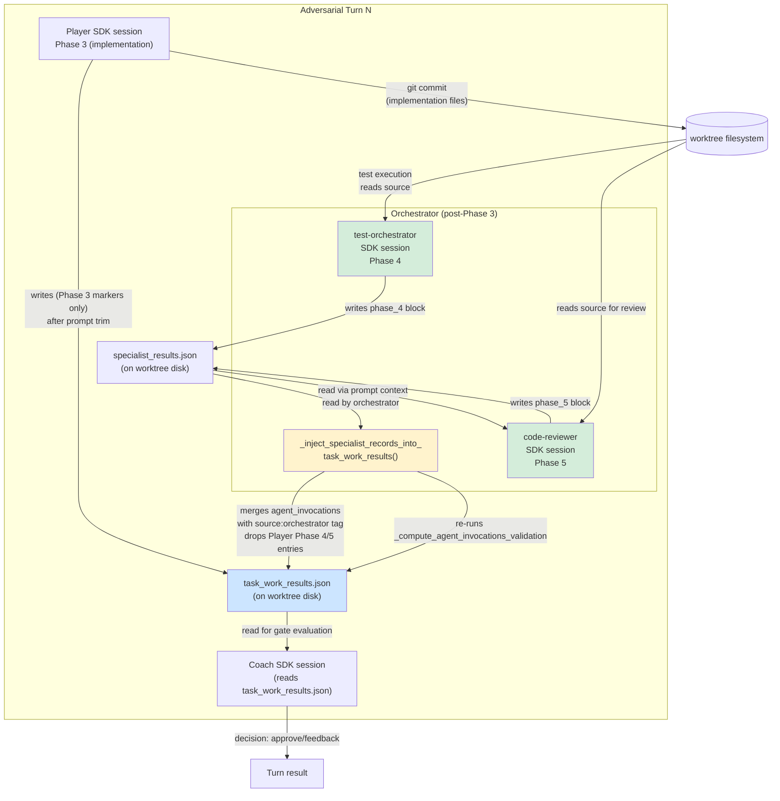
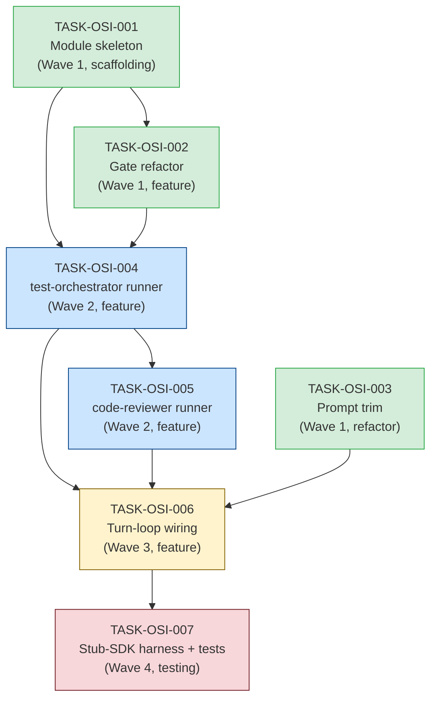

# TASK-REV-119C1: Review Report — Orchestrator-Side Specialist Invocation (Phases 4 & 5)

**Review task**: `tasks/backlog/TASK-REV-119C1-plan-orchestrator-side-specialist-invocation.md`
**Mode**: `/task-review --mode=decision --depth=standard`
**Date**: 2026-04-25
**Scope**: Architecture + risk only. Solution direction locked in per user decision.

---

## 1. Executive Summary

- **Q1 (Session lifecycle)**: Each specialist gets its own `ClaudeAgentOptions` session rooted at the worktree path. Execution is strictly sequential — `code-reviewer` requires `test-orchestrator`'s artefact output. Per-specialist timeout is an independent budget drawn from the orchestrator's `sdk_timeout`, not the Player's remaining budget. `test-orchestrator` tools: `Read, Write, Bash, Search`. `code-reviewer` tools: `Read, Write, Search, Grep` (no `Bash`, no `Write` in production review context; see Q1 decision).

- **Q2 (Gate credit path)**: `_compute_agent_invocations_validation` (in `agent_invoker.py` at line 5562) consumes a structured `agent_invocations` list or falls back to the `phases` dict in `task_work_results.json`. Orchestrator-invoked specialists write a `source: "orchestrator"` tagged record into a new `specialist_invocations.py` module that then populates `task_work_results.json` before Coach reads it. Player-emitted Phase 4/5 markers are suppressed by stripping Phase 4/5 entries from the execution protocol so the Player no longer receives instructions to claim them; double-count is structurally prevented by source-tagging.

- **Q3 (`implementation_mode: direct`)**: `direct` skips orchestrator-side specialist invocation entirely AND skips the Phase 4/5 gate credit, preserving existing semantics. The validation update to `agent_invocations_validation` must treat `direct` as a special workflow mode that expects only Phase 3. This is the safest interpretation given `_write_direct_mode_results` (line 4093) already sets `"phases": {"phase_3": {...}}` only and `"quality_gates_relaxed": True`.

- **Q4 (Specialist failure handling)**: A failing `test-orchestrator` surfaces as a Coach feedback item (partial failure record in `task_work_results.json`); the turn does not abort. A failing `code-reviewer` after a passing `test-orchestrator` preserves Phase 4 = passed, Phase 5 = failed in the gate record — no rollback. Test artefact propagation: `test-orchestrator` writes a structured JSON result to a well-known path; `code-reviewer` reads it. The contract is a file under the worktree, not a return value.

- **Integration risk headline**: Moderate. The main risk is gate-credit double-count from leftover Player-emitted markers (mitigated by prompt trim) and the `direct` mode regression if the workflow_mode guard is placed incorrectly. Both are testable with the stub-SDK harness. The acceptance targets (≥18/23 jarvis, ≥10/11 forge Wave 2) require the turn-loop wiring to fire on every non-`direct` turn, not just turn 1 — this is a correctness constraint that the integration test must assert.

---

## 2. Architecture Decisions

### Q1: Session Lifecycle

**Decision**: Each specialist (`test-orchestrator`, `code-reviewer`) receives its own `ClaudeAgentOptions` session. Sessions are sequential. Per-specialist timeout is a fixed fraction of `sdk_timeout` (suggested: 40 % each, leaving 20 % for the Player turn itself within any single orchestrator budget envelope; exact values configurable). Sessions run in the worktree (`cwd=str(worktree.path)`).

**Allowed tools**:

| Specialist | Allowed tools | Rationale |
|---|---|---|
| `test-orchestrator` | `Read, Write, Bash, Search` | Agent definition frontmatter at `installer/core/agents/test-orchestrator.md` line 18 lists exactly `Read, Write, Bash, Search`. Bash is required to run pytest, build commands, coverage. |
| `code-reviewer` | `Read, Search, Grep` | Agent definition frontmatter at `installer/core/agents/code-reviewer.md` line 13 lists `Read, Write, Search, Grep`. For orchestrator-side invocation, `Write` is retained so the agent can write review output JSON; it must not modify source files. Baseline: accept the agent's declared toolset. |

**Sequential vs parallel**: Sequential is required. `code-reviewer`'s checklist (lines 40–90 of `code-reviewer.md`) explicitly checks "Unit test coverage ≥ 80%", "All tests must pass" — these facts come from `test-orchestrator`'s output. Running in parallel would force `code-reviewer` to rediscover test results independently, duplicating work and losing the structured coverage report.

**Session placement**: `cwd=str(worktree.path)` matches the Player session (`_invoke_with_role` at line 2191 uses `cwd=str(self.worktree_path)`). The new specialist sessions are additional sessions on the same worktree path; no new worktree is created.

**Timeout**: `sdk_timeout * specialist_timeout_fraction` where `specialist_timeout_fraction` defaults to 0.4 for each specialist. The fractions are configurable constants in the new `specialist_invocations.py` module. They are NOT derived from the task's complexity-adjusted timeout — they are the orchestrator's raw `sdk_timeout` multiplied, so the total budget consumed by a full turn (Player + Phase 4 + Phase 5) can exceed `sdk_timeout`. This is acceptable because the Coach grace period (`COACH_GRACE_PERIOD_SECONDS = 120`) already assumes budget can be exceeded. An alternative is to make each specialist get `sdk_timeout` in full (simplest) and rely on the existing `asyncio.timeout` cancellation path. **Recommended: give each specialist the full `sdk_timeout`** (simplest, avoids fragile fraction arithmetic, identical to how Player and Coach are budgeted). The orchestrator already has a `MIN_TURN_BUDGET_SECONDS` guard; if budget is exhausted, the specialist invocation is skipped with a `specialist_skipped` status in the gate record.

**Alternatives considered**:
1. Shared SDK session across specialists: Rejected — context pollution between specialists; each starts fresh.
2. Parallel specialists with shared input: Rejected — sequential dependency on test results.
3. Specialist timeout = 0.5 * Player timeout: Rejected — introduces fraction complexity with no clear benefit.

**Risks / mitigation**: Specialist session leak (cleanup on failure) — see Risk Register §7.

---

### Q2: Gate Credit Path

**Decision**: Orchestrator-side specialist invocations are credited via a new `specialist_invocations.py` module that writes a structured `specialist_results.json` artefact under `.guardkit/autobuild/{task_id}/`. Before Coach evaluates the gate, the orchestrator calls a new method `_inject_specialist_records_into_task_work_results` that merges the specialist records into `task_work_results.json` under the `agent_invocations` key, tagged `source: "orchestrator"`.

**Current input source for `_compute_agent_invocations_validation`** (line 5562 in `agent_invoker.py`): The function calls `_extract_invocations_from_result_data(results)` (line 5526), which reads `results.get("agent_invocations")` first (explicit list) or falls back to `results.get("phases")` (stream-parser-detected phases). The input to `_compute_agent_invocations_validation` is whatever is in `task_work_results.json` at the time of call.

**Double-count mitigation**: The execution protocol (`autobuild_execution_protocol.md`) currently instructs the Player on Phases 3, 4, 4.5, and 5 inline. The trim subtask (TASK-OSI-003) removes Phase 4 and Phase 5 instructions from the protocol, replacing them with a single line: "Phases 4 and 5 (testing and code review) are executed by the orchestrator after your Phase 3 completes." This removes the Player's structural incentive to claim Phase 4/5. Residual double-count from a Player that ignores the trim is prevented by the source tag: the merge step in `_inject_specialist_records_into_task_work_results` drops any entry with `phase` in `{"4", "5"}` that carries `source: "player"` (or no source) before inserting the orchestrator-tagged entries.

**Schema delta**: Orchestrator-invoked phase records add a `source` field:

```json
{
  "phase": "4",
  "agent": "test-orchestrator",
  "status": "completed",
  "source": "orchestrator",
  "duration_seconds": 142.3,
  "result_file": ".guardkit/autobuild/TASK-XXX/specialist_results.json"
}
```

Player-emitted records carry no `source` field (or `source: "player"`). The `_extract_invocations_from_result_data` function is unchanged — it is agnostic to the `source` field; the dedup logic lives in the new merge helper only.

**Alternatives considered**:
1. Separate gate key (`specialist_invocations_validation`) alongside existing `agent_invocations_validation`: Rejected — would require Coach prompt changes (out of scope) and create two gates for what should be one concept.
2. Populate `agent_invocations` by having specialists write directly to `task_work_results.json`: Rejected — concurrent write risk; specialist should write to its own artefact, merge step is the single writer.

**Risks / mitigation**: Gate-credit silent failure (specialist runs but gate not credited) — see Risk Register §7.

---

### Q3: `implementation_mode: direct` Contract

**Decision**: `implementation_mode: direct` means **skip orchestrator-side specialist invocation entirely AND skip Phase 4/5 gate credit**. The gate record for `direct` mode tasks remains as set by `_write_direct_mode_results` (line 4093): `"phases": {"phase_3": {...}}` only, with `"quality_gates_relaxed": True`.

**Existing semantics (confirmed from code)**: `_get_implementation_mode` (line 3649) reads `implementation_mode` from task frontmatter. When `"direct"`, `invoke_player` (line 1403) routes to `_invoke_player_direct`. `_write_direct_mode_results` (line 4093) writes `task_work_results.json` with `implementation_mode: "direct"` and no Phase 4/5 entries. `_compute_agent_invocations_validation` receives `workflow_mode` as a string — currently this is `results.get("workflow_mode") or "implement-only"` (line 2976). For `direct` mode tasks, `workflow_mode` is `"direct"`.

**Implication for the validation update**: `get_expected_phases(workflow_mode)` must return 0 (or a number that matches having only Phase 3) when `workflow_mode == "direct"`. If `get_expected_phases("direct")` currently returns the same count as `"implement-only"` (phases 3, 4, 5), then every `direct` mode task would fire a violation for missing phases 4 and 5 after the orchestrator-side feature lands. The subtask for the validation gate update (TASK-OSI-002) must audit `get_expected_phases` and ensure `"direct"` is treated as expecting Phase 3 only.

**The guard in `_loop_phase`**: The turn-loop wiring subtask (TASK-OSI-005) must gate the orchestrator-side specialist invocation block with `if impl_mode != "direct"`. Reading `implementation_mode` from the task file is already done by `_get_implementation_mode` in `AgentInvoker`; the orchestrator can call the same `TaskLoader` pattern or expose a helper.

**Alternatives considered**:
1. `direct` skips the gate but still runs specialists: Rejected — `direct` tasks are scaffolding/trivial by definition (complexity ≤ 1 per `_auto_detect_direct_mode` line 3752). Running specialists on them adds latency with no quality benefit and risks false failures on scaffolding-type tasks.
2. `direct` skips specialists but logs a warning: Rejected — would still fail the gate if Phase 4/5 are expected.

**Risks / mitigation**: `direct` regression — see Risk Register §7.

---

### Q4: Specialist Failure Handling

**Decision**:

- **`test-orchestrator` fails** (non-zero SDK result, timeout, exception): Record `status: "failed"` in `specialist_results.json`, set `phase_4_status: "failed"` in the merge block. Do NOT abort the turn. Propagate a structured failure summary to `code-reviewer`'s context prompt and to the Coach feedback block in `task_work_results.json`. The Coach sees Phase 4 = failed and Phase 5 = skipped (because `code-reviewer` is not invoked if `test-orchestrator` fails — a failing test phase is the signal `code-reviewer` would also use to reject the implementation). This satisfies the "gate blocked at Phase 4" semantics without requiring a turn abort.

- **`test-orchestrator` succeeds, `code-reviewer` fails**: Phase 4 = passed is preserved in the gate record. Phase 5 = failed is recorded. No rollback of Phase 4. The Coach evaluates the combined state: Phase 4 passed + Phase 5 failed = feedback, not approval. This is the same outcome as if the Player had invoked both specialists and `code-reviewer` returned issues.

- **Partial-completion rollback**: No filesystem rollback is performed. The worktree state after `test-orchestrator` ran is clean (test-orchestrator may have written test artefacts but should not modify source). The Coach turn proceeds with whatever partial record exists.

- **Test artefact propagation**: `test-orchestrator` writes its results to `.guardkit/autobuild/{task_id}/specialist_results.json` (the `phase_4` block). The orchestrator reads this file and passes a structured summary as the `specialist_context` argument to `code-reviewer`'s SDK invocation prompt. `code-reviewer` also has `Read` access to the full worktree and can read the artefact directly. The artefact format is a JSON file with keys: `passed` (bool), `tests_run` (int), `tests_failed` (int), `coverage_pct` (float | null), `output_summary` (str), `quality_gates_passed` (bool). This is a superset of the existing `tests_info` block already in `task_work_results.json`.

- **Coach artefact access**: The Coach already reads `task_work_results.json`. After the merge step, the `agent_invocations` block contains the orchestrator-tagged Phase 4 and 5 records. The Coach does not need to read `specialist_results.json` directly; the merged `task_work_results.json` is the Coach's single source of truth, as before.

**Alternatives considered**:
1. Abort the turn on `test-orchestrator` failure: Rejected — this would prevent the Coach from seeing the partial state and providing useful feedback. The current pattern (Player failure = Coach still runs with error report) should be preserved.
2. Store test artefacts in a return value (not a file): Rejected — the orchestrator is synchronous at the Python level; a file under the worktree is the established pattern for all artefacts and enables post-mortem debugging.

**Risks / mitigation**: Test artefact propagation gap — see Risk Register §7.

---

## 3. Subtask Breakdown

| task_id | title | task_type | complexity | dependencies | wave | implementation_mode | acceptance_criteria |
|---|---|---|---|---|---|---|---|
| TASK-OSI-001 | New module skeleton: `specialist_invocations.py` | scaffolding | 2 | none | 1 | direct | (1) Module exists at `guardkit/orchestrator/specialist_invocations.py`. (2) Exports `SpecialistInvocationResult` dataclass with fields: `specialist_name, phase, status, duration_seconds, result_file, error`. (3) Exports `run_specialist` async function with signature `(specialist_name, worktree_path, task_id, sdk_timeout, prompt, allowed_tools) -> SpecialistInvocationResult`. (4) `run_specialist` body delegates to `AgentInvoker._invoke_with_role` via composition (no duplication of SDK invocation logic). (5) All modified files pass project-configured lint/format checks with zero errors. |
| TASK-OSI-002 | Validation gate refactor: credit orchestrator-invoked phases | feature | 4 | TASK-OSI-001 | 1 | task-work | (1) `_inject_specialist_records_into_task_work_results` method on `AgentInvoker` merges Phase 4/5 records from `specialist_results.json` into `task_work_results.json` `agent_invocations` list, tagged `source: "orchestrator"`. (2) Player-emitted Phase 4/5 entries (source absent or `"player"`) are dropped during the merge. (3) `get_expected_phases("direct")` returns a count that treats `direct` as Phase 3 only — no gate violation for `direct` mode tasks. (4) Unit tests cover: merge with no prior Phase 4/5, merge with stale Player-emitted Phase 4/5 (dedup), `direct` mode bypass (no merge called), `validator_error` shape preserved. (5) All modified files pass project-configured lint/format checks with zero errors. |
| TASK-OSI-003 | Prompt trim: remove Phase 4/5 instructions from Player protocol | refactor | 3 | none | 1 | task-work | (1) `autobuild_execution_protocol.md`, `autobuild_execution_protocol_medium.md`, and (if present) `autobuild_execution_protocol_slim.md` no longer instruct the Player to invoke `test-orchestrator` or `code-reviewer` via `Task` tool for Phases 4 and 5. (2) A single paragraph replaces Phase 4/Phase 5 sections informing the Player that testing and code review are handled by the orchestrator post-Phase 3. (3) Phase 3 specialist guidance (stack-specific specialist, e.g., `python-api-specialist`) remains as a soft recommendation. (4) Protocol trim does not break the Phase 4.5 fix-loop guidance (Player still runs tests inline for its own feedback; orchestrator runs `test-orchestrator` as the gate). (5) All modified files pass project-configured lint/format checks with zero errors. |
| TASK-OSI-004 | `test-orchestrator` orchestrator-side runner | feature | 5 | TASK-OSI-001, TASK-OSI-002 | 2 | task-work | (1) `specialist_invocations.py` exports `invoke_test_orchestrator(worktree_path, task_id, sdk_timeout, agent_invoker) -> SpecialistInvocationResult` with real implementation (not stub). (2) Function builds a structured prompt from the task's requirements, current worktree state, and Phase 3 completion summary. (3) Function calls `run_specialist` with `allowed_tools=["Read", "Write", "Bash", "Search"]`. (4) On success, writes `specialist_results.json` with `phase: "4"` block to `.guardkit/autobuild/{task_id}/`. (5) On failure (SDK exception, timeout, non-success result), writes `specialist_results.json` with `status: "failed"` and `error` field populated. (6) All modified files pass project-configured lint/format checks with zero errors. |
| TASK-OSI-005 | `code-reviewer` orchestrator-side runner | feature | 5 | TASK-OSI-004 | 2 | task-work | (1) `specialist_invocations.py` exports `invoke_code_reviewer(worktree_path, task_id, phase4_result, sdk_timeout, agent_invoker) -> SpecialistInvocationResult` with real implementation. (2) `phase4_result` (the `SpecialistInvocationResult` from `invoke_test_orchestrator`) is included in the prompt as structured context. (3) Function calls `run_specialist` with `allowed_tools=["Read", "Write", "Search", "Grep"]`. (4) On success, writes a `phase_5` block to `specialist_results.json`. (5) Function is NOT called if `phase4_result.status == "failed"` — caller is responsible for this guard. (6) All modified files pass project-configured lint/format checks with zero errors. |
| TASK-OSI-006 | Turn-loop wiring: insert orchestrator Phase 4/5 in `autobuild.py` | feature | 6 | TASK-OSI-004, TASK-OSI-005, TASK-OSI-003 | 3 | task-work | (1) `_loop_phase` in `autobuild.py` invokes `invoke_test_orchestrator` and (conditionally) `invoke_code_reviewer` after Player completes Phase 3, before `invoke_coach`. (2) Guard: invocation is skipped when `implementation_mode == "direct"` for the current task. (3) `_inject_specialist_records_into_task_work_results` is called after both specialists complete (or fail), before `invoke_coach` reads `task_work_results.json`. (4) Specialist results are persisted to turn history via an extended `TurnRecord` or a parallel structure (no change to `TurnRecord` schema required for MVP — a file on disk is sufficient). (5) Cancellation event is passed to each specialist invocation so feature-level timeout fires correctly. (6) All modified files pass project-configured lint/format checks with zero errors. |
| TASK-OSI-007 | Stub-SDK harness + behavioural verification tests | testing | 5 | TASK-OSI-006 | 4 | task-work | (1) `tests/integration/test_autobuild_phase_4_5_orchestration.py` exists and passes in CI without a live SDK or Anthropic API call. (2) Stub SDK records `(specialist_name, prompt_prefix_100_chars, allowed_tools, return_value)` for each `query()` call. (3) Test asserts: turn loop produced exactly one `test-orchestrator` invocation and one `code-reviewer` invocation (in that order) for a non-`direct` task. (4) Test asserts: `agent_invocations_validation` in `task_work_results.json` returns `status: "passed"` for phases 4 and 5 after the loop. (5) Test asserts: `direct` mode task produces zero specialist invocations. (6) All modified files pass project-configured lint/format checks with zero errors. |

**Note on wave assignment**: TASK-OSI-001 and TASK-OSI-003 are independent and can run in parallel (Wave 1). TASK-OSI-004 and TASK-OSI-005 depend on Wave 1 but are not mutually dependent (Wave 2 parallel). TASK-OSI-006 depends on both Wave 2 tasks. TASK-OSI-007 depends on Wave 3.

---

## 4. Integration Contracts

### 4.1 Specialist Invocation Contract

| Attribute | Value |
|---|---|
| **Producer task** | TASK-OSI-004 (`invoke_test_orchestrator`), TASK-OSI-005 (`invoke_code_reviewer`) |
| **Consumer task(s)** | TASK-OSI-005 (consumes Phase 4 result), TASK-OSI-006 (consumes both), TASK-OSI-007 (asserts via stub) |
| **Artefact type** | File: `.guardkit/autobuild/{task_id}/specialist_results.json` |
| **Format constraint** | JSON object with top-level keys `phase_4` (always present after `invoke_test_orchestrator`) and `phase_4_status` (`"passed"` \| `"failed"` \| `"skipped"`). `phase_5` added after `invoke_code_reviewer`. Each phase block contains: `status`, `duration_seconds`, `error` (nullable), and the phase-specific output fields (`tests_run`, `coverage_pct`, etc. for Phase 4; `issues`, `quality_score` for Phase 5). |
| **Validation method** | TASK-OSI-007 stub-SDK test asserts file exists and has correct schema after a full non-`direct` turn. TASK-OSI-002 unit tests assert merge behaviour. |

### 4.2 Gate Credit Contract

| Attribute | Value |
|---|---|
| **Producer task** | TASK-OSI-002 (`_inject_specialist_records_into_task_work_results`) |
| **Consumer task(s)** | TASK-OSI-006 (wiring calls inject before Coach), TASK-OSI-007 (asserts gate status in `task_work_results.json`) |
| **Artefact type** | In-place mutation of `.guardkit/autobuild/{task_id}/task_work_results.json` |
| **Format constraint** | `task_work_results.json["agent_invocations"]` is a list; each orchestrator-injected entry carries `source: "orchestrator"` and `phase` in `{"4", "5"}`. `task_work_results.json["agent_invocations_validation"]` is the output of `_compute_agent_invocations_validation` re-run post-injection. The Coach reads this existing field — no schema change needed on the Coach side. |
| **Validation method** | TASK-OSI-007 asserts `agent_invocations_validation.status == "passed"` after a successful loop. TASK-OSI-002 unit tests assert dedup of Player-emitted markers. |

### 4.3 Stub-SDK Contract

| Attribute | Value |
|---|---|
| **Producer task** | TASK-OSI-007 (harness implementation) |
| **Consumer task(s)** | TASK-OSI-007 (test assertions) |
| **Artefact type** | In-process object (not a file): a `StubSDK` class or pytest fixture that replaces `claude_agent_sdk.query` during integration tests |
| **Format constraint** | The stub records a list of `InvocationRecord(specialist_name, prompt[:100], allowed_tools, return_value)` for each call. The test inspects `.invocations` list in order. The stub returns a pre-configured `AgentInvocationResult` or writes a pre-baked `specialist_results.json` so downstream logic works without a real SDK response. |
| **Validation method** | Test assertions in `test_autobuild_phase_4_5_orchestration.py` assert exact invocation order, allowed_tools values, and gate status. See §5 for harness design. |

---

## 5. Stub-SDK Harness Design

The harness replaces `claude_agent_sdk.query` in the integration test with a deterministic recorder. It does not call the Anthropic API.

**What the harness records** (per call):

```
InvocationRecord:
  agent_type: str           # "test-orchestrator" | "code-reviewer" | "player" | "coach"
  prompt_prefix: str        # first 100 chars of prompt (enough to assert phase context)
  allowed_tools: list[str]  # the ClaudeAgentOptions.allowed_tools passed
  cwd: str                  # the worktree path the session was rooted at
  return_status: str        # "success" | "failure" (configured per test scenario)
```

**Harness shape** (pytest fixture + monkeypatch):

```python
@pytest.fixture
def stub_sdk(monkeypatch, tmp_path):
    """Replace claude_agent_sdk.query with a deterministic stub.
    
    Each invocation writes a pre-baked specialist_results.json to
    the task's autobuild dir, simulating what the real specialist would write.
    The stub appends to stub_sdk.invocations for assertion.
    """
    stub = StubSDKRecorder(tmp_path)
    monkeypatch.setattr("guardkit.orchestrator.agent_invoker.query", stub.query)
    yield stub
```

The `StubSDKRecorder.query` method is an async generator that:
1. Appends an `InvocationRecord` to `self.invocations`.
2. Writes a pre-baked `specialist_results.json` to `{cwd}/.guardkit/autobuild/{task_id}/`.
3. Yields a single `ResultMessage` so the consuming loop exits cleanly.

**Canonical pre-merge test assertions**:

```
test_orchestrator_side_invocation_fires_on_non_direct_task:
  - stub_sdk.invocations[0].agent_type == "test-orchestrator"
  - stub_sdk.invocations[1].agent_type == "code-reviewer"
  - stub_sdk.invocations[0].allowed_tools == ["Read", "Write", "Bash", "Search"]
  - task_work_results["agent_invocations_validation"]["status"] == "passed"
  - task_work_results["agent_invocations_validation"]["missing_phases"] == []

test_direct_mode_task_skips_specialists:
  - len([i for i in stub_sdk.invocations if i.agent_type in ("test-orchestrator", "code-reviewer")]) == 0
  - task_work_results["implementation_mode"] == "direct"

test_phase4_failure_skips_phase5_and_records_partial:
  - stub_sdk.invocations[0].agent_type == "test-orchestrator"  (failed)
  - len([i for i in stub_sdk.invocations if i.agent_type == "code-reviewer"]) == 0
  - task_work_results["agent_invocations_validation"]["status"] == "violation"  (Phase 5 missing)
```

**Why stub-SDK is preferable to live SDK**: Determinism — the live SDK's invocation order is LLM-dependent and non-reproducible across runs. Cost — each live invocation is billable; CI budget is finite. Design alignment — the fix's design intent is that the *orchestrator* calls the specialists, not the LLM. A stub that asserts orchestrator-level call order directly tests the fix's design intent rather than an LLM's prompt-following, which is exactly what was proven insufficient by TASK-REV-F4A1.

---

## 6. Mandatory Diagrams

### 6.1 Data Flow: Player → Orchestrator → Specialists → Gate → Coach



**Write paths** (solid arrows): Player writes Phase 3 markers to `task_work_results.json`. `test-orchestrator` writes to `specialist_results.json`. `code-reviewer` appends to `specialist_results.json`. `_inject_specialist_records_into_task_work_results` merges into `task_work_results.json`.

**Read paths** (dashed arrows above, shown solid for clarity): Coach reads only `task_work_results.json`. `code-reviewer` reads `specialist_results.json` via prompt context passed by the orchestrator. No disconnections remain after TASK-OSI-002 wires the merge step.

---

### 6.2 Sequence: Turn N Execution (Integration Contracts)

```mermaid
sequenceDiagram
    participant ABO as AutoBuildOrchestrator
    participant AI as AgentInvoker
    participant SDK as claude_agent_sdk.query
    participant FS as Worktree Filesystem
    participant SI as specialist_invocations.py

    Note over ABO,FS: Phase 3 — Player implementation
    ABO->>AI: invoke_player(task_id, turn)
    AI->>SDK: query(prompt, options[tools=Write/Edit/Bash/Read/...])
    SDK-->>AI: AssistantMessage stream (Phase 3 only)
    AI->>FS: write task_work_results.json (Phase 3 markers)
    AI-->>ABO: AgentInvocationResult(success=True)

    Note over ABO,FS: Phase 4 — test-orchestrator (orchestrator-side)
    ABO->>SI: invoke_test_orchestrator(worktree_path, task_id, ...)
    SI->>SDK: query(prompt, options[tools=Read/Write/Bash/Search])
    SDK-->>SI: AssistantMessage stream
    SI->>FS: write specialist_results.json (phase_4 block)
    SI-->>ABO: SpecialistInvocationResult(phase="4", status)

    Note over ABO,FS: Phase 5 — code-reviewer (conditional)
    alt phase4_result.status == "passed"
        ABO->>SI: invoke_code_reviewer(worktree_path, task_id, phase4_result, ...)
        SI->>SDK: query(prompt+phase4_summary, options[tools=Read/Write/Search/Grep])
        SDK-->>SI: AssistantMessage stream
        SI->>FS: write specialist_results.json (phase_5 block)
        SI-->>ABO: SpecialistInvocationResult(phase="5", status)
    else phase4 failed
        Note over ABO: skip code-reviewer; record phase_5=skipped
    end

    Note over ABO,FS: Gate credit injection
    ABO->>AI: _inject_specialist_records_into_task_work_results(task_id, phase4_result, phase5_result)
    AI->>FS: read specialist_results.json
    AI->>FS: read task_work_results.json
    AI->>AI: dedup Player Phase 4/5 entries (source tag)
    AI->>AI: re-run _compute_agent_invocations_validation
    AI->>FS: write task_work_results.json (merged agent_invocations + updated gate block)

    Note over ABO,FS: Coach evaluation
    ABO->>AI: invoke_coach(task_id, turn, ...)
    AI->>SDK: query(coach_prompt, options[tools=Read/Bash])
    SDK-->>AI: AssistantMessage stream
    AI->>FS: read task_work_results.json (merged, gate passed)
    AI-->>ABO: AgentInvocationResult(decision=approve|feedback)
```

---

### 6.3 Task Dependency Graph



Wave 1 (green): TASK-OSI-001, TASK-OSI-002, TASK-OSI-003 — can run in parallel.
Wave 2 (blue): TASK-OSI-004, TASK-OSI-005 — TASK-OSI-004 must complete before TASK-OSI-005 (prompt contract dependency), but both are Wave 2 in the sense that they wait only for Wave 1.
Wave 3 (yellow): TASK-OSI-006 alone.
Wave 4 (red): TASK-OSI-007 alone.

---

## 7. Risk Register

| Risk | Likelihood | Impact | Mitigation | Owner task |
|---|---|---|---|---|
| **Player phase-marker double-count** — Player ignores protocol trim and still emits Phase 4/5 markers via inline text; these get into `task_work_results.json` before the injection step overwrites them | Medium (Player has shown it ignores prompt instructions — that is the root cause) | Medium — gate passes for wrong reason; Coach sees padded invocations | Source-tag dedup in `_inject_specialist_records_into_task_work_results` explicitly drops Player-emitted Phase 4/5 entries before inserting orchestrator entries. The dedup runs on every turn regardless of Player behaviour. | TASK-OSI-002 |
| **`implementation_mode: direct` regression** — the turn-loop guard is placed after the merge call rather than before the specialist invocation; `direct` tasks get specialists run on them | Low (code path is clear) | High — scaffolding tasks break; false Phase 4/5 failures | Guard in `_loop_phase` checks `impl_mode != "direct"` before calling `invoke_test_orchestrator`. Unit test in TASK-OSI-002 asserts `direct` mode produces no merge call. TASK-OSI-007 integration test asserts zero specialist invocations for `direct` task. | TASK-OSI-006, TASK-OSI-002 |
| **Stub-SDK drift from real SDK behaviour** — `StubSDKRecorder.query` returns a `ResultMessage` shape that differs from what the real SDK emits; orchestrator code path that was tested via stub fails in production | Medium (SDK evolves) | Medium — CI passes, production fails | Stub models only the call-order and `allowed_tools` fields, not message content. The real SDK is exercised by the nightly canonical-task run (TASK-DIAG-F4A2 preservation infrastructure). Stub is explicitly scoped to "orchestrator called the right specialists in the right order" — not "the LLM produced correct output". | TASK-OSI-007 |
| **Specialist session leak (cleanup on failure)** — if `invoke_test_orchestrator` times out, the underlying `claude` subprocess is not killed; it continues running, consuming budget and potentially interacting with the worktree | Medium (existing issue for Player too) | Medium — worktree contamination, next turn's baseline commit shifted | `AgentInvoker._kill_child_claude_processes` (line 1064) is already the mechanism. `SpecialistInvocations.run_specialist` must pass the `cancellation_event` to `_invoke_with_role` so the cancellation monitor fires. Add a per-specialist try/finally that calls `_kill_child_claude_processes` on exception. | TASK-OSI-001, TASK-OSI-004 |
| **Test artefact propagation gap** — `code-reviewer` does not receive `test-orchestrator`'s structured output; it runs a blind code review without knowing test results | Low if TASK-OSI-005 is implemented correctly | High — `code-reviewer` misses test failures; Phase 5 approval without knowing Phase 4 failed | `invoke_code_reviewer` takes `phase4_result` as a required argument and includes a structured `phase_4_summary` section in the prompt. Integration test (TASK-OSI-007) asserts `stub_sdk.invocations[1].prompt_prefix` contains a Phase 4 summary string. | TASK-OSI-005 |
| **Gate-credit silent failure** — `_inject_specialist_records_into_task_work_results` runs but writes no records (e.g., `specialist_results.json` missing); `_compute_agent_invocations_validation` returns `no_data` or `violation` instead of `passed` | Low (file write is straightforward) | High — every turn fails the gate; AutoBuild reverts to pre-fix stall rate | `invoke_test_orchestrator` always writes `specialist_results.json` (even on failure — writes a `status: "failed"` block). `_inject_specialist_records_into_task_work_results` logs a warning if `specialist_results.json` is absent and falls back to inserting empty records with `status: "skipped"`. TASK-OSI-007 asserts gate block is present in all scenarios. | TASK-OSI-004, TASK-OSI-002 |

---

## 8. Acceptance Test Mapping

### Target 1: `jarvis-FEAT-J002-run-N` ≥ 18/23 tasks (baseline: 14/23 pre-phase-2)

**Root cause of gap** (from forge-run-4-analysis.md): Zero `test-orchestrator` / `code-reviewer` invocations across all runs. Coach correctly fires `agent_invocations_violation` for missing phases 4 and 5. `coach_agent_invocations_stall` accumulates over 3 turns → `unrecoverable_stall`. This accounts for the gap between 14/23 and the ceiling.

**Unblocking subtasks**: TASK-OSI-006 (turn-loop wiring) is the gate. TASK-OSI-004 and TASK-OSI-005 must be complete for it to wire. TASK-OSI-002 ensures the gate credits the invocations. TASK-OSI-003 ensures the Player doesn't double-claim phases.

**Verification path**: After TASK-OSI-006 merges, run `jarvis-FEAT-J002-run-N` canonical test. Expect: tasks that previously stalled on `coach_agent_invocations_stall` (TASK-J002-009, TASK-J002-014 per the analysis at forge-run-4-analysis.md lines 41-42) no longer stall. Coach sees `agent_invocations_validation.status: "passed"` for Phase 4 and 5. Wave-2 completion rate improves from the 14/23 baseline. The ≥18/23 target requires that the majority of tasks stalling on the gate are resolved — a plausible outcome given the gate is the confirmed primary failure mode.

**Caveat**: Tasks with independent failures (not agent-invocations gate) are not expected to improve. The 18/23 target accounts for this: 14 were passing before, 4 more should unlock from gate resolution, and 1 may have other failure modes.

---

### Target 2: `forge-FEAT-FORGE-002-run-N` ≥ 10/11 Wave-2 tasks (baseline: 0/3 post-phase-1)

**Root cause of gap**: Identical mechanism — `coach_agent_invocations_stall` on Phase 4/5 absence. forge-run-4-analysis.md confirms forge was broken pre-phase-2 (forge-run-3 had the same shape); the revert did not fix forge.

**Unblocking subtasks**: Same as Target 1 — TASK-OSI-006 is the gate. TASK-OSI-004, TASK-OSI-005, TASK-OSI-002, TASK-OSI-003 are prerequisites.

**Verification path**: After TASK-OSI-006 merges, run `forge-FEAT-FORGE-002-run-N` Wave-2 subset. Expect: Wave-2 tasks no longer stall on `coach_agent_invocations_stall`. The ≥10/11 target is aggressive (90.9% pass rate) and assumes the agent-invocations gate is the sole failure mode for forge Wave-2 tasks. If any Wave-2 task has an independent failure, the target may require a second run with separate investigation.

**Relationship between targets**: Both targets are unblocked by the same subtask chain (Wave 1 → Wave 2 → Wave 3). TASK-OSI-007 (Wave 4, stub-SDK harness) is the pre-merge gate for TASK-OSI-006, ensuring the wiring is correct before live runs are attempted. The nightly canonical-task run (TASK-DIAG-F4A2 infrastructure with `GUARDKIT_AUTOBUILD_PRESERVE_DEBUG=1`) provides the slow-signal verification that orchestrator-issued specialist sessions appear in `messages.jsonl` on real SDK runs.
