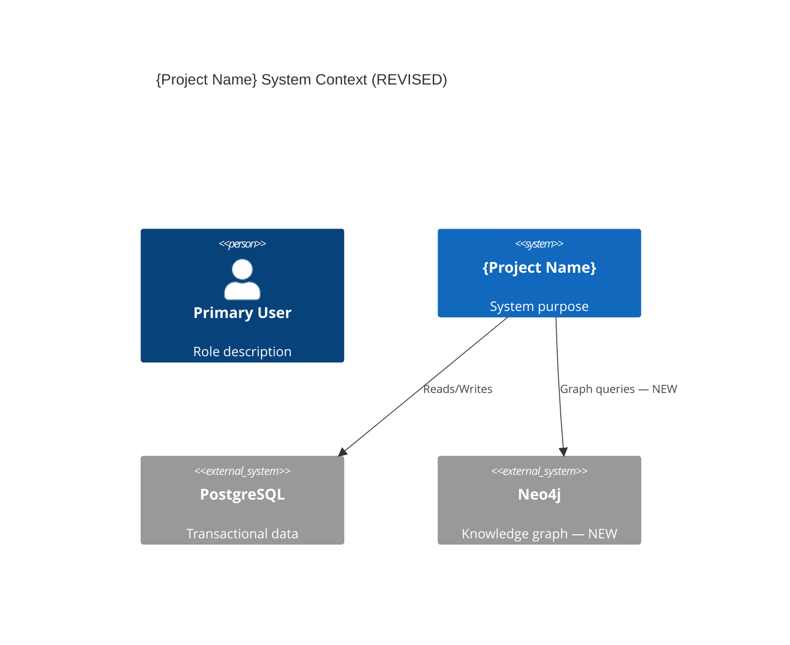
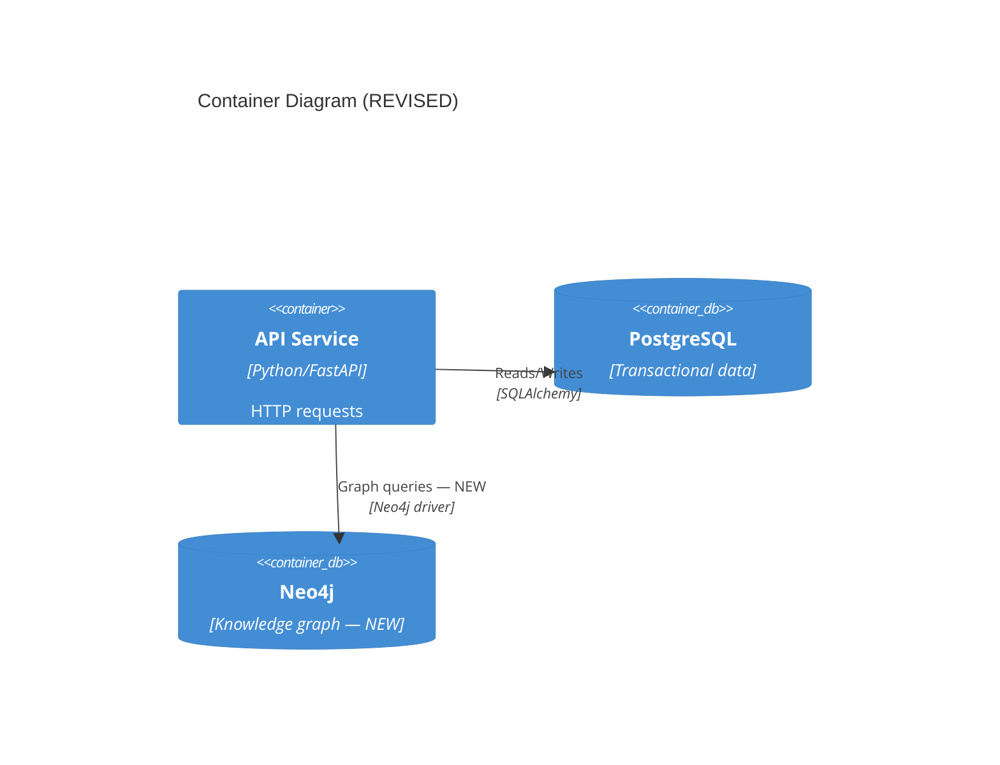

# /arch-refine - Iterative Architecture Decision Refinement Command

Enables iterative refinement of architecture decisions with temporal superseding, downstream impact analysis, and staleness flagging. This command sits alongside `/system-arch` in the architecture pipeline: while `/system-arch` defines or broadly refines architecture, `/arch-refine` targets specific existing ADRs for precise updates.

The disambiguation flow used by `/arch-refine` is identical to that used by `/design-refine` — both use semantic search via `get_relevant_context_for_topic()` to locate the decision to refine, present the top 3-5 matches for user selection, and require explicit confirmation before applying changes.

## Command Syntax

```bash
/arch-refine "natural language query" [--adr=ADR-ARCH-NNN] [--no-questions] [--context path/to/file.md]
```

## Available Flags

| Flag | Description |
|------|-------------|
| `--adr=ADR-ARCH-NNN` | Directly target a specific ADR by ID (skip disambiguation) |
| `--no-questions` | Skip interactive clarification (error — /arch-refine requires interactive input) |
| `--context path/to/file.md` | Include additional context files (can be used multiple times) |

## Overview

`/arch-refine` is the architecture-level refinement command. It modifies existing architecture decisions (ADRs) created by `/system-arch`, applying temporal superseding so that prior decisions remain queryable while new decisions take precedence.

**Key capabilities:**
- Semantic search disambiguation to locate the ADR to refine
- Temporal superseding of existing ADRs with full version history
- Downstream impact analysis across feature specs, C4 diagrams, and API contracts
- Staleness flagging on affected downstream Graphiti nodes
- Mandatory C4 diagram re-review gate after architectural changes
- Graceful degradation when Graphiti is unavailable

**When to use `/arch-refine` vs `/system-arch --mode=refine`:**
- `/arch-refine` → Targeted refinement of a **specific ADR** (e.g., changing database choice)
- `/system-arch --mode=refine` → Broad refinement across **multiple categories** (e.g., restructuring bounded contexts)

**Shared disambiguation pattern:** The disambiguation flow is shared with `/design-refine`. Both commands use the same semantic search, result capping (ASSUM-002), and confirmation gate pattern.

## Prerequisite Gate

Before starting the refinement session, `/arch-refine` MUST verify that architecture context exists. The command requires existing ADRs from `/system-arch` to refine.

```python
from guardkit.planning.graphiti_arch import SystemPlanGraphiti
from guardkit.knowledge.graphiti_client import get_graphiti

# Initialize Graphiti client
client = get_graphiti()  # Returns None if Graphiti unavailable

if client:
    arch_sp = SystemPlanGraphiti(client, project_id="current_project")
    has_arch = arch_sp.has_architecture_context()

    if not has_arch:
        print(NO_ARCHITECTURE_CONTEXT_MESSAGE)
        exit(0)
else:
    # Graceful degradation: check for local docs/architecture/decisions/ files
    arch_decisions_dir = Path("docs/architecture/decisions")
    if not arch_decisions_dir.exists() or not list(arch_decisions_dir.glob("ADR-ARCH-*.md")):
        print(NO_ARCHITECTURE_CONTEXT_MESSAGE)
        exit(0)
    print("WARNING: Graphiti unavailable — reading ADRs from local files")
```

## Execution Flow

### Phase 0: Context Loading

**Load existing ADRs and architecture context:**

```python
from guardkit.planning.graphiti_arch import SystemPlanGraphiti
from guardkit.knowledge.graphiti_client import get_graphiti

client = get_graphiti()

if client:
    arch_sp = SystemPlanGraphiti(client, project_id="current_project")
    existing_adrs = arch_sp.get_relevant_context_for_topic(
        "architecture decision ADR", 20
    )
else:
    existing_adrs = load_adrs_from_files("docs/architecture/decisions/")

# Load additional context files (if --context provided)
context_files = flags.get("context", [])
for context_file in context_files:
    with open(context_file) as f:
        additional_context = f.read()
    print(f"Loaded context from {context_file}")
```

### Phase 1: Disambiguation — Locate the ADR to Refine

If `--adr=ADR-ARCH-NNN` is provided, skip disambiguation and directly load the target ADR. Otherwise, use semantic search to disambiguate the user's natural language query.

#### Step 1: Semantic Search

```python
from guardkit.planning.graphiti_arch import SystemPlanGraphiti

# Search for matching ADRs using the user's natural language query
query = args[0]  # e.g., "database choice" or "change authentication approach"

if client:
    matches = arch_sp.get_relevant_context_for_topic(query, limit=5)
else:
    matches = search_local_adrs(query, "docs/architecture/decisions/", limit=5)

# Cap results at 3-5 to prevent adversarial queries from surfacing excessive data (ASSUM-002)
matches = matches[:5]
```

#### Step 2: Present Matches for Selection

Display the top 3-5 matches grouped by relevance for user selection:

```
━━━━━━━━━━━━━━━━━━━━━━━━━━━━━━━━━━━━━━━
📋 MATCHING ARCHITECTURE DECISIONS
━━━━━━━━━━━━━━━━━━━━━━━━━━━━━━━━━━━━━━━

Query: "database choice"

Results (capped at 3-5 per ASSUM-002):

  [1] ADR-ARCH-002: Use PostgreSQL as primary data store
      Status: accepted | Created: 2026-02-15
      Relevance: ████████░░ 85%

  [2] ADR-ARCH-005: Use Redis for session cache
      Status: accepted | Created: 2026-02-16
      Relevance: ██████░░░░ 62%

  [3] ADR-ARCH-003: Use SQLAlchemy as ORM
      Status: accepted | Created: 2026-02-15
      Relevance: █████░░░░░ 55%

Select ADR to refine [1-3], or [C]ancel:
```

#### Step 3: Confirm Selection

Before applying any changes, require explicit confirmation:

```
━━━━━━━━━━━━━━━━━━━━━━━━━━━━━━━━━━━━━━━
✓ SELECTED: ADR-ARCH-002 — Use PostgreSQL as primary data store
━━━━━━━━━━━━━━━━━━━━━━━━━━━━━━━━━━━━━━━

Current decision:
  Context: Need a reliable RDBMS for transactional data
  Decision: Use PostgreSQL 16 as primary data store
  Alternatives: MySQL, MongoDB, CockroachDB
  Status: accepted

Confirm this is the ADR you want to refine?
[Y]es — Proceed with refinement
[N]o — Return to search results
[C]ancel — Exit

Your choice [Y/N/C]:
```

**Ambiguous query handling:** If the semantic search returns no matches or only very low-relevance results, inform the user and suggest a more specific query. Cap results at 3-5 to prevent adversarial search queries from surfacing excessive data.

### Phase 2: Refinement — Capture New Decision

Capture the refined decision through conversational interaction:

```
━━━━━━━━━━━━━━━━━━━━━━━━━━━━━━━━━━━━━━━
🔄 REFINING: ADR-ARCH-002 — Use PostgreSQL as primary data store
━━━━━━━━━━━━━━━━━━━━━━━━━━━━━━━━━━━━━━━

Q1. What has changed that requires refining this decision?
    > [User describes what changed — e.g., "Need to support graph queries for knowledge graph"]

Q2. What is the new decision?
    > [User describes new decision — e.g., "Use Neo4j for knowledge graph, keep PostgreSQL for transactional data"]

Q3. What alternatives were considered for the new decision?
    > [User lists alternatives — e.g., "ArangoDB, Amazon Neptune, keeping everything in PostgreSQL with JSONB"]

Q4. What are the consequences of this change?
    > [User describes consequences — e.g., "Additional infrastructure, need graph query expertise, improved knowledge retrieval"]
```

### Phase 3: Temporal Superseding

Apply temporal superseding based on the spike results from TASK-SAD-001 (Option A: soft superseding via data-level encoding).

```python
from guardkit.knowledge.entities.architecture import ArchitectureDecision
from pathlib import Path
import re

# Step 1: Mark the existing ADR as superseded
# Set the superseded_by field (from TASK-SAD-002)
existing_adr.superseded_by = f"ADR-ARCH-{next_number:03d}"
existing_adr.status = "superseded"

# Step 2: Get next available ADR number
def get_next_adr_number(decisions_dir: Path) -> int:
    """Scan for existing ADRs and return next available number."""
    existing = list(decisions_dir.glob("ADR-ARCH-*.md"))
    if not existing:
        return 1
    numbers = []
    for f in existing:
        match = re.search(r"ADR-ARCH-(\d+)", f.name)
        if match:
            numbers.append(int(match.group(1)))
    return max(numbers) + 1 if numbers else 1

next_number = get_next_adr_number(Path("docs/architecture/decisions"))

# Step 3: Create new ADR with supersedes reference
new_adr = ArchitectureDecision(
    number=next_number,
    prefix="ARCH",
    title=new_title,
    context=new_context,
    decision=new_decision,
    alternatives_considered=new_alternatives,
    status="accepted",
    supersedes=f"ADR-ARCH-{existing_adr.number:03d}",
)

# Step 4: Upsert to Graphiti — both old and new episodes
# The old ADR is preserved and remains queryable in Graphiti (per TASK-SAD-001 findings)
# upsert_episode creates a new episode; the old one is NOT deleted
if client:
    # Update existing ADR with superseded_by metadata
    arch_sp.upsert_episode(
        entity_id=existing_adr.entity_id,
        body=existing_adr.to_episode_body(),
        group_ids=["project_decisions"],
    )

    # Create new ADR episode
    arch_sp.upsert_episode(
        entity_id=new_adr.entity_id,
        body=new_adr.to_episode_body(),
        group_ids=["project_decisions"],
    )

# Step 5: Write updated and new ADR files
write_adr_file(existing_adr, "docs/architecture/decisions")
write_adr_file(new_adr, "docs/architecture/decisions")
```

**Key temporal superseding properties (from TASK-SAD-001 spike):**
- Prior ADR remains queryable in Graphiti — both versions coexist
- `superseded_by` field on old ADR links forward to new version
- `supersedes` field on new ADR links backward to old version
- `upsert_episode()` preserves old episodes; it creates new ones without deleting old ones
- Consumers use `updated_at` to identify the current version

### Phase 4: Impact Analysis

Before applying changes, analyse which downstream artefacts are affected and present the impact scope for user approval.

```python
# Query downstream artefacts that reference the changed ADR
if client:
    # Check project_design group for affected API contracts
    affected_contracts = arch_sp.get_relevant_context_for_topic(
        f"references {existing_adr.entity_id}", limit=10
    )

    # Check feature_specs group for affected feature specs
    affected_specs = arch_sp.get_relevant_context_for_topic(
        f"depends on {existing_adr.entity_id}", limit=10
    )
else:
    affected_contracts = []
    affected_specs = []
```

**Display impact scope:**

```
━━━━━━━━━━━━━━━━━━━━━━━━━━━━━━━━━━━━━━━
⚡ DOWNSTREAM IMPACT ANALYSIS
━━━━━━━━━━━━━━━━━━━━━━━━━━━━━━━━━━━━━━━

Superseding ADR-ARCH-002 affects the following downstream artefacts:

Feature Specs:
  ⚠️ FEAT-001: Order checkout flow — references PostgreSQL schema
  ⚠️ FEAT-003: User search — references PostgreSQL full-text search

C4 Diagrams:
  ⚠️ docs/architecture/container.md — shows PostgreSQL as primary store
  ⚠️ docs/architecture/system-context.md — shows database integration

API Contracts:
  ⚠️ docs/design/contracts/API-order-management.md — references PostgreSQL constraints

Feature specs that reference stale contracts will be flagged.

━━━━━━━━━━━━━━━━━━━━━━━━━━━━━━━━━━━━━━━

Impact scope: 2 feature specs, 2 C4 diagrams, 1 API contract

[A]pprove and apply changes
[R]evise the decision
[C]ancel — discard changes

Your choice [A/R/C]:
```

### Phase 5: Staleness Flagging

After user approves the impact, tag affected downstream Graphiti nodes with `stale: true` metadata so that `/system-design` and other commands can detect and report stale decisions on next run.

```python
# Tag affected nodes as stale in Graphiti
if client:
    for affected in affected_contracts + affected_specs:
        entity_id = affected.get("entity_id")
        if entity_id:
            arch_sp.update_entity_metadata(
                entity_id=entity_id,
                metadata={"stale": True, "stale_reason": f"Superseded by {new_adr.entity_id}"},
            )
            print(f"  ⚠️ Flagged as stale: {entity_id}")

    print()
    print("Stale artefacts will be detected and reported by /system-design on next run.")
```

**`/system-design` stale detection:** When `/system-design` runs, it queries for nodes with `stale: true` metadata and presents them to the user:

```
━━━━━━━━━━━━━━━━━━━━━━━━━━━━━━━━━━━━━━━
⚠️ STALE DECISIONS DETECTED
━━━━━━━━━━━━━━━━━━━━━━━━━━━━━━━━━━━━━━━

The following artefacts reference superseded architecture decisions:

  • API-order-management — references ADR-ARCH-002 (superseded by ADR-ARCH-008)
  • FEAT-001 — references ADR-ARCH-002 (superseded by ADR-ARCH-008)

Consider updating these artefacts to align with current decisions.
━━━━━━━━━━━━━━━━━━━━━━━━━━━━━━━━━━━━━━━
```

### Phase 6: C4 Diagram Re-Review Gate (Mandatory)

If the refined ADR affects system structure (bounded contexts, containers, external integrations), regenerate the affected C4 diagrams and present them for mandatory approval.

**CRITICAL**: Revised L1/L2 diagrams must be generated and presented for mandatory approval. The user cannot skip this review gate.

```
━━━━━━━━━━━━━━━━━━━━━━━━━━━━━━━━━━━━━━━
🔍 C4 DIAGRAM RE-REVIEW GATE
━━━━━━━━━━━━━━━━━━━━━━━━━━━━━━━━━━━━━━━

The architecture change affects system structure.
Revised C4 Level 1 (System Context) and Level 2 (Container) diagrams
have been regenerated and require your mandatory approval.

━━━━━━━━━━━━━━━━━━━━━━━━━━━━━━━━━━━━━━━
```

#### C4 Level 1: Revised System Context Diagram



_Changes highlighted in yellow. Look for: new dependencies, removed connections, shifted responsibilities._

```
[A]pprove — Diagram is correct, proceed
[R]evise — I need to make changes
[C]ancel — Stop and discard all changes

Your choice [A/R/C]:
```

#### C4 Level 2: Revised Container Diagram



_Look for: new containers, removed containers, changed relationships._

```
[A]pprove — Diagram is correct, proceed
[R]evise — I need to make changes
[C]ancel — Stop and discard all changes

Your choice [A/R/C]:
```

### Phase 7: Output Generation

Generate all output artefacts:

```python
from guardkit.planning.architecture_writer import ArchitectureWriter

writer = ArchitectureWriter()
output_dir = "docs/architecture"

# Write updated existing ADR (status: superseded)
writer.write_adr(f"{output_dir}/decisions", existing_adr)

# Write new ADR (status: accepted, supersedes: ADR-ARCH-NNN)
writer.write_adr(f"{output_dir}/decisions", new_adr)

# Regenerate C4 diagrams (if structure changed)
if structure_changed:
    writer.write_system_context(output_dir, updated_system_context, components, external_systems)
    writer.write_container_diagram(output_dir, updated_containers, relationships)

# Update ARCHITECTURE.md index
writer.write_architecture_index(output_dir, system_context, components, concerns, decisions)
```

### Phase 8: Graphiti Seeding

Upsert superseded and new episodes to Graphiti:

```python
# Sanitise free-text content before Graphiti seeding
from guardkit.knowledge.sanitise import sanitise_for_graphiti

if client:
    # Upsert superseded ADR (updated with superseded_by field)
    sanitised_existing = sanitise_for_graphiti(existing_adr.to_episode_body())
    arch_sp.upsert_episode(
        entity_id=existing_adr.entity_id,
        body=sanitised_existing,
        group_ids=["project_decisions"],
    )

    # Upsert new ADR
    sanitised_new = sanitise_for_graphiti(new_adr.to_episode_body())
    arch_sp.upsert_episode(
        entity_id=new_adr.entity_id,
        body=sanitised_new,
        group_ids=["project_decisions"],
    )

    # Update project_architecture group if structure changed
    if structure_changed:
        for entity in updated_architecture_entities:
            arch_sp.upsert_entity(
                entity=entity,
                group_ids=["project_architecture"],
            )

    print(f"  ✓ {existing_adr.entity_id} updated (superseded)")
    print(f"  ✓ {new_adr.entity_id} created")
    print(f"  ✓ {len(stale_nodes)} downstream nodes flagged as stale")
else:
    print("  ⚠️ Graphiti unavailable — artefacts written to markdown only")
    print("  Markdown artefacts are still generated without persistence.")
    print("  Re-run with Graphiti enabled to seed knowledge graph.")
```

## Error Handling

### No Architecture Context

```python
if not has_arch:
    print("━━━━━━━━━━━━━━━━━━━━━━━━━━━━━━━━━━━━━━━")
    print("❌ No architecture context found")
    print("━━━━━━━━━━━━━━━━━━━━━━━━━━━━━━━━━━━━━━━")
    print()
    print("/arch-refine requires architecture context from /system-arch.")
    print("Run /system-arch first to establish architecture decisions.")
    exit(0)
```

### No Matching ADR Found

```python
if not matches:
    print("━━━━━━━━━━━━━━━━━━━━━━━━━━━━━━━━━━━━━━━")
    print("❌ No matching ADR found")
    print("━━━━━━━━━━━━━━━━━━━━━━━━━━━━━━━━━━━━━━━")
    print()
    print(f"No architecture decisions match: \"{query}\"")
    print()
    print("Suggestions:")
    print("  1. Try a more specific query")
    print("  2. Use --adr=ADR-ARCH-NNN to target a specific ADR")
    print("  3. Run /system-arch to view all existing ADRs")
    exit(0)
```

### Graphiti Unavailable

```python
if not client:
    print("━━━━━━━━━━━━━━━━━━━━━━━━━━━━━━━━━━━━━━━")
    print("WARNING: Graphiti unavailable")
    print("━━━━━━━━━━━━━━━━━━━━━━━━━━━━━━━━━━━━━━━")
    print()
    print("Architecture refinement will continue WITHOUT persistence.")
    print("Markdown artefacts will still be generated, but:")
    print("  - Temporal superseding won't be tracked in knowledge graph")
    print("  - Staleness flagging won't propagate to downstream nodes")
    print("  - Impact analysis will be limited to local file scanning")
    print()
    print("To enable Graphiti:")
    print("  1. Install: pip install guardkit-py[graphiti]")
    print("  2. Configure: Add Graphiti settings to .env")
    print()

    choice = input("Continue without persistence? [Y/n]: ")
    if choice.lower() == "n":
        print("Cancelled.")
        exit(0)
```

### Graphiti Connection Drop Mid-Session

```python
try:
    arch_sp.upsert_episode(entity_id=new_adr.entity_id, body=body, group_ids=["project_decisions"])
except ConnectionError:
    print("WARNING: Graphiti connection lost during refinement session")
    print("ADR files were written to docs/architecture/decisions/ successfully.")
    print("Re-run /arch-refine to retry Graphiti seeding.")
    client = None  # Disable further Graphiti calls
```

### --no-questions Flag

```python
if flags.get("no_questions"):
    print("━━━━━━━━━━━━━━━━━━━━━━━━━━━━━━━━━━━━━━━")
    print("ERROR: /arch-refine requires interactive input")
    print("━━━━━━━━━━━━━━━━━━━━━━━━━━━━━━━━━━━━━━━")
    print()
    print("The --no-questions flag is not supported for /arch-refine.")
    print("Architecture decision refinement requires human review and approval.")
    exit(1)
```

### No Query Provided

```python
if not query or not query.strip():
    print("━━━━━━━━━━━━━━━━━━━━━━━━━━━━━━━━━━━━━━━")
    print("ERROR: Refinement query is required")
    print("━━━━━━━━━━━━━━━━━━━━━━━━━━━━━━━━━━━━━━━")
    print()
    print("Usage: /arch-refine \"what to refine\"")
    print()
    print("Examples:")
    print('  /arch-refine "change database from PostgreSQL to MongoDB"')
    print('  /arch-refine "update authentication approach"')
    print('  /arch-refine "revise deployment strategy"')
    exit(1)
```

## Examples

### Example 1: Refine a Database Decision

```bash
/arch-refine "change the primary database"

━━━━━━━━━━━━━━━━━━━━━━━━━━━━━━━━━━━━━━━
📋 MATCHING ARCHITECTURE DECISIONS
━━━━━━━━━━━━━━━━━━━━━━━━━━━━━━━━━━━━━━━

Query: "change the primary database"

  [1] ADR-ARCH-002: Use PostgreSQL as primary data store
      Status: accepted | Relevance: 92%

  [2] ADR-ARCH-005: Use Redis for session cache
      Status: accepted | Relevance: 45%

Select ADR to refine [1-2], or [C]ancel:
> 1

━━━━━━━━━━━━━━━━━━━━━━━━━━━━━━━━━━━━━━━
✓ SELECTED: ADR-ARCH-002 — Use PostgreSQL as primary data store
━━━━━━━━━━━━━━━━━━━━━━━━━━━━━━━━━━━━━━━

Confirm? [Y/N/C]: Y

🔄 REFINING: ADR-ARCH-002

  Q1. What has changed?
      > Need to support graph queries for knowledge graph

  Q2. What is the new decision?
      > Use Neo4j for knowledge graph alongside PostgreSQL for transactional data

  Q3. Alternatives considered?
      > ArangoDB, Amazon Neptune, PostgreSQL JSONB

  Q4. Consequences?
      > Additional infrastructure, graph query expertise needed, better knowledge retrieval

━━━━━━━━━━━━━━━━━━━━━━━━━━━━━━━━━━━━━━━
⚡ DOWNSTREAM IMPACT ANALYSIS
━━━━━━━━━━━━━━━━━━━━━━━━━━━━━━━━━━━━━━━

  Feature Specs: 2 affected
  C4 Diagrams: 2 affected
  API Contracts: 1 affected

[A]pprove | [R]evise | [C]ancel: A

━━━━━━━━━━━━━━━━━━━━━━━━━━━━━━━━━━━━━━━
🔍 C4 DIAGRAM RE-REVIEW GATE
━━━━━━━━━━━━━━━━━━━━━━━━━━━━━━━━━━━━━━━

[Revised C4 Context diagram]
[A]pprove | [R]evise | [C]ancel: A

[Revised C4 Container diagram]
[A]pprove | [R]evise | [C]ancel: A

━━━━━━━━━━━━━━━━━━━━━━━━━━━━━━━━━━━━━━━
✅ ARCHITECTURE DECISION REFINED
━━━━━━━━━━━━━━━━━━━━━━━━━━━━━━━━━━━━━━━

  ADR-ARCH-002: Status changed to "superseded"
  ADR-ARCH-008: Created (supersedes ADR-ARCH-002)

Updated files:
  ├── docs/architecture/decisions/ADR-ARCH-002-postgresql.md (superseded)
  ├── docs/architecture/decisions/ADR-ARCH-008-neo4j-knowledge-graph.md (new)
  ├── docs/architecture/system-context.md (regenerated)
  ├── docs/architecture/container.md (regenerated)
  └── docs/architecture/ARCHITECTURE.md (updated index)

Graphiti:
  ✓ ADR-ARCH-002 updated (superseded_by: ADR-ARCH-008)
  ✓ ADR-ARCH-008 created (supersedes: ADR-ARCH-002)
  ✓ 5 downstream nodes flagged as stale

Next steps:
  1. Review updated architecture: docs/architecture/ARCHITECTURE.md
  2. Update stale artefacts: /system-design (will detect and report)
  3. Update feature specs referencing the old decision
```

### Example 2: Directly Target an ADR

```bash
/arch-refine --adr=ADR-ARCH-003 "Update from SQLAlchemy to SQLModel"

━━━━━━━━━━━━━━━━━━━━━━━━━━━━━━━━━━━━━━━
✓ SELECTED: ADR-ARCH-003 — Use SQLAlchemy as ORM
━━━━━━━━━━━━━━━━━━━━━━━━━━━━━━━━━━━━━━━

[Skipped disambiguation — direct ADR target]

[... refinement flow continues ...]
```

### Example 3: Graphiti Unavailable

```bash
/arch-refine "change deployment strategy"

━━━━━━━━━━━━━━━━━━━━━━━━━━━━━━━━━━━━━━━
WARNING: Graphiti unavailable
━━━━━━━━━━━━━━━━━━━━━━━━━━━━━━━━━━━━━━━

Architecture refinement will continue WITHOUT persistence.
Markdown artefacts will still be generated.

Continue without persistence? [Y/n]: Y

[... refinement flow using local files ...]

━━━━━━━━━━━━━━━━━━━━━━━━━━━━━━━━━━━━━━━
✅ ARCHITECTURE DECISION REFINED
━━━━━━━━━━━━━━━━━━━━━━━━━━━━━━━━━━━━━━━

  ⚠️ Graphiti unavailable — artefacts written to markdown only
  ⚠️ Staleness flagging skipped (requires Graphiti)
```

### Example 4: No Matching ADR

```bash
/arch-refine "quantum computing architecture"

━━━━━━━━━━━━━━━━━━━━━━━━━━━━━━━━━━━━━━━
❌ No matching ADR found
━━━━━━━━━━━━━━━━━━━━━━━━━━━━━━━━━━━━━━━

No architecture decisions match: "quantum computing architecture"

Suggestions:
  1. Try a more specific query
  2. Use --adr=ADR-ARCH-NNN to target a specific ADR
  3. Run /system-arch to view all existing ADRs
```

---

## CRITICAL EXECUTION INSTRUCTIONS FOR CLAUDE

**IMPORTANT: YOU MUST FOLLOW THESE STEPS EXACTLY. THIS IS AN INTERACTIVE REFINEMENT COMMAND.**

When the user runs `/arch-refine "query"`, you MUST execute these steps in order:

### Step 1: Parse Arguments and Validate

```python
# Extract query and flags
query = args[0] if args else None
adr_target = flags.get("adr", None)
no_questions = flags.get("no_questions", False)
context_files = flags.get("context", [])

# Validate query
if not query or not query.strip():
    print("ERROR: Refinement query is required")
    print("Usage: /arch-refine \"what to refine\"")
    exit(1)

# Reject --no-questions
if no_questions:
    print("ERROR: /arch-refine requires interactive input")
    exit(1)
```

### Step 2: Initialize Graphiti and Prerequisite Check

```python
from guardkit.planning.graphiti_arch import SystemPlanGraphiti
from guardkit.knowledge.graphiti_client import get_graphiti

client = get_graphiti()

if client:
    arch_sp = SystemPlanGraphiti(client, project_id="current_project")
    has_arch = arch_sp.has_architecture_context()

    if not has_arch:
        print(NO_ARCHITECTURE_CONTEXT_MESSAGE)
        exit(0)
else:
    # Check for local ADR files
    if not Path("docs/architecture/decisions").exists():
        print(NO_ARCHITECTURE_CONTEXT_MESSAGE)
        exit(0)

    print("WARNING: Graphiti unavailable — continuing without persistence")
    choice = input("Continue? [Y/n]: ")
    if choice.lower() == "n":
        exit(0)
```

### Step 3: Disambiguation — Locate Target ADR

```python
if adr_target:
    # Direct ADR targeting — skip disambiguation
    target_adr = load_adr_by_id(adr_target)
else:
    # Semantic search disambiguation
    matches = arch_sp.get_relevant_context_for_topic(query, limit=5)
    matches = matches[:5]  # Cap at 3-5 (ASSUM-002)

    if not matches:
        print(NO_MATCHING_ADR_MESSAGE)
        exit(0)

    # Present matches for user selection
    display_matches(matches)
    selected = get_user_selection(matches)

    # Require explicit confirmation before proceeding
    confirmed = confirm_selection(selected)
    if not confirmed:
        exit(0)

    target_adr = selected
```

### Step 4: Capture Refined Decision

```python
# Conversational capture of refined decision
new_context = ask("Q1. What has changed?")
new_decision = ask("Q2. What is the new decision?")
new_alternatives = ask("Q3. Alternatives considered?")
new_consequences = ask("Q4. Consequences?")
```

### Step 5: Impact Analysis

```python
# Analyse downstream impact
affected_artefacts = analyse_impact(target_adr.entity_id)

# Present impact scope for user approval
display_impact_analysis(affected_artefacts)
approval = input("[A]pprove | [R]evise | [C]ancel: ")

if approval.lower() == "c":
    print("Cancelled.")
    exit(0)
elif approval.lower() == "r":
    # Return to Step 4
    pass
```

### Step 6: Apply Temporal Superseding

```python
# Mark existing ADR as superseded
target_adr.superseded_by = new_adr.entity_id
target_adr.status = "superseded"

# Create new ADR with supersedes reference
new_adr = create_superseding_adr(target_adr, refined_data)

# Write ADR files
write_adr_files(target_adr, new_adr, "docs/architecture/decisions")
```

### Step 7: Staleness Flagging

```python
# Tag affected downstream nodes as stale
if client:
    for affected in affected_artefacts:
        arch_sp.update_entity_metadata(
            entity_id=affected.entity_id,
            metadata={"stale": True, "stale_reason": f"Superseded by {new_adr.entity_id}"},
        )
```

### Step 8: C4 Diagram Re-Review Gate (if structure changed)

```python
if structure_changed:
    # Regenerate C4 Level 1 and Level 2 diagrams
    # Present for mandatory approval — DO NOT proceed without approval
    regenerate_and_review_c4_diagrams()
```

### Step 9: Graphiti Seeding

```python
if client:
    # Sanitise content before seeding
    sanitised_old = sanitise_for_graphiti(target_adr.to_episode_body())
    sanitised_new = sanitise_for_graphiti(new_adr.to_episode_body())

    # Upsert both episodes to project_decisions group
    arch_sp.upsert_episode(entity_id=target_adr.entity_id, body=sanitised_old, group_ids=["project_decisions"])
    arch_sp.upsert_episode(entity_id=new_adr.entity_id, body=sanitised_new, group_ids=["project_decisions"])
```

### Step 10: Display Summary

```python
print("━━━━━━━━━━━━━━━━━━━━━━━━━━━━━━━━━━━━━━━")
print("✅ ARCHITECTURE DECISION REFINED")
print("━━━━━━━━━━━━━━━━━━━━━━━━━━━━━━━━━━━━━━━")
print()
print(f"  {target_adr.entity_id}: Status changed to \"superseded\"")
print(f"  {new_adr.entity_id}: Created (supersedes {target_adr.entity_id})")
print()
print("Next steps:")
print("  1. Review: docs/architecture/ARCHITECTURE.md")
print("  2. Update stale artefacts: /system-design")
print("  3. Update feature specs referencing the old decision")
```

### What NOT to Do

- **DO NOT** skip the disambiguation flow (always present matches and confirm)
- **DO NOT** apply changes before explicit user confirmation
- **DO NOT** delete or overwrite existing ADRs (supersede them — both versions must coexist)
- **DO NOT** skip the impact analysis (always show downstream effects)
- **DO NOT** skip the C4 diagram re-review gate when structure is affected
- **DO NOT** batch Graphiti seeding (upsert immediately)
- **DO NOT** skip staleness flagging (always tag affected downstream nodes)
- **DO NOT** seed unsanitised free-text content to Graphiti
- **DO NOT** return more than 5 disambiguation results (cap per ASSUM-002)
- **DO NOT** proceed without Graphiti warning (inform user, offer to continue)

### Message Constants

```python
NO_ARCHITECTURE_CONTEXT_MESSAGE = """
━━━━━━━━━━━━━━━━━━━━━━━━━━━━━━━━━━━━━━━
❌ No architecture context found
━━━━━━━━━━━━━━━━━━━━━━━━━━━━━━━━━━━━━━━

/arch-refine requires architecture context from /system-arch.
Run /system-arch first to establish architecture decisions.
"""

NO_MATCHING_ADR_MESSAGE = """
━━━━━━━━━━━━━━━━━━━━━━━━━━━━━━━━━━━━━━━
❌ No matching ADR found
━━━━━━━━━━━━━━━━━━━━━━━━━━━━━━━━━━━━━━━

Suggestions:
  1. Try a more specific query
  2. Use --adr=ADR-ARCH-NNN to target a specific ADR
  3. Run /system-arch to view all existing ADRs
"""

GRAPHITI_UNAVAILABLE_MESSAGE = """
━━━━━━━━━━━━━━━━━━━━━━━━━━━━━━━━━━━━━━━
WARNING: Graphiti unavailable
━━━━━━━━━━━━━━━━━━━━━━━━━━━━━━━━━━━━━━━

Architecture refinement will continue WITHOUT persistence.
Markdown artefacts will still be generated, but temporal
superseding and staleness flagging won't be tracked in the
knowledge graph.
"""
```

### Example Execution Trace

```
User: /arch-refine "change authentication from JWT to session-based"

Claude executes:
  1. Parse arguments → query = "change authentication from JWT to session-based"
  2. Initialize Graphiti → client = get_graphiti()
  3. Prerequisite check → architecture context exists ✓
  4. Semantic search → 3 matches found (capped at 5 per ASSUM-002)
  5. Display matches → present [1] ADR-ARCH-004: JWT Auth, [2] ADR-ARCH-007: API Keys, [3] ADR-ARCH-001: Auth Strategy
  6. User selects [1] → ADR-ARCH-004
  7. Confirm selection → user confirms "Yes"
  8. Capture refinement → Q1-Q4 conversational flow
  9. Impact analysis → 3 feature specs, 1 C4 diagram, 2 API contracts affected
  10. User approves impact scope
  11. Temporal superseding → ADR-ARCH-004 superseded, ADR-ARCH-009 created
  12. Staleness flagging → 6 downstream nodes tagged stale: true
  13. C4 re-review gate → revised L1 and L2 diagrams approved
  14. Output generation → ADR files written, diagrams regenerated
  15. Graphiti seeding → both episodes upserted (sanitised), stale flags set
  16. Summary → display results and next steps
```

---

## Related Commands

- **`/system-arch`** — Define or broadly refine architecture (prerequisite for `/arch-refine`)
- **`/system-design`** — Design API contracts; detects and reports stale decisions flagged by `/arch-refine`
- **`/design-refine`** — Refine design-level decisions (DDRs); shares the same disambiguation flow as `/arch-refine`
- **`/system-plan`** — Feature-level planning that consumes architecture context
- **`/impact-analysis`** — Standalone impact analysis (similar to Phase 4 of `/arch-refine`)
