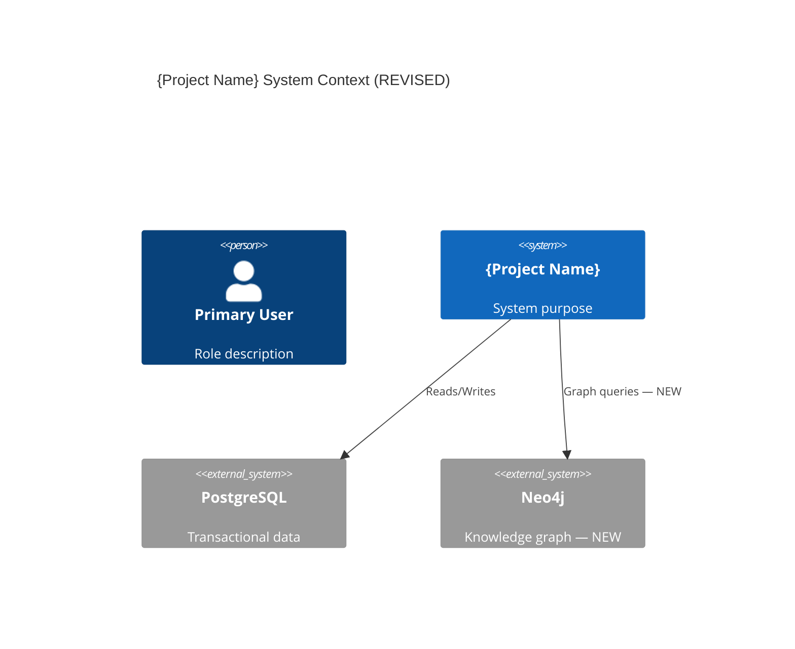
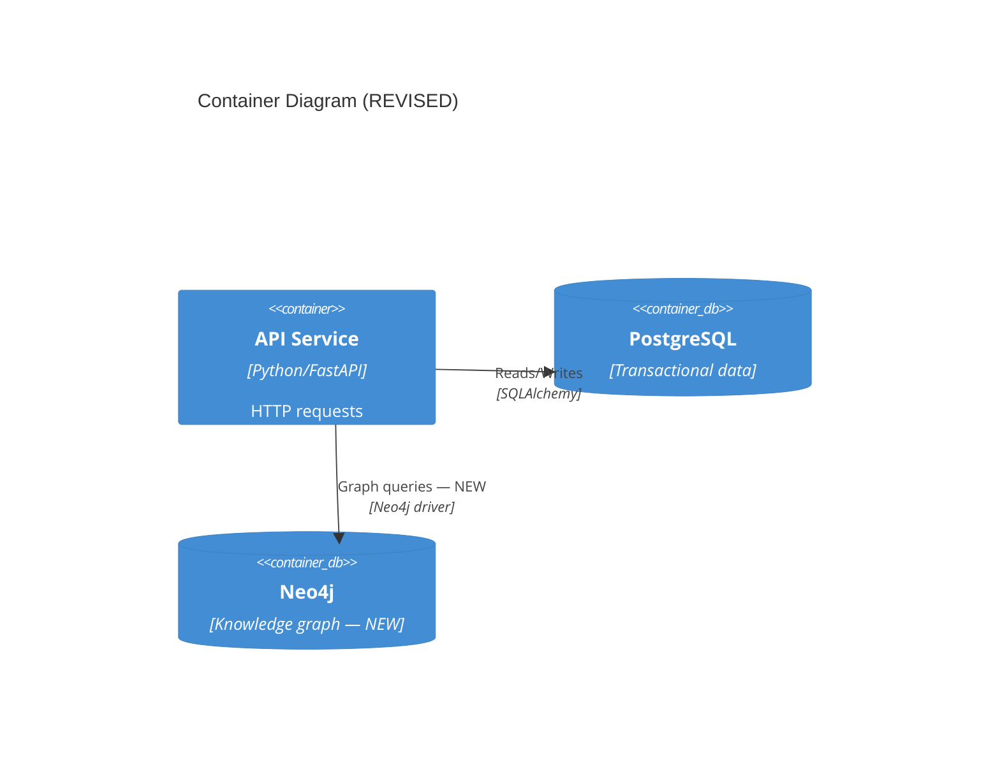

# /arch-refine - Iterative Architecture Decision Refinement Command

Enables iterative refinement of architecture decisions with temporal superseding, downstream impact analysis, and staleness flagging. This command sits alongside `/system-arch` in the architecture pipeline: while `/system-arch` defines or broadly refines architecture, `/arch-refine` targets specific existing ADRs for precise updates.

The disambiguation flow used by `/arch-refine` is identical to that used by `/design-refine` — both use semantic search (fleet-memory `mcp__fleet_memory__memory_search`, or a local ADR scan when fleet-memory is unavailable) to locate the decision to refine, present the top 3-5 matches for user selection, and require explicit confirmation before applying changes.

## Command Syntax

```bash
/arch-refine "natural language query" [--adr=ADR-ARCH-NNN] [--no-questions] [--context path/to/file.md]
```

## Available Flags

| Flag | Description |
|------|-------------|
| `--adr=ADR-ARCH-NNN` | Directly target a specific ADR by ID (skip disambiguation) |
| `--no-questions` | Skip interactive clarification (error — /arch-refine requires interactive input) |
| `--context path/to/file.md` | Include additional context files (can be used multiple times) |

## Overview

`/arch-refine` is the architecture-level refinement command. It modifies existing architecture decisions (ADRs) created by `/system-arch`, applying temporal superseding so that prior decisions remain queryable while new decisions take precedence.

**Key capabilities:**
- Semantic search disambiguation to locate the ADR to refine
- Temporal superseding of existing ADRs with full version history
- Downstream impact analysis across feature specs, C4 diagrams, and API contracts
- Staleness flagging on affected downstream artefacts
- Mandatory C4 diagram re-review gate after architectural changes
- Graceful degradation when fleet-memory is unavailable

**When to use `/arch-refine` vs `/system-arch --mode=refine`:**
- `/arch-refine` → Targeted refinement of a **specific ADR** (e.g., changing database choice)
- `/system-arch --mode=refine` → Broad refinement across **multiple categories** (e.g., restructuring bounded contexts)

**Shared disambiguation pattern:** The disambiguation flow is shared with `/design-refine`. Both commands use the same semantic search, result capping (ASSUM-002), and confirmation gate pattern.

## Prerequisite Gate

Before starting the refinement session, `/arch-refine` MUST verify that architecture context exists. The command requires existing ADRs from `/system-arch` to refine.

**Check fleet-memory availability** (see `docs/internals/commands-lib/memory-preamble.md` Tier 0 → Tier 1):

Check for the `mcp__fleet_memory__*` tools; else `guardkit memory status`. Set `memory_available` (and `memory_access`). If neither is reachable, set `memory_available = false` and display the unavailability warning from the preamble — never block the command.

Check for architecture context (follow the memory-preamble "Prerequisite Check Pattern" — either source satisfies the gate):
- If `memory_available = true`: `memory_search(project="guardkit", query="architecture decisions", payload_types=["adr"], domain_tags=["architecture"])` — a non-empty result means ADR context exists.
- Always: use Glob to check for `docs/architecture/decisions/ADR-ARCH-*.md`.
  - If no local ADRs found **and** the fleet-memory search returned nothing: display `NO_ARCHITECTURE_CONTEXT_MESSAGE` and exit.
  - If `memory_available = false` but local ADRs exist: display `"WARNING: Fleet-memory unavailable — reading ADRs from local files"` and continue.

## Execution Flow

### Phase 0: Context Loading

**Load existing ADRs and architecture context:**

**Check fleet-memory availability** (see `docs/internals/commands-lib/memory-preamble.md` Tier 0 → Tier 1):
Check for the `mcp__fleet_memory__*` tools; else `guardkit memory status`. Set `memory_available` (and `memory_access`) accordingly.

Load existing ADRs:
- If `memory_available = true`: ADR context is available via fleet-memory (`memory_search(project="guardkit", payload_types=["adr"], domain_tags=["architecture"])`)
- Always: use the Read tool on each file matched by `docs/architecture/decisions/ADR-ARCH-*.md` (the local ADR files remain the source of truth for the on-disk artefacts)

Load additional context files (if `--context` provided):
- Use the Read tool to read each context file specified

### Phase 1: Disambiguation — Locate the ADR to Refine

If `--adr=ADR-ARCH-NNN` is provided, skip disambiguation and directly load the target ADR. Otherwise, use semantic search to disambiguate the user's natural language query.

#### Step 1: Semantic Search

Search for matching ADRs using the user's natural language query:
- If `memory_available = true`: search fleet-memory for ADRs matching the query — `mcp__fleet_memory__memory_search(project="guardkit", query="<the user's query>", payload_types=["adr"], domain_tags=["architecture"])`
- If `memory_available = false`: use Glob and Read tools to scan `docs/architecture/decisions/ADR-ARCH-*.md` for relevant ADRs

Cap results at 3-5 to prevent adversarial queries from surfacing excessive data (ASSUM-002).

#### Step 2: Present Matches for Selection

Display the top 3-5 matches grouped by relevance for user selection:

```
━━━━━━━━━━━━━━━━━━━━━━━━━━━━━━━━━━━━━━━
📋 MATCHING ARCHITECTURE DECISIONS
━━━━━━━━━━━━━━━━━━━━━━━━━━━━━━━━━━━━━━━

Query: "database choice"

Results (capped at 3-5 per ASSUM-002):

  [1] ADR-ARCH-002: Use PostgreSQL as primary data store
      Status: accepted | Created: 2026-02-15
      Relevance: ████████░░ 85%

  [2] ADR-ARCH-005: Use Redis for session cache
      Status: accepted | Created: 2026-02-16
      Relevance: ██████░░░░ 62%

  [3] ADR-ARCH-003: Use SQLAlchemy as ORM
      Status: accepted | Created: 2026-02-15
      Relevance: █████░░░░░ 55%

Select ADR to refine [1-3], or [C]ancel:
```

#### Step 3: Confirm Selection

Before applying any changes, require explicit confirmation:

```
━━━━━━━━━━━━━━━━━━━━━━━━━━━━━━━━━━━━━━━
✓ SELECTED: ADR-ARCH-002 — Use PostgreSQL as primary data store
━━━━━━━━━━━━━━━━━━━━━━━━━━━━━━━━━━━━━━━

Current decision:
  Context: Need a reliable RDBMS for transactional data
  Decision: Use PostgreSQL 16 as primary data store
  Alternatives: MySQL, MongoDB, CockroachDB
  Status: accepted

Confirm this is the ADR you want to refine?
[Y]es — Proceed with refinement
[N]o — Return to search results
[C]ancel — Exit

Your choice [Y/N/C]:
```

**Ambiguous query handling:** If the semantic search returns no matches or only very low-relevance results, inform the user and suggest a more specific query. Cap results at 3-5 to prevent adversarial search queries from surfacing excessive data.

### Phase 2: Refinement — Capture New Decision

Capture the refined decision through conversational interaction:

```
━━━━━━━━━━━━━━━━━━━━━━━━━━━━━━━━━━━━━━━
🔄 REFINING: ADR-ARCH-002 — Use PostgreSQL as primary data store
━━━━━━━━━━━━━━━━━━━━━━━━━━━━━━━━━━━━━━━

Q1. What has changed that requires refining this decision?
    > [User describes what changed — e.g., "Need to support graph queries for knowledge graph"]

Q2. What is the new decision?
    > [User describes new decision — e.g., "Use Neo4j for knowledge graph, keep PostgreSQL for transactional data"]

Q3. What alternatives were considered for the new decision?
    > [User lists alternatives — e.g., "ArangoDB, Amazon Neptune, keeping everything in PostgreSQL with JSONB"]

Q4. What are the consequences of this change?
    > [User describes consequences — e.g., "Additional infrastructure, need graph query expertise, improved knowledge retrieval"]
```

### Phase 3: Temporal Superseding

Apply temporal superseding based on the spike results from TASK-SAD-001 (Option A: soft superseding via data-level encoding).

```python
from guardkit.knowledge.entities.architecture import ArchitectureDecision
from pathlib import Path
import re

# Step 1: Mark the existing ADR as superseded
# Set the superseded_by field (from TASK-SAD-002)
existing_adr.superseded_by = f"ADR-ARCH-{next_number:03d}"
existing_adr.status = "superseded"

# Step 2: Get next available ADR number
def get_next_adr_number(decisions_dir: Path) -> int:
    """Scan for existing ADRs and return next available number."""
    existing = list(decisions_dir.glob("ADR-ARCH-*.md"))
    if not existing:
        return 1
    numbers = []
    for f in existing:
        match = re.search(r"ADR-ARCH-(\d+)", f.name)
        if match:
            numbers.append(int(match.group(1)))
    return max(numbers) + 1 if numbers else 1

next_number = get_next_adr_number(Path("docs/architecture/decisions"))

# Step 3: Create new ADR with supersedes reference
new_adr = ArchitectureDecision(
    number=next_number,
    prefix="ARCH",
    title=new_title,
    context=new_context,
    decision=new_decision,
    alternatives_considered=new_alternatives,
    status="accepted",
    supersedes=f"ADR-ARCH-{existing_adr.number:03d}",
)

# Step 4: Write both ADRs to fleet-memory (deferred to Phase 8 seeding)
# Fleet-memory upserts idempotently on the natural key
# "adr:guardkit:<identifier>" (identifier = ADR_NNN, underscores only).
# The NEW adr payload carries a "supersedes" link to the old ADR's natural key;
# the OLD adr payload is re-written with "status": "superseded" (rule 4).
# Re-writing the old payload on its own natural key preserves it — both versions
# coexist and remain searchable; there is no separate "delete" of the old ADR.
# (Payloads are built here and persisted in Phase 8 via
# mcp__fleet_memory__memory_write_payload.)

# Step 5: Write updated and new ADR files
write_adr_file(existing_adr, "docs/architecture/decisions")
write_adr_file(new_adr, "docs/architecture/decisions")
```

**Fleet-memory supersession payloads (built here, written in Phase 8):**

```
# NEW ADR — carries the forward "supersedes" link to the old ADR's natural key.
mcp__fleet_memory__memory_write_payload(payload={
  "payload_type": "adr", "project": "guardkit",
  "identifier": "ADR_{next_number:03d}",          # underscores only, e.g. ADR_008
  "decision": "<new decision text>", "status": "accepted",
  "supersedes": ["adr:guardkit:ADR_{existing_number:03d}"],
  "domain_tags": ["architecture"],
  "source_ref": "docs/architecture/decisions/{new-adr-file}.md"
})

# OLD ADR — re-written on its own natural key with status "superseded".
# Idempotent upsert preserves it (both versions coexist and stay searchable).
mcp__fleet_memory__memory_write_payload(payload={
  "payload_type": "adr", "project": "guardkit",
  "identifier": "ADR_{existing_number:03d}",       # same natural key as before
  "decision": "<existing decision text>", "status": "superseded",
  "domain_tags": ["architecture"],
  "source_ref": "docs/architecture/decisions/{existing-adr-file}.md"
})
```

**Key temporal superseding properties (from TASK-SAD-001 spike):**
- Prior ADR remains searchable in fleet-memory — both versions coexist (the old
  payload is re-written with `status: superseded`, not deleted)
- `superseded_by` field on the old ADR file links forward to the new version
- `supersedes` field on the new ADR (file and `adr` payload) links backward to the old version
- Fleet-memory upserts idempotently on the natural key `adr:guardkit:ADR_NNN`;
  re-writing an existing key updates it in place without dropping other ADRs
- Consumers query the current `status` to identify the current version

### Phase 4: Impact Analysis

Before applying changes, analyse which downstream artefacts are affected and present the impact scope for user approval.

```python
# Query downstream artefacts that reference the changed ADR
if memory_available:
    # Search fleet-memory for affected API contracts (design documents)
    affected_contracts = mcp__fleet_memory__memory_search(
        project="guardkit",
        query=f"references {existing_adr.entity_id}",
        payload_types=["document"],
        domain_tags=["design"],
        token_budget=2000,
    )

    # Search fleet-memory for affected feature specs
    affected_specs = mcp__fleet_memory__memory_search(
        project="guardkit",
        query=f"depends on {existing_adr.entity_id}",
        payload_types=["document"],
        domain_tags=["design"],
        token_budget=2000,
    )
else:
    affected_contracts = []
    affected_specs = []
```

**Display impact scope:**

```
━━━━━━━━━━━━━━━━━━━━━━━━━━━━━━━━━━━━━━━
⚡ DOWNSTREAM IMPACT ANALYSIS
━━━━━━━━━━━━━━━━━━━━━━━━━━━━━━━━━━━━━━━

Superseding ADR-ARCH-002 affects the following downstream artefacts:

Feature Specs:
  ⚠️ FEAT-001: Order checkout flow — references PostgreSQL schema
  ⚠️ FEAT-003: User search — references PostgreSQL full-text search

C4 Diagrams:
  ⚠️ docs/architecture/container.md — shows PostgreSQL as primary store
  ⚠️ docs/architecture/system-context.md — shows database integration

API Contracts:
  ⚠️ docs/design/contracts/API-order-management.md — references PostgreSQL constraints

Feature specs that reference stale contracts will be flagged.

━━━━━━━━━━━━━━━━━━━━━━━━━━━━━━━━━━━━━━━

Impact scope: 2 feature specs, 2 C4 diagrams, 1 API contract

[A]pprove and apply changes
[R]evise the decision
[C]ancel — discard changes

Your choice [A/R/C]:
```

### Phase 5: Staleness Flagging

After user approves the impact, re-write the affected downstream `document` payloads in fleet-memory with a `"status": "stale"` field (and a `stale_reason`) on their own natural keys, so that `/system-design` and other commands can detect and report stale decisions on next run. Fleet-memory upserts idempotently on the natural key `document:guardkit:<identifier>`, so re-writing an affected document updates it in place — no separate node-tagging API is needed.

```python
# Re-write affected documents in fleet-memory with status "stale"
if memory_available and memory_access == "mcp":
    for affected in affected_contracts + affected_specs:
        identifier = affected.get("identifier")   # underscores-only slug
        if identifier:
            mcp__fleet_memory__memory_write_payload(payload={
                "payload_type": "document",
                "project": "guardkit",
                "identifier": identifier,          # same natural key → updates in place
                "content": affected.get("content", ""),
                "status": "stale",
                "stale_reason": f"Superseded by {new_adr.entity_id}",
                "domain_tags": affected.get("domain_tags", ["design"]),
                "source_ref": affected.get("source_ref", ""),
            })
            print(f"  ⚠️ Flagged as stale: {identifier}")

    print()
    print("Stale artefacts will be detected and reported by /system-design on next run.")
```

**`/system-design` stale detection:** When `/system-design` runs, it searches fleet-memory for documents with `status: "stale"` and presents them to the user:

```
━━━━━━━━━━━━━━━━━━━━━━━━━━━━━━━━━━━━━━━
⚠️ STALE DECISIONS DETECTED
━━━━━━━━━━━━━━━━━━━━━━━━━━━━━━━━━━━━━━━

The following artefacts reference superseded architecture decisions:

  • API-order-management — references ADR-ARCH-002 (superseded by ADR-ARCH-008)
  • FEAT-001 — references ADR-ARCH-002 (superseded by ADR-ARCH-008)

Consider updating these artefacts to align with current decisions.
━━━━━━━━━━━━━━━━━━━━━━━━━━━━━━━━━━━━━━━
```

### Phase 6: C4 Diagram Re-Review Gate (Mandatory)

If the refined ADR affects system structure (bounded contexts, containers, external integrations), regenerate the affected C4 diagrams and present them for mandatory approval.

**CRITICAL**: Revised L1/L2 diagrams must be generated and presented for mandatory approval. The user cannot skip this review gate.

```
━━━━━━━━━━━━━━━━━━━━━━━━━━━━━━━━━━━━━━━
🔍 C4 DIAGRAM RE-REVIEW GATE
━━━━━━━━━━━━━━━━━━━━━━━━━━━━━━━━━━━━━━━

The architecture change affects system structure.
Revised C4 Level 1 (System Context) and Level 2 (Container) diagrams
have been regenerated and require your mandatory approval.

━━━━━━━━━━━━━━━━━━━━━━━━━━━━━━━━━━━━━━━
```

#### C4 Level 1: Revised System Context Diagram


```mermaid
C4Context
    title {Project Name} System Context (REVISED)

    Person(user, "Primary User", "Role description")
    System(main, "{Project Name}", "System purpose")

    System_Ext(pg, "PostgreSQL", "Transactional data")
    System_Ext(neo4j, "Neo4j", "Knowledge graph — NEW")

    Rel(main, pg, "Reads/Writes")
    Rel(main, neo4j, "Graph queries — NEW")
```

_Changes highlighted in yellow. Look for: new dependencies, removed connections, shifted responsibilities._

```
[A]pprove — Diagram is correct, proceed
[R]evise — I need to make changes
[C]ancel — Stop and discard all changes

Your choice [A/R/C]:
```

#### C4 Level 2: Revised Container Diagram


```mermaid
C4Container
    title Container Diagram (REVISED)

    Container(api, "API Service", "Python/FastAPI", "HTTP requests")
    ContainerDb(db, "PostgreSQL", "Transactional data")
    ContainerDb(graph, "Neo4j", "Knowledge graph — NEW")

    Rel(api, db, "Reads/Writes", "SQLAlchemy")
    Rel(api, graph, "Graph queries — NEW", "Neo4j driver")
```

_Look for: new containers, removed containers, changed relationships._

```
[A]pprove — Diagram is correct, proceed
[R]evise — I need to make changes
[C]ancel — Stop and discard all changes

Your choice [A/R/C]:
```

### Phase 7: Output Generation

Generate all output artefacts:

```python
from guardkit.planning.architecture_writer import ArchitectureWriter

writer = ArchitectureWriter()
output_dir = "docs/architecture"

# Write updated existing ADR (status: superseded)
writer.write_adr(f"{output_dir}/decisions", existing_adr)

# Write new ADR (status: accepted, supersedes: ADR-ARCH-NNN)
writer.write_adr(f"{output_dir}/decisions", new_adr)

# Regenerate C4 diagrams (if structure changed)
if structure_changed:
    writer.write_system_context(output_dir, updated_system_context, components, external_systems)
    writer.write_container_diagram(output_dir, updated_containers, relationships)

# Update ARCHITECTURE.md index
writer.write_architecture_index(output_dir, system_context, components, concerns, decisions)
```

### Phase 8: Fleet-Memory Seeding

Write the superseded and new ADR payloads to fleet-memory (see `docs/internals/commands-lib/memory-preamble.md` — Payload Model Reference + Seeding Pattern).

**Content sanitisation:** `mcp__fleet_memory__memory_write_payload` accepts typed payloads and handles storage internally — no manual sanitisation step is needed. Map hyphenated ADR ids to underscores (`ADR-ARCH-002` → `ADR_ARCH_002`) so the identifier matches `^[a-zA-Z0-9_]+$`.

If `memory_available` is true, build and display the following payloads, then ask: `"Seed these to fleet-memory now? [Y/n]"`.

```
# NEW ADR — adr payload, carries the forward "supersedes" link, status "accepted"
mcp__fleet_memory__memory_write_payload(payload={
  "payload_type": "adr", "project": "guardkit",
  "identifier": "ADR_ARCH_{new_number:03d}",       # underscores only
  "decision": "<new decision text>", "status": "accepted",
  "supersedes": ["adr:guardkit:ADR_ARCH_{existing_number:03d}"],
  "domain_tags": ["architecture"],
  "source_ref": "docs/architecture/decisions/{new-adr-file}.md"
})

# OLD ADR — re-written on its own natural key with status "superseded"
# (idempotent upsert preserves it — both versions coexist and stay searchable)
mcp__fleet_memory__memory_write_payload(payload={
  "payload_type": "adr", "project": "guardkit",
  "identifier": "ADR_ARCH_{existing_number:03d}",  # same natural key as before
  "decision": "<existing decision text>", "status": "superseded",
  "domain_tags": ["architecture"],
  "source_ref": "docs/architecture/decisions/{existing-adr-file}.md"
})
```

On yes and `memory_access = "mcp"`, write each via `mcp__fleet_memory__memory_write_payload`. If `memory_access = "cli"`, note that writes require the fleet-memory MCP tools connected and skip (the ADR files remain on disk).

If fleet-memory is unavailable, display the unavailability warning from the preamble:

```
⚠️  Fleet-memory unavailable — artefacts written to markdown only.
    Re-run with the fleet_memory MCP server connected (see .mcp.json) to seed the knowledge store.
```

## Error Handling

### No Architecture Context

```python
if not has_arch:
    print("━━━━━━━━━━━━━━━━━━━━━━━━━━━━━━━━━━━━━━━")
    print("❌ No architecture context found")
    print("━━━━━━━━━━━━━━━━━━━━━━━━━━━━━━━━━━━━━━━")
    print()
    print("/arch-refine requires architecture context from /system-arch.")
    print("Run /system-arch first to establish architecture decisions.")
    exit(0)
```

### No Matching ADR Found

```python
if not matches:
    print("━━━━━━━━━━━━━━━━━━━━━━━━━━━━━━━━━━━━━━━")
    print("❌ No matching ADR found")
    print("━━━━━━━━━━━━━━━━━━━━━━━━━━━━━━━━━━━━━━━")
    print()
    print(f"No architecture decisions match: \"{query}\"")
    print()
    print("Suggestions:")
    print("  1. Try a more specific query")
    print("  2. Use --adr=ADR-ARCH-NNN to target a specific ADR")
    print("  3. Run /system-arch to view all existing ADRs")
    exit(0)
```

### Fleet-Memory Unavailable

When `memory_available = false`, display the unavailability warning from `docs/internals/commands-lib/memory-preamble.md`:

```
⚠️  Fleet-memory unavailable — continuing without knowledge capture.
    Reason: MCP tools not connected and CLI not reachable

    Artefacts are written to markdown only. Re-run with the fleet_memory MCP
    server connected (see .mcp.json) to seed the knowledge store.
```

Then inform the user of the specific limitations for architecture refinement:
- Temporal superseding won't be tracked in fleet-memory
- Staleness flagging won't propagate to downstream documents
- Impact analysis will be limited to local file scanning

Ask: "Continue without persistence? [Y/n]"

If no: display "Cancelled." and stop. Do not block if no input — default to continue.

### Fleet-Memory Unavailable Mid-Session

```python
try:
    mcp__fleet_memory__memory_write_payload(payload={
        "payload_type": "adr", "project": "guardkit",
        "identifier": new_adr.identifier,      # underscores only
        "decision": new_adr.decision, "status": "accepted",
        "supersedes": [f"adr:guardkit:{existing_adr.identifier}"],
        "domain_tags": ["architecture"],
        "source_ref": new_adr.source_ref,
    })
except Exception:
    print("WARNING: Fleet-memory write failed during refinement session")
    print("ADR files were written to docs/architecture/decisions/ successfully.")
    print("Re-run /arch-refine to retry fleet-memory seeding.")
    memory_available = False  # Disable further fleet-memory writes
```

### --no-questions Flag

```python
if flags.get("no_questions"):
    print("━━━━━━━━━━━━━━━━━━━━━━━━━━━━━━━━━━━━━━━")
    print("ERROR: /arch-refine requires interactive input")
    print("━━━━━━━━━━━━━━━━━━━━━━━━━━━━━━━━━━━━━━━")
    print()
    print("The --no-questions flag is not supported for /arch-refine.")
    print("Architecture decision refinement requires human review and approval.")
    exit(1)
```

### No Query Provided

```python
if not query or not query.strip():
    print("━━━━━━━━━━━━━━━━━━━━━━━━━━━━━━━━━━━━━━━")
    print("ERROR: Refinement query is required")
    print("━━━━━━━━━━━━━━━━━━━━━━━━━━━━━━━━━━━━━━━")
    print()
    print("Usage: /arch-refine \"what to refine\"")
    print()
    print("Examples:")
    print('  /arch-refine "change database from PostgreSQL to MongoDB"')
    print('  /arch-refine "update authentication approach"')
    print('  /arch-refine "revise deployment strategy"')
    exit(1)
```

## Examples

### Example 1: Refine a Database Decision

```bash
/arch-refine "change the primary database"

━━━━━━━━━━━━━━━━━━━━━━━━━━━━━━━━━━━━━━━
📋 MATCHING ARCHITECTURE DECISIONS
━━━━━━━━━━━━━━━━━━━━━━━━━━━━━━━━━━━━━━━

Query: "change the primary database"

  [1] ADR-ARCH-002: Use PostgreSQL as primary data store
      Status: accepted | Relevance: 92%

  [2] ADR-ARCH-005: Use Redis for session cache
      Status: accepted | Relevance: 45%

Select ADR to refine [1-2], or [C]ancel:
> 1

━━━━━━━━━━━━━━━━━━━━━━━━━━━━━━━━━━━━━━━
✓ SELECTED: ADR-ARCH-002 — Use PostgreSQL as primary data store
━━━━━━━━━━━━━━━━━━━━━━━━━━━━━━━━━━━━━━━

Confirm? [Y/N/C]: Y

🔄 REFINING: ADR-ARCH-002

  Q1. What has changed?
      > Need to support graph queries for knowledge graph

  Q2. What is the new decision?
      > Use Neo4j for knowledge graph alongside PostgreSQL for transactional data

  Q3. Alternatives considered?
      > ArangoDB, Amazon Neptune, PostgreSQL JSONB

  Q4. Consequences?
      > Additional infrastructure, graph query expertise needed, better knowledge retrieval

━━━━━━━━━━━━━━━━━━━━━━━━━━━━━━━━━━━━━━━
⚡ DOWNSTREAM IMPACT ANALYSIS
━━━━━━━━━━━━━━━━━━━━━━━━━━━━━━━━━━━━━━━

  Feature Specs: 2 affected
  C4 Diagrams: 2 affected
  API Contracts: 1 affected

[A]pprove | [R]evise | [C]ancel: A

━━━━━━━━━━━━━━━━━━━━━━━━━━━━━━━━━━━━━━━
🔍 C4 DIAGRAM RE-REVIEW GATE
━━━━━━━━━━━━━━━━━━━━━━━━━━━━━━━━━━━━━━━

[Revised C4 Context diagram]
[A]pprove | [R]evise | [C]ancel: A

[Revised C4 Container diagram]
[A]pprove | [R]evise | [C]ancel: A

━━━━━━━━━━━━━━━━━━━━━━━━━━━━━━━━━━━━━━━
✅ ARCHITECTURE DECISION REFINED
━━━━━━━━━━━━━━━━━━━━━━━━━━━━━━━━━━━━━━━

  ADR-ARCH-002: Status changed to "superseded"
  ADR-ARCH-008: Created (supersedes ADR-ARCH-002)

Updated files:
  ├── docs/architecture/decisions/ADR-ARCH-002-postgresql.md (superseded)
  ├── docs/architecture/decisions/ADR-ARCH-008-neo4j-knowledge-graph.md (new)
  ├── docs/architecture/system-context.md (regenerated)
  ├── docs/architecture/container.md (regenerated)
  └── docs/architecture/ARCHITECTURE.md (updated index)

Fleet-memory:
  ✓ ADR-ARCH-002 updated (adr, status: superseded)
  ✓ ADR-ARCH-008 created (adr, supersedes: adr:guardkit:ADR_ARCH_002)
  ✓ 5 downstream documents flagged as stale

Next steps:
  1. Review updated architecture: docs/architecture/ARCHITECTURE.md
  2. Update stale artefacts: /system-design (will detect and report)
  3. Update feature specs referencing the old decision
```

### Example 2: Directly Target an ADR

```bash
/arch-refine --adr=ADR-ARCH-003 "Update from SQLAlchemy to SQLModel"

━━━━━━━━━━━━━━━━━━━━━━━━━━━━━━━━━━━━━━━
✓ SELECTED: ADR-ARCH-003 — Use SQLAlchemy as ORM
━━━━━━━━━━━━━━━━━━━━━━━━━━━━━━━━━━━━━━━

[Skipped disambiguation — direct ADR target]

[... refinement flow continues ...]
```

### Example 3: Fleet-Memory Unavailable

```bash
/arch-refine "change deployment strategy"

━━━━━━━━━━━━━━━━━━━━━━━━━━━━━━━━━━━━━━━
WARNING: Fleet-memory unavailable
━━━━━━━━━━━━━━━━━━━━━━━━━━━━━━━━━━━━━━━

Architecture refinement will continue WITHOUT persistence.
Markdown artefacts will still be generated.

Continue without persistence? [Y/n]: Y

[... refinement flow using local files ...]

━━━━━━━━━━━━━━━━━━━━━━━━━━━━━━━━━━━━━━━
✅ ARCHITECTURE DECISION REFINED
━━━━━━━━━━━━━━━━━━━━━━━━━━━━━━━━━━━━━━━

  ⚠️ Fleet-memory unavailable — artefacts written to markdown only
  ⚠️ Staleness flagging skipped (requires fleet-memory)
```

### Example 4: No Matching ADR

```bash
/arch-refine "quantum computing architecture"

━━━━━━━━━━━━━━━━━━━━━━━━━━━━━━━━━━━━━━━
❌ No matching ADR found
━━━━━━━━━━━━━━━━━━━━━━━━━━━━━━━━━━━━━━━

No architecture decisions match: "quantum computing architecture"

Suggestions:
  1. Try a more specific query
  2. Use --adr=ADR-ARCH-NNN to target a specific ADR
  3. Run /system-arch to view all existing ADRs
```

---

## CRITICAL EXECUTION INSTRUCTIONS FOR CLAUDE

**IMPORTANT: YOU MUST FOLLOW THESE STEPS EXACTLY. THIS IS AN INTERACTIVE REFINEMENT COMMAND.**

When the user runs `/arch-refine "query"`, you MUST execute these steps in order:

### Step 1: Parse Arguments and Validate

```python
# Extract query and flags
query = args[0] if args else None
adr_target = flags.get("adr", None)
no_questions = flags.get("no_questions", False)
context_files = flags.get("context", [])

# Validate query
if not query or not query.strip():
    print("ERROR: Refinement query is required")
    print("Usage: /arch-refine \"what to refine\"")
    exit(1)

# Reject --no-questions
if no_questions:
    print("ERROR: /arch-refine requires interactive input")
    exit(1)
```

### Step 2: Check Fleet-Memory Availability and Prerequisite

**Check fleet-memory availability** (see `docs/internals/commands-lib/memory-preamble.md` Tier 0 → Tier 1):

Check for the `mcp__fleet_memory__*` tools; else run `guardkit memory status`.
- If reachable: set `memory_available = true` (and `memory_access = "mcp"` or `"cli"`)
- Otherwise: set `memory_available = false`

Check for architecture context (either source satisfies the gate):
- If `memory_available = true`: `memory_search(project="guardkit", query="architecture decisions", payload_types=["adr"], domain_tags=["architecture"])` — a non-empty result means ADR context exists.
- Always: use Glob to check for `docs/architecture/decisions/ADR-ARCH-*.md`.
  - If no local files **and** the fleet-memory search returned nothing: display `NO_ARCHITECTURE_CONTEXT_MESSAGE` and exit.
  - If local files exist but `memory_available = false`: display the unavailability warning from the preamble and ask: "Continue? [Y/n]"

### Step 3: Disambiguation — Locate Target ADR

```python
if adr_target:
    # Direct ADR targeting — skip disambiguation
    target_adr = load_adr_by_id(adr_target)
else:
    # Semantic search disambiguation
    if memory_available:
        matches = mcp__fleet_memory__memory_search(
            project="guardkit", query=query,
            payload_types=["adr"], domain_tags=["architecture"],
            token_budget=2000,
        )
    else:
        # Fleet-memory unavailable — scan local ADR files
        matches = scan_local_adrs(query, "docs/architecture/decisions")
    matches = matches[:5]  # Cap at 3-5 (ASSUM-002)

    if not matches:
        print(NO_MATCHING_ADR_MESSAGE)
        exit(0)

    # Present matches for user selection
    display_matches(matches)
    selected = get_user_selection(matches)

    # Require explicit confirmation before proceeding
    confirmed = confirm_selection(selected)
    if not confirmed:
        exit(0)

    target_adr = selected
```

### Step 4: Capture Refined Decision

```python
# Conversational capture of refined decision
new_context = ask("Q1. What has changed?")
new_decision = ask("Q2. What is the new decision?")
new_alternatives = ask("Q3. Alternatives considered?")
new_consequences = ask("Q4. Consequences?")
```

### Step 5: Impact Analysis

```python
# Analyse downstream impact
affected_artefacts = analyse_impact(target_adr.entity_id)

# Present impact scope for user approval
display_impact_analysis(affected_artefacts)
approval = input("[A]pprove | [R]evise | [C]ancel: ")

if approval.lower() == "c":
    print("Cancelled.")
    exit(0)
elif approval.lower() == "r":
    # Return to Step 4
    pass
```

### Step 6: Apply Temporal Superseding

```python
# Mark existing ADR as superseded
target_adr.superseded_by = new_adr.entity_id
target_adr.status = "superseded"

# Create new ADR with supersedes reference
new_adr = create_superseding_adr(target_adr, refined_data)

# Write ADR files
write_adr_files(target_adr, new_adr, "docs/architecture/decisions")
```

### Step 7: Staleness Flagging

```python
# Re-write affected downstream documents in fleet-memory with status "stale"
if memory_available and memory_access == "mcp":
    for affected in affected_artefacts:
        mcp__fleet_memory__memory_write_payload(payload={
            "payload_type": "document", "project": "guardkit",
            "identifier": affected.identifier,        # same natural key → updates in place
            "content": affected.content,
            "status": "stale",
            "stale_reason": f"Superseded by {new_adr.entity_id}",
            "domain_tags": affected.domain_tags,
            "source_ref": affected.source_ref,
        })
```

### Step 8: C4 Diagram Re-Review Gate (if structure changed)

```python
if structure_changed:
    # Regenerate C4 Level 1 and Level 2 diagrams
    # Present for mandatory approval — DO NOT proceed without approval
    regenerate_and_review_c4_diagrams()
```

### Step 9: Fleet-Memory Seeding

**Seed fleet-memory** (if `memory_available` is true):

Build the two `adr` payloads (see `docs/internals/commands-lib/memory-preamble.md` — Payload Model Reference + Seeding Pattern) and offer them for review. `mcp__fleet_memory__memory_write_payload` handles storage internally — no manual sanitisation step is needed. Sanitise hyphens to underscores in the identifier (`ADR-ARCH-002` → `ADR_ARCH_002`).

```
# NEW ADR — status "accepted", forward "supersedes" link to the old ADR's natural key
mcp__fleet_memory__memory_write_payload(payload={
  "payload_type": "adr", "project": "guardkit",
  "identifier": "ADR_ARCH_{new_number:03d}",
  "decision": "<new decision text>", "status": "accepted",
  "supersedes": ["adr:guardkit:ADR_ARCH_{target_number:03d}"],
  "domain_tags": ["architecture"],
  "source_ref": "docs/architecture/decisions/{new-adr-file}.md"})

# OLD ADR — re-written on its own natural key with status "superseded" (preserved, not deleted)
mcp__fleet_memory__memory_write_payload(payload={
  "payload_type": "adr", "project": "guardkit",
  "identifier": "ADR_ARCH_{target_number:03d}",
  "decision": "<existing decision text>", "status": "superseded",
  "domain_tags": ["architecture"],
  "source_ref": "docs/architecture/decisions/{target-adr-file}.md"})
```

Ask: "Seed these to fleet-memory now? [Y/n]"

If yes and `memory_access = "mcp"`, write each via `mcp__fleet_memory__memory_write_payload`. If `memory_access = "cli"`, note writes need the MCP tools connected and skip.

### Step 10: Display Summary

```python
print("━━━━━━━━━━━━━━━━━━━━━━━━━━━━━━━━━━━━━━━")
print("✅ ARCHITECTURE DECISION REFINED")
print("━━━━━━━━━━━━━━━━━━━━━━━━━━━━━━━━━━━━━━━")
print()
print(f"  {target_adr.entity_id}: Status changed to \"superseded\"")
print(f"  {new_adr.entity_id}: Created (supersedes {target_adr.entity_id})")
print()
print("Next steps:")
print("  1. Review: docs/architecture/ARCHITECTURE.md")
print("  2. Update stale artefacts: /system-design")
print("  3. Update feature specs referencing the old decision")
```

### What NOT to Do

- **DO NOT** skip the disambiguation flow (always present matches and confirm)
- **DO NOT** apply changes before explicit user confirmation
- **DO NOT** delete or overwrite existing ADRs (supersede them — both versions must coexist)
- **DO NOT** skip the impact analysis (always show downstream effects)
- **DO NOT** skip the C4 diagram re-review gate when structure is affected
- **DO NOT** batch fleet-memory seeding (write each payload as its decision is finalised)
- **DO NOT** skip staleness flagging (always re-write affected downstream documents with `status: "stale"`)
- **DO NOT** seed fleet-memory via Python — always use the `mcp__fleet_memory__memory_write_payload` tool
- **DO NOT** return more than 5 disambiguation results (cap per ASSUM-002)
- **DO NOT** proceed without a fleet-memory warning (inform user, offer to continue)

### Message Constants

```python
NO_ARCHITECTURE_CONTEXT_MESSAGE = """
━━━━━━━━━━━━━━━━━━━━━━━━━━━━━━━━━━━━━━━
❌ No architecture context found
━━━━━━━━━━━━━━━━━━━━━━━━━━━━━━━━━━━━━━━

/arch-refine requires architecture context from /system-arch.
Run /system-arch first to establish architecture decisions.
"""

NO_MATCHING_ADR_MESSAGE = """
━━━━━━━━━━━━━━━━━━━━━━━━━━━━━━━━━━━━━━━
❌ No matching ADR found
━━━━━━━━━━━━━━━━━━━━━━━━━━━━━━━━━━━━━━━

Suggestions:
  1. Try a more specific query
  2. Use --adr=ADR-ARCH-NNN to target a specific ADR
  3. Run /system-arch to view all existing ADRs
"""

MEMORY_UNAVAILABLE_MESSAGE:
Use the warning template from `docs/internals/commands-lib/memory-preamble.md`. Additional context for architecture refinement:
- Temporal superseding won't be tracked in fleet-memory
- Staleness flagging won't propagate to downstream documents
- Impact analysis will be limited to local file scanning
```

### Example Execution Trace

```
User: /arch-refine "change authentication from JWT to session-based"

Claude executes:
  1. Parse arguments → query = "change authentication from JWT to session-based"
  2. Check fleet-memory availability → `mcp__fleet_memory__*` tools present (Tier 0), else `guardkit memory status`
  3. Prerequisite check → architecture context exists ✓
  4. Semantic search → 3 matches found (capped at 5 per ASSUM-002)
  5. Display matches → present [1] ADR-ARCH-004: JWT Auth, [2] ADR-ARCH-007: API Keys, [3] ADR-ARCH-001: Auth Strategy
  6. User selects [1] → ADR-ARCH-004
  7. Confirm selection → user confirms "Yes"
  8. Capture refinement → Q1-Q4 conversational flow
  9. Impact analysis → 3 feature specs, 1 C4 diagram, 2 API contracts affected
  10. User approves impact scope
  11. Temporal superseding → ADR-ARCH-004 superseded, ADR-ARCH-009 created
  12. Staleness flagging → 6 downstream documents re-written with status: "stale"
  13. C4 re-review gate → revised L1 and L2 diagrams approved
  14. Output generation → ADR files written, diagrams regenerated
  15. Fleet-memory seeding → offer two `mcp__fleet_memory__memory_write_payload` writes (superseded + new ADR)
  16. Summary → display results and next steps
```

---

## Related Commands

- **`/system-arch`** — Define or broadly refine architecture (prerequisite for `/arch-refine`)
- **`/system-design`** — Design API contracts; detects and reports stale decisions flagged by `/arch-refine`
- **`/design-refine`** — Refine design-level decisions (DDRs); shares the same disambiguation flow as `/arch-refine`
- **`/system-plan`** — Feature-level planning that consumes architecture context
