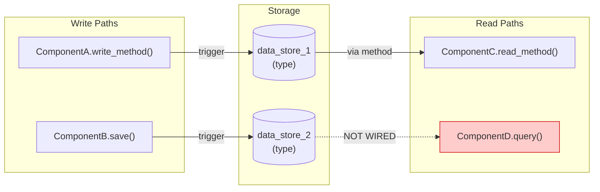
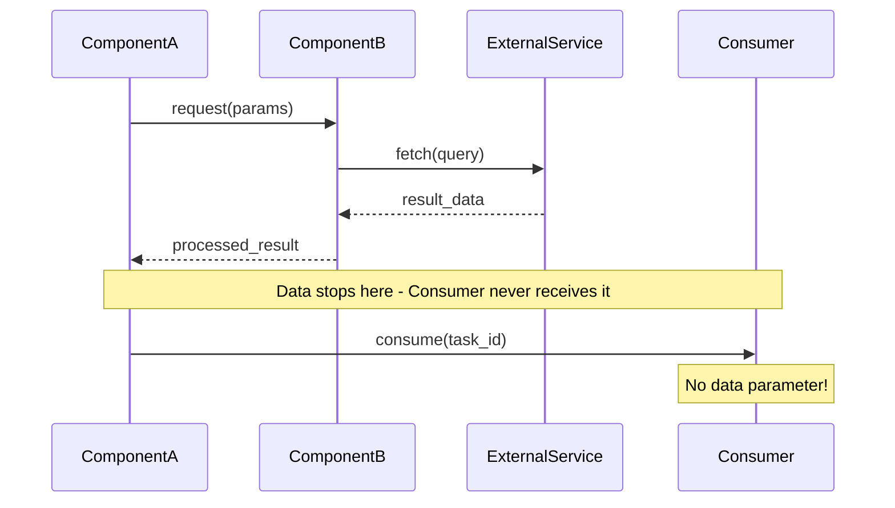
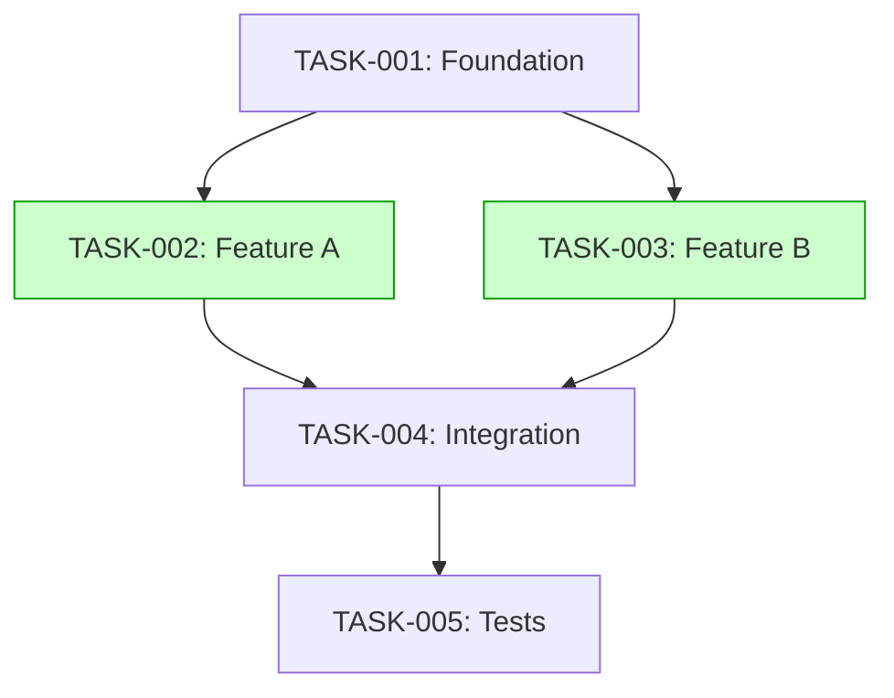

# Feature Plan - Single Command Feature Planning

Orchestrates the feature planning workflow in a single user-facing command by automatically creating a review task and executing the decision-making analysis.

## Command Syntax

```bash
/feature-plan "feature description"
```

**Note on `/feature-plan` vs `/task-create`**:
- **`/feature-plan`**: Uses the description for **analysis** purposes. The review task title is programmatically generated as "Plan: {description}".
- **`/task-create`**: Uses the description for **title inference**. Claude analyzes the description to extract a concise, actionable title (e.g., "We need JWT auth" → "Add JWT authentication").

Both accept natural language descriptions, but they serve different purposes in the workflow.

## Available Flags

| Flag | Description |
|------|-------------|
| `--context path/to/file.md` | Explicitly specify context files (can be used multiple times) |
| `--no-questions` | Skip all clarification (review scope + implementation prefs) |
| `--with-questions` | Force clarification even for simple features |
| `--defaults` | Use clarification defaults throughout workflow |
| `--answers="..."` | Inline answers (propagated to task-review and subtask creation) |
| `--no-structured` | Disable structured YAML feature file output (enabled by default) |
| `--from-spec path/to/spec.md` | Parse Research-to-Implementation Template |
| `--target interactive\|local-model\|auto` | Set output verbosity for target executor |
| `--generate-adrs` | Generate ADR files from Decision Log |
| `--generate-quality-gates` | Generate per-feature quality gate YAML |

### AutoBuild Integration (Default Behavior)

By default, `/feature-plan` generates structured YAML feature files for AutoBuild integration. This includes:
- A structured YAML feature file at `.guardkit/features/FEAT-XXX.yaml`
- Task dependencies and parallel execution groups
- Complexity scores (1-10) for each task
- Orchestration metadata for AutoBuild consumption

This enables integration with `/feature-build` for autonomous implementation:

```bash
# Standard usage (structured output is default)
/feature-plan "add OAuth2 authentication"

# Output includes:
# ✅ Feature FEAT-A1B2 created
# 📋 Tasks: 5
#    TASK-001: Create OAuth service interface (complexity: 3)
#    TASK-002: Implement Google OAuth provider (complexity: 5)
#    TASK-003: Implement GitHub OAuth provider (complexity: 5)
#    TASK-004: Add session management (complexity: 4)
#    TASK-005: Integration tests (complexity: 3)
#
# 🔀 Parallel execution groups:
#    Wave 1: [TASK-001]
#    Wave 2: [TASK-002, TASK-003] (can run in parallel)
#    Wave 3: [TASK-004]
#    Wave 4: [TASK-005]
#
# 📁 Feature file: .guardkit/features/FEAT-A1B2.yaml
# 📁 Task files: tasks/backlog/oauth-auth/TASK-001.md ... TASK-005.md

# Then use feature-build for autonomous implementation
/feature-build FEAT-A1B2

# To disable structured output (task markdown files only)
/feature-plan "add OAuth2 authentication" --no-structured
```

**Note**: Both the traditional task markdown files AND the structured YAML feature file are created by default. This maintains compatibility with `/task-work` while enabling `/feature-build` integration. Use `--no-structured` to skip YAML generation.

### Explicit Context Files (--context)

By default, `/feature-plan` automatically detects and loads context from:
- Feature specification files (`docs/features/FEAT-*.md`)
- CLAUDE.md project files
- Related architecture documentation

Use `--context` when auto-detection isn't sufficient or you want to explicitly seed specific context:

```bash
# Single context file
/feature-plan "implement OAuth" --context docs/auth-design.md

# Multiple context files (processed in order)
/feature-plan "add API" --context docs/api-spec.md --context docs/security-requirements.md

# Works alongside auto-detection (explicit files loaded first)
/feature-plan "implement FEAT-GR-003" --context additional-context.md
```

**When to use --context:**
- Feature spec not in standard location (`docs/features/`)
- Need to include additional architectural context
- Want to override auto-detection with specific files
- Testing or automation scenarios requiring explicit context

**Context file requirements:**
- Must be readable markdown files
- Can include frontmatter metadata
- Paths can be relative (to project root) or absolute
- Nonexistent files are handled gracefully (warning logged)

### Graphiti Context Integration (FEAT-GR-003)

When `/feature-plan` executes with context (auto-detected or explicit), it queries Graphiti's knowledge graph to enrich planning with:

**1. Feature-Related Context:**
- Related features and their outcomes
- Relevant design patterns for the tech stack
- Similar past implementations and lessons learned
- Project architecture and key components

**2. AutoBuild Support Context:**
- **Role constraints**: Player/Coach boundaries to prevent role reversal
- **Quality gate configs**: Task-type specific thresholds (scaffolding vs feature)
- **Implementation modes**: Direct vs task-work patterns and file locations

**Example Context Query Flow:**

```bash
/feature-plan "implement FEAT-GR-003 feature spec integration" --context docs/research/graphiti-refinement/FEAT-GR-003.md

# Internal Graphiti queries:
# 1. Seed feature spec to knowledge graph
# 2. Query related features: FEAT-GR-002, FEAT-GR-004
# 3. Query relevant patterns: "repository pattern", "context builder pattern"
# 4. Query role constraints: player_must_implement, coach_must_validate
# 5. Query quality gates: scaffolding_threshold=skip_arch, feature_threshold=60
# 6. Query implementation modes: task-work (>= complexity 4), direct (< complexity 4)
#
# Planning prompt enriched with:
# - Feature spec details (success criteria, technical requirements)
# - 2 related features with similar patterns
# - 3 relevant design patterns
# - Player/Coach role boundaries
# - Quality gate thresholds per task type
# - File location patterns for direct mode
```

**What This Prevents:**

| Issue | How Context Helps |
|-------|------------------|
| Role reversal | Player knows implementation boundaries, Coach knows validation scope |
| Threshold drift | Quality gates consistent across all generated subtasks |
| File location errors | Direct mode tasks know to create files inline, not in worktrees |
| Pattern inconsistency | Planning references proven patterns from past features |
| Knowledge loss | Related features inform current implementation approach |

**Queried Group IDs:**

```python
# Feature context
"feature_specs"          # Seeded feature specifications
"feature_completions"    # Past feature outcomes
"task_outcomes"          # Individual task learnings

# Pattern context
"patterns_{tech_stack}"  # Stack-specific patterns (e.g., patterns_python)
"patterns"               # Generic design patterns

# AutoBuild context
"role_constraints"       # Player/Coach responsibilities
"quality_gate_configs"   # Task-type quality thresholds
"implementation_modes"   # Direct vs task-work guidance

# Architecture context
"project_overview"       # CLAUDE.md insights
"project_architecture"   # Key components, entry points
"failure_patterns"       # Things that failed before
```

**Token Budget Allocation:**

```
Total budget: ~4000 tokens

1. Feature spec (40%):         ~1600 tokens - Highest priority
2. Project architecture (20%): ~800 tokens  - Context setting
3. Related features (15%):     ~600 tokens  - Similar patterns
4. Design patterns (15%):      ~600 tokens  - Implementation guidance
5. Warnings (10%):             ~400 tokens  - Past failures
6. Role constraints:           ~200 tokens  - AutoBuild boundaries
7. Quality gates:              ~200 tokens  - Threshold configs
```

**Example: Planning with Full Context**

```bash
$ /feature-plan "implement FEAT-SKEL-001 walking skeleton" --context docs/features/FEAT-SKEL-001.md

[Graphiti] Found feature spec: docs/features/FEAT-SKEL-001-walking-skeleton.md
[Graphiti] Seeded feature spec to knowledge graph
[Graphiti] Querying for enriched context...

[Graphiti] Context loaded:
  ✓ Related features: 2 (FEAT-SETUP-001, FEAT-PING-002)
  ✓ Relevant patterns: 3 (mcp-tool-pattern, docker-setup, healthcheck-pattern)
  ✓ Role constraints: 2 (player, coach)
  ✓ Quality gates: 4 (scaffolding, feature, testing, documentation)
  ✓ Implementation modes: 2 (direct, task-work)
  ✓ Warnings: 0

[Review] Planning with enriched context (4200 tokens)...

TECHNICAL OPTIONS ANALYSIS:
━━━━━━━━━━━━━━━━━━━━━━━━━━━━━━━━━━━━━━━━━━━━

Option 1: FastAPI + MCP SDK (Recommended)
  Based on: mcp-tool-pattern (from Graphiti)
  Complexity: Low (3/10)
  Effort: 2-3 hours
  Quality gate: scaffolding (architectural review skipped)
  Implementation mode: direct (inline file creation)
  ...

[Continue with normal feature planning flow]
```

**Benefits:**

✅ **Context continuity** - Feature specs persist across planning → implementation → completion
✅ **Pattern reuse** - Proven approaches from past features inform new work
✅ **Consistent workflows** - AutoBuild constraints prevent common mistakes
✅ **Knowledge accumulation** - Each feature enriches the knowledge graph
✅ **Reduced rework** - Warnings from past failures prevent repeated errors

### From-Spec Mode Execution Flow

When `--from-spec` is provided, `/feature-plan` switches to Research-to-Implementation Template parsing mode. This mode bypasses the standard review flow and directly generates tasks from a pre-designed specification.

**Module Dependencies:**

The from-spec mode uses the following modules from `guardkit.planning.spec_parser`:

- `parse_research_template(Path)` → `ParsedSpec` - Parses the Research-to-Implementation Template
- `resolve_target(str)` → `TargetConfig` - Resolves target verbosity configuration
- `enrich_task(Task, TargetConfig, str)` → `EnrichedTask` - Adds target-specific details
- `render_task_markdown(EnrichedTask)` → `str` - Renders task as markdown
- `generate_adrs(List[Decision], str)` → `List[Path]` - Creates ADR files
- `generate_quality_gates(str, List[Task])` → `Path` - Creates quality gate YAML
- `extract_warnings(List[Warning], str)` → `Path` - Extracts warnings to file
- `generate_seed_script(str, List[Path], Path, Path)` → `Path` - Creates seed.sh script

**Execution Steps:**

When `--from-spec path/to/spec.md` is provided:

1. **Read Spec File**: Load the Research-to-Implementation Template from the given path
2. **Parse Template**: Call `parse_research_template(Path(spec_path))` to extract:
   - Tasks with acceptance criteria
   - Decision log entries
   - Warnings and risks
   - Quality gate definitions
3. **Resolve Target** (if `--target` specified): Call `resolve_target(target_value)` to get verbosity configuration:
   - `interactive`: Full detail for human execution
   - `local-model`: Optimized for Claude-level models
   - `auto`: Minimal detail for autonomous systems
4. **Enrich Tasks**: For each task in `parsed_spec.tasks`:
   - Call `enrich_task(task, target_config, feature_id)` to add target-specific details
   - Apply verbosity settings based on target configuration
5. **Render Tasks**: For each enriched task:
   - Call `render_task_markdown(enriched_task)` to generate markdown content
   - Write to `tasks/design_approved/TASK-XXX-{slug}.md`
6. **Generate ADRs** (if `--generate-adrs`):
   - Call `generate_adrs(parsed_spec.decisions, feature_id)`
   - Creates `.guardkit/adrs/ADR-{feature_id}-{slug}.md` for each decision
7. **Generate Quality Gates** (if `--generate-quality-gates`):
   - Call `generate_quality_gates(feature_id, parsed_spec.tasks)`
   - Creates `.guardkit/quality-gates/{feature_id}.yaml` with per-task thresholds
8. **Extract Warnings** (if warnings exist):
   - Call `extract_warnings(parsed_spec.warnings, feature_id)`
   - Creates `.guardkit/warnings/{feature_id}.md` with risk documentation
9. **Generate Seed Script**:
   - Call `generate_seed_script(feature_id, adr_paths, spec_path, warnings_path)`
   - Creates `.guardkit/seed/{feature_id}-seed.sh` for knowledge graph seeding

**Example Usage:**

```bash
# Basic from-spec mode
/feature-plan --from-spec docs/research/FEAT-GR-003-spec.md

# With target optimization
/feature-plan --from-spec docs/research/FEAT-GR-003-spec.md --target local-model

# With all optional outputs
/feature-plan --from-spec docs/research/FEAT-GR-003-spec.md \
              --target interactive \
              --generate-adrs \
              --generate-quality-gates
```

**Output Example:**

```
━━━━━━━━━━━━━━━━━━━━━━━━━━━━━━━━━━━━━━━━━━━━
FEATURE PLANNING: From Research-to-Implementation Template
━━━━━━━━━━━━━━━━━━━━━━━━━━━━━━━━━━━━━━━━━━━━

Step 1: Parsing spec file...
✅ Spec parsed: 5 tasks, 3 decisions, 2 warnings

Step 2: Resolving target configuration...
✅ Target: local-model (optimized verbosity)

Step 3: Enriching tasks...
✅ Enriched 5 tasks with target-specific details

Step 4: Rendering task files...
✅ Created tasks/design_approved/TASK-FP002-001-task-title.md
✅ Created tasks/design_approved/TASK-FP002-002-task-title.md
✅ Created tasks/design_approved/TASK-FP002-003-task-title.md
✅ Created tasks/design_approved/TASK-FP002-004-task-title.md
✅ Created tasks/design_approved/TASK-FP002-005-task-title.md

Step 5: Generating ADRs...
✅ Created .guardkit/adrs/ADR-FP002-001-decision-title.md
✅ Created .guardkit/adrs/ADR-FP002-002-decision-title.md
✅ Created .guardkit/adrs/ADR-FP002-003-decision-title.md

Step 6: Generating quality gates...
✅ Created .guardkit/quality-gates/FEAT-FP002.yaml

Step 7: Extracting warnings...
✅ Created .guardkit/warnings/FEAT-FP002.md

Step 8: Generating seed script...
✅ Created .guardkit/seed/FEAT-FP002-seed.sh

━━━━━━━━━━━━━━━━━━━━━━━━━━━━━━━━━━━━━━━━━━━━
✅ FEATURE PLANNING COMPLETE
━━━━━━━━━━━━━━━━━━━━━━━━━━━━━━━━━━━━━━━━━━━━

📋 Tasks: 5 (in design_approved state)
📁 ADRs: 3
⚠️  Warnings: 2
🔒 Quality gates: Configured

Next steps:
  1. Review tasks in tasks/design_approved/
  2. Run seed script: bash .guardkit/seed/FEAT-FP002-seed.sh
  3. Begin implementation: /task-work TASK-FP002-001 --implement-only
```

**Backward Compatibility:**

This mode is **fully backward compatible**. Existing `/feature-plan` usage (without `--from-spec`) continues to work with the standard review flow. The from-spec mode is a new, parallel execution path that only activates when the `--from-spec` flag is present.

### Feature YAML Schema Reference

The generated feature YAML file must conform to the `FeatureLoader` schema. This section documents the **required** structure for `/feature-build` compatibility.

#### Complete Schema Example

```yaml
# .guardkit/features/FEAT-A1B2.yaml
id: FEAT-A1B2
name: "OAuth2 Authentication"
description: "Add OAuth2 authentication with multiple providers"
created: "2026-01-06T10:30:00Z"
status: planned
complexity: 6
estimated_tasks: 5

tasks:
  - id: TASK-OAUTH-001
    name: "Create auth infrastructure"
    file_path: "tasks/backlog/oauth-auth/TASK-OAUTH-001-create-auth-infrastructure.md"
    complexity: 5
    dependencies: []
    status: pending
    implementation_mode: task-work
    estimated_minutes: 60

  - id: TASK-OAUTH-002
    name: "Implement local JWT auth"
    file_path: "tasks/backlog/oauth-auth/TASK-OAUTH-002-implement-jwt-auth.md"
    complexity: 6
    dependencies:
      - TASK-OAUTH-001
    status: pending
    implementation_mode: task-work
    estimated_minutes: 90

  - id: TASK-OAUTH-003
    name: "Add database migrations"
    file_path: "tasks/backlog/oauth-auth/TASK-OAUTH-003-database-migrations.md"
    complexity: 4
    dependencies:
      - TASK-OAUTH-001
    status: pending
    implementation_mode: task-work
    estimated_minutes: 45

  - id: TASK-OAUTH-004
    name: "Implement social OAuth2"
    file_path: "tasks/backlog/oauth-auth/TASK-OAUTH-004-social-oauth.md"
    complexity: 7
    dependencies:
      - TASK-OAUTH-002
      - TASK-OAUTH-003
    status: pending
    implementation_mode: task-work
    estimated_minutes: 120

  - id: TASK-OAUTH-005
    name: "Add auth tests"
    file_path: "tasks/backlog/oauth-auth/TASK-OAUTH-005-auth-tests.md"
    complexity: 3
    dependencies:
      - TASK-OAUTH-004
    status: pending
    implementation_mode: direct
    estimated_minutes: 30

orchestration:
  parallel_groups:
    - - TASK-OAUTH-001
    - - TASK-OAUTH-002
      - TASK-OAUTH-003
    - - TASK-OAUTH-004
    - - TASK-OAUTH-005
  estimated_duration_minutes: 345
  recommended_parallel: 2
```

#### Required Fields

**Feature-level fields:**
| Field | Type | Required | Description |
|-------|------|----------|-------------|
| `id` | string | ✅ Yes | Feature ID (e.g., "FEAT-A1B2") |
| `name` | string | ✅ Yes | Human-readable feature name |
| `tasks` | array | ✅ Yes | List of task objects |
| `orchestration` | object | ✅ Yes | Execution configuration |
| `description` | string | No | Feature description |
| `created` | string | No | ISO 8601 timestamp |
| `status` | string | No | "planned", "in_progress", "completed", "failed", "paused" |
| `complexity` | int | No | Aggregate complexity (1-10) |
| `estimated_tasks` | int | No | Task count |

**Task-level fields:**
| Field | Type | Required | Description |
|-------|------|----------|-------------|
| `id` | string | ✅ Yes | Task ID (e.g., "TASK-OAUTH-001") |
| `file_path` | string | ✅ Yes | **Path to task markdown file** (relative to repo root) |
| `name` | string | No | Task name (defaults to ID) |
| `complexity` | int | No | Complexity score 1-10 (default: 5) |
| `dependencies` | array | No | List of dependency task IDs |
| `status` | string | No | "pending", "in_progress", "completed", "failed", "skipped" |
| `implementation_mode` | string | No | "direct", "task-work" |
| `estimated_minutes` | int | No | Estimated duration (default: 30) |

**Orchestration fields:**
| Field | Type | Required | Description |
|-------|------|----------|-------------|
| `parallel_groups` | array | ✅ Yes | List of lists - each inner list is a wave of parallel tasks |
| `estimated_duration_minutes` | int | No | Total estimated duration |
| `recommended_parallel` | int | No | Max recommended parallel tasks |

#### Critical: file_path Field

The `file_path` field is **required** for each task. Without it, `FeatureLoader` will fail to parse the feature file.

```yaml
# ✅ Correct - includes file_path
tasks:
  - id: TASK-001
    name: "Task Name"
    file_path: "tasks/backlog/feature-name/TASK-001-task-name.md"
    status: pending

# ❌ Wrong - missing file_path (will cause FeatureLoader error)
tasks:
  - id: TASK-001
    name: "Task Name"
    status: pending
```

#### parallel_groups Format

The `parallel_groups` field is a **list of lists** where:
- Each inner list represents a "wave" of tasks that can run in parallel
- Waves execute sequentially (wave 1 completes before wave 2 starts)
- Tasks within a wave can execute in parallel

```yaml
# Example: 4 waves with some parallel execution
orchestration:
  parallel_groups:
    - - TASK-001           # Wave 1: Single task (foundation)
    - - TASK-002           # Wave 2: Two tasks in parallel
      - TASK-003
    - - TASK-004           # Wave 3: Single task (depends on wave 2)
    - - TASK-005           # Wave 4: Final task
```

**Note**: This replaces the older `execution_groups` format which is no longer supported.

## Clarification Integration

The `/feature-plan` command orchestrates `/task-review` under the hood, so clarification questions flow automatically at two key points in the workflow.

### Phase Flow with Clarification Points

```
/feature-plan "add authentication"
        │
        ▼
┌─────────────────────────────┐
│ 1. Create Review Task       │
│    (auto-generated)         │
└─────────────────────────────┘
        │
        ▼
┌─────────────────────────────┐
│ 2. Execute Task Review      │◀── Context A: Review Scope
│    with --mode=decision     │    (What to analyze?)
│                             │    Questions: focus, depth, trade-offs
└─────────────────────────────┘
        │
        ▼
┌─────────────────────────────┐
│ 3. Decision Checkpoint      │
│    [A]ccept/[R]evise/       │
│    [I]mplement/[C]ancel     │
└─────────────────────────────┘
        │
        ▼ (if [I]mplement)
┌─────────────────────────────┐
│ 4. Implementation Prefs     │◀── Context B: Implementation
│    (approach, parallel,     │    (How to implement?)
│    testing depth)           │    Questions: approach, execution, testing
└─────────────────────────────┘
        │
        ▼
┌─────────────────────────────┐
│ 5. Generate Feature         │
│    Structure with subtasks  │
│    (uses clarification)     │
└─────────────────────────────┘
```

### Context A: Review Scope Clarification

**When**: During Step 2 (Execute Task Review), before analysis begins.

**Purpose**: Clarify what the review should focus on and what trade-offs to prioritize.

**Questions Asked**:
1. **Review Focus** - What aspects to analyze (all/technical/architecture/performance/security)
2. **Analysis Depth** - How thorough to be (quick/standard/deep)
3. **Trade-off Priority** - What to optimize for (speed/quality/cost/maintainability/balanced)

**Gating**: Context A triggers for decision mode tasks (which feature-plan uses) unless `--no-questions` is specified.

### Context B: Implementation Preferences

**When**: At Step 4, after user chooses [I]mplement at decision checkpoint.

**Purpose**: Clarify how subtasks should be created and executed.

**Questions Asked**:
1. **Approach Selection** - Which recommended approach to follow (from review options)
2. **Execution Preference** - Parallel vs sequential execution (Conductor integration)
3. **Testing Depth** - Testing rigor for subtasks (TDD/standard/minimal/default)

**Gating**: Context B triggers when 2+ subtasks will be created, unless `--no-questions` is specified.

### Example: Full Clarification Flow

```bash
/feature-plan "add user authentication"

Creating review task: TASK-REV-a3f8
Executing review...

━━━━━━━━━━━━━━━━━━━━━━━━━━━━━━━━━━━━━━━
📋 REVIEW SCOPE CLARIFICATION
━━━━━━━━━━━━━━━━━━━━━━━━━━━━━━━━━━━━━━━

Q1. Review Focus
    What aspects should this analysis focus on?

    [A]ll aspects - Comprehensive analysis
    [T]echnical only - Focus on technical feasibility
    [R]chitecture - Architecture and design patterns
    [P]erformance - Performance and scalability
    [S]ecurity - Security considerations

    Default: [A]ll aspects
    Your choice [A/T/R/P/S]: A

Q2. Trade-off Priority
    What trade-offs are you optimizing for?

    [S]peed of delivery
    [Q]uality/reliability
    [C]ost
    [M]aintainability
    [B]alanced

    Default: [B]alanced
    Your choice [S/Q/C/M/B]: Q

━━━━━━━━━━━━━━━━━━━━━━━━━━━━━━━━━━━━━━━
✓ Recorded 2 decisions - proceeding with review
━━━━━━━━━━━━━━━━━━━━━━━━━━━━━━━━━━━━━━━

[Review executes with clarified scope...]

TECHNICAL OPTIONS ANALYSIS:
━━━━━━━━━━━━━━━━━━━━━━━━━━━━━━━━━━━━━━━━━━━━

Option 1: JWT with refresh tokens (Recommended)
  Complexity: Medium (6/10)
  Effort: 4-6 hours
  ...

Option 2: Session-based auth
  ...

Option 3: OAuth 2.0 integration
  ...

━━━━━━━━━━━━━━━━━━━━━━━━━━━━━━━━━━━━━━━
📋 DECISION CHECKPOINT
━━━━━━━━━━━━━━━━━━━━━━━━━━━━━━━━━━━━━━━

Review complete. Found 3 approaches:
1. JWT with refresh tokens (Recommended)
2. Session-based auth
3. OAuth 2.0 integration

Options:
  [A]ccept - Approve findings only
  [R]evise - Request deeper analysis
  [I]mplement - Create feature structure
  [C]ancel - Discard review

Your choice: I

━━━━━━━━━━━━━━━━━━━━━━━━━━━━━━━━━━━━━━━
📋 IMPLEMENTATION PREFERENCES
━━━━━━━━━━━━━━━━━━━━━━━━━━━━━━━━━━━━━━━

Q1. Approach Selection
    The review identified 3 approaches. Recommended: JWT with refresh tokens.
    Which should subtasks follow?

    [1] JWT with refresh tokens (Recommended)
    [2] Session-based auth
    [3] OAuth 2.0 integration
    [R]ecommend for me

    Default: [R]ecommend for me
    Your choice [1/2/3/R]: 1

Q2. Execution Preference
    How should 5 subtasks be executed?

    [M]aximize parallel - Use Conductor workspaces
    [S]equential - Simpler execution
    [D]etect automatically (recommended)

    Default: [D]etect automatically (recommended)
    Your choice [M/S/D]: M

Q3. Testing Depth
    What testing depth for subtasks?

    [F]ull TDD (test-first for all subtasks)
    [S]tandard (quality gates only)
    [M]inimal (compilation only)
    [D]efault (based on complexity)

    Default: [D]efault (based on complexity)
    Your choice [F/S/M/D]: S

━━━━━━━━━━━━━━━━━━━━━━━━━━━━━━━━━━━━━━━
✓ Creating 5 subtasks with preferences:
  - Approach: JWT with refresh tokens
  - Execution: Parallel (3 Conductor workspaces)
  - Testing: Standard (quality gates)
━━━━━━━━━━━━━━━━━━━━━━━━━━━━━━━━━━━━━━━

Generating feature structure...

✅ Created: tasks/backlog/user-authentication/
├── README.md
├── IMPLEMENTATION-GUIDE.md (3 parallel waves)
├── TASK-AUTH-001-setup-jwt-middleware.md
├── TASK-AUTH-002-create-user-model.md
├── TASK-AUTH-003-implement-login-endpoint.md
├── TASK-AUTH-004-implement-refresh-tokens.md
└── TASK-AUTH-005-add-auth-tests.md

Subtasks configured with:
  - Approach: JWT with refresh tokens
  - Execution: Parallel (Conductor workspaces assigned)
  - Testing: Standard mode
```

### Example: Skip Clarification

For automation or when defaults are acceptable:

```bash
/feature-plan "add dark mode" --no-questions

Creating review task: TASK-REV-b4c5
Executing review... (skipping clarification)

[Review executes with default scope - all aspects, balanced trade-offs...]

TECHNICAL OPTIONS ANALYSIS:
━━━━━━━━━━━━━━━━━━━━━━━━━━━━━━━━━━━━━━━━━━━━
...

━━━━━━━━━━━━━━━━━━━━━━━━━━━━━━━━━━━━━━━
📋 DECISION CHECKPOINT
━━━━━━━━━━━━━━━━━━━━━━━━━━━━━━━━━━━━━━━

Decision: I (choosing [I]mplement with --no-questions skips preferences)

Generating feature structure with defaults...
  - Approach: Recommended option (auto-selected)
  - Execution: Auto-detect (parallel where safe)
  - Testing: Default based on complexity

✅ Created: tasks/backlog/dark-mode/
├── README.md
├── IMPLEMENTATION-GUIDE.md
├── TASK-DM-001-add-css-variables.md
├── TASK-DM-002-create-theme-context.md
└── ...
```

### Example: Force Clarification

For simple features where you still want explicit control:

```bash
/feature-plan "add logout button" --with-questions

# Forces Context A and Context B questions even for simple feature
# Useful for learning workflows or when defaults may not be appropriate
```

### Example: Inline Answers for CI/CD

```bash
/feature-plan "add caching layer" --answers="focus:technical tradeoff:speed approach:1 execution:sequential testing:minimal"

# All clarification questions answered inline
# Useful for automated pipelines or repeatable workflows
```

### Clarification Propagation

When `/feature-plan` calls `/task-review`, clarification flags propagate automatically:

```python
# Pseudo-code for feature-plan orchestration
def execute_feature_plan(description: str, flags: dict):
    # Create review task
    task_id = create_review_task(description)

    # Execute task-review with propagated flags
    review_flags = {
        'no_questions': flags.get('no_questions'),
        'with_questions': flags.get('with_questions'),
        'defaults': flags.get('defaults'),
        'answers': flags.get('answers'),
    }

    # Task-review handles Context A clarification (Phase 1)
    # and Context B clarification (at [I]mplement)
    result = execute_task_review(
        task_id,
        mode='decision',
        depth='standard',
        flags=review_flags
    )

    # Generate feature structure using clarification context
    if result.decision == 'implement':
        generate_feature_structure(
            findings=result.findings,
            clarification=result.clarification,  # Contains both Context A & B decisions
            approach=result.clarification.get('approach'),
            execution=result.clarification.get('execution'),
            testing=result.clarification.get('testing')
        )
```

### Clarification Decision Persistence

Clarification decisions are saved to the review task's frontmatter for audit trail:

```yaml
---
id: TASK-REV-a3f8
title: Plan: add user authentication
status: review_complete
clarification:
  context_a:
    timestamp: 2025-12-08T14:30:00Z
    decisions:
      focus: all
      tradeoff: quality
  context_b:
    timestamp: 2025-12-08T14:35:00Z
    decisions:
      approach: jwt_refresh_tokens
      execution: parallel
      testing: standard
---
```

This enables:
- Audit trail of planning decisions
- Reproducibility if feature needs re-planning
- Understanding why specific subtask configuration was chosen

### Benefits of Clarification in Feature Planning

1. **Focused Analysis** - Context A ensures review covers what matters most
2. **Explicit Approach Selection** - Context B eliminates ambiguity about which option to implement
3. **Optimized Execution** - Parallelization preferences captured upfront
4. **Appropriate Testing** - Testing depth set based on user priorities
5. **Reduced Rework** - ~15% reduction from incorrect assumptions

## Overview

The `/feature-plan` command streamlines feature planning by combining task creation and review analysis into a single workflow. It automatically:

1. Creates a review task with `task_type:review` flag
2. Executes `/task-review` with decision-making analysis
3. Presents decision options based on findings
4. Optionally creates implementation tasks from recommendations

This is a **quick win** command that provides a superior user experience by eliminating manual orchestration.

## Examples

```bash
# Basic feature planning
/feature-plan "implement dark mode"

# Plan a complex feature
/feature-plan "add real-time notifications with WebSocket support"

# Plan infrastructure change
/feature-plan "migrate from REST to GraphQL API"

# Plan security enhancement
/feature-plan "implement OAuth2 authentication"

# Explicit context file (when auto-detection isn't sufficient)
/feature-plan "implement feature" --context docs/features/FEAT-XXX.md

# Multiple context sources
/feature-plan "implement feature" --context spec.md --context CLAUDE.md

# Context with clarification
/feature-plan "add API gateway" --context docs/architecture.md --with-questions
```

## Execution Flow

When you run `/feature-plan "implement dark mode"`, the system automatically performs:

### Step 1: Create Review Task

Internally executes:
```bash
/task-create "Plan: implement dark mode" task_type:review priority:high
```

The system captures the generated task ID (e.g., `TASK-REV-A3F2`) from the output.

**Output**:
```
✅ Feature planning task created: TASK-REV-A3F2
📋 Title: Plan: implement dark mode
📁 Location: tasks/backlog/TASK-REV-A3F2-plan-implement-dark-mode.md

Proceeding to review analysis...
```

### Step 2: Review Scope Clarification (Context A)

**IF** --no-questions flag is NOT set:

**INVOKE** Task tool with clarification-questioner agent:
```python
subagent_type: "clarification-questioner"
description: "Collect review scope clarifications"
prompt: """Execute clarification for feature planning.

CONTEXT TYPE: review_scope

FEATURE: {feature_description}
ESTIMATED COMPLEXITY: {estimated_complexity}/10

FLAGS:
  --no-questions: {flags.no_questions}
  --with-questions: {flags.with_questions}
  --defaults: {flags.defaults}
  --answers: {flags.answers}

Ask about:
1. Review focus (all/technical/architecture/performance/security)
2. Trade-off priority (speed/quality/cost/maintainability/balanced)
3. Any specific concerns to address

Return ClarificationContext with review preferences."""
```

**WAIT** for agent completion

**STORE** context_a for /task-review execution

**ELSE**:
  **DISPLAY**: "Review scope clarification skipped (--no-questions)"

### Step 3: Execute Decision Review

Internally executes:
```bash
/task-review TASK-REV-A3F2 --mode=decision --depth=standard
```

**PASS** context_a to review analysis (via task frontmatter or inline)

The review analyzes:
- **Technical options** for implementing the feature
- **Architecture implications** and design patterns
- **Effort estimation** and complexity assessment
- **Risk analysis** and potential blockers
- **Dependencies** and prerequisites
- **Recommended approach** with justification

**Output**:
```
🔍 Analyzing feature: implement dark mode

TECHNICAL OPTIONS ANALYSIS:
━━━━━━━━━━━━━━━━━━━━━━━━━━━━━━━━━━━━━━━━━━━━

Option 1: CSS Variables + Theme Context (Recommended)
  Complexity: Medium (6/10)
  Effort: 4-6 hours
  Pros:
    ✅ Standard React pattern for theme management
    ✅ CSS variables provide browser-native performance
    ✅ Easy to extend with additional themes later
    ✅ SSR-compatible (Next.js, Remix)
  Cons:
    ⚠️ Requires context setup and provider wrapping
    ⚠️ Manual theme persistence (localStorage/cookies)
  Dependencies:
    - React Context API (built-in)
    - CSS custom properties (browser support: 98%+)

Option 2: Tailwind Dark Mode + Local Storage
  Complexity: Low (3/10)
  Effort: 2-3 hours
  Pros:
    ✅ Minimal setup if using Tailwind already
    ✅ Automatic class switching
    ✅ Built-in dark mode utilities
  Cons:
    ⚠️ Tightly coupled to Tailwind
    ⚠️ Less flexible for complex theming needs
  Dependencies:
    - Tailwind CSS v3+ (project dependency)

Option 3: Styled-components ThemeProvider
  Complexity: Medium (5/10)
  Effort: 3-5 hours
  Pros:
    ✅ Type-safe theme definitions
    ✅ Scoped styling with theme access
    ✅ SSR support built-in
  Cons:
    ⚠️ Adds CSS-in-JS runtime overhead
    ⚠️ Requires styled-components setup if not using
  Dependencies:
    - styled-components v5+

RECOMMENDED APPROACH:
━━━━━━━━━━━━━━━━━━━━━━━━━━━━━━━━━━━━━━━━━━━━

✅ Option 1: CSS Variables + Theme Context

RATIONALE:
  - Standard pattern with broad framework support
  - Performance-efficient with native CSS
  - Easy to test and maintain
  - Aligns with modern React best practices

IMPLEMENTATION BREAKDOWN:
1. Create ThemeContext and provider (1-2 hours)
2. Define CSS variables for light/dark themes (1-2 hours)
3. Implement theme toggle component (1 hour)
4. Add theme persistence with localStorage (30 min)
5. Update existing components to use theme variables (1-2 hours)

ESTIMATED EFFORT: 4-6 hours
COMPLEXITY: 6/10 (Medium)
RISK LEVEL: Low
```

### Step 4: Decision Checkpoint

The review presents decision options:

```
━━━━━━━━━━━━━━━━━━━━━━━━━━━━━━━━━━━━━━━━━━━━
DECISION CHECKPOINT
━━━━━━━━━━━━━━━━━━━━━━━━━━━━━━━━━━━━━━━━━━━━

Review complete for: Plan: implement dark mode

What would you like to do?

[A]ccept  - Approve the recommended approach (Option 1)
            Review findings saved, ready for reference

[R]evise  - Request deeper analysis or explore alternatives
            Re-run review with different focus areas

[I]mplement - Create implementation tasks based on recommendation
              Automatically generates:
              - Subtask breakdown (5 tasks)
              - Implementation guide
              - Architecture notes

[C]ancel  - Discard this feature plan
            Review task moved to cancelled state

Your choice [A/R/I/C]:
```

### Step 5a: If [A]ccept

```
✅ Feature plan approved

The review findings have been saved to:
  tasks/in_review/TASK-REV-A3F2-plan-implement-dark-mode.md

You can reference this plan when ready to implement.

To create implementation tasks:
  /feature-plan TASK-REV-A3F2  (run again with task ID)

Or manually:
  /task-create "Implement dark mode" requirements:[TASK-REV-A3F2]
```

### Step 5b: If [R]evise

```
🔄 Re-analyzing with additional focus...

What aspect would you like to explore further?

1. Performance implications
2. Accessibility considerations
3. Alternative technical approaches
4. Integration with existing systems
5. Testing strategy
6. Migration path from current state

Enter choice [1-6]:
```

### Step 5c: If [I]mplement - Implementation Preferences (Context B)

**IF** user chose [I]mplement:

  **IF** --no-questions flag is NOT set AND subtask_count >= 2:

  **INVOKE** Task tool with clarification-questioner agent:
  ```python
  subagent_type: "clarification-questioner"
  description: "Collect implementation preferences"
  prompt: """Execute clarification for implementation.

  CONTEXT TYPE: implementation_prefs

  REVIEW FINDINGS:
    Recommendations: {review_recommendations}
    Options identified: {review_options}
    Subtask count: {subtask_count}

  FLAGS:
    --no-questions: {flags.no_questions}
    --with-questions: {flags.with_questions}
    --defaults: {flags.defaults}
    --answers: {flags.answers}

  Ask about:
  1. Approach selection (which recommendation to follow)
  2. Execution preference (parallel vs sequential, Conductor usage)
  3. Testing depth (TDD/standard/minimal)

  Return ClarificationContext with implementation preferences."""
  ```

  **WAIT** for agent completion

  **STORE** context_b for subtask creation

  **ELSE**:
    **DISPLAY**: "Implementation preferences using defaults (--no-questions or <2 subtasks)"
    **USE** defaults for subtask creation

### Step 6: Generate Feature Structure (Enhanced with Auto-Detection - TASK-FW-008)

The enhanced [I]mplement option uses the auto-detection pipeline from TASK-FW-008 to automatically generate the complete feature structure with zero manual input, incorporating context_b preferences:

```
🚀 Enhanced [I]mplement Flow - Auto-Detection Pipeline

Step 1/10: Extracting feature slug...
   ✓ Feature slug: dark-mode
   ✓ Feature name: implement dark mode

Step 2/10: Parsing subtasks from review recommendations...
   ✓ Found 5 subtasks

Step 3/10: Assigning implementation modes...
   ✓ task-work: 2, direct: 3

Step 4/10: Detecting parallel execution groups...
   ✓ Organized into 2 waves

Step 5/10: Generating Conductor workspace names...
   ✓ Assigned 3 workspace names

Step 6/10: Displaying auto-detected configuration...

================================================================================
✅ Auto-detected Configuration (using Context B preferences):
================================================================================
   Feature slug: dark-mode
   Feature name: implement dark mode
   Subtasks: 5 (from review recommendations)
   Parallel groups: 2 waves

   Context B Decisions Applied:
     • Approach: JWT with refresh tokens (from Q1)
     • Execution: Parallel with Conductor (from Q2)
     • Testing: Standard mode (from Q3)

   Implementation modes:
     • task-work: 2 tasks
     • direct: 3 tasks
================================================================================

Step 7/10: Creating subfolder structure...
   ✓ Created tasks/backlog/dark-mode/

Step 8/10: Generating subtask files...
   ✓ Generated 5 task files
   ✓ Provenance fields added:
     - parent_review: TASK-REV-a3f8 (links back to review)
     - feature_id: FEAT-a3f8 (groups related tasks)

Step 9/10: Generating IMPLEMENTATION-GUIDE.md...
   ✓ Guide generated

Step 10/10: Generating README.md...
   ✓ README generated

================================================================================
✅ Feature Implementation Structure Created
================================================================================

Created: tasks/backlog/dark-mode/
  ├── README.md
  ├── IMPLEMENTATION-GUIDE.md
  ├── TASK-DM-001-add-css-variables.md
  ├── TASK-DM-002-create-theme-context.md
  ├── TASK-DM-003-implement-toggle.md
  ├── TASK-DM-004-add-persistence.md
  └── TASK-DM-005-update-components.md

--------------------------------------------------------------------------------
📋 Execution Strategy:
--------------------------------------------------------------------------------

Wave 1: 3 tasks (parallel execution)
  ⚡ Conductor recommended
     • TASK-DM-001: Add CSS variables (direct, wave1-1)
     • TASK-DM-002: Create theme context (task-work, wave1-2)
     • TASK-DM-003: Implement toggle (direct, wave1-3)

Wave 2: 2 tasks (parallel execution)
  ⚡ Conductor recommended
     • TASK-DM-004: Add persistence (direct, wave2-1)
     • TASK-DM-005: Update components (task-work, wave2-2)

================================================================================
🚀 Next Steps:
================================================================================
1. Review: tasks/backlog/dark-mode/IMPLEMENTATION-GUIDE.md
2. Review: tasks/backlog/dark-mode/README.md
3. Start with Wave 1 tasks
4. Use Conductor for parallel Wave 1 execution
================================================================================

Original review: TASK-REV-A3F2 (marked completed)
```

**What Makes This Enhanced**:
- ✅ **Context-driven decisions** - Uses Context A (review scope) and Context B (implementation prefs)
- ✅ **Smart mode assignment** - Complexity-based task-work/direct
- ✅ **Parallel group detection** - File conflict analysis for waves
- ✅ **Conductor integration** - Workspace names for parallel execution (from Context B)
- ✅ **Complete documentation** - README + Implementation Guide auto-generated
- ✅ **Provenance tracking** - parent_review and feature_id fields link tasks to review and feature
- ✅ **95% time savings** - <1 minute vs 15-30 minutes manual

**Provenance Fields**:

Each generated task includes provenance metadata:

```yaml
---
id: TASK-DM-001
title: Add CSS variables
task_type: scaffolding         # REQUIRED for CoachValidator quality gate profiles
parent_review: TASK-REV-a3f8  # Links back to review that recommended this
feature_id: FEAT-a3f8          # Groups with related tasks in this feature
wave: 1
implementation_mode: direct
---
```

**CRITICAL: task_type Field**:

The `task_type` field is **REQUIRED** for AutoBuild integration. Without it, CoachValidator defaults to `feature` profile which requires architectural review - causing scaffolding tasks to fail inappropriately.

**Task Type Assignment Rules**:

| Task Title/Description Pattern | task_type Value |
|-------------------------------|-----------------|
| "Create project structure", "Setup...", "Initialize...", "Configure..." | `scaffolding` |
| "Add tests", "Create test...", "Test infrastructure" | `testing` |
| "Update docs", "Add README", "Documentation..." | `documentation` |
| "Refactor...", "Migrate...", "Upgrade..." | `refactor` |
| All other implementation tasks | `feature` |

**Seam Test Checklist**:

When creating FEATURE or REFACTOR tasks that cross technology boundaries, include seam test guidance:

| Boundary Type | Seam Test Recommendation |
|--------------|-------------------------|
| API endpoints | Contract tests validating request/response schemas |
| Database operations | Boundary tests verifying data layer interactions |
| External services | Mock-based seam tests for service integration points |
| File I/O | Boundary tests for file system interactions |
| Configuration loading | Contract tests for configuration parsing |

This is a soft gate - Coach will note missing seam tests but won't block approval.

**Example Detection**:
- "Create project structure and pyproject.toml" → `task_type: scaffolding`
- "Implement health endpoint" → `task_type: feature`
- "Add unit tests for authentication" → `task_type: testing`
- "Update API documentation" → `task_type: documentation`

This enables:
- **Traceability**: From feature idea → review → implementation → completion
- **Context preservation**: Implementation tasks reference review findings
- **Grouping**: Related tasks organized by feature
- **Reporting**: Feature-level progress tracking

**See**:
- `installer/core/lib/implement_orchestrator.py` for orchestration logic
- `.claude/rules/task-workflow.md` for provenance field documentation
- TASK-INT-e5f6 for design rationale

### Step 5d: If [C]ancel

```
❌ Feature plan cancelled

TASK-REV-A3F2 has been moved to cancelled state.

The review findings are preserved for future reference at:
  tasks/cancelled/TASK-REV-A3F2-plan-implement-dark-mode.md
```

## What This Provides

### User Experience Benefits

✅ **Single command** instead of 2-3 manual steps
✅ **Automatic orchestration** of task creation + review
✅ **Clear decision options** with full context
✅ **Enhanced [I]mplement** creates subtasks + guide + folder
✅ **Quick planning** for any feature idea

### Technical Benefits

✅ **Structured analysis** of technical options
✅ **Effort estimation** before commitment
✅ **Risk identification** early in planning
✅ **Architecture guidance** for implementation
✅ **Task breakdown** from single feature description

## Advanced Usage

### Planning with Context

```bash
# Include priority in feature description
/feature-plan "URGENT: implement rate limiting for API endpoints"

# The system will:
# - Set priority:critical on review task
# - Flag as high-risk change
# - Recommend comprehensive depth analysis
```

### Re-planning Existing Review

```bash
# Re-run analysis on existing review task
/feature-plan TASK-REV-A3F2

# Useful when:
# - Initial review needs refinement
# - Requirements changed
# - Want to explore different options
```

### Planning Complex Features

```bash
# Complex feature triggers comprehensive review automatically
/feature-plan "migrate monolith to microservices architecture"

# System detects complexity and:
# - Uses --depth=comprehensive
# - Extends time estimates
# - Recommends multi-phase breakdown
```

## Integration with Workflow

### Complete Feature Planning Flow

```bash
# 1. Plan the feature
/feature-plan "add user notifications"
# System creates TASK-REV-B4C2, runs analysis, presents options

# 2. Choose [I]mplement at decision checkpoint
# System creates:
#   - Feature subfolder: tasks/backlog/feature-user-notifications/
#   - Subtasks: TASK-B4C2.1 through TASK-B4C2.5
#   - Implementation guide with architecture notes

# 3. Work through implementation tasks
/task-work TASK-B4C2.1  # Implement notification data model
/task-complete TASK-B4C2.1

/task-work TASK-B4C2.2  # Create notification service
/task-complete TASK-B4C2.2

# ... continue through all subtasks ...

# 4. Verify feature complete
/task-status --filter=feature:user-notifications
# Shows all subtasks and completion status
```

### Quick Evaluation Flow

```bash
# 1. Quick feature evaluation (don't commit yet)
/feature-plan "add GraphQL API alongside REST"

# 2. Review findings at decision checkpoint
# Choose [A]ccept to save analysis for later

# 3. Reference saved plan when ready
# Plan saved in tasks/in_review/TASK-REV-XXX.md
# Use /task-create to link implementation to review
```

## Error Handling

### Empty Feature Description

```bash
/feature-plan ""

❌ ERROR: Feature description required

Usage:
  /feature-plan "feature description"

Examples:
  /feature-plan "implement dark mode"
  /feature-plan "add WebSocket support for real-time updates"
```

### Task Creation Failed

```bash
/feature-plan "duplicate feature that already exists"

❌ ERROR: Task creation failed

A review task with similar title already exists:
- TASK-REV-A1B2: Plan: duplicate feature (backlog)

Suggestions:
- Use a more specific feature description
- Review existing plan: /task-review TASK-REV-A1B2
- Cancel existing plan if no longer needed
```

### Review Execution Failed

```bash
/feature-plan "implement new feature"

✅ Feature planning task created: TASK-REV-C3D4

❌ ERROR: Review execution failed

The review task was created but analysis failed.

You can:
1. Retry analysis: /task-review TASK-REV-C3D4
2. Review task manually: Read tasks/backlog/TASK-REV-C3D4.md
3. Cancel plan: /task-cancel TASK-REV-C3D4
```

## Implementation Notes

### Markdown Orchestration (No SDK Required)

This command uses **markdown instruction expansion** - the slash command file contains instructions that Claude Code interprets and executes. No Python/SDK code is required.

**How It Works**:
1. User runs `/feature-plan "description"`
2. Claude Code reads this markdown file
3. Instructions in "Execution Flow" section guide Claude's actions
4. Claude executes internal commands as described
5. Output follows the format specified in examples

**Key Insight**: Slash commands are just markdown files with instructions for Claude. This makes `/feature-plan` trivial to implement - no code changes needed!

### Task ID Capture

The command must parse task ID from `/task-create` output:

```
✅ Task Created: TASK-REV-A3F2
```

Pattern to extract: `TASK-[A-Z0-9-]+` after "Task Created:"

### Decision Checkpoint Integration

The `/task-review` command with `--mode=decision` automatically presents the decision checkpoint. This command doesn't need to implement the checkpoint logic - it's inherited from `/task-review`.

### Enhanced [I]mplement Option

When user chooses [I]mplement, the system should:
1. Create feature subfolder: `tasks/backlog/feature-{slugified-name}/`
2. Generate subtasks based on implementation breakdown
3. Create `IMPLEMENTATION_GUIDE.md` with architecture notes
4. Move original review task to completed state

## Best Practices

### Feature Description Guidelines

**Good descriptions** (specific, actionable):
```bash
/feature-plan "implement OAuth2 authentication with Google provider"
/feature-plan "add real-time collaboration using WebSockets"
/feature-plan "migrate PostgreSQL database to Aurora Serverless"
```

**Poor descriptions** (too vague):
```bash
/feature-plan "make app better"           # Too vague
/feature-plan "fix stuff"                  # Not a feature
/feature-plan "users want notifications"   # Incomplete context
```

### When to Use `/feature-plan`

✅ **Use for**:
- New feature ideas needing evaluation
- Architecture decisions requiring analysis
- Complex changes needing breakdown
- Features with multiple implementation approaches

❌ **Don't use for**:
- Simple bug fixes (use `/task-create` + `/task-work`)
- Obvious implementations (use `/task-create` directly)
- Features already planned (use `/task-work` on existing tasks)

### Iteration and Refinement

```bash
# Initial plan
/feature-plan "add caching layer"
# [Choose [A]ccept to save initial analysis]

# Later: Revisit with more context
/feature-plan TASK-REV-A3F2
# [Review re-analyzes with updated project state]
# [Choose [R]evise to explore alternatives]
# [Choose [I]mplement when ready to execute]
```

## Related Commands

- `/task-create` - Create tasks directly (when planning not needed)
- `/task-review` - Run review analysis on existing tasks
- `/task-work` - Implement tasks (used after planning)
- `/task-status` - Check status of feature tasks

## Mandatory Diagram Output

Every feature plan MUST include Mermaid diagrams in the generated IMPLEMENTATION-GUIDE.md. These diagrams are the primary review artefact — the prose supports them, not the other way around. **The data flow diagram is the most important output of /feature-plan.** If a reviewer only looks at one thing, it should be this diagram.

### 1. Data Flow Diagram (MANDATORY for ALL features)

Show every write path and every read path for this feature. Use `flowchart LR` with subgraphs for Writes, Storage, and Reads.

- Connected paths: solid arrows (`-->`)
- Disconnected paths: dotted arrows with label (` -.->|"NOT WIRED"| `)
- Include a "Disconnection Alert" callout if any read path has no caller

**Example template:**

````markdown
## Data Flow: Read/Write Paths



**Disconnection Alert**: 1 read path has no caller. Add a task to wire this path or document why it is deferred.
````

### 2. Integration Contract Diagram (MANDATORY for complexity >= 5)

Show the sequence of calls between components using `sequenceDiagram`. Mark any point where data is retrieved but not passed onward. This catches the "fetch then discard" pattern.

**Example template:**

````markdown
## Integration Contracts


````

### 3. Task Dependency Graph (MANDATORY for >= 3 tasks)

Show task execution order using `graph TD`. Mark parallel-safe tasks. This supplements the existing text-based wave output.

**Example template:**

````markdown
## Task Dependencies



_Tasks with green background can run in parallel._
````

### Disconnection Rule

If the data flow diagram shows ANY write path without a corresponding read path, add a prominent warning and either:
- Add an explicit task to wire the read path, OR
- Document why the read is deferred (with a tracking note in the IMPLEMENTATION-GUIDE.md)

Do not allow features to proceed to implementation with disconnected read/write paths unless explicitly acknowledged in the implementation guide. This is an informational gate — it warns prominently but does not block [I]mplement if the user acknowledges the disconnection.

### Diagram Format Rules

- Use Mermaid fenced code blocks (` ```mermaid `)
- Keep diagrams under 30 nodes (split into sub-diagrams if larger)
- Use colour coding: green for healthy paths, yellow for new/changed, red for broken/missing
- Add a one-line caption below each diagram explaining what to look for
- Generate diagrams from actual feature analysis, not placeholder content
- Diagrams must render correctly in GitHub markdown preview

---

## Output Format

### Success (Complete Flow)

```
━━━━━━━━━━━━━━━━━━━━━━━━━━━━━━━━━━━━━━━━━━━━
FEATURE PLANNING: implement dark mode
━━━━━━━━━━━━━━━━━━━━━━━━━━━━━━━━━━━━━━━━━━━━

Step 1: Creating review task...
✅ Task created: TASK-REV-A3F2

Step 2: Analyzing technical options...
🔍 Review mode: decision
📊 Analysis depth: standard

[Full analysis output from /task-review]

Step 3: Decision checkpoint
[Decision options: A/R/I/C]

Your choice: I

Step 4: Creating implementation structure...
✅ Feature folder created
✅ 5 subtasks generated
✅ Implementation guide created
✅ Review task completed

━━━━━━━━━━━━━━━━━━━━━━━━━━━━━━━━━━━━━━━━━━━━
FEATURE PLANNING COMPLETE
━━━━━━━━━━━━━━━━━━━━━━━━━━━━━━━━━━━━━━━━━━━━

📁 Feature: feature-dark-mode
📋 Implementation guide: tasks/backlog/feature-dark-mode/IMPLEMENTATION_GUIDE.md

Subtasks ready:
  1. TASK-A3F2.1 - Create ThemeContext and provider
  2. TASK-A3F2.2 - Define CSS variables for themes
  3. TASK-A3F2.3 - Implement theme toggle component
  4. TASK-A3F2.4 - Add theme persistence
  5. TASK-A3F2.5 - Update existing components

Next steps:
  Start implementation: /task-work TASK-A3F2.1
  Check progress: /task-status --filter=feature:dark-mode
```

---

## CRITICAL EXECUTION INSTRUCTIONS FOR CLAUDE

**⚠️ CRITICAL: YOU MUST USE THE TASK TOOL AND SLASH COMMANDS. DO NOT DO THE WORK YOURSELF.**

When the user runs `/feature-plan "description"`, you MUST follow these steps **EXACTLY**. This is an orchestration command - you coordinate other commands and agents, NOT perform the analysis yourself.

### Execution Steps

1. ✅ **Parse feature description** from command arguments

2. ✅ **Context A: Review Scope Clarification** (IF --no-questions NOT set):

   **INVOKE** Task tool:
   ```
   subagent_type: "clarification-questioner"
   description: "Collect review scope clarifications"
   prompt: "Execute clarification for feature planning.

   CONTEXT TYPE: review_scope

   FEATURE: {feature_description}
   ESTIMATED COMPLEXITY: {estimated_complexity}/10

   FLAGS:
     --no-questions: {flags.no_questions}
     --with-questions: {flags.with_questions}
     --defaults: {flags.defaults}
     --answers: {flags.answers}

   Ask about:
   1. Review focus (all/technical/architecture/performance/security)
   2. Trade-off priority (speed/quality/cost/maintainability/balanced)
   3. Any specific concerns to address

   Return ClarificationContext with review preferences."
   ```

   **WAIT** for agent completion
   **STORE** context_a for /task-review execution

   **ELSE**:
     **DISPLAY**: "Review scope clarification skipped (--no-questions)"

3. ✅ **Execute `/task-create`** with:
   - Description: "Plan: {description}" (title auto-inferred as "Plan {feature_name}")
   - Flags: `task_type:review priority:high`

4. ✅ **Capture task ID** from output (regex: `TASK-[A-Z0-9-]+`)

5. ✅ **Execute `/task-review`** with captured task ID:
   - Flags: `--mode=decision --depth=standard`
   - Pass context_a to review

6. ✅ **Present decision checkpoint** (inherited from `/task-review`)

7. ✅ **Handle user decision**:
   - [A]ccept: Save review, show reference message
   - [R]evise: Re-run review with additional focus
   - [I]mplement: **→ Go to step 8**
   - [C]ancel: Move to cancelled state

8. ✅ **Context B: Implementation Preferences** (IF [I]mplement AND subtasks >= 2):

   **INVOKE** Task tool:
   ```
   subagent_type: "clarification-questioner"
   description: "Collect implementation preferences"
   prompt: "Execute clarification for implementation.

   CONTEXT TYPE: implementation_prefs

   REVIEW FINDINGS:
     Recommendations: {review_recommendations}
     Options identified: {review_options}
     Subtask count: {subtask_count}

   FLAGS:
     --no-questions: {flags.no_questions}
     --with-questions: {flags.with_questions}
     --defaults: {flags.defaults}
     --answers: {flags.answers}

   Ask about:
   1. Approach selection (which recommendation to follow)
   2. Execution preference (parallel vs sequential, Conductor usage)
   3. Testing depth (TDD/standard/minimal)

   Return ClarificationContext with implementation preferences."
   ```

   **WAIT** for agent completion
   **USE** context_b for subtask creation

   **ELSE**:
     **USE** defaults for subtask creation

9. ✅ **Create subfolder + subtasks + guide** using context_b preferences

   **CRITICAL: When generating task markdown files, you MUST include `task_type` in frontmatter:**

   ```yaml
   ---
   id: TASK-XXX-001
   title: Task title
   task_type: scaffolding  # ← REQUIRED! See task type assignment rules below
   parent_review: TASK-REV-xxxx
   feature_id: FEAT-xxxx
   wave: 1
   implementation_mode: task-work
   complexity: 3
   dependencies: []
   ---
   ```

   **Task Type Assignment Rules:**
   - `scaffolding`: Setup tasks (project structure, config, initialization)
   - `feature`: Implementation tasks (endpoints, components, business logic)
   - `testing`: Test creation tasks
   - `documentation`: Documentation tasks
   - `refactor`: Refactoring/migration tasks

   **Pattern Matching for task_type:**
   - Title contains "Create project", "Setup", "Initialize", "Configure" → `scaffolding`
   - Title contains "test", "Test" → `testing`
   - Title contains "doc", "README", "Documentation" → `documentation`
   - Title contains "Refactor", "Migrate", "Upgrade" → `refactor`
   - All other tasks → `feature`

   **Why This Matters:**
   Without `task_type`, CoachValidator defaults to `feature` profile which requires architectural review.
   Scaffolding tasks have no code architecture to review, so they fail the 60-point threshold.
   Including `task_type: scaffolding` tells CoachValidator to skip architectural review for setup tasks.

9.5. ✅ **Generate mandatory Mermaid diagrams in IMPLEMENTATION-GUIDE.md**

   **CRITICAL**: When generating the IMPLEMENTATION-GUIDE.md, you MUST include the following Mermaid diagrams as specified in the "Mandatory Diagram Output" section above:

   **a) Data Flow Diagram (ALWAYS)**:
   - Use `flowchart LR` with subgraphs for Writes, Storage, and Reads
   - Show every write path and read path for this feature
   - Mark disconnected paths with dotted arrows and red styling
   - Add a Disconnection Alert callout if any read path has no caller
   - If disconnections exist, either add an explicit task to wire the read path OR document the deferral reason

   **b) Integration Contract Diagram (if feature complexity >= 5)**:
   - Use `sequenceDiagram` showing calls between components
   - Mark points where data is retrieved but not passed onward
   - Highlight the "fetch then discard" anti-pattern if present

   **c) Task Dependency Graph (if >= 3 tasks)**:
   - Use `graph TD` showing task execution order
   - Colour parallel-safe tasks in green
   - This supplements (does not replace) the text-based wave output

   **Disconnection Rule**: If the data flow diagram shows ANY write path without a corresponding read, add a prominent warning in the IMPLEMENTATION-GUIDE.md. This is informational — warn prominently but allow [I]mplement to proceed if the user acknowledges.

10. ✅ **Generate structured YAML feature file** (DEFAULT - unless --no-structured flag set):

    **AFTER** creating task markdown files, generate the structured feature file using the CLI script:

    **Execute via Bash tool:**
    ```bash
    # Build task arguments from subtasks
    # Format: --task "ID:NAME:COMPLEXITY:DEPS" for each subtask
    # Note: Task file paths are derived automatically from --feature-slug.
    # Do not include FILE_PATH in the --task argument.
    # DEPS is comma-separated list of dependency task IDs (or empty)

    python3 ~/.agentecflow/bin/generate-feature-yaml \
        --name "{feature_name}" \
        --description "{review_findings_summary}" \
        --feature-slug "{feature_slug}" \
        --task "TASK-001:First task name:5:" \
        --task "TASK-002:Second task name:6:TASK-001" \
        --task "TASK-003:Third task name:3:TASK-001,TASK-002" \
        --base-path "."
    ```

    **Task argument format:** `ID:NAME:COMPLEXITY:DEPS`
    - ID: The task ID (e.g., TASK-OAUTH-001)
    - NAME: The task name/title
    - COMPLEXITY: Complexity score 1-10 (use 5 if unknown)
    - DEPS: Comma-separated dependency task IDs (empty if none)

    **Example with actual subtasks:**
    ```bash
    python3 ~/.agentecflow/bin/generate-feature-yaml \
        --name "Implement OAuth2 authentication" \
        --description "Add OAuth2 authentication with multiple providers" \
        --feature-slug "oauth2" \
        --task "TASK-OAUTH-001:Create auth infrastructure:5:" \
        --task "TASK-OAUTH-002:Implement local JWT auth:6:TASK-OAUTH-001" \
        --task "TASK-OAUTH-003:Add database migrations:4:TASK-OAUTH-001" \
        --task "TASK-OAUTH-004:Implement social OAuth2:7:TASK-OAUTH-002,TASK-OAUTH-003" \
        --task "TASK-OAUTH-005:Add auth tests:3:TASK-OAUTH-004" \
        --base-path "."
    ```

    **Script output:**
    ```
    ✅ Feature FEAT-A1B2 created
    📋 Tasks: 5
       TASK-OAUTH-001: Create auth infrastructure (complexity: 5)
       TASK-OAUTH-002: Implement local JWT auth (complexity: 6) (deps: TASK-OAUTH-001)
       TASK-OAUTH-003: Add database migrations (complexity: 4) (deps: TASK-OAUTH-001)
       TASK-OAUTH-004: Implement social OAuth2 (complexity: 7) (deps: TASK-OAUTH-002, TASK-OAUTH-003)
       TASK-OAUTH-005: Add auth tests (complexity: 3) (deps: TASK-OAUTH-004)

    🔀 Parallel execution groups: 4 waves
       Wave 1: [TASK-OAUTH-001]
       Wave 2: [TASK-OAUTH-002, TASK-OAUTH-003]
       Wave 3: [TASK-OAUTH-004]
       Wave 4: [TASK-OAUTH-005]

    📁 Feature file: .guardkit/features/FEAT-A1B2.yaml
    ⚡ AutoBuild ready: /feature-build FEAT-A1B2
    ```

    **Note**: The script automatically:
    - Generates a unique feature ID (FEAT-XXXX)
    - Analyzes task dependencies to build parallel execution groups
    - Calculates aggregate complexity from task scores
    - Assigns implementation modes (task-work for complexity ≥4, direct for ≤3)
    - Estimates duration based on complexity
    - Creates the `.guardkit/features/` directory if needed

### What NOT to Do

❌ **DO NOT** perform the review analysis yourself - you MUST use `/task-review` command
❌ **DO NOT** skip the clarification steps - you MUST invoke Task tool with `clarification-questioner`
❌ **DO NOT** create task files manually with bash - you MUST use `/task-create` command
❌ **DO NOT** use Explore or other agents for the review - the `/task-review` command handles analysis
❌ **DO NOT** skip task creation step
❌ **DO NOT** skip review execution step
❌ **DO NOT** implement the feature directly
❌ **DO NOT** bypass decision checkpoint
❌ **DO NOT** create implementation files without [I]mplement choice
❌ **DO NOT** omit `task_type` from task file frontmatter - CoachValidator REQUIRES it for quality gate profiles
❌ **DO NOT** skip mandatory Mermaid diagrams in IMPLEMENTATION-GUIDE.md - Data Flow diagram is ALWAYS required
❌ **DO NOT** generate placeholder diagrams - diagrams must reflect actual feature analysis

**REMEMBER**: This is a **coordination command**. Your job is to:
1. Invoke the `clarification-questioner` agent via Task tool
2. Execute `/task-create` slash command
3. Execute `/task-review` slash command
4. Present the decision checkpoint
5. If [I]mplement, invoke `clarification-questioner` again, then create structure
6. Generate mandatory Mermaid diagrams in IMPLEMENTATION-GUIDE.md (data flow always, integration contract for complexity >= 5, task dependency graph for >= 3 tasks)

You are NOT supposed to do any analysis yourself. Let the agents and commands do their jobs.

### Error Handling

If `/task-create` fails:
- Show clear error message
- Provide suggestions (duplicate check, etc.)
- Stop execution (don't proceed to review)

If `/task-review` fails:
- Show task was created successfully
- Provide retry instructions
- Preserve review task for manual execution

### Example Execution Trace

```
User: /feature-plan "implement dark mode"

Claude executes internally:
  1. Parse: feature_description = "implement dark mode"

  2. INVOKE Task(clarification-questioner, context_type=review_scope)
     → User answers: Focus=all, Priority=balanced
     → STORE context_a

  3. /task-create "Plan: implement dark mode" task_type:review priority:high
     → Captures: TASK-REV-A3F2

  4. /task-review TASK-REV-A3F2 --mode=decision --depth=standard
     → Runs analysis (uses context_a), presents options

  5. User chooses: I (Implement)

  6. INVOKE Task(clarification-questioner, context_type=implementation_prefs)
     → User answers: Approach=Option1, Parallel=yes, Testing=standard
     → USE context_b

  7. Creates structure (using context_b):
     - Feature folder
     - Subtasks with Conductor workspace names
     - Implementation guide with mandatory Mermaid diagrams:
       a) Data Flow diagram (always)
       b) Integration Contract diagram (if complexity >= 5)
       c) Task Dependency graph (if >= 3 tasks)
     - Check Disconnection Rule: warn if write paths lack read paths

  8. Shows completion summary
```

### Example Execution Trace (Default with Structured Output)

```
User: /feature-plan "implement OAuth2"

Claude executes internally:
  1. Parse: feature_description = "implement OAuth2", flags.no_structured = false

  2. INVOKE Task(clarification-questioner, context_type=review_scope)
     → User answers: Focus=all, Priority=quality
     → STORE context_a

  3. /task-create "Plan: implement OAuth2" task_type:review priority:high
     → Captures: TASK-REV-B4C5

  4. /task-review TASK-REV-B4C5 --mode=decision --depth=standard
     → Runs analysis (uses context_a), presents options

  5. User chooses: I (Implement)

  6. INVOKE Task(clarification-questioner, context_type=implementation_prefs)
     → User answers: Approach=Option1, Parallel=detect, Testing=standard
     → USE context_b

  7. Creates structure (using context_b):
     - Feature folder: tasks/backlog/oauth2/
     - Subtasks: TASK-OAUTH-001.md through TASK-OAUTH-005.md
     - Implementation guide with mandatory diagrams:
       a) Data Flow diagram showing auth write/read paths
       b) Integration Contract (complexity 6, so included)
       c) Task Dependency graph (5 tasks, so included)

  8. Generate structured feature file (default behavior):
     - Execute: python3 ~/.agentecflow/bin/generate-feature-yaml \
         --name "implement OAuth2" \
         --description "OAuth2 authentication implementation" \
         --feature-slug "oauth2" \
         --task "TASK-OAUTH-001:Create auth infrastructure:5:" \
         --task "TASK-OAUTH-002:Implement local JWT auth:6:TASK-OAUTH-001" \
         ... (one --task arg per subtask)
     - Script outputs: FEAT-D6E7 and writes .guardkit/features/FEAT-D6E7.yaml
     (Skip this step if --no-structured flag is set)

  9. Shows completion summary including:
     📁 Feature file: .guardkit/features/FEAT-D6E7.yaml
     ⚡ AutoBuild ready: /feature-build FEAT-D6E7
```

This is a **coordination command** - it orchestrates existing commands rather than implementing new logic. Follow the execution flow exactly as specified.
