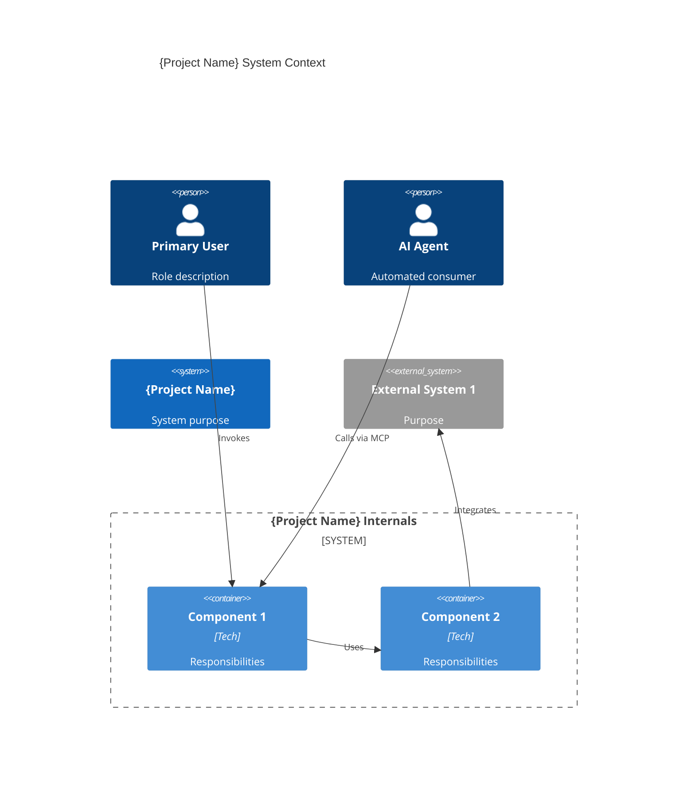
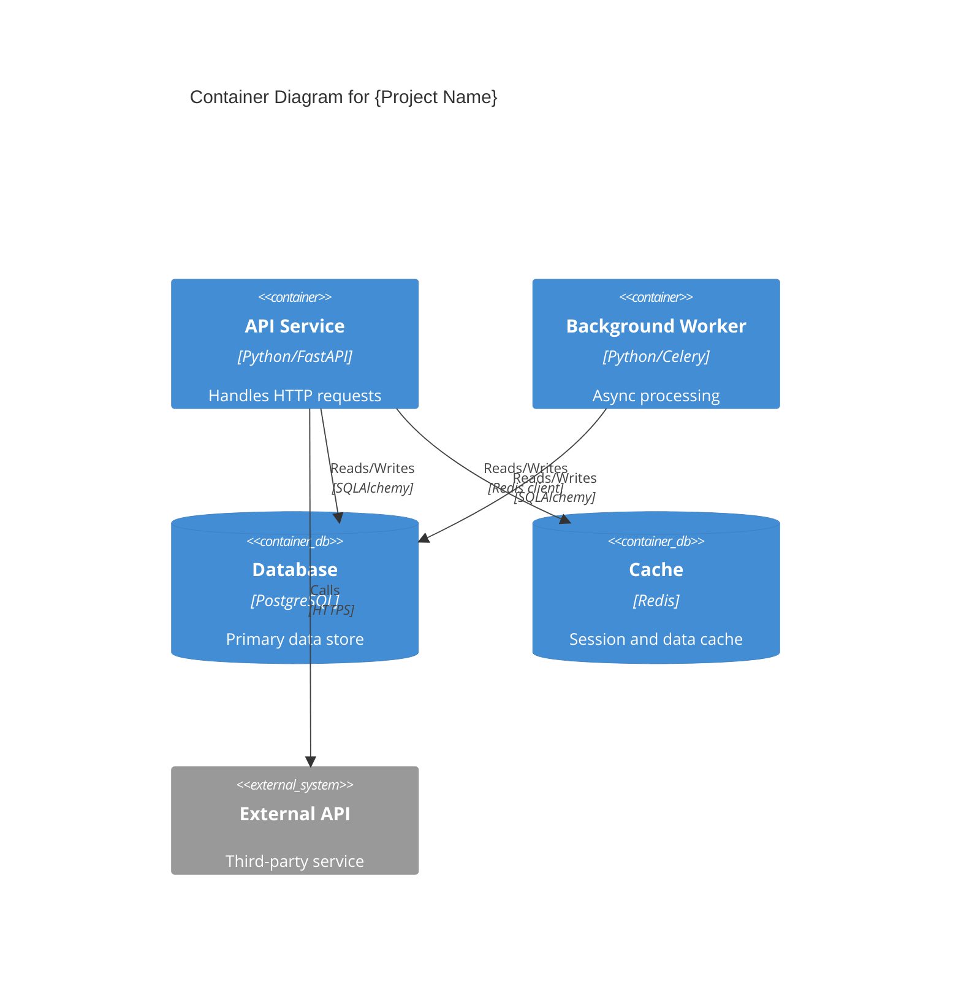

# /system-arch - System Architecture Definition Command

Defines system-level architecture decisions before any feature work begins. This is the first command in the upstream pipeline: `/system-arch` (architecture) → `/system-design` (API contracts) → `/system-plan` (planning) → `/feature-spec` (specification).

The command instructs Claude directly (Pattern A: command-spec-only) through a structured interactive session that captures domain structure, technology choices, and cross-cutting concerns, then generates C4 diagrams, ADRs, and architecture documentation.

## Command Syntax

```bash
/system-arch "project description" [--mode=MODE] [--focus=FOCUS] [--no-questions] [--defaults] [--context path/to/file.md]
```

## Available Flags

| Flag | Description |
|------|-------------|
| `--mode=MODE` | Override auto-detected mode: `setup`, `refine` |
| `--focus=FOCUS` | Narrow session scope to a specific category: `domain`, `structure`, `technology`, `api`, `crosscutting`, `constraints`, `all` |
| `--no-questions` | Skip interactive clarification (error — /system-arch requires interactive input) |
| `--defaults` | Use default answers without prompting |
| `--context path/to/file.md` | Include additional context files (can be used multiple times) |

## Mode Auto-Detection

The command automatically detects the appropriate mode based on existing architecture context in Graphiti:

| Graphiti State | Detected Mode | Purpose |
|----------------|---------------|---------|
| No architecture context | `setup` | First-time architecture definition |
| Architecture exists | `refine` | Update existing architecture decisions |

**Transparent Display**: The command always shows which mode was selected and why.

**Graceful Degradation**: If Graphiti is unavailable, defaults to `setup` mode without persistence.

**Check Graphiti availability** (see `docs/internals/commands-lib/graphiti-preamble.md` Tier 1):
Use the Read tool to read `.guardkit/graphiti.yaml`. If the file exists and `enabled: true`, set `graphiti_available = true`. Otherwise set `graphiti_available = false` and display the unavailability warning — continue without persistence.

**Auto-detect mode via local file existence:**
Use the Glob tool to check whether `docs/architecture/` contains `.md` files:
- IF matching files found: `detected_mode = "refine"`
- ELSE: `detected_mode = "setup"`

Apply user `--mode` override if provided.

## Execution Flow

### Phase 0: Context Loading

**Load existing architecture context and validate prerequisites:**

**Check Graphiti availability** (see `docs/internals/commands-lib/graphiti-preamble.md` Tier 1):
Use the Read tool to read `.guardkit/graphiti.yaml`. If `enabled: true`, set `graphiti_available = true`. Otherwise set `graphiti_available = false` and display the unavailability warning — continue without persistence.

**Detect mode via local file existence:**
Use the Glob tool to check whether `docs/architecture/*.md` files exist.
- IF files found: `detected_mode = "refine"`
- ELSE: `detected_mode = "setup"`

Apply user `--mode` override if provided. Display the detected mode:
- `"Mode: setup (no existing architecture context found)"`
- `"Mode: refine (updating existing architecture)"`

**Load additional context files (if `--context` provided):**
Use the Read tool to load each specified context file and incorporate the content into the session context.

### Phase 1: Interactive Session — 6-Category Question Flow

The interactive session walks through 6 structured categories. After each category, the user sees a checkpoint: `[C]ontinue / [R]evise / [S]kip / [A]DR?`

All captured entities are upserted to Graphiti immediately after each category checkpoint (not batched).

#### Category 1: Domain & Structural Pattern

Capture the system's purpose, users, and structural pattern choice. Trade-offs are surfaced for each pattern option to support informed decisions.

**Questions:**

- Q1. What does this system do? (purpose/problem being solved)
- Q2. Who are the primary users? (human users, agents, other systems)
- Q3. What are the core business domains?
- Q4. What structural pattern best fits this project?

**Structural Pattern Selection (with trade-offs):**

```
Q4. What structural pattern best fits this project?

    [M]odular Monolith
        + Simple deployment, shared database, easy refactoring
        - Tight coupling risk, scaling limitations
    [L]ayered Architecture
        + Clear separation of concerns, well-understood
        - Can lead to rigid hierarchy, cross-layer coupling
    [D]omain-Driven Design
        + Bounded contexts, rich domain model, strategic design
        - Higher upfront complexity, requires domain expertise
    [E]vent-Driven Architecture
        + Loose coupling, scalability, temporal decoupling
        - Eventual consistency complexity, debugging difficulty
    [C]lean / Hexagonal
        + Testable, framework-independent, flexible
        - More abstractions, steeper learning curve
    [N]ot sure — Let questions guide the choice

Your choice [M/L/D/E/C/N]:
```

**Checkpoint after Category 1:**

```
━━━━━━━━━━━━━━━━━━━━━━━━━━━━━━━━━━━━━━━
 Category 1: Domain & Structural Pattern
━━━━━━━━━━━━━━━━━━━━━━━━━━━━━━━━━━━━━━━

Captured:
  - Purpose: [captured purpose]
  - Users: [captured users]
  - Domains: [captured domains]
  - Structural Pattern: [selected pattern] — [rationale]

[C]ontinue to next category | [R]evise this category | [S]kip remaining | [A]DR?

Your choice [C/R/S/A]:
```

**Graphiti Persistence (after checkpoint):**

If `graphiti_available` is true, run the Tier 2 connectivity check from `docs/internals/commands-lib/graphiti-preamble.md`, then seed the captured domain context:

```bash
guardkit graphiti add-context docs/architecture/domain-model.md \
  --group project_architecture
```

Each pattern selection is automatically recorded as an ADR (using `ADR-ARCH-NNN` prefix).

#### Category 2: Bounded Contexts / Module Structure

Capture the system's internal structure. Questions adapt based on the structural pattern selected in Category 1.

**Base Questions:**

- Q5. What are the major modules/components of the system?
- Q6. What are the responsibilities of each module?
- Q7. What data does each module own?

**DDD-Specific Questions (only when pattern = DDD):**

- Q5d. How do modules map to bounded contexts?
- Q6d. What are the aggregate roots in each context?
- Q7d. Are there shared kernels or anti-corruption layers needed?
- Q8d. What domain events flow between contexts?

**Event-Driven-Specific Questions (when pattern = Event-Driven or DDD):**

- Q5e. What event streams exist?
- Q6e. What are the event handlers/processors?
- Q7e. How is eventual consistency managed?

**Checkpoint after Category 2:**

```
━━━━━━━━━━━━━━━━━━━━━━━━━━━━━━━━━━━━━━━
 Category 2: Bounded Contexts / Module Structure
━━━━━━━━━━━━━━━━━━━━━━━━━━━━━━━━━━━━━━━

Captured 4 bounded contexts:
  - Attorney Management — donor, attorney, aggregate: Donor
  - Document Generation — LPA forms, aggregate: LPADocument
  - Financial Oversight — accounts, transactions, aggregate: Account
  - Compliance — OPG registration, identity verification

Domain events: DonorCreated, LPAFiled, TransactionFlagged

[C]ontinue | [R]evise | [S]kip | [A]DR?
```

**Graphiti Persistence:**

If `graphiti_available` is true, run the Tier 2 connectivity check from `docs/internals/commands-lib/graphiti-preamble.md`, then seed the captured components context:

```bash
guardkit graphiti add-context docs/architecture/domain-model.md \
  --group project_architecture
```

#### Category 3: Technology & Infrastructure

Capture technology stack decisions, infrastructure choices, and deployment strategy.

**Questions:**

- Q8. What programming language(s) and frameworks?
- Q9. What database(s) and data stores?
- Q10. What deployment model? (monolith, containers, serverless, hybrid)
- Q11. What CI/CD pipeline?
- Q12. What external services/integrations?

**Each technology decision is recorded as an ADR with rationale and alternatives considered.**

**Checkpoint after Category 3:**

```
━━━━━━━━━━━━━━━━━━━━━━━━━━━━━━━━━━━━━━━
 Category 3: Technology & Infrastructure
━━━━━━━━━━━━━━━━━━━━━━━━━━━━━━━━━━━━━━━

Captured:
  - Language: Python 3.12 (FastAPI, Click)
  - Database: PostgreSQL 16 (primary), Redis (cache)
  - Deployment: Docker containers on AWS ECS
  - CI/CD: GitHub Actions
  - External: Moneyhub API, GOV.UK Verify, OPG Registry

ADRs captured:
  - ADR-ARCH-001: Use Python/FastAPI for API layer
  - ADR-ARCH-002: PostgreSQL as primary data store

[C]ontinue | [R]evise | [S]kip | [A]DR?
```

#### Category 4: Multi-Consumer API Strategy

Capture how the system serves different consumer types. This is critical for systems that serve web clients, AI agents, and internal flows simultaneously.

**Questions:**

- Q13. What types of consumers will access this system? (web clients, mobile apps, agents, internal services, CLI tools)
- Q14. What API protocols are needed per consumer type?
- Q15. Are there different data shapes or access patterns per consumer?
- Q16. How should authentication/authorization differ per consumer type?

**Consumer Type Mapping:**

| Consumer Type | Typical Protocol | Example |
|---------------|------------------|---------|
| Web clients | REST / GraphQL | Browser SPA, server-rendered pages |
| Mobile apps | REST / gRPC | iOS, Android native apps |
| AI Agents | MCP tools, A2A tasks, function calling | LangGraph agents, Claude tools |
| Internal flows | Event bus, gRPC, direct call | Service-to-service, CQRS commands |
| CLI tools | CLI arguments, stdin/stdout | Developer tools, scripts |

**Checkpoint after Category 4:**

```
━━━━━━━━━━━━━━━━━━━━━━━━━━━━━━━━━━━━━━━
 Category 4: Multi-Consumer API Strategy
━━━━━━━━━━━━━━━━━━━━━━━━━━━━━━━━━━━━━━━

Consumer surfaces:
  - Web clients: REST API (OpenAPI 3.x)
  - Agents: MCP tool definitions
  - Internal flows: Domain event bus

[C]ontinue | [R]evise | [S]kip | [A]DR?
```

#### Category 5: Cross-Cutting Concerns

Capture shared concerns that span multiple modules/contexts.

**Questions:**

- Q17. What authentication/authorization approach? (JWT, OAuth2, API keys, session-based)
- Q18. What logging/observability strategy? (structured logging, tracing, metrics)
- Q19. What error handling patterns? (error codes, exception hierarchy, retry policies)
- Q20. What data validation approach? (schema validation, domain validation, input sanitisation)
- Q21. Any other cross-cutting concerns? (caching, rate limiting, feature flags)

**Checkpoint after Category 5:**

```
━━━━━━━━━━━━━━━━━━━━━━━━━━━━━━━━━━━━━━━
 Category 5: Cross-Cutting Concerns
━━━━━━━━━━━━━━━━━━━━━━━━━━━━━━━━━━━━━━━

Captured 4 concerns:
  - Authentication — JWT with OAuth2 (affects: all API surfaces)
  - Logging — Structured JSON logging (affects: all components)
  - Error Handling — Domain exception hierarchy (affects: all contexts)
  - Input Validation — Pydantic models at boundaries (affects: API layer)

[C]ontinue | [R]evise | [S]kip | [A]DR?
```

**Graphiti Persistence:**

If `graphiti_available` is true, run the Tier 2 connectivity check from `docs/internals/commands-lib/graphiti-preamble.md`, then seed the captured cross-cutting concerns:

```bash
guardkit graphiti add-context docs/architecture/ARCHITECTURE.md \
  --group project_architecture
```

#### Category 6: Constraints & NFRs

Capture non-functional requirements, constraints, and quality attributes.

**Questions:**

- Q22. What performance requirements? (response time, throughput, concurrency)
- Q23. What scalability requirements? (horizontal, vertical, data volume)
- Q24. What compliance/regulatory constraints? (GDPR, SOC2, HIPAA)
- Q25. What availability/SLA requirements? (uptime, recovery time)
- Q26. What security constraints beyond authentication? (encryption, data residency)
- Q27. Any budget or timeline constraints affecting architecture?

**Checkpoint after Category 6:**

```
━━━━━━━━━━━━━━━━━━━━━━━━━━━━━━━━━━━━━━━
 Category 6: Constraints & NFRs
━━━━━━━━━━━━━━━━━━━━━━━━━━━━━━━━━━━━━━━

Captured:
  - Performance: <200ms API response, 1000 req/s
  - Scalability: Horizontal via container orchestration
  - Compliance: GDPR (UK), data residency: EU
  - Availability: 99.9% uptime SLA
  - Security: TLS everywhere, encryption at rest

[C]ontinue | [R]evise | [S]kip | [A]DR?
```

### Phase 2: C4 Diagram Generation (Mandatory Review Gate)

After completing the interactive session, generate mandatory C4 diagrams. These are the primary review artefact — the prose supports them, not the other way around.

**CRITICAL**: Diagrams require explicit user approval before proceeding to output generation. The user must not be able to skip this review gate.

#### C4 Level 1: System Context Diagram

Generate using the existing `system-context.md.j2` template. Shows the system boundary, actors, and external integrations.



_Look for: read/write asymmetries, components with only inbound or only outbound arrows, missing connections between components that should communicate._

**Diagram Review Gate:**

```
━━━━━━━━━━━━━━━━━━━━━━━━━━━━━━━━━━━━━━━
 C4 CONTEXT DIAGRAM REVIEW
━━━━━━━━━━━━━━━━━━━━━━━━━━━━━━━━━━━━━━━

[Mermaid diagram displayed above]

Does this diagram accurately represent your system context?

[A]pprove — Diagram is correct, proceed
[R]evise — I need to make changes
[C]ancel — Stop and discard

Your choice [A/R/C]:
```

If the user does not approve, return to the relevant category to revise.

#### C4 Level 2: Container Diagram

Generate using the `container.md.j2` template. Shows internal containers, their technologies, and relationships.



_Look for: containers without connections, database containers accessed by too many services, missing async communication paths._

**Diagram Review Gate:**

```
━━━━━━━━━━━━━━━━━━━━━━━━━━━━━━━━━━━━━━━
 C4 CONTAINER DIAGRAM REVIEW
━━━━━━━━━━━━━━━━━━━━━━━━━━━━━━━━━━━━━━━

[Mermaid diagram displayed above]

Does this diagram accurately represent your containers and relationships?

[A]pprove — Diagram is correct, proceed
[R]evise — I need to make changes
[C]ancel — Stop and discard

Your choice [A/R/C]:
```

**Diagram Splitting Rule**: If either diagram exceeds 30 nodes (containers, actors, external systems combined), warn the user and suggest splitting into sub-diagrams with clear cross-references.

```
WARNING: This diagram has 35 nodes (exceeds 30-node threshold).
Large diagrams are difficult to read and review.

Suggested split:
  - Sub-diagram 1: Core Domain (15 nodes)
  - Sub-diagram 2: Infrastructure & External (20 nodes)

[S]plit into sub-diagrams | [K]eep as single diagram

Your choice [S/K]:
```

**Format rules for all diagrams:**
- Use Mermaid fenced code blocks (` ```mermaid `)
- Keep diagrams under 30 nodes (split into sub-diagrams if larger)
- Use colour coding: green for healthy paths, yellow for new/changed, red for broken/missing
- Add a one-line caption below each diagram explaining what to look for
- Generate diagrams from the actual captured architecture data, not placeholder content

### Phase 3: Output Generation

Generate all mandatory output artefacts in `docs/architecture/`:

#### Mandatory Output Artefacts

| Artefact | Path | Description |
|----------|------|-------------|
| Domain Model | `docs/architecture/domain-model.md` | Domain entities, relationships, bounded contexts |
| ADRs | `docs/architecture/decisions/ADR-ARCH-NNN-{slug}.md` | One per architecture decision (uses `ADR-ARCH-NNN` prefix) |
| C4 Context Diagram | `docs/architecture/system-context.md` | C4 Level 1 diagram (Mermaid) via `system-context.md.j2` |
| C4 Container Diagram | `docs/architecture/container.md` | C4 Level 2 diagram (Mermaid) via `container.md.j2` |
| Assumptions Manifest | `docs/architecture/assumptions.yaml` | All assumptions made during the session (YAML) |
| Architecture Summary | `docs/architecture/ARCHITECTURE.md` | Index + summary for `/system-plan` consumption |

**ADR Numbering**: Scan `docs/architecture/decisions/` for existing ADR files to determine the next available number. New ADRs use the `ADR-ARCH-NNN` prefix and continue from the highest existing number.

Use the Glob tool to list `docs/architecture/decisions/ADR-ARCH-*.md`. Extract the highest NNN from filenames — new ADRs use NNN+1. If no files exist, start at 001.

**Architecture Summary Output (`ARCHITECTURE.md`):**

```
━━━━━━━━━━━━━━━━━━━━━━━━━━━━━━━━━━━━━━━
 ARCHITECTURE DOCUMENTATION CREATED
━━━━━━━━━━━━━━━━━━━━━━━━━━━━━━━━━━━━━━━

Created: docs/architecture/
  ├── ARCHITECTURE.md (index + summary)
  ├── domain-model.md
  ├── system-context.md (C4 Level 1)
  ├── container.md (C4 Level 2)
  ├── assumptions.yaml
  └── decisions/
      ├── ADR-ARCH-001-{slug}.md
      ├── ADR-ARCH-002-{slug}.md
      └── ...
```

**Assumptions Manifest (YAML format):**

```yaml
# Architecture Assumptions
# Generated by /system-arch on YYYY-MM-DD
# Review and validate these assumptions before implementation

assumptions:
  - id: ASSUM-001
    category: domain
    description: "Each bounded context has its own data store"
    confidence: high
    source: interactive_session
    related_adr: ADR-ARCH-001

  - id: ASSUM-002
    category: technology
    description: "PostgreSQL supports required query patterns"
    confidence: medium
    source: interactive_session
    related_adr: ADR-ARCH-003
```

### Phase 4: Graphiti Seeding

Seed all artefacts into Graphiti knowledge graph for downstream command consumption.

**Group Assignments:**

| Entity Type | Graphiti Group |
|-------------|---------------|
| System context, components, bounded contexts | `project_architecture` |
| ADRs | `architecture_decisions` |
| Technology decisions | `project_decisions` |
| Cross-cutting concerns | `project_architecture` |
| Assumptions | `project_architecture` |

If `graphiti_available` is true, run the Tier 2 connectivity check from `docs/internals/commands-lib/graphiti-preamble.md`, then generate and offer the following seeding commands:

```bash
# Bounded contexts, components, cross-cutting concerns, assumptions → project_architecture
guardkit graphiti add-context docs/architecture/domain-model.md \
  --group project_architecture

guardkit graphiti add-context docs/architecture/ARCHITECTURE.md \
  --group project_architecture

# ADRs → architecture_decisions
guardkit graphiti add-context docs/architecture/decisions/ \
  --group architecture_decisions

# Technology decisions (Category 3 ADRs) → project_decisions
# Note: technology-specific ADRs (language, framework, database choices)
# may also be seeded separately to the project_decisions group
```

Ask the user: "Run these seeding commands now? [Y/n]". If yes, execute each via the Bash tool.

Display a summary after seeding completes (use Glob to count files created in `docs/architecture/`).

**Security — ADR Sanitisation:**

The `guardkit graphiti add-context` CLI handles sanitisation of free-text content internally before seeding. No manual pre-processing is required. When constructing ADR content during the interactive session, avoid embedding raw user input verbatim in rationale fields — paraphrase or summarise instead.

### Phase 5: Refine Mode Flow

When architecture context already exists in Graphiti, the command enters refine mode.

```
Mode: refine (existing architecture found)

Current architecture summary:
  - Pattern: DDD
  - 4 bounded contexts
  - 7 ADRs (3 accepted, 2 superseded, 2 proposed)
  - 3 external integrations

━━━━━━━━━━━━━━━━━━━━━━━━━━━━━━━━━━━━━━━
 REFINEMENT SCOPE
━━━━━━━━━━━━━━━━━━━━━━━━━━━━━━━━━━━━━━━

What would you like to refine?

[D]omain — Update domain model and bounded contexts
[T]echnology — Update technology stack decisions
[A]PI — Update multi-consumer API strategy
[X]rosscutting — Modify shared concerns
[C]onstraints — Update NFRs and constraints
[F]ull — Re-run all 6 categories

Your choice:
```

**Targeted refinement:**
- Show current state for selected area
- Ask what's changed conversationally (not full questionnaire)
- Update Graphiti entities
- Regenerate affected markdown files and C4 diagrams

## Error Handling

### No Description Provided

```python
if not description or not description.strip():
    print("━━━━━━━━━━━━━━━━━━━━━━━━━━━━━━━━━━━━━━━")
    print("ERROR: Project description is required")
    print("━━━━━━━━━━━━━━━━━━━━━━━━━━━━━━━━━━━━━━━")
    print()
    print("Usage: /system-arch \"project description\"")
    print()
    print("Examples:")
    print('  /system-arch "E-commerce platform for handmade goods"')
    print('  /system-arch "Internal HR management system"')
    print('  /system-arch "CLI tool for task workflow management"')
    exit(1)
```

### Graphiti Unavailable

Display the standard unavailability warning from `docs/internals/commands-lib/graphiti-preamble.md`:

```
⚠️  Graphiti unavailable — continuing without knowledge graph context.
    Reason: {error from graphiti-check, or "Config disabled / file not found"}

    To enable: ensure .guardkit/graphiti.yaml has `enabled: true` and
    FalkorDB is reachable at the configured host.
```

Then display:

```
Architecture definition will continue WITHOUT persistence.
Markdown artefacts will still be generated, but context won't be
queryable by /system-plan, /system-design, or /feature-spec.

Continue without persistence? [Y/n]:
```

If the user answers `n`, display "Cancelled." and stop. Otherwise continue with the session (markdown artefacts are still generated).

### Empty Answers

```python
answer = input("Q1. What does this system do? ")
if not answer or answer.strip() == "":
    print("WARNING: Empty answer - using placeholder")
    answer = "[To be defined]"
```

### Invalid Structural Pattern Choice

```python
valid_patterns = {"m": "modular", "l": "layered", "d": "ddd", "e": "event_driven", "c": "clean", "n": "undecided"}

while True:
    choice = input("Your choice [M/L/D/E/C/N]: ").lower()
    if choice in valid_patterns:
        break
    print("━━━━━━━━━━━━━━━━━━━━━━━━━━━━━━━━━━━━━━━")
    print(f"Unrecognised option: '{choice}'")
    print("━━━━━━━━━━━━━━━━━━━━━━━━━━━━━━━━━━━━━━━")
    print()
    print("Valid choices:")
    print("  [M] Modular Monolith")
    print("  [L] Layered Architecture")
    print("  [D] Domain-Driven Design")
    print("  [E] Event-Driven Architecture")
    print("  [C] Clean / Hexagonal")
    print("  [N] Not sure")
    print()
```

### Cancelled / Partial Session

```python
checkpoint_choice = input("Your choice [C/R/S/A]: ")

if checkpoint_choice.lower() == "s":
    print("━━━━━━━━━━━━━━━━━━━━━━━━━━━━━━━━━━━━━━━")
    print("Session cancelled (remaining categories skipped)")
    print("━━━━━━━━━━━━━━━━━━━━━━━━━━━━━━━━━━━━━━━")
    print()
    print("Partial architecture captured:")
    print(f"  - Completed: {completed_count} categories")
    print(f"  - Skipped: {6 - completed_count} categories")
    print()
    print("Generated files reflect partial architecture only.")
    print("Run /system-arch again to complete the remaining categories.")
    # Persist what we have and generate partial artefacts
    break
```

### Graphiti Connection Drop Mid-Session

If a `guardkit graphiti add-context` seeding command fails during the session, display:

```
WARNING: Graphiti seeding failed for this category.
Remaining categories will be captured in markdown artefacts only.
Re-seed unpersisted artefacts when Graphiti is restored.
```

Set `graphiti_available = false` and continue the interactive session without further seeding attempts. All markdown artefacts are still generated regardless.

### --no-questions Flag

```python
if flags.get("no_questions"):
    print("━━━━━━━━━━━━━━━━━━━━━━━━━━━━━━━━━━━━━━━")
    print("ERROR: /system-arch requires interactive input")
    print("━━━━━━━━━━━━━━━━━━━━━━━━━━━━━━━━━━━━━━━")
    print()
    print("The --no-questions flag is not supported for /system-arch.")
    print("Architecture decisions require human input and review.")
    exit(1)
```

## ADR Inline Capture

At any checkpoint, if the user chooses `[A]DR?`, capture an ADR inline:

```
━━━━━━━━━━━━━━━━━━━━━━━━━━━━━━━━━━━━━━━
 ARCHITECTURE DECISION RECORD
━━━━━━━━━━━━━━━━━━━━━━━━━━━━━━━━━━━━━━━

Title: [Ask user for title]
Context: [Ask user for context — what problem or choice prompted this decision?]
Decision: [Ask user for decision — what was decided?]
Alternatives Considered: [Ask user — what alternatives were rejected and why?]
Consequences: [Ask user — can list multiple positive/negative consequences]
Status: [A]ccepted / [P]roposed / [D]eprecated / [S]uperseded

━━━━━━━━━━━━━━━━━━━━━━━━━━━━━━━━━━━━━━━
 ADR-ARCH-{NNN} captured. Continuing...
━━━━━━━━━━━━━━━━━━━━━━━━━━━━━━━━━━━━━━━
```

**ADR file written to:** `docs/architecture/decisions/ADR-ARCH-{NNN}-{slug}.md` using the `adr.md.j2` template.

**Sanitisation**: ADR rationale and free-text fields are sanitised before Graphiti seeding to prevent injection (see Security section above).

## Examples

### Example 1: New Project (Setup Mode)

```bash
/system-arch "Power of Attorney management platform"

Mode: setup (no existing architecture context found)

━━━━━━━━━━━━━━━━━━━━━━━━━━━━━━━━━━━━━━━
 SYSTEM ARCHITECTURE: Power of Attorney management platform
━━━━━━━━━━━━━━━━━━━━━━━━━━━━━━━━━━━━━━━

Category 1: Domain & Structural Pattern
  Q1. What does this system do?
      > Manages power of attorney registrations, attorney assignments, and compliance

  Q2. Who are the primary users?
      > Solicitors, attorneys, OPG case workers, compliance officers

  Q3. What are the core business domains?
      > Attorney management, document generation, financial oversight, compliance

  Q4. What structural pattern best fits this project?
      > D (DDD)

━━━━━━━━━━━━━━━━━━━━━━━━━━━━━━━━━━━━━━━
 Category 1: Domain & Structural Pattern
━━━━━━━━━━━━━━━━━━━━━━━━━━━━━━━━━━━━━━━

Captured:
  - Purpose: Power of attorney registration and compliance
  - Users: Solicitors, attorneys, OPG case workers
  - Domains: Attorney management, document generation, financial oversight, compliance
  - Pattern: DDD — bounded contexts with rich domain models

ADR captured automatically:
  - ADR-ARCH-001: Use Domain-Driven Design structural pattern

[C]ontinue | [R]evise | [S]kip | [A]DR?
> C

[... continues through Categories 2-6 ...]

━━━━━━━━━━━━━━━━━━━━━━━━━━━━━━━━━━━━━━━
 C4 CONTEXT DIAGRAM REVIEW
━━━━━━━━━━━━━━━━━━━━━━━━━━━━━━━━━━━━━━━

[Mermaid C4 Context diagram]

[A]pprove | [R]evise | [C]ancel
> A

━━━━━━━━━━━━━━━━━━━━━━━━━━━━━━━━━━━━━━━
 C4 CONTAINER DIAGRAM REVIEW
━━━━━━━━━━━━━━━━━━━━━━━━━━━━━━━━━━━━━━━

[Mermaid C4 Container diagram]

[A]pprove | [R]evise | [C]ancel
> A

━━━━━━━━━━━━━━━━━━━━━━━━━━━━━━━━━━━━━━━
 ARCHITECTURE DOCUMENTATION CREATED
━━━━━━━━━━━━━━━━━━━━━━━━━━━━━━━━━━━━━━━

Created: docs/architecture/
  ├── ARCHITECTURE.md
  ├── domain-model.md
  ├── system-context.md (C4 Level 1)
  ├── container.md (C4 Level 2)
  ├── assumptions.yaml
  └── decisions/
      ├── ADR-ARCH-001-ddd-structural-pattern.md
      ├── ADR-ARCH-002-postgresql-data-store.md
      └── ADR-ARCH-003-fastapi-framework.md

Graphiti context:
  4 bounded contexts persisted
  4 cross-cutting concerns persisted
  3 ADRs persisted
  1 system context persisted

Next steps:
  1. Review: docs/architecture/ARCHITECTURE.md
  2. Design APIs: /system-design "Power of Attorney management platform"
  3. Plan features: /system-plan "feature description"
```

### Example 2: Minimal Single-Module Project

```bash
/system-arch "CLI tool for file encryption"

Mode: setup (no existing architecture context found)

[... Category 1-6 with minimal answers ...]

━━━━━━━━━━━━━━━━━━━━━━━━━━━━━━━━━━━━━━━
 ARCHITECTURE DOCUMENTATION CREATED
━━━━━━━━━━━━━━━━━━━━━━━━━━━━━━━━━━━━━━━

Created: docs/architecture/
  ├── ARCHITECTURE.md
  ├── domain-model.md
  ├── system-context.md (C4 Level 1 — single system, user actors only)
  ├── container.md (C4 Level 2 — one container)
  ├── assumptions.yaml
  └── decisions/
      └── ADR-ARCH-001-modular-monolith.md

Graphiti context:
  1 module persisted
  1 ADR persisted
  1 system context persisted
```

### Example 3: Refine Mode

```bash
/system-arch "Power of Attorney platform"

Mode: refine (existing architecture found)

Current architecture summary:
  - Pattern: DDD
  - 4 bounded contexts
  - 3 ADRs (all accepted)
  - 3 external integrations

What would you like to refine?
  [D]omain | [T]echnology | [A]PI | [X]rosscutting | [C]onstraints | [F]ull
> D

[... targeted domain refinement conversation ...]

Updated: docs/architecture/domain-model.md
Updated: docs/architecture/system-context.md (new context added)
New: docs/architecture/decisions/ADR-ARCH-004-new-notification-context.md

Graphiti: 1 bounded context added, 1 ADR persisted
```

---

## CRITICAL EXECUTION INSTRUCTIONS FOR CLAUDE

**IMPORTANT: YOU MUST FOLLOW THESE STEPS EXACTLY. THIS IS AN INTERACTIVE ORCHESTRATION COMMAND.**

When the user runs `/system-arch "description"`, you MUST execute these steps in order:

### Step 1: Parse Arguments

```python
# Extract description and flags
description = args[0]  # Required — error if missing
mode = flags.get("mode", None)  # Auto-detect if not specified
focus = flags.get("focus", "all")
no_questions = flags.get("no_questions", False)
defaults = flags.get("defaults", False)
context_files = flags.get("context", [])

# Validate description
if not description or not description.strip():
    print("ERROR: Project description is required")
    print("Usage: /system-arch \"project description\"")
    exit(1)

# Reject --no-questions
if no_questions:
    print("ERROR: /system-arch requires interactive input")
    exit(1)
```

### Step 2: Check Graphiti Availability

Follow the Tier 1 check from `docs/internals/commands-lib/graphiti-preamble.md`:
Use the Read tool to read `.guardkit/graphiti.yaml`.
- IF the file exists and `enabled: true`: set `graphiti_available = true`
- ELSE: set `graphiti_available = false`, display the unavailability warning, and ask:

```
Architecture definition will continue WITHOUT persistence.
Markdown artefacts will still be generated.

Continue without persistence? [Y/n]:
```

If the user answers `n`, stop. Otherwise continue.

### Step 3: Auto-Detect Mode

If `--mode` was not provided, detect mode via local file existence:
Use the Glob tool to check for files matching `docs/architecture/*.md`.
- IF matching files found: `mode = "refine"`
- ELSE: `mode = "setup"`

Display the detected mode:
- `"Mode: setup (no existing architecture context found)"`
- `"Mode: refine (updating existing architecture)"`

### Step 4: Execute Interactive Session

**If mode == "setup":**

Walk through all 6 categories in order:

1. **Category 1: Domain & Structural Pattern** — Ask Q1-Q4, show checkpoint
2. **Category 2: Bounded Contexts / Module Structure** — Adapt questions to pattern, show checkpoint
3. **Category 3: Technology & Infrastructure** — Ask Q8-Q12, show checkpoint
4. **Category 4: Multi-Consumer API Strategy** — Ask Q13-Q16, show checkpoint
5. **Category 5: Cross-Cutting Concerns** — Ask Q17-Q21, show checkpoint
6. **Category 6: Constraints & NFRs** — Ask Q22-Q27, show checkpoint

After each category:
- Display what was captured
- Show checkpoint: `[C]ontinue / [R]evise / [S]kip / [A]DR?`
- If `[A]DR?`: Capture ADR inline, sanitise rationale, persist to Graphiti
- If `[R]evise`: Re-ask the category questions
- If `[S]kip`: Break out of the loop, persist completed categories, inform about skipped ones
- If `[C]ontinue`: Upsert entities to Graphiti, move to next category

**If mode == "refine":**

Show current architecture summary. Ask which area to refine. Run targeted conversational refinement (not full questionnaire). Update Graphiti and regenerate affected files.

### Step 5: Generate C4 Diagrams (Mandatory Review Gate)

1. Generate C4 Level 1 (System Context) using `system-context.md.j2`
2. Present diagram for explicit user approval — **do not proceed without approval**
3. Generate C4 Level 2 (Container) using `container.md.j2`
4. Present diagram for explicit user approval — **do not proceed without approval**
5. If either diagram exceeds 30 nodes, warn and suggest split

### Step 6: Generate Output Artefacts

Use the Write tool to create all mandatory artefacts under `docs/architecture/`:

- `docs/architecture/domain-model.md` — domain entities, bounded contexts, relationships
- `docs/architecture/system-context.md` — C4 Level 1 Mermaid diagram (from `system-context.md.j2` template)
- `docs/architecture/container.md` — C4 Level 2 Mermaid diagram (from `container.md.j2` template)
- `docs/architecture/assumptions.yaml` — all assumptions captured during the session
- `docs/architecture/ARCHITECTURE.md` — index and summary for downstream commands
- `docs/architecture/decisions/ADR-ARCH-{NNN}-{slug}.md` — one file per ADR captured

Use the Glob tool to scan `docs/architecture/decisions/ADR-ARCH-*.md` to determine the next available ADR number before writing new ADRs.

### Step 7: Seed to Graphiti

If `graphiti_available` is true, run the Tier 2 connectivity check from `docs/internals/commands-lib/graphiti-preamble.md`, then generate and offer the seeding commands:

```bash
# Bounded contexts, components, cross-cutting concerns → project_architecture
guardkit graphiti add-context docs/architecture/domain-model.md \
  --group project_architecture

guardkit graphiti add-context docs/architecture/ARCHITECTURE.md \
  --group project_architecture

# ADRs and technology decisions → architecture_decisions
guardkit graphiti add-context docs/architecture/decisions/ \
  --group architecture_decisions
```

Ask the user: "Run these seeding commands now? [Y/n]". If yes, execute each via the Bash tool.

If `graphiti_available` is false, display:

```
NOTE: Artefacts NOT seeded to Graphiti (unavailable).
Markdown artefacts still generated in docs/architecture/
```

### Step 8: Display Summary

Display the completion summary:

```
━━━━━━━━━━━━━━━━━━━━━━━━━━━━━━━━━━━━━━━
ARCHITECTURE DOCUMENTATION CREATED
━━━━━━━━━━━━━━━━━━━━━━━━━━━━━━━━━━━━━━━

Created: docs/architecture/
  ├── ARCHITECTURE.md
  ├── domain-model.md
  ├── system-context.md (C4 Level 1)
  ├── container.md (C4 Level 2)
  ├── assumptions.yaml
  └── decisions/
      └── ... {N} ADRs

Next steps:
  1. Review: docs/architecture/ARCHITECTURE.md
  2. Design APIs: /system-design "description"
  3. Plan features: /system-plan "feature description"
```

### What NOT to Do

DO NOT:
- Skip the interactive question flow (this is an interactive command)
- Batch all Graphiti upserts at the end (upsert after each category)
- Skip diagram review gates (user must explicitly approve each diagram)
- Skip checkpoints (user must review each category)
- Proceed without user confirmation at decision points
- Generate code implementations (this is an architecture definition command)
- Skip mode auto-detection (always detect unless overridden)
- Ignore Graphiti unavailability (warn user, offer to continue)
- Allow empty descriptions (error with usage examples)
- Accept invalid pattern choices (re-prompt with valid options)
- Seed unsanitised free-text content to Graphiti

### Example Execution Trace

```
User: /system-arch "CLI task workflow tool"

Claude executes:
  1. Parse arguments → description = "CLI task workflow tool"
  2. Check Graphiti availability → Read .guardkit/graphiti.yaml (Tier 1)
  3. Auto-detect mode → Glob docs/architecture/*.md → none found → "setup"
  4. Display: "Mode: setup"
  5. Category 1: Domain & Structural Pattern → ask Q1-Q4, checkpoint
  6. If graphiti_available: seed domain-model.md → project_architecture
  7. Category 2: Bounded Contexts → adapt to pattern, checkpoint
  8. If graphiti_available: seed domain-model.md → project_architecture
  9. Category 3: Technology & Infrastructure → ask Q8-Q12, checkpoint
  10. If graphiti_available: seed decisions/ → architecture_decisions + project_decisions
  11. Category 4: Multi-Consumer API Strategy → ask Q13-Q16, checkpoint
  12. Category 5: Cross-Cutting Concerns → ask Q17-Q21, checkpoint
  13. If graphiti_available: seed ARCHITECTURE.md → project_architecture
  14. Category 6: Constraints & NFRs → ask Q22-Q27, checkpoint
  15. Generate C4 Context diagram → present for approval
  16. Generate C4 Container diagram → present for approval
  17. Write all output artefacts to docs/architecture/ (Write tool)
  18. Offer seeding commands to Graphiti (Tier 2 check + guardkit graphiti add-context)
  19. Display summary with file locations and next steps
```

Remember: This is an **interactive architecture definition command**. You MUST present questions, wait for user input, show checkpoints with `[C]ontinue / [R]evise / [S]kip / [A]DR?`, and require explicit diagram approval. DO NOT try to answer the questions yourself or auto-complete the flow.
