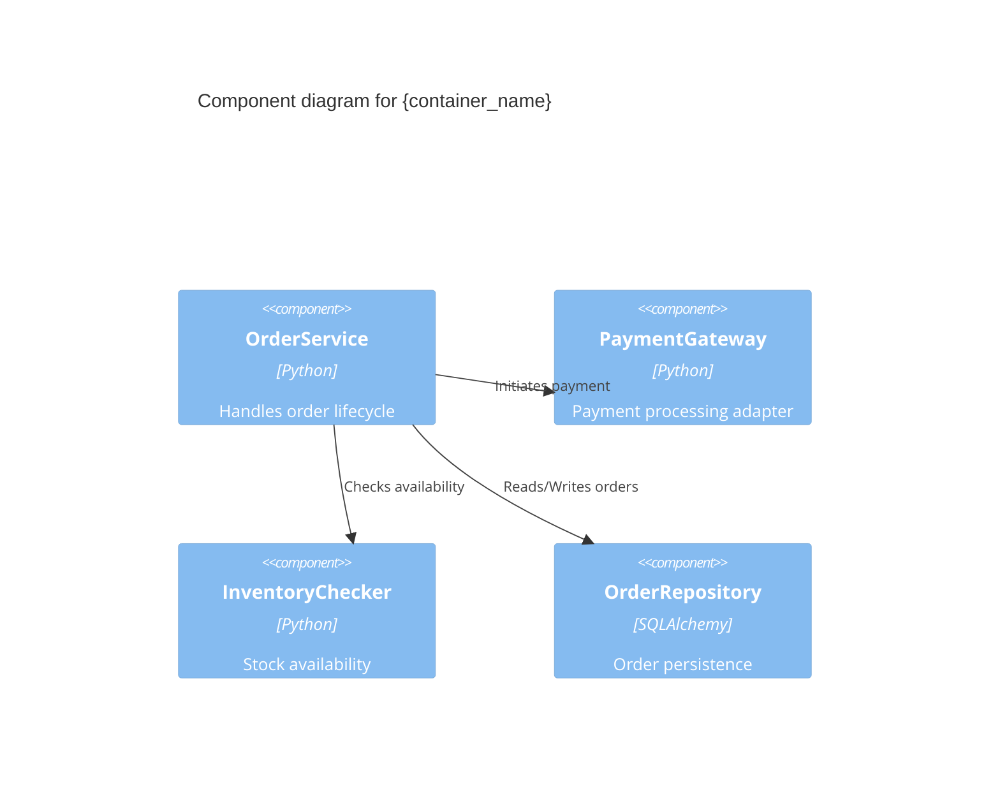

# /system-design - Interactive System Design Command

Designs API contracts, data models, and multi-protocol surfaces per bounded context. This command sits downstream of `/system-arch` in the command pipeline: `/system-arch` (structural decisions) → `/system-design` (detailed design) → `/system-plan` (feature planning). It reads the architecture context seeded by `/system-arch` and produces design artefacts that ground subsequent `/feature-spec` and `/feature-plan` sessions.

## Command Syntax

```bash
/system-design [--focus=CONTEXT] [--protocols=PROTOCOLS] [--no-questions] [--defaults] [--context path/to/file.md]
```

## Available Flags

| Flag | Description |
|------|-------------|
| `--focus=CONTEXT` | Design a specific bounded context only (e.g., `--focus="Order Management"`) |
| `--protocols=PROTOCOLS` | Pre-select protocols (comma-separated): `rest`, `graphql`, `mcp`, `a2a`, `acp` |
| `--no-questions` | Skip interactive clarification (requires `--defaults` or `--protocols`) |
| `--defaults` | Use default protocols (REST for web, MCP for agents) without prompting |
| `--context path/to/file.md` | Include additional context files (can be used multiple times) |

## Overview

`/system-design` is the second command in GuardKit's architecture pipeline. While `/system-arch` establishes *what* the system is (bounded contexts, structural patterns, ADRs), `/system-design` defines *how* each bounded context communicates (API contracts, data models, protocol surfaces).

**Use cases:**
- Design API contracts for each bounded context after `/system-arch` has established the architecture
- Define multi-protocol surfaces (REST/GraphQL for web clients, MCP/A2A for AI agents, events for internal flows)
- Capture data model definitions with entities, relationships, and invariants
- Generate OpenAPI 3.1 specifications for REST/GraphQL APIs
- Generate MCP tool definitions and A2A task schemas for agent consumers
- Produce C4 Level 3 Component diagrams for complex containers
- Record Design Decision Records (DDRs) for design-level choices

**Key differences from `/system-arch`:**
- `/system-arch` → *structural* decisions (bounded contexts, methodology, ADRs)
- `/system-design` → *interface* decisions (API contracts, data models, protocol surfaces)
- `/system-arch` outputs to `docs/architecture/`
- `/system-design` outputs to `docs/design/`

## Prerequisite Gate

Before starting the interactive session, `/system-design` MUST verify that architecture context exists. This ensures the design phase builds on established structural decisions rather than assumptions.

```python
from guardkit.planning.graphiti_arch import SystemPlanGraphiti
from guardkit.planning.graphiti_design import SystemDesignGraphiti
from guardkit.knowledge.graphiti_client import get_graphiti

# Initialize Graphiti client
client = get_graphiti()  # Returns None if Graphiti unavailable

if client:
    arch_sp = SystemPlanGraphiti(client, project_id="current_project")
    has_arch = arch_sp.has_architecture_context()  # Check architecture exists

    if not has_arch:
        print(NO_ARCHITECTURE_CONTEXT_MESSAGE)
        choice = input("Run /system-arch first? [Y/n]: ")
        if choice.lower() != "n":
            # Chain to /system-arch
            print("Launching /system-arch...")
            # Execute /system-arch
            return
        else:
            print("Cannot proceed without architecture context.")
            exit(0)
else:
    # Graphiti unavailable — check for local docs/architecture/ files
    arch_dir = Path("docs/architecture")
    if not arch_dir.exists() or not list(arch_dir.glob("*.md")):
        print(NO_ARCHITECTURE_CONTEXT_MESSAGE)
        exit(0)
    print("⚠️ Graphiti unavailable — reading architecture from local files")
```

## Execution Flow

### Phase 0: Context Loading

**Load existing architecture context from Graphiti (`project_architecture` group):**

```python
from guardkit.planning.graphiti_arch import SystemPlanGraphiti
from guardkit.planning.graphiti_design import SystemDesignGraphiti
from guardkit.knowledge.graphiti_client import get_graphiti

# Initialize clients
client = get_graphiti()

if client:
    arch_sp = SystemPlanGraphiti(client, project_id="current_project")
    design_sp = SystemDesignGraphiti(client, project_id="current_project")

    # Load architecture context
    arch_summary = arch_sp.get_architecture_summary()
    existing_decisions = arch_sp.get_relevant_context_for_topic("ADR decisions constraints", 20)

    # Check for existing design context
    has_design = design_sp.has_design_context()

    # Extract bounded contexts from architecture
    bounded_contexts = extract_bounded_contexts(arch_summary)

    print(f"🏗️ Architecture loaded: {len(bounded_contexts)} bounded contexts")
    if has_design:
        print("🔄 Existing design context found — will update")
    else:
        print("🆕 No existing design context — starting fresh")
else:
    # Graceful degradation: read from local files
    bounded_contexts = extract_bounded_contexts_from_files("docs/architecture/")
    design_sp = None
    print("⚠️ Graphiti unavailable — continuing without persistence")
```

**Load existing ADRs for contradiction detection:**

```python
# Load ADRs from project_decisions group for contradiction checking
if client:
    existing_adrs = arch_sp.get_relevant_context_for_topic(
        "architecture decision ADR constraint", 20
    )
else:
    existing_adrs = []
```

### Phase 1: Per-Bounded-Context Interactive Design

For each bounded context discovered from `/system-arch`, run an interactive design session:

```python
from guardkit.knowledge.entities.design_decision import DesignDecision
from guardkit.knowledge.entities.api_contract import ApiContract
from guardkit.knowledge.entities.data_model import DataModel
from guardkit.planning.design_writer import DesignWriter, scan_next_ddr_number

writer = DesignWriter()
output_dir = Path("docs/design")
all_contracts = []
all_models = []
all_decisions = []
all_components = []  # For C4 L3 diagrams

for bc in bounded_contexts:
    print(f"\n{'━' * 60}")
    print(f"📋 DESIGNING: {bc['name']}")
    print(f"{'━' * 60}")
    print(f"Description: {bc.get('description', '[From /system-arch]')}")
    print(f"Responsibilities: {', '.join(bc.get('responsibilities', []))}")
    print()

    # ── Step 1: API Contract Design ──
    # ── Step 2: Multi-Protocol Surface Design ──
    # ── Step 3: Data Model Design ──
    # ── Step 4: Checkpoint ──
```

#### Step 1: API Contract Design

**Design endpoints, request/response schemas, and authentication per bounded context:**

```
━━━━━━━━━━━━━━━━━━━━━━━━━━━━━━━━━━━━━━━
📡 API CONTRACT: {bounded_context_name}
━━━━━━━━━━━━━━━━━━━━━━━━━━━━━━━━━━━━━━━

Q1. What are the primary operations this context exposes?
    (e.g., CRUD for orders, search for products, workflow for approvals)
    > [User describes operations]

Q2. What are the key request/response schemas?
    (e.g., CreateOrderRequest, OrderResponse, OrderSummary)
    > [User describes schemas]

Q3. What authentication/authorization is required?
    [N]one — Public endpoints
    [T]oken — Bearer token / API key
    [O]Auth — OAuth 2.0 / OIDC
    [C]ustom — Custom auth scheme
    > [User selects]

Q4. What are the main endpoints?
    (Claude helps derive endpoints from operations)

    Proposed endpoints:
      POST   /api/v1/orders          — Create order
      GET    /api/v1/orders/{id}     — Get order by ID
      GET    /api/v1/orders          — List orders (paginated)
      PATCH  /api/v1/orders/{id}     — Update order status
      DELETE /api/v1/orders/{id}     — Cancel order

    [A]ccept | [M]odify | [A]dd more
    > [User reviews]
```

#### Step 2: Multi-Protocol Surface Design

**Design protocol-specific surfaces for different consumer types (REST/GraphQL for web, MCP/A2A for agents, events for internal):**

```
━━━━━━━━━━━━━━━━━━━━━━━━━━━━━━━━━━━━━━━
🔌 PROTOCOL SURFACES: {bounded_context_name}
━━━━━━━━━━━━━━━━━━━━━━━━━━━━━━━━━━━━━━━

Which protocols should this bounded context support?
(Select all that apply)

  [R]EST — Standard HTTP API for web clients and external integrations
  [G]raphQL — Flexible query API for web frontends
  [M]CP — Model Context Protocol for AI agent tool access (ASSUM-008)
  [A]2A — Agent-to-Agent protocol for multi-agent coordination (ASSUM-008)
  [P] ACP — Agent Communication Protocol for agent workflows (ASSUM-008)
  [E]vents — Internal event contracts for async communication

Your selection (e.g., R,M,E): [User selects]
```

**For each selected protocol, capture surface-specific details:**

```python
# REST surface
if "REST" in selected_protocols:
    contract = ApiContract(
        bounded_context=bc["name"],
        consumer_types=["web-frontend", "external-api"],
        endpoints=captured_endpoints,
        protocol="REST",
        version="1.0.0",
    )
    all_contracts.append(contract)

# MCP surface (if MCP selected)
if "MCP" in selected_protocols:
    print("\n📎 MCP Tool Definitions for", bc["name"])
    print("What tools should agents be able to invoke?")
    # Derive MCP tools from REST endpoints
    # e.g., create_order, get_order, list_orders
    mcp_contract = ApiContract(
        bounded_context=bc["name"],
        consumer_types=["ai-agent"],
        endpoints=mcp_tool_definitions,
        protocol="MCP",
        version="1.0.0",
    )
    all_contracts.append(mcp_contract)

# A2A surface (if A2A selected)
if "A2A" in selected_protocols:
    print("\n🤖 A2A Task Schemas for", bc["name"])
    print("What tasks can other agents delegate to this context?")
    a2a_contract = ApiContract(
        bounded_context=bc["name"],
        consumer_types=["ai-agent"],
        endpoints=a2a_task_schemas,
        protocol="A2A",
        version="1.0.0",
    )
    all_contracts.append(a2a_contract)

# ACP surface (if ACP selected)
if "ACP" in selected_protocols:
    print("\n🔗 ACP Workflow Definitions for", bc["name"])
    acp_contract = ApiContract(
        bounded_context=bc["name"],
        consumer_types=["agent-workflow"],
        endpoints=acp_workflow_definitions,
        protocol="ACP",
        version="1.0.0",
    )
    all_contracts.append(acp_contract)

# Event surface (if Events selected)
if "Events" in selected_protocols:
    print("\n📨 Internal Event Contracts for", bc["name"])
    print("What domain events does this context publish/subscribe?")
    event_contract = ApiContract(
        bounded_context=bc["name"],
        consumer_types=["internal"],
        endpoints=event_definitions,
        protocol="Events",
        version="1.0.0",
    )
    all_contracts.append(event_contract)
```

#### Step 3: Data Model Design

**Capture entities, relationships, and invariants for the bounded context:**

```
━━━━━━━━━━━━━━━━━━━━━━━━━━━━━━━━━━━━━━━
📊 DATA MODEL: {bounded_context_name}
━━━━━━━━━━━━━━━━━━━━━━━━━━━━━━━━━━━━━━━

Q1. What are the core entities in this context?
    (e.g., Order, OrderLine, Customer, Product)
    > [User describes entities]

Q2. What are the key attributes for each entity?
    (Claude helps derive attributes from entity descriptions)

    Proposed data model:

      Order
        ├── id: UUID (PK)
        ├── customer_id: UUID (FK → Customer)
        ├── status: OrderStatus (enum: draft, confirmed, shipped, delivered)
        ├── total: Decimal
        └── created_at: DateTime

      OrderLine
        ├── id: UUID (PK)
        ├── order_id: UUID (FK → Order)
        ├── product_id: UUID (FK → Product)
        ├── quantity: Integer
        └── unit_price: Decimal

    [A]ccept | [M]odify | [A]dd entities
    > [User reviews]

Q3. What are the relationships between entities?
    (e.g., Order has_many OrderLine, Customer has_many Order)
    > [User confirms/modifies]

Q4. What business invariants must hold?
    (e.g., "Order total must equal sum of line items", "Quantity must be > 0")
    > [User specifies]
```

```python
# Capture data model
model = DataModel(
    bounded_context=bc["name"],
    entities=captured_entities,
    invariants=captured_invariants,
)
all_models.append(model)
```

#### Step 4: Bounded Context Checkpoint

**After designing each bounded context, display a summary and checkpoint:**

```
━━━━━━━━━━━━━━━━━━━━━━━━━━━━━━━━━━━━━━━
✓ DESIGN COMPLETE: {bounded_context_name}
━━━━━━━━━━━━━━━━━━━━━━━━━━━━━━━━━━━━━━━

API Contracts:
  • REST: 5 endpoints (POST, GET, GET list, PATCH, DELETE)
  • MCP: 4 tools (create_order, get_order, list_orders, cancel_order)

Data Model:
  • 3 entities (Order, OrderLine, Customer)
  • 4 invariants
  • 6 relationships

Protocols: REST, MCP, Events

[C]ontinue to next context | [R]evise this context | [D]DR? | [S]kip remaining

Your choice [C/R/D/S]:
```

**DDR Capture (if user chooses [D]):**

```python
# Scan for next DDR number
next_ddr = scan_next_ddr_number(output_dir / "decisions")

# Capture DDR inline
print(f"\n{'━' * 60}")
print(f"📝 DESIGN DECISION RECORD (DDR-{next_ddr:03d})")
print(f"{'━' * 60}")

ddr_title = input("Title: ")
ddr_context = input("Context (why is this decision needed?): ")
ddr_decision = input("Decision (what was decided?): ")
ddr_rationale = input("Rationale (why this choice?): ")
ddr_alternatives = input("Alternatives considered (comma-separated): ").split(",")
ddr_consequences = input("Consequences (comma-separated): ").split(",")
ddr_status = input("Status [A]ccepted / [P]roposed: ")

decision = DesignDecision(
    number=next_ddr,
    title=ddr_title.strip(),
    context=ddr_context.strip(),
    decision=ddr_decision.strip(),
    rationale=ddr_rationale.strip(),
    alternatives_considered=[a.strip() for a in ddr_alternatives],
    consequences=[c.strip() for c in ddr_consequences],
    related_components=[bc["name"]],
    status="accepted" if ddr_status.lower() == "a" else "proposed",
)
all_decisions.append(decision)

# Write DDR immediately
writer.write_ddr(decision, output_dir)

# Upsert to Graphiti immediately
if design_sp:
    design_sp.upsert_design_decision(decision)

print(f"\n✓ {decision.entity_id} captured. Continuing...")
```

### Phase 2: Contradiction Detection

**Before finalising design artefacts, check proposed contracts against existing ADRs:**

```python
# Query existing ADRs from project_decisions group
if client:
    existing_adrs = arch_sp.get_relevant_context_for_topic(
        "architecture decision constraint protocol communication", 20
    )

    # Check each contract against existing ADRs
    contradictions = []
    for contract in all_contracts:
        for adr in existing_adrs:
            adr_text = adr.get("fact", "")

            # Simple contradiction detection: look for protocol conflicts
            if contract.protocol == "Events" and "synchronous" in adr_text.lower():
                contradictions.append({
                    "contract": f"{contract.bounded_context} ({contract.protocol})",
                    "adr": adr.get("name", "Unknown ADR"),
                    "reason": "Event-driven contract conflicts with synchronous communication ADR",
                })
            elif contract.protocol == "GraphQL" and "rest only" in adr_text.lower():
                contradictions.append({
                    "contract": f"{contract.bounded_context} ({contract.protocol})",
                    "adr": adr.get("name", "Unknown ADR"),
                    "reason": "GraphQL contract conflicts with REST-only ADR",
                })

    if contradictions:
        print(f"\n{'━' * 60}")
        print(f"⚠️  CONTRADICTION DETECTION: {len(contradictions)} conflict(s) found")
        print(f"{'━' * 60}")
        for c in contradictions:
            print(f"\n  Contract: {c['contract']}")
            print(f"  ADR: {c['adr']}")
            print(f"  Conflict: {c['reason']}")

        print(f"\n{'━' * 60}")
        print("Options:")
        print("  [R]evise contract — Modify the proposed contract to comply")
        print("  [S]upersede ADR — Create a new ADR superseding the conflicting one")
        print("  [A]ccept risk — Proceed with the contradiction documented")
        choice = input("Your choice [R/S/A]: ")

        if choice.lower() == "s":
            # Capture superseding ADR
            pass  # Inline ADR capture flow
    else:
        print("\n✓ No contradictions detected with existing ADRs")
```

### Phase 3: Output Artefact Generation

**Generate all mandatory output artefacts:**

#### 3.1 API Contracts (using `api-contract.md.j2`)

```python
from guardkit.planning.design_writer import DesignWriter

writer = DesignWriter()
output_dir = Path("docs/design")

# Write API contracts per bounded context
for contract in all_contracts:
    writer.write_api_contract(contract, output_dir)
    print(f"  ✓ {contract.entity_id}.md written to {output_dir}/contracts/")
```

#### 3.2 OpenAPI 3.1 Specification

**Generate `docs/design/openapi.yaml` from REST contracts:**

The OpenAPI 3.1 specification is generated directly by Claude from the captured REST contract data (not Jinja2 templated, as the structure is dynamic). Claude produces a valid YAML document conforming to OpenAPI 3.1.

```
━━━━━━━━━━━━━━━━━━━━━━━━━━━━━━━━━━━━━━━
📄 OPENAPI SPECIFICATION
━━━━━━━━━━━━━━━━━━━━━━━━━━━━━━━━━━━━━━━

Generating OpenAPI 3.1 specification from REST contracts...

Output: docs/design/openapi.yaml
```

```python
# Claude generates OpenAPI YAML from all REST contracts
rest_contracts = [c for c in all_contracts if c.protocol == "REST"]

openapi_spec = generate_openapi_yaml(rest_contracts)  # Claude generates this
openapi_path = output_dir / "openapi.yaml"
openapi_path.write_text(openapi_spec)

print(f"  ✓ OpenAPI 3.1 spec written to {openapi_path}")
```

#### 3.3 MCP Tool Definitions (conditional)

**Generate `docs/design/mcp-tools.json` if MCP protocol was selected:**

```python
mcp_contracts = [c for c in all_contracts if c.protocol == "MCP"]

if mcp_contracts:
    mcp_tools = generate_mcp_tools_json(mcp_contracts)  # Claude generates this
    mcp_path = output_dir / "mcp-tools.json"
    mcp_path.write_text(mcp_tools)
    print(f"  ✓ MCP tool definitions written to {mcp_path}")
```

#### 3.4 A2A Task Schemas (conditional)

**Generate `docs/design/a2a-schemas.yaml` if A2A protocol was selected:**

```python
a2a_contracts = [c for c in all_contracts if c.protocol == "A2A"]

if a2a_contracts:
    a2a_schemas = generate_a2a_schemas_yaml(a2a_contracts)  # Claude generates this
    a2a_path = output_dir / "a2a-schemas.yaml"
    a2a_path.write_text(a2a_schemas)
    print(f"  ✓ A2A task schemas written to {a2a_path}")
```

#### 3.5 Data Model Definitions

```python
# Write data model files per bounded context
for model in all_models:
    writer.write_data_model(model, output_dir)
    print(f"  ✓ {model.entity_id}.md written to {output_dir}/models/")
```

#### 3.6 Design Decision Records (using `ddr.md.j2`)

```python
# DDRs are written inline during the interactive session (see Phase 1, Step 4)
# Any remaining DDRs captured during contradiction detection are written here
for decision in remaining_decisions:
    writer.write_ddr(decision, output_dir)
    print(f"  ✓ {decision.entity_id}.md written to {output_dir}/decisions/")
```

#### 3.7 C4 Component Diagrams (conditional)

**Generate C4 Level 3 Component diagrams when a container has >3 internal components OR when explicitly requested (ASSUM-012):**

```python
# Evaluate C4 L3 threshold per bounded context
for bc in bounded_contexts:
    internal_components = bc.get("internal_components", [])

    if len(internal_components) > 3 or flags.get("c4_diagrams"):
        writer.write_component_diagram(
            container=bc["name"],
            components=internal_components,
            output_dir=output_dir,
        )
        print(f"  ✓ C4 L3 diagram written for {bc['name']}")
        all_components.append(bc)
```

### Phase 3.5: Mandatory C4 L3 Review Gate

**C4 Component diagrams MUST be reviewed and approved by the user before proceeding to Graphiti seeding. This is a mandatory review gate — design output cannot be finalised without explicit approval.**

```
━━━━━━━━━━━━━━━━━━━━━━━━━━━━━━━━━━━━━━━
🔍 C4 COMPONENT DIAGRAM REVIEW
━━━━━━━━━━━━━━━━━━━━━━━━━━━━━━━━━━━━━━━

The following C4 Level 3 diagrams require your review:

1. Order Management (7 internal components)
2. Payment Processing (5 internal components)

Each diagram will be displayed for your explicit approval.
Diagrams that are not approved will not be included in the design output.

━━━━━━━━━━━━━━━━━━━━━━━━━━━━━━━━━━━━━━━
```

**For each diagram:**

````
━━━━━━━━━━━━━━━━━━━━━━━━━━━━━━━━━━━━━━━
📊 C4 L3: {container_name}
━━━━━━━━━━━━━━━━━━━━━━━━━━━━━━━━━━━━━━━



_Look for: components with too many dependencies, missing persistence layers, unclear separation of concerns._

[A]pprove | [R]evise | [R]eject

Your choice:
````

```python
# Approval gate
for bc_diagram in all_components:
    print(f"\n📊 C4 L3: {bc_diagram['name']}")
    # Display Mermaid diagram
    display_component_diagram(bc_diagram)

    approval = input("[A]pprove | [R]evise | [R]eject: ")

    if approval.lower() == "a":
        print(f"  ✓ {bc_diagram['name']} diagram approved")
    elif approval.lower() == "r":
        # Revision loop: allow user to request changes
        print("  What changes are needed?")
        changes = input("  > ")
        # Regenerate and re-present
    else:
        print(f"  ⚠️ {bc_diagram['name']} diagram rejected — excluded from output")
        # Remove from output
```

### Phase 4: OpenAPI Validation Quality Gate

**Validate the generated OpenAPI 3.1 specification using `openapi-spec-validator`:**

```python
import subprocess

openapi_path = output_dir / "openapi.yaml"

if openapi_path.exists():
    result = subprocess.run(
        ["python", "-m", "openapi_spec_validator", str(openapi_path)],
        capture_output=True,
        text=True,
    )

    if result.returncode == 0:
        print("  ✓ OpenAPI specification valid")
    else:
        print(f"  ⚠️ OpenAPI validation failed:")
        print(f"    {result.stderr}")
        print()
        print("  The generated specification has validation errors.")
        print("  Claude will attempt to fix the errors and regenerate.")

        # Attempt fix: re-generate with validation errors as context
        # Max 2 retry attempts
        for attempt in range(2):
            openapi_spec = fix_openapi_spec(openapi_spec, result.stderr)
            openapi_path.write_text(openapi_spec)

            result = subprocess.run(
                ["python", "-m", "openapi_spec_validator", str(openapi_path)],
                capture_output=True,
                text=True,
            )

            if result.returncode == 0:
                print(f"  ✓ OpenAPI specification valid (fixed on attempt {attempt + 1})")
                break
        else:
            print("  ❌ OpenAPI validation failed after 2 fix attempts")
            print("  Manual review required: docs/design/openapi.yaml")
```

### Phase 5: Graphiti Seeding

**Upsert all design artefacts into Graphiti (`project_design` and `api_contracts` groups):**

```python
if design_sp:
    # Seed API contracts into api_contracts group
    for contract in all_contracts:
        uuid = design_sp.upsert_api_contract(contract)
        if uuid:
            print(f"  ✓ {contract.entity_id} seeded to Graphiti (api_contracts)")

    # Seed data models into project_design group
    for model in all_models:
        uuid = design_sp.upsert_data_model(model)
        if uuid:
            print(f"  ✓ {model.entity_id} seeded to Graphiti (project_design)")

    # Seed design decisions into project_design group
    for decision in all_decisions:
        uuid = design_sp.upsert_design_decision(decision)
        if uuid:
            print(f"  ✓ {decision.entity_id} seeded to Graphiti (project_design)")

    print(f"\n  ✓ All design artefacts synchronised to Graphiti")
else:
    print("\n  ⚠️ Graphiti unavailable — artefacts written to markdown only")
    print("  Re-run with Graphiti enabled to seed knowledge graph")
```

### Phase 6: Summary Output

**Display final summary with all created artefacts and next steps:**

```
━━━━━━━━━━━━━━━━━━━━━━━━━━━━━━━━━━━━━━━
✅ SYSTEM DESIGN COMPLETE
━━━━━━━━━━━━━━━━━━━━━━━━━━━━━━━━━━━━━━━

Created: docs/design/
  ├── openapi.yaml (OpenAPI 3.1)
  ├── mcp-tools.json (MCP tool definitions)
  ├── a2a-schemas.yaml (A2A task schemas)
  ├── contracts/
  │   ├── API-order-management.md
  │   ├── API-payment-processing.md
  │   └── ...
  ├── models/
  │   ├── DM-order-management.md
  │   ├── DM-payment-processing.md
  │   └── ...
  ├── diagrams/
  │   ├── order-management.md (C4 L3)
  │   └── ...
  └── decisions/
      ├── DDR-001.md
      ├── DDR-002.md
      └── ...

Graphiti context:
  ✓ {len(all_contracts)} API contracts seeded (api_contracts)
  ✓ {len(all_models)} data models seeded (project_design)
  ✓ {len(all_decisions)} DDRs seeded (project_design)

Next steps:
  1. Review: docs/design/openapi.yaml
  2. Plan features: /feature-plan "feature description"
  3. Generate specs: /feature-spec "feature" --from docs/design/
  4. Refine design: /design-refine
━━━━━━━━━━━━━━━━━━━━━━━━━━━━━━━━━━━━━━━
```

## Output Artefact Summary

| Artefact | Path | Template | Condition |
|----------|------|----------|-----------|
| API contracts | `docs/design/contracts/API-{slug}.md` | `api-contract.md.j2` | Always |
| OpenAPI spec | `docs/design/openapi.yaml` | Claude-generated | REST selected |
| MCP tool defs | `docs/design/mcp-tools.json` | Claude-generated | MCP selected |
| A2A task schemas | `docs/design/a2a-schemas.yaml` | Claude-generated | A2A selected |
| Data models | `docs/design/models/DM-{slug}.md` | Direct write | Always |
| C4 L3 diagrams | `docs/design/diagrams/{slug}.md` | `component-l3.md.j2` | >3 components OR requested |
| DDRs | `docs/design/decisions/DDR-{NNN}.md` | `ddr.md.j2` | When decisions captured |

## DDR Numbering

DDR numbers are assigned by scanning `docs/design/decisions/` for the next available number:

```python
from guardkit.planning.design_writer import scan_next_ddr_number

# Scan for next available DDR number
decisions_dir = Path("docs/design/decisions")
next_number = scan_next_ddr_number(decisions_dir)

# With DDR-001.md, DDR-002.md present → returns 3
# With no files present → returns 1
```

## Graceful Degradation

### Graphiti Unavailable

```python
if not client:
    print("━━━━━━━━━━━━━━━━━━━━━━━━━━━━━━━━━━━━━━━")
    print("⚠️ WARNING: Graphiti unavailable")
    print("━━━━━━━━━━━━━━━━━━━━━━━━━━━━━━━━━━━━━━━")
    print()
    print("System design will continue WITHOUT persistence.")
    print("Markdown artefacts will be generated, but design context")
    print("won't be queryable by /feature-spec or /feature-plan.")
    print()
    print("To enable Graphiti:")
    print("  1. Install: pip install guardkit-py[graphiti]")
    print("  2. Configure: Add Graphiti settings to .env")
    print()

    choice = input("Continue without persistence? [Y/n]: ")
    if choice.lower() == "n":
        print("Cancelled.")
        exit(0)
```

### Partial Graphiti Failure

If Graphiti seeding fails partway through:

```python
# Track successful seeds
seeded_contracts = 0
seeded_models = 0
failed_seeds = []

for contract in all_contracts:
    uuid = design_sp.upsert_api_contract(contract)
    if uuid:
        seeded_contracts += 1
    else:
        failed_seeds.append(contract.entity_id)

# Report partial failure
if failed_seeds:
    print(f"⚠️ {len(failed_seeds)} artefact(s) failed to seed:")
    for entity_id in failed_seeds:
        print(f"  ✗ {entity_id}")
    print()
    print("Markdown artefacts are still complete.")
    print("Re-run /system-design to retry seeding.")
```

### Missing Architecture Context

If no architecture context exists and the user declines to run `/system-arch`:

```python
print("━━━━━━━━━━━━━━━━━━━━━━━━━━━━━━━━━━━━━━━")
print("❌ No architecture context found")
print("━━━━━━━━━━━━━━━━━━━━━━━━━━━━━━━━━━━━━━━")
print()
print("/system-design requires architecture context from /system-arch.")
print("The architecture defines bounded contexts, structural decisions,")
print("and technology choices that /system-design builds upon.")
print()
print("Run /system-arch first to establish architecture context.")
exit(0)
```

## Error Handling

### Empty Answers

```python
answer = input("Q1. What are the primary operations? ")
if not answer or answer.strip() == "":
    print("⚠️ Empty answer — using placeholder")
    answer = "[To be defined]"
```

### Cancelled Session

```python
checkpoint_choice = input("Your choice [C/R/D/S]: ")

if checkpoint_choice.lower() == "s":
    print("━━━━━━━━━━━━━━━━━━━━━━━━━━━━━━━━━━━━━━━")
    print("⚠️ Session cancelled (remaining contexts skipped)")
    print("━━━━━━━━━━━━━━━━━━━━━━━━━━━━━━━━━━━━━━━")
    print()
    print("Partial design captured:")
    print(f"  • Completed: {completed_contexts} bounded contexts")
    print(f"  • Skipped: {remaining_contexts} bounded contexts")
    print()
    print("Generated artefacts reflect partial design only.")
    print("Run /system-design again to complete.")
    # Still generate output for completed contexts
    break
```

### Invalid Protocol Selection

```python
valid_protocols = {"R", "G", "M", "A", "P", "E"}
selected = input("Your selection (e.g., R,M,E): ").upper().split(",")
selected = [s.strip() for s in selected]

invalid = [s for s in selected if s not in valid_protocols]
if invalid:
    print(f"⚠️ Unrecognised protocol(s): {', '.join(invalid)}")
    print("Valid options: [R]EST, [G]raphQL, [M]CP, [A]2A, [P] ACP, [E]vents")
    # Re-prompt
```

### Graphiti Error During Seeding

```python
try:
    uuid = design_sp.upsert_api_contract(contract)
except Exception as e:
    print(f"⚠️ Graphiti error seeding {contract.entity_id}: {e}")
    print("  Markdown artefact was still written successfully.")
    print("  Re-run /system-design to retry seeding.")
```

### OpenAPI Validator Not Installed

```python
try:
    result = subprocess.run(
        ["python", "-m", "openapi_spec_validator", str(openapi_path)],
        capture_output=True,
        text=True,
    )
except FileNotFoundError:
    print("⚠️ openapi-spec-validator not installed")
    print("  Install: pip install openapi-spec-validator")
    print("  OpenAPI spec written but not validated.")
    print("  Manual validation recommended.")
```

## Flag Handling

### --no-questions

```python
if flags.get("no_questions"):
    if not flags.get("defaults") and not flags.get("protocols"):
        print("━━━━━━━━━━━━━━━━━━━━━━━━━━━━━━━━━━━━━━━")
        print("❌ ERROR: --no-questions requires --defaults or --protocols")
        print("━━━━━━━━━━━━━━━━━━━━━━━━━━━━━━━━━━━━━━━")
        print()
        print("/system-design is an interactive command.")
        print("Use --defaults for standard protocol selection,")
        print("or --protocols=rest,mcp,events for explicit selection.")
        exit(1)
```

### --defaults

```python
if flags.get("defaults"):
    # Default protocols: REST for web, MCP for agents
    selected_protocols = ["REST", "MCP"]

    # Auto-continue at checkpoints
    checkpoint_choice = "c"  # Always continue

    # Use generated endpoint suggestions without modification
    accept_proposals = True
```

### --focus

```python
focus_context = flags.get("focus")
if focus_context:
    matching = [bc for bc in bounded_contexts if bc["name"].lower() == focus_context.lower()]
    if not matching:
        print(f"❌ Bounded context '{focus_context}' not found")
        print(f"Available contexts: {', '.join(bc['name'] for bc in bounded_contexts)}")
        exit(1)
    bounded_contexts = matching  # Design only the focused context
```

### --context

```python
context_files = flags.get("context", [])
for context_file in context_files:
    with open(context_file) as f:
        additional_context = f.read()
    print(f"✓ Loaded context from {context_file}")
```

## Examples

### Example 1: DDD Project with REST and MCP

```bash
/system-design

🏗️ Architecture loaded: 4 bounded contexts
🆕 No existing design context — starting fresh

━━━━━━━━━━━━━━━━━━━━━━━━━━━━━━━━━━━━━━━
📋 DESIGNING: Order Management
━━━━━━━━━━━━━━━━━━━━━━━━━━━━━━━━━━━━━━━

📡 API CONTRACT: Order Management

  Q1. What are the primary operations?
      > Create orders, list orders, update order status, cancel orders

  Q4. Proposed endpoints:
      POST   /api/v1/orders          — Create order
      GET    /api/v1/orders/{id}     — Get order by ID
      GET    /api/v1/orders          — List orders
      PATCH  /api/v1/orders/{id}     — Update status
      DELETE /api/v1/orders/{id}     — Cancel order

      [A]ccept | [M]odify | [A]dd more
      > A

🔌 PROTOCOL SURFACES: Order Management

  Which protocols? R,M,E
  ✓ Selected: REST, MCP, Events

  📎 MCP Tools:
    • create_order — Create a new order
    • get_order — Retrieve order details
    • list_orders — Search and list orders
    • cancel_order — Cancel an existing order

  📨 Events:
    • OrderCreated (published)
    • OrderStatusChanged (published)
    • PaymentReceived (subscribed)

📊 DATA MODEL: Order Management

  Entities: Order, OrderLine, OrderStatus
  Invariants: "Order total = sum of line items", "Quantity > 0"

━━━━━━━━━━━━━━━━━━━━━━━━━━━━━━━━━━━━━━━
✓ DESIGN COMPLETE: Order Management
━━━━━━━━━━━━━━━━━━━━━━━━━━━━━━━━━━━━━━━

[C]ontinue | [R]evise | [D]DR? | [S]kip
> C

[Continue through remaining bounded contexts...]

✓ No contradictions detected with existing ADRs

━━━━━━━━━━━━━━━━━━━━━━━━━━━━━━━━━━━━━━━
✅ SYSTEM DESIGN COMPLETE
━━━━━━━━━━━━━━━━━━━━━━━━━━━━━━━━━━━━━━━

Created: docs/design/
  ├── openapi.yaml
  ├── mcp-tools.json
  ├── contracts/ (8 files)
  ├── models/ (4 files)
  ├── diagrams/ (2 files)
  └── decisions/ (3 DDRs)

Graphiti: 8 contracts + 4 models + 3 DDRs seeded
```

### Example 2: Single Bounded Context with Focus Flag

```bash
/system-design --focus="Payment Processing"

🏗️ Architecture loaded: 4 bounded contexts
📌 Focused on: Payment Processing

━━━━━━━━━━━━━━━━━━━━━━━━━━━━━━━━━━━━━━━
📋 DESIGNING: Payment Processing
━━━━━━━━━━━━━━━━━━━━━━━━━━━━━━━━━━━━━━━

[Design flow for Payment Processing only...]

━━━━━━━━━━━━━━━━━━━━━━━━━━━━━━━━━━━━━━━
✅ SYSTEM DESIGN COMPLETE (1 context)
━━━━━━━━━━━━━━━━━━━━━━━━━━━━━━━━━━━━━━━
```

### Example 3: Default Protocols (Non-Interactive)

```bash
/system-design --defaults --no-questions

🏗️ Architecture loaded: 4 bounded contexts
⚡ Using defaults: REST + MCP protocols, auto-accept proposals

[Auto-generate designs for all bounded contexts...]

━━━━━━━━━━━━━━━━━━━━━━━━━━━━━━━━━━━━━━━
✅ SYSTEM DESIGN COMPLETE
━━━━━━━━━━━━━━━━━━━━━━━━━━━━━━━━━━━━━━━
```

### Example 4: Contradiction Detected

```bash
/system-design

[After designing Order Management with Events protocol...]

━━━━━━━━━━━━━━━━━━━━━━━━━━━━━━━━━━━━━━━
⚠️  CONTRADICTION DETECTION: 1 conflict found
━━━━━━━━━━━━━━━━━━━━━━━━━━━━━━━━━━━━━━━

  Contract: Order Management (Events)
  ADR: ADR-003: "Use synchronous HTTP for all inter-service communication"
  Conflict: Event-driven contract conflicts with synchronous communication ADR

Options:
  [R]evise contract | [S]upersede ADR | [A]ccept risk
> S

━━━━━━━━━━━━━━━━━━━━━━━━━━━━━━━━━━━━━━━
📝 NEW ADR superseding ADR-003
━━━━━━━━━━━━━━━━━━━━━━━━━━━━━━━━━━━━━━━
[Capture superseding ADR...]
```

### Example 5: Pipeline Workflow

```bash
# Full pipeline: arch → design → plan → spec
/system-arch "E-commerce platform"
/system-design
/system-plan "order management feature"
/feature-spec "order checkout flow" --from docs/design/
```

---

## CRITICAL EXECUTION INSTRUCTIONS FOR CLAUDE

**IMPORTANT: YOU MUST FOLLOW THESE STEPS EXACTLY. THIS IS AN INTERACTIVE DESIGN COMMAND THAT BUILDS ON /system-arch OUTPUT.**

When the user runs `/system-design`, you MUST execute these steps in order:

### Step 1: Prerequisite Check

```python
from guardkit.planning.graphiti_arch import SystemPlanGraphiti
from guardkit.planning.graphiti_design import SystemDesignGraphiti
from guardkit.knowledge.graphiti_client import get_graphiti

# Get Graphiti client
client = get_graphiti()

if client:
    arch_sp = SystemPlanGraphiti(client, project_id="current_project")
    has_arch = arch_sp.has_architecture_context()

    if not has_arch:
        print(NO_ARCHITECTURE_CONTEXT_MESSAGE)
        choice = input("Run /system-arch first? [Y/n]: ")
        if choice.lower() != "n":
            # Execute /system-arch
            return
        exit(0)

    design_sp = SystemDesignGraphiti(client, project_id="current_project")
else:
    # Check local files
    if not Path("docs/architecture").exists():
        print(NO_ARCHITECTURE_CONTEXT_MESSAGE)
        exit(0)

    print("⚠️ Graphiti unavailable — continuing without persistence")
    choice = input("Continue? [Y/n]: ")
    if choice.lower() == "n":
        exit(0)
    design_sp = None
```

### Step 2: Load Architecture Context

```python
# Load bounded contexts from /system-arch output
if client:
    arch_summary = arch_sp.get_architecture_summary()
    bounded_contexts = extract_bounded_contexts(arch_summary)
    existing_adrs = arch_sp.get_relevant_context_for_topic("ADR decisions constraints", 20)
else:
    bounded_contexts = extract_bounded_contexts_from_files("docs/architecture/")
    existing_adrs = []

# Apply --focus filter
if flags.get("focus"):
    bounded_contexts = [bc for bc in bounded_contexts if bc["name"] == flags["focus"]]

print(f"🏗️ Architecture loaded: {len(bounded_contexts)} bounded contexts")
```

### Step 3: Per-Context Interactive Design

For each bounded context:

1. **API Contract Design** — Ask about operations, derive endpoints, confirm with user
2. **Protocol Selection** — User selects protocols (REST, GraphQL, MCP, A2A, ACP, Events)
3. **Protocol-Specific Surfaces** — Design per-protocol details
4. **Data Model Design** — Capture entities, relationships, invariants
5. **Checkpoint** — `[C]ontinue | [R]evise | [D]DR? | [S]kip`
6. **DDR Capture** (if chosen) — Inline DDR with `scan_next_ddr_number()`

### Step 4: Contradiction Detection

```python
# Query project_decisions group for existing ADRs
# Compare each proposed contract against ADR constraints
# Flag contradictions and offer: [R]evise / [S]upersede / [A]ccept risk
```

### Step 5: Generate Output Artefacts

```python
from guardkit.planning.design_writer import DesignWriter, scan_next_ddr_number

writer = DesignWriter()
output_dir = Path("docs/design")

# 1. API contracts (api-contract.md.j2)
for contract in all_contracts:
    writer.write_api_contract(contract, output_dir)

# 2. OpenAPI 3.1 spec (Claude-generated YAML)
openapi_path = output_dir / "openapi.yaml"
# Generate valid OpenAPI 3.1 YAML from REST contracts

# 3. MCP tool definitions (if MCP selected)
if any(c.protocol == "MCP" for c in all_contracts):
    mcp_path = output_dir / "mcp-tools.json"
    # Generate MCP tool JSON

# 4. A2A task schemas (if A2A selected)
if any(c.protocol == "A2A" for c in all_contracts):
    a2a_path = output_dir / "a2a-schemas.yaml"
    # Generate A2A schema YAML

# 5. Data models
for model in all_models:
    writer.write_data_model(model, output_dir)

# 6. DDRs (already written inline during Step 3)

# 7. C4 L3 diagrams (>3 components threshold — ASSUM-012)
for bc in bounded_contexts:
    components = bc.get("internal_components", [])
    if len(components) > 3:
        writer.write_component_diagram(bc["name"], components, output_dir)
```

### Step 6: C4 L3 Review Gate (Mandatory)

```python
# Display each generated C4 L3 diagram
# Require explicit approval: [A]pprove | [R]evise | [R]eject
# Do NOT proceed without approval
```

### Step 7: OpenAPI Validation

```python
# Validate with openapi-spec-validator
# Retry up to 2 times on failure
```

### Step 8: Graphiti Seeding

```python
if design_sp:
    for contract in all_contracts:
        design_sp.upsert_api_contract(contract)
    for model in all_models:
        design_sp.upsert_data_model(model)
    for decision in all_decisions:
        design_sp.upsert_design_decision(decision)
```

### Step 9: Summary

Display file tree, Graphiti status, and next steps.

### What NOT to Do

- **DO NOT** skip the prerequisite gate — always check for architecture context first
- **DO NOT** proceed without user confirmation at design checkpoints
- **DO NOT** skip the C4 L3 review gate — diagrams require explicit approval
- **DO NOT** batch Graphiti seeding — upsert DDRs immediately when captured
- **DO NOT** generate code implementations — this is a design command, not an implementation command
- **DO NOT** assume protocols — always ask the user which protocols to support
- **DO NOT** skip contradiction detection — always check proposed contracts against existing ADRs
- **DO NOT** ignore OpenAPI validation failures — attempt to fix or clearly report errors
- **DO NOT** silently swallow Graphiti errors — always inform the user

### Message Constants

```python
NO_ARCHITECTURE_CONTEXT_MESSAGE = """
━━━━━━━━━━━━━━━━━━━━━━━━━━━━━━━━━━━━━━━
❌ No architecture context found
━━━━━━━━━━━━━━━━━━━━━━━━━━━━━━━━━━━━━━━

/system-design requires architecture context from /system-arch.
The architecture defines bounded contexts, structural decisions,
and technology choices that /system-design builds upon.

Run /system-arch first to establish architecture context.
"""

GRAPHITI_UNAVAILABLE_MESSAGE = """
━━━━━━━━━━━━━━━━━━━━━━━━━━━━━━━━━━━━━━━
⚠️ WARNING: Graphiti unavailable
━━━━━━━━━━━━━━━━━━━━━━━━━━━━━━━━━━━━━━━

System design will continue WITHOUT persistence.
Markdown artefacts will be generated, but design context
won't be queryable by /feature-spec or /feature-plan.

To enable Graphiti:
  1. Install: pip install guardkit-py[graphiti]
  2. Configure: Add Graphiti settings to .env
"""

SESSION_CANCELLED_MESSAGE = """
━━━━━━━━━━━━━━━━━━━━━━━━━━━━━━━━━━━━━━━
⚠️ Session cancelled (remaining contexts skipped)
━━━━━━━━━━━━━━━━━━━━━━━━━━━━━━━━━━━━━━━

Generated artefacts reflect partial design only.
Run /system-design again to complete remaining contexts.
"""
```

---

## Related Commands

- `/system-arch` — Establish structural architecture (prerequisite for `/system-design`)
- `/system-plan` — Feature-level planning that consumes design context
- `/feature-spec` — Generate BDD specifications grounded in design artefacts
- `/feature-plan` — Plan feature implementation using design and architecture context
- `/design-refine` — Update existing design decisions and API contracts
- `/impact-analysis` — Assess impact of changes on existing design artefacts
