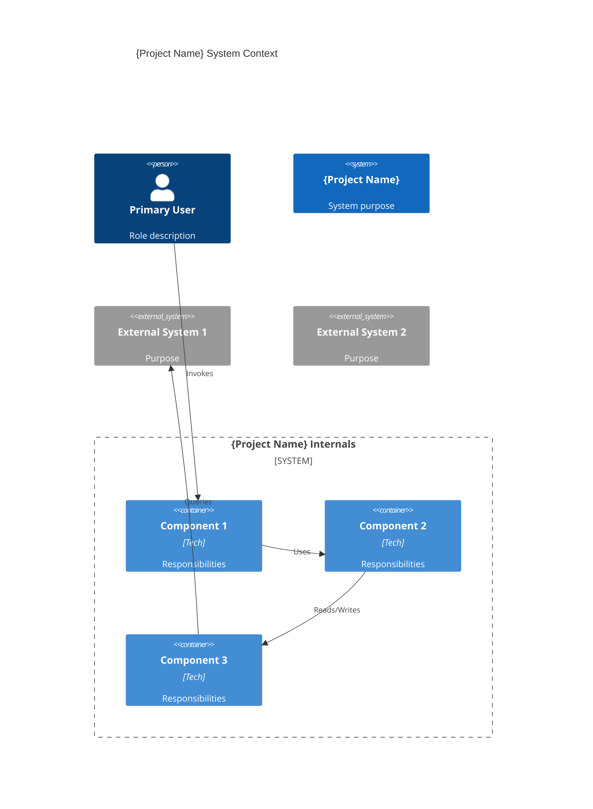
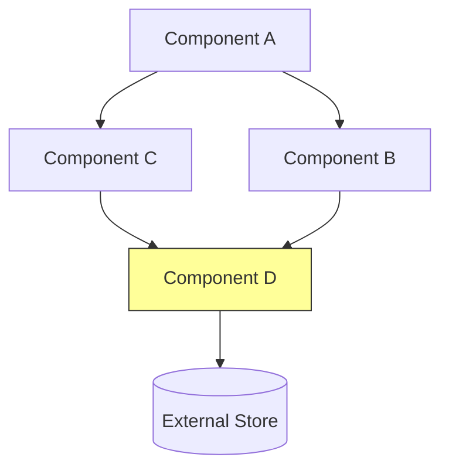

# /system-plan - Interactive Architecture Planning Command

Establishes and maintains system-level architecture context in Graphiti. This is the third specialization in GuardKit's command hierarchy: `/task-review` (code level), `/feature-plan` (feature level), and `/system-plan` (system/architecture level).

## Command Syntax

```bash
/system-plan "description" [--mode=MODE] [--focus=FOCUS] [--no-questions] [--defaults] [--context path/to/file.md]
```

## Available Flags

| Flag | Description |
|------|-------------|
| `--mode=MODE` | Override auto-detected mode: `setup`, `refine`, `review` |
| `--focus=FOCUS` | Narrow session scope: `domains`, `services`, `decisions`, `crosscutting`, `all` |
| `--no-questions` | Skip all interactive clarification |
| `--defaults` | Use clarification defaults without prompting |
| `--context path/to/file.md` | Include additional context files (can be used multiple times) |

## Mode Auto-Detection

The command automatically detects the appropriate mode based on existing architecture context in Graphiti:

| Graphiti State | Detected Mode | Purpose |
|----------------|---------------|---------|
| No architecture context | `setup` | First-time architecture planning |
| Architecture exists | `refine` | Update existing architecture |
| `--mode=review` override | `review` | Evaluate proposed change against architecture |

**Transparent Display**: The command always shows which mode was selected and why.

**Graceful Degradation**: If Graphiti is unavailable, defaults to `setup` mode without persistence.

## Execution Flow

### Phase 0: Context Loading (All Modes)

**Check Graphiti availability** (Tier 1 — see `docs/internals/commands-lib/graphiti-preamble.md`):

Use the Read tool to read `.guardkit/graphiti.yaml`.

- **IF** the file exists and contains `enabled: true`: set `graphiti_available = true`
- **IF** the file does not exist, or `enabled:` is `false` or missing: set `graphiti_available = false`, display the unavailability warning from `docs/internals/commands-lib/graphiti-preamble.md`, continue without persistence

**Auto-detect mode** (if not overridden by `--mode` flag):

- **IF** `graphiti_available` and `docs/architecture/ARCHITECTURE.md` exists (use Glob): set `detected_mode = "refine"`
- **ELSE**: set `detected_mode = "setup"`

**Apply user override**: use `--mode` flag value if provided, otherwise use `detected_mode`

**Display mode selection**:
- `setup` → `🏗️ Mode: setup (no existing architecture context found)`
- `refine` → `🔄 Mode: refine (updating existing architecture)`
- `review` → `🔍 Mode: review (evaluating change against existing architecture)`

### Phase 1: Interactive Session (Mode-Specific)

#### Setup Mode Flow

**Ask structured questions across 6 categories:**

1. **Domain & Methodology Discovery**
2. **System Structure** (adapts to methodology)
3. **Service/Module Relationships**
4. **Technology Decisions**
5. **Cross-Cutting Concerns**
6. **Constraints and NFRs**

**After each category:**
- Display what was captured
- Show checkpoint: `[C]ontinue / [R]evise / [S]kip / [A]DR?`
- If `[A]DR?`: Capture ADR inline before continuing
- Upsert entities to Graphiti immediately (not batched)

**Question Adaptation:**

```python
from guardkit.planning.question_adapter import SetupQuestionAdapter

adapter = SetupQuestionAdapter()

# Category 1: Always ask methodology selection
print("Category 1: Domain & Methodology Discovery")
print("Q5. What architectural methodology best fits this project?")
print("    [M]odular — Components/modules with clear responsibilities")
print("    [L]ayered — Traditional layered architecture")
print("    [D]omain-Driven Design — Bounded contexts, aggregates, domain events")
print("    [E]vent-Driven — Event-based communication")
print("    [N]ot sure — Let questions guide the choice")
methodology = input("Your choice [M/L/D/E/N]: ").lower()

# Store in answers
answers["q5_methodology"] = methodology

# Category 2: Adapt questions based on methodology
if adapter.should_ask_ddd_questions(answers):
    # Ask DDD-specific questions (bounded contexts, aggregates, domain events)
    pass
else:
    # Ask generic component/module questions
    pass
```

**Checkpoint Example:**

```
━━━━━━━━━━━━━━━━━━━━━━━━━━━━━━━━━━━━━━━
✓ Category 2: System Structure
━━━━━━━━━━━━━━━━━━━━━━━━━━━━━━━━━━━━━━━

Captured 3 components:
  • CLI Parser — command routing, argument validation
  • Planning Engine — question flow, markdown generation
  • Graphiti Integration — persist architecture context

Communication:
  • CLI Parser → Planning Engine (invokes sessions)
  • Planning Engine → Graphiti Integration (persists)

[C]ontinue to next category | [R]evise this category | [S]kip remaining | [A]DR?

Your choice [C/R/S/A]:
```

**ADR Capture (if user chooses [A]):**

```
━━━━━━━━━━━━━━━━━━━━━━━━━━━━━━━━━━━━━━━
📝 ARCHITECTURE DECISION RECORD
━━━━━━━━━━━━━━━━━━━━━━━━━━━━━━━━━━━━━━━

Title: [Ask user for title]
Context: [Ask user for context]
Decision: [Ask user for decision]
Consequences: [Ask user - can list multiple]
Status: [A]ccepted / [P]roposed / [D]eprecated / [S]uperseded

━━━━━━━━━━━━━━━━━━━━━━━━━━━━━━━━━━━━━━━
✓ ADR-001 captured. Continuing to next category...
```

**Graphiti Persistence (after session completes):**

If `graphiti_available` is true, seed the generated markdown artefacts to Graphiti using CLI commands (see Step 6 and `docs/internals/commands-lib/graphiti-preamble.md` Seeding Commands Template). The interactive session takes priority — do not interrupt categories for seeding. Batch seeding happens after all artefacts are written to `docs/architecture/`.

#### Refine Mode Flow

**Show current architecture state:**

```
🔄 Mode: refine (existing architecture found)

Current architecture summary:
  • Methodology: DDD
  • 4 bounded contexts (Attorney Mgmt, Doc Gen, Financial, Compliance)
  • 7 ADRs (3 accepted, 2 superseded, 2 proposed)
  • 3 external integrations (Moneyhub, OPG, GOV.UK Verify)

━━━━━━━━━━━━━━━━━━━━━━━━━━━━━━━━━━━━━━━
📋 REFINEMENT SCOPE
━━━━━━━━━━━━━━━━━━━━━━━━━━━━━━━━━━━━━━━

What would you like to refine?

[C]omponents — Add, modify, or remove components/contexts
[S]ervice relationships — Update communication patterns
[D]ecisions — Add new ADR or supersede existing
[T]echnology — Update stack or infrastructure decisions
[X]rosscutting — Modify shared concerns (auth, logging, etc.)
[A]ll — Full review of all categories

Your choice:
```

**Targeted refinement:**
- Show current state for selected area
- Ask what's changed conversationally (not full questionnaire)
- Update Graphiti entities
- Regenerate affected markdown files

#### Review Mode Flow

**Evaluate proposed change against existing architecture:**

```
🔍 Mode: review (evaluating against existing architecture)

Analyzing "add real-time notifications" against:
  • 4 bounded contexts (DDD methodology)
  • 7 ADRs
  • 12 BDD scenarios

━━━━━━━━━━━━━━━━━━━━━━━━━━━━━━━━━━━━━━━
📊 IMPACT ANALYSIS
━━━━━━━━━━━━━━━━━━━━━━━━━━━━━━━━━━━━━━━

Affected components:
  ⚠️ Attorney Management — notification triggers for status changes
  ⚠️ Financial Oversight — alerts for transaction anomalies
  ℹ️ Compliance — audit logging of notifications sent

Conflicts with existing ADRs:
  ⚠️ ADR-003: "Use synchronous HTTP for all inter-service communication"
      → Real-time notifications require async/WebSocket

Architectural implications:
  • Need new shared concern: Notification Service
  • Cross-cutting: WebSocket connection management
  • Domain events: StatusChanged, TransactionFlagged

━━━━━━━━━━━━━━━━━━━━━━━━━━━━━━━━━━━━━━━
📋 DECISION CHECKPOINT
━━━━━━━━━━━━━━━━━━━━━━━━━━━━━━━━━━━━━━━

Options:
  [A]ccept — Approve change and update architecture
  [R]eject — Change conflicts too heavily with current design
  [M]odify — Suggest alternative approach
  [F]eature-plan — Chain to /feature-plan for task decomposition
  [C]ancel — Discard analysis

Your choice:
```

**Integration with /feature-plan:**

```
Your choice: F

━━━━━━━━━━━━━━━━━━━━━━━━━━━━━━━━━━━━━━━
🚀 CHAINING TO FEATURE PLANNING
━━━━━━━━━━━━━━━━━━━━━━━━━━━━━━━━━━━━━━━

Architecture context will be passed to /feature-plan:
  • Impact analysis from this review
  • Affected components and dependencies
  • Relevant ADRs and constraints

Launching /feature-plan...

[Execute /feature-plan "add real-time notifications" with architecture context]
```

### Phase 2: Output Generation

**Generate markdown artefacts using ArchitectureWriter:**

```python
from guardkit.planning.architecture_writer import ArchitectureWriter

writer = ArchitectureWriter()

# Collect all captured data
system = {
    "name": project_name,
    "purpose": system_purpose,
    "methodology": methodology,
    "users": users,
}

components = [
    {"name": c.name, "description": c.description, "responsibilities": c.responsibilities}
    for c in captured_components
]

concerns = [
    {"name": cc.name, "category": cc.category, "description": cc.description}
    for cc in captured_concerns
]

decisions = [
    {"number": adr.number, "title": adr.title, "status": adr.status}
    for adr in captured_adrs
]

# Write all artefacts
output_dir = "docs/architecture"
writer.write_all(
    output_dir=output_dir,
    system=system,
    components=components,
    concerns=concerns,
    decisions=decisions,
)

# Display what was created
print(f"""
━━━━━━━━━━━━━━━━━━━━━━━━━━━━━━━━━━━━━━━
✅ ARCHITECTURE DOCUMENTATION CREATED
━━━━━━━━━━━━━━━━━━━━━━━━━━━━━━━━━━━━━━━

Created: {output_dir}/
  ├── ARCHITECTURE.md (index)
  ├── system-context.md
  ├── components.md (or bounded-contexts.md for DDD)
  ├── crosscutting-concerns.md
  └── decisions/
      ├── ADR-001-{slug}.md
      ├── ADR-002-{slug}.md
      └── ...

Graphiti context:
  ✓ {len(components)} components persisted
  ✓ {len(concerns)} cross-cutting concerns persisted
  ✓ {len(decisions)} ADRs persisted
  ✓ 1 system context persisted

Next steps:
  1. Review: {output_dir}/ARCHITECTURE.md
  2. Plan features: /feature-plan "feature description"
  3. Refine architecture: /system-plan "{project_name}"
""")
```

### Phase 2.5: Mandatory Diagram Output

After capturing architecture and generating prose artefacts, ALWAYS generate these Mermaid diagrams in `docs/architecture/`. These diagrams are NOT optional. They are the primary review artefact — the prose supports them, not the other way around.

#### 1. C4 Context Diagram (in `system-context.md` — setup and refine modes)

Show all system components, external systems, and their relationships using C4Context Mermaid syntax. Mark any read/write asymmetries with a warning marker.

**Example template:**

````markdown
## System Context Diagram



_Look for: read/write asymmetries, components with only inbound or only outbound arrows, missing connections between components that should communicate._
````

#### 2. Component Dependency Graph (in `components.md` or `bounded-contexts.md` — all modes)

Show which components depend on which using `graph TD` Mermaid syntax. Highlight shared/critical components with colour coding.

**Example template:**

````markdown
## Component Dependencies



_Look for: circular dependencies, components with too many inbound arrows (high coupling), isolated components with no connections._
````

**Format rules for all diagrams:**
- Use Mermaid fenced code blocks (` ```mermaid `)
- Keep diagrams under 30 nodes (split into sub-diagrams if larger)
- Use colour coding: green for healthy paths, yellow for new/changed, red for broken/missing
- Add a one-line caption below each diagram explaining what to look for
- Generate diagrams from the actual captured architecture data, not placeholder content

### Phase 3: Graphiti Final Persistence

**Seed generated artefacts to Graphiti (if available):**

If `graphiti_available` is true, run the Tier 2 connectivity check from `docs/internals/commands-lib/graphiti-preamble.md`, then generate and offer seeding commands:

```bash
guardkit graphiti add-context docs/architecture/ARCHITECTURE.md \
  --group architecture_decisions

guardkit graphiti add-context docs/architecture/system-context.md \
  --group architecture_decisions

guardkit graphiti add-context docs/architecture/components.md \
  --group architecture_decisions

# Seed each ADR file
guardkit graphiti add-context docs/architecture/decisions/ADR-001-{slug}.md \
  --group architecture_decisions
```

Ask the user: `"Seed architecture artefacts to Graphiti now? [Y/n]"`

If yes, execute each via the Bash tool. Display: `✓ All architecture artefacts seeded to Graphiti`

If `graphiti_available` is false, skip seeding and display the unavailability warning from `docs/internals/commands-lib/graphiti-preamble.md`.

## Methodology-Specific Question Gating

The setup flow adapts questions based on the selected methodology:

| Methodology | Questions Asked |
|-------------|-----------------|
| **Modular** | Components, modules, responsibilities, dependencies |
| **Layered** | Layers, presentation/service/data, cross-layer communication |
| **DDD** | Bounded contexts, aggregates, domain events, shared kernels, ACLs |
| **Event-Driven** | Events, event streams, event handlers, eventual consistency |

**DDD-Specific Questions (only when methodology = DDD):**

- Q6d. How do these map to bounded contexts?
- Q7d. What are the aggregate roots in each context?
- Q8d. Are there shared kernels or anti-corruption layers needed?
- Q9d. What domain events flow between contexts?

**Implementation:**

```python
class SetupQuestionAdapter:
    def should_ask_ddd_questions(self, answers: dict) -> bool:
        return answers.get("q5_methodology") == "ddd"

    def should_ask_event_questions(self, answers: dict) -> bool:
        methodology = answers.get("q5_methodology")
        return methodology in ("event_driven", "ddd")

    def get_questions_for_category(self, category: str, answers: dict) -> list:
        base_questions = CATEGORY_QUESTIONS[category]

        if category == "system_structure":
            if self.should_ask_ddd_questions(answers):
                base_questions += DDD_SPECIFIC_QUESTIONS

        if category == "service_relationships":
            if self.should_ask_event_questions(answers):
                base_questions += EVENT_DRIVEN_QUESTIONS

        return base_questions
```

## Flag Handling

### --no-questions

Skip all interactive clarification:

```python
if flags.get("no_questions"):
    print("━━━━━━━━━━━━━━━━━━━━━━━━━━━━━━━━━━━━━━━")
    print("⚠️ --no-questions flag: Skipping interactive session")
    print("━━━━━━━━━━━━━━━━━━━━━━━━━━━━━━━━━━━━━━━")

    # Use defaults or fail gracefully
    print("ERROR: /system-plan requires interactive input")
    print("       --no-questions not supported for architecture planning")
    exit(1)
```

### --defaults

Use clarification defaults:

```python
if flags.get("defaults"):
    # Use default methodology
    answers["q5_methodology"] = "modular"

    # Use default deployment
    answers["q9_deployment"] = "monolith"

    # Auto-continue at checkpoints
    checkpoint_choice = "c"  # Always continue
```

### --context

Include additional context files:

```python
context_files = flags.get("context", [])
for context_file in context_files:
    with open(context_file) as f:
        additional_context = f.read()
    print(f"✓ Loaded context from {context_file}")
```

## Error Handling

### Graphiti Unavailable

If `graphiti_available` is false (detected via Tier 1 Read check in Phase 0 — see `docs/internals/commands-lib/graphiti-preamble.md`), display the standard unavailability warning from `docs/internals/commands-lib/graphiti-preamble.md` and continue. Architecture planning proceeds normally — markdown artefacts are still generated, but won't be queryable by `/feature-plan` or AutoBuild coach.

### Empty Answers

```python
answer = input("Q1. What does this system do? ")
if not answer or answer.strip() == "":
    print("⚠️ Empty answer - using placeholder")
    answer = "[To be defined]"
```

### Cancelled Session

```python
checkpoint_choice = input("Your choice [C/R/S/A]: ")

if checkpoint_choice.lower() == "s":
    print("━━━━━━━━━━━━━━━━━━━━━━━━━━━━━━━━━━━━━━━")
    print("⚠️ Session cancelled (remaining categories skipped)")
    print("━━━━━━━━━━━━━━━━━━━━━━━━━━━━━━━━━━━━━━━")
    print("")
    print("Partial architecture captured:")
    print(f"  • Completed: {completed_categories} categories")
    print(f"  • Skipped: {remaining_categories} categories")
    print("")
    print("Generated files reflect partial architecture only.")
    print("Run /system-plan again to complete.")
    break
```

## Examples

### Example 1: Simple Modular Project (Setup)

```bash
/system-plan "CLI task workflow tool"

🏗️ Mode: setup (no existing architecture context found)

━━━━━━━━━━━━━━━━━━━━━━━━━━━━━━━━━━━━━━━
📋 SYSTEM PLANNING: CLI task workflow tool
━━━━━━━━━━━━━━━━━━━━━━━━━━━━━━━━━━━━━━━

Category 1: Domain & Methodology Discovery
  Q1. What does this system do?
      > A CLI tool that helps developers manage tasks with built-in quality gates

  Q2. Who are the primary users?
      > Software developers, AI agents

  Q5. What architectural methodology best fits this project?
      [M]odular (DEFAULT) | [L]ayered | [D]DD | [E]vent-Driven | [N]ot sure
      > M

━━━━━━━━━━━━━━━━━━━━━━━━━━━━━━━━━━━━━━━
✓ Category 1: Domain & Methodology Discovery
━━━━━━━━━━━━━━━━━━━━━━━━━━━━━━━━━━━━━━━

Captured:
  • Purpose: CLI tool for task management with quality gates
  • Users: Developers, AI agents
  • Methodology: Modular

[C]ontinue | [R]evise | [S]kip | [A]DR?
> C

[Continue through remaining categories...]

━━━━━━━━━━━━━━━━━━━━━━━━━━━━━━━━━━━━━━━
✅ ARCHITECTURE DOCUMENTATION CREATED
━━━━━━━━━━━━━━━━━━━━━━━━━━━━━━━━━━━━━━━

Created: docs/architecture/
  ├── ARCHITECTURE.md
  ├── system-context.md
  ├── components.md
  ├── crosscutting-concerns.md
  └── decisions/
      └── ADR-001-use-click-for-cli.md

Graphiti context:
  ✓ 5 components persisted
  ✓ 2 cross-cutting concerns persisted
  ✓ 1 ADR persisted
```

### Example 2: Complex DDD Project (Setup)

```bash
/system-plan "Power of Attorney platform"

🏗️ Mode: setup (no existing architecture context found)

Category 1: Domain & Methodology Discovery
  Q5. What architectural methodology best fits this project?
      > D (DDD)

Category 2: System Structure
  Q6. What are the major components?
      > Attorney Management, Document Generation, Financial Oversight, Compliance

  Q6d. How do these map to bounded contexts? (DDD-specific)
       > Each is a bounded context with its own domain model

  Q7d. What are the aggregate roots? (DDD-specific)
       > Donor (Attorney Mgmt), LPADocument (Doc Gen), Account (Financial)

  Q9d. What domain events flow between contexts? (DDD-specific)
       > DonorCreated, LPAFiled, TransactionFlagged

━━━━━━━━━━━━━━━━━━━━━━━━━━━━━━━━━━━━━━━
✓ Category 2: System Structure
━━━━━━━━━━━━━━━━━━━━━━━━━━━━━━━━━━━━━━━

Captured 4 bounded contexts:
  • Attorney Management — donor, attorney, aggregate: Donor
  • Document Generation — LPA forms, aggregate: LPADocument
  • Financial Oversight — accounts, transactions, aggregate: Account
  • Compliance — OPG registration, identity verification

Domain events: DonorCreated, LPAFiled, TransactionFlagged

[C]ontinue | [R]evise | [S]kip | [A]DR?
> A

━━━━━━━━━━━━━━━━━━━━━━━━━━━━━━━━━━━━━━━
📝 ARCHITECTURE DECISION RECORD
━━━━━━━━━━━━━━━━━━━━━━━━━━━━━━━━━━━━━━━

Title: Use anti-corruption layer for Moneyhub integration
[... capture ADR ...]

✓ ADR-001 captured. Continuing to Category 3...

[Continue through remaining categories...]

━━━━━━━━━━━━━━━━━━━━━━━━━━━━━━━━━━━━━━━
✅ ARCHITECTURE DOCUMENTATION CREATED
━━━━━━━━━━━━━━━━━━━━━━━━━━━━━━━━━━━━━━━

Created: docs/architecture/
  ├── ARCHITECTURE.md
  ├── system-context.md
  ├── bounded-contexts.md (DDD variant)
  ├── crosscutting-concerns.md
  └── decisions/
      ├── ADR-001-moneyhub-acl.md
      ├── ADR-002-event-sourcing.md
      └── ADR-003-cqrs-pattern.md
```

### Example 3: Review Mode

```bash
/system-plan "add real-time notifications" --mode=review

🔍 Mode: review (evaluating against existing architecture)

Analyzing against:
  • 4 bounded contexts
  • 7 existing ADRs

━━━━━━━━━━━━━━━━━━━━━━━━━━━━━━━━━━━━━━━
📊 IMPACT ANALYSIS
━━━━━━━━━━━━━━━━━━━━━━━━━━━━━━━━━━━━━━━

Affected components:
  ⚠️ Attorney Management — triggers on status changes
  ⚠️ Financial Oversight — alerts on anomalies

Conflicts:
  ⚠️ ADR-003: "Synchronous HTTP only"
      → Notifications need async/WebSocket

Options:
  [A]ccept | [R]eject | [M]odify | [F]eature-plan | [C]ancel

> F

Launching /feature-plan with architecture context...

[Executes /feature-plan "add real-time notifications"]
```

---

## CRITICAL EXECUTION INSTRUCTIONS FOR CLAUDE

**IMPORTANT: YOU MUST FOLLOW THESE STEPS EXACTLY. THIS IS AN INTERACTIVE ORCHESTRATION COMMAND.**

When the user runs `/system-plan "description"`, you MUST execute these steps in order:

### Step 1: Parse Arguments

```python
import sys

# Extract description and flags
description = args[0]  # Required
mode = flags.get("mode", None)  # Auto-detect if not specified
focus = flags.get("focus", "all")
no_questions = flags.get("no_questions", False)
defaults = flags.get("defaults", False)
context_files = flags.get("context", [])
```

### Step 2: Check Graphiti Availability

Follow the Tier 1 check from `docs/internals/commands-lib/graphiti-preamble.md`:

Use the Read tool to read `.guardkit/graphiti.yaml`.

- **IF** file exists and `enabled: true`: set `graphiti_available = true`
- **IF** file missing or disabled: set `graphiti_available = false`, display the unavailability warning from `docs/internals/commands-lib/graphiti-preamble.md`, continue without persistence

### Step 3: Auto-Detect Mode (if not specified)

If `--mode` flag was not provided, detect mode from the file system:

- **IF** `graphiti_available` and `docs/architecture/ARCHITECTURE.md` exists (use Glob): set `mode = "refine"`
- **ELSE**: set `mode = "setup"`

If `--mode` flag was provided, use it directly.

**Display mode**:
- `setup` → `🏗️ Mode: setup (no existing architecture context found)`
- `refine` → `🔄 Mode: refine (updating existing architecture)`
- `review` → `🔍 Mode: review (evaluating change against existing architecture)`

### Step 4: Execute Mode-Specific Flow

#### If mode == "setup":

Run the interactive session across 6 categories. Adapt questions based on methodology (see Phase 1 above). After each category, show the checkpoint prompt and wait for user input.

```
━━━━━━━━━━━━━━━━━━━━━━━━━━━━━━━━━━━━━━━
📋 SYSTEM PLANNING: {description}
━━━━━━━━━━━━━━━━━━━━━━━━━━━━━━━━━━━━━━━

Category 1: Domain & Methodology Discovery
  Q1. What does this system do?
  Q2. Who are the primary users?
  Q5. What architectural methodology best fits? [M/L/D/E/N]
  ...

━━━━━━━━━━━━━━━━━━━━━━━━━━━━━━━━━━━━━━━
✓ Category 1: Domain & Methodology Discovery
━━━━━━━━━━━━━━━━━━━━━━━━━━━━━━━━━━━━━━━

Captured:
  • Purpose: {q1_purpose}
  • Users: {q2_users}
  • Methodology: {q5_methodology}

[C]ontinue | [R]evise | [S]kip | [A]DR?
```

- If `[A]DR?`: Capture ADR inline (title, context, decision, consequences, status), append to `captured_adrs`
- If `[S]`: Stop session, generate artefacts from what was captured so far
- If `[C]` or `[R]`: Continue/revise

Repeat for Categories 2–6, adapting questions to the selected methodology as described in Phase 1. Accumulate `captured_components`, `captured_concerns`, and `captured_adrs` throughout.

**Do not attempt to call Python methods or Graphiti clients inline** — Graphiti seeding happens after artefact generation in Step 6.

#### If mode == "refine":

Use the Read tool to read `docs/architecture/ARCHITECTURE.md` (and relevant sub-files such as `components.md`, `bounded-contexts.md`, `decisions/`) to load the current architecture state.

Display a summary based on the loaded content:

```
🔄 Mode: refine (existing architecture found)

Current architecture summary:
  • Methodology: {from ARCHITECTURE.md}
  • {N} components (from components.md or bounded-contexts.md)
  • {N} ADRs (from decisions/ directory)

━━━━━━━━━━━━━━━━━━━━━━━━━━━━━━━━━━━━━━━
📋 REFINEMENT SCOPE
━━━━━━━━━━━━━━━━━━━━━━━━━━━━━━━━━━━━━━━

What would you like to refine?
[C]omponents | [S]ervices | [D]ecisions | [T]echnology | [X]rosscutting | [A]ll

Your choice:
```

Show current state for the selected area (read from the relevant markdown file), ask what's changed conversationally, update the affected markdown file using the Write/Edit tool, then proceed to Step 6 to re-seed to Graphiti if available.

#### If mode == "review":

Use the Read tool to read `docs/architecture/ARCHITECTURE.md`, `components.md` (or `bounded-contexts.md`), and `decisions/` files to load the existing architecture context. Analyse the proposed change (`description`) against the loaded context.

```
🔍 Mode: review (evaluating against existing architecture)

Analyzing '{description}' against:
  • {N} components
  • {N} ADRs

━━━━━━━━━━━━━━━━━━━━━━━━━━━━━━━━━━━━━━━
📊 IMPACT ANALYSIS
━━━━━━━━━━━━━━━━━━━━━━━━━━━━━━━━━━━━━━━

Affected components:
  {list components from ARCHITECTURE.md that the change touches}

Conflicts with existing ADRs:
  {list any ADRs from decisions/ that conflict with the proposed change}

Architectural implications:
  {describe new components, cross-cutting concerns, or events needed}

━━━━━━━━━━━━━━━━━━━━━━━━━━━━━━━━━━━━━━━
📋 DECISION CHECKPOINT
━━━━━━━━━━━━━━━━━━━━━━━━━━━━━━━━━━━━━━━

Options:
  [A]ccept | [R]eject | [M]odify | [F]eature-plan | [C]ancel

Your choice:
```

- If `[F]`: Display `"Launching /feature-plan with architecture context..."` and invoke `/feature-plan "{description}"` with the impact analysis context
- If `[A]`: Update affected markdown files via Write/Edit tool, then proceed to Step 6 for re-seeding

### Step 5: Generate Markdown Artefacts

```python
from guardkit.planning.architecture_writer import ArchitectureWriter

writer = ArchitectureWriter()

# Prepare data
system = {
    "name": description,
    "purpose": answers.get("q1_purpose"),
    "methodology": answers.get("q5_methodology"),
}

components = [
    {"name": c.name, "description": c.description}
    for c in captured_components
]

concerns = [
    {"name": cc.name, "category": cc.category}
    for cc in captured_concerns
]

decisions = [
    {"number": adr.number, "title": adr.title}
    for adr in captured_adrs
]

# Write all artefacts
output_dir = "docs/architecture"
writer.write_all(output_dir, system, components, concerns, decisions)

# Display summary
print("━━━━━━━━━━━━━━━━━━━━━━━━━━━━━━━━━━━━━━━")
print("✅ ARCHITECTURE DOCUMENTATION CREATED")
print("━━━━━━━━━━━━━━━━━━━━━━━━━━━━━━━━━━━━━━━")
print()
print(f"Created: {output_dir}/")
print("  ├── ARCHITECTURE.md")
print("  ├── system-context.md")
print("  ├── components.md")
print("  ├── crosscutting-concerns.md")
print("  └── decisions/")
print(f"      └── ... {len(decisions)} ADRs")
```

### Step 5.5: Generate Mandatory Diagrams

**CRITICAL**: When generating `system-context.md` and `components.md` (or `bounded-contexts.md`), you MUST include Mermaid diagrams as specified in Phase 2.5 above. The diagrams are the primary output — not an afterthought.

**In `system-context.md`**: Include a C4 Context Diagram using `C4Context` Mermaid syntax showing all captured components, external systems, and their relationships. Mark any read/write asymmetries.

**In `components.md` (or `bounded-contexts.md`)**: Include a Component Dependency Graph using `graph TD` Mermaid syntax showing which components depend on which. Highlight shared/critical components with colour coding.

**Validation**: Before finalising output, check:
- Every captured component appears in at least one diagram
- Every captured external system appears in the C4 context diagram
- Relationships between components match what was captured in the interactive session
- Each diagram has a caption explaining what to look for

### Step 6: Seed to Graphiti (if available)

If `graphiti_available` is true, run the Tier 2 connectivity check from `docs/internals/commands-lib/graphiti-preamble.md`, then generate and offer seeding commands for the artefacts written to `docs/architecture/`:

```bash
guardkit graphiti add-context docs/architecture/ARCHITECTURE.md \
  --group architecture_decisions

guardkit graphiti add-context docs/architecture/system-context.md \
  --group architecture_decisions

guardkit graphiti add-context docs/architecture/components.md \
  --group architecture_decisions

# Include bounded-contexts.md instead of components.md for DDD methodology
# Include each ADR file from docs/architecture/decisions/
```

Ask the user: `"Seed architecture artefacts to Graphiti now? [Y/n]"`

If yes, execute each seeding command via the Bash tool and display:

```
Graphiti context:
  ✓ {N} components seeded
  ✓ {N} cross-cutting concerns seeded
  ✓ {N} ADRs seeded
  ✓ 1 system context seeded
```

If `graphiti_available` is false or user declines, skip seeding and continue.

### What NOT to Do

DO NOT:
- Skip the interactive question flow (this is an interactive command)
- Batch all Graphiti upserts at the end (upsert after each category)
- Skip checkpoints (user must review each category)
- Proceed without user confirmation at decision points
- Generate code implementations (this is a planning command)
- Skip mode auto-detection (always detect unless overridden)
- Ignore Graphiti unavailability (warn user, offer to continue)

### Error Handling

- **Graphiti unavailable**: If `graphiti_available` is false (from Step 2 Read check), display the standard warning from `docs/internals/commands-lib/graphiti-preamble.md` and continue. Do not block the session.

- **Empty answer**: If the user provides an empty answer, use `[To be defined]` as a placeholder and continue.

- **Session cancelled** (user chooses `[S]` at a checkpoint): Display `⚠️ Session cancelled — partial architecture captured`, generate markdown artefacts for the categories completed so far, then proceed to Step 6.

### Example Execution Trace

```
User: /system-plan "CLI tool for developers"

Claude executes:
  1. Check Graphiti → Read .guardkit/graphiti.yaml (Tier 1 — lib/graphiti-preamble.md)
  2. Auto-detect mode → "setup" (docs/architecture/ not found)
  3. Display: "🏗️ Mode: setup"
  4. Ask Category 1 questions (including methodology)
  5. Checkpoint after Category 1
  6. Ask Category 2 questions (adapted to methodology)
  7. Checkpoint after Category 2
  8. ... continue for Categories 3-6 ...
  9. Generate markdown files to docs/architecture/
  10. Generate mandatory Mermaid diagrams (C4 Context + Component Dependencies)
  11. Display summary with file locations
  12. Seed to Graphiti via CLI if graphiti_available (lib/graphiti-preamble.md Tier 2)
```

Remember: This is an **interactive planning command**. You MUST present questions, wait for user input, show checkpoints, and allow the user to guide the session. DO NOT try to answer the questions yourself or auto-complete the flow.
