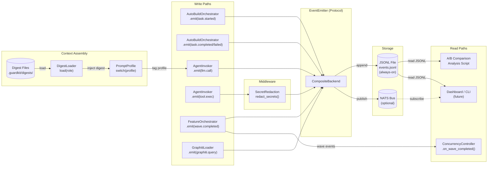
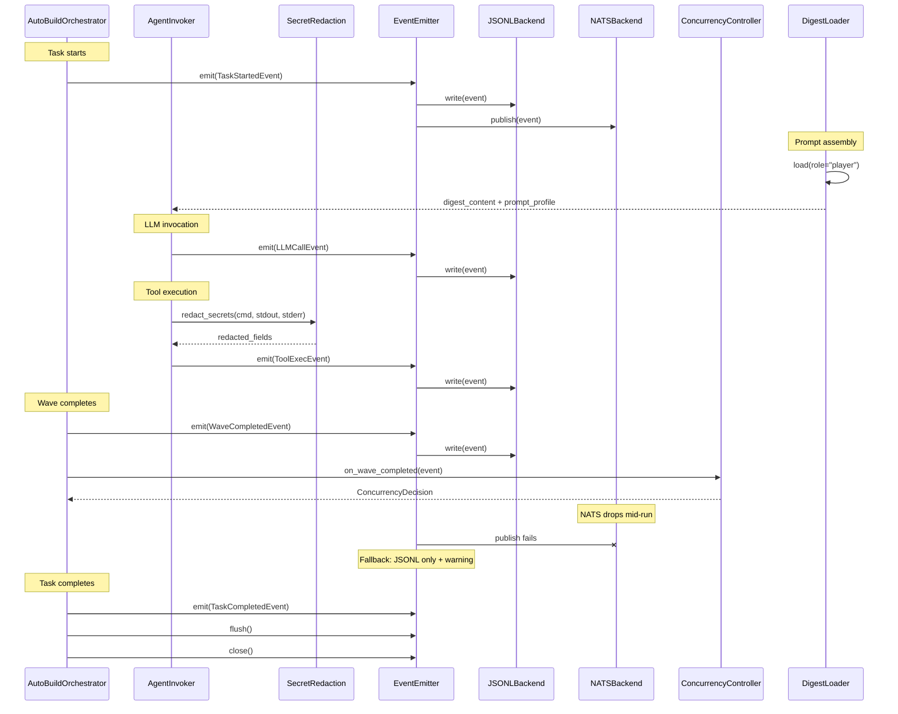
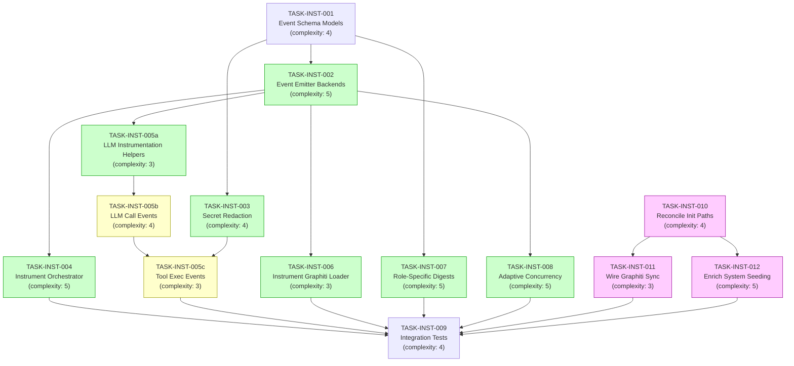

# Implementation Guide: AutoBuild Instrumentation and Context Reduction

## Overview

This feature adds structured observability to the AutoBuild pipeline and migrates from static always-on markdown context to minimal role-specific digests. The implementation follows Option 1: Layered Event Emitter with Protocol-Based Injection.

**Approach**: Protocol-based EventEmitter injected into existing components
**Execution**: 4 waves with auto-detected parallelism
**Testing**: Full TDD (test-first for all tasks)
**Review**: TASK-REV-2FE2

---

## Data Flow: Read/Write Paths

_Look for: Every write path (left) reaches storage (centre) and every read path (right) has a data source. The ConcurrencyController reads wave events directly from the emitter output, not from storage._

---

## Integration Contracts

_Look for: Data flows from orchestrator through emitter to backends. Note the NATS failure fallback mid-sequence. The ConcurrencyController receives wave events directly from the orchestrator, not from storage replay._

---

## §4: Integration Contracts

### Contract: EVENT_SCHEMAS
- **Producer task:** TASK-INST-001
- **Consumer task(s):** TASK-INST-002, TASK-INST-004, TASK-INST-005, TASK-INST-006, TASK-INST-008
- **Artifact type:** Python module (Pydantic models)
- **Format constraint:** All event objects are Pydantic BaseEvent subclasses with `model_dump()` returning `dict` for JSON serialization. Each model has a `schema_version` field defaulting to `"1.0.0"`.
- **Validation method:** Coach verifies import and instantiation of all event classes; `model_dump()` returns valid dict with required fields.

### Contract: EVENT_EMITTER
- **Producer task:** TASK-INST-002
- **Consumer task(s):** TASK-INST-004, TASK-INST-005, TASK-INST-006, TASK-INST-008
- **Artifact type:** Python protocol + implementations
- **Format constraint:** `EventEmitter` protocol with `async emit(event: BaseEvent)`, `async flush()`, `async close()` methods. `NullEmitter(capture=True)` stores events in `.captured` list.
- **Validation method:** Coach verifies NullEmitter can be injected and captures events; CompositeBackend writes to JSONL.

### Contract: REDACTION_PIPELINE
- **Producer task:** TASK-INST-003
- **Consumer task(s):** TASK-INST-005
- **Artifact type:** Python function
- **Format constraint:** `redact_secrets(text: str) -> str` replaces detected secrets with `[REDACTED]`. Input/output are plain strings.
- **Validation method:** Coach verifies known secret patterns are redacted and non-secret text is preserved.

---

## Task Dependencies

_Green = parallel within wave. Yellow = agent_invoker subtasks (sequential). Pink = supply-side (Graphiti content pipeline)._

---

## Execution Strategy

### Wave 1: Foundation (2 tasks in parallel)
| Task | Name | Complexity | Mode | Track |
|------|------|-----------|------|-------|
| TASK-INST-001 | Event Schema Models | 4 | task-work (TDD) | Demand |
| TASK-INST-010 | Reconcile Init Paths | 4 | task-work | Supply |

### Wave 2: Core Infrastructure (5 tasks, parallel)
| Task | Name | Complexity | Mode | Track |
|------|------|-----------|------|-------|
| TASK-INST-002 | Event Emitter Backends | 5 | task-work (TDD) | Demand |
| TASK-INST-003 | Secret Redaction Pipeline | 4 | task-work (TDD) | Demand |
| TASK-INST-007 | Role-Specific Digests | 5 | task-work (TDD) | Demand |
| TASK-INST-011 | Wire Template Graphiti Sync | 3 | task-work (TDD) | Supply |
| TASK-INST-012 | Enrich System Seeding | 5 | task-work (TDD) | Supply |

### Wave 3: Instrumentation + Helpers (4 tasks, parallel)
| Task | Name | Complexity | Mode | Track |
|------|------|-----------|------|-------|
| TASK-INST-004 | Instrument Orchestrator | 5 | task-work (TDD) | Demand |
| TASK-INST-005a | LLM Instrumentation Helpers | 3 | task-work (TDD) | Demand |
| TASK-INST-006 | Instrument Graphiti Loader | 3 | task-work (TDD) | Demand |
| TASK-INST-008 | Adaptive Concurrency | 5 | task-work (TDD) | Demand |

### Wave 4: Agent Invoker Integration (2 tasks, sequential)
| Task | Name | Complexity | Mode | Track |
|------|------|-----------|------|-------|
| TASK-INST-005b | LLM Call Events | 4 | task-work (TDD) | Demand |
| TASK-INST-005c | Tool Exec Events | 3 | task-work (TDD) | Demand |

### Wave 5: Verification (1 task)
| Task | Name | Complexity | Mode | Track |
|------|------|-----------|------|-------|
| TASK-INST-009 | Integration Tests | 4 | task-work (TDD) | Both |

---

## Architecture Decision: Protocol-Based Injection

The EventEmitter is injected via constructor into existing components rather than using decorators or global state. This follows the established pattern in the codebase (OrchestratorProtocol, StateTracker ABC).

**Why not decorators?** The codebase has no decorator-based instrumentation. Adding magic behaviour would break the pattern of explicit contracts.

**Why not OpenTelemetry?** The pipeline is a single-process CLI tool. OTel's distributed tracing overhead is not justified. Structured JSONL files meet current analysis needs.

## Schema Evolution Strategy

- All events include `schema_version` field (default "1.0.0")
- New fields added as Optional with defaults (backward compatible)
- Breaking changes increment schema version
- JSONL reader validates schema version before processing
- Pydantic `model_validate` with `strict=False` handles extra fields

## NATS Failure Strategy

- CompositeBackend always includes JSONLFileBackend (never loses events)
- NATSBackend is optional; configured via environment variable
- Connection loss detected per-emit; automatic failover to JSONL-only
- Warning logged once per failover event
- Reconnection attempted on next emit
- No retry queue (events are append-only, not ordered delivery critical)

## Digest Token Budget

- Each role digest: 300-600 tokens (target)
- Hard limit: 700 tokens (validated at startup)
- Token counting: tiktoken preferred, word-based fallback
- CI validation recommended for digest files
- Phase 1: digest + full rules bundle (baseline measurement)
- Phase 2+: digest + Graphiti (reduced prefill)

## Supply-Side: Graphiti Content Pipeline

The demand-side tasks (TASK-INST-001 through TASK-INST-009) define how AutoBuild consumes context. The supply-side tasks ensure Graphiti actually contains the rich template content needed for the `digest+graphiti` profile to work.

### TASK-INST-010: Reconcile Init Paths

**Problem**: `guardkit init` creates empty dirs; `agentic_init` copies files but doesn't seed Graphiti.
**Solution**: Enhance `apply_template()` to copy template agents, rules, CLAUDE.md, and manifest.json.
**Files**: `guardkit/cli/init.py`

### TASK-INST-011: Wire Template Graphiti Sync

**Problem**: `sync_template_to_graphiti()` exists in `template_sync.py` but is never called (dead code).
**Solution**: Call it from `_cmd_init()` after template files are copied. Enhance to sync full content.
**Files**: `guardkit/cli/init.py`, `guardkit/knowledge/template_sync.py`

### TASK-INST-012: Enrich System Seeding

**Problem**: `seed_templates.py`, `seed_agents.py`, `seed_rules.py` contain hardcoded metadata descriptions instead of actual template content.
**Solution**: Read actual `.md` files from `installer/core/templates/` during system seeding.
**Files**: `guardkit/knowledge/seed_templates.py`, `seed_agents.py`, `seed_rules.py`

---

## Key Files

| Component | Location |
|-----------|----------|
| Event schemas | `guardkit/orchestrator/instrumentation/schemas.py` |
| Event emitter | `guardkit/orchestrator/instrumentation/emitter.py` |
| Secret redaction | `guardkit/orchestrator/instrumentation/redaction.py` |
| Digest system | `guardkit/orchestrator/instrumentation/digests.py` |
| Prompt profiles | `guardkit/orchestrator/instrumentation/prompt_profile.py` |
| Concurrency | `guardkit/orchestrator/instrumentation/concurrency.py` |
| LLM helpers | `guardkit/orchestrator/instrumentation/llm_instrumentation.py` |
| Digest files | `.guardkit/digests/{player,coach,resolver,router}.md` |
| Event output | `.guardkit/autobuild/{task_id}/events.jsonl` |
| Init command | `guardkit/cli/init.py` |
| Template sync | `guardkit/knowledge/template_sync.py` |
| System seeding | `guardkit/knowledge/seed_templates.py`, `seed_agents.py`, `seed_rules.py` |
