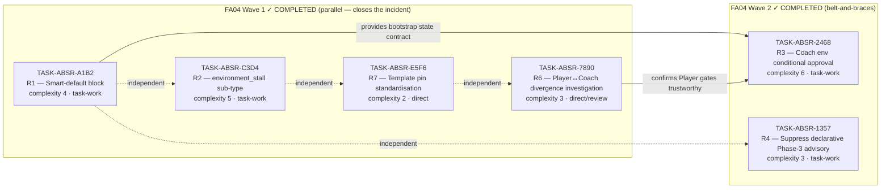

# IMPLEMENTATION-GUIDE — autobuild-stall-resilience (FEAT-ABSR-9C6E)

> ## ⚠️ READ THIS FIRST — Active backlog vs. historical content
>
> **Active backlog** (the tasks to run now, 7 tasks, parents both TASK-REV-FA04 and TASK-REV-9D13):
> - **Wave 1 (CRITICAL/HIGH)**: `TASK-ABSR-CEIL`, `TASK-ABSR-WALL`, `TASK-ABSR-FRSH`, `TASK-ABSR-DIAG`
> - **Wave 2**: `TASK-ABSR-MAXT`, `TASK-ABSR-MTBC`
> - **Wave 3 (post-talk)**: `TASK-ABSR-CMPL`
>
> Skip to **[Active Backlog Plan](#waves-1-3-of-the-active-backlog--added-2026-04-28-from-task-rev-9d13-v2)** below.
>
> **Historical / completed** (do NOT `/task-work` these — they're in `tasks/completed/`):
> - FA04 Wave 1: `TASK-ABSR-A1B2`, `TASK-ABSR-C3D4`, `TASK-ABSR-E5F6`, `TASK-ABSR-7890` ✓
> - FA04 Wave 2: `TASK-ABSR-2468`, `TASK-ABSR-1357` ✓
>
> The sections immediately below (Goal, Wave Plan mermaid, Wave 1 / Wave 2 tables) describe the **completed FA04 work** for historical context. Scroll to the "Waves 1-3 of the active backlog" header below for the current plan.

---

## Historical context (FA04 — all 6 tasks completed 2026-04-27/28)

**Parent review**: [TASK-REV-FA04](../../../.claude/reviews/TASK-REV-FA04-report.md)
**Origin incident**: Jarvis FEAT-J004-702C / TASK-J004-004 `unrecoverable_stall` (2026-04-27)
**Constraint**: DDD South West deadline — must not be blocked by AutoBuild stalls.

## Goal

Close the failure class identified in TASK-REV-FA04: `task_type=declarative` ∧ `implementation_mode=task-work` ∧ broken bootstrap (Python interpreter mismatch with `requires-python`) ∧ a regression test that does `import <package>` ⇒ feedback-stall trapdoor with misleading diagnostic. Wave 1 closes the immediate incident; Wave 2 adds the belt-and-braces layer.

## Wave Plan (FA04 — historical, all complete)



### FA04 Wave 1 — ✓ COMPLETED — close the incident class (4 tasks)

| Task | Title | Mode | Complexity | Workspace |
|---|---|---|---|---|
| [TASK-ABSR-A1B2](TASK-ABSR-A1B2-bootstrap-block-smart-default.md) | Smart-default `bootstrap_failure_mode` to `block` when `requires-python` declared | task-work | 4 | `autobuild-stall-resilience-wave1-block-default` |
| [TASK-ABSR-C3D4](TASK-ABSR-C3D4-environment-stall-subtype.md) | Add `environment_stall` sub-type with environment-aware diagnostic | task-work | 5 | `autobuild-stall-resilience-wave1-env-stall` |
| [TASK-ABSR-E5F6](TASK-ABSR-E5F6-template-pin-portfolio-standardisation.md) | Standardise LangChain DeepAgents template `requires-python` + portfolio guide | direct | 2 | `autobuild-stall-resilience-wave1-template-pinning` |
| [TASK-ABSR-7890](TASK-ABSR-7890-investigate-player-coach-test-divergence.md) | Investigate Player↔Coach test divergence (review) | direct | 3 | `autobuild-stall-resilience-wave1-player-coach-divergence` |

**Wave 1 entry conditions**: none — all four are independent.
**Wave 1 exit criteria**: A1B2 + C3D4 merged (incident closed); E5F6 + 7890 merged or filed (portfolio guidance + investigation report available).

### FA04 Wave 2 — ✓ COMPLETED — belt-and-braces (2 tasks)

| Task | Title | Mode | Complexity | Workspace |
|---|---|---|---|---|
| [TASK-ABSR-2468](TASK-ABSR-2468-coach-env-conditional-approval.md) | Coach conditional-approval branch for environment-class infra failures | task-work | 6 | `autobuild-stall-resilience-wave2-env-conditional-approval` |
| [TASK-ABSR-1357](TASK-ABSR-1357-suppress-declarative-phase3-advisory.md) | Suppress agent-invocations Phase-3 advisory for declarative tasks | task-work | 3 | `autobuild-stall-resilience-wave2-declarative-phase3` |

**Wave 2 entry conditions**: Wave 1 A1B2 + 7890 merged.
**Wave 2 exit criteria**: both merged; failing FEAT-J004-702C scenario can now be replayed end-to-end with either (a) preflight-block, or (b) conditional-approve as the safety net.

### Deferred — TASK-REV-FA04 R5 (interpreter discovery)

Not filed as a Wave-2 task. The combination of A1B2 (preflight blocks doomed runs) and E5F6 (portfolio uses open `>=3.11` upper bounds) eliminates the precondition for R5 in current consumer projects. File post-DDD if a project emerges that genuinely needs auto-interpreter-selection.

## Out-of-Scope: Jarvis-side pin alignment (consumer recommendation — verified 2026-04-27)

Per the TASK-REV-FA04 task brief, **fixes must live in GuardKit so all consumers benefit**. No TASK is filed in this repository to change Jarvis's `pyproject.toml`. However, the verification step has now been completed and the recommendation is concrete and actionable:

### Verified facts (2026-04-27)

- `nats-core` PyPI metadata: `requires-python = ">=3.10"` (was `>=3.13` in October 2025 when the Jarvis pin was added — the package has since broadened compatibility).
- specialist-agent: `requires-python = ">=3.11"` (matches forge, study-tutor, agentic-dataset-factory, and the LangChain DeepAgents template canonical).
- The original Jarvis pin rationale at [`jarvis/pyproject.toml:43-47`](../../../../jarvis/pyproject.toml) — *"PyPI publication of `nats-core` requires Python >=3.13 which collides with our `requires-python = ">=3.12,<3.13"` pin"* — is **fully obsolete**. The `<3.13` upper bound has nothing left to defend against.

### Recommended Jarvis-side change

```diff
 # jarvis/pyproject.toml
 [project]
 name = "jarvis"
 version = "0.1.0"
-requires-python = ">=3.12,<3.13"
+requires-python = ">=3.11"
 license = "Apache-2.0"
 ...
 classifiers = [
     "Development Status :: 3 - Alpha",
-    "Programming Language :: Python :: 3.12",
+    "Programming Language :: Python :: 3.11",
+    "Programming Language :: Python :: 3.12",
+    "Programming Language :: Python :: 3.13",
+    "Programming Language :: Python :: 3.14",
     "License :: OSI Approved :: Apache Software License",
 ]
```

Plus delete the now-obsolete comment block at `pyproject.toml:43-47` (the sibling-repo `nats-core` resolution narrative). The `.python-version: 3.12` file is a developer-local pyenv/uv hint and not load-bearing — keep, update, or delete based on dev preference; it doesn't affect autobuild.

### Why `>=3.11` (not `>=3.12`)

- All four sibling DeepAgents projects use `>=3.11`; aligning eliminates the lone-outlier risk that produced this incident.
- DeepAgents template canonical is `>=3.11`.
- nats-core supports `>=3.10`, so the floor isn't constrained by the dependency.
- Tighter floors only exclude contributors on 3.11; relaxing later is a wider change than tightening if a real 3.12+ feature arrives.
- 3.11+ already provides Self type, exception groups, fine-grained `TaskGroup`, faster startup — likely covers anything Jarvis would reach for.

### Verification before merging the pin change

Run Jarvis's existing test suite under at least 3.11 and 3.13 before merging:

```bash
cd /path/to/jarvis
uv run --python 3.11 pytest
uv run --python 3.13 pytest
# Optional: uv run --python 3.14 pytest  (newest; defer if cautious before DDD)
```

If anything breaks on 3.11, narrow to `>=3.12` (still removes the trapdoor by dropping the upper bound). If something breaks on 3.13, that's a Jarvis-side defect to fix separately — the pin change exposes it; it doesn't cause it.

### Relationship to GuardKit-side tasks

This is a **single-line change in another repository** and is independent of this implementation feature. The GuardKit-side tasks (TASK-ABSR-A1B2, TASK-ABSR-C3D4, TASK-ABSR-E5F6) are still required for the *next* consumer who declares a tight `requires-python` for some reason — the fix here is structural; this consumer recommendation is tactical.

## Cross-Stack Notes

- **TASK-ABSR-A1B2 ⇄ TASK-ABSR-C3D4**: Wave 1 tasks are independent but their effects compose. A1B2 prevents the doomed run from starting; C3D4 ensures that when a stall *does* occur (e.g. user explicitly chose `bootstrap_failure_mode: warn`), the diagnostic is correct rather than misleading. Implement either order; merge both before Wave 2.
- **TASK-ABSR-2468 depends on bootstrap state contract**: A1B2 may touch `<worktree>/.guardkit/bootstrap_state.json` semantics; 2468 reads it. Implement A1B2 first or coordinate the schema.
- **TASK-ABSR-7890 informs TASK-ABSR-2468**: 2468's correctness depends on Player gates being a trustworthy "code is fine" signal. If 7890 finds Player tests are systematically more permissive than Coach independent tests, 2468's heuristic needs tightening. Wait for 7890's report before completing 2468.
- **TASK-ABSR-1357 is independent**: declarative-task advisory cleanup doesn't interact with stall-resilience plumbing. Can land any time.
- **Namespace hygiene**: per [.claude/rules/namespace-hygiene.md](../../../.claude/rules/namespace-hygiene.md), all of these tasks should grep their target areas for sys.path inserts and namespace shadowing before merging. None are expected to introduce new shadowing risks; the rule is a lint-style check on every PR.

## Test Strategy

Each task lists its own test additions. The portfolio-level acceptance is:

1. **Replay test**: a new integration-style test that sets up a worktree with a mocked broken bootstrap (interpreter mismatch) and a `task_type=declarative` + `implementation_mode=task-work` task. Assert that:
   - With `bootstrap_failure_mode` unset (smart-default): preflight raises `FeatureOrchestrationError` before Wave 1 starts.
   - With `bootstrap_failure_mode: warn` (explicit): Wave 1 starts, the env-class conditional-approval clause fires, the task is approved with environment flag.
   - In neither case does the feedback-stall trapdoor fire.
2. **Existing test parity**: every test in `tests/orchestrator/test_bootstrap_gating.py` and `tests/unit/test_environment_bootstrap*.py` continues to pass (with the targeted updates listed in TASK-ABSR-A1B2's AC).
3. **Diagnostic test**: assert that when an `environment_stall` does occur (e.g. user opts into `warn` mode, no env conditional approval applies), the post-loop summary names the bootstrap state, interpreter, and `requires-python` constraint — and does NOT include the misleading "Review task_type classification" hint.

## Definition of Done

The feature is complete when:

- [ ] All four Wave 1 tasks are merged.
- [ ] All two Wave 2 tasks are merged.
- [ ] The failing FEAT-J004-702C scenario can be replayed locally (with the broken-bootstrap precondition) and produces either a clean preflight-abort with `uv`/`pyenv`/`conda` remediation hint, or a clean conditional-approval — never an `unrecoverable_stall`.
- [ ] `docs/guides/portfolio-python-pinning.md` exists and is referenced from CLAUDE.md.
- [ ] CHANGELOG entry covers the smart-default behaviour change and the new `environment_stall` sub-type.
- [ ] Investigation report at `.claude/reviews/TASK-ABSR-7890-report.md` exists and either confirms Player↔Coach signal alignment or files a follow-up TASK.

## Quick Replay Recipe (for verifying the fix locally)

```bash
# 1. Force the broken bootstrap precondition
cd /path/to/jarvis  # or any project with requires-python that excludes /usr/local/bin/python3
guardkit autobuild feature FEAT-XXX --verbose --max-turns 30
# After A1B2: should fail at preflight with named remediation
# After A1B2 + 2468 + opt-in to warn: should approve declarative tasks with env flag
```

## References

- Origin review: [TASK-REV-FA04 report](../../../.claude/reviews/TASK-REV-FA04-report.md) (rev2, all sections)
- Failing run: [`jarvis/docs/history/autobuild-FEAT-J004-702C-history.md`](../../../../jarvis/docs/history/autobuild-FEAT-J004-702C-history.md)
- Comparison run (success): [`jarvis/docs/history/autobuild-FEAT-J002-history.md`](../../../../jarvis/docs/history/autobuild-FEAT-J002-history.md)
- Cross-stack run (success on Linux): [`forge/docs/history/autobuild-FEAT-FORGE-005-history-after-bdd-fixes.md`](../../../../forge/docs/history/autobuild-FEAT-FORGE-005-history-after-bdd-fixes.md)
