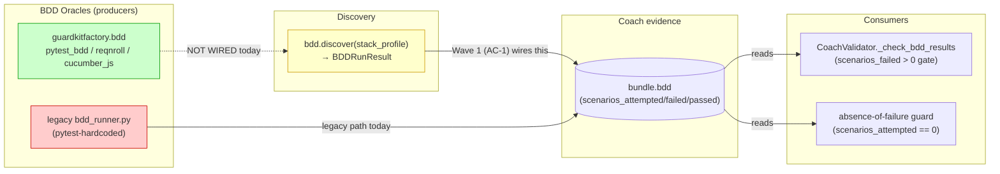
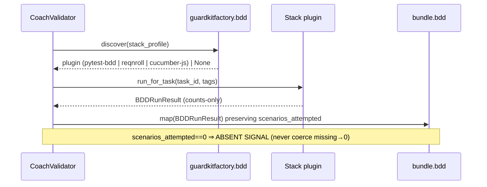
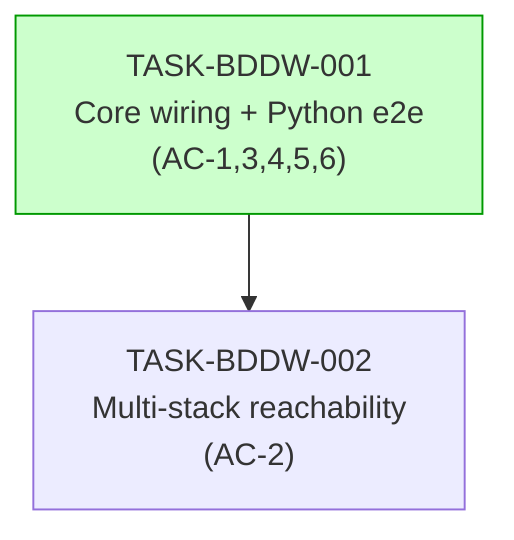

# Implementation Guide: FEAT-BDDWIRE — Wire factory BDD plugins into the Coach

> Closes the disconnection from `TASK-HMIG-BDDWIRE`: the guardkitfactory multi-stack
> BDD plugin subsystem (built, 42 tests) is **unconsumed** by the orchestrator, so
> .NET/JS BDD verification exists in code but is unreachable from a run.

## Data Flow: Read/Write Paths (the disconnection this feature fixes)

**Disconnection Alert (the bug):** `guardkitfactory.bdd` (green, the multi-stack
producer) currently has **no read path into `bundle.bdd`** — the dotted `NOT WIRED`
edge. The legacy `bdd_runner.py` (red) is the only producer wired today, and it is
Python-only. **Wave 1 (AC-1)** wires `discover() → bundle.bdd`; **AC-5** demotes/removes
the legacy path; **Wave 2 (AC-2)** makes the .NET/JS plugins reachable.

## Integration Contracts

### Contract: BDDRunResult → bundle.bdd
- **Producer:** `guardkitfactory.bdd` plugin (`BDDRunResult`, `bdd/plugin.py`)
- **Consumer:** `CoachValidator._check_bdd_results` → `bundle.bdd`
- **Format constraint:** `scenarios_attempted` is non-Optional on the contract and MUST be carried through to `bundle.bdd` **present** (never `.get(..., 0)`-coerced) so the absence-of-failure gate can distinguish "0 attempted" from "absent".
- **Validation method:** Coach integration test asserts a `BDDRunResult(scenarios_attempted=0)` maps to feedback (absent signal), not approve.

## Task Dependencies

## Waves

- **Wave 1 — TASK-BDDW-001** (complexity 5): core `discover()→BDDRunResult→bundle.bdd`
  wiring, Python end-to-end, preserving per-task glue + absence-of-failure +
  `scenarios_failed>0` gate, legacy demotion. Python integration tests.
- **Wave 2 — TASK-BDDW-002** (complexity 4, depends on Wave 1): route .NET→reqnroll,
  JS→cucumber-js through the discovery seam; per-stack selection tests;
  unsupported-stack → absent-signal.

## Key references

- Parent design: `tasks/backlog/TASK-HMIG-BDDWIRE-wire-factory-bdd-plugins-into-coach.md`
- Factory subsystem: `guardkitfactory/src/guardkitfactory/bdd/{plugin.py,loader.py}`
- Coach seam: `guardkit/orchestrator/quality_gates/coach_validator.py` (`:1617`, `:64`), `coach_evidence.py`
- Rules: `.claude/rules/bdd-per-task-glue.md`, `absence-of-failure-is-not-success.md`, `namespace-hygiene.md`
