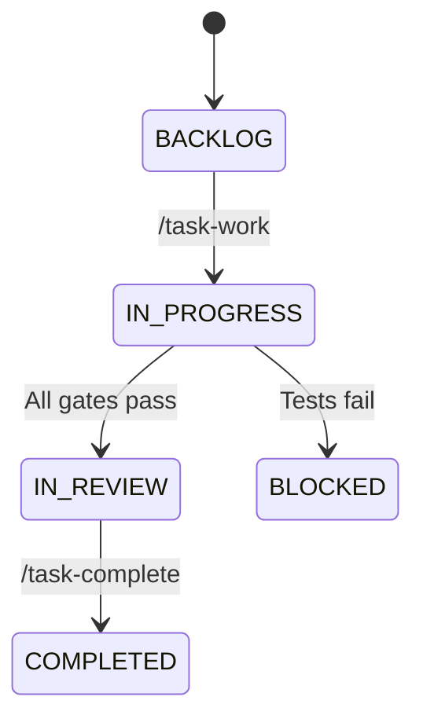

# Add Visual Diagrams to Documentation

**Priority**: Enhancement
**Category**: Documentation - Visual Learning
**Estimated Effort**: 3-4 hours

## Problem

Several complex concepts would benefit from visual diagrams to improve understanding, particularly for new users. Text-only documentation can be difficult to grasp for workflow-based and architectural concepts.

## Diagrams Needed

### 1. Hash-Based Task ID Format
- Visual breakdown of ID structure
- Show: `TASK-{prefix}-{hash}.{subtask}`
- Highlight each component with explanation

### 2. Parallel Development Workflow
- Multiple worktrees in action
- State synchronization visualization
- Concurrent task execution diagram

### 3. Review vs Implementation Workflow
- Side-by-side phase comparison
- Decision checkpoints highlighted
- State transitions

### 4. Task State Transitions
- Complete state machine diagram
- BACKLOG → IN_PROGRESS → IN_REVIEW → COMPLETED
- BLOCKED states and recovery paths
- Design-first workflow branch

### 5. Quality Gates Pipeline
- Phase 2 → 2.5 → 2.7 → 2.8 → 3 → 4 → 4.5 → 5 → 5.5
- Gates at each checkpoint
- Pass/fail flows

### 6. Agent Discovery Process
- Metadata matching visualization
- Precedence order (local > user > global > template)
- Fallback to task-manager

## Acceptance Criteria

1. Create diagrams using Mermaid.js (MkDocs compatible)
2. Add diagrams to relevant documentation pages
3. Diagrams must be:
   - Clear and easy to understand
   - Consistent styling across all diagrams
   - Mobile-responsive
   - Accessible (alt text, descriptions)
4. Include both visual and text explanations
5. Test rendering in MkDocs

## Implementation Notes

- Use Mermaid.js for version-controlled diagrams
- Keep diagrams simple, avoid clutter
- Use consistent color scheme
- Add legends where needed
- Consider dark mode compatibility

## Example Mermaid Format

## References

- MkDocs Mermaid plugin documentation
- Existing workflow descriptions
- README.md diagrams (if any)
