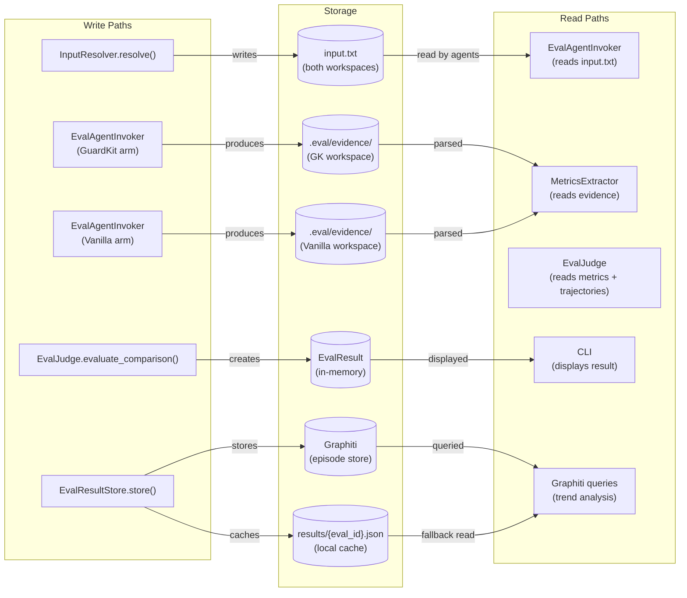
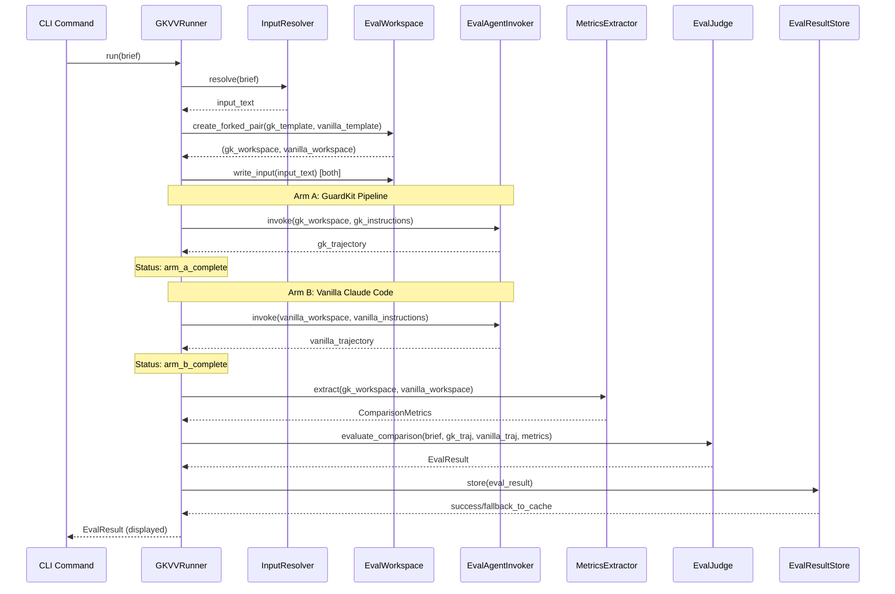
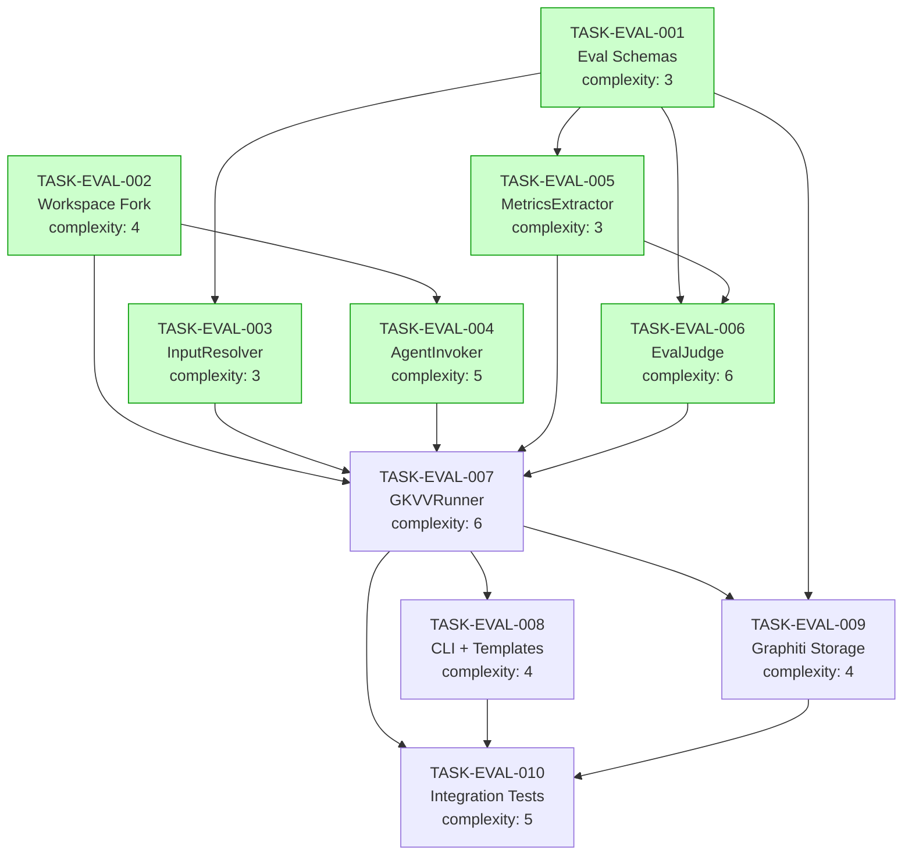

# Implementation Guide: Eval Runner GuardKit vs Vanilla Pipeline

**Feature ID:** FEAT-GKVV
**Parent Review:** TASK-REV-EAE8
**Approach:** Option 3 — Phased Hybrid (Standalone CLI first, NATS later)
**Testing:** Full TDD (32 BDD scenarios as test targets)
**Execution:** Auto-detected parallel waves

---

## Architecture Overview

This feature implements the `guardkit_vs_vanilla` eval type — an A/B comparison pipeline that measures whether GuardKit produces measurably better results than plain Claude Code given the same input.

**Phase A (this feature):** Standalone CLI execution (`guardkit eval run BRIEF.yaml`)
**Phase B (future):** NATS JetStream integration for autonomous queue-based execution

---

## Data Flow: Read/Write Paths



_All write paths have corresponding read paths. No disconnections detected._

---

## Integration Contracts



_Data flows completely from CLI input through to result display. No fetch-then-discard patterns._

---

## Task Dependencies



_Tasks with green background can run in parallel within their wave._

---

## §4: Integration Contracts

### Contract: EvalBrief / GuardKitVsVanillaBrief
- **Producer task:** TASK-EVAL-001
- **Consumer task(s):** TASK-EVAL-003, TASK-EVAL-006, TASK-EVAL-007, TASK-EVAL-009
- **Artifact type:** Python class (Pydantic model)
- **Format constraint:** `GuardKitVsVanillaBrief` must extend `EvalBrief` with `input: InputConfig`, `guardkit_arm: ArmConfig`, `vanilla_arm: ArmConfig` fields. `EvalBrief.from_yaml()` must dispatch to this subclass when `type == "guardkit_vs_vanilla"`.
- **Validation method:** Seam test loads EVAL-007 YAML and verifies parsed object is `GuardKitVsVanillaBrief` with all required fields.

### Contract: ForkedWorkspace
- **Producer task:** TASK-EVAL-002
- **Consumer task(s):** TASK-EVAL-007
- **Artifact type:** Python class (return type)
- **Format constraint:** `EvalWorkspace.create_forked_pair()` returns `tuple[ForkedWorkspace, ForkedWorkspace]`. Each `ForkedWorkspace` has `path: Path`, `write_input(text: str) -> Path`, and `teardown() -> None`. Workspaces are independent temp directories with `.eval/evidence/` pre-created.
- **Validation method:** Seam test creates forked pair, verifies both paths exist, are independent, and have `.eval/evidence/` directory.

### Contract: ComparisonMetrics
- **Producer task:** TASK-EVAL-005
- **Consumer task(s):** TASK-EVAL-006, TASK-EVAL-007
- **Artifact type:** Python dataclass
- **Format constraint:** `ComparisonMetrics` contains `guardkit: ArmMetrics` and `vanilla: ArmMetrics`. Must provide `coverage_delta() -> float`, `lint_delta() -> int`, `assumption_surfacing_delta() -> int`. Missing metrics represented as `-1` (not None, not exception).
- **Validation method:** Seam test creates metrics with known values and verifies delta calculations.

### Contract: EvalResult
- **Producer task:** TASK-EVAL-006
- **Consumer task(s):** TASK-EVAL-007, TASK-EVAL-008, TASK-EVAL-009
- **Artifact type:** Python dataclass
- **Format constraint:** `EvalResult` must include `eval_id: str`, `status: str` (PASSED/FAILED/ESCALATED/ERROR), `weighted_score: float`, `criterion_scores: dict[str, CriterionScore]`. Must provide `to_graphiti_episode() -> dict` that includes `guardkit_arm`, `vanilla_arm`, `deltas` fields.
- **Validation method:** Seam test creates result and verifies Graphiti episode JSON schema matches expected structure.

---

## Execution Strategy

### Wave 1: Foundation (3 tasks — parallel)
| Task | Name | Complexity | Mode |
|------|------|-----------|------|
| TASK-EVAL-001 | Eval Schemas | 3 | task-work |
| TASK-EVAL-002 | Workspace Fork | 4 | task-work |
| TASK-EVAL-003 | InputResolver | 3 | task-work |

> TASK-EVAL-003 depends on TASK-EVAL-001, but TASK-EVAL-001 and TASK-EVAL-002 can run in parallel.
> TASK-EVAL-003 can start once TASK-EVAL-001 completes (partial wave overlap).

### Wave 2: Core Components (3 tasks — parallel)
| Task | Name | Complexity | Mode |
|------|------|-----------|------|
| TASK-EVAL-004 | EvalAgentInvoker | 5 | task-work |
| TASK-EVAL-005 | MetricsExtractor | 3 | task-work |
| TASK-EVAL-006 | EvalJudge | 6 | task-work |

> All depend on Wave 1 outputs. TASK-EVAL-004 depends on TASK-EVAL-002. TASK-EVAL-005 depends on TASK-EVAL-001. TASK-EVAL-006 depends on TASK-EVAL-001 and TASK-EVAL-005.

### Wave 3: Orchestration (1 task)
| Task | Name | Complexity | Mode |
|------|------|-----------|------|
| TASK-EVAL-007 | GKVVRunner | 6 | task-work |

> Depends on all Wave 1 and Wave 2 tasks. This is the integration point.

### Wave 4: Polish & Validation (3 tasks — parallel)
| Task | Name | Complexity | Mode |
|------|------|-----------|------|
| TASK-EVAL-008 | CLI + Templates + Brief | 4 | task-work |
| TASK-EVAL-009 | Graphiti Storage | 4 | task-work |
| TASK-EVAL-010 | Integration Tests | 5 | task-work |

> All depend on TASK-EVAL-007. TASK-EVAL-010 additionally depends on TASK-EVAL-008 and TASK-EVAL-009.

---

## Module Structure

```
guardkit/eval/                      # New eval module
├── __init__.py
├── schemas.py                      # TASK-EVAL-001: EvalBrief, EvalResult, ArmMetrics, ComparisonMetrics
├── workspace.py                    # TASK-EVAL-002: EvalWorkspace, ForkedWorkspace
├── input_resolver.py               # TASK-EVAL-003: InputResolver
├── agent_invoker.py                # TASK-EVAL-004: EvalAgentInvoker, Trajectory
├── metrics.py                      # TASK-EVAL-005: MetricsExtractor
├── judge.py                        # TASK-EVAL-006: EvalJudge
├── storage.py                      # TASK-EVAL-009: EvalResultStore
├── runners/
│   ├── __init__.py
│   └── gkvv_runner.py              # TASK-EVAL-007: GuardKitVsVanillaRunner
├── briefs/                         # TASK-EVAL-008: YAML briefs (git versioned)
│   └── EVAL-007-guardkit-vs-vanilla-youtube.yaml
└── workspaces/                     # TASK-EVAL-008: Template directories
    ├── guardkit-project/
    └── plain-project/

guardkit/cli/eval.py                # TASK-EVAL-008: CLI entry point

tests/integration/eval/             # TASK-EVAL-010: Integration tests
├── conftest.py
├── test_end_to_end.py
├── test_workspace_isolation.py
├── test_scoring_thresholds.py
└── fixtures/
    └── evidence/
```

---

## Key Design Decisions

| Decision | Choice | Rationale |
|----------|--------|-----------|
| Standalone CLI first | `guardkit eval run` | De-risks comparison methodology before building NATS infrastructure |
| Sequential arm execution | Arm A then Arm B | Avoids API rate limit contention; doubles wall time but acceptable |
| Judge always uses Anthropic API | Not local vLLM | Consistent scoring quality across execution environments |
| Evidence files convention | `.eval/evidence/{id}.txt` | Reliable filesystem location for deterministic checks |
| Reuse agent_invoker patterns | Import directly | Proven patterns, no new SDK risk |
| Delta scoring (not absolute) | 0.0–1.0 scale | Measures relative improvement, not absolute quality |

---

## Testing Strategy

**Full TDD** — all tasks implement tests first, then production code.

| Test Category | Framework | Target Coverage |
|--------------|-----------|----------------|
| Unit tests | pytest | ≥ 80% line coverage for `guardkit/eval/` |
| Integration tests | pytest + mocked agents | 3 @smoke BDD scenarios |
| Seam tests | pytest @seam marker | All §4 integration contracts |
| Boundary tests | pytest parametrize | Threshold scoring (0.65, 0.40, 0.5) |

**BDD scenario mapping:** 32 scenarios in `features/eval-runner-gkvv/eval-runner-gkvv.feature` serve as test specification. Priority: 3 @smoke > 8 @boundary > 6 @negative > 12 @edge-case.

---

## Phase B (Future — NATS Integration)

After validating the comparison methodology in Phase A, add:

1. **BriefWatcher** — publishes YAML briefs to NATS JetStream work queue
2. **EvalRunner NATS subscriber** — listens on `eval.briefs.pending`, dispatches to runners
3. **Status publishing** — `eval.status.{id}` for real-time dashboard updates
4. **Escalation publishing** — `eval.escalate.{id}` for human review
5. **Result publishing** — `eval.results.{id}` for downstream consumers

The `GuardKitVsVanillaRunner.run(brief)` interface remains unchanged — only the invocation mechanism changes from CLI to NATS.
