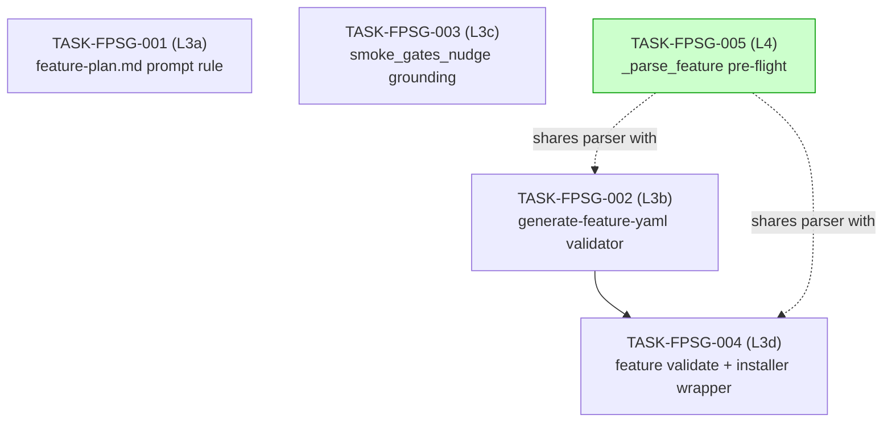

# Feature: `/feature-plan` smoke-gate path validation

**Feature slug**: `feature-plan-smoke-gate-validation`
**Parent review**: `TASK-REV-DEA8` (in `appmilla_github/forge/`)
**Cross-repo triggers**:
- **forge FEAT-DEA8 Run 2** (2026-05-02) — `/feature-plan` invented
  `tests/cli/` paths in its smoke_gates block; nothing in the guardkit
  pipeline rejected them. **Class A: invented paths.**
- **study-tutor FEAT-FD32 Run 2** (2026-05-02) — `/feature-plan`
  designed `after_wave: [2, 3]` for a gate that referenced a test file
  that **TASK-GR-SMOK in Wave 3 is supposed to create** (AC-SMOK-01).
  Firing the gate after Wave 2 was a chicken-and-egg failure: the file
  didn't yet exist, pytest exited 4. **Class B: temporal mis-sequencing.**

**Total estimate**: 7–12 hours across 5 small subtasks (L3a, L3b, L3c, L3d, L4 — see below — now scoped to cover both Class A and Class B)
**Prerequisites**: none

## Problem Statement

When `/feature-plan` runs against a target repository, the Plan agent
designs smoke-gate commands and `after_wave` values without verifying
them against (a) the target repo's actual filesystem AND (b) the wave
plan's own task→file-creation timeline. The current guardkit command
surface lets both classes of invented configuration reach
`.guardkit/features/FEAT-XXXX.yaml` unchallenged:

### Class A — paths that don't exist

The Plan agent invents pytest paths it has not verified against the
target repo's `tests/` tree. **Reproducer**: forge FEAT-DEA8 Run 2,
`tests/cli/` doesn't exist in forge.

### Class B — paths that don't exist *yet*

The Plan agent references test paths that a *later wave* of the same
feature is supposed to create, but sets `after_wave` to a wave number
that fires *before* that creation wave. **Reproducer**: study-tutor
FEAT-FD32 Run 2, gate fired `after_wave: [2, 3]` referencing
`tests/smoke/test_graphiti_live_smoke.py`, which TASK-GR-SMOK (Wave 3,
AC-SMOK-01) creates. After Wave 2 fired the gate → exit 4 → 4/5 tasks
blocked. The fix was changing `after_wave: [2, 3]` to `[3]` so the
gate fires only at the point in the build where its test file
actually exists.

### Existing guardkit gaps (apply to both classes)

1. `installer/core/commands/feature-plan.md` says "do not auto-generate
   smoke-gate commands" but does **not** say "do verify paths."
2. `installer/core/commands/lib/generate_feature_yaml.py` does not
   parse hand-injected `smoke_gates.command` for path validity.
3. `installer/core/commands/lib/smoke_gates_nudge.py`'s example block
   uses a generic `pytest tests/smoke -x` placeholder rather than the
   target repo's actual `tests/` subdirs.
4. `guardkit/orchestrator/feature_loader.py::FeatureLoader.validate_feature`
   does not check smoke-gate paths.
5. The installed `~/.agentecflow/bin/guardkit` shell wrapper does not
   expose the `feature` subcommand at all (`guardkit feature validate
   FEAT-XXXX` → `Unknown command: feature`), so even when
   `/feature-plan` Step 8.5 calls it, validation silently no-ops.
6. `guardkit/orchestrator/smoke_gates.py::run_smoke_gate` has an exit-5
   carve-out for "no tests collected" but no exit-4 carve-out and no
   pre-flight path check.

Net effect: a single bad path or a single bad `after_wave` value in a
hand-edited feature YAML bricks an otherwise-green N-task autobuild
run, with no upstream defence.

**Real-world incidents**:
- **forge FEAT-DEA8 Run 2** (2026-05-02, Class A) — 17 minutes
  of SDK budget burned, 10 of 11 tasks blocked, root cause was a
  single `tests/cli` token. Full diagnosis:
  [appmilla_github/forge/.claude/reviews/TASK-REV-DEA8-review-report.md](../../../forge/.claude/reviews/TASK-REV-DEA8-review-report.md).
  (Resolved 2026-05-02: feature shipped 11/11 tasks in 83m after Layer 1 fix.)
- **study-tutor FEAT-FD32 Run 2** (2026-05-02, Class B) —
  Wave 2 succeeded but smoke gate fired *after Wave 2* expecting a
  test file that *Wave 3 (TASK-GR-SMOK)* was supposed to create per
  AC-SMOK-01. pytest exited 4, 4/5 tasks blocked. Manual fix: change
  `after_wave: [2, 3]` → `[3]`. Full transcript:
  [appmilla_github/study-tutor/docs/history/autobuild-FEAT-FD32-failed-run-2-history](../../../study-tutor/docs/history/autobuild-FEAT-FD32-failed-run-2-history).

## Solution Approach

Five small, independently shippable edits — three at the
`/feature-plan` authoring surface, one at the
validator-and-CLI-wrapper layer, one as defense-in-depth at
feature-load time. The same defect must be rejected by **at least
two** layers before reaching `run_smoke_gate`.

| Subtask | Layer | What it changes | Effort |
|---|---|---|---|
| TASK-FPSG-001 | L3a | `/feature-plan.md` prompt: "Path verification — REQUIRED" rule | ~1h |
| TASK-FPSG-002 | L3b | `generate-feature-yaml --validate-smoke-gates` + `/feature-plan.md` Step 8.6 | ~2h |
| TASK-FPSG-003 | L3c | `smoke_gates_nudge` injects target repo's actual `tests/` subdirs | ~1h |
| TASK-FPSG-004 | L3d | `FeatureLoader.validate_feature` checks smoke-gate paths + installer wrapper exposes `feature` subcommand | ~3h |
| TASK-FPSG-005 | L4 | `_parse_feature` pre-flight at load time (defense-in-depth) | ~1.5h |

**Rejected from this feature** (documented for posterity):
- **L5** — promoting pytest exit 4 to a soft-warn carve-out in
  `run_smoke_gate`. Would silently mask path typos and degrade safety.
  See review §F9.

## Success Criteria

**Both defect classes** must be rejected at at least two of these
layers before reaching `run_smoke_gate`:

### Class A — invented paths (forge FEAT-DEA8 reproducer)

1. **Author time** — `/feature-plan` agent verifies paths (L3a) AND
   the `smoke_gates_nudge` shows correct paths to copy from (L3c).
2. **Generation time** — `generate-feature-yaml --validate-smoke-gates`
   rejects the YAML (L3b).
3. **Validation time** — `guardkit feature validate FEAT-XXXX` rejects
   the YAML (L3d).
4. **Load time** — `FeatureLoader._parse_feature` rejects the YAML
   before any wave fires (L4).

### Class B — temporal mis-sequencing (study-tutor FEAT-FD32 reproducer)

The validators (L3b, L3d, L4) must additionally check, for each
`after_wave` value W in `smoke_gates`:

- For every positional path P in `smoke_gates.command`:
  - Does P exist on disk **right now**? (Class A check.)
  - If P does NOT exist, does some task whose `wave < W` declare
    P (or a parent directory of P) in its `task_type=testing`
    test-output declarations? If yes → fine. If no →
    **reject as Class B mis-sequencing**.

This is more expensive than the Class A check because it requires
reading every task file in the feature and parsing what it
intends to create. A pragmatic shortcut: **if any path P doesn't
exist now AND there's any task with `wave >= W` that mentions P
in its acceptance criteria** → flag it as a likely Class B
mis-sequencing with a warning recommending the user move
`after_wave` to ≥ that task's wave.

### End-to-end tests

- **Class A fixture**: YAML with
  `smoke_gates.command: pytest tests/does-not-exist -x` →
  must be rejected by L3b, L3d, and L4.
- **Class B fixture**: YAML with `smoke_gates.command:
  pytest tests/created/by_wave_3.py -x` and `after_wave: [2]`,
  plus a task at wave 3 declaring `tests/created/by_wave_3.py`
  in its ACs → must be rejected by L3b, L3d, and L4 with a
  message naming the wave that creates the file.
- The agent prompt change (L3a) is verified by a contract test
  asserting the prompt contains both the path-verification rule
  AND the temporal-sequencing rule. The nudge change (L3c) is
  verified by a unit test against a tmp_path repo.

## Dependency Graph

L3a and L3c are pure prompt/output edits and can land independently.
L3b, L3d, and L4 share a small "parse positional pytest argv" helper
— that helper should live in one place
(suggest: `guardkit/orchestrator/smoke_gates.py` or a new
`guardkit/lib/pytest_argv.py`) and be imported by all three.

## Wave Plan

- **Wave 1 (parallel):** L3a, L3c, and the shared `pytest_argv`
  parser helper — independent edits, no shared state.
- **Wave 2 (parallel):** L3b and L4 — both consume the helper.
- **Wave 3 (sequential):** L3d — extends the validator (uses helper)
  AND fixes the installer wrapper (independent installer touchpoint;
  may want a separate worktree).

## Files

- `feature-plan-smoke-gate-validation/`
  - `README.md` (this file)
  - `IMPLEMENTATION-GUIDE.md` — wave breakdown + execution strategy
  - `TASK-FPSG-001-feature-plan-prompt-path-verification-rule.md` (L3a)
  - `TASK-FPSG-002-generate-feature-yaml-validate-smoke-gates.md` (L3b)
  - `TASK-FPSG-003-smoke-gates-nudge-target-repo-grounding.md` (L3c)
  - `TASK-FPSG-004-feature-validate-smoke-gate-paths-and-wrapper.md` (L3d)
  - `TASK-FPSG-005-feature-loader-preflight-smoke-gate-paths.md` (L4)
