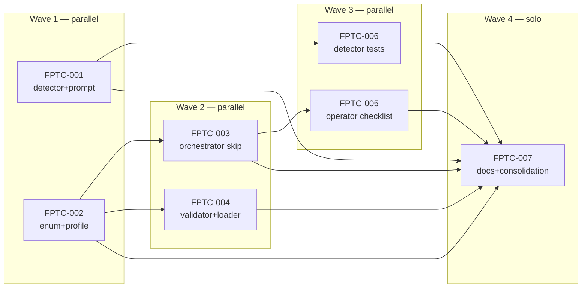

# Class C: `/feature-plan` task-design mismatch

**Feature slug**: `feature-plan-defects` (this is the Class C subfolder)
**Feature ID**: `FEAT-AUTM`
**Parent review**: [`TASK-REV-AUTM`](../../TASK-REV-AUTM-decide-how-feature-plan-handles-autobuild-unsuitable-tasks.md)
**Decision report**: [`.claude/reviews/TASK-REV-AUTM-review-report.md`](../../../../.claude/reviews/TASK-REV-AUTM-review-report.md)
**Total estimate**: ~11h across 7 small subtasks (3 waves)
**Prerequisites**: TASK-CVAC-001, TASK-CVAC-002 (both completed 2026-05-02 → 2026-05-03 — Coach validator AC-matching is settled, so Class C is no longer confounded by validator bugs)

## Problem statement

`/feature-plan` routinely emits acceptance criteria whose verification
predicate is `observed_at_runtime(real_world)` rather than
`present_in_codebase(artifact)`. Player and Coach cannot satisfy these
by construction — Coach grades by file-existence and test-passing,
which can never produce evidence for a runtime-observed claim, and
Player can scaffold for the observation but not perform it.

**Reproducers** (study-tutor FEAT-FD32, both manually completed
2026-05-03):
- TASK-GR-SEED — 7 of 8 ACs require live FalkorDB at `whitestocks:6379`.
  Outcome: 5 turns, 0/8 verified, `max_turns_exceeded`.
- TASK-GR-DEMO — 6 of 7 ACs require human-in-the-loop Claude Desktop
  session. Outcome: 5 turns, 0/7 verified, `max_turns_exceeded`.

**Cumulative cost in this single feature**: ~110 minutes of SDK budget
burned, 4 separate `--resume` cycles + 2 manual completions, ~3 hours
of debugging conversation across two days.

## Solution

**Shape D** (per parent review): plan-time detector + `task_type:
operator_handoff` enforcement. Two-layer defence:

1. **L3a — Detector at plan time** (TASK-FPTC-001): `/feature-plan`
   recognises strong signals (live infrastructure, human verbs,
   wall-clock language, author self-disclosure) and prompts the user
   to mark the task `operator_handoff`.
2. **L3b–L4 — Enforcer at run time** (TASK-FPTC-002, 003, 004): the
   orchestrator hard-skips `operator_handoff` tasks; CoachValidator
   and FeatureLoader treat them as deferred-without-validation.

The detector catches issues at the cheapest point (one prompt
round-trip). The enforcer is the safety net for cases the detector
misses. Both must miss for a Class C failure.

## Subtasks

| ID | Title | Layer | Wave | Effort |
|---|---|---|---|---|
| [TASK-FPTC-001](TASK-FPTC-001-feature-plan-detector-and-prompt.md) | `/feature-plan` detector + prompt | Plan | 1 | 2h |
| [TASK-FPTC-002](TASK-FPTC-002-task-type-operator-handoff-enum.md) | `OPERATOR_HANDOFF` enum + profile | Taxonomy | 1 | 1h |
| [TASK-FPTC-003](TASK-FPTC-003-orchestrator-skip-operator-handoff.md) | Orchestrator skips operator_handoff | Runtime | 2 | 2h |
| [TASK-FPTC-004](TASK-FPTC-004-validator-and-loader-awareness.md) | CoachValidator + FeatureLoader awareness | Validator | 2 | 1.5h |
| [TASK-FPTC-005](TASK-FPTC-005-feature-complete-operator-checklist.md) | `/feature-complete` operator checklist | Surface | 3 | 1.5h |
| [TASK-FPTC-006](TASK-FPTC-006-detector-tests-against-reproducers.md) | Detector tests vs reproducers | Tests | 3 | 2h |
| [TASK-FPTC-007](TASK-FPTC-007-docs-and-folder-consolidation.md) | Docs + folder consolidation | Docs | 4 | 1h |

## Wave plan



## Success criteria

Drawn from parent review AC-AUTM-01..06:

- [ ] Both reproducer ACs (AC-SEED-01, AC-DEMO-01) are flagged by the
      detector (verified by TASK-FPTC-006).
- [ ] An `operator_handoff` task does not enter the Player↔Coach loop
      (verified by TASK-FPTC-003 integration test).
- [ ] An `operator_handoff` task with all-runtime ACs loads cleanly
      (verified by TASK-FPTC-004).
- [ ] `/feature-complete` surfaces deferred tasks in the merge summary
      (verified by TASK-FPTC-005).
- [ ] False-positive guard verified — three benign-looking ACs do NOT
      trigger (verified by TASK-FPTC-006).
- [ ] All three classes documented in
      `docs/guides/feature-plan-task-classification.md` (verified by
      TASK-FPTC-007).

## Cross-class siblings

- **Class A — invented paths**:
  [`../class-a-invented-paths/`](../class-a-invented-paths/)
  — parent review TASK-REV-DEA8 (in `appmilla_github/forge/`).
- **Class B — temporal mis-sequencing**:
  [`../class-b-temporal-sequencing/`](../class-b-temporal-sequencing/)
  — stub folder; the temporal-check carve-out lives in the Class A
  validators (FPSG-002 / FPSG-004 / FPSG-005).
- **Operator-facing classification guide**:
  [`docs/guides/feature-plan-task-classification.md`](../../../../docs/guides/feature-plan-task-classification.md).
- **Sibling complete (validator AC-matching, orthogonal)**:
  [`tasks/completed/2026-05/coach-validator-ac-id-matching/`](../../../completed/2026-05/coach-validator-ac-id-matching/)
  — TASK-CVAC-001 (parser), TASK-CVAC-002 (bidirectional matching).

## Backwards compatibility

Per parent-review AC-AUTM-04: **no retroactive labelling of historical
features**. The manual completion of TASK-GR-SEED and TASK-GR-DEMO,
plus the YAML provenance comments in
`appmilla_github/study-tutor/.guardkit/features/FEAT-FD32.yaml`, are
sufficient historical record. forge FEAT-DEA8 already shipped 11/11
post-Class-A fix; not affected.

## Files (summary)

```
feature-plan-defects/class-c-task-design-mismatch/
├── README.md                   (this file)
├── IMPLEMENTATION-GUIDE.md     (wave-execution strategy)
├── TASK-FPTC-001-...md
├── TASK-FPTC-002-...md
├── TASK-FPTC-003-...md
├── TASK-FPTC-004-...md
├── TASK-FPTC-005-...md
├── TASK-FPTC-006-...md
└── TASK-FPTC-007-...md
```

The parent `feature-plan-defects/` folder also contains
`class-a-invented-paths/` and `class-b-temporal-sequencing/`,
consolidated by TASK-FPTC-007 from the previous
`feature-plan-smoke-gate-validation/` folder.
