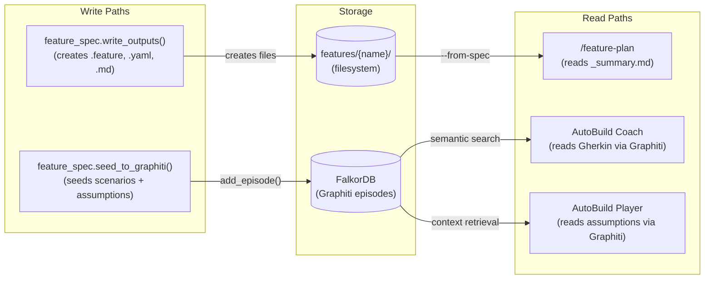
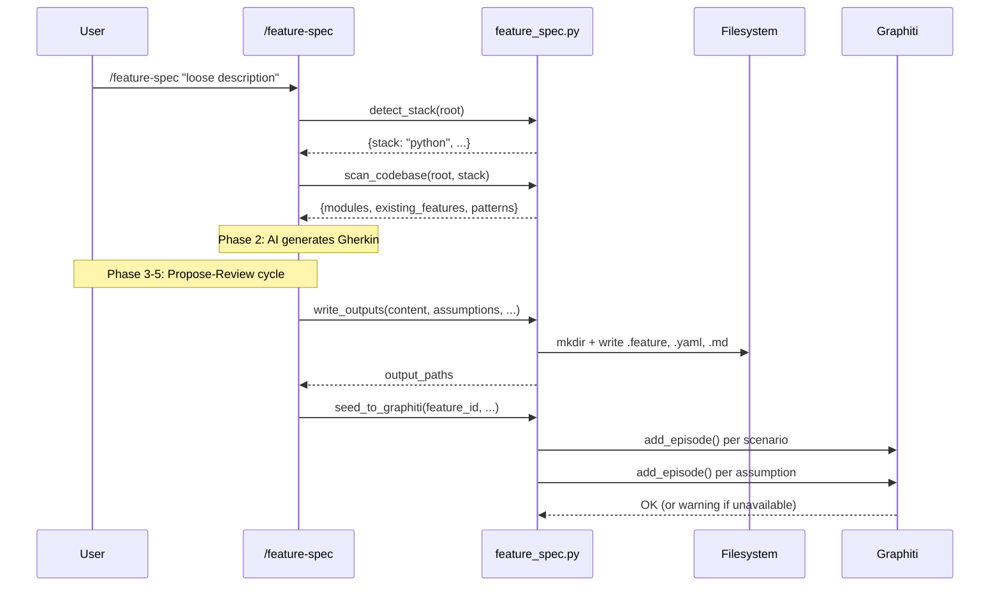
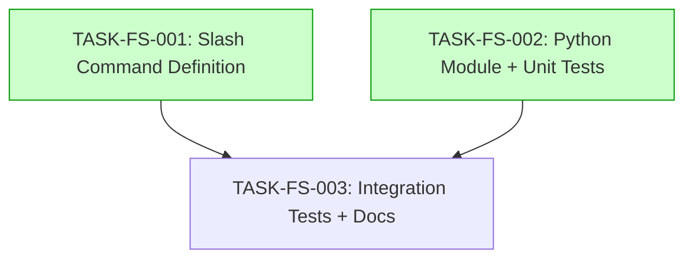

# Implementation Guide: /feature-spec Command (v1)

**Feature:** FEAT-FS01
**Aggregate Complexity:** 5/10 (Medium)
**Estimated Duration:** 4-6 hours
**Approach:** Direct from feature spec v2 (balanced trade-offs)

## Data Flow: Read/Write Paths

_All write paths have corresponding read paths. No disconnections detected._

## Integration Contracts

## Task Dependencies

_Tasks with green background (Wave 1) can run in parallel._

## Wave 1: TASK-FS-001 + TASK-FS-002 (Parallel)

### TASK-FS-001: Slash Command Definition (Complexity 6/10)

**What:** Create `.claude/commands/feature-spec.md` and `installer/core/commands/feature-spec.md`

**Why complexity 6:** The prompt methodology IS the product. Quality of the Gherkin generation depends entirely on how well the 6-phase cycle is encoded. Requires prompt engineering expertise and understanding of Specification by Example methodology.

**Key files to study (read-only):**
- `installer/core/commands/feature-plan.md` -- format conventions
- `.claude/commands/generate-bdd.md` -- what NOT to do

**Output:** Two identical markdown files encoding the propose-review methodology.

### TASK-FS-002: Python Module (Complexity 5/10)

**What:** Create `guardkit/commands/feature_spec.py` and `tests/unit/commands/test_feature_spec.py`

**Why complexity 5:** Standard Python module following established patterns. Stack detection is ~15 lines. File I/O follows `architecture_writer.py`. Graphiti seeding follows `seed_helpers.py`. The only novel aspect is parsing feature content into individual scenarios for seeding.

**Key patterns to follow:**
| Pattern | Source File |
|---------|-------------|
| Class structure | `guardkit/commands/feature_plan_integration.py` |
| Async + graceful degradation | `guardkit/commands/feature_plan_integration.py` |
| Graphiti seeding | `guardkit/knowledge/seed_helpers.py` |
| File output | `guardkit/planning/architecture_writer.py` |
| Test structure | `tests/unit/commands/test_feature_plan_integration.py` |

**Output:** Python module (~200-300 lines) + unit tests (~200 lines).

## Wave 2: TASK-FS-003 (After Wave 1)

### TASK-FS-003: Integration Tests + Documentation (Complexity 4/10)

**What:** Create `tests/integration/test_feature_spec_e2e.py` and `docs/commands/feature-spec.md`

**Why complexity 4:** Standard test fixtures with temporary directories. Documentation follows existing `docs/commands/` patterns if any exist, otherwise straightforward markdown.

**Key test scenarios:**
1. Stack detection priority (Python > TypeScript in polyglot repos)
2. File output structure and validity
3. Graphiti non-blocking on unavailable connection
4. Domain language in generated Gherkin (not implementation terms)

**Output:** Integration test file + user documentation.

## Quality Gates

| Gate | Threshold | Command |
|------|-----------|---------|
| Lint | 0 errors | `ruff check guardkit/commands/feature_spec.py` |
| Unit tests | 100% pass | `pytest tests/unit/commands/test_feature_spec.py -v` |
| Integration tests | 100% pass | `pytest tests/integration/test_feature_spec_e2e.py -v` |
| Import check | Success | `python -c "from guardkit.commands.feature_spec import ..."` |
| Command definition size | > 5000 bytes | `stat .claude/commands/feature-spec.md` |
| Documentation size | > 2000 bytes | `stat docs/commands/feature-spec.md` |
| File identity | Identical | `cmp .claude/commands/feature-spec.md installer/core/commands/feature-spec.md` |

## New Files Summary

| File | Task | Purpose |
|------|------|---------|
| `.claude/commands/feature-spec.md` | FS-001 | Slash command definition (project-local) |
| `installer/core/commands/feature-spec.md` | FS-001 | Slash command definition (global distribution) |
| `guardkit/commands/feature_spec.py` | FS-002 | Python orchestration module |
| `tests/unit/commands/test_feature_spec.py` | FS-002 | Unit tests |
| `tests/integration/test_feature_spec_e2e.py` | FS-003 | Integration tests |
| `docs/commands/feature-spec.md` | FS-003 | User documentation |

## Existing Files Modified

**None.** This feature is purely additive (constraint D11).
