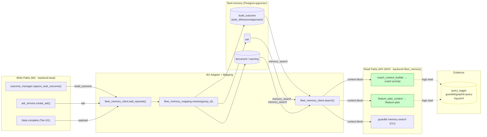
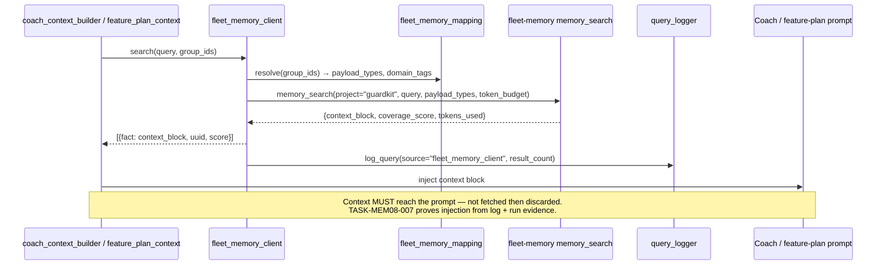
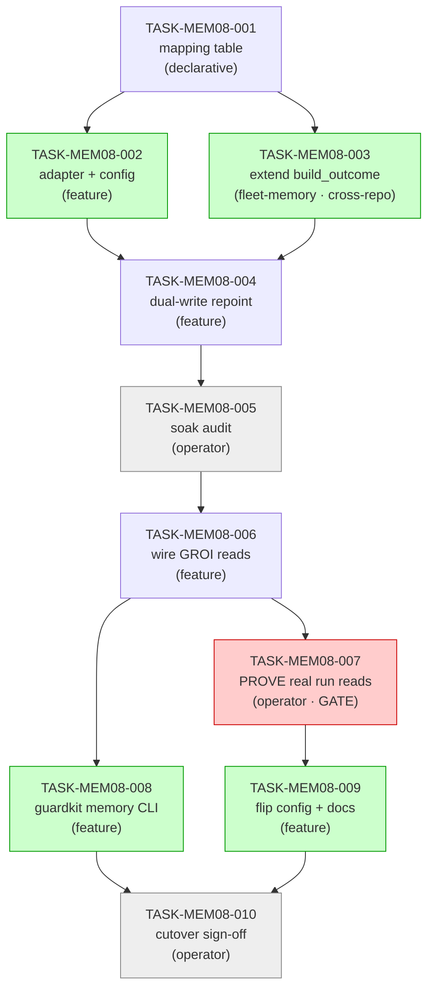

# FEAT-MEM-08 — Guardkit Graphiti → fleet-memory cutover · Implementation Guide

**Review:** TASK-REV-MEM08 · **Brief:** [`docs/design/specs/memory-cutover/FEAT-MEM-08-guardkit-cutover-feature-brief.md`](../../../docs/design/specs/memory-cutover/FEAT-MEM-08-guardkit-cutover-feature-brief.md) · **Gate:** ✅ FEAT-MEM-05 parity PASSED

Move guardkit's knowledge **writes** (task outcomes, decisions, ADRs) and **reads** (coach-context, feature-plan-context, CLI) off Graphiti onto fleet-memory (deterministic Postgres+pgvector, **no LLM**), dual-writing during a soak, and **prove the reads fire in a real run** (the acceptance gate). The mapping table is produced **first** — it drives everything.

> **Cross-repo:** TASK-MEM08-003 writes into the sibling **fleet-memory** repo; the feature YAML declares `evidence_repos: [../fleet-memory]` so the Coach collects that write (see `.claude/rules/evidence-boundary-narrower-than-write-surface.md`).
>
> **Operator gates:** TASK-MEM08-005 / -007 / -010 are `operator_handoff` — AutoBuild skips them; they require live NATS/Postgres + human observation and are verified post-merge via the `/feature-complete` checklist.

---

## Data Flow: Read/Write Paths

_What to look for: every write path (W2) lands a typed payload in fleet-memory, and every read path (W3) is fed from `memory_search` and **leaves a query-log trace** (yellow) — that trace is the TASK-MEM08-007 acceptance evidence. **No disconnected read/write paths**: every store node has both a writer and a reader._

**Disconnection check:** ✅ none. All three store payload types have a W2 writer and a W3 reader. The only intentionally one-way edges are the dotted evidence-logging edges (read → query_logger), which exist to satisfy the "prove a real run reads" gate.

---

## Integration Contracts (sequence — fetch-then-discard guard)

_What to look for: the context block must travel Reader → Prompt (the GROI anti-criterion). A reader that calls `memory_search` but never injects the block is the "fetch-then-discard" failure the acceptance gate (TASK-MEM08-007) exists to catch._

---

## Task Dependencies

_Green = parallel-safe within their wave. Grey = `operator_handoff` (live-infra gates). Red = the feature acceptance gate. The chain mapping→adapter→writes→soak→reads→PROVE→cli/flip→sign-off is genuinely sequential; the operator gates are the human pacing points._

### Execution waves

| Wave | Tasks | Notes |
|---|---|---|
| 1 | TASK-MEM08-001 | Mapping table — the design driver, produced first |
| 2 | TASK-MEM08-002, TASK-MEM08-003 | Adapter (guardkit) ‖ payload extension (fleet-memory) — different repos, parallel-safe |
| 3 | TASK-MEM08-004 | Dual-write repoint |
| 4 | TASK-MEM08-005 ⚙️ | **Operator:** dual-write soak audit (published == stored) |
| 5 | TASK-MEM08-006 | Wire GROI reads (after soak — brief's "soak before reads") |
| 6 | TASK-MEM08-007 ⚙️, TASK-MEM08-008 | **Operator:** PROVE a real run reads (acceptance gate) ‖ CLI (008 depends only on 006) |
| 7 | TASK-MEM08-009 | Config/docs flip — after the read proof |
| 8 | TASK-MEM08-010 ⚙️ | **Operator:** cutover verification + sign-off → green-light FEAT-MEM-09 |

_(Canonical waves are computed in `.guardkit/features/FEAT-MEM-08.yaml`; 008 is parallel-safe with the 007 operator gate as it depends only on 006.)_

---

## §4: Integration Contracts

### Contract: GROUP_ID_MAP (group_id → fleet-memory identity)
- **Producer task:** TASK-MEM08-001
- **Consumer task(s):** TASK-MEM08-002, TASK-MEM08-004, TASK-MEM08-006, TASK-MEM08-008
- **Artifact type:** in-process Python module (`guardkit/knowledge/fleet_memory_mapping.py`)
- **Format constraint:** `resolve(group_id) -> GroupMapping(project, payload_type ∈ {adr,review_report,build_outcome,pattern,warning,seed_module,document}, domain_tags: list[str], disposition ∈ {migrate,retire})`; `None` for unknown/retired (fail-open). `project`/group_id normalised underscore-only (`^[a-z0-9_]+$`).
- **Validation method:** Coach verifies `resolve()` exists, returns a `GroupMapping` for each of the 9 project + 20 system groups in `_group_defs.py`, and `None` for an unknown group; payload_type values are within the registered 7.

### Contract: BuildOutcomePayload (extended typed payload) — CROSS-REPO
- **Producer task:** TASK-MEM08-003 (in `../fleet-memory`)
- **Consumer task(s):** TASK-MEM08-004 (in guardkit)
- **Artifact type:** pydantic model (`fleet_memory.payloads.models.BuildOutcomePayload`)
- **Format constraint:** existing `status: str` + `duration_seconds: int`, **plus** optional `task_id: str|None`, `lessons: str|None`, `approach: str|None`; the three new fields must be included in the embedded/searchable content (not dropped by `extra="ignore"`). Natural key unchanged: `build_outcome:guardkit:<task_id>`.
- **Validation method:** fleet-memory tests round-trip a payload carrying the new fields and confirm retrieval by prose; guardkit TASK-MEM08-004 maps `capture_task_outcome` fields onto these.

### Contract: fleet_memory_client adapter surface
- **Producer task:** TASK-MEM08-002
- **Consumer task(s):** TASK-MEM08-004 (write), TASK-MEM08-006 (read), TASK-MEM08-008 (CLI)
- **Artifact type:** in-process client + factory (`get_memory_client()`)
- **Format constraint:** `search(query, group_ids, num_results, scope) -> list[{fact,uuid,score}]` (graphiti-shaped, adapted from `memory_search`'s single `context_block`, generous token budget); `add_episode(name, episode_body, group_id, source, entity_type) -> natural_key|None` (unmapped group → None, never raise); factory routes `graphiti|fleet_memory|dual` from config, default `graphiti`.
- **Validation method:** Coach verifies the search return shape and the unmapped-group no-op; `backend=graphiti` default leaves existing call-sites byte-for-byte unchanged.

### Contract: query-log read evidence
- **Producer task:** TASK-MEM08-006 (emits the log entry)
- **Consumer task(s):** TASK-MEM08-007 (operator — inspects it)
- **Artifact type:** JSONL log entry in `.guardkit/graphiti-query-log.jsonl`
- **Format constraint:** a fleet-memory read appends an entry with `source` identifying the fleet-memory backend, the query text, and `result_count`.
- **Validation method:** operator runs a real pipeline and confirms the entry exists with `result_count > 0` and a context block injected into the prompt.

---

## Risks & rollback

- **Not a 1:1 API swap.** Graphiti returns LLM-extracted facts/edges; `memory_search` returns one token-budgeted context block. ✅ All guardkit readers already consume flat `fact` text + score (verified) — keep the token budget **generous** so the relevant heading lands.
- **Retire, don't migrate** system seeds the harvest already covers (TASK-MEM08-001 decides per group).
- **Rollback at every stage:** `backend=graphiti` + `.guardkit/graphiti.yaml enabled:false→true` + the `guardkit graphiti` warn+delegate alias. Graphiti stays authoritative until TASK-MEM08-010 sign-off.
- **No `import fleet_memory` in guardkit.** fleet-memory is not a guardkit dependency (no `[tool.uv.sources]` entry / extra) and would `ModuleNotFoundError` in the autobuild worktree venv. guardkit reaches it via `nats_core.publish_episode` (writes — `nats_core` is wired by the `memory` extra) + the fleet-memory MCP tools (reads). The YAML sets `bootstrap_extras: [dev, memory]` and `evidence_repos: [../fleet-memory]` (the latter so the Coach collects TASK-MEM08-003's cross-repo write). See [[env-bootstrap-uvsources-gotcha]] / `.claude/rules/uv-sources-must-survive-every-install-path.md`.
- **Smoke gate (R3):** not auto-injected — test paths (e.g. `tests/unit/knowledge/test_fleet_memory_client.py`) are created by this feature and must be verified against the repo's `tests/` tree before any `smoke_gates` block is added. Add one only after the W2/W3 test files exist.

## Next steps

1. Review this guide + the 10 task files in `tasks/backlog/memory-cutover/`.
2. Confirm `evidence_repos: [../fleet-memory]` in `.guardkit/features/FEAT-MEM-08.yaml` (for TASK-MEM08-003).
3. Run Wave 1 (`/task-work TASK-MEM08-001` or `/feature-build FEAT-MEM-08`); pause at each operator gate (W4/W6/W8) to do the live soak / proof / sign-off.
