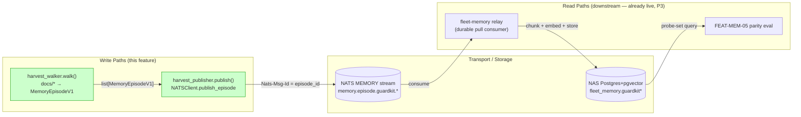
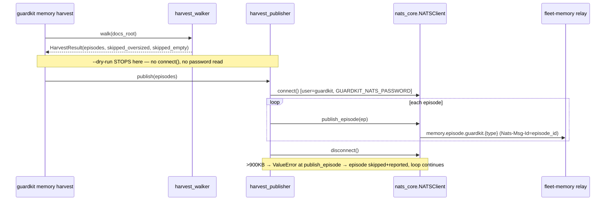
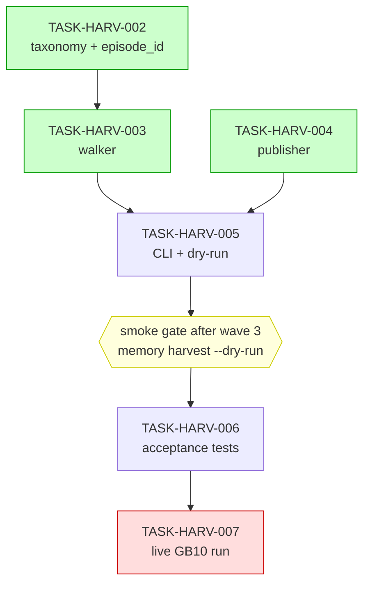

# Implementation Guide — Guardkit memory harvest publisher (FEAT-HARV)

> **Source brief**: [`docs/design/specs/memory-publisher/P4-harvest-publisher-feature-brief.md`](../../../docs/design/specs/memory-publisher/P4-harvest-publisher-feature-brief.md)
> **Planning record**: [`TASK-REV-HARV`](./TASK-REV-HARV-plan-memory-harvest-publisher.md)
> **Contract**: `nats_core.NATSClient.publish_episode(MemoryEpisodeV1)` — verified live 2026-06-25.

P4 is the **first real publisher onto the post-Graphiti memory write path**. The relay
(P3) is live and waiting on `memory.episode.>`; this feature walks guardkit's knowledge
artifacts and publishes each as a `MemoryEpisodeV1` so episodes flow through to the live
NAS Postgres store.

## Decisions baked into this plan (clarified 2026-06-25)

| Decision | Choice |
|---|---|
| Harvest scope | Curated, config-driven allow-list (excludes archive/checkpoints/state/history) |
| CLI surface | New `guardkit memory` Click group (`guardkit memory harvest [--dry-run]`) |
| Oversized (>900 KB) docs | Skip + report (path + size); never abort the run |
| Live GB10 run | Included as `operator_handoff` (TASK-HARV-007) |

## Data Flow: Read/Write Paths



_What to look for: every write path has a live downstream reader — the P3 relay is
already consuming `memory.episode.>`. **No disconnected write paths.** The only "stops
here" is the deliberate `--dry-run` short-circuit (see the sequence diagram), which is a
read-only preview, not a dropped write._

## Integration Contracts (sequence)



_What to look for: the walker hands a complete `list[MemoryEpisodeV1]` to the publisher
(no "fetch then discard"). The 900 KB guard lives inside `publish_episode`; the publisher
catches its `ValueError` per-episode so one oversized doc never aborts the harvest._

## Task Dependencies



_Green = parallel-safe within a wave (Wave 1: 002+004 — both dependency-free; the
`nats-core` dep is pre-wired in pyproject, no setup task). Yellow = the post-wave-3 smoke
gate. Red = the `operator_handoff` live run AutoBuild will not attempt._

### Execution waves

| Wave | Tasks | Notes |
|---|---|---|
| 1 | TASK-HARV-002, TASK-HARV-004 | taxonomy/episode_id + publisher — both dependency-free, parallel |
| 2 | TASK-HARV-003 | walker (needs taxonomy) — producer of the `MemoryEpisodeV1` contract |
| 3 | TASK-HARV-005 | CLI wires walker + publisher |
| — | **smoke gate** | after wave 3: `python -m guardkit.cli.main memory harvest --dry-run` (NATS-free) |
| 4 | TASK-HARV-006 | acceptance suite over the assembled CLI |
| 5 | TASK-HARV-007 | live GB10 run (operator) |

### Build prerequisites (resolved at planning time)

| Concern | Resolution |
|---|---|
| `nats_core` importable in every wave's **isolated worktree venv** (AutoBuild bootstraps `<repo>/.guardkit/worktrees/<feat>/.venv` via `uv pip install -e .[<extras>]`) | `pyproject.toml` declares `nats-core` in `[tool.uv.sources]` (editable `../nats-core`) + a `memory` extra; **FEAT-HARV.yaml sets `bootstrap_extras: [dev, memory]`** so the bootstrap installs it. `dev` is kept so Coach still gets `pytest` (operator extras suppress the auto-add). The nested-worktree relative path resolves via the orchestrator's auto-created bridging symlink (same mechanism as `guardkitfactory`). Verified: `import nats_core` → ok. |
| Composition failure (assembled walker→CLI broken while per-task tests pass) | Feature-level **smoke gate after wave 3**: runs `memory harvest --dry-run` (NATS-free) in the shared worktree; failure feeds back to the Player (not a hard terminator). |

## §4: Integration Contracts

### Contract: MemoryEpisodeV1
- **Producer task:** TASK-HARV-003 (harvest walker)
- **Consumer task(s):** TASK-HARV-004 (publisher)
- **Artifact type:** in-process pydantic object (`nats_core.events.MemoryEpisodeV1`)
- **Format constraint:** `project_id="guardkit"` (underscores only — a hyphen is DLQ
  poison at the relay); `episode_type ∈ {adr, review_report, feature_outcome, document}`
  and matches `^[a-zA-Z0-9][a-zA-Z0-9\-_]*$`; `content_format ∈ {markdown, text, json}`;
  `body` non-empty and ≤ 900 KB (`MAX_EPISODE_BODY_BYTES`); `episode_id` deterministic
  `ep-<sha256(natural_key)[:16]>`.
- **Validation method:** Coach runs TASK-HARV-004's seam tests
  (`@pytest.mark.integration_contract("MemoryEpisodeV1")`) asserting each constraint, and
  TASK-HARV-006 asserts the subject resolves to `memory.episode.guardkit.{episode_type}`.

### Contract: GUARDKIT_NATS_PASSWORD
- **Producer:** external — provisioned infra (`nats-infrastructure` commit `5c3b8df`);
  secret in `nats-infrastructure/.env` (gitignored, GB10-local). **Not** a task in this
  feature.
- **Consumer task(s):** TASK-HARV-004 (publisher), via TASK-HARV-005 (CLI `--env-file`)
- **Artifact type:** environment variable (secret)
- **Format constraint:** plain string, wrapped in `pydantic.SecretStr`; the `guardkit`
  user has `publish memory.episode.>` only (no `$JS.>`, no subscribe).
- **Validation method:** TASK-HARV-004 raises an actionable error when the variable is
  missing/blank (asserted in unit tests); live auth is confirmed by TASK-HARV-007.

### Contract: NATS connection (NATSConfig)
- **Producer:** `nats_core.config.NATSConfig` (the helper)
- **Consumer task(s):** TASK-HARV-004
- **Artifact type:** connection config
- **Format constraint:** `url="nats://127.0.0.1:4222"`, `user="guardkit"`,
  `password=SecretStr(...)`, `name="guardkit-harvest"`; lifecycle is
  `connect()` → `publish_episode()` → `disconnect()` (**not** `.close()`).
- **Validation method:** TASK-HARV-004 unit tests assert the call ordering against a fake
  client; TASK-HARV-007 confirms a real connection on the GB10.

## Guardrails (do not violate)

- **Do not hand-roll NATS publishing** — subject building, the `Nats-Msg-Id` header, and
  the 900 KB guard are owned by `publish_episode`.
- **Import the 900 KB ceiling** from `nats_core.events.MAX_EPISODE_BODY_BYTES`; never
  hardcode it (keeps the walker's skip threshold and the publisher's reject threshold in
  lockstep).
- **`project_id` is the literal `"guardkit"`** — underscores only.
- **Determinism is load-bearing** — `episode_id` must be a pure function of the natural
  key, identical to fleet-memory's algorithm. A random id per run re-stores everything.
- **Do not re-plan the broker user** — it exists and is verified.

## Run after merge

```bash
guardkit memory harvest --dry-run    # counts per type, no connection
guardkit memory harvest              # publish (idempotent; safe to re-run)
```
Then complete TASK-HARV-007's operator checklist (live GB10 + Postgres verification).
