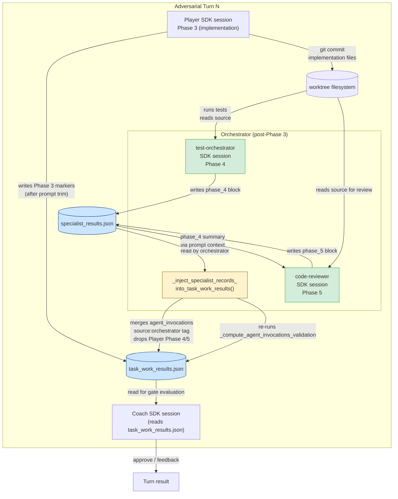
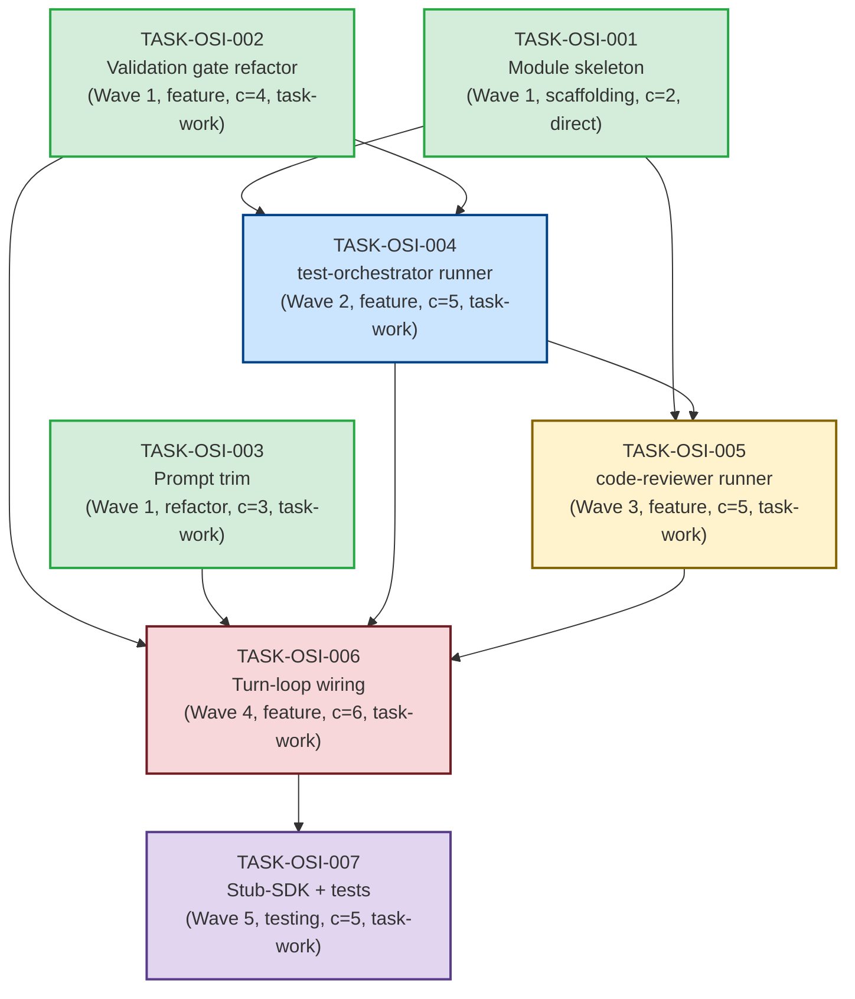

# Implementation Guide — Orchestrator-Side Specialist Invocation (FEAT-AB59)

**Parent review**: TASK-REV-119C1
**Review report**: [docs/reviews/orchestrator-side-specialist-invocation/TASK-REV-119C1-review-report.md](../../../docs/reviews/orchestrator-side-specialist-invocation/TASK-REV-119C1-review-report.md)
**Sibling follow-ups**: TASK-DIAG-F4A2 (completed), TASK-FIX-F4A3 (completed)
**Acceptance targets**:
- `jarvis-FEAT-J002-run-N` ≥ 18/23 tasks (vs. 14/23 baseline)
- `forge-FEAT-FORGE-002-run-N` ≥ 10/11 Wave-2 tasks (vs. 0/3)

---

## 1. Problem and locked-in solution direction

TASK-REV-F4A1 confirmed (H-B + H-G) that the Player LLM in the AutoBuild SDK
subprocess has a strong inference-time prior to complete test execution and
code review **inline** via `Bash`/`Edit`/`Write` rather than delegating to
`test-orchestrator` and `code-reviewer` specialists via the `Task` tool.
Three fresh runs across two repos (forge-run-3, forge-run-5,
jarvis-FEAT-002-run-2) showed **zero** `Task(subagent_type=...)` invocations
despite the prompt explicitly mandating them. TASK-FIX-7A08 attempted to
fix this with prompt wording and was reverted across three commits because
the prompt-class fix-class is insufficient.

The locked-in solution is to remove the Player's discretion: the
`AutoBuildOrchestrator` itself invokes `test-orchestrator` (Phase 4) and
`code-reviewer` (Phase 5) directly, after the Player completes Phase 3.
Each specialist gets its own `ClaudeAgentOptions` and SDK session.

The producer-side `agent_invocations_validation` gate is updated to credit
orchestrator-invoked specialists the same way it credits Player-invoked
ones, with structural source-tag dedup as the backstop against any residual
Player-emitted Phase 4/5 markers.

---

## 2. Subtask map

| Wave | Task | Title | Type | Cmplx | Mode | File |
|---|---|---|---|---|---|---|
| 1 | TASK-OSI-001 | Module skeleton `specialist_invocations.py` | scaffolding | 2 | direct | [TASK-OSI-001-module-skeleton-specialist-invocations.md](TASK-OSI-001-module-skeleton-specialist-invocations.md) |
| 1 | TASK-OSI-002 | Validation gate refactor | feature | 4 | task-work | [TASK-OSI-002-validation-gate-refactor.md](TASK-OSI-002-validation-gate-refactor.md) |
| 1 | TASK-OSI-003 | Prompt trim Phase 4/5 | refactor | 3 | direct | [TASK-OSI-003-prompt-trim-phase-4-5.md](TASK-OSI-003-prompt-trim-phase-4-5.md) |
| 2 | TASK-OSI-004 | `test-orchestrator` runner | feature | 5 | task-work | [TASK-OSI-004-test-orchestrator-runner.md](TASK-OSI-004-test-orchestrator-runner.md) |
| 3 | TASK-OSI-005 | `code-reviewer` runner | feature | 5 | task-work | [TASK-OSI-005-code-reviewer-runner.md](TASK-OSI-005-code-reviewer-runner.md) |
| 4 | TASK-OSI-006 | Turn-loop wiring in `autobuild.py` | feature | 6 | task-work | [TASK-OSI-006-turn-loop-wiring.md](TASK-OSI-006-turn-loop-wiring.md) |
| 5 | TASK-OSI-007 | Stub-SDK harness + behavioural test | testing | 5 | task-work | [TASK-OSI-007-stub-sdk-harness-and-tests.md](TASK-OSI-007-stub-sdk-harness-and-tests.md) |

**Aggregate complexity**: 30. Estimated wall-clock with `/feature-build`:
4–6 hours assuming Wave 1 runs in parallel via Conductor.

---

## 3. Mandatory diagrams

### 3.1 Data Flow — Player → Orchestrator → Specialists → Gate → Coach



**What to look for**: every write path has a corresponding read. The Coach
reads only `task_work_results.json` (single source of truth). No
disconnections.

---

### 3.2 Sequence — Turn N execution (Integration Contracts)

```mermaid
sequenceDiagram
    participant ABO as AutoBuildOrchestrator
    participant AI as AgentInvoker
    participant SI as specialist_invocations.py
    participant SDK as claude_agent_sdk.query
    participant FS as Worktree FS

    Note over ABO,FS: Phase 3 — Player implementation
    ABO->>AI: invoke_player(task_id, turn)
    AI->>SDK: query(prompt, options[Player tools])
    SDK-->>AI: stream (Phase 3 only)
    AI->>FS: write task_work_results.json (Phase 3)
    AI-->>ABO: AgentInvocationResult(success=True)

    Note over ABO,FS: Guard — skip if implementation_mode == "direct"
    alt impl_mode != "direct"
        Note over ABO,FS: Phase 4 — test-orchestrator (orchestrator-side)
        ABO->>SI: invoke_test_orchestrator(worktree, task_id, ...)
        SI->>SDK: query(prompt, options[Read,Write,Bash,Search])
        SDK-->>SI: stream
        SI->>FS: write specialist_results.json (phase_4)
        SI-->>ABO: SpecialistInvocationResult(phase="4", status)

        Note over ABO,FS: Phase 5 — code-reviewer (conditional on Phase 4 pass)
        alt phase4_result.status == "passed"
            ABO->>SI: invoke_code_reviewer(worktree, task_id, phase4_result, ...)
            SI->>SDK: query(prompt+phase4_summary, options[Read,Search,Grep])
            SDK-->>SI: stream
            SI->>FS: append specialist_results.json (phase_5)
            SI-->>ABO: SpecialistInvocationResult(phase="5", status)
        else phase4 failed
            Note over ABO: skip code-reviewer; record phase_5=skipped
        end

        Note over ABO,FS: Gate credit injection
        ABO->>AI: _inject_specialist_records_into_task_work_results(...)
        AI->>FS: read specialist_results.json
        AI->>FS: read task_work_results.json
        AI->>AI: dedup Player Phase 4/5 entries (source tag)
        AI->>AI: re-run _compute_agent_invocations_validation
        AI->>FS: write task_work_results.json (merged)
    else direct mode
        Note over ABO: skip Phases 4/5 entirely; quality_gates_relaxed=True
    end

    Note over ABO,FS: Coach evaluation
    ABO->>AI: invoke_coach(task_id, turn)
    AI->>SDK: query(coach_prompt, options[Read,Bash])
    SDK-->>AI: stream
    AI->>FS: read task_work_results.json (gate already credited)
    AI-->>ABO: AgentInvocationResult(decision=approve|feedback)
```

**What to look for**: where data is retrieved but not passed onward (the
"fetch then discard" pattern). None present here — `phase4_result` flows
into `code-reviewer`'s prompt; `specialist_results.json` flows into
`_inject_specialist_records`; merged `task_work_results.json` flows into
Coach.

---

### 3.3 Task Dependency Graph



**Wave 1 (parallel-safe)**: TASK-OSI-001, TASK-OSI-002, TASK-OSI-003 touch
disjoint files (`specialist_invocations.py` is new; gate refactor is in
`agent_invoker.py`; prompt trim is in `prompts/`).

**Wave 2**: TASK-OSI-004 (`test-orchestrator` runner) — depends on the
module skeleton + gate refactor.

**Wave 3**: TASK-OSI-005 (`code-reviewer` runner) — depends on
TASK-OSI-004's `SpecialistInvocationResult` → `phase4_result` parameter
contract.

**Wave 4**: TASK-OSI-006 (turn-loop wiring) — depends on both runners and
the prompt trim.

**Wave 5**: TASK-OSI-007 (stub-SDK harness + tests) — pre-merge gate for
the entire feature.

---

## 4. §4: Integration Contracts

### Contract: SPECIALIST_RESULTS_JSON

- **Producer task**: TASK-OSI-004 (`invoke_test_orchestrator` writes
  `phase_4` block); TASK-OSI-005 (`invoke_code_reviewer` appends `phase_5`
  block).
- **Consumer task(s)**: TASK-OSI-002
  (`_inject_specialist_records_into_task_work_results` reads it and
  merges into `task_work_results.json`); TASK-OSI-005
  (`invoke_code_reviewer` reads `phase_4` block via prompt context);
  TASK-OSI-006 (turn-loop wiring orchestrates the writes and the merge);
  TASK-OSI-007 (stub-SDK harness asserts schema correctness).
- **Artifact type**: JSON file at
  `.guardkit/autobuild/{task_id}/specialist_results.json` on the
  worktree filesystem.
- **Format constraint**: JSON object with top-level keys `phase_4`
  (always present after `invoke_test_orchestrator`) and `phase_5`
  (present only after `invoke_code_reviewer`). Each phase block
  contains:
  - `status: "passed" | "failed" | "skipped"` (required)
  - `duration_seconds: float` (required)
  - `error: str | null` (required; null on success)
  - Phase-specific fields:
    - `phase_4`: `tests_run`, `tests_failed`, `coverage_pct`,
      `output_summary`, `quality_gates_passed`
    - `phase_5`: `issues` (list), `quality_score` (float),
      `recommendations` (list), `output_summary`
- **Validation method**: TASK-OSI-007's stub-SDK test asserts the file
  exists and has the correct schema after a full non-`direct` turn.
  TASK-OSI-002's unit tests assert merge behaviour produces correct
  `agent_invocations` entries.

### Contract: GATE_CREDIT (in-place mutation of task_work_results.json)

- **Producer task**: TASK-OSI-002
  (`_inject_specialist_records_into_task_work_results`).
- **Consumer task(s)**: TASK-OSI-006 (calls inject before Coach);
  TASK-OSI-007 (asserts post-merge gate state).
- **Artifact type**: In-place mutation of
  `.guardkit/autobuild/{task_id}/task_work_results.json`.
- **Format constraint**: `task_work_results.json["agent_invocations"]`
  is a list. Orchestrator-injected entries carry:
  - `source: "orchestrator"` (required)
  - `phase: "4" | "5"` (required)
  - `agent: "test-orchestrator" | "code-reviewer"` (required)
  - `status, duration_seconds, result_file` (required)

  Player-emitted Phase 4/5 entries (no `source` or `source: "player"`)
  are dropped during the merge.

  `task_work_results.json["agent_invocations_validation"]` is the
  output of `_compute_agent_invocations_validation` re-run post-injection.
  Coach reads this existing field — no schema change needed on the
  Coach side.
- **Validation method**: TASK-OSI-007 asserts
  `agent_invocations_validation.status == "passed"` after a successful
  loop and `[]` `missing_phases`. TASK-OSI-002 unit tests assert dedup
  of Player-emitted markers.

### Contract: STUB_SDK (in-process)

- **Producer task**: TASK-OSI-007 (harness implementation).
- **Consumer task(s)**: TASK-OSI-007 (test assertions only).
- **Artifact type**: In-process `StubSDKRecorder` class that replaces
  `claude_agent_sdk.query` during integration tests via
  `monkeypatch.setattr`.
- **Format constraint**: Records `InvocationRecord(agent_type,
  prompt_prefix[:100], allowed_tools, cwd, return_status)` per `query`
  call. Returns a pre-baked `AgentInvocationResult` shape and writes a
  pre-baked `specialist_results.json` so downstream logic works without
  a real SDK response.
- **Validation method**: Test assertions in
  `test_autobuild_phase_4_5_orchestration.py` assert exact invocation
  order, `allowed_tools` values, and gate status post-merge. See
  TASK-OSI-007 acceptance criteria for the full list.

---

## 5. Risk register (top 6, full register in review report §7)

| Risk | Mitigation owner |
|---|---|
| Player phase-marker double-count | TASK-OSI-002 (source-tag dedup) + TASK-OSI-003 (prompt trim) |
| `implementation_mode: direct` regression | TASK-OSI-006 (guard) + TASK-OSI-002 (`get_expected_phases("direct")` audit) + TASK-OSI-007 (regression test) |
| Stub-SDK drift from real SDK behaviour | TASK-OSI-007 (scope harness narrowly: call-order + tools, not message content) + nightly canonical-task run with TASK-DIAG-F4A2 preservation |
| Specialist session leak (cleanup on failure) | TASK-OSI-001 (try/finally + `_kill_child_claude_processes`) + TASK-OSI-004/005 (cancellation event propagation) |
| Test artefact propagation gap | TASK-OSI-005 (`phase4_result` required arg + Phase 4 summary in prompt) + TASK-OSI-007 (assertion on prompt content) |
| Gate-credit silent failure | TASK-OSI-002 (writes `validator_error` on absent file, never raises) + TASK-OSI-007 (assert gate block always present) |

---

## 6. Acceptance test mapping

| Target | Baseline | Goal | Unblocking subtasks | Verification |
|---|---|---|---|---|
| `jarvis-FEAT-J002-run-N` ≥ 18/23 | 14/23 | ≥ 18/23 | TASK-OSI-002 + TASK-OSI-003 + TASK-OSI-004 + TASK-OSI-005 + TASK-OSI-006 | Live run after TASK-OSI-006 merges; assert tasks previously stalling on `coach_agent_invocations_stall` (TASK-J002-009, TASK-J002-014) no longer stall |
| `forge-FEAT-FORGE-002-run-N` ≥ 10/11 Wave-2 | 0/3 | ≥ 10/11 | Same chain as above | Live run after TASK-OSI-006 merges; assert Wave-2 specialist invocations recorded in `messages.jsonl` (with TASK-DIAG-F4A2 preservation enabled) |
| Pre-merge gate (no live SDK) | n/a | passes deterministically | TASK-OSI-007 | CI pipeline; runs in <30s with no API calls |

---

## 7. Execution strategy

**Wave 1 (parallel via Conductor)** — 3 tasks:
- TASK-OSI-001 (`direct` mode, scaffolding, ~30 min)
- TASK-OSI-002 (`task-work` mode, ~60 min)
- TASK-OSI-003 (`direct` mode, ~30 min)

**Wave 2** — single task:
- TASK-OSI-004 (~75 min)

**Wave 3** — single task:
- TASK-OSI-005 (~75 min)

**Wave 4** — single task, the load-bearing change:
- TASK-OSI-006 (~90 min)

**Wave 5** — pre-merge gate:
- TASK-OSI-007 (~75 min)

Total estimated work: ~5.5 hours sequential; ~4 hours with Wave 1 parallelism.

---

## 8. Next steps

1. Review this guide.
2. Review the [README](README.md) for problem context and solution shape.
3. Execute the feature via `/feature-build FEAT-AB59`, OR
4. Work the subtasks individually starting with Wave 1:
   - `/task-work TASK-OSI-001`
   - `/task-work TASK-OSI-002`
   - `/task-work TASK-OSI-003`
   - (then Wave 2, etc.)

---

## 9. Disconnection check

The data flow diagram (§3.1) shows every write path has a corresponding
read. **No disconnections.** The Coach reads `task_work_results.json` —
the single source of truth, populated by the merge step in TASK-OSI-002.
The `code-reviewer` reads `phase_4` data via the prompt context passed by
TASK-OSI-005. The `_inject_specialist_records` function reads
`specialist_results.json` (produced by TASK-OSI-004 and TASK-OSI-005)
and writes to `task_work_results.json` (read by Coach).

This satisfies the disconnection rule.
