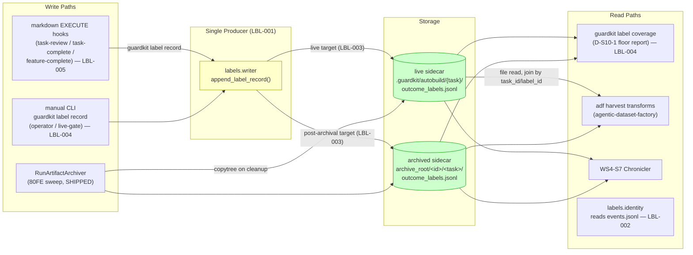
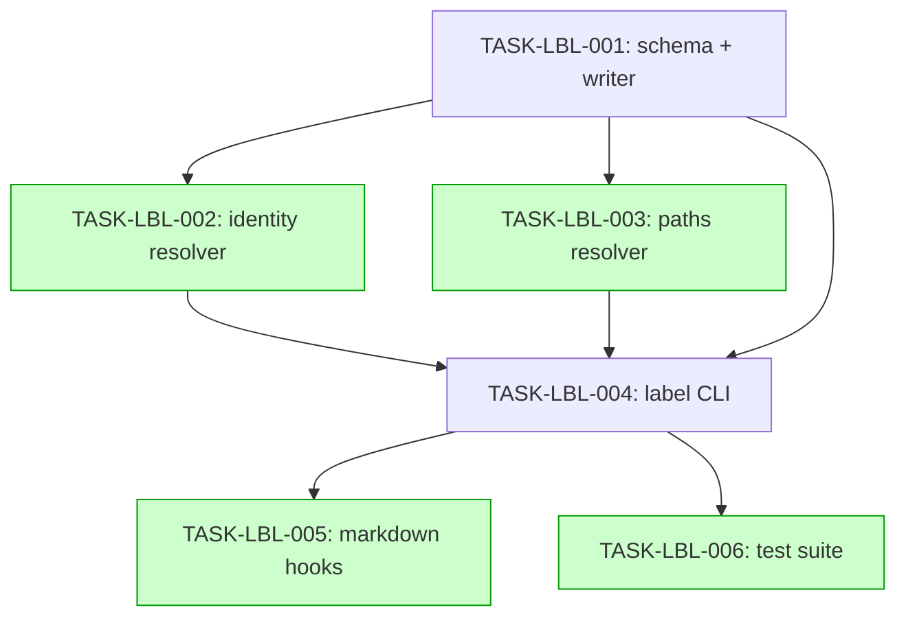

# Implementation Guide: Outcome-Label Sidecar (FEAT-0D1C)

**Parent review**: TASK-REV-3359 (report: `.claude/reviews/TASK-REV-3359-review-report.md`)
**BDD spec**: `features/outcome-label-sidecar/outcome-label-sidecar.feature` (21 scenarios)
**Approach**: Option B — producer owns identity + path resolvers
**Aggregate complexity**: 5 · **Estimated effort**: 5–8h

## Data Flow: Read/Write Paths



_Look for: every write funnels through ONE producer; both storage locations feed
every reader. R2/R3 are external consumers (cross-repo) — their read contract is
the JSONL schema itself, frozen in LBL-001._

**Disconnection check**: no disconnected paths. All write paths reach storage
through the single producer; all read paths have live callers (coverage CLI is
in-repo; adf/Chronicler are the external consumers this feature exists for —
their wiring lands in their own repos and joins purely by file read, which is
the point).

## Integration Contracts (sequence)

```mermaid
sequenceDiagram
    participant MD as markdown hook (LBL-005)
    participant CLI as guardkit label record (LBL-004)
    participant P as paths.resolve_label_target (LBL-003)
    participant I as identity.resolve_run_identity (LBL-002)
    participant W as writer.append_label_record (LBL-001)
    participant FS as sidecar JSONL

    MD->>CLI: --task-id --source --source-ref --non-blocking
    CLI->>P: task_id, repo_root
    P-->>CLI: LabelTarget(dir, live|archive) or error
    CLI->>I: evidence_dir (the RESOLVED dir — archived events still join)
    I-->>CLI: (run_id, attempt) or (None, None)
    CLI->>W: OutcomeLabelRecord (label_id content-addressed)
    W->>FS: append ONE line (O_APPEND)
    W-->>CLI: LabelWriteResult
    CLI-->>MD: label_id printed; exit 0 even on failure (--non-blocking, warning)

    Note over CLI,W: No data fetched is discarded — identity flows into the record;<br/>target flows into the write; result flows back to the hook as warning-or-id.
```

## Task Dependencies



_Tasks with green background can run in parallel (002∥003 in wave 2; 005∥006 in wave 4)._

## Execution Strategy

| Wave | Tasks | Mode | Notes |
|---|---|---|---|
| 1 | TASK-LBL-001 | direct | Foundation: schema + the one writer |
| 2 | TASK-LBL-002 ∥ TASK-LBL-003 | direct | Separate files, no shared state |
| 3 | TASK-LBL-004 | task-work | Integrates all three; freezes the CLI contract |
| 4 | TASK-LBL-005 ∥ TASK-LBL-006 | direct | Both consume only 004's frozen contract |

Testing depth: **standard** (quality gates; LBL-006 carries the regression suite).

## §4: Integration Contracts

### Contract: append_label_record
- **Producer task:** TASK-LBL-001
- **Consumer task(s):** TASK-LBL-004
- **Artifact type:** Python API (`guardkit/labels/writer.py`)
- **Format constraint:** `append_label_record(record: OutcomeLabelRecord, target_dir: Path) -> LabelWriteResult`; fail-open (never raises); ONE JSON line per call. The CLI must never open `outcome_labels.jsonl` itself.
- **Validation method:** Coach verifies the CLI imports and calls the writer (no direct file open of `outcome_labels.jsonl` in `guardkit/cli/label.py`); seam test patches the writer and asserts routing.

### Contract: resolve_run_identity
- **Producer task:** TASK-LBL-002
- **Consumer task(s):** TASK-LBL-004
- **Artifact type:** Python API (`guardkit/labels/identity.py`)
- **Format constraint:** returns `(Optional[str], Optional[int])`; `(None, None)` = absent identity, serialized as JSON `null` — never fabricated.
- **Validation method:** seam test records against an evidence dir with no `events.jsonl` and asserts `run_id`/`attempt` are `null` in the written line.

### Contract: resolve_label_target
- **Producer task:** TASK-LBL-003
- **Consumer task(s):** TASK-LBL-004
- **Artifact type:** Python API (`guardkit/labels/paths.py`)
- **Format constraint:** `LabelTarget(directory, location: "live"|"archive", error)`; archive root obtained ONLY via `guardkit.worktrees.archive.get_archive_root_from_env` (env var `GUARDKIT_ARCHIVE_ROOT`).
- **Validation method:** seam test monkeypatches `GUARDKIT_ARCHIVE_ROOT` and asserts the record lands under that root's `<id>/<task_id>/` nesting.

### Contract: guardkit label record CLI
- **Producer task:** TASK-LBL-004
- **Consumer task(s):** TASK-LBL-005 (markdown hooks), external operators
- **Artifact type:** CLI command
- **Format constraint:** flags `--task-id --source {task-review|task-fix|operator|merge-review|live-gate} --source-ref [--feature-id] [--dc-class] [--verdict-class] --non-blocking`; `--non-blocking` exits 0 on failure with a warning. Source→class mapping table frozen in TASK-LBL-004.
- **Validation method:** grep the three markdown commands for the EXECUTE block; CLI tests parametrize the mapping table.

## Design guardrails (from TASK-REV-3359)

1. **Never name it "disposition"** — collision with QA F8 `disposition_record.py` (DF-017); this domain is `labels`; the two `run_id` namespaces must never be joined.
2. **`run_id`/`attempt` are nullable** — `NullEmitter` is the default outside autobuild; absent identity stays absent.
3. **No `event_type` field exists** in instrumentation events — identity resolver type-sniffs structurally (guide's jq examples are drift).
4. **Share acquisition paths** — archive root via `get_archive_root_from_env`; all writes via the one writer.
5. **Observer, never gate** — every automatic hook is `--non-blocking`; a failed label write must never block a disposition.
