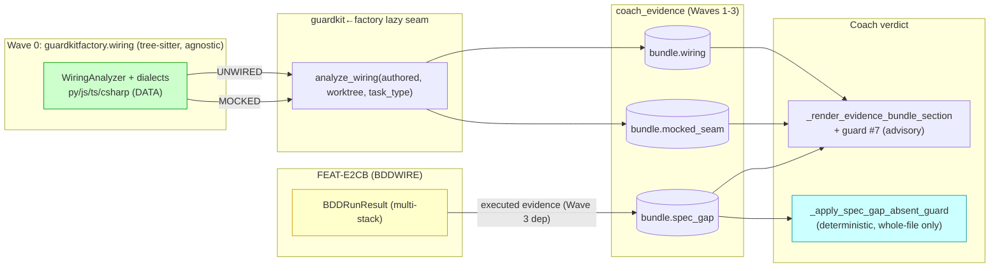
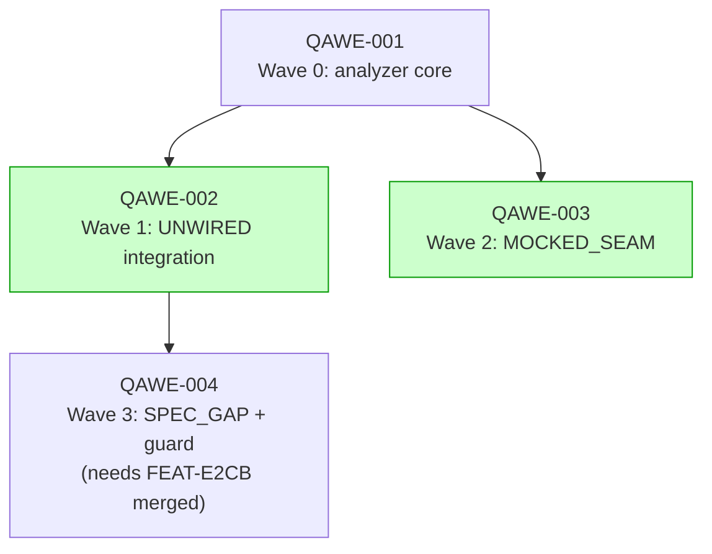

# Implementation Guide: FEAT-QAWE — Stack-agnostic wiring evidence

> Full design: [`docs/features/qa-verifier-wiring-probes-scope.md`](../../../docs/features/qa-verifier-wiring-probes-scope.md).
> QA-Verifier piece #2. Governing rule: `.claude/rules/stack-plugin-architecture.md`
> (stack-agnostic by default; plugin only for irreducible execution).

## Data Flow: Read/Write Paths

**Note:** `bundle.spec_gap` (Wave 3) reads executed evidence from **FEAT-E2CB
(BDDWIRE)** — cross-feature dependency, operator-sequenced (BDDWIRE merges first). All
analysis is stack-agnostic tree-sitter; the only plugin layer is BDD *execution*
(consumed, not duplicated).

## Task Dependencies

_QAWE-002 and QAWE-003 can run in parallel (both depend only on QAWE-001)._

## Waves

| Wave | Task | Focus | Complexity |
|---|---|---|---:|
| 1 | QAWE-001 | tree-sitter WiringAnalyzer + 4 dialects, fixture-tested, no guardkit integration | 6 |
| 2 | QAWE-002 | UNWIRED_PATH bundle integration (fields, gather, render) | 5 |
| 3 | QAWE-003 | MOCKED_SEAM evidence (parallel with Wave 2) | 4 |
| 4 | QAWE-004 | SPEC_GAP + deterministic hard-guard — **gated on FEAT-E2CB (BDDWIRE)** | 5 |

## Scope boundaries

Plugins ONLY for execution (the existing `guardkitfactory/bdd`, consumed by SPEC_GAP).
No new per-stack analysis code. QA-Verifier #1 (fine-tune) and #3 (glue-policy) OUT.
