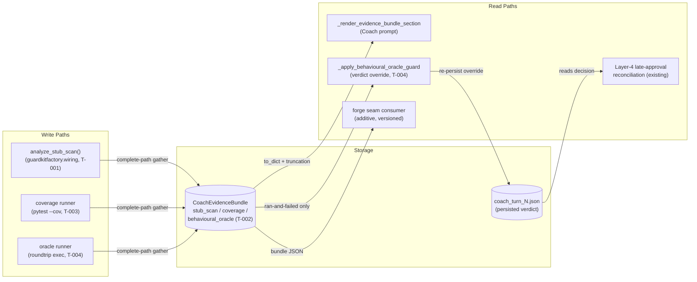
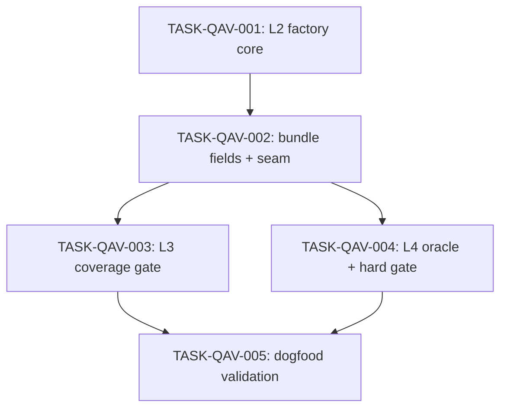

# Implementation Guide: QA Verifier Behavioural-Evidence Gates

**Parent review:** TASK-REV-QAVG · **Spec:**
`features/qav-behavioural-gates/qav-behavioural-gates.feature` (22 scenarios)
· **Consolidation:** `docs/retro/qa-verifier-state-consolidation-2026-07-04.md`

The three genuinely-NEW gates (L2 anti-stub · L3 coverage · L4 behavioural
oracle) extending — never duplicating — the built L1 wiring-evidence layer
(FEAT-C332). Approach = Option 1 of the review: factory-side tree-sitter
dialect DATA, guardkit-side sibling bundle fields via the proven lazy seam,
one deterministic hard gate (L4 ran-and-failed) with disk-persisted override.

## §1 Data Flow: Read/Write Paths



_Look for: every write path lands in the bundle; the only path that mutates a
verdict is R2, and it re-persists to S2 so R3 cannot resurrect a stale
approve. No disconnected read paths._

## §2 Integration Contract Sequence (complexity 7 ≥ 5)

```mermaid
sequenceDiagram
    participant CV as CoachValidator.gather_evidence
    participant GF as guardkitfactory.wiring
    participant CR as coverage runner
    participant OR as oracle runner
    participant AI as AgentInvoker (verdict seam)
    participant DISK as coach_turn_N.json

    CV->>GF: analyze_stub_scan(authored, worktree, task_type)
    GF-->>CV: stub_scan dict (status + findings) | None
    CV->>CR: run suite under coverage (worktree venv)
    CR-->>CV: coverage dict | None (absent on tool failure)
    CV->>OR: discover + run independent oracle
    OR-->>CV: behavioural_oracle dict | None
    CV-->>AI: CoachEvidenceBundle (3 new sibling fields)
    AI->>AI: _apply_behavioural_oracle_guard(bundle, decision)
    Note over AI: fires ONLY on ran-and-failed;<br/>absent/None = no-op
    AI->>DISK: re-persist overridden verdict
```

_Look for: no fetch-then-discard — every gathered dict reaches the bundle,
and the guard reads the bundle, not a side channel._

## §3 Task Dependencies



_All waves sequential (recommended_parallel: 1): T-003 and T-004 both edit
`coach_validator.py` + `agent_invoker.py`; parallelising them in a shared
worktree invites file conflicts, and the validated GB10 recipe runs
`--max-parallel 1` regardless._

## §4 Integration Contracts

### Contract: analyze_stub_scan
- **Producer task:** TASK-QAV-001 (guardkitfactory)
- **Consumer task(s):** TASK-QAV-002
- **Artifact type:** Python API (`guardkitfactory.wiring.analyze_stub_scan`)
- **Format constraint:** returns a plain dict via `.to_dict()` with `status`
  (FEAT-C332 vocabulary — no value maps to "pass") + `findings` list, or
  `None` when the probe legitimately did not run (task-type gate / zero
  targets). guardkit stores the dict, never the dataclass.
- **Validation method:** cross-repo seam test asserting the real installed
  factory exposes the callable + signature (mirror
  `tests/orchestrator/test_wiring_ctor_arity_seam.py`).

### Contract: bundle sibling fields (stub_scan, coverage, behavioural_oracle)
- **Producer task:** TASK-QAV-002 (field declaration + render)
- **Consumer task(s):** TASK-QAV-003 (populates `coverage`), TASK-QAV-004
  (populates `behavioural_oracle` + reads it in the guard), TASK-QAV-005
  (asserts end-to-end)
- **Artifact type:** `CoachEvidenceBundle` dataclass fields
- **Format constraint:** `Optional[Dict[str, Any]] = None`; `None` = absent
  (probe did not run) and MUST survive every serialization/reconciliation
  layer unchanged; positive status + `findings: []` = real clean verdict.
- **Validation method:** absent-vs-empty unit assertions per field (TASK-QAV-002
  AC-2) + the TASK-QAV-005 AC-4 end-to-end absence sweep.

## Execution notes

- **Cross-repo:** TASK-QAV-001 writes `../guardkitfactory` — the feature YAML
  declares `evidence_repos: ['../guardkitfactory']` so the evidence loop
  collects factory-side work (the FEAT-E2CB run-2 lesson,
  `.claude/rules/evidence-boundary-narrower-than-write-surface.md`).
- **Recipe:** build via the validated GB10 recipe (consolidation §3 /
  handoff §recipe): `GUARDKIT_COACH_GATHER=1 GUARDKIT_HARNESS=langgraph`,
  Player `qwen36-workhorse`, Coach `gemma4:26b`, `--max-parallel 1`; only
  `autobuild feature` works locally.
- **Verdict-policy guardrails:** L2/L3 advisory-only in v0 (no code override);
  L4 ran-and-failed is the single deterministic override and must re-persist
  to disk. Absent signals never pass, never block, never coerce.
- **Assumptions:** ASSUM-001…008 in
  `features/qav-behavioural-gates/qav-behavioural-gates_assumptions.yaml`
  (all low-confidence, --auto). ASSUM-003/005/006 are load-bearing — verify
  before or during Wave-2 review.
