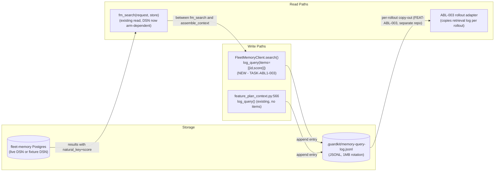
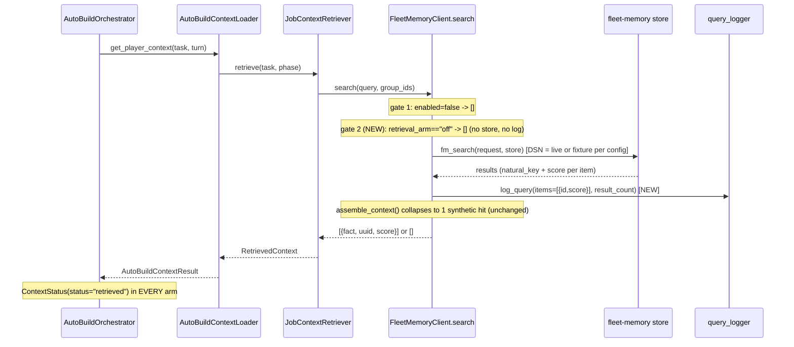
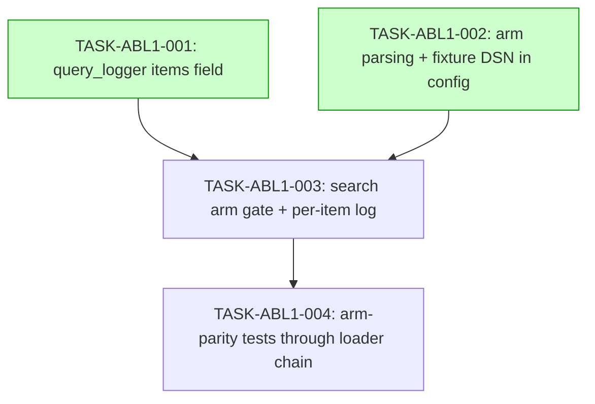

# Implementation Guide: Fleet-Memory Retrieval Arm Switch and Retrieval Logging (FEAT-ABL-001)

**Source spec**: `features/retrieval-arm-switch/retrieval-arm-switch.feature` (14 scenarios)
**Scope doc**: fleet-memory `docs/research/ideas/phase-ablation-scope.md` §4 FEAT-ABL-001
**Aggregate complexity**: 5 · **Tasks**: 4 · **Waves**: 3

## Why this shape

The ablation needs to toggle *retrieval only*. Both existing switches
(`FLEET_MEMORY_ENABLED=false`, `--no-context`) null the entire
`AutoBuildContextLoader` — turn-continuation state and template-pattern injection
included — so arms would diverge on far more than retrieval. The new
`FLEET_MEMORY_RETRIEVAL` switch is read at config load and enforced **inside**
`FleetMemoryClient.search`, mirroring the existing `enabled=false` gate
(`fleet_memory_client.py:257-258`), so every caller upstream of `search()` runs
byte-identical code on every arm.

Per-item retrieval identity only exists between `fm_search()` and
`assemble_context()` (`fleet_memory_client.py:304-305`) — after that the client
collapses results to one synthetic `uuid4()` hit (`:312-318`). The retrieval log
is therefore emitted exactly there, via a new optional `items:[{id,score}]` field
on `query_logger.log_query`.

## Data Flow: Read/Write Paths

_Look for: both log writers append to the same JSONL file; the per-item write (W1)
sits on the read path between the store and assembly. The R1 consumer lands in
fleet-evals (FEAT-ABL-003) — within this feature the log is write-side complete and
read by tests; this cross-repo read is deliberate, not a disconnection._

## Integration Contracts (sequence)

## Task Dependencies

_Tasks with green background (001, 002) touch disjoint files and can run in parallel as Wave 1._

## §4: Integration Contracts

### Contract: log_query items parameter
- **Producer task:** TASK-ABL1-001 (query_logger schema extension)
- **Consumer task(s):** TASK-ABL1-003 (search emits per-item entries)
- **Artifact type:** Python keyword parameter + JSONL schema field
- **Format constraint:** `items: Optional[List[Dict[str, Any]]] = None`; `None` → key omitted from entry (back-compat), list (incl. `[]`) → `"items"` key present verbatim; each dict `{"id": <natural_key str>, "score": <float>}`
- **Validation method:** Coach runs TASK-ABL1-001's unit tests; TASK-ABL1-003 tests parse the JSONL and assert the field shape

### Contract: FleetMemoryConfig.retrieval_arm / fixture_id
- **Producer task:** TASK-ABL1-002 (config parsing + DSN swap)
- **Consumer task(s):** TASK-ABL1-003 (gate reads `config.retrieval_arm`)
- **Artifact type:** dataclass fields
- **Format constraint:** `retrieval_arm ∈ {None, "off", "fixture:<id>"}` post-normalisation; invalid/unresolvable inputs are already collapsed to `"off"` by the producer, so the consumer gate only ever compares against `"off"` — it must NOT re-parse the raw env var
- **Validation method:** Coach runs TASK-ABL1-002's env-matrix unit tests; TASK-ABL1-003's gate tests construct configs with the three normalised values

## Environment contract (P4, for downstream ABL-003 rollouts)

| Variable | Arm | Effect |
|---|---|---|
| `FLEET_MEMORY_RETRIEVAL` unset/blank | live | current behaviour (plus per-item logging on searches) |
| `FLEET_MEMORY_RETRIEVAL=off` | off | `search()` returns `[]` before store access; zero log entries |
| `FLEET_MEMORY_RETRIEVAL=fixture:<id>` | fixture | `postgres_dsn` ← `FLEET_MEMORY_FIXTURE_DSN_<ID>` (uppercased id, non-alnum→`_`) or `FLEET_MEMORY_FIXTURE_DSN`; per-item log entries |
| set but invalid / fixture DSN unresolvable | off (fail-closed) | warning logged; never falls back to the live corpus |

## Execution Strategy

- **Wave 1** (parallel-safe): TASK-ABL1-001 (direct), TASK-ABL1-002 (task-work) — disjoint files
- **Wave 2**: TASK-ABL1-003 (task-work) — the choke-point change
- **Wave 3**: TASK-ABL1-004 (task-work, testing) — composed arm-parity evidence

Out of scope everywhere: fleet-memory sibling repo changes, CLI flags, changes to
the `[{fact, uuid, score}]` return contract, `--no-context`/`FLEET_MEMORY_ENABLED`
semantics.
