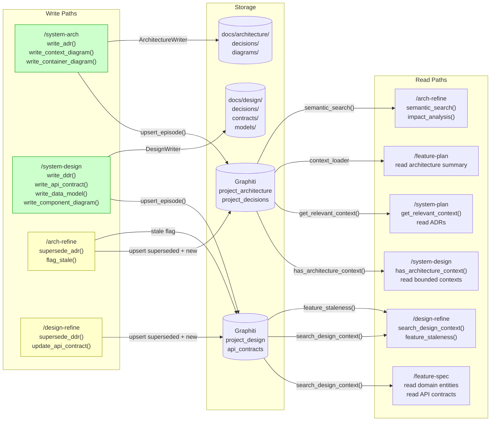
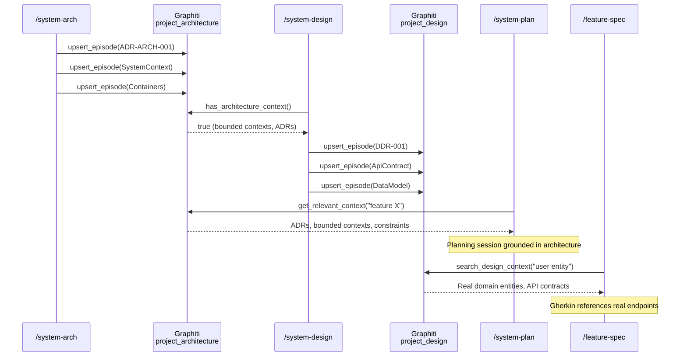
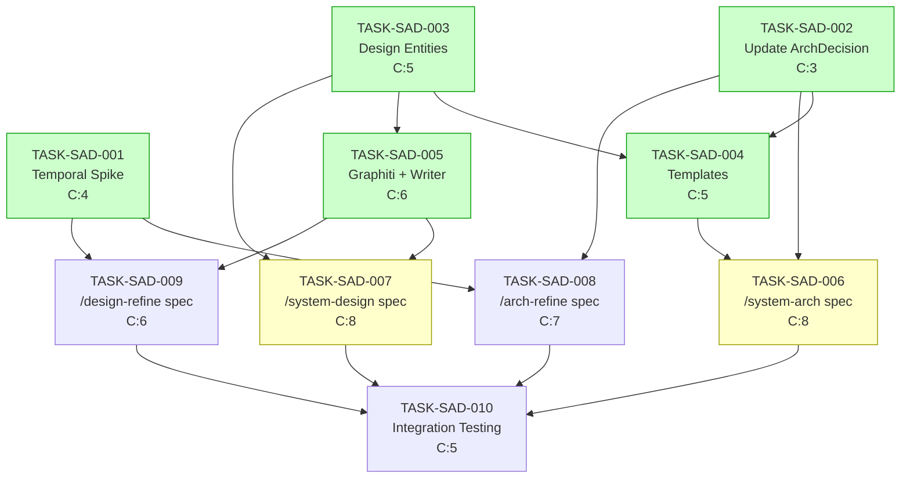

# Implementation Guide: System Architecture & Design Commands

## Data Flow: Read/Write Paths

This is the most important diagram — it shows every write path and every read path for the four new commands.



_Green = new write paths. Yellow = refinement/update paths. All read paths have corresponding write paths — no disconnections detected._

## Integration Contracts



_This diagram shows the sequential data flow through the pipeline. Each downstream command reads context seeded by upstream commands._

## Task Dependencies



_Green = can run in parallel within their wave. Yellow = high-complexity tasks requiring focused attention. C:N = complexity score._

## Execution Strategy

### Wave 1: Entity Foundation (Days 1-3)

3 tasks, all can run in parallel:

| Task | Title | Complexity | Parallel Group |
|------|-------|------------|---------------|
| TASK-SAD-001 | Temporal superseding spike | 4 | wave1 |
| TASK-SAD-002 | Update ArchitectureDecision dataclass | 3 | wave1 |
| TASK-SAD-003 | Create design entity dataclasses | 5 | wave1 |

**No file conflicts**: spike touches `tests/`, dataclass update touches `architecture_context.py`, new entities are new files.

### Wave 2: Templates + Services (Days 4-6)

2 tasks, can run in parallel:

| Task | Title | Complexity | Parallel Group |
|------|-------|------------|---------------|
| TASK-SAD-004 | Update ADR + create templates | 5 | wave2 |
| TASK-SAD-005 | SystemDesignGraphiti + DesignWriter | 6 | wave2 |

**No file conflicts**: templates are in `guardkit/templates/`, services are in `guardkit/planning/`.

### Wave 3: Command Specs (Days 7-14)

4 tasks with partial parallelisation:

| Task | Title | Complexity | Parallel Group |
|------|-------|------------|---------------|
| TASK-SAD-006 | /system-arch command spec | 8 | wave3a |
| TASK-SAD-007 | /system-design command spec | 8 | wave3a |
| TASK-SAD-008 | /arch-refine command spec | 7 | wave3b |
| TASK-SAD-009 | /design-refine command spec | 6 | wave3b |

**Parallel groups**: SAD-006 + SAD-007 can run in parallel (different files). SAD-008 + SAD-009 can run in parallel after SAD-001 spike completes.

### Wave 4: Integration Testing (Days 15-18)

1 task, sequential (depends on all Wave 3 tasks):

| Task | Title | Complexity |
|------|-------|------------|
| TASK-SAD-010 | Integration testing | 5 |

## Architecture Notes

### Existing Infrastructure Reuse

| Component | Existing | Reuse Plan |
|-----------|----------|------------|
| `SystemPlanGraphiti` | `guardkit/planning/graphiti_arch.py` | Extend or wrap for `/system-arch` |
| `ArchitectureWriter` | `guardkit/planning/architecture_writer.py` | Direct reuse for ADR/diagram writing |
| `ArchitectureDecision` | `guardkit/knowledge/entities/architecture_context.py` | Extend with 3 new fields |
| Entity pattern | `guardkit/knowledge/entities/*.py` | Follow for new entities |
| Template pattern | `guardkit/templates/*.md.j2` | Follow for new templates |

### New Components

| Component | File | Purpose |
|-----------|------|---------|
| `DesignDecision` | `guardkit/knowledge/entities/design_decision.py` | DDR entity |
| `ApiContract` | `guardkit/knowledge/entities/api_contract.py` | Per-bounded-context contract |
| `DataModel` | `guardkit/knowledge/entities/data_model.py` | Domain entities and relationships |
| `SystemDesignGraphiti` | `guardkit/planning/graphiti_design.py` | Graphiti ops for design layer |
| `DesignWriter` | `guardkit/planning/design_writer.py` | File output for design artefacts |
| `container.md.j2` | `guardkit/templates/container.md.j2` | C4 L2 Container diagram |
| `component-l3.md.j2` | `guardkit/templates/component-l3.md.j2` | C4 L3 Component diagram |
| `api-contract.md.j2` | `guardkit/templates/api-contract.md.j2` | API contract markdown |
| `ddr.md.j2` | `guardkit/templates/ddr.md.j2` | Design Decision Record |

### Key Technical Decisions

1. **ADR convention**: `docs/architecture/decisions/ADR-{PREFIX}-{NNN}.md` — matches existing code
2. **DDR convention**: `docs/design/decisions/DDR-{NNN}.md` — parallel structure
3. **Temporal superseding**: Data-level encoding via `superseded_by`/`supersedes` fields
4. **C4 syntax**: Native Mermaid C4 keywords (`C4Container`, `C4Component`)
5. **OpenAPI validation**: `openapi-spec-validator` as quality gate
6. **Protocol extensibility**: User-selectable protocol support in `/system-design`

## Risk Mitigations

| Risk | Mitigation | Owner |
|------|-----------|-------|
| Temporal superseding unproven | TASK-SAD-001 spike before Wave 3 | Wave 1 |
| OpenAPI generation quality | Validation gate in /system-design spec | TASK-SAD-007 |
| Diagram splitting (>30 nodes) | Warning at review gate (MVP) | TASK-SAD-006 |
| ADR location conflict | Follow existing code convention | All tasks |

## Next Steps

1. Review this implementation guide
2. Start with Wave 1 tasks (all 3 can run in parallel)
3. Wave 1 completion unblocks Wave 2
4. Wave 2 completion unblocks Wave 3
5. Wave 3 completion unblocks Wave 4 (integration testing)

Start implementation:
```bash
/task-work TASK-SAD-001  # Temporal superseding spike
/task-work TASK-SAD-002  # Update ArchitectureDecision
/task-work TASK-SAD-003  # Create design entities
```
