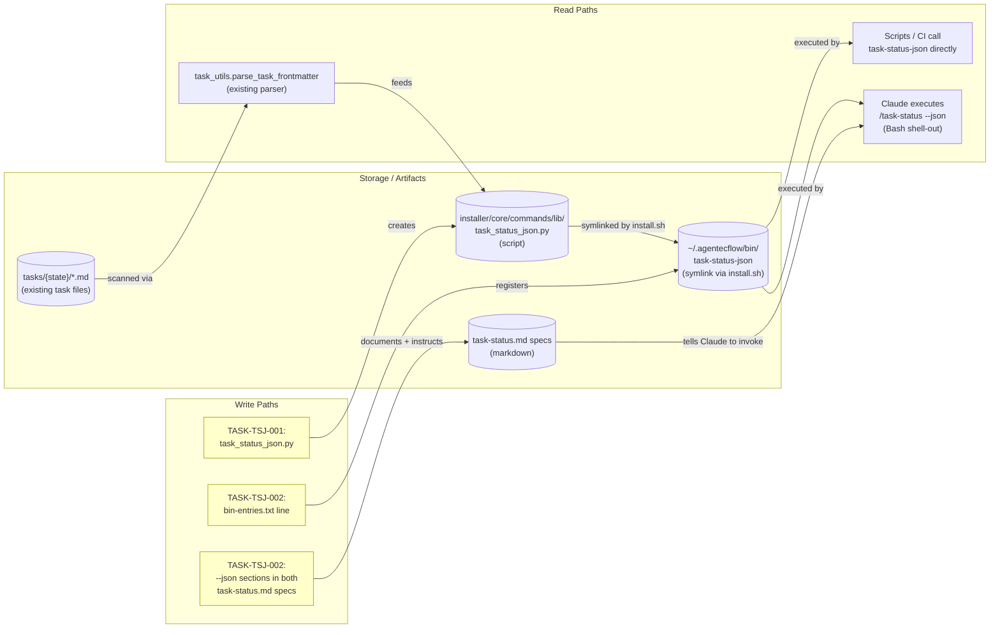

# Implementation Guide: /task-status --json (FEAT-9DDE)

**Parent review**: [TASK-REV-9DDE](../../../.claude/reviews/TASK-REV-9DDE-review-report.md)
**Approach**: Option 1 — deterministic producer script (Context B decision)
**Testing**: Standard (quality gates)
**Aggregate complexity**: 4/10 | **Estimated effort**: 3–5 hours

## Data Flow: Read/Write Paths



_What to look for: every write has a consumer. The script (S1) is read by both the Claude shell-out path (R1) and direct CLI callers (R2); the spec sections (S3) are what wire R1 to S2. **No disconnected paths** — the previously-orphaned `export:json` mention is replaced by this wired `--json` path._

**Disconnection Alert**: none. All write paths have callers.

## §4: Integration Contracts

### Contract: task-status-json
- **Producer task:** TASK-TSJ-001 (creates `installer/core/commands/lib/task_status_json.py`)
- **Consumer task(s):** TASK-TSJ-002 (references it from `bin-entries.txt` and both command specs)
- **Artifact type:** Python CLI script exposed as a `~/.agentecflow/bin/task-status-json` symlink
- **Format constraint:** the `bin-entries.txt` line must be the exact repo-relative path `installer/core/commands/lib/task_status_json.py`; the symlink name derives from the basename with underscores → hyphens. The script's stdout must be schema v1 JSON only (no banners, no log lines) so the spec's "output verbatim" instruction is safe.
- **Validation method:** seam test in TASK-TSJ-002 asserts the manifest line resolves to an existing file; TSJ-001's unit tests assert stdout contains nothing but valid JSON.

## Task Dependencies

Only 2 tasks — the dependency graph is trivial and sequential:

```
Wave 1: TASK-TSJ-001  (producer script + unit tests)   [task-work, complexity 4]
            ↓
Wave 2: TASK-TSJ-002  (bin entry + spec wiring)        [direct, complexity 2]
```

No parallel execution — TSJ-002's manifest line would dangle without TSJ-001's script on disk.

## Execution Strategy

| Wave | Task | Mode | Why |
|---|---|---|---|
| 1 | TASK-TSJ-001 | task-work | New module with quality gates: arch review, tests, coverage |
| 2 | TASK-TSJ-002 | direct | Mechanical manifest + doc edits; seam test validates the boundary |

## Key Design Decisions (from review)

1. **Deterministic producer over Claude-as-runtime JSON** — machine-readable output must be byte-stable; LLM-formatted JSON drifts. Follows the R1/R2 producer pattern (`generate_feature_yaml.py`, `feature_plan_bdd_link.py`).
2. **Schema v1 with `schema_version` field** — breaking changes bump the version; consumers can guard on it.
3. **Graceful degradation on malformed frontmatter** — emit `"parse_error": true` entries instead of crashing.
4. **Reuse `task_utils.py`** — no second frontmatter parser (DRY; single source of truth).

## Verification After Both Waves

```bash
# Re-run installer to create the symlink
./installer/scripts/install.sh

# Smoke: full dashboard
task-status-json --base-path . | python3 -m json.tool > /dev/null && echo OK

# Smoke: single task
task-status-json TASK-TSJ-001 --base-path .

# Unit + seam tests
pytest tests/unit/commands/test_task_status_json.py -v
```
