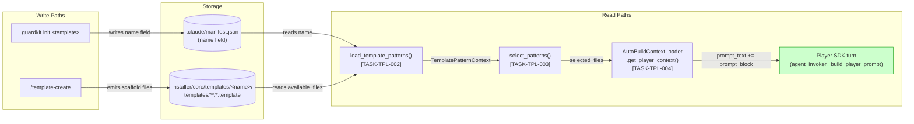
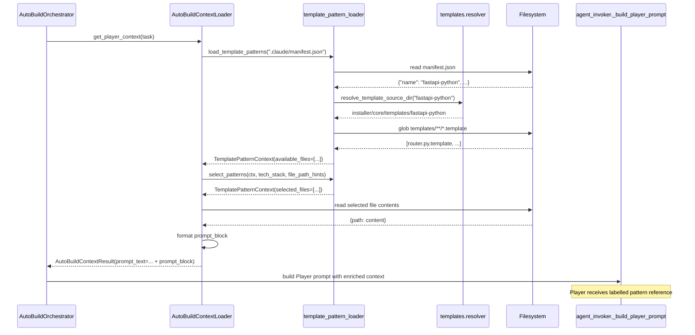
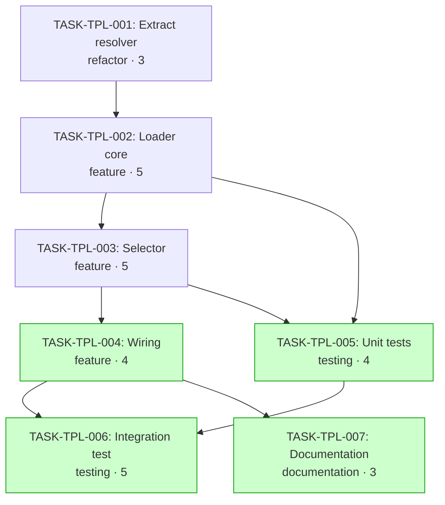

# Implementation Guide — FEAT-TPL-PLAYER

**Feature:** Template Pattern Layer — AutoBuild Player Context
**Spec:** [docs/features/FEAT-TPL-PLAYER-template-pattern-player-context.md](../../../docs/features/FEAT-TPL-PLAYER-template-pattern-player-context.md)
**Review:** [tasks/in_review/TASK-REV-B3F7-plan-template-pattern-player-context.md](../../in_review/TASK-REV-B3F7-plan-template-pattern-player-context.md)
**Generated:** 2026-04-11

## Overview

This feature gives the AutoBuild Player access to the parameterised `.template` files produced by `/template-create`, which have had no consumer since `agentic_init` was removed in TASK-INST-010. At build time, the loader reads `.claude/manifest.json`, resolves the source template, selects relevant `.template` files by tech-stack + file-path hints, and injects them as labelled reference context into the Player's prompt.

Planning incorporated three codebase-verification corrections to the original spec:

- **F1** — manifest field is `name`, not `template`
- **F2** — manifest path is `.claude/manifest.json`, not `.guardkit/manifest.json`
- **F3** — context is built by `guardkit/knowledge/autobuild_context_loader.py` + `guardkit/orchestrator/agent_invoker.py`; no `guardkit/autobuild/` package exists, and there is no `domain_tags` field — selection uses `TaskCharacteristics.tech_stack` + file-path hints instead

See [TASK-REV-B3F7](../../in_review/TASK-REV-B3F7-plan-template-pattern-player-context.md) for the full verification trail.

## Data Flow: Read/Write Paths



_All read paths have callers and all storage has producers — no disconnected paths. The write side relies on `guardkit init` already populating `.claude/manifest.json` (verified: [init.py:650-668](../../../guardkit/cli/init.py#L650-L668))._

## Integration Contracts (Sequence)



_Watch for: if `select_patterns` returns zero selected files, `prompt_block` must be empty string and the loader must log at debug level only — no warnings leaked to Player output (regression guard for US-3)._

## Task Dependency Graph



_Green nodes can run in parallel with their wave siblings: T4+T5 in Wave 4, T6+T7 in Wave 5._

## §4: Integration Contracts

### Contract: `MANIFEST_NAME`
- **Producer task:** `guardkit init` (existing, unchanged)
- **Consumer task(s):** TASK-TPL-002
- **Artifact type:** JSON field in `.claude/manifest.json`
- **Format constraint:** Top-level `name: str` (non-empty). The field is written as a raw-copy of the template's own `manifest.json` ([init.py:650-668](../../../guardkit/cli/init.py#L650-L668)). When a template extends another, the merged manifest's `name` reflects the most-derived template (correct for pattern resolution).
- **Validation method:** Seam test in TASK-TPL-002 asserts JSON parse + `name` field presence + non-empty string. Graceful-degradation test asserts that missing/invalid manifest yields `TemplatePatternContext(template_name=None)` without raising.

### Contract: `TemplatePatternContext`
- **Producer task:** TASK-TPL-002
- **Consumer task(s):** TASK-TPL-003, TASK-TPL-004
- **Artifact type:** Python dataclass exported from `guardkit.knowledge.template_pattern_loader`
- **Format constraint:**
  ```python
  @dataclass
  class TemplatePatternContext:
      template_name: Optional[str]
      template_dir: Optional[Path]
      available_files: List[Path]
      selected_files: List[Path]   # empty until selector runs
      prompt_block: str            # empty until wiring runs
      warnings: List[str]
  ```
  Consumers read `available_files` (TASK-TPL-003) and `selected_files` + `template_dir` (TASK-TPL-004). Consumers MUST NOT mutate `available_files` or `template_name`. Selector populates `selected_files` in place; wiring populates `prompt_block`.
- **Validation method:** Seam tests in TASK-TPL-003 and TASK-TPL-004 verify:
  - Dataclass field names and types match the contract
  - Selector respects the `max_files=5` cap
  - Selector does not mutate `available_files`
  - `prompt_block` is a non-empty string containing `"Stack Pattern Reference"` and the template name when `selected_files` is non-empty

⚠️ These are the only cross-task data dependencies in this feature. Unspecified cross-task contracts are the #1 source of integration-boundary bugs — each contract above has an explicit seam test requirement.

## Execution Waves

| Wave | Tasks | Can Parallel? |
|------|-------|---------------|
| 1 | TASK-TPL-001 | — |
| 2 | TASK-TPL-002 | — |
| 3 | TASK-TPL-003 | — |
| 4 | TASK-TPL-004, TASK-TPL-005 | ✅ yes (independent consumers of T3) |
| 5 | TASK-TPL-006, TASK-TPL-007 | ✅ yes (integration test + docs) |

## Feature-Level Acceptance Criteria

1. When AutoBuild runs on a project with `.claude/manifest.json` containing a resolvable template `name`, the Player receives relevant `.template` files in its context payload.
2. Pattern selection is filtered by `TaskCharacteristics.tech_stack` and task file-path hints, capped at 5 files / ~3000 tokens.
3. Projects with missing/unresolvable manifest `name` run identically to today — no errors, no warnings leaked to Player output (US-3 regression guard).
4. AutoBuild logs list which patterns were loaded, which were skipped, and why (US-4).
5. Unit + integration tests cover resolver, selector, graceful degradation, and both integration contracts via seam tests.
6. Manual validation: at least 2 AutoBuild runs on a templated project demonstrate improved pattern adherence in Player output (recorded in feature completion notes).
7. All modified files pass project-configured lint/format checks with zero errors.

## Risks

| Risk | Mitigation |
|------|------------|
| Context window overflow from pattern flood | Hard cap 5 files / ~3000 tokens in TASK-TPL-003; oversize skips logged |
| `tech_stack` + file-paths too coarse | Alphabetical fallback (spec §7); explicit mapping deferred to v2 if users complain |
| Missing `name` in older projects' manifests | Graceful degradation validated in TASK-TPL-005 |
| Resolver refactor breaks `cli/init.py` | T1 is pure extract-and-import; existing `init` test suite catches regressions |

## Next Steps

1. Review this guide and the 7 task files
2. Run `/feature-build FEAT-TPL-PLAYER` for autonomous implementation, OR
3. Start with `/task-work TASK-TPL-001` for manual wave-by-wave execution
4. After TASK-TPL-004 ships, verify the pattern block appears in a real AutoBuild turn before proceeding to TASK-TPL-006 / TASK-TPL-007
